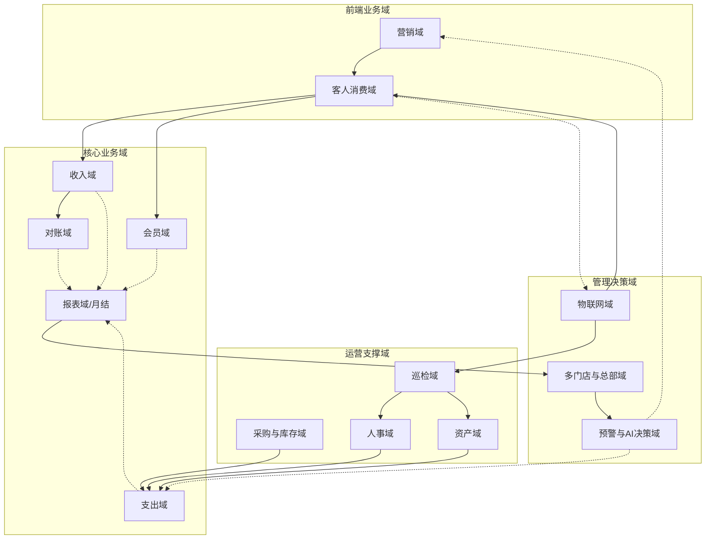

# 高岸茶室ERP系统需求说明书

**版本**：V10.7
**日期**：2026年5月7日
**文档状态**：评审中
**编制依据**：
- 《高岸账务结算规范2025》
- 《金德店月度经营报告-2026年4月》
- 《月结操作规范》
- 《月结计算器》
- 面向对象建模方法论（方法论1、2、3、4）
- 《AI时代的平台型智能架构（企业经营版）V8.5》
- 高岸品牌第一次需求评审会议纪要（2026年5月3日）
- 20060501需求讨论结果

---

## 第一章：引言

### 1.1 项目背景

高岸茶室目前以连锁门店模式运营（盈隆店、金德店、盈丰店等），日常经营涉及空间租用（包间、会议室）和零售（茶叶、茶具、茶点）两条主营业务线，同时存在会员充值、广告分成、充电宝等辅助收入。支出方面涉及广告费、场地成本、人力成本、采购、资产折旧、总部费用分摊等多种类型。

当前各门店的数据（订单、收入、支出、库存）分散在随手记、Excel、各平台后台（美团、抖音、茗匠等），月结工作依赖手工汇总，对账耗时且容易出错。智能化设备（门锁、空调、灯光）未与经营系统联动，客人从预约到退房全流程存在较多人工干预。

本项目旨在建立统一的ERP系统，实现**全自动月结**和**物联网设备全流程自动化**两大核心目标，支撑连锁化运营。

### 1.2 目标范围

#### 1.2.1 核心目标

| 目标编号 | 目标 | 说明 |
|----------|------|------|
| **G1** | 全自动月结 | 每月自动生成《月度经营报告》，收入自动归集、支出自动汇总、利润自动计算，替代手工Excel操作。 |
| **G2** | 物联网设备全流程自动化 | 从客人预约/支付到开门、使用、退房、保洁，全链条由系统自动控制门锁、灯光、空调、音乐等设备，减少人工干预。 |

所有其他功能（收支科目配置、多门店支持、报表导出、AI预警等）均为支撑上述两大目标而设。

所有其他功能（收支科目配置、多门店支持、报表导出、AI预警等）均为支撑上述两大目标而设。

| 原则 | 说明 |
|------|------|
| **财务驱动** | 所有业务动作（订单、采购、对账）最终必须产生财务凭证，月结报告所需的全部数据均来自系统内部，无需人工录入。 |
| **连锁架构** | 系统原生支持总部与多门店两级结构，每门店独立核算，总部可合并报表。 |
| **标准会计科目** | 收入与支出按标准会计科目框架组织，不随意自定义分类。 |
| **最简可用（IoT）** | 物联网控制操作简洁，一键切换模式（会议/K歌/品茶），避免复杂配置。 |
| **可扩展** | 预留平台接口和数据接口，支持后续新增门店、新增平台、高级预警分析。 |

#### 1.2.3 系统边界

| 包含范围 | 不包含范围（一期） |
|----------|-------------------|
| 门店日常经营（空间租用、零售商品） | 会员积分体系 |
| 财务月结、对账、支出审批 | 复杂税务自动计算（仅记录税金支出） |
| 完整进销存管理（采购、入库、库存预警、调拨） | 绩效考核 |
| 物联网设备联动（门锁、空调、灯光、音乐、窗帘） | 巡店视频AI分析 |
| 会员管理（充值、消费、余额、退费） | |
| 员工考勤、薪资核算 | |
| 门店巡检（经营检查+安全检查） | |
| 多门店独立核算、总部合并报表 | |
| 股东分红计算 | |
| 营销活动管理（活动创建、平台同步、效果分析） | |
| 客户获取与会员营销 | |
| AI经营预警与策略建议 | |

### 1.3 业务全景

#### 1.3.1 业务术语

| 术语 | 定义 |
|------|------|
| 空间租用 | 主营业务之一，客人按小时或场次租用茶室/会议室。 |
| 零售 | 主营业务之一，客人购买茶叶、茶点、茶具、套餐等商品。 |
| 会员卡 | 业务类型之一，客人充值预付款，属于债务性收入。 |
| 主营业务收入 | 会计概念，对应空间租用和零售。 |
| 其他业务收入 | 会计概念，对应充电宝、赔偿金等偶发收入。 |
| 订单 | 一次消费的完整记录，可包含多种业务类型。 |
| 收入流水 | 确认到账后的资金记录，每个订单可能产生多条流水。 |
| 会计凭证 | 日结汇总生成的记账凭证，符合会计准则。 |
| 结算周期 | 上月25日至本月24日。 |
| 对账工单 | 订单金额与平台账单不一致时自动创建的待处理任务。 |
| 差异工单 | 包含平台对账差异和ERP内部异常（未消费收款、消费未收款等）的工单。 |
| 请款 | 事先申请资金。 |
| 报销 | 事后凭票申请报销。 |
| 供应商 | 所有对外付款的接收方。 |
| 固定资产 | 会计准则定义的固定资产：使用年限超过一年、价值较高的资产。 |
| 巡检 | 门店日常经营情况检查（运营规范、服务质量）和安全检查（消防、卫生、设备等）。 |
| 考勤 | 员工通过移动端上下班打卡记录。 |
| 营销活动 | 在美团、抖音等平台或自有渠道开展的促销、推广活动。 |
| AI预警 | 系统通过数据分析和规则引擎，主动发现经营异常、风险隐患并提供策略建议。 |

**泳道图**：

#### 1.3.2 业务域关系

以下展示各业务域之间的核心关联关系：

**域间关系说明**：
- **营销域**驱动客户流入，触发**客人消费域**
- **客人消费域**产生**收入域**和**会员域**数据
- **收入域**和**支出域**的数据汇聚到**报表域**（月结）
- **对账域**保障收入数据的准确性
- **采购与库存域**、**资产域**、**人事域**产生支出数据
- **巡检域**监督门店运营，关联**资产域**和**人事域**
- **物联网域**为**客人消费域**提供自动化支撑（门禁、设备控制）
- **预警与AI决策域**跨域分析数据，为**营销域**和**支出域**提供策略建议

---

## 第二章：总体结构

### 2.1 业务域划分

系统按标准业务领域将全部功能划分为八个业务域，每个业务域对应一个组织部门，部门内的职能范围即该域在系统中的职责边界。

| 编号 | 业务域 | 对应部门 | 核心职责 |
|------|--------|---------|---------|
| D01 | 品牌运营域 | 品牌运营部 | 品牌战略、加盟管理、运营标准、品牌运营看板、投资者关系 |
| D02 | 门店拓展域 | 拓展部 | 门店招标、选址评估、门店建设、门店配置与参数管理 |
| D03 | 门店运营域 | 运营部 | 门店日常经营、客户服务、房态管理、保洁任务、门店巡检 |
| D04 | 市场营销域 | 市场部 | 客户获取、营销活动、优惠券管理、渠道运营 |
| D05 | 供应链域 | 采购部/仓储部 | 商品采购、库存管理、供应商管理 |
| D06 | 财务域 | 财务部 | 收入管理、支出管理、月结对账、股东分红、报表体系 |
| D07 | 人力资源域 | 人事行政部 | 考勤管理、薪资核算、员工档案 |
| D08 | 技术域 | 技术部 | IoT设备管理、智能场景控制、系统运维、AI经营预警 |

**域间关系说明**：各业务域通过统一的数据总线交换数据，不直接访问对方数据库。门店运营域为其他域提供业务事件驱动，财务域汇总各域产生的数据，技术域为门店运营域提供IOT自动化支撑。

#### 2.1.1 组织架构

高岸品牌采用树形组织架构：

- **根节点**：高岸总部（对应法人主体：高岸总公司）
- **一级节点**：各门店（对应法人主体：门店分公司或个体工商户）
- **二级节点**：门店下属部门（运营部、财务部、人事部等）
- **员工**：所有员工归属于某个部门

**基础实体说明**：系统需建立以下基础数据实体——
- **公司**：法人主体，含公司名称、统一社会信用代码、法人代表、注册地址
- **法人**：法定代表人信息，关联公司实体
- **股东**：品牌股东/门店股东，含持股比例、出资额、关联公司
- **资金账户**：各法人主体名下的银行账户，含开户行、账号、账户类型（基本户/一般户/专户）

各门店的财务独立核算，总部可查看全部门店合并报表。

### 2.2 子系统定义

每个业务域对应一个子系统，子系统负责该域的功能实现和数据管理。

| 子系统 | 对应业务域 | 主要用户 | 说明 |
|--------|-----------|---------|------|
| 品牌运营系统 | 品牌运营域 | 总部运营、投资人 | 品牌战略管理、加盟管理、运营标准制定、品牌运营看板、投资者关系 |
| 门店拓展系统 | 门店拓展域 | 总部拓展团队 | 门店招标、选址评估与审批、门店建设进度跟踪、门店配置管理 |
| 门店运营系统 | 门店运营域 | 店员、店长、客人 | 核心业务系统，处理预约、消费、房态等 |
| 营销系统 | 市场营销域 | 总部运营 | 活动创建、优惠券配置、效果分析 |
| 进销存系统 | 供应链域 | 店长、总部运营 | 采购、库存、供应商全链路管理 |
| 财务系统 | 财务域 | 财务、店长 | 月结、对账、分红、报表 |
| 人事系统 | 人力资源域 | 店长、总部 | 考勤、薪资、档案管理 |
| ERP支撑平台 | 技术域 | 系统管理员、技术运维 | ERP系统技术底座，含IoT设备管理、智能场景控制、AI经营预警引擎、系统日志与监控、运维管理 |

**子系统协作说明**：
- 门店运营系统通过IoT平台提供的设备控制能力实现自动化
- 财务系统汇总门店运营系统、供应链系统、人事系统产生的业务数据
- 品牌运营系统依赖财务系统提供的数据进行品牌分析
- 营销系统通过门店运营系统执行活动策略
- 系统间通过统一的数据总线交换数据，不直接访问对方数据库

### 2.3 客户端应用视图

系统通过五个微信小程序和PC端覆盖不同角色的使用场景，各终端的功能分配如下：

| 终端 | 使用角色 | 核心功能 | 使用方式 |
|------|---------|---------|---------|
| 客人端小程序 | 客人 | 包间预约、支付、商品购买、会员注册/充值/余额查询、优惠券查看、消费中续订/呼叫服务 | 微信小程序，扫码或搜索进入 |
| 店员端小程序 | 店员、店长 | 房态管理、保洁任务、对账工单、商品管理、库存操作、考勤打卡、门店巡检、IoT设备控制 | 微信小程序，店员账号登录 |
| 总部端小程序 | 总部运营、财务 | 各门店经营看板、收入/支出数据总览、月结报告查看、营销活动配置、预警通知 | 微信小程序，总部账号登录 |
| 加盟商端小程序 | 加盟投资人 | 加盟店经营数据查看、品牌管理费缴纳、总部通知公告、运营报表（简化视图） | 微信小程序，加盟商账号登录 |
| PC管理端 | 店长、财务、总部 | 报表深度分析、审批管理、基础数据配置、审计日志查看、系统管理 | PC浏览器 |

- 客人端是业务增长的核心入口，覆盖从引流到消费的全链路
- 店员端聚焦门店运营的移动化操作，默认展示工作台首页（待办事项、房态概览）
- 总部端面向多门店管理，提供综合数据看板和集中管控能力
- 加盟商端仅限查看本店数据，不可跨店访问

### 2.4 Microsoft CDM 实体映射参考

系统参考 Microsoft Common Data Model（CDM）标准实体定义，各业务域的核心概念映射至 CDM 标准实体，以规范数据结构、保证可扩展性和便于系统对接。

各业务域 CDM 实体映射概要：

| 高岸业务域 | 主要CDM实体 | 实体数 | 匹配度 |
|-----------|------------|-------|-------|
| D01 品牌运营域 | Organization/BusinessUnit/Goal/GoalMetric | 8 | 近似映射为主 |
| D02 门店拓展域 | Account/Lead/Opportunity | 3 | 精确映射为主 |
| D03 门店运营域 | Account/Contact/Order/Appointment/Service/Task | 12 | 精确映射为主 |
| D04 市场营销域 | Campaign/Lead/Opportunity/MarketingList | 9 | 精确映射为主 |
| D05 供应链域 | Product/Supplier/Inventory/Procurement/Warehouse | 15 | 精确映射为主 |
| D06 财务域 | Ledger/Account/Invoice/JournalEntry/Budget | 14 | 近似映射为主 |
| D07 人力资源域 | Employee/Position/Schedule/Attendance/Payroll | 10 | 精确映射为主 |
| D08 技术域 | Device/SystemConfig/IoTAlert/AutomationRule | 5 | 概念映射为主 |

详细逐域实体映射说明（75个实体的精确映射/近似映射/概念映射标注）整理至独立文档《高岸ERP系统-CDM实体映射说明书》。

## 第三章：业务域详细需求

### 3.1 品牌运营域

品牌运营域是品牌的决策中枢，负责制定品牌发展战略、建设品牌标准体系、管理加盟体系与投资者关系。从系统开发视角，该域提供支撑品牌管控职能的业务模块，包括发展规划、品牌建设、品牌运营看板、投资者关系。各业务模块中涉及的审批流程均通过统一的工作流引擎驱动（详见 4.7 节工作流引擎要求）。

#### 3.1.1 发展规划

总部制定品牌中长期发展目标与经营计划，统筹门店拓展规划，跟踪战略执行进度。

**功能点**：目标管理体系、门店拓展规划、战略执行跟踪

#### 3.1.2 品牌建设

统一管理品牌标准、视觉资产和品牌制度，支撑品牌输出一致性。

**功能点**：
- 品牌标准管理：品牌定位文档（品牌价值主张）；视觉识别系统（VI规范归档及版本管理）；空间设计标准手册
- 品牌资产库：品牌数字资产（Logo、标准色、字体、品牌元素模板）；资产使用审批（下载、使用申请、审批授权）；资产使用追踪（记录哪些门店使用了哪些资产及时间）
- 品牌制度设计：运营标准手册、服务标准手册、员工行为规范（制定与发布）；品牌执行检查（门店巡检含标识规范、物料使用等合规项抽查）
- 新品牌入驻（未来扩展）：新品牌创建、品牌配置清单、品牌切换

#### 3.1.3 品牌运营看板

总部实时查看全品牌经营数据，支持跨店对比和决策分析。

**功能点**：
- 全品牌总览：营收、支出、利润、客流量、各店占比
- 门店经营数据对比：收入/支出/利润/客流/客单价
- 趋势分析：月度趋势、同比/环比
- 门店经营健康度评分（基于营收、成本、客流、巡检等综合指标）
- 异常门店自动标红

**看板模板（示例）**：

| 维度 | 指标 | 门店A | 门店B | 门店C | 目标值 |
|------|------|-------|-------|-------|-------|
| 营收 | 月营收（万元） | 12.5 | 8.6 | 5.2 | 10.0 |
| 营收 | 同比增长率 | +15% | +8% | -3% | +10% |
| 成本 | 成本率 | 42% | 48% | 55% | 45% |
| 客流 | 月新客数（人次） | 120 | 85 | 45 | 100 |
| 客单 | 平均客单价（元） | 156 | 128 | 142 | 150 |
| 会员 | 活跃会员数 | 280 | 165 | 89 | 200 |
| 效率 | 综合评分 | 92 | 78 | 65 | 85 |

#### 3.1.4 投资者关系

投资人查看投资门店的财务数据和分红记录。

**功能点**：
- 投资门店列表（用户投资的门店、持股比例）
- 财务看板：实时营收、门店利润排名（仅限投资门店）、近6个月利润趋势图
- 分红记录查看（历史分红明细、到账状态）
- 重大告警推送（设备批量离线、客流异常、对账大额差异）

**业务约束**：
- 投资人仅可查看自己投资的门店数据
- 财务看板数据基于已确认的月结报告，非实时流水
- 重大告警实时推送（不依赖月结周期）

**投资者关系看板（示例）**：

| 我的投资 | 投资门店数 | 总投资金额 | 累计分红 | 收益率 |
|---------|-----------|-----------|---------|-------|
| 数据 | 3家 | 25.0万 | 3.8万 | 15.2% |

| 投资门店详情 | 持股比例 | 月营收 | 月利润 | 累计分红 | 经营状态 |
|-------------|---------|-------|-------|---------|---------|
| 盈丰店 | 30% | 12.5万 | 2.8万 | 1.5万 | 正常 |
| 金德店 | 20% | 8.6万 | 1.5万 | 0.8万 | 正常 |

### 3.2 门店拓展域

门店拓展域负责品牌门店网络的规划、选址、建设与配置管理。从系统开发视角，该域管理门店从选址到开业的全过程，确保门店布局符合品牌战略、建设标准统一、运营参数规范配置。各业务模块中涉及的审批流程均通过统一的工作流引擎驱动（详见 4.7 节工作流引擎要求）。

#### 3.2.1 门店选址与建设

**泳道图**：

总部从选址到建设完成的全过程管理，支持投资者参与和不参与两种模式，记录门店建设投资，建设完成后自动转固。

**门店来源渠道**：
- 店长推荐：在职店长利用本地资源推荐选址
- 加盟商提供：加盟商自行寻找并推荐
- 总部物色：总部拓展团队自主选址

**功能点**：
- **门店选址与投资者参与模式**：
  - 选址信息上报（来源备注、商圈、地址、面积、周边环境、推荐理由）
  - 投资者看店（投资者实地看店后录入评价）
  - 投资者意向确认（投资者确认投资意向和投资金额）
  - 选址审批（总部评审 → 总经理批准）
  - 选址历史记录查询
- **门店建设**：
  - 建设费用归集（装修工程费、设备采购费、家具采购费、人工费等分项记录）
  - 建设进度跟踪（分阶段里程碑、时间节点、验收记录、施工单位信息）
  - 建设完成后自动转固（转固后不可修改，转为历史存档）
  - 转固后建设总成本归集至门店的固定资产台账
- **集中审批**：所有超出门店权限的申请自动汇集至总部集中审批列表，支持审批详情查看（申请内容、历史审批链、附件）、审批操作（通过/驳回/退回补充）、操作留痕、超时告警（超48小时未处理推送提醒）

**设计图与施工图管理**：
- 系统支持门店空间设计图、施工图、水电图的在线绘制与版本管理
- 设计参数模板化：门店面积、包间数量、设施配置等参数输入后，系统辅助生成标准空间布局方案
- 设计审批流程：设计图提交后经总部评审确认方可进入施工阶段
- 设计变更管理：施工过程中的设计变更须重新提交审批，变更历史完整留痕
- 图纸归档：完工后所有设计图、施工图、竣工图归档至对应门店的资产档案，支持后续查询与改造参考

#### 3.2.2 门店配置

总部统一管理各门店的经营参数和基础数据配置。

**功能点**：
- **门店基本信息**：
  - 门店创建与信息维护（名称、地址、电话、营业时间、门店类型：直营/加盟）
  - 门店状态管理（营业中/暂停营业/装修中/已关闭）
  - 门店经营参数配置（结算周期、配送费规则、保洁超时升级阈值）
- **空间管理**：
  - 空间创建与配置（名称、照片、容纳人数、设施类型、价格体系）
  - 空间状态管理（空闲/使用中/待打扫/维护中）
  - 设施标注（投影仪、音响、舞台、K歌设备等）
- **基础数据配置**：
  - 收支科目体系配置（一级科目、二级科目、适用门店）
  - 支付方式配置（微信/支付宝/会员余额，可按门店独立启用/关闭）
  - 审批流程配置（审批路由、金额阈值、审批节点）
  - 通用运营参数配置（营业时间模板、计费单位、超时策略）

**泳道图**：

### 3.3 门店运营域

门店运营域是品牌的核心业务域，覆盖客人从预约到退房的全流程消费体验、商品零售、房态管理、保洁任务和门店巡检。

#### 3.3.1 空间租用（包间预约与消费）

客人通过小程序选择门店、空间、时段，在线支付后系统自动确认预约、下发门禁密码并联动IoT设备。

**前置条件**：客人已登录小程序（支持微信一键登录，无需注册）；所选门店在营业时间内；所选空间在目标时段内空闲。

**流程规则**：
1. 客人进入小程序首页，选择目标门店（展示门店图片、评分、距离）
2. 选择空间（展示空间图片、容纳人数、价格、设施说明）
3. 选择日期和时段（以30分钟为单位，展示可预约时段）
4. 确认订单信息，选择支付方式（微信/支付宝/会员余额）
5. 支付成功 → 系统生成预约单
6. 系统自动生成临时门禁密码（支持离线动态密码方案）
7. 发送预约成功通知（门禁密码、使用指引）
8. 预约开始前5分钟，系统下发预冷/预热指令给IoT平台

**业务规则**：
- 预约范围：当前时间+2小时至30天内
- 预约最小单位：30分钟
- 超时取消：到达预约时间30分钟未开门，系统自动取消预约并释放空间
- 取消政策：预约开始时间前2小时以上免费取消；2小时内取消收取50%费用；超时取消全额收取
- 续订规则：使用中可通过小程序续订（延长时段并支付差价），每次续订最少1小时
- 同一时段同一空间不可重复预约

**泳道图**：

**异常处理**：
- 支付成功但系统异常 → 无法确认订单时标记为“人工处理”，通知店长
- 门禁密码下发失败 → 店员通过远程控制手动开门
- 预约时段IoT设备故障 → IoT平台告警，推送店员处理

#### 3.3.2 商品零售

客人通过小程序在线点单购物（茶叶、茶点、茶具、套餐），支持自提及外卖配送。

**前置条件**：商品已上架且有库存；自提需在营业时间内；外卖配送范围内。

**流程规则**：
1. 浏览商品分类（茶叶/茶点/茶具/套餐），支持搜索和筛选
2. 查看商品详情（图片、价格、规格说明）
3. 加入购物车或直接购买
4. 选择配送方式（自提/外卖），外卖需填写地址并计算运费
5. 确认订单并支付
6. 自提：生成取货码，到店核销；外卖：店员发货

**业务规则**：
- 商品支持多种规格（茶叶可按泡/罐/斤计价）
- 实时扣减库存，库存不足时自动停止下单
- 配送费规则可配置（满免/固定/按距离）

**异常处理**：
- 支付成功但库存不足 → 系统锁定库存，若确认无货则退款
- 外卖未及时取货 → 超过48小时未取自动退款

**泳道图**：

#### 3.3.3 房态管理

店员/店长实时查看所有空间状态（空闲/使用中/待打扫/维护），支持远程控制设备。

**流程规则**：
1. 进入房态管理页面（平面图/列表两种视图）
2. 查看各空间状态（颜色区分：绿色=空闲、蓝色=使用中、黄色=待打扫、红色=维护）
3. 点击空间查看详情（当前订单信息、剩余时间、设备状态）
4. 远程控制操作（开门、调温、关灯、强制退房），需填写操作原因并关联工单ID

**业务规则**：
- 空间状态由系统自动更新（开门→使用中，退房→待打扫，保洁完成→空闲）
- 远程控制记录自动写入操作日志（操作人、时间、操作内容、原因）
- 强制退房须填写原因并关联工单ID记录审计日志

**异常处理**：
- 远程控制失败 → 提示设备离线状态，建议店员手动操作

#### 3.3.4 保洁任务

客人退房后系统自动生成保洁任务，指派当值店员。超时未接单通知店长。

**流程规则**：
1. 系统自动生成保洁任务（含空间名称、退房时间、清洁要求）
2. 推送至店员端（按时间顺序排列，超时高亮）
3. 店员接单 → 到达空间 → 开始清洁 → 完成清洁
4. 店员点击“完成”，系统更新空间状态为“空闲”

**业务规则**：
- 超时定义：退房后30分钟未接单，推送提醒至店长
- 清洁中不可预订，完成后自动释放
- 完成清洁需店员手动确认，系统不自动判定

**异常处理**：
- 店员超时未接单（30分钟）→ 店长收到提醒，重新指派
- 清洁中发现设备故障 → 店员在保洁页面标记异常，自动生成设备维修工单

**泳道图**：

#### 3.3.5 巡店管理

店长/店员按巡检模板检查门店经营状况和安全状况，异常项自动创建整改工单。

**功能点**：
- **巡检模板配置**：总部配置巡检模板（经营检查+安全检查），每日/每周/每月自动生成任务
  - 经营检查项：服务质量、人员到岗、商品陈列、环境卫生、仪容仪表
  - 安全检查项：消防设备、电器安全、疏散通道、监控设备、门锁状态
- **巡检执行**：逐项检查（正常/异常），异常需拍照并填写说明
- **整改工单**：店长审核巡检报告，对异常项创建整改工单，指派责任人跟踪至关闭
- **巡检统计**：各店巡检完成率、异常项分类统计、平均整改时长

**业务规则**：
- 巡检频率可配置，默认每日一次
- 超时12小时未完成升级提醒店长
- 连续3次巡检完成率<80%自动告警总部

**泳道图**：

### 3.4 市场营销域

市场营销域管理所有市场推广活动、优惠券发放核销和客户获取渠道分析，是业务增长的起点。

#### 3.4.1 营销活动

总部运营创建营销活动，支持多种活动类型，审批通过后自动同步至第三方平台。

**流程规则**：
1. 总部运营进入营销管理模块，点击“创建活动”
2. 选择活动类型：限时折扣/满减优惠/新客礼包/充值赠送/会员专享
3. 配置活动参数（活动名称、时间范围、折扣力度、适用商品范围、适用门店、目标人群）
4. 设置活动预算上限和风控规则
5. 提交审批（经审批流后活动自动生效）
6. 审批通过后活动自动生效，系统同步至各平台（美团、抖音、小程序）
7. 活动期间实时展示数据（曝光量、参与量、核销量、优惠金额）
8. 活动结束后自动归档，生成效果分析报告

**业务规则**：
- 同一商品同一时段不可叠加多个活动
- 活动预算超支时自动暂停
- 活动信息可修改（仅限未开始的活动）
- 活动涉及价格变动的，必须在系统内创建并同步至平台，严禁在平台侧直接修改价格

**泳道图**：

#### 3.4.2 优惠券管理

系统支持创建和发放优惠券，客人领取后可在下单时抵扣。核销后根据消费行为自动打标签，积累消费画像用于精准营销。

**流程规则**：
1. 创建优惠券模板（类型：满减券/折扣券/现金券/赠品券）
2. 配置面额、使用门槛、有效期、适用商品范围
3. 选择发放方式：
   - 新会员注册自动发放（新人礼包）
   - 充值后赠送
   - 消费后赠送
   - 手动定向发放（指定会员或人群）
4. 客人领取后存入账户，下单时自动匹配可用优惠券
5. 核销后记录使用明细，根据核销行为自动更新客户标签

**业务规则**：
- 优惠券不可叠加使用，一笔订单限用一张
- 过期优惠券自动失效
- 退单时优惠券按规则退回（若仍在有效期内）
- 优惠券核销数据纳入营销费用核算

**泳道图**：

**客户标签闭环**：核销后系统根据消费行为自动更新客户标签（如“价格敏感型”“特定时段活跃”“高客单价”），积累消费画像用于后续精准营销。

### 3.5 供应链域

供应链域覆盖商品采购、库存管理和供应商管理全链路，保障门店运营所需物资的及时供应。

#### 3.5.1 采购管理

门店发起采购申请，经审批后形成采购订单，到货后验收入库。

**前置条件**：采购商品已维护至系统；供应商信息已注册。

**流程规则**：
1. 店员/店长发起采购申请（可基于库存预警自动生成建议采购单）
2. 选择商品、数量、供应商，填写期望到货日期
3. 提交审批（金额路由：<500元店长审批；500-5000元店长+财务；>5000元店长+财务+总部）
4. 审批通过后生成采购订单
5. 通知供应商发货（系统可打印采购单发送给供应商）
6. 到货后验收入库，系统记录实际到货数量
7. 生成入库单，更新库存

**异常处理**：
- 到货数量与采购数量不一致 → 差异记录，支持部分入库
- 商品质量不合格 → 退货并重新采购

**泳道图**：

#### 3.5.2 库存管理

系统管理各门店的商品库存，支持入库、出库、盘点、调拨全流程，并提供库存预警和批次追踪。

**功能点**：
- **库存台账**：按门店、商品SKU展示实时库存数量，支持查看出入库流水
- **入库管理**：采购到货入库、退货入库、调拨入库，记录批次号和有效期
- **出库管理**：销售出库（自动扣减）、调拨出库、报损出库
- **库存盘点**：店长发起盘点任务，系统生成盘点清单，店员逐项清点实物并录入，差异（盘盈/盘亏）经审批后调整台账
- **库存调拨**：门店间商品调拨，发起调拨申请→调出店出库→调入店入库，支持跨店审批
- **批次追踪与有效期管理**：入库时记录生产日期/批次号/有效期，出库时FIFO（先进先出）校验，到期前30天自动预警
- **库存预警**：低于安全库存阈值自动生成补货提醒，支持按商品独立配置阈值

**业务规则**：
- 库存变动实时更新，每笔出入库均记录操作人、时间、数量、原因
- 盘点差异须店长审批，盘亏报损需说明原因
- 调拨在途商品不纳入双方门店可用库存
- 到期商品系统自动锁定不可销售

**泳道图**：

**泳道图**：

#### 3.5.3 供应商管理

所有对外付款的接收方纳入供应商库统一管理，请款/报销时必须从供应商库中选择。

**功能点**：
- 供应商信息管理：编号、名称、类型（商品供应商/场地出租方/广告服务商/人力服务商/固定资产供应商/其他）、联系人、电话、银行账户、税号、付款条件（月结/现结/预付）
- 请款或报销必须从供应商库中选择
- 供应商支持启用/禁用
- 供应商历史交易查询

### 3.6 财务域

财务域是系统的核心数据汇聚域，负责收入归集、支出管理、月结对账、股东分红和报表输出，确保财务数据的准确性和完整性。

#### 3.6.1 收入管理

系统自动归集所有收入，按标准科目框架分类。收入按主体分为总部收入和门店收入两大类别。

| 收入主体 | 一级科目 | 二级科目 | 来源 |
|---------|---------|---------|------|
| **总部** | 主营业务收入 | 品牌特许经营收入（加盟金） | 加盟合同签约 |
| **总部** | 主营业务收入 | 品牌管理费 | 加盟店年度管理费 |
| **总部** | 主营业务收入 | 设计费 | 门店空间设计服务 |
| **总部** | 主营业务收入 | 供应链收入（茶叶销售） | 向各门店销售茶叶/茶具 |
| **门店** | 主营业务收入 | 空间租用收入 | 包间/空间租用订单 |
| **门店** | 主营业务收入 | 商品零售收入 | 零售订单 |
| **门店** | 其他业务收入 | 平台补贴收入 | 平台结算单 |
| **门店** | 其他业务收入 | 充电宝分成 | 供应商结算 |
| **门店** | 其他业务收入 | 广告收入 | 合同确认 |
| **门店** | 其他业务收入 | 赔偿金 | 偶发收入 |
| **门店** | 债务性收入 | 会员充值 | 充值记录（递延确认） |

**功能点**：
- 空间租用收入：退房时自动按实际使用时长或套餐固定金额计算，生成收入流水
- 零售商品收入：商品订单完成支付后自动生成收入流水，同步扣减库存
- 会员充值：充值时不确认为营业收入，记为预收账款（债务性收入），消费时转入主营业务收入
- 其他业务收入：充电宝分成、赔偿金等偶发收入支持手工录入，需上传凭证
- 每日凌晨自动汇总前一日所有已完成订单，按门店、业务类型、支付方式分组统计，生成日结凭证

#### 3.6.2 支出管理

管理所有对外付款，涵盖请款（事前）、报销（事后）和自动归集支出。

**功能点**：
- **请款申请（事前）**：填写用途、预估金额、收款供应商、期望付款日期，上传附件（合同/报价单），提交后启动审批流
- **报销申请（事后）**：填写费用明细、金额、发生日期，上传凭证（发票/收据/平台截图），提交后启动审批流
- **广告费自动归集**：系统每月定时从美团、抖音广告后台拉取广告消耗金额，生成支出记录
- **固定支出录入**：房租、水电、物业费等由总部或店长手工录入，需上传合同或账单
- **薪资导入**：每月薪资Excel导入，系统自动计算实发工资并生成人力成本支出
- **管理费用分摊**：总部管理费用月末按各店营收占比自动分摊至门店

**泳道图**：

**泳道图**：

**支出科目框架**：广告费、场地成本、人力成本、采购成本、资产折旧、管理费用、税费、其他

**审批路由**：<500元店长审批；500-5000元店长+财务会签；>5000元店长+财务+总部会签（后台可配置）

#### 3.6.3 自动月结

每月25日自动结算上月25日至本月24日的经营数据，生成月结报告。

**流程规则**：
1. 每月25日凌晨自动触发月结流程
2. 汇总期内所有已完成订单的收入数据，按科目分类
3. 汇总期内所有支出数据，按科目分类
4. 自动计提当月固定资产折旧
5. 自动分摊总部管理费用
6. 计算各门店利润 = 收入 - 支出 - 折旧 - 分摊费用
7. 生成月结报告（损益汇总、收入明细、支出明细）
8. 集团合并报表（汇总各门店数据）
9. 推送报告至相关方（店长、财务、总部、投资人）

**泳道图**：

**月结报告结构（Excel输出）**：

**工作表1：收入明细**

| 字段 | 说明 | 数据来源 |
|------|------|---------|
| 门店名称 | 高岸分店 | 系统门店信息 |
| 日期 | 日结日期 | 系统日结记录 |
| 订单编号 | 系统订单号 | ERP订单系统 |
| 平台 | 美团/抖音/支付宝/微信/现金 | 支付渠道 |
| 商品/服务 | 具体消费项目 | 订单明细 |
| 订单金额 | 客人下单总金额 | 订单金额 |
| 平台优惠 | 平台承担优惠 | 平台结算单 |
| 商家优惠 | 商家承担优惠 | ERP优惠券系统 |
| 平台服务费 | 平台抽成 | 平台结算单 |
| 达人佣金 | 达人带货分成（仅抖音） | 抖音结算单 |
| 实收金额 | 最终到账金额 | 平台结算单 |
| 支付时间 | 实际支付时间 | 支付回调 |
| GL凭证号 | 关联会计凭证号 | GL系统 |

**工作表2：支出明细**

| 字段 | 说明 | 数据来源 |
|------|------|---------|
| 门店名称 | 高岸分店 | 系统门店信息 |
| 日期 | 支出日期 | 支出单据 |
| 单据编号 | 申请单号/报销单号 | 支出管理系统 |
| 支出科目 | 一级/二级科目 | 科目表配置 |
| 供应商/收款人 | 收款方名称 | 供应商/员工信息 |
| 金额 | 含税金额 | 支出单据 |
| 税率 | 增值税率 | 税务配置 |
| 不含税金额 | 税前金额 | 自动计算 |
| 税额 | 增值税额 | 自动计算 |
| 支付方式 | 对公转账/备用金/报销 | 支付方式 |
| 支付状态 | 已支付/待支付/审批中 | 支出管理 |
| GL凭证号 | 关联会计凭证号 | GL系统 |

**工作表3：损益汇总**

| 字段 | 金额 | 说明 |
|------|------|------|
| 营业收入 | 汇总 | 各平台实收金额 + 线下收款 |
| 减：平台服务费 | 汇总 | 各平台抽成合计 |
| 减：营销费用 | 汇总 | 优惠券补贴 + 满减活动 |
| 减：原材料成本 | 汇总 | 当期消耗物料成本 |
| 减：人力成本 | 汇总 | 工资 + 社保 + 公积金 |
| 减：折旧费用 | 汇总 | 固定资产折旧 |
| 减：运营费用 | 汇总 | 房租、水电、物业等 |
| 营业利润 | = 收入 - 各项费用 | — |
| 加：平台补贴收入 | 汇总 | 平台营销补贴 |
| 加：品牌特许经营收入 | 汇总 | 加盟金/品牌管理费 |
| 净利润 | = 营业利润 + 补贴 + 特许收入 | — |

#### 3.6.4 智能对账

系统在实时、日结、月结三个层级自动对账，确保收入数据准确。差异工单自动创建并推送处理。

**收入渠道对账口径**：

| 收入渠道 | 对账口径 | 查询路径 |
|---------|---------|---------|
| 美团茶室-团购 | 按打款记录录账，结算周期内 | 美团开店宝（非餐饮版）> 打款记录 |
| 美团CAFE-团购 | 按商家应得录账，结算周期内 | 美团开店宝（餐饮版）> 每日收益 |
| 美大收钱码 | 次日到账，查询上月24日～本月23日 | 美团开店宝 > 收钱助手 |
| 抖音券 | 周期性到账，按商家应得录账 | 抖音来客 > 到账与收益 |
| 高德券 | 待调研（优先API，否则手工导入） | 高德平台 |
| 茗匠结算 | 次日到账，查询上月24日～本月23日 | 汇旺财 > 结算查询 |
| 微信支付（直连） | API自动，T+1到账 | 微信商户平台 |
| 会员余额消费 | 系统内部自动，消费时转营收 | ERP内部账户 |
| 银行转账 | 半自动，导入银行流水 | 银行对账单 |
| 现金 | 手工录入，现金转微信后核销 | 门店日报 |
| 公账收入 | 手工录入，财务确认 | 财务确认 |
| 充电宝租赁分成 | 美团开店宝充电宝模块，手工确认 | 美团开店宝 |
| 平台补贴收入 | 按平台结算单确认 | 各平台结算中心 |

**对账说明**：
- 美团“茶室”类目与“CAFE”类目的结算科目不同，茶室类目按“房间费+商品费”合并结算，CAFE类目按单品结算
- 抖音结算单含订单金额、平台佣金、达人佣金、平台补贴四项，需分别入账
- 各平台均为T+1结算周期（美团结算周期为14天自动/可手工提现）
- 月结时以各平台结算单汇总金额与系统收入流水进行汇总比对（总额对账），确保账实一致

**差异类型**：
- 平台金额不一致：订单金额与平台结算金额不同
- 平台有系统无：平台有订单但ERP未记录
- 系统有平台无：ERP有订单但平台无记录
- ERP内部异常：未消费而收了钱、消费了却没收到钱、销售产品与收入金额不相符且无合理说明

**对账提醒**：
- 实时差异通过小程序订阅消息立即推送给当班店员
- 日结差异汇总推送给店长
- 月结未处理工单升级推送给财务

#### 3.6.5 股东分红

系统根据持股比例自动计算分红，支持品牌股东和门店股东两种类型。

**功能点**：
- **品牌股东**：持有高岸品牌股份，按品牌整体利润分红
- **门店股东**：仅持有一家门店股份，按该门店利润分红
- 分红计算：分红金额 = 净利润 × 持股比例（自动计算）
- 分红审批：分红方案提交财务审核→总经理批准后执行打款
- 分红记录：历史分红明细查询，到账状态跟踪

**泳道图**：

#### 3.6.6 报表体系

系统提供的核心财务报表：

| 报表名称 | 频率 | 内容 | 用户 |
|---------|------|------|------|
| 日结汇总表 | 每日 | 前一日所有已完成订单按门店、业务类型、支付方式分组汇总 | 店长、财务 |
| 月度经营报告 | 每月 | 损益表、收入明细、支出明细、趋势分析 | 店长、财务、总部、投资人 |
| 合并报表（集团） | 每月 | 全部门店汇总利润表、合并收入明细、合并支出明细 | 总部、投资人 |
| 渠道分析报告 | 每月 | 各渠道获客成本、转化率、ROI对比 | 总部运营 |
| 会计凭证 | 每日 | 日结时自动生成的借贷平衡凭证 | 财务 |
| 股东分红报告 | 每月 | 品牌股东和门店股东的分红明细 | 财务、股东 |

**泳道图**：

### 3.7 人力资源域

人力资源域覆盖员工信息管理、考勤管理和薪资核算。

#### 3.7.1 考勤管理

员工通过移动端小程序上下班打卡，系统自动比对排班标记异常。

**功能点**：
- **移动端打卡**：员工点击“上班打卡”/“下班打卡”，系统记录时间、门店
- **排班管理**：店长预先安排员工每日上下班时间、休息日，支持按周或按月重复
- **迟到/早退/漏卡**：系统自动比对排班标记异常，支持补卡申请（附说明，店长审批）
- **请假审批**：员工申请年假/病假/事假，经店长审批
- **法定假日**：预置国家法定假日，自动识别加班类型
- **月度考勤汇总**：每月最后一日自动生成考勤汇总表（应出勤、实出勤、迟到、早退、加班、请假）

**业务规则**：
- 请假超过3天需上传医院证明
- 考勤汇总表推送财务作为薪资核算依据
- 加班系数：平日1.5倍，休息日2倍，法定假日3倍

**泳道图**：

#### 3.7.2 员工档案

总部可创建、编辑、禁用员工账号，关联门店和角色权限。

**功能点**：
- 创建员工（姓名、手机号、所属门店、岗位、登录密码）
- 员工账号可关联多个门店（跨店调配）
- 员工离职后可禁用账号，保留历史记录
- 角色权限配置（店员/店长/财务/总部等）

#### 3.7.3 薪资核算

财务每月导入薪资Excel，系统自动计算实发工资并生成人力成本支出记录。

**流程规则**：
1. 财务导入薪资Excel（模板含员工姓名、门店、基本工资、绩效、社保等）
2. 系统自动计算实发工资 = 应发合计 - 社保（个人）- 个税
3. 生成人力成本支出记录
4. 总部人员薪酬按各店营收占比自动分摊至各门店
5. 支出记录纳入月结报表

### 3.8 技术域

技术域是ERP系统的技术底座，提供IoT设备管理、智能场景控制、AI经营预警和系统运维支撑。

#### 3.8.1 IoT设备管理

管理各门店的物联网设备，支持设备注册、状态监控、远程控制和故障告警。

**功能点**：
- **设备注册**：新设备接入时注册至系统（类型、编号、门店、空间位置）
- **状态监控**：实时展示设备在线/离线/故障状态
- **远程控制**：通过智能家居网关下发指令（开门、调温、开关灯等）
- **故障告警**：设备离线超30分钟自动告警，低电量提示
- **设备维保**：记录维修历史、维保计划、到期提醒

**泳道图**：

**设备类型**：智能门锁、中央空调（VRF）、灯光照明、电动窗帘、音响/背景音乐

#### 3.8.2 智能场景联动

根据客人消费状态自动切换设备组合配置，提供沉浸式空间体验。

**场景模式**：

| 场景 | 触发条件 | 灯光 | 空调 | 窗帘 | 音乐 |
|------|---------|------|------|------|------|
| 欢迎 | 预约开始前5分钟 | 迎宾模式（暖黄） | 预冷/预热至26℃ | 打开 | 轻音乐 |
| 品茶 | 客人扫码开门 | 品茶模式（3000K暖光） | 保持26℃ | 半开 | 古筝/轻音乐 |
| 会议 | 店员切换/预约指定 | 会议模式（4000K白光） | 24℃ | 关闭 | 关闭 |
| K歌 | 店员切换/预约指定 | K歌模式（氛围灯） | 24℃ | 关闭 | K歌系统 |
| 节能 | 退房后 | 关闭 | 关闭/设定26℃ | 关闭 | 关闭 |

**业务规则**：
- 场景切换可在小程序手动操作（客人或店员均可）
- 退房后自动切换为节能模式
- 物理开关/遥控器优先级高于系统指令（设备本地优先）

**泳道图**：

#### 3.8.3 AI经营预警

系统通过数据分析和规则引擎，主动发现经营异常和风险隐患并提供策略建议。

**预警类型及阈值**：

| 预警类型 | 判定条件（默认值） | 推送对象 |
|---------|------------------|---------|
| 营收异常下降 | 当日营收环比下降 ≥ 30%（或连续3日下降 ≥ 15%） | 店长、总部运营 |
| 成本异常上升 | 当月成本率环比上升 ≥ 10%（绝对值） | 店长、财务 |
| 对账大额差异 | 单笔差异金额 > 500元 或 日累计差异 > 1000元 | 店员、店长 |
| 库存积压 | 商品库存周转天数 > 90天 或 临期（< 30天）库存占比 > 20% | 店长、供应链 |
| 设备批量离线 | 单店离线设备数 > 3台 或 同一设备连续离线 > 24小时 | 店员、技术 |
| 客流异常 | 当日客流环比下降 ≥ 40%（排除节假日因素） | 店长、总部运营 |
| 差评预警 | 平台差评数量超过阈值（美团/抖音评分 < 4.5） | 店长、总部运营 |

**阈值配置说明**：
- 以上阈值均为系统默认值，支持按门店独立配置
- 环比计算周期：默认7天滚动环比，可切换为30天
- 预警频率：同一类型同一门店24小时内仅触发一次
- 预警升级：触发后4小时未被处理，升级推送至上一级管理员
- 静默期：已标记“已处理”的同类型预警，7天内不重复触发

**预警处理SLA**：
| 预警类型 | 响应时限 | 升级条件 |
|---------|---------|---------|
| 营收异常下降 | 2小时 | 超时→推送至总部运营总监 |
| 成本异常上升 | 4小时 | 超时→推送至财务总监 |
| 对账大额差异 | 1小时 | 超时→推送至财务经理 |
| 库存积压 | 4小时 | 超时→推送至供应链经理 |
| 设备批量离线 | 30分钟 | 超时→推送至技术负责人 |
| 客流异常 | 2小时 | 超时→推送至市场总监 |
| 差评预警 | 1小时 | 超时→推送至运营总监 |

**AI策略建议**（未来扩展）：
- 定价优化建议（基于客单价和上座率分析）
- 促销时机推荐（基于客流低谷期识别）
- 成本控制建议（基于异常支出检测）
- 会员流失预警与挽回策略

**泳道图**：

## 第四章：非功能性需求

非功能性需求定义系统的质量属性，是后续技术架构设计（ARC-01）的输入约束。

### 4.1 性能需求

| 需求编号 | NFR-01 |
|----------|--------|
| **需求名称** | 系统响应时间要求 |
| **描述** | 普通用户操作应在可接受的时间内完成。 |
| **具体指标** | 1. 客人端操作：页面加载、按钮响应、支付提交 <= 2秒。 2. 店员端操作：房态刷新、订单查询、工单处理 <= 3秒。 3. 物联网控制：从触发（开门、支付）到设备动作（开灯、开空调）<= 2秒。 4. 月结报告生成：单店报告 <= 30秒；合并报告（3店）<= 60秒。 5. 报表导出：Excel导出 <= 60秒。 |

### 4.2 可靠性需求

| 需求编号 | NFR-02 |
|----------|--------|
| **需求名称** | 系统可用性与容错 |
| **描述** | 系统应具备容错能力，核心业务功能不受局部故障影响。 |
| **具体指标** | 1. 门店门禁、灯光、空调须在网络断开时仍可正常工作（离线密码机制）。 2. 支付回调失败时，系统通过定时轮询（每5分钟）最终完成订单状态同步。 3. 数据库每日自动备份，保留最近30天备份文件。 4. 系统年度可用性 >= 99.5%（计划内维护除外）。 |

### 4.3 安全性需求

| 需求编号 | NFR-03 |
|----------|--------|
| **需求名称** | 数据安全与权限控制 |
| **描述** | 保护系统数据不被未授权访问、篡改、泄露。 |
| **具体指标** | 1. 身份认证：所有用户需通过密码或微信授权登录。 2. 角色隔离：不同角色（客人、店员、店长、财务、总部、投资人、系统管理员）拥有独立数据访问权限。 3. 数据脱敏：投资人查看订单流水时，隐藏客人具体姓名和手机号中间4位。 4. 敏感信息加密：门禁密码等敏感信息在传输和存储时须加密。 5. 审计日志：所有关键操作（退款、修改金额、审批、强制开门等）记录操作人、时间、IP地址、操作内容。日志保留至少1年。 6. 登录安全：同一账号连续5次登录失败，锁定15分钟。 |

### 4.4 可扩展性需求

| 需求编号 | NFR-04 |
|----------|--------|
| **需求名称** | 支持未来功能扩展与门店增加 |
| **描述** | 系统设计应预留扩展点，便于后期增加新功能、新平台、新门店。 |
| **具体指标** | 1. 基础数据可配置：收入科目、支出科目、支付方式等支持动态增删改，不依赖代码变更。 2. 审批流程可配置：审批路由、金额阈值、审批角色支持后台配置，无需开发介入。 3. 多平台对接：美团、抖音、高德、小红书等平台对接设计为可插拔模块，新增平台只需增加适配组件。 4. 门店横向扩展：门店数量增加不应导致系统性能显著下降，数据库支持分库或读写分离。 |

### 4.5 可维护性需求

| 需求编号 | NFR-05 |
|----------|--------|
| **需求名称** | 系统易于运维和排障 |
| **描述** | 系统提供必要的运维工具和日志，便于管理员监控、诊断和修复问题。 |
| **具体指标** | 1. 监控看板：管理员可查看各模块运行状态、队列堆积、错误率等。 2. 详细日志：关键业务操作（支付、对账、月结）记录请求参数、响应结果、耗时。 3. 远程日志查看：管理员可远程查看系统日志，不必登录服务器。 4. 定时任务管理：管理员可查看定时任务执行状态、日志，并支持手动触发。 |

### 4.6 易用性需求

| 需求编号 | NFR-06 |
|----------|--------|
| **需求名称** | 用户界面友好、操作直观 |
| **描述** | 系统界面应符合主流用户体验标准，减少学习成本。 |
| **具体指标** | 1. 客人端：预约、点单、支付操作步骤不超过3步。 2. 店员端：常用功能（保洁确认、开门、对账工单）应在工作台首页一键可达。 3. 表单设计：所有表单应有清晰的输入提示和实时的校验反馈。 4. 移动端适配：小程序界面适配主流手机屏幕尺寸（iOS、Android）。 |

### 4.7 工作流引擎要求

| 需求编号 | NFR-07 |
|----------|--------|
| **需求名称** | 基于工作流引擎实现审批流程 |
| **描述** | 所有审批流程必须基于开源工作流引擎实现，禁止手写状态机。 |
| **具体指标** | 1. 推荐采用 Activiti 或 Flowable 等开源工作流引擎。 2. 工作流引擎需支持：条件分支（按金额阈值）、并行审批（会签）、超时升级、回退重审。 3. 审批消息通过小程序推送，支持在线操作。 4. 所有审批节点留痕：记录时间、操作人、意见。 5. 范围：支出审批、月结审批、资产变动审批、巡检整改审批等所有涉及多级审批的业务。 6. 集中审批功能：超出门店权限的申请自动汇集至总部集中审批列表，支持审批详情查看（申请内容、历史审批链、附件）、审批操作（通过/驳回/退回补充）、操作留痕、超时告警（超48小时未处理推送提醒）。 |

---

### 4.8 物联网实现路径

#### 4.8.1 总体架构要求

系统需采用**智能家居网关**作为物联网设备控制中枢，负责设备接入管理、自动化规则执行和设备状态采集。ERP系统通过标准网络接口与智能家居网关通信，不直接操作硬件设备，实现业务逻辑与设备协议的解耦。网关应支持主流无线通信协议（WiFi、Zigbee等），具备离线场景下基本自动化能力。

系统部署采用三层结构：
- **业务控制层**（ERP端）：根据业务事件（订单支付、退房、预约开始）生成设备控制指令
- **设备管理层**（智能家居网关）：接收ERP指令并转换为设备控制信号，同时汇聚设备状态上报给ERP
- **物理设备层**：执行开/关、温度调节、传感器采集等物理操作

**要求**：设备管理层应独立于ERP运行，即使ERP或网络出现故障，已设定的自动化规则仍可正常工作。

#### 4.8.2 各设备类型需求

| 设备类型 | 功能需求 | 离线容错需求 |
|---------|---------|-------------|
| **智能门锁** | 接收ERP下发的临时密码并验证开锁；支持小程序推送密码至客人；开门事件上报至系统 | 支持离线动态密码机制：即使网关断网，门锁也能根据时间同步算法验证密码有效性 |
| **中央空调/分体机** | ERP可按房间维度发送开关机、温度设定指令；支持预约开始前预冷/预热；房间退房后关闭对应区域 | 保留物理遥控器操作方式，网关故障时仍可人工开关空调 |
| **灯光照明** | ERP根据场景（欢迎/会议/K歌/退房）发送开关、亮度调节指令；物理开关面板可手动控制 | 物理开关直控继电器，按键操作独立于网络运行，网关仅读取状态 |
| **电动窗帘** | 接收开/关/停指令，根据场景和时段联动（如白天开门自动打开，退房关闭） | 支持手动拉拽操作 |
| **音响/背景音乐** | 支持场景联动播放预设曲目；客人可通过小程序控制播放/切换/音量；店员可远程操作空闲房间音乐 | 保留面板物理操控手段 |

---

## 第五章：外部接口需求

外部接口需求定义高岸ERP系统与外部系统/硬件之间的交互边界，是后续技术架构设计（ARC-01）的输入约束。

### 5.1 支付平台接口

#### 5.1.1 微信支付

| 接口项 | 说明 |
|--------|------|
| 交互方式 | 微信支付JSAPI（小程序内支付）+ Native（扫码支付） |
| 使用场景 | 小程序内下单支付、到店扫码支付 |
| 数据交互 | 下单请求→获取预支付ID→调起支付→接收支付结果回调 |
| 关键约束 | 支付结果依赖异步回调通知，需设计超时重试和人工核查兜底机制 |
| 对账要求 | 每日拉取微信支付对账单，与系统订单逐笔比对 |

#### 5.1.2 支付宝

| 接口项 | 说明 |
|--------|------|
| 交互方式 | 支付宝小程序支付 / 电脑网站支付 |
| 使用场景 | 小程序内支付（用户选择支付宝时） |
| 数据交互 | 同微信支付模式：下单→调起→回调 |
| 对账要求 | 每日拉取支付宝对账单，与系统订单逐笔比对 |

---

### 5.2 平台结算接口

#### 5.2.1 美团

| 接口项 | 说明 |
|--------|------|
| 交互方式 | 美团开放平台API（HTTP + OAuth2鉴权） |
| 使用场景 | 团购券核销、订单同步、结算对账 |
| 数据交互 | 拉取美团订单列表→比对系统订单→核销团购券→拉取结算单 |
| 对账约束 | 美团结算周期为T+1，每日自动拉取前一日结算数据，与系统收入流水比对 |

#### 5.2.2 抖音

| 接口项 | 说明 |
|--------|------|
| 交互方式 | 抖音生活服务开放平台API |
| 使用场景 | 团购券核销、订单同步、结算对账 |
| 数据交互 | 同美团模式：拉取订单→比对→核销→结算对账 |
| 对账约束 | 抖音结算周期T+1，需对接抖音对账单格式 |

---

### 5.3 消息通知接口

#### 5.3.1 小程序订阅消息

| 接口项 | 说明 |
|--------|------|
| 交互方式 | 微信小程序订阅消息API |
| 使用场景 | 预约成功通知、订单状态变更、保洁任务指派、优惠券到账 |
| 约束 | 需在用户授权模板范围内发送，一次性订阅仅生效一次 |

#### 5.3.2 飞书机器人

| 接口项 | 说明 |
|--------|------|
| 交互方式 | 飞书自定义机器人Webhook |
| 使用场景 | 内部告警推送（设备离线、对账差异、审批超时） |
| 约束 | 仅用于内部通知，不涉及用户隐私数据 |

#### 5.3.3 短信网关

| 接口项 | 说明 |
|--------|------|
| 交互方式 | HTTP API对接短信服务商 |
| 使用场景 | 门禁密码下发（备用通道）、重要告警通知、验证码发送 |
| 约束 | 仅用于关键场景，控制短信成本 |

---

### 5.4 硬件接口

#### 5.4.1 485串口服务器

| 接口项 | 说明 |
|--------|------|
| 通信协议 | Modbus RTU over TCP（通过网络转485） |
| 连接方式 | IoT平台通过TCP连接到串口服务器，串口服务器通过485总线连接设备 |
| 设备类型 | 门锁控制器、空调控制器（VRF网关）、灯光继电器、窗帘电机 |
| 指令格式 | 按Modbus标准协议封装：设备地址 + 功能码 + 寄存器地址 + 数据值 + CRC校验 |
| 约束 | 单台串口服务器挂载设备数量不超过32个；485总线理论最大距离1200米 |

#### 5.4.2 门锁

| 接口项 | 说明 |
|--------|------|
| 控制方式 | 485有线控制，支持通电开锁/断电开锁 |
| 状态反馈 | 门状态传感器反馈（开门/关门信号） |
| 离线方案 | 支持离线动态密码（预约时生成一次性密码，门锁本地校验） |
| 故障检测 | 门锁离线超30分钟告警，电池电量（如使用电池供电）低电量告警 |

#### 5.4.3 空调

| 接口项 | 说明 |
|--------|------|
| 控制方式 | 通过VRF网关接入485总线，使用空调厂商协议转换 |
| 控制参数 | 开关机、温度设定（16-30℃）、模式（制冷/制热/送风）、风速 |
| 状态反馈 | 运行状态、当前温度、故障代码 |
| 约束 | 预开空调需在预约前5分钟下发指令，确保客人到店时温度适宜 |

#### 5.4.4 灯光与窗帘

| 接口项 | 说明 |
|--------|------|
| 控制方式 | 485继电器模块 / 智能灯光控制器 |
| 控制参数 | 开关、亮度调节（调光型）、色温调节（品茶3000K/会议4000K） |
| 窗帘控制 | 开/关/停，支持百叶窗角度调节（如有） |

---

### 5.5 短信与文件存储接口

| 接口项 | 说明 |
|--------|------|
| 对象存储 | 图片上传（商品图片、巡检照片、设备图片），使用OSS/S3兼容存储 |
| 文件导出 | 报表导出支持PDF和Excel格式 |
| 打印 | 支持小票打印（蓝牙打印机，到店自提/外卖小票） |

---

## 附录：业务术语表

| 术语 | 定义 | 所属域 |
|------|------|--------|
| 门店 | 高岸茶室的线下实体经营场所（如盈丰店、金德店、盈隆店筹备中） | 通用 |
| 总部 | 负责品牌管理、统一采购、财务月结、标准化制定的中央管理机构 | 通用 |
| 包间 | 供客人使用的独立空间（茶室空间租用），按小时或场次计费 | 门店运营 |
| 空间租用 | 主营业务之一，客人按小时或场次租用茶室/会议室 | 门店运营 |
| 零售 | 主营业务之一，客人购买茶叶、茶点、茶具、套餐等商品 | 门店运营 |
| 会员卡 | 客人充值预付款，属于债务性收入。卡内余额可用于消费扣减 | 门店运营 |
| 预约单 | 客人预约包间时生成的记录，包含门店、包间、时段、金额信息 | 门店运营 |
| 订单 | 一次消费的完整记录，可包含多种业务类型 | 门店运营 |
| 收入流水 | 确认到账后的资金记录，每个订单可能产生多条流水 | 财务 |
| 会计凭证 | 日结汇总生成的记账凭证，符合会计准则 | 财务 |
| 结算周期 | 上月25日至本月24日 | 财务 |
| 月结 | 每月25日自动结算上月25日至本月24日的经营数据 | 财务 |
| 日结 | 每日凌晨自动汇总前一日经营数据的操作 | 财务 |
| 月度经营报告 | 每月自动生成的经营分析报告，含利润表、收入明细、支出明细 | 财务 |
| 对账工单 | 订单金额与平台账单不一致时自动创建的待处理任务 | 财务 |
| 差异工单 | 包含平台对账差异和ERP内部异常（未消费收款、消费未收款等）的工单 | 财务 |
| 请款 | 事先申请资金（事前支出） | 财务 |
| 报销 | 事后凭票申请报销（事后支出） | 财务 |
| 审批路由 | 按金额自动分配审批节点（<500元店长/500-5000元店长+财务/>5000元加总部） | 财务 |
| 预算科目 | 收入与支出的分类科目框架 | 财务 |
| 供应商 | 所有对外付款的接收方（含商品供应商、服务商等） | 供应链 |
| 固定资产 | 会计准则定义的固定资产：使用年限超过一年、价值较高的资产 | 供应链 |
| 采购单 | 向供应商发出的商品采购请求 | 供应链 |
| 库存预警 | 库存低于阈值时自动触发补货提醒 | 供应链 |
| 盘点 | 定期对库存实物进行清点并与系统数据比对 | 供应链 |
| 调拨 | 门店间商品的调配操作 | 供应链 |
| 巡检 | 门店日常经营情况检查（运营规范、服务质量）和安全检查（消防、卫生、设备等） | 门店运营 |
| 整改工单 | 巡检中发现异常后创建的待整改任务 | 门店运营 |
| 保洁任务 | 客人退房后自动生成的清洁整理任务 | 门店运营 |
| 考勤 | 员工通过移动端上下班打卡记录 | 人力资源 |
| 营销活动 | 在自有渠道开展的促销、推广活动（优惠券、限时折扣、新客礼包等） | 市场营销 |
| 优惠券 | 电子优惠凭证，支持满减、折扣、现金等多种类型 | 市场营销 |
| IoT设备 | 物联网设备（门锁、空调、灯光、音乐、窗帘等） | 技术 |
| 智能场景 | 根据客人消费状态自动切换的设备组合配置（欢迎/品茶/会议/K歌/节能） | 技术 |
| AI预警 | 系统通过数据分析和规则引擎，主动发现经营异常、风险隐患并提供策略建议 | 技术 |
| 直营店 | 由总部直接投资并管理的门店 | 总部管理 |
| 加盟店 | 由加盟商投资、总部提供品牌和管理支持的（未发生，预留概念） | 总部管理 |
| 品牌股东 | 持有高岸品牌股份的股东 | 总部管理 |
| 门店股东 | 仅持有一家门店股份的股东 | 总部管理 |
| 持股比例 | 股东在品牌或门店中的股份占比 | 总部管理 |
| 分红 | 按持股比例分配利润 | 总部管理 |
| 系统管理员 | 负责系统配置、用户权限管理、审计日志查看的角色 | 技术 |
| 审计日志 | 系统所有关键操作的记录，用于追溯 | 技术 |

---

---

## 附录B：待决策事项清单

以下事项需要在系统开发启动前由项目决策方明确，以便在需求中锁定范围：

| 编号 | 事项 | 提出方 | 建议方案 | 决策截止 | 状态 |
|------|------|-------|---------|---------|------|
| D-01 | 多门店统一会员体系 vs 一店一会员 | 运营部 | 建议统一会员体系（跨店积分通兑），但需评估各店独立核算的复杂度 | 需求评审前 | ⏳ 待决策 |
| D-02 | 平台补贴是否纳入主营收入科目 | 财务部 | 建议单列为"其他业务收入-平台补贴收入"，不影响毛利率计算 | 需求评审前 | ⏳ 待决策 |
| D-03 | 加盟店是否必须使用总部ERP系统 | 总经办 | 建议强制使用，确保数据贯通和管理费自动计算 | 需求评审前 | ⏳ 待决策 |
| D-04 | 投资人是否可以查看门店实时流水 | 法务 | 建议投资人仅查看月度汇总数据，不暴露日流水级别的经营细节 | 需求评审前 | ⏳ 待决策 |
| D-05 | GL凭证生成时机：实时 vs 日结批量 | 财务部 | 建议交易级实时生成，便于日终对账 | 需求评审前 | ⏳ 待决策 |
| D-06 | 固定资产折旧方法：直线法 vs 加速折旧 | 财务部 | 建议统一采用直线法（年限平均法），简化折旧计算 | 需求评审前 | ⏳ 待决策 |
| D-07 | 智能排班是否与考勤数据自动挂钩 | HR | 建议自动挂钩，排班数据直接作为考勤基准，减少重复录入 | 需求评审前 | ⏳ 待决策 |
| D-08 | 加盟商端小程序开发优先级 | 总经办 | 建议首期不包含，作为V2.0规划 | 需求评审前 | ⏳ 待决策 |
| D-09 | 品牌管理费收取方式：按月固定 vs 按营收比例 | 总经办 | 建议按营收比例（2%-5%），与加盟店经营状况挂钩 | 需求评审前 | ⏳ 待决策 |
| D-10 | 数据迁移策略：历史数据是否导入新系统 | 技术部 | 建议仅导入近12个月数据，更早数据归档后离线查询 | 需求评审前 | ⏳ 待决策 |

> 说明：上表所列事项涉及业务流程或财务处理的核心策略选择，需由相关方在开发启动前明确决策。未决策事项将在开发过程中按"默认方案"先行实现，后续变更可能产生返工成本。

---

## 修订历史

| 版本 | 日期 | 修订内容 | 修订人 |
|------|------|---------|--------|
| V10.0 | 2026-05-06 | 重构版发布：按7大业务域组织，新增第四章（非功能性需求）、第五章（外部接口需求） | Claude Code |
| V10.1 | 2026-05-06 | 嵌入19个业务泳道图+域间关系Hub-and-Spoke图，修复Mermaid中文截断，新增2.3客户端应用视图，新增窗帘电机RS485协议评估 | Claude Code |
| V10.2 | 2026-05-06 | 修复泳道图排版问题：图片移至章节末尾，标题与图片居中对齐；泳道图补充异常处理路径（9张图） | Claude Code |
| V10.3 | 2026-05-06 | 全面重构：7大业务域重新排序、总部管理域拆分为发展规划/品牌建设/门店拓展（含投资者两种模式）/门店配置/集中审批/品牌运营看板/投资者关系、新增门店拓展与门店配置泳道图（F20/F21）、恢复第四章非功能性需求、补充店铺多来源渠道（店长推荐/加盟商提供/总部物色）、补充引流私域呼应、消费种草体验、新增系统管理员角色、域间关系图Mermaid替换为Hub-and-Spoke、技术平台改为ERP支撑平台、商品管理移至供应链域、智能排班移至人力资源域、绩效考核优化描述、首期边界调整 | Claude Code |
| V10.4 | 2026-05-06 | 集中审批融入各层级审批流程（不再单列）、新增2.5节 Microsoft CDM 实体映射（7大域共63个实体映射）、1.3 CDM参考指向2.5节、3.1.5补充审批流程子节、4.7工作流引擎增加集中审批能力 | Claude Code |
| V10.5 | 2026-05-06 | 基于CDM标准重构：3.4.2库存管理新增批次追踪/有效期管理/FIFO校验/到期预警，3.3.2优惠券管理新增核销后客户标签闭环，3.5.1收入管理/3.5.2支出管理/3.5.3自动月结新增交易级GL凭证自动生成与借贷平衡校验、应付账款挂账与核销 | Claude Code |
| V10.6 | 2026-05-07 | CDM逐域实体映射移出正文（独立为《CDM实体映射说明书》），3.5.4对账口径替换为13行渠道-查询路径对照表（吸收Claude V7.0版），3.5.3月结报告补充Excel结构，AI预警量化阈值增强，新增待决策事项清单（附录B，10项） | Claude Code |
| V10.7 | 2026-05-07 | 根据于总评审意见全面重构：总部管理域→品牌运营域（D01），新增门店拓展域（D02），8域重排（品牌运营→门店拓展→门店运营→市场营销→供应链→财务→人力资源→技术）；包间/会议室合并为空间租用；收入科目按总部/门店拆分（总部：加盟金/管理费/设计费/供应链茶叶销售）；新增组织架构树形结构（总部→门店→部门）及基础实体（公司/法人/股东/资金账户）；门店拓展域新增设计图施工图管理功能 | Claude Code |

