# 高岸茶室ERP系统需求说明书

**版本**：V9.3  
**日期**：2026年5月5日  
**文档状态**：正式评审版  
**编制依据**：
- 2026年5月1日、5月3日需求讨论会纪要
- 2026年5月4日Deepseek讨论意见（25条修改意见）
- 《高岸账务结算规范2025》
- 《金德店月度经营报告-2026年4月》
- 面向对象建模方法论（方法论1、2、3）

---

## 第一章：引言

### 1.1 项目背景

高岸茶室目前以连锁门店模式运营（盈隆店、金德店、盈丰店等），日常经营涉及空间租用（包间、会议室）和零售（茶叶、茶具、茶点）两条主营业务线，同时存在会员充值、广告分成、充电宝等辅助收入。支出方面涉及广告费、场地成本、人力成本、采购、资产折旧、总部费用分摊等多种类型。

当前各门店的数据（订单、收入、支出、库存）分散在随手记、Excel、各平台后台（美团、抖音、茗匠等），月结工作依赖手工汇总，对账耗时且容易出错。智能化设备（门锁、空调、灯光）未与经营系统联动，客人从预约到退房全流程存在较多人工干预。

本项目旨在建立统一的ERP系统，实现**全自动月结**和**物联网设备全流程自动化**两大核心目标，支撑连锁化运营。

### 1.2 目标范围

#### 1.2.1 核心目标

| 目标编号 | 目标 | 说明 |
|----------|------|------|
| **G1** | 全自动月结 | 每月自动生成《月度经营报告》，收入自动归集、支出自动汇总、利润自动计算，替代手工Excel操作。 |
| **G2** | 物联网设备全流程自动化 | 从客人预约/支付到开门、使用、退房、保洁，全链条由系统自动控制门锁、灯光、空调、音乐等设备，减少人工干预。 |

所有其他功能（收支科目配置、多门店支持、报表导出、AI预警等）均为支撑上述两大目标而设。

#### 1.2.3 设计原则

系统建设遵循以下五项核心原则：

| 原则 | 说明 |
|------|------|
| **财务驱动** | 所有业务动作（订单、采购、对账）最终必须产生财务凭证，月结报告所需的全部数据均来自系统内部，无需人工录入。 |
| **连锁架构** | 系统原生支持总部与多门店两级结构，每门店独立核算，总部可合并报表。 |
| **标准会计科目** | 收入与支出按标准会计科目框架组织，不随意自定义分类。 |
| **最简可用（IoT）** | 物联网控制操作简洁，一键切换模式（会议/K歌/品茶），避免复杂配置。 |
| **可扩展** | 预留平台接口和数据接口，支持后续新增门店、新增平台、高级预警分析。 |

#### 1.2.4 系统边界

| 包含范围 | 不包含范围（一期） |
|----------|-------------------|
| 门店日常经营（空间租用、零售商品） | 会员积分体系 |
| 财务月结、对账、支出审批 | 复杂税务自动计算（仅记录税金支出） |
| 完整进销存管理（采购、入库、库存预警、调拨） | 绩效考核 |
| 物联网设备联动（门锁、空调、灯光、音乐、窗帘） | 巡店视频AI分析 |
| 会员管理（充值、消费、余额、退费） | |
| 员工考勤、薪资核算 | |
| 门店巡检（经营检查+安全检查） | |
| 多门店独立核算、总部合并报表 | |
| 股东分红计算 | |
| 营销活动管理（活动创建、平台同步、效果分析） | |
| 客户获取与会员营销 | |
| AI经营预警与策略建议 | |

### 1.3 业务术语

| 术语 | 定义 |
|------|------|
| 空间租用 | 主营业务之一，客人按小时或场次租用茶室/会议室。 |
| 零售 | 主营业务之一，客人购买茶叶、茶点、茶具、套餐等商品。 |
| 会员卡 | 业务类型之一，客人充值预付款，属于债务性收入。 |
| 主营业务收入 | 会计概念，对应空间租用和零售。 |
| 其他业务收入 | 会计概念，对应充电宝、赔偿金等偶发收入。 |
| 订单 | 一次消费的完整记录，可包含多种业务类型。 |
| 收入流水 | 确认到账后的资金记录，每个订单可能产生多条流水。 |
| 会计凭证 | 日结汇总生成的记账凭证，符合会计准则。 |
| 结算周期 | 上月25日至本月24日。 |
| 对账工单 | 订单金额与平台账单不一致时自动创建的待处理任务。 |
| 差异工单 | 包含平台对账差异和ERP内部异常（未消费收款、消费未收款等）的工单。 |
| 请款 | 事先申请资金。 |
| 报销 | 事后凭票申请报销。 |
| 供应商 | 所有对外付款的接收方。 |
| 固定资产 | 会计准则定义的固定资产：使用年限超过一年、价值较高的资产。 |
| 巡检 | 门店日常经营情况检查（运营规范、服务质量）和安全检查（消防、卫生、设备等）。 |
| 考勤 | 员工通过移动端上下班打卡记录。 |
| 营销活动 | 在美团、抖音等平台或自有渠道开展的促销、推广活动。 |
| AI预警 | 系统通过数据分析和规则引擎，主动发现经营异常、风险隐患并提供策略建议。 |

### 1.4 业务域关系图

以下展示各业务域之间的核心关联关系：

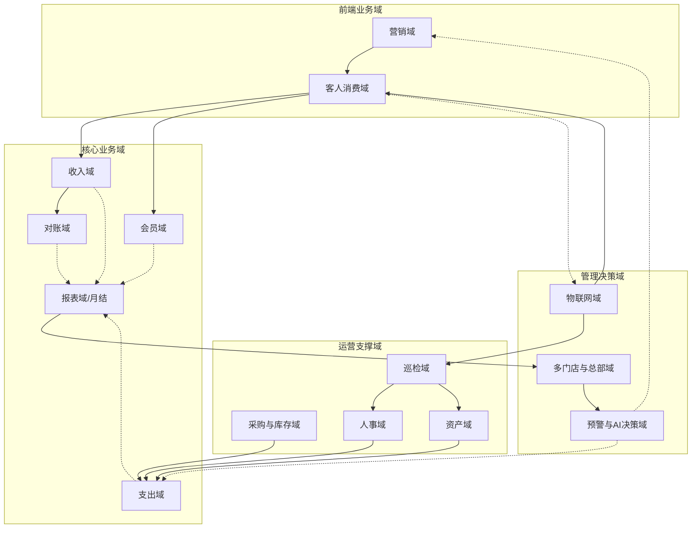

**域间关系说明**：
- **营销域**驱动客户流入，触发**客人消费域**
- **客人消费域**产生**收入域**和**会员域**数据
- **收入域**和**支出域**的数据汇聚到**报表域**（月结）
- **对账域**保障收入数据的准确性
- **采购与库存域**、**资产域**、**人事域**产生支出数据
- **巡检域**监督门店运营，关联**资产域**和**人事域**
- **物联网域**为**客人消费域**提供自动化支撑（门禁、设备控制）
- **预警与AI决策域**跨域分析数据，为**营销域**和**支出域**提供策略建议

---

## 第二章：功能结构

系统按用户角色分组的功能菜单（最终用户界面结构）。

```text
高岸ERP系统
│
├─ 客人端（移动端）
│    ├─ 首页
│    │    ├─ 门店列表（按距离排序，含图片、评分、距离）
│    │    ├─ 推荐商品（横向滚动）
│    │    └─ 营销活动展示（ banner、优惠券领取）
│    ├─ 包间预约
│    │    ├─ 选择门店、日期、时段
│    │    ├─ 查看包间详情（图片、价格、容纳人数）
│    │    └─ 支付（微信/支付宝/会员余额）
│    ├─ 商品点单
│    │    ├─ 商品浏览（分类：茶叶/茶点/茶具/套餐）
│    │    ├─ 购物车
│    │    ├─ 下单（自提/外卖，外卖需填写地址）
│    │    └─ 支付
│    ├─ 扫码直达
│    │    └─ 扫描门店/包间二维码，直接进入预约或点单页
│    └─ 会员中心
│         ├─ 余额显示
│         ├─ 充值入口（固定档位+自定义）
│         ├─ 订单列表（按状态分组：待使用/使用中/已完成/已取消）
│         ├─ 退费申请
│         ├─ 优惠券/活动参与记录
│         └─ 客服联系
│
├─ 店员端（移动端 + PC，功能一致）
│    ├─ 工作台
│    │    ├─ 门店切换（若关联多门店）
│    │    ├─ 今日概览（使用中/待打扫/故障房间数）
│    │    └─ 待办卡片（保洁任务、对账工单、差异工单、补货提醒、巡检任务）
│    ├─ 房态管理
│    │    ├─ 平面图/列表展示房间状态（空闲/使用中/待打扫/维修）
│    │    ├─ 房间详情（订单信息、剩余时间）
│    │    └─ 远程控制（开门、调温、关灯、强制退房，需填写原因并关联工单ID）
│    ├─ 保洁任务
│    │    ├─ 任务列表（按时间顺序，超时高亮）
│    │    ├─ 开始清洁/完成清洁
│    │    └─ 超时提醒（离场后30分钟未接单，推送店长）
│    ├─ 对账工单
│    │    ├─ 工单列表（平台对账差异 + ERP内部异常）
│    │    ├─ 查看详情（系统金额 vs 平台金额 / 异常描述）
│    │    └─ 处理（调整金额/补录订单/核实关闭，需填理由）
│    ├─ 商品管理
│    │    ├─ 商品列表（图片、价格、库存，支持搜索筛选）
│    │    ├─ 新增/编辑商品（上传图片、设置规格）
│    │    ├─ 库存预警（低于阈值标红）
│    │    └─ 补货申请（一键生成采购单或通知店长）
│    ├─ 采购/支出申请
│    │    ├─ 请款单（事前）
│    │    └─ 报销单（事后，上传凭证）
│    ├─ 考勤打卡
│    │    ├─ 上班打卡/下班打卡
│    │    └─ 请假申请（假别、时段）
│    ├─ 巡检任务
│    │    ├─ 接收巡检任务
│    │    ├─ 逐项检查（正常/异常，异常需拍照）
│    │    └─ 提交巡检报告
│    └─ 库存管理
│         ├─ 库存台账查看
│         ├─ 入库记录
│         ├─ 盘点操作
│         └─ 调拨申请
│
├─ 店长端（移动端 + PC）
│    ├─ 本店报表（含图表对比）
│    │    ├─ 月度经营报告查看（利润指标、收入明细、支出明细，含趋势图）
│    │    ├─ 报告导出（Excel）
│    │    ├─ 日营收走势图（本月每日）
│    │    └─ 同比/环比分析
│    ├─ 支出审批
│    │    ├─ 待审批列表（请款/报销单）
│    │    └─ 审批通过/驳回（填意见）
│    ├─ 员工管理
│    │    ├─ 店员账号分配
│    │    ├─ 排班表（每日上班时间）
│    │    └─ 权限设置
│    ├─ 考勤审批
│    │    ├─ 补卡审批
│    │    └─ 请假审批
│    ├─ 巡检审核
│    │    ├─ 查看巡检报告
│    │    └─ 创建整改工单（指派责任人）
│    ├─ 设备管理
│    │    ├─ 查看IoT设备状态（在线/离线/故障）
│    │    └─ 手动控制（远程开门、调温等）
│    ├─ 采购管理
│    │    ├─ 采购单审批
│    │    └─ 供应商管理（本店常用供应商）
│    ├─ 库存管理
│    │    ├─ 库存台账
│    │    ├─ 盘点审批
│    │    ├─ 调拨审批
│    │    └─ 库存预警设置
│    ├─ 营销管理
│    │    ├─ 本店营销活动查看
│    │    └─ 活动效果数据
│    └─ 会员管理
│         ├─ 会员查询（本店消费记录）
│         └─ 退费审批
│
├─ 总部端（PC + 移动端同步支持）
│    ├─ 门店管理
│    │    ├─ 门店创建/信息维护（地址、电话、营业时间、门店类型）
│    │    ├─ 包间配置（名称、价格、容纳人数）
│    │    └─ 商品上下架（统一管理）
│    ├─ 财务管理
│    │    ├─ 各门店月结报告查看（含图表对比）
│    │    ├─ 合并报表（集团利润表、收入明细、支出明细）
│    │    └─ 报表导出
│    ├─ 股东管理
│    │    ├─ 品牌股东信息（持股比例）
│    │    ├─ 门店股东信息（单店入股比例）
│    │    └─ 分红计算（自动或手动触发）
│    ├─ 集中审批
│    │    └─ 超出门店权限的支出申请（>5000元）
│    ├─ 考勤汇总
│    │    └─ 各店考勤数据汇总、加班统计、薪资核算依据
│    ├─ 巡检汇总
│    │    ├─ 各店巡检完成率
│    │    └─ 异常项分类统计
│    ├─ 营销管理
│    │    ├─ 营销活动创建与管理（全平台）
│    │    ├─ 活动效果分析（ ROI、曝光、核销）
│    │    ├─ 优惠券/促销规则配置
│    │    └─ 客户获取渠道分析
│    ├─ 采购管理
│    │    ├─ 供应商库管理（统一管理）
│    │    ├─ 总部采购单
│    │    └─ 采购价格监控
│    ├─ 库存管理
│    │    ├─ 各店库存总览
│    │    ├─ 调拨审批（跨店）
│    │    └─ 库存周转分析
│    ├─ 员工管理
│    │    ├─ 员工创建/离职/调动
│    │    └─ 岗位与权限配置
│    ├─ 经营预警与AI策略建议
│    │    ├─ 经营异常预警（营收异常下降、成本异常上升、库存积压等）
│    │    ├─ 风险预警（设备批量离线、对账大额差异、连续亏损等）
│    │    └─ AI策略建议（定价优化建议、促销时机推荐、成本控制建议）
│    ├─ 系统管理
│    │    ├─ 用户角色权限
│    │    ├─ 审计日志
│    │    └─ 基础数据配置（收支科目、支付方式、审批流程等）
│    └─ 会员管理
│         ├─ 会员数据总览（全品牌）
│         ├─ 充值/消费统计
│         └─ 会员营销（定向优惠、消息推送）
│
└─ 投资人端（移动端，简化视图）
     ├─ 个人投资门店列表
     ├─ 财务看板
     │    ├─ 实时营收（本日/本月）
     │    ├─ 各店利润排名（仅限投资门店）
     │    ├─ 近6个月利润趋势图
     │    └─ 分红记录
     ├─ 月结报告（查看、导出）
     └─ 重大告警（断电、门锁批量离线、对账大额差异）
```


---

## 第三章：核心业务流程（泳道图）

本章使用泳道图描述八个核心业务流程，明确各角色职责和系统动作。流程按业务发生顺序编排：营销活动 -> 客人消费 -> 月度结账 -> 请款报销 -> 考勤管理 -> 门店巡检 -> 采购与库存 -> 设备故障处理。

### 3.1 流程一：营销活动创建与同步流程

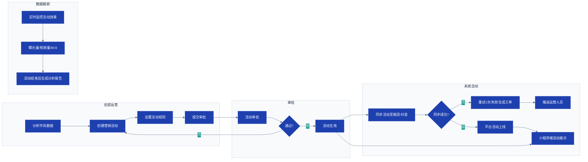

**流程说明**：
- 总部运营创建营销活动，配置折扣力度、适用门店、商品范围和时间段。
- 活动需经审批后自动同步至美团、抖音等第三方平台。
- 系统实时跟踪活动效果（曝光、核销、新增客户），活动结束后自动生成分析报告。

---

### 3.2 流程二：客人预约到店消费流程（含物联网自动化）

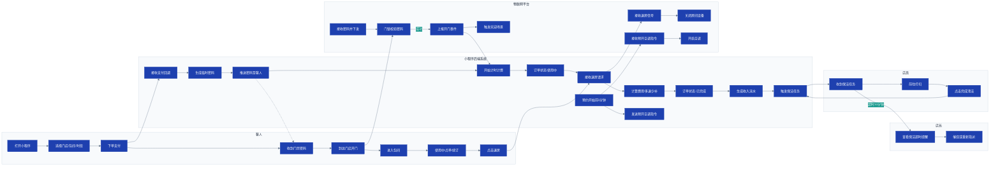

**流程说明**：
- 客人支付成功后，系统自动生成临时门禁密码（支持离线动态密码），推送客人并下发门锁。
- 预约开始前5分钟，系统自动预开空调。
- 客人开门后，物联网平台上报事件，系统开始计时计费（以首次开门时间为准），并自动开启房间设备（欢迎场景）。
- 退房时系统结算费用，生成收入流水，并通知物联网平台关闭设备。
- 退房后自动生成保洁任务，超时未完成则提醒店长。

---

### 3.3 流程三：月度自动结账流程（含对账）

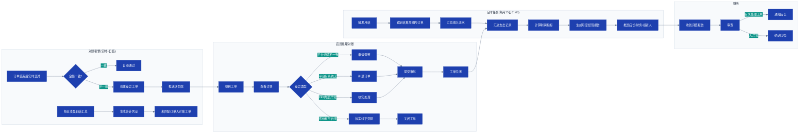

**流程说明**：
- 每笔订单结束后立即与平台账单比对，不一致则生成工单推送给店员。
- 差异工单包含两类：平台对账差异和ERP内部异常（未消费收款、消费未收款等）。
- 每日凌晨自动日结，生成会计凭证。
- 店员需在月结前处理完所有工单，否则月结报告标记为异常。

---

### 3.4 流程四：请款与报销审批流程

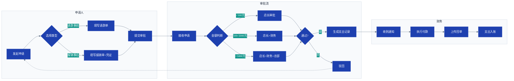

**流程说明**：
- 请款（事前）和报销（事后）两条路径分开。
- 审批路由按金额自动分配，支持会签、驳回。
- 所有审批节点留有操作记录。

---

### 3.5 流程五：考勤管理流程

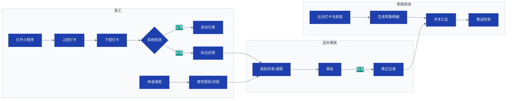

**流程说明**：
- 员工使用移动端小程序上下班打卡，系统自动与排班比对，标记迟到/早退/漏卡。
- 加班审批一期暂不开放，仅记录加班工时。
- 月末自动汇总考勤数据，推送财务。

---

### 3.6 流程六：门店巡检流程

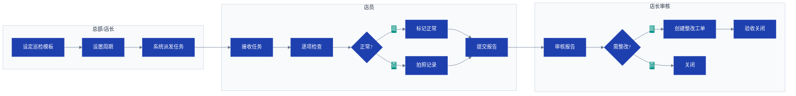

**流程说明**：
- 巡检覆盖经营情况检查和服务质量、安全检查（消防/卫生/设备）。
- 系统按周期自动生成任务，店员逐项检查，异常项必须拍照。
- 店长审核后需整改则创建工单跟进。

---

### 3.7 流程七：采购与库存管理流程

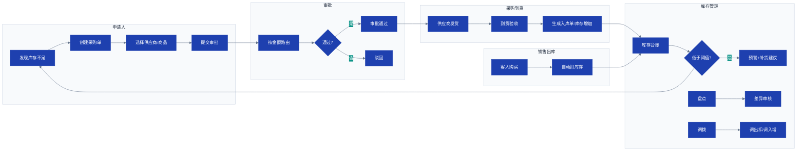

**流程说明**：
- 采购单经审批后执行，到货验收生成入库单，自动更新库存。
- 库存低于阈值自动预警并生成补货建议。
- 销售出库自动扣减库存，支持盘点和门店间调拨。

---

### 3.8 流程八：设备故障与异常处理流程

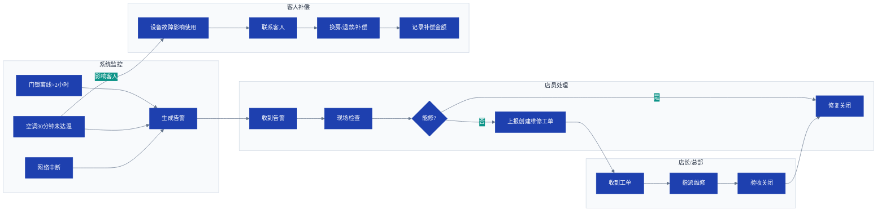


---

## 第四章：详细功能需求（按业务域）

本章按业务域逐一描述详细功能需求。每个需求条目采用统一表格格式：需求编号、需求名称、描述、前置条件、流程规则、输出。

业务域编排顺序：营销域 -> 客人消费域 -> 收入域 -> 支出域 -> 会员域 -> 对账域 -> 巡检域 -> 资产域 -> 人事域 -> 采购与库存域 -> 报表域 -> 多门店与总部域 -> 物联网域 -> 预警与AI决策域。

### 4.1 营销域（MKT）

营销域管理所有市场推广活动、客户获取渠道和营销效果分析，是业务增长的起点。

#### 4.1.1 营销活动创建与管理

| 需求编号 | MKT-01 |
|----------|--------|
| **需求名称** | 营销活动全生命周期管理 |
| **描述** | 总部运营可在系统中创建、编辑、发布和结束营销活动。活动类型包括折扣促销、满减、优惠券、限时特价等。 |
| **前置条件** | 运营人员已登录系统且有营销管理权限。 |
| **流程规则** | 1. 创建活动：填写活动名称、类型（折扣/满减/优惠券/限时特价）、适用门店、适用商品范围、活动时间、折扣力度。<br>2. 活动涉及价格变动的，必须在系统内创建活动并同步至美团/抖音等平台，严禁在平台侧直接修改价格。<br>3. 活动需经审批后生效，审批通过后系统自动同步至第三方平台。<br>4. 活动结束后自动归档，停止同步和展示。<br>5. 活动期间系统记录所有价格变动日志（操作人、时间、原因）。 |
| **输出** | 活动配置、同步日志 |
| **参考流程** | [营销活动创建与同步泳道图见3.1节](#31-流程一营销活动创建与同步流程) |

#### 4.1.2 平台活动同步

| 需求编号 | MKT-02 |
|----------|--------|
| **需求名称** | 活动信息自动同步至第三方平台 |
| **描述** | 系统将审批通过的营销活动自动同步至美团、抖音等第三方平台，支持批量同步和单活动同步。 |
| **前置条件** | 活动已审批通过，门店已绑定各平台店铺账号。 |
| **流程规则** | 1. 活动审批通过后立即触发同步流程。<br>2. 同步内容：活动名称、折扣价格、适用商品、活动时间。<br>3. 同步失败自动重试3次（间隔5分钟），仍失败生成告警工单推送给运营人员。<br>4. 支持手动重试单个活动的同步。<br>5. 记录同步日志（请求/响应、错误码、操作人）。 |
| **输出** | 同步记录、告警工单 |
| **参考流程** | [营销活动同步流程见3.1节](#31-流程一营销活动创建与同步流程) |

#### 4.1.3 客户获取渠道管理

| 需求编号 | MKT-03 |
|----------|--------|
| **需求名称** | 客户获取渠道跟踪与分析 |
| **描述** | 系统记录客户来源渠道（美团/抖音/高德/小红书/朋友推荐/自然到店等），并统计各渠道的获客成本和转化率。 |
| **前置条件** | 客人首次下单时记录渠道来源。 |
| **流程规则** | 1. 各渠道订单自动标记来源（美团券标记为美团渠道，抖音券标记为抖音渠道等）。<br>2. 首次到店客人可在小程序中填写"获知渠道"（可选字段）。<br>3. 系统自动统计各渠道的访问量、下单量、新客数、复购率。<br>4. 支持按门店、时间段筛选，生成渠道分析报告。<br>5. 结合营销活动费用计算各渠道ROI。 |
| **输出** | 渠道分析报表 |

**流程图**：
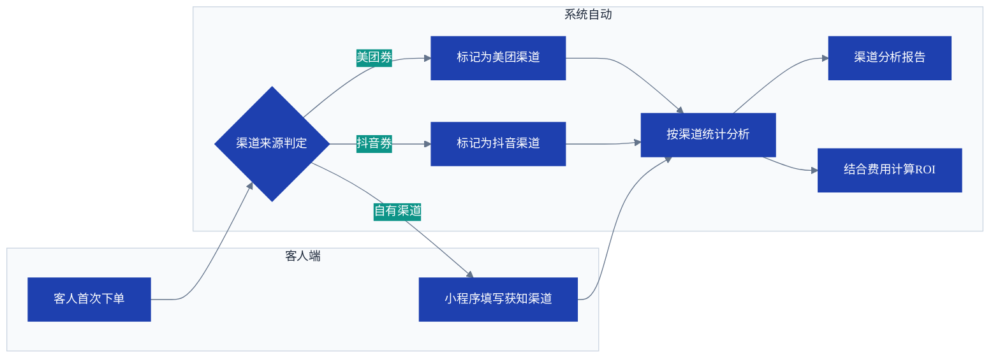
**说明**：渠道来源自动标记为主（平台券绑定渠道），客人主动填写为辅。支持按门店、时间段筛选分析。

**渠道分析报表样例**：

| 渠道 | 访问量 | 下单量 | 转化率 | 新客数 | 营销费用 | 总收入 | ROI |
|------|-------|-------|-------|-------|---------|-------|-----|
| 美团 | 1,280 | 156 | 12.2% | 68 | 3,500.00 | 18,720.00 | 5.35 |
| 抖音 | 856 | 89 | 10.4% | 42 | 2,800.00 | 10,680.00 | 3.81 |
| 高德 | 320 | 28 | 8.8% | 15 | 500.00 | 3,360.00 | 6.72 |
| 朋友推荐 | — | 45 | — | 22 | 0 | 5,400.00 | — |
| 自然到店 | — | 62 | — | 8 | 0 | 7,440.00 | — |
| **合计** | **2,456** | **380** | **—** | **155** | **6,800.00** | **45,600.00** | **—** |
> ROI = (总收入 - 营销费用) / 营销费用。系统自动按月汇总各渠道数据，支持导出Excel。

#### 4.1.4 优惠券管理

| 需求编号 | MKT-04 |
|----------|--------|
| **需求名称** | 优惠券发放与核销 |
| **描述** | 系统支持创建、发放优惠券，客人可领取并使用优惠券抵扣消费金额。 |
| **前置条件** | 优惠券活动已创建且生效。 |
| **流程规则** | 1. 创建优惠券：类型（满减券/折扣券/现金券）、面额、使用门槛、有效期、适用门店/商品。<br>2. 发放渠道：小程序首页领取、活动页面领取、后台定向发放。<br>3. 客人领取后自动存入账户，下单时可选择使用。<br>4. 使用优惠券的订单，优惠金额在月结报告中单独列出。 |
| **输出** | 优惠券记录、核销统计 |

**流程图**：
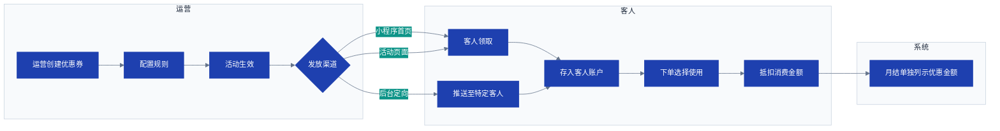

**优惠券核销统计样例**：

| 优惠券ID | 名称 | 类型 | 面额 | 门槛 | 发放数量 | 领取数量 | 核销数量 | 核销金额 | 核销率 |
|---------|------|------|------|------|---------|---------|---------|---------|-------|
| CPN-001 | 新人满100减20 | 满减券 | 20.00 | 100.00 | 500 | 320 | 185 | 3,700.00 | 57.8% |
| CPN-002 | 9折券 | 折扣券 | 9折 | 50.00 | 200 | 168 | 92 | 1,242.00 | 54.8% |
| CPN-003 | 50元现金券 | 现金券 | 50.00 | 200.00 | 100 | 45 | 22 | 1,100.00 | 48.9% |
> 核销率 = 核销数量 / 领取数量。月结报告中优惠金额单独列示。

### 4.2 客人消费域（CUST）

客人消费域覆盖客人在小程序端的完整消费流程：门店选择、包间预约、商品点单、支付、消费中服务、退房。

#### 4.2.1 门店选择与展示

| 需求编号 | CUST-01 |
|----------|--------|
| **需求名称** | 附近门店列表展示 |
| **描述** | 小程序首页按用户当前位置距离展示附近门店，支持搜索和筛选。 |
| **前置条件** | 用户授权地理位置。 |
| **流程规则** | 1. 首页按距离从近到远展示门店（门店图片、名称、评分、距离、营业状态）。<br>2. 用户可手动切换城市、搜索门店名称。<br>3. 门店详情页展示门店图片、地址、电话、营业时间、包间列表及价格。 |
| **输出** | 门店列表UI |

#### 4.2.2 包间预约与支付

| 需求编号 | CUST-02 |
|----------|--------|
| **需求名称** | 包间在线预约与支付 |
| **描述** | 客人选择门店、包间、时段后在线支付，支付成功后获得门禁密码。 |
| **前置条件** | 客人已选择门店和包间。 |
| **流程规则** | 1. 选择包间：展示包间图片、价格、可预约时段（小时/场次）、容纳人数。<br>2. 提交预约并支付（支持微信/支付宝/会员余额）。<br>3. 支付成功后系统自动分配房间，生成临时门禁密码。<br>4. 密码通过小程序消息和短信推送至客人。<br>5. 若预约时段无空闲房间，系统提示满房并支持排队。 |
| **输出** | 订单、门禁密码 |
| **参考流程** | [客人预约到店消费泳道图见3.2节](#32-流程二客人预约到店消费流程含物联网自动化) |

#### 4.2.3 商品点单（自提/外卖）

| 需求编号 | CUST-03 |
|----------|--------|
| **需求名称** | 商品在线浏览与下单 |
| **描述** | 客人可在线浏览商品（茶叶、茶点、茶具、套餐），加入购物车后下单，选择自提或外卖配送。 |
| **前置条件** | 客人已进入小程序。 |
| **流程规则** | 1. 商品按分类展示（茶叶/茶点/茶具/套餐），支持按销量、价格排序。<br>2. 商品详情展示图片、描述、价格、规格。<br>3. 加入购物车后可修改数量，支持多商品合并下单。<br>4. 外卖订单需填写收货地址，系统计算运费（可配置运费规则）。<br>5. 支付成功后生成订单，自提订单推送给店员备货，外卖订单进入发货流程。 |
| **输出** | 订单、发货通知 |

**流程图**：
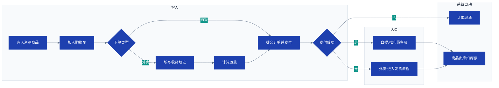

#### 4.2.4 扫码直达

| 需求编号 | CUST-04 |
|----------|--------|
| **需求名称** | 包间/门店二维码扫码直达 |
| **描述** | 客人扫描门店或包间张贴的二维码，自动跳转至对应门店的点单页面或包间预约页面。 |
| **前置条件** | 二维码包含storeId和roomId（可选）。 |
| **流程规则** | 1. 扫描门店二维码：直接进入该门店首页（展示包间和商品）。<br>2. 扫描包间二维码：进入该包间预约页面。<br>3. 若异地扫码（距离大于5公里），弹出提示"该门店距您较远，下单后商品将快递配送，可能需额外运费"，仍允许继续操作。 |
| **输出** | 页面跳转 |

#### 4.2.5 消费中服务（续订/呼叫）

| 需求编号 | CUST-05 |
|----------|--------|
| **需求名称** | 消费中续订与呼叫店员 |
| **描述** | 客人在使用包间过程中可通过小程序续订时段或呼叫店员服务。 |
| **前置条件** | 订单状态为"使用中"。 |
| **流程规则** | 1. 距预约结束时间15分钟，系统发送微信订阅消息提醒客人。<br>2. 客人可点击"续订"选择延长时间段并支付差价。<br>3. 客人可点击"呼叫服务"向店员端发送服务请求。<br>4. 店员端收到呼叫请求后显示房间号和请求内容。 |
| **输出** | 续订订单、服务请求通知 |
| **参考流程** | [续订及呼叫服务员流程见3.2节](#32-流程二客人预约到店消费流程含物联网自动化) |

#### 4.2.6 退房与结算

| 需求编号 | CUST-06 |
|----------|--------|
| **需求名称** | 退房结算流程 |
| **描述** | 客人点击退房后，系统计算费用并完成结算。 |
| **前置条件** | 订单状态为"使用中"。 |
| **流程规则** | 1. 客人点击退房，系统按实际使用时长（首次开门到退房）或套餐固定金额计算费用。<br>2. 若已支付金额大于实际费用，自动原路退回差额。<br>3. 若已支付金额不足，推送补缴链接。<br>4. 结算完成后订单状态更新为"已完成"。<br>5. 门禁密码立即失效。<br>6. 自动触发退房后流程（关闭设备、生成保洁任务、生成收入流水）。<br>7. 若客人到结束时间未退房，系统自动退房（提前15分钟提醒）。 |
| **输出** | 结算记录、收入流水 |
| **参考流程** | [退房结算与IoT联动流程见3.2节](#32-流程二客人预约到店消费流程含物联网自动化) |


### 4.3 收入域（REV）

收入域负责所有收入的自动归集、分类和入账，按标准会计科目框架组织。

#### 4.3.1 空间租用收入自动归集

| 需求编号 | REV-01 |
|----------|--------|
| **需求名称** | 包间租用收入自动归集 |
| **描述** | 客人退房后，系统自动生成主营业务收入（空间租用），计入日结及月结。 |
| **前置条件** | 订单状态=已完成（客人已退房）。 |
| **流程规则** | 1. 退房时按实际使用时长或套餐固定金额计算费用。<br>2. 订单状态更新为"已完成"后，系统立即生成收入流水。<br>3. 业务类型=空间租用，金额=实付金额。<br>4. 流水进入当日待归集队列，日结时汇总。 |
| **输出** | 收入流水记录 |
| **参考流程** | [退房结算后收入归集流程见3.2节](#32-流程二客人预约到店消费流程含物联网自动化) |

**收入流水记录样例**：

| 流水号 | 日期 | 门店 | 订单号 | 业务类型 | 金额 | 支付方式 | 状态 |
|-------|------|------|-------|---------|------|---------|------|
| INC-20260505-001 | 05-05 10:30 | 金德店 | ORD-20260505-0101 | 空间租用 | 128.00 | 微信 | 已归集 |
| INC-20260505-002 | 05-05 11:15 | 金德店 | ORD-20260505-0102 | 零售 | 56.00 | 支付宝 | 已归集 |
| INC-20260505-003 | 05-05 14:20 | 盈隆店 | ORD-20260505-0105 | 会员消费 | 88.00 | 会员余额 | 待日结 |
| INC-20260505-004 | 05-05 16:00 | 金德店 | ORD-20260505-0110 | 其他收入 | 150.00 | 微信 | 已归集 |
> 每笔订单完成后立即生成流水，日结时汇总归集。会员消费不产生新资金流入。

#### 4.3.2 零售商品收入自动归集

| 需求编号 | REV-02 |
|----------|--------|
| **需求名称** | 商品销售收入自动归集 |
| **描述** | 客人购买商品并完成支付后，系统自动生成主营业务收入（零售）。 |
| **前置条件** | 商品订单已支付且状态为已完成（自提已取货/外卖已发货）。 |
| **流程规则** | 1. 支付成功后生成零售订单。<br>2. 外卖订单需店员确认发货后状态变更为已完成。<br>3. 订单完成后生成收入流水，业务类型=零售，金额=实付金额。<br>4. 同时扣减对应SKU的库存。 |
| **输出** | 收入流水记录、库存变动记录 |
| **参考流程** | [销售出库扣库存流程见3.7节](#37-流程七采购与库存管理流程) |

#### 4.3.3 会员充值收入（债务性）

| 需求编号 | REV-03 |
|----------|--------|
| **需求名称** | 会员充值预收账款处理 |
| **描述** | 会员充值时不确认为营业收入，记为预收账款（债务性收入），待消费时转为营收。 |
| **前置条件** | 会员已注册且充值成功。 |
| **流程规则** | 1. 充值成功后增加会员余额。<br>2. 生成收入流水，业务类型=会员卡，金额=充值金额，不计入月结营收。<br>3. 自动生成会计凭证（借：银行存款，贷：预收账款）。<br>4. 会员使用余额消费时，按消费金额从预收账款转入主营业务收入。 |
| **输出** | 充值记录、余额变动、会计凭证 |
| **参考流程** | [会员充值消费流程见4.5节会员域](#45-会员域mem)及[5.4.4节](#544-会员收入) |

**充值记录及余额变动样例**：

| 交易号 | 时间 | 会员 | 类型 | 金额 | 其中赠送 | 余额(后) | 支付方式 | 平台交易ID |
|-------|------|------|------|------|---------|---------|---------|-----------|
| CHG-20260505-001 | 05-05 09:15 | 张先生 | 充值 | +500.00 | 50.00 | 550.00 | 微信 | wx_202605051234 |
| CHG-20260505-002 | 05-05 14:30 | 李女士 | 消费 | -88.00 | 0 | 462.00 | 会员余额 | — |
| CHG-20260505-003 | 05-05 16:00 | 张先生 | 退款 | -100.00 | 0 | 362.00 | 原路退回 | ref_202605051234 |
> 充值记录必须保存平台transaction_id用于退费追溯，余额变动含充值+消费+退款。

#### 4.3.4 其他业务收入

| 需求编号 | REV-04 |
|----------|--------|
| **需求名称** | 充电宝分成、赔偿金等偶发收入手工录入 |
| **描述** | 充电宝分成、赔偿金、废品出售等非主营偶发收入，支持店长/财务手工录入。 |
| **前置条件** | 有实际收款凭证。 |
| **流程规则** | 1. 店长/财务填写收入单：业务类型选择"其他收入"，输入金额、发生日期、说明，上传凭证。<br>2. 提交后自动生成收入流水，科目=其他业务收入。<br>3. 流水纳入日结汇总，计入月报的其他业务收入。 |
| **输出** | 收入流水记录 |

**流程图**：


#### 4.3.5 支付方式灵活配置

| 需求编号 | REV-05 |
|----------|--------|
| **需求名称** | 支付方式动态配置 |
| **描述** | 系统支持动态增删支付方式（美团券、抖音券、微信、支付宝、会员余额、现金等），每种支付方式可独立配置自动对账能力。 |
| **前置条件** | 系统管理员权限。 |
| **流程规则** | 1. 后台提供支付方式管理界面，可添加/编辑/删除支付方式。<br>2. 每种支付方式可设置"是否需要平台对账"、"对账API或文件导入方式"。<br>3. 订单产生时记录客人选择的支付方式。<br>4. 对账引擎根据支付方式配置自动拉取平台账单或等待手工导入。 |
| **输出** | 支付方式配置表 |

**支付方式配置表样例**：

| 支付方式ID | 名称 | 所属平台 | 是否对账 | 对账方式 | 结算周期 | 日切时间 |
|-----------|------|---------|---------|---------|---------|---------|
| PMT-001 | 美团券-团购 | 美大茶室 | 是 | API自动拉取 | 自然月 | 23:00 |
| PMT-002 | 美团收钱码 | 美大收钱码 | 是 | API自动拉取 | T+1 | 23:00 |
| PMT-003 | 微信支付 | 微信商户 | 是 | 文件导入 | T+1 | 24:00 |
| PMT-004 | 会员余额 | ERP内部 | 否 | 内部记账 | 实时 | — |
> 支付方式可动态增删改。对账方式支持API/文件导入/手工录入，结算周期支持自定义。

#### 4.3.6 每日收入自动归集与会计凭证

| 需求编号 | REV-06 |
|----------|--------|
| **需求名称** | 每日收入自动归集生成会计凭证 |
| **描述** | 每日凌晨系统自动汇总前一日所有订单，生成日结汇总表及会计凭证。 |
| **前置条件** | 每日定时任务（00:05）。 |
| **流程规则** | 1. 汇总前一日已完成订单，按门店、业务类型、支付方式分组统计金额。<br>2. 生成日结汇总表（含日期、门店、各科目金额）。<br>3. 自动生成会计凭证：借（银行存款/应收账款），贷（主营业务收入/其他业务收入/预收账款）。<br>4. 未匹配平台账单的订单不生成凭证，进入对账工单。 |
| **输出** | 日结汇总表、会计凭证、对账工单 |
| **参考流程** | [日结/月结流程见3.3节](#33-流程三月度自动结账流程含对账) |

**日结汇总表样例**：

| 日期 | 门店 | 业务类型 | 订单数 | 应收合计 | 支付方式明细 |
|------|------|---------|-------|---------|-------------|
| 2026-05-05 | 金德店 | 空间租用 | 12 | 3,280.00 | 微信1,850 美团1,080 会员350 |
| 2026-05-05 | 金德店 | 零售商品 | 8 | 856.00 | 微信456 支付宝400 |
| 2026-05-05 | 金德店 | 会员充值 | 3 | 1,500.00 | 微信500 支付宝1,000 |
| 2026-05-05 | 盈隆店 | 空间租用 | 8 | 2,160.00 | 美团1,200 微信960 |
| 2026-05-05 | 盈隆店 | 零售商品 | 5 | 420.00 | 微信320 支付宝100 |
| 2026-05-05 | 盈隆店 | 会员充值 | 1 | 300.00 | 支付宝300 |
> 会员充值单独列示，不计入当日营收合计。

**会计凭证样例（日结）**：

| 凭证号 | 日期 | 摘要 | 科目 | 借方金额 | 贷方金额 |
|--------|------|------|------|---------|---------|
| V20260505-001 | 2026-05-05 | 金德店日结-空间租用 | 银行存款-金德店 | 1,280.00 | |
| V20260505-001 | 2026-05-05 | 金德店日结-空间租用 | 主营业务收入-空间租用 | | 1,280.00 |
| V20260505-002 | 2026-05-05 | 盈隆店日结-零售商品 | 银行存款-盈隆店 | 356.00 | |
| V20260505-002 | 2026-05-05 | 盈隆店日结-零售商品 | 主营业务收入-零售 | | 356.00 |
| V20260505-003 | 2026-05-05 | 金德店会员充值 | 银行存款-金德店 | 500.00 | |
| V20260505-003 | 2026-05-05 | 金德店会员充值 | 预收账款-会员充值 | | 500.00 |
> 每笔日结生成一组借贷平衡的凭证，借=贷。会员充值记预收账款，不计营收。

### 4.4 支出域（EXP）

支出域管理所有对外付款，涵盖请款（事前）、报销（事后）、供应商管理、审批流程和自动归集支出。

#### 4.4.1 请款申请（事前）

| 需求编号 | EXP-01 |
|----------|--------|
| **需求名称** | 请款（事前资金申请） |
| **描述** | 员工因业务需要事先向公司申请款项。 |
| **前置条件** | 申请人已登录，收款供应商已在库中。 |
| **流程规则** | 1. 填写请款单：用途、预估金额、收款供应商、期望付款日期、附件（合同/报价单）。<br>2. 提交后启动审批流（金额阈值路由：<500元店长审批；500-5000元店长+财务会签；>5000元店长+财务+总部会签）。<br>3. 审批通过后生成支出记录，状态=待付款。<br>4. 财务付款后上传银行回单，状态变更为已付款。 |
| **输出** | 请款单、支出记录 |
| **参考流程** | [请款审批泳道图见3.4节](#34-流程四请款与报销审批流程) |

**请款单样例**：

| 请款单号 | 申请人 | 门店 | 用途 | 供应商 | 预估金额 | 期望付款日 | 附件 | 状态 |
|---------|-------|------|------|-------|---------|-----------|------|------|
| REQ-20260505-001 | 张三 | 金德店 | 采购茶叶（正山小种） | 武夷山茶业有限公司 | 3,500.00 | 2026-05-10 | 报价单.pdf | 审批中 |
| REQ-20260505-002 | 李四 | 盈隆店 | 空调维修 | 格力售后 | 800.00 | 2026-05-07 | 维修报价.jpg | 待付款 |
| REQ-20260505-003 | 王五 | 总部 | 抖音广告充值 | 抖音广告 | 5,000.00 | 2026-05-08 | 合同.pdf | 已付款 |
> 请款金额 ≤500元店长审批，500-5000元店长+财务会签，>5000元店长+财务+总部会签。

#### 4.4.2 报销申请（事后）

| 需求编号 | EXP-02 |
|----------|--------|
| **需求名称** | 报销（事后凭票申请） |
| **描述** | 员工垫付费用后凭票报销。 |
| **前置条件** | 已取得凭证（发票/收据/订单截图）。 |
| **流程规则** | 1. 填写报销单：费用明细、金额、发生日期、供应商、上传凭证。<br>2. 凭证类型支持：增值税发票、普通收据、电商订单截图（至少三种）。<br>3. 提交后启动审批流程（同请款）。<br>4. 审批通过后生成支出记录，状态=待付款。<br>5. 财务打款后更新为已付款。 |
| **输出** | 报销单、支出记录 |
| **参考流程** | [报销审批泳道图见3.4节](#34-流程四请款与报销审批流程) |

**报销单样例**：

| 报销单号 | 申请人 | 门店 | 费用说明 | 金额 | 发生日期 | 凭证类型 | 凭证附件 | 状态 |
|---------|-------|------|---------|------|---------|---------|---------|------|
| EXP-20260505-001 | 赵六 | 金德店 | 招待客户茶点费 | 268.00 | 2026-05-04 | 增值税发票 | 发票.jpg | 已打款 |
| EXP-20260505-002 | 钱七 | 盈隆店 | 打车费（取货） | 45.00 | 2026-05-03 | 收据 | 收据.jpg | 审批中 |
| EXP-20260505-003 | 孙八 | 总部 | 美团广告充值（实付） | 4,500.00 | 2026-05-02 | 平台截图 | 订单截图.png | 待付款 |
> 报销金额路由规则同请款，凭证类型支持发票/收据/平台截图三种。

#### 4.4.3 供应商管理

| 需求编号 | EXP-03 |
|----------|--------|
| **需求名称** | 供应商基础信息管理 |
| **描述** | 所有对外付款的接收方需纳入供应商库，请款/报销时必须从供应商库中选择。 |
| **前置条件** | 系统管理员权限。 |
| **流程规则** | 1. 供应商信息：ID、名称、类型（商品供应商/场地出租方/广告服务商/人力服务商/固定资产供应商/其他）、联系人、电话、银行账户、税号、付款条件（月结/现结/预付）。<br>2. 请款或报销时必须从供应商库中选择；若为个人垫付，可创建虚拟供应商"个人垫付"。<br>3. 供应商支持启用/禁用。 |
| **输出** | 供应商库 |

**供应商库样例**：

| 供应商编号 | 名称 | 类型 | 联系人 | 电话 | 银行账户 | 付款条件 |
|-----------|------|------|--------|------|---------|---------|
| SUP-001 | 武夷山茶业有限公司 | 商品供应商 | 陈经理 | 138xxxx8901 | 工行xxx | 月结30天 |
| SUP-002 | 北京路物业 | 场地供应商 | 刘主管 | 139xxxx5678 | 建行xxx | 月结 |
| SUP-003 | 抖音广告 | 广告服务商 | — | 95152 | 自动扣款 | 预付 |
| SUP-004 | 格力空调售后 | 其他服务商 | 李工 | 186xxxx2345 | 农行xxx | 现结 |
| SUP-005 | 个人垫付 | 其他 | — | — | — | 即时打款 |

#### 4.4.4 广告费自动归集

| 需求编号 | EXP-04 |
|----------|--------|
| **需求名称** | 美团/抖音广告费自动拉取 |
| **描述** | 系统自动从美团、抖音广告后台拉取广告消耗金额，生成支出记录。 |
| **前置条件** | 门店已授权广告平台账号。 |
| **流程规则** | 1. 每日/每月定时从广告平台API拉取消耗明细。<br>2. 按门店维度拆分广告费。<br>3. 生成支出记录，科目=营销费用。<br>4. 若API不可用，支持手工上传平台导出的消耗报表。 |
| **输出** | 支出记录 |

**流程图**：
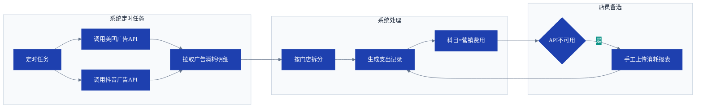

#### 4.4.5 场地成本/薪资等人力成本录入

| 需求编号 | EXP-05 |
|----------|--------|
| **需求名称** | 场地成本及人力成本手工/批量导入 |
| **描述** | 房租、水电、薪资、社保等支出支持手工录入或Excel批量导入。 |
| **前置条件** | 店长/财务有权限。 |
| **流程规则** | 1. 房租、水电、物业费等由总部或店长录入，需上传合同或账单。<br>2. 每月薪资表导入：Excel模板包含员工姓名、门店、基本工资、绩效、社保等。<br>3. 系统自动计算实发工资并生成支出记录（人力成本）。<br>4. 总部人员薪酬按各店营收占比自动分摊到各门店。 |
| **输出** | 支出记录、薪资单 |

**流程图**：
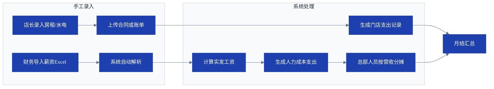

**薪资单样例**：

| 门店 | 员工 | 基本工资 | 绩效 | 岗位津贴 | 加班费 | 应发合计 | 社保(个人) | 个税 | 实发工资 |
|------|------|---------|------|---------|-------|---------|-----------|------|---------|
| 金德店 | 张三 | 3,500.00 | 800.00 | 300.00 | 0 | 4,600.00 | 402.50 | 0 | 4,197.50 |
| 金德店 | 李四 | 3,200.00 | 600.00 | 200.00 | 240.00 | 4,240.00 | 402.50 | 0 | 3,837.50 |
| 盈隆店 | 赵六 | 3,500.00 | 1,000.00 | 300.00 | 120.00 | 4,920.00 | 402.50 | 10.25 | 4,507.25 |
> 薪资表每月由财务导入Excel，系统自动计算实发工资并生成人力成本支出记录。

#### 4.4.6 管理费用分摊

| 需求编号 | EXP-06 |
|----------|--------|
| **需求名称** | 总部管理费用按比例分摊至门店 |
| **描述** | 总部管理费用月末按各店营收占比分摊到门店。 |
| **前置条件** | 总部管理费用已录入。 |
| **流程规则** | 1. 系统汇总总部管理费用总额。<br>2. 根据本月各门店营收占比自动计算分摊金额。<br>3. 为每个门店生成一条支出记录（科目=管理费用-分摊）。 |
| **输出** | 分摊支出记录 |

**流程图**：
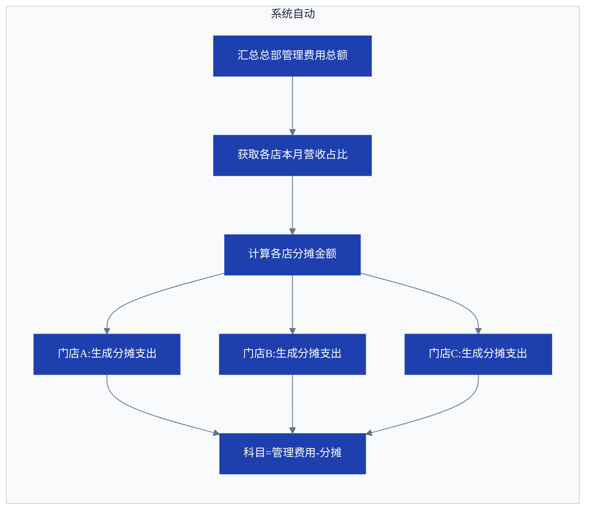

#### 4.4.7 支出审批流程可配置

| 需求编号 | EXP-07 |
|----------|--------|
| **需求名称** | 支出审批流程支持后台配置 |
| **描述** | 审批路由（金额阈值、审批人角色、会签/或签）可由系统管理员后台配置。 |
| **前置条件** | 系统管理员权限。 |
| **流程规则** | 1. 后台提供审批流程配置界面，可定义多个审批策略。<br>2. 每个策略可指定审批节点顺序、每个节点的审批人角色。<br>3. 支持超时升级（3天未审批自动转交上级）。<br>4. 所有审批记录审计日志。 |
| **输出** | 审批流程配置表 |
| **参考流程** | [请款报销审批泳道图见3.4节](#34-流程四请款与报销审批流程) |

**审批流程配置表样例**：

| 策略ID | 名称 | 适用类型 | 条件 | 审批节点1 | 审批节点2 | 审批节点3 | 超时升级(min) |
|-------|------|---------|------|----------|----------|----------|-------------|
| AP-01 | 小额支出 | 请款/报销 | ≤500元 | 店长 | — | — | 1440 |
| AP-02 | 中额支出 | 请款/报销 | 500~5000元 | 店长 | 财务 | — | 2880 |
| AP-03 | 大额支出 | 请款/报销 | >5000元 | 店长 | 财务 | 总部 | 4320 |
| AP-04 | 资产变动 | 资产报废/转移 | 任意金额 | 店长 | 财务 | — | 2880 |
> 审批策略可后台动态配置，支持会签和或签，超时自动升级至上级。


### 4.5 会员域（MEM）

#### 4.5.1 会员注册与登录

| 需求编号 | MEM-01 |
|----------|--------|
| **需求名称** | 微信一键注册/登录 |
| **描述** | 用户通过微信授权手机号快速注册成为会员，无需手动填写表单。 |
| **前置条件** | 用户授权小程序获取手机号。 |
| **流程规则** | 1. 首次使用时，系统调用微信接口获取手机号，自动创建会员账户。<br>2. 会员可补充昵称、生日等可选信息。<br>3. 同一手机号唯一会员ID，支持多个微信账号绑定同一会员ID。<br>4. 已注册用户后续自动识别登录。 |
| **输出** | 会员账户 |

**流程图**：
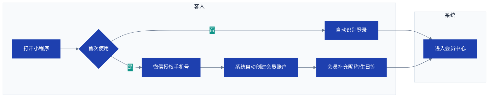

#### 4.5.2 会员充值

| 需求编号 | MEM-02 |
|----------|--------|
| **需求名称** | 会员余额充值 |
| **描述** | 会员可在线充值预付款，充值赠送规则可配置。 |
| **前置条件** | 会员已登录。 |
| **流程规则** | 1. 充值金额支持固定档位（100元/200元/500元等）或自由输入。<br>2. 充值赠送规则可后台配置（如充100送10）。<br>3. 支付成功后增加会员余额（实付+赠送），记录充值流水。<br>4. **必须保存支付平台返回的transaction_id**（微信/支付宝订单号），用于退费追溯。<br>5. 充值记为预收账款，不计入主营业务收入。<br>6. 资金路径：门店收款账户 → 茗匠-工行133（会员预充值账户）。<br>7. 会计凭证：借记"银行存款"，贷记"预收账款-会员充值"。 |
| **输出** | 充值记录、余额变动、会计凭证 |
| **参考流程** | [会员结算规则见5.4.4节](#544-会员收入) |

#### 4.5.3 会员余额消费

| 需求编号 | MEM-03 |
|----------|--------|
| **需求名称** | 会员余额支付 |
| **描述** | 会员使用余额支付包间租用或商品订单。 |
| **前置条件** | 会员余额充足。 |
| **流程规则** | 1. 下单时支付方式选择"会员余额"，系统校验余额是否足够。<br>2. 余额不足时提示混合支付（余额+微信/支付宝）。<br>3. 支付成功后扣减余额，订单正常流转。<br>4. 消费金额从预收账款转入主营业务收入（通过会计凭证调整）。<br>5. 资金路径：茗匠-工行133 → 门店对应银行卡。<br>6. 会计凭证：借记"预收账款-会员充值"，贷记"主营业务收入"。 |
| **输出** | 订单、余额变动、会计凭证 |
| **参考流程** | [会员余额支付见3.2节消费流程](#32-流程二客人预约到店消费流程含物联网自动化) |

#### 4.5.4 会员退费（含追溯）

| 需求编号 | MEM-04 |
|----------|--------|
| **需求名称** | 会员余额退费（原路退回） |
| **描述** | 会员申请退还会员余额，需经财务审批，原路退回充值时的支付账户。 |
| **前置条件** | 会员提交退费申请。 |
| **流程规则** | 1. 会员发起退费申请，系统自动计算可退金额（实际充值金额-已消费金额-赠送金额，赠送部分不退）。<br>2. 店长初审，财务终审。<br>3. **退费时必须关联原充值记录中的transaction_id**，系统不允许无关联退费。<br>4. 审批通过后调用原支付渠道退款接口，退费成功后扣减会员余额。<br>5. 生成退费流水（不计入收入）。<br>6. **退费金额仅限实际充值额（赠送部分不退）**，系统强制关联原充值记录中的TransactionID。 |
| **输出** | 退费申请单、退款流水 |

**退费申请单样例**：

| 申请单号 | 会员名 | 会员卡号 | 实际充值总额 | 已消费金额 | 赠送金额 | 可退金额 | 关联交易ID | 状态 |
|---------|-------|---------|------------|----------|---------|---------|-----------|------|
| REF-20260505-001 | 张先生 | VIP-0088 | 1,000.00 | 300.00 | 100.00 | 700.00 | TX20260415-1234 | 审批中 |
| REF-20260505-002 | 李女士 | VIP-0123 | 500.00 | 0.00 | 0.00 | 500.00 | TX20260501-5678 | 已退款 |
> 退费金额 = 实际充值额 - 已消费充值额（赠送部分不退）。必须关联原充值交易ID。

**流程图**：
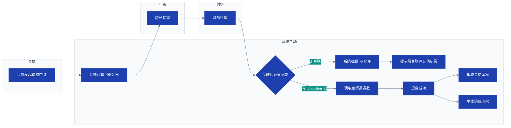

#### 4.5.5 会员数据报表

| 需求编号 | MEM-05 |
|----------|--------|
| **需求名称** | 会员统计报表 |
| **描述** | 系统提供会员统计报表，支持按门店、时间段筛选并导出。 |
| **前置条件** | 会员数据已积累。 |
| **流程规则** | 1. 报表指标：新增会员数、充值总额、消费总额、余额分布、会员总数。<br>2. 支持按门店、时间段筛选。<br>3. 支持导出Excel用于运营分析。 |
| **输出** | 会员统计报表 |

**会员统计报表样例**：

| 门店 | 会员总数 | 本月新增 | 本月充值总额 | 本月消费总额 | 余额总额 | 人均消费 |
|------|---------|---------|------------|------------|---------|---------|
| 金德店 | 326 | 28 | 12,500.00 | 8,360.00 | 68,420.00 | 256.44 |
| 盈隆店 | 218 | 15 | 8,200.00 | 5,680.00 | 45,300.00 | 260.55 |
| 盈丰店 | 86 | 7 | 3,500.00 | 2,100.00 | 18,600.00 | 244.19 |
| **合计** | **630** | **50** | **24,200.00** | **16,140.00** | **132,320.00** | **256.19** |
> 支持按门店、时间段筛选并导出Excel。

### 4.6 对账域（REC）

对账域负责订单与平台账单的自动比对、差异工单处理和ERP内部异常检测。

#### 4.6.1 实时/日结/月结三级对账

| 需求编号 | REC-01 |
|----------|--------|
| **需求名称** | 三级对账触发机制 |
| **描述** | 系统在实时、日结、月结三个层级自动触发对账，确保收入数据准确。 |
| **前置条件** | 订单已完成（已退房或已发货）。 |
| **流程规则** | 1. **实时对账**：每笔订单结束后立即与平台账单（如已有API数据）进行单笔比对，金额不一致立即创建差异工单并推送店员。<br>2. **日结对账**：每日凌晨自动汇总当日所有订单与平台账单，生成差异汇总报表，推送店长。<br>3. **月结对账**：每月25日强制全量对账，未处理差异升级为财务审核。 |
| **输出** | 差异工单、汇总报表 |
| **参考流程** | [月度自动结账及对账泳道图见3.3节](#33-流程三月度自动结账流程含对账) |

#### 4.6.2 差异类型与处理

| 需求编号 | REC-02 |
|----------|--------|
| **需求名称** | 差异工单处理流程 |
| **描述** | 系统自动识别差异类型并创建工单，店员按类型处理。差异不仅包括平台对账，也包括ERP内部订单异常。 |
| **前置条件** | 差异工单已创建。 |
| **流程规则** | 1. 差异类型：<br>   - **平台金额不一致**：订单金额与平台结算金额不同<br>   - **平台有系统无**：平台有订单但ERP未记录<br>   - **系统有平台无**：ERP有订单但平台无记录<br>   - **ERP内部异常**：未消费而收了钱、消费了却没收到钱、销售产品与收入金额不相符且无合理说明<br>2. 店员根据差异类型选择处理方式（调整金额/补录订单/核实关闭）。<br>3. 调整金额或补录需上传凭证并填写理由。<br>4. 超阈值（差异>1%或>5笔）升级财务审核。 |
| **输出** | 处理记录、升级通知 |
| **参考流程** | [差异工单处理泳道图见3.3节](#33-流程三月度自动结账流程含对账) |

**差异工单样例**：

| 工单号 | 创建时间 | 差异类型 | 关联订单 | 平台金额 | 系统金额 | 差异金额 | 状态 | 处理人 |
|--------|---------|---------|---------|---------|---------|---------|------|--------|
| D20260505-001 | 05-05 14:32 | 平台金额不一致 | ORD-20260505-0123 | 128.00 | 138.00 | -10.00 | 待处理 | — |
| D20260505-002 | 05-05 15:10 | 平台有系统无 | ORD-20260505-0156 | 88.00 | 0.00 | +88.00 | 处理中 | 张三 |
| D20260505-003 | 05-05 16:45 | ERP内部异常 | ORD-20260505-0189 | 0.00 | 256.00 | +256.00 | 待审批 | 李四 |
| D20260505-004 | 05-05 18:20 | 系统有平台无 | ORD-20260505-0210 | 0.00 | 66.00 | -66.00 | 已关闭 | 王五 |
> 差异=平台金额-系统金额。负值表示系统多收/多记，需调减；正值表示少收，需补录或催款。

#### 4.6.3 对账提醒留痕

| 需求编号 | REC-03 |
|----------|--------|
| **需求名称** | 对账提醒与追溯 |
| **描述** | 所有对账相关的提醒均记录发送时间、接收人、工单状态和处理结果。 |
| **前置条件** | 差异工单已创建。 |
| **流程规则** | 1. 实时差异通过小程序订阅消息立即推送给当班店员。<br>2. 日结差异汇总推送给店长。<br>3. 月结未处理工单升级推送给财务。<br>4. 所有提醒记录留痕，可追溯。 |
| **输出** | 提醒日志 |

**流程图**：
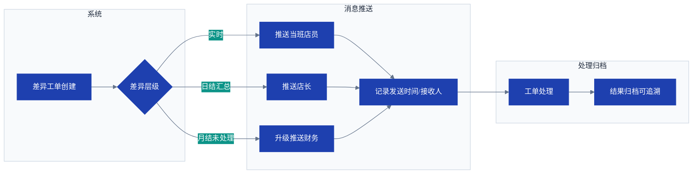

#### 4.6.4 多平台对账规则

| 需求编号 | REC-04 |
|----------|--------|
| **需求名称** | 各平台结算周期差异处理 |
| **描述** | 各第三方平台结算周期与高岸内部结算周期（上月25日至本月24日）不完全一致，系统须按规则对齐。 |
| **前置条件** | 各平台API已对接或数据已导入。 |
| **流程规则** | 1. **结算周期差异处理**：<br>   - 美团/抖音等平台按自然月结算（1日至月末），高岸按25日周期结算<br>   - 系统从平台拉取数据时，需根据平台结算周期进行切割归集<br>   - 跨周期部分的金额按日拆分归入相邻周期<br>2. **日切时间差异**：<br>   - 美大收钱码的日切时间为每日23:00，与高岸自然日不同<br>   - 美大收钱码查询期间应为上月24日至本月23日<br>3. **延迟到账处理**：<br>   - 部分平台（如美团、抖音）订单存在延迟结算（最长达7天）<br>   - 月结时应考虑延迟到账因素，对临近周期末的订单加标记<br>   - 月结后到账的订单归入下一周期 |
| **输出** | 周期对齐表、跨周期标记 |

**流程图**：
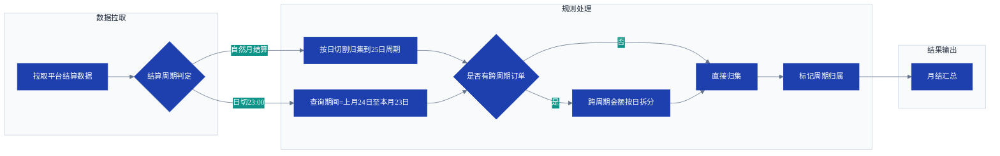

**周期对齐表样例**：

| 平台 | 平台结算周期 | 高岸查询期间 | 跨周期处理方式 | 日切时间 |
|------|------------|-------------|--------------|---------|
| 美团券 | 自然月(1日~月末) | 上月25日~本月24日 | 按日拆分跨周期金额 | 24:00 |
| 美大收钱码 | 上月24日~本月23日 | 上月24日~本月23日 | 无需调整 | 23:00 |
| 抖音来客 | 自然月(1日~月末) | 上月25日~本月24日 | 按日拆分跨周期金额 | 24:00 |
| 微信商户 | T+1自然日 | 上月25日~本月24日 | 靠近周期末订单加延迟标记 | 24:00 |
> 跨周期金额按日拆分：例如美团1日~25日的金额按天数比例归属两个周期。

### 4.7 巡检域（INS）

巡检域覆盖门店日常经营情况检查和定期安全检查，支持巡检模板配置、任务派发、异常整改。

#### 4.7.1 巡检模板配置

| 需求编号 | INS-01 |
|----------|--------|
| **需求名称** | 门店巡检项目自定义 |
| **描述** | 总部可根据门店类型配置不同的巡检模板，覆盖经营情况检查和安全检查。 |
| **前置条件** | 总部管理员权限。 |
| **流程规则** | 1. 创建巡检模板：模板名称、适用门店类型、检查项列表（检查项名称、是否必须拍照、正常/异常反馈）。<br>2. 检查项分为两大类：<br>   - **经营检查**：服务质量、人员到岗、商品陈列、环境卫生、仪容仪表等<br>   - **安全检查**：消防设备、电器安全、疏散通道、监控设备、门锁状态等<br>3. 检查项支持排序、分组。<br>4. 模板可复制、修改、禁用。 |
| **输出** | 巡检模板库 |
| **参考流程** | [门店巡检泳道图见3.6节](#36-流程六门店巡检流程) |

**巡检模板库样例**：

| 模板编号 | 模板名称 | 适用门店 | 检查项总数 | 拍照必检项数 | 周期 | 状态 |
|---------|---------|---------|-----------|------------|------|------|
| TPL-001 | 日常经营检查 | 全部 | 6 | 2 | 每日 | 启用 |
| TPL-002 | 安全检查（周） | 全部 | 5 | 3 | 每周 | 启用 |
| TPL-003 | 月度全面检查 | 全部 | 12 | 6 | 每月 | 启用 |
> 模板支持分类管理：经营检查和服务质量、安全检查。检查项支持排序、分组、复制。

#### 4.7.2 巡检任务自动生成

| 需求编号 | INS-02 |
|----------|--------|
| **需求名称** | 定时巡检任务推送 |
| **描述** | 系统根据门店配置的巡检周期自动生成巡检任务并推送给当值店员。 |
| **前置条件** | 门店已关联巡检模板且配置了周期。 |
| **流程规则** | 1. 系统在指定时间自动创建巡检实例（每日/每周/每月）。<br>2. 任务包含：门店、巡检模板、截止时间。<br>3. 任务推送至店员端待办列表。<br>4. 截止前未完成自动提醒；超时12小时升级提醒店长。 |
| **输出** | 巡检任务 |
| **参考流程** | [门店巡检泳道图见3.6节](#36-流程六门店巡检流程) |

**巡检任务样例**：

| 任务编号 | 门店 | 模板 | 执行人 | 截止时间 | 完成状态 | 超时升级 |
|---------|------|------|-------|---------|---------|---------|
| INS-20260505-001 | 金德店 | 日常经营检查 | 张三 | 2026-05-05 18:00 | 已完成 | — |
| INS-20260505-002 | 盈隆店 | 日常经营检查 | 赵六 | 2026-05-05 18:00 | 待处理 | 未超时 |
| INS-20260430-001 | 金德店 | 安全检查(周) | 李四 | 2026-04-30 18:00 | 已完成 | — |
> 超时12小时升级提醒店长，支持查看任务详情和提交记录。

#### 4.7.3 巡检执行与记录

| 需求编号 | INS-03 |
|----------|--------|
| **需求名称** | 店员执行巡检并拍照记录 |
| **描述** | 店员按巡检模板逐项检查，拍照记录异常项。 |
| **前置条件** | 已收到巡检任务。 |
| **流程规则** | 1. 店员打开巡检任务单，逐项检查。<br>2. 每项标记"正常"或"异常"，异常必须拍照上传并填写说明。<br>3. 全部完成后点击"提交"生成巡检报告。<br>4. 系统记录提交时间、执行人。 |
| **输出** | 巡检报告 |
| **参考流程** | [门店巡检泳道图见3.6节](#36-流程六门店巡检流程) |

**巡检报告样例**：

| 任务编号 | 门店 | 执行人 | 执行时间 | 检查项 | 结果 | 异常说明 | 图片 |
|---------|------|-------|---------|-------|------|---------|------|
| INS-20260505-001 | 金德店 | 张三 | 2026-05-05 10:30 | 消防设备检查 | 正常 | — | — |
| INS-20260505-001 | 金德店 | 张三 | 2026-05-05 10:32 | 商品陈列 | 异常 | 货架第三层商品凌乱 | photo1.jpg |
| INS-20260505-001 | 金德店 | 张三 | 2026-05-05 10:35 | 环境卫生 | 正常 | — | — |
| INS-20260505-001 | 金德店 | 张三 | 2026-05-05 10:38 | 疏散通道 | 正常 | — | — |
| INS-20260505-001 | 金德店 | 张三 | 2026-05-05 10:40 | 仪容仪表 | 正常 | — | — |
> 异常项必须拍照，系统自动关联整改工单创建入口。

#### 4.7.4 异常整改工单

| 需求编号 | INS-04 |
|----------|--------|
| **需求名称** | 巡检异常整改跟踪 |
| **描述** | 巡检异常项可创建整改工单，指派责任人跟踪至关闭。 |
| **前置条件** | 巡检报告中存在异常项。 |
| **流程规则** | 1. 店长审核巡检报告，可对异常项创建整改工单。<br>2. 工单包含：异常描述、整改要求、责任人、计划完成日期。<br>3. 责任人完成后上传整改后照片，店长验收。<br>4. 验收通过关闭，不通过退回。超时自动升级。 |
| **输出** | 整改工单 |
| **参考流程** | [门店巡检泳道图见3.6节](#36-流程六门店巡检流程) |

**整改工单样例**：

| 工单编号 | 来源巡检 | 异常项 | 整改要求 | 责任人 | 计划完成 | 实际完成 | 状态 |
|---------|---------|-------|---------|-------|---------|---------|------|
| FIX-20260505-001 | INS-20260505-001 | 商品陈列凌乱 | 重新摆放并拍照确认 | 张三 | 2026-05-06 | 2026-05-05 16:20 | 已验收 |
| FIX-20260505-002 | INS-20260505-002 | 灭火器过期 | 更换新灭火器 | 李四 | 2026-05-10 | — | 处理中 |
| FIX-20260505-003 | INS-20260504-003 | 卫生间漏水 | 联系物业维修 | 王五 | 2026-05-07 | — | 待分配 |
> 超时未完成自动升级推送店长/总部。

#### 4.7.5 巡检统计分析

| 需求编号 | INS-05 |
|----------|--------|
| **需求名称** | 巡检数据统计与导出 |
| **描述** | 总部可查看各门店巡检完成率、异常项TOP10等报表。 |
| **前置条件** | 巡检数据已积累。 |
| **流程规则** | 1. 按门店、时间范围统计巡检完成率、异常项分类、平均整改时长。<br>2. 支持导出Excel。<br>3. 连续3次巡检完成率<80%自动告警总部。 |
| **输出** | 统计报表 |

### 4.8 资产域（AST）

资产域管理固定资产的全生命周期，包括登记、折旧计提、盘点和报废。

#### 4.8.1 固定资产登记

| 需求编号 | AST-01 |
|----------|--------|
| **需求名称** | 固定资产台帐管理 |
| **描述** | 系统按会计准则管理门店装修、家具、设备等固定资产，用于折旧计算和资产盘点。 |
| **前置条件** | 固定资产采购完成并交付给门店。 |
| **流程规则** | 1. 店长或总部登记资产：资产编号、名称、类别（装修/家具/设备/其他）、原值、入账日期、使用年限（月）、残值率（默认为0）、使用门店。<br>2. 支持上传购买合同、发票等附件。<br>3. 资产状态：正常/已报废/已转移。<br>4. 资产报废或转移需发起审批流程（店长->财务）。 |
| **输出** | 资产卡片 |

**资产卡片样例**：

| 资产编号 | 名称 | 类别 | 原值 | 入账日期 | 使用年限 | 残值率 | 月折旧额 | 使用门店 | 状态 |
|---------|------|------|------|---------|---------|-------|---------|---------|------|
| AST-001 | 金德店装修工程 | 装修 | 180,000.00 | 2025-01-15 | 36月 | 5% | 4,750.00 | 金德店 | 正常 |
| AST-002 | 金德店空调系统 | 设备 | 35,000.00 | 2025-01-15 | 60月 | 5% | 554.17 | 金德店 | 正常 |
| AST-003 | 金德店茶桌茶椅 | 家具 | 12,000.00 | 2025-03-01 | 36月 | 0% | 333.33 | 金德店 | 正常 |
| AST-004 | 盈隆店装修工程 | 装修 | 220,000.00 | 2025-06-01 | 36月 | 5% | 5,805.56 | 盈隆店 | 正常 |
> 月折旧额 = (原值 - 原值×残值率) / 使用年限。折旧起始为入账次月。

**流程图**：
```mermaid
%%{init: {'theme':'base', 'themeVariables': {'background':'#ffffff', 'primaryColor':'#1e40af', 'primaryTextColor':'#ffffff', 'primaryBorderColor':'#1e40af', 'secondaryColor':'#0d9488', 'secondaryTextColor':'#ffffff', 'secondaryBorderColor':'#0d9488', 'tertiaryColor':'#f8fafc', 'tertiaryTextColor':'#1e293b', 'tertiaryBorderColor':'#cbd5e1', 'lineColor':'#64748b', 'fontFamily':'system-ui, -apple-system, PingFang SC, Microsoft YaHei, sans-serif', 'fontSize':'14px'}}}%%
graph LR
    subgraph 采购到货
        A[采购完成交付门店]
    end
    subgraph 店长/总部
        A --> B[店长/总部登记资产]
        B --> C[填写资产卡片]
        C --> D[原值/入账日期/年限/残值率]
        D --> E[上传合同/发票附件]
    end
    subgraph 系统自动
        E --> F[资产状态=正常]
        F --> G[次月开始计提折旧]
    end
```

#### 4.8.2 自动计提折旧

| 需求编号 | AST-02 |
|----------|--------|
| **需求名称** | 每月自动计提折旧 |
| **描述** | 每月月末系统自动对所有正常状态的固定资产计提折旧，计入当月营业成本。 |
| **前置条件** | 资产卡片信息完整且状态正常。 |
| **流程规则** | 1. 每月最后一日系统自动计算折旧额 = (原值 - 残值) / (使用年限 x 12)。<br>2. **计提条件**：折旧仅在门店经营状况良好时计提。系统按月判断门店净利润是否为正——若连续三个月亏损则暂停计提，恢复盈利后自动恢复。<br>3. 折旧起始月份为入账日期次月。<br>4. 生成折旧明细表（按门店、按资产类别）。<br>5. 折旧总额自动生成支出记录（科目=资产折旧），计入当月营业成本。<br>6. 支持店长手动触发计提或人工确认后计提（自动计提并推送确认通知）。 |
| **输出** | 折旧明细表、支出记录 |

**折旧明细表样例**：

| 门店 | 资产编号 | 资产名称 | 原值 | 月折旧额 | 已计提月数 | 累计折旧 | 净值 | 计提月份 |
|------|---------|---------|------|---------|-----------|---------|------|---------|
| 金德店 | AST-001 | 金德店装修工程 | 180,000.00 | 4,750.00 | 16 | 76,000.00 | 104,000.00 | 2026-05 |
| 金德店 | AST-002 | 金德店空调系统 | 35,000.00 | 554.17 | 16 | 8,866.72 | 26,133.28 | 2026-05 |
| 金德店 | AST-003 | 金德店茶桌茶椅 | 12,000.00 | 333.33 | 14 | 4,666.62 | 7,333.38 | 2026-05 |
| 盈隆店 | AST-004 | 盈隆店装修工程 | 220,000.00 | 5,805.56 | 11 | 63,861.16 | 156,138.84 | 2026-05 |
| **合计** | | | **447,000.00** | **11,443.06** | | **153,394.50** | **293,605.50** | |
> 折旧按月计提，当月折旧额自动计入营业成本（科目=资产折旧）。

#### 4.8.3 资产盘点

| 需求编号 | AST-03 |
|----------|--------|
| **需求名称** | 固定资产盘点 |
| **描述** | 店长发起资产盘点，生成盘点单，与台帐核对差异。 |
| **前置条件** | 固定资产台帐已建立。 |
| **流程规则** | 1. 店长发起盘点任务（可选择全部或部分资产）。<br>2. 系统生成盘点清单（资产编号、名称、台帐状态、存放位置）。<br>3. 店员逐项确认实物状况：正常/盘亏/盘盈/损坏。<br>4. 提交盘点报告，差异项需店长审批并调整台帐。 |
| **输出** | 盘点报告、差异调整记录 |

**盘点报告样例**：

| 盘点编号 | 门店 | 盘点日期 | 资产总数 | 正常 | 盘亏 | 盘盈 | 损坏 | 执行人 | 审批状态 |
|---------|------|---------|---------|------|------|------|------|-------|---------|
| CHK-20260505-001 | 金德店 | 2026-05-05 | 15 | 13 | 1 | 0 | 1 | 张三 | 审核中 |
| CHK-20260401-001 | 金德店 | 2026-04-01 | 12 | 12 | 0 | 0 | 0 | 李四 | 已通过 |
> 差异项需店长审批并调整台帐，盘亏报损需说明原因。

**流程图**：
```mermaid
%%{init: {'theme':'base', 'themeVariables': {'background':'#ffffff', 'primaryColor':'#1e40af', 'primaryTextColor':'#ffffff', 'primaryBorderColor':'#1e40af', 'secondaryColor':'#0d9488', 'secondaryTextColor':'#ffffff', 'secondaryBorderColor':'#0d9488', 'tertiaryColor':'#f8fafc', 'tertiaryTextColor':'#1e293b', 'tertiaryBorderColor':'#cbd5e1', 'lineColor':'#64748b', 'fontFamily':'system-ui, -apple-system, PingFang SC, Microsoft YaHei, sans-serif', 'fontSize':'14px'}}}%%
graph LR
    subgraph 店长
        A[店长发起盘点] --> B[选择全部或部分资产]
        I[差异项店长审批]
        J[调整台账]
    end
    subgraph 系统自动
        B --> C[系统生成盘点清单]
    end
    subgraph 店员
        C --> D[店员逐项确认实物]
        D --> E{实物状况}
        E -- 正常 --> F[标记正常]
        E -- 盘亏/盘盈/损坏 --> G[拍照+填写说明]
        F --> H[提交盘点报告]
        G --> H
    end
    H --> I
    I --> J
```


### 4.9 人事域（HR）

人事域覆盖员工信息管理、考勤管理和薪资核算。

#### 4.9.1 员工信息管理

| 需求编号 | HR-01 |
|----------|--------|
| **需求名称** | 员工基础信息管理 |
| **描述** | 总部可创建、编辑、禁用员工账号，关联门店和角色权限。 |
| **前置条件** | 总部管理员权限。 |
| **流程规则** | 1. 创建员工：填写姓名、手机号、所属门店、岗位（店长/店员）、登录密码。<br>2. 员工账号可关联多个门店（用于店员多店调配）。<br>3. 员工离职后可禁用账号，保留历史记录。<br>4. 员工信息支持编辑和查询。 |
| **输出** | 员工账号 |

**员工账号样例**：

| 员工编号 | 姓名 | 手机号 | 所属门店 | 岗位 | 角色 | 状态 |
|---------|------|-------|---------|------|------|------|
| EMP-001 | 张三 | 138****1234 | 金德店 | 店员 | 店员 | 启用 |
| EMP-002 | 李四 | 139****5678 | 金德店 | 店员 | 店员 | 启用 |
| EMP-003 | 管理员 | 136****0000 | 总部 | 管理员 | 总部 | 启用 |
| EMP-004 | 王五 | 137****9012 | 盈隆店 | 店员 | 店员 | 离职 |
> 员工可关联多个门店，离职后可禁用账号不删除（保留历史记录）。

#### 4.9.2 移动端打卡

| 需求编号 | HR-02 |
|----------|--------|
| **需求名称** | 员工上下班打卡 |
| **描述** | 员工使用移动端小程序进行上下班打卡，系统记录时间并与排班比对。 |
| **前置条件** | 员工已被分配到门店且有系统账号。 |
| **流程规则** | 1. 员工点击"上班打卡"记录上班时间，"下班打卡"记录下班时间。<br>2. 系统自动判断打卡时间是否在排班范围内，标记迟到/早退/漏卡。<br>3. 支持补卡申请（附说明，店长审批）。<br>4. 打卡记录包含门店、时间、打卡方式。 |
| **输出** | 打卡记录 |
| **参考流程** | [考勤管理泳道图见3.5节](#35-流程五考勤管理流程) |

**打卡记录样例**：

| 记录ID | 员工 | 门店 | 日期 | 上班打卡 | 下班打卡 | 应出勤 | 状态 |
|--------|------|------|------|---------|---------|-------|------|
| ATD-20260505-001 | 张三 | 金德店 | 2026-05-05 | 09:02 | 18:05 | 09:00-18:00 | 正常 |
| ATD-20260505-002 | 李四 | 金德店 | 2026-05-05 | 13:15 | 22:00 | 13:00-22:00 | 迟到15分钟 |
| ATD-20260505-003 | 赵六 | 盈隆店 | 2026-05-05 | 09:03 | — | 09:00-18:00 | 漏卡 |
> 系统自动比对排班标记迟到/早退/漏卡，支持补卡申请（店长审批）。

#### 4.9.3 排班管理

| 需求编号 | HR-03 |
|----------|--------|
| **需求名称** | 门店员工排班 |
| **描述** | 店长预先安排员工每日上下班时间、休息日。 |
| **前置条件** | 员工信息已录入。 |
| **流程规则** | 1. 店长创建排班表，可按周或按月重复。<br>2. 排班字段：员工、日期、上班时间、下班时间、值班类型（正常/节假日）。<br>3. 系统根据排班自动计算应出勤工时，与实际打卡比对。<br>4. 法定假日排班自动标记为"节日加班"。 |
| **输出** | 排班表 |

**排班表样例**：

| 门店 | 员工 | 日期 | 上班时间 | 下班时间 | 值班类型 |
|------|------|------|---------|---------|---------|
| 金德店 | 张三 | 2026-05-05 | 09:00 | 18:00 | 正常 |
| 金德店 | 李四 | 2026-05-05 | 13:00 | 22:00 | 正常 |
| 金德店 | 王五 | 2026-05-06 | 09:00 | 18:00 | 正常 |
| 金德店 | 张三 | 2026-05-06 | 休息 | 休息 | 休息 |
| 金德店 | 李四 | 2026-05-07 | 09:00 | 18:00 | 正常 |
> 系统自动按排班计算应出勤工时，与实际打卡比对标记异常。

**流程图**：
```mermaid
%%{init: {'theme':'base', 'themeVariables': {'background':'#ffffff', 'primaryColor':'#1e40af', 'primaryTextColor':'#ffffff', 'primaryBorderColor':'#1e40af', 'secondaryColor':'#0d9488', 'secondaryTextColor':'#ffffff', 'secondaryBorderColor':'#0d9488', 'tertiaryColor':'#f8fafc', 'tertiaryTextColor':'#1e293b', 'tertiaryBorderColor':'#cbd5e1', 'lineColor':'#64748b', 'fontFamily':'system-ui, -apple-system, PingFang SC, Microsoft YaHei, sans-serif', 'fontSize':'14px'}}}%%
graph LR
    subgraph 店长
        A[店长创建排班表] --> B[选择员工/日期/时段]
        B --> C[设置值班类型]
        C --> D[可按周或按月重复]
    end
    subgraph 系统自动
        D --> E[系统自动计算应出勤工时]
        E --> F[与实际打卡比对]
        F --> G[标记迟到/早退/漏卡]
        G --> H[法定假日自动标记加班]
    end
```

#### 4.9.4 请假申请

| 需求编号 | HR-04 |
|----------|--------|
| **需求名称** | 请假申请审批 |
| **描述** | 员工申请请假（年假/病假/事假），经店长审批。 |
| **前置条件** | 员工已登录。 |
| **流程规则** | 1. 提交请假申请：假别（年假/病假/事假）、起止时间、事由、上传证明（可选）。<br>2. 店长审批通过后进入考勤汇总。<br>3. **加班申请一期暂不开放**，仅记录加班工时。 |
| **输出** | 请假审批单 |
| **参考流程** | [考勤管理泳道图见3.5节](#35-流程五考勤管理流程) |

**请假审批单样例**：

| 申请单号 | 申请人 | 门店 | 假别 | 起始时间 | 结束时间 | 时长 | 事由 | 证明 | 审批状态 |
|---------|-------|------|------|---------|---------|------|------|------|---------|
| LV-20260505-001 | 张三 | 金德店 | 病假 | 2026-05-06 09:00 | 2026-05-06 18:00 | 1天 | 感冒不适 | 医院挂号单.jpg | 已批准 |
| LV-20260505-002 | 李四 | 金德店 | 事假 | 2026-05-07 09:00 | 2026-05-07 12:00 | 半天 | 家中有事 | — | 审批中 |
| LV-20260505-003 | 王五 | 盈隆店 | 年假 | 2026-05-10 | 2026-05-12 | 3天 | 年假调休 | — | 已批准 |
> 请假须店长审批，病假超过3天需上传医院证明。

#### 4.9.5 法定假日自动识别

| 需求编号 | HR-05 |
|----------|--------|
| **需求名称** | 法定假日加班系数配置 |
| **描述** | 预置国家法定假日，支持自定义，自动识别加班类型以计算薪资倍数。 |
| **前置条件** | 已配置年度假日表。 |
| **流程规则** | 1. 管理员可导入或逐条配置法定假日（日期、名称、加班系数）。<br>2. 员工在法定假日打卡或申请加班时，系统自动标注加班类型。<br>3. 薪资计算时根据加班类型套用系数（平日1.5，休息日2，法定假日3）。 |
| **输出** | 考勤汇总中加班类型字段 |

#### 4.9.6 考勤月度汇总

| 需求编号 | HR-06 |
|----------|--------|
| **需求名称** | 每月考勤统计报表 |
| **描述** | 每月自动生成员工考勤汇总表，用于薪资核算。 |
| **前置条件** | 当月打卡、请假数据完整。 |
| **流程规则** | 1. 每月最后一日自动汇总该月考勤数据。<br>2. 输出报表（可导出Excel）：员工、门店、应出勤天数、实出勤天数、迟到/早退/漏卡次数、加班明细、请假明细。<br>3. 店长可手动修正异常（需备注），最终版推送财务。 |
| **输出** | 月度考勤汇总表 |

**月度考勤汇总表样例（2026年5月）**：

| 门店 | 员工 | 应出勤 | 实出勤 | 迟到 | 早退 | 漏卡 | 加班(小时) | 请假(天) | 备注 |
|------|------|-------|-------|------|------|------|-----------|---------|------|
| 金德店 | 张三 | 22天 | 22天 | 0 | 0 | 0 | 0 | 0 | 全勤 |
| 金德店 | 李四 | 22天 | 21天 | 1 | 0 | 0 | 4 | 0 | 05-07迟到15分钟 |
| 金德店 | 王五 | 22天 | 20天 | 0 | 0 | 0 | 0 | 1 | 病假1天(有证明) |
| 盈隆店 | 赵六 | 22天 | 18天 | 0 | 1 | 0 | 2 | 3 | 事假3天 |
> 月末推送财务作为薪资核算依据，店长可手动修正异常。

**流程图**：
```mermaid
%%{init: {'theme':'base', 'themeVariables': {'background':'#ffffff', 'primaryColor':'#1e40af', 'primaryTextColor':'#ffffff', 'primaryBorderColor':'#1e40af', 'secondaryColor':'#0d9488', 'secondaryTextColor':'#ffffff', 'secondaryBorderColor':'#0d9488', 'tertiaryColor':'#f8fafc', 'tertiaryTextColor':'#1e293b', 'tertiaryBorderColor':'#cbd5e1', 'lineColor':'#64748b', 'fontFamily':'system-ui, -apple-system, PingFang SC, Microsoft YaHei, sans-serif', 'fontSize':'14px'}}}%%
graph LR
    subgraph 系统自动
        A[每月最后一日] --> B[系统自动汇总考勤]
        B --> C[生成考勤汇总表]
    end
    subgraph 店长
        C --> D[店长审核修正]
    end
    subgraph 财务
        D --> E[推送财务]
        E --> F[作为薪资核算依据]
    end
```

### 4.10 采购与库存域（PUR）

采购与库存域覆盖商品采购、供应商管理、库存管理（入库/出库/盘点/调拨）和进销存报表。

#### 4.10.1 商品分类与属性

| 需求编号 | PUR-01 |
|----------|--------|
| **需求名称** | 商品基础信息管理 |
| **描述** | 系统管理所有可销售商品的信息，包括分类、属性、库存等。 |
| **前置条件** | 总部或店长有商品管理权限。 |
| **流程规则** | 1. 商品分类：茶叶、茶点、茶具、套餐（可动态扩展）。<br>2. 商品属性：商品ID、名称、描述、分类、图片（多张）、售价、成本价、库存单位、初始库存、当前库存。<br>3. 支持多规格SKU（如同一茶叶有壶/杯/克等多种规格）。<br>4. 套餐商品可配置子商品组合，下单时自动扣减子商品库存。<br>5. 商品关联默认供应商，用于快速创建采购单。<br>6. 门店独立库存，同一商品在不同门店可设置不同库存和价格。 |
| **输出** | 商品信息 |

**商品信息样例**：

| 商品ID | 名称 | 分类 | 售价 | 成本价 | 库存单位 | 当前库存(金德) | 默认供应商 | 状态 |
|-------|------|------|------|-------|---------|--------------|-----------|------|
| G-001 | 正山小种 | 茶叶 | 68.00/壶 | 18.00 | 壶/杯/克 | 12壶 | 武夷山茶业 | 上架 |
| G-002 | 金骏眉 | 茶叶 | 88.00/壶 | 25.00 | 壶/杯/克 | 8壶 | 武夷山茶业 | 上架 |
| G-003 | 瓜子 | 茶点 | 12.00/份 | 3.50 | 份 | 17份 | 零食批发 | 上架 |
| G-004 | 双人品茗套餐 | 套餐 | 168.00 | 85.00 | 份 | — | — | 上架 |
> 套餐商品可配置子商品组合，下单时自动扣减子商品库存。

#### 4.10.2 采购单管理

| 需求编号 | PUR-02 |
|----------|--------|
| **需求名称** | 采购申请与审批 |
| **描述** | 店员或店长创建采购单（商品采购/固定资产采购/其他），提交后进入审批流程。 |
| **前置条件** | 采购需求已确认，供应商已在库中。 |
| **流程规则** | 1. 填写采购单：选择供应商、采购类别（商品/固定资产/其他）、明细行（商品名、数量、单价、总价）、期望到货日期、上传附件（合同）。<br>2. 提交后进入审批流程（金额阈值路由同支出审批）。<br>3. 审批通过后生成采购订单，通知供应商发货。<br>4. 到货验收后生成入库单，自动增加库存。 |
| **输出** | 采购单、入库单 |
| **参考流程** | [采购与库存管理泳道图见3.7节](#37-流程七采购与库存管理流程) |

**采购单样例**：

| 采购单号 | 门店 | 供应商 | 采购类别 | 明细 | 总金额 | 期望到货 | 状态 |
|---------|------|-------|---------|------|-------|---------|------|
| PO-20260505-001 | 金德店 | 武夷山茶业 | 商品采购 | 正山小种×10斤、金骏眉×5斤 | 2,800.00 | 2026-05-10 | 审批中 |
| PO-20260505-002 | 盈隆店 | 宜兴紫砂 | 商品采购 | 紫砂壶×5把 | 1,500.00 | 2026-05-08 | 已通过 |
| PO-20260505-003 | 金德店 | 格力售后 | 固定资产采购 | 空调×2台 | 7,000.00 | 2026-05-15 | 待审批 |
> 审批规则同支出：≤500元店长，500-5000元店长+财务，>5000元店长+财务+总部。

#### 4.10.3 入库管理

| 需求编号 | PUR-03 |
|----------|--------|
| **需求名称** | 采购入库自动处理 |
| **描述** | 采购单审批通过且到货验收后，系统自动生成入库单并更新库存。 |
| **前置条件** | 采购单已审批通过，商品已到货。 |
| **流程规则** | 1. 到货后店员进行验收，确认数量和质量。<br>2. 验收通过后系统生成入库单（关联采购单号）。<br>3. 入库单确认后，对应SKU的库存自动增加。<br>4. 入库记录写入进销存台账。 |
| **输出** | 入库单、库存变动记录 |
| **参考流程** | [采购与库存管理泳道图见3.7节](#37-流程七采购与库存管理流程) |

**入库单样例**：

| 入库单号 | 关联采购单 | 门店 | 商品 | 数量 | 单价 | 总金额 | 验收人 | 入库时间 |
|---------|-----------|------|------|------|------|-------|-------|---------|
| IN-20260506-001 | PO-20260505-001 | 金德店 | 正山小种 | 10斤 | 180.00 | 1,800.00 | 张三 | 2026-05-06 14:30 |
| IN-20260506-001 | PO-20260505-001 | 金德店 | 金骏眉 | 5斤 | 200.00 | 1,000.00 | 张三 | 2026-05-06 14:30 |
| IN-20260507-001 | PO-20260505-002 | 盈隆店 | 紫砂壶 | 5把 | 300.00 | 1,500.00 | 赵六 | 2026-05-07 10:00 |
> 入库后对应SKU库存自动增加，记录写入进销存台账。

#### 4.10.4 出库管理

| 需求编号 | PUR-04 |
|----------|--------|
| **需求名称** | 多类型出库管理 |
| **描述** | 系统支持销售出库、盘点出库（报损/赠送）和调拨出库。 |
| **前置条件** | 出库原因已确认。 |
| **流程规则** | 1. **销售出库**：客人购买商品支付成功后自动扣减库存。<br>2. **盘点出库**：盘点报损或赠送，通过盘点单手动扣减，需店长审批。<br>3. **调拨出库**：门店间调货，调出门店扣减库存，调入门店增加。<br>4. 所有出库记录写入进销存台账。 |
| **输出** | 出库记录、库存变动 |
| **参考流程** | [采购与库存管理泳道图见3.7节](#37-流程七采购与库存管理流程) |

**出库记录样例**：

| 出库编号 | 类型 | 关联单号 | 门店 | 商品 | 数量 | 出库原因 | 操作人 | 出库时间 |
|---------|------|---------|------|------|------|---------|-------|---------|
| OUT-20260505-001 | 销售出库 | ORD-20260505-0102 | 金德店 | 正山小种(壶) | 1 | 客人下单 | 自动 | 2026-05-05 11:15 |
| OUT-20260505-002 | 盘点出库 | CHK-20260505-001 | 金德店 | 瓜子 | 3 | 报损(过期) | 张三 | 2026-05-05 16:00 |
| OUT-20260505-003 | 调拨出库 | TR-20260505-001 | 金德店 | 正山小种 | 3斤 | 调拨至盈隆店 | 张三 | 2026-05-05 15:00 |
> 销售出库自动触发，盘点出库需店长审批，调拨出库需调入店确认。

#### 4.10.5 库存预警

| 需求编号 | PUR-05 |
|----------|--------|
| **需求名称** | 库存预警与补货建议 |
| **描述** | 当商品库存低于设定阈值时，系统自动预警并生成补货建议。 |
| **前置条件** | 商品库存阈值已配置。 |
| **流程规则** | 1. 店长可为每个商品设置库存预警阈值（最低库存量）。<br>2. 当日结时库存低于阈值，系统在后台弹窗提醒店员/店长。<br>3. 系统自动生成采购建议单（推荐采购数量=阈值-当前库存+近期日均销量x采购周期）。<br>4. 店长可一键将建议单转为正式采购单。 |
| **输出** | 预警通知、采购建议单 |
| **参考流程** | [采购与库存管理泳道图见3.7节](#37-流程七采购与库存管理流程) |

**预警通知及采购建议单样例**：

| 门店 | 商品 | 当前库存 | 预警阈值 | 日均销量 | 采购周期 | 建议采购量 | 状态 |
|------|------|---------|---------|---------|---------|-----------|------|
| 金德店 | 正山小种 | 2斤 | 5斤 | 0.8斤/天 | 7天 | 8斤 | 待处理 |
| 金德店 | 瓜子 | 0包 | 10包 | 3.2包/天 | 3天 | 20包 | 已转采购单 |
| 盈隆店 | 矿泉水 | 3瓶 | 12瓶 | 2.5瓶/天 | 5天 | 15瓶 | 待处理 |
> 建议采购量 = 阈值 - 当前库存 + 日均销量 × 采购周期。店长可一键转采购单。

#### 4.10.6 库存调拨

| 需求编号 | PUR-06 |
|----------|--------|
| **需求名称** | 门店间库存调拨 |
| **描述** | 支持门店间调拨商品，调出店扣减库存，调入店增加库存。 |
| **前置条件** | 调出店有足够库存。 |
| **流程规则** | 1. 调入店发起调拨申请：选择商品、数量、调出店。<br>2. 调出店确认调拨（或系统自动确认）。<br>3. 确认后调出店库存扣减，调入店库存增加。<br>4. 调拨记录入账，成本按移动加权平均计算。 |
| **输出** | 调拨单、库存变动 |
| **参考流程** | [采购与库存管理泳道图见3.7节](#37-流程七采购与库存管理流程) |

**调拨单样例**：

| 调拨单号 | 商品 | 数量 | 调出门店 | 调入门店 | 调出确认人 | 调入确认人 | 调拨时间 | 状态 |
|---------|------|------|---------|---------|-----------|-----------|---------|------|
| TR-20260505-001 | 正山小种 | 3斤 | 金德店 | 盈隆店 | 张三 | 赵六 | 2026-05-05 15:00 | 已完成 |
| TR-20260505-002 | 紫砂壶 | 2把 | 总部仓库 | 金德店 | 管理员 | 张三 | 2026-05-06 10:00 | 调出确认 |
> 调拨后调出店库存扣减、调入店库存增加，成本按移动加权平均计算。

#### 4.10.7 进销存报表

| 需求编号 | PUR-07 |
|----------|--------|
| **需求名称** | 进销存统计报表 |
| **描述** | 系统提供完整的进销存报表，支持按门店、时间范围查询和导出。 |
| **前置条件** | 业务数据已积累。 |
| **流程规则** | 1. **入库明细表**：按供应商、采购单号、时间汇总采购数量与金额。<br>2. **销售明细表**：按门店、商品汇总销售收入。<br>3. **库存台账**：当前库存、期初库存、入库出库明细。<br>4. **供应商应付账款表**：按供应商汇总未付款金额、账龄。<br>5. 销售成本 = 销售数量 x 平均成本价，自动计入月度报告的营业成本。 |
| **输出** | 进销存报表 |

**进销存报表样例（库存台账）**：

| 门店 | 商品 | 期初库存 | 入库数量 | 销售出库 | 其他出库 | 调拨(+/-) | 当前库存 | 成本均价 | 库存金额 |
|------|------|---------|---------|---------|---------|-----------|---------|---------|---------|
| 金德店 | 正山小种 | 5斤 | 10斤 | 12斤 | 0 | -3斤 | 0斤 | 180.00 | 0.00 |
| 金德店 | 瓜子 | 15包 | 50包 | 45包 | 3包(报损) | 0 | 17包 | 3.50 | 59.50 |
| 盈隆店 | 正山小种 | 0斤 | 5斤 | 2斤 | 0 | +3斤 | 6斤 | 180.00 | 1,080.00 |
| 盈隆店 | 矿泉水 | 20瓶 | 0 | 18瓶 | 0 | 0 | 2瓶 | 1.50 | 3.00 |
> 当前库存 = 期初 + 入库 - 销售出库 - 其他出库 ± 调拨。库存金额 = 当前库存 × 成本均价。

### 4.11 报表域（RPT）

报表域负责月度经营报告的自动生成、实时财务看板和报表导出。

#### 4.11.1 月度经营报告自动生成

| 需求编号 | RPT-01 |
|----------|--------|
| **需求名称** | 月度经营报告自动生成 |
| **描述** | 每月结算周期结束后自动生成每个门店的月度经营报告，格式参照《金德店月度经营报告-2026年4月》。 |
| **前置条件** | 结算周期内所有订单已完成、支出已入账。 |
| **流程规则** | 1. 每月25日凌晨自动触发月结流程。<br>2. 锁定结算周期（上月25日至本月24日）内的所有订单和支出记录。<br>3. 汇总收入流水，按账户分类统计金额（美大茶室-团购、美大咖啡-团购、美大收钱码、茗匠收入、微信收入、抖音收入、会员收入、高德收入、公账收入、充电宝收入、其他收入等）。<br>4. 汇总支出记录（美团广告、场地成本、员工薪资、社保、管理费用、门店采购、门店运营、门店管理、总部采购、资产折旧等）。<br>5. 计算指标：营业收入、营业成本、计提折旧、毛利润、毛利润率、利润、利润率。<br>6. 生成Excel报告（三个sheet：利润指标、收入明细、支出明细），格式与示例完全一致。<br>7. 报告含图表对比（环比、同比趋势）。<br>8. 推送店长、财务、投资人（按权限）。<br>9. 报告生成后不可修改，如有异议通过调整工单修正后重新生成。 |
| **输出** | Excel报告 |
| **参考流程** | [月度自动结账泳道图见3.3节](#33-流程三月度自动结账流程含对账) |

#### 4.11.2 实时财务看板（投资人）

| 需求编号 | RPT-02 |
|----------|--------|
| **需求名称** | 实时营收/利润看板 |
| **描述** | 投资人可随时查看自己投资门店的实时营收、利润趋势。 |
| **前置条件** | 投资人账号有权限，且仅限查看参与投资的门店。 |
| **流程规则** | 1. 看板展示：当日实时营收、本月累计营收、各店利润排名（仅限投资门店）、近6个月利润趋势图。<br>2. 数据每5分钟刷新。<br>3. 点击门店可下钻查看详细订单流水（脱敏）。 |
| **输出** | 看板UI数据 |

#### 4.11.3 报表含图表对比

| 需求编号 | RPT-03 |
|----------|--------|
| **需求名称** | 报表图表化展示 |
| **描述** | 所有报表类数据（收入、支出、利润等）同步生成图表，便于直观对比。 |
| **前置条件** | 报表数据可用。 |
| **流程规则** | 1. 月度报告中的利润指标同步生成柱状图/折线图。<br>2. 收入明细按账户分类生成饼图/柱状图。<br>3. 支持环比（与上月对比）和同比（与去年同月对比）趋势图。<br>4. 店长端和总部端均支持图表查看。 |
| **输出** | 图表 |
| **参考流程** | [月结报告图表数据来源于3.3节月结流程](#33-流程三月度自动结账流程含对账) |

### 4.12 多门店与总部管理域（MUL）

多门店与总部域管理门店的创建与独立核算、总部合并报表、员工管理（跨店）和股东管理。

#### 4.12.1 门店创建与管理

| 需求编号 | MUL-01 |
|----------|--------|
| **需求名称** | 门店信息维护 |
| **描述** | 总部可创建新门店、维护门店基础信息。 |
| **前置条件** | 总部管理员权限。 |
| **流程规则** | 1. 创建门店：门店名称、地址、电话、营业时间、门店类型（茶室/咖啡/混合）、图片。<br>2. 门店创建后自动分配独立store_id，所有业务对象（订单、收入流水、支出记录、商品等）关联store_id。<br>3. 门店支持启用/禁用。<br>4. 门店信息支持编辑更新。 |
| **输出** | 门店信息 |

**流程图**：
```mermaid
%%{init: {'theme':'base', 'themeVariables': {'background':'#ffffff', 'primaryColor':'#1e40af', 'primaryTextColor':'#ffffff', 'primaryBorderColor':'#1e40af', 'secondaryColor':'#0d9488', 'secondaryTextColor':'#ffffff', 'secondaryBorderColor':'#0d9488', 'tertiaryColor':'#f8fafc', 'tertiaryTextColor':'#1e293b', 'tertiaryBorderColor':'#cbd5e1', 'lineColor':'#64748b', 'fontFamily':'system-ui, -apple-system, PingFang SC, Microsoft YaHei, sans-serif', 'fontSize':'14px'}}}%%
graph LR
    subgraph 总部管理员
        A[总部管理员] --> B[填写门店信息]
        B --> C[名称/地址/电话/营业时间/类型]
        C --> D[提交创建]
    end
    subgraph 系统自动
        D --> E[系统分配独立store_id]
        E --> F[门店信息初始化]
    end
    subgraph 店长
        F --> G[配置包间/商品/员工]
    end
```

**门店信息样例**：

| 门店ID | 名称 | 地址 | 电话 | 营业时间 | 类型 | 状态 | 创建日期 |
|--------|------|------|------|---------|------|------|---------|
| STORE-001 | 金德店 | 广州市天河区金德路XX号 | 020-xxxx | 09:00-22:00 | 茶室 | 启用 | 2025-01-01 |
| STORE-002 | 盈隆店 | 广州市海珠区盈隆路XX号 | 020-yyyy | 09:00-23:00 | 混合 | 启用 | 2025-06-01 |
| STORE-003 | 盈丰店 | 广州市越秀区盈丰路XX号 | 020-zzzz | 10:00-22:00 | 茶室 | 筹建中 | 2026-03-01 |
> 门店创建后自动分配独立store_id，支持启用/禁用，所有业务数据关联门店。

#### 4.12.2 门店独立核算与数据隔离

| 需求编号 | MUL-02 |
|----------|--------|
| **需求名称** | 门店独立核算 |
| **描述** | 每个门店拥有独立的订单、流水、支出、库存、设备等数据，店长和店员只能查看本店数据。 |
| **前置条件** | 门店已创建。 |
| **流程规则** | 1. 所有业务对象（订单、收入流水、支出记录、商品等）均关联store_id。<br>2. 店长、店员登录后只展示本store_id的数据。<br>3. 总部角色可跨门店查看，但需遵循数据脱敏规则。<br>4. 投资人仅可查看自己参与投资的门店数据。 |
| **输出** | 多门店数据隔离 |

#### 4.12.3 总部合并报表

| 需求编号 | MUL-03 |
|----------|--------|
| **需求名称** | 总部合并经营报告 |
| **描述** | 总部可生成所有门店的合并月度经营报告。 |
| **前置条件** | 各门店月结报告已生成。 |
| **流程规则** | 1. 选择报告月份后，系统汇总各门店营收、成本、利润等指标。<br>2. 展示合并利润表（集团合计）。<br>3. 可下钻到任意门店的详细报告。<br>4. 支持导出合并Excel。 |
| **输出** | 合并报告 |

**流程图**：
```mermaid
%%{init: {'theme':'base', 'themeVariables': {'background':'#ffffff', 'primaryColor':'#1e40af', 'primaryTextColor':'#ffffff', 'primaryBorderColor':'#1e40af', 'secondaryColor':'#0d9488', 'secondaryTextColor':'#ffffff', 'secondaryBorderColor':'#0d9488', 'tertiaryColor':'#f8fafc', 'tertiaryTextColor':'#1e293b', 'tertiaryBorderColor':'#cbd5e1', 'lineColor':'#64748b', 'fontFamily':'system-ui, -apple-system, PingFang SC, Microsoft YaHei, sans-serif', 'fontSize':'14px'}}}%%
graph LR
    subgraph 系统自动
        A[各门店月结报告已生成] --> B[选择报告月份]
        B --> C[系统汇总各店指标]
        C --> D[生成合并利润表]
    end
    subgraph 总部
        D --> E[可下钻任意门店]
        D --> F[导出合并Excel]
    end
```

#### 4.12.4 股东管理

| 需求编号 | MUL-04 |
|----------|--------|
| **需求名称** | 两级股东信息管理 |
| **描述** | 系统支持品牌级股东和门店级股东的持股比例管理，用于分红计算。 |
| **前置条件** | 股东信息已录入。 |
| **流程规则** | 1. 股东类型：品牌股东（全局有效）、门店股东（仅针对特定门店）。<br>2. 门店分红计算：先按门店级股东比例分配，剩余部分按品牌股东比例分配。<br>3. 分红公式：可分配利润 = 净利润 - 预留运营资金（预留金额可配置，如未来2个月房租+人工）。<br>4. 分红计算后生成分红记录，推送财务执行打款。 |
| **输出** | 股东列表、分红记录 |

**流程图**：
```mermaid
%%{init: {'theme':'base', 'themeVariables': {'background':'#ffffff', 'primaryColor':'#1e40af', 'primaryTextColor':'#ffffff', 'primaryBorderColor':'#1e40af', 'secondaryColor':'#0d9488', 'secondaryTextColor':'#ffffff', 'secondaryBorderColor':'#0d9488', 'tertiaryColor':'#f8fafc', 'tertiaryTextColor':'#1e293b', 'tertiaryBorderColor':'#cbd5e1', 'lineColor':'#64748b', 'fontFamily':'system-ui, -apple-system, PingFang SC, Microsoft YaHei, sans-serif', 'fontSize':'14px'}}}%%
graph LR
    subgraph 总部配置
        A[品牌股东信息录入] --> C[设置持股比例]
        B[门店股东信息录入] --> C
    end
    subgraph 系统月结
        C --> D[月结计算净利润]
        D --> E[扣除预留运营资金]
        E --> F[可分配利润]
        F --> G[先按门店级股东分配]
        G --> H[剩余按品牌股东分配]
        H --> I[生成分红记录]
    end
    subgraph 财务
        I --> J[推送财务执行打款]
    end
```

**股东列表样例**：

| 股东ID | 姓名 | 类型 | 持股门店 | 持股比例 | 入资日期 | 联系电话 |
|--------|------|------|---------|---------|---------|---------|
| SH-001 | 于先生 | 品牌股东 | 全部 | 40% | 2025-01-01 | 138****0001 |
| SH-002 | 钟先生 | 品牌股东 | 全部 | 30% | 2025-01-01 | 138****0002 |
| SH-003 | 王先生 | 品牌股东 | 全部 | 20% | 2025-01-01 | 138****0003 |
| SH-004 | 付先生 | 品牌股东 | 全部 | 10% | 2025-01-01 | 138****0004 |
| SH-005 | 张先生 | 门店股东 | 金德店 | 10% | 2025-06-01 | 139****0005 |

**分红记录样例**：

| 分红编号 | 门店 | 结算月份 | 净利润 | 预留运营资金 | 可分配利润 | 股东 | 分红金额 | 打款状态 |
|---------|------|---------|-------|------------|-----------|------|---------|---------|
| DIV-202605-001 | 金德店 | 2026-04 | 45,600.00 | 20,000.00 | 25,600.00 | 于先生(40%) | 10,240.00 | 未打款 |
| DIV-202605-001 | 金德店 | 2026-04 | 45,600.00 | 20,000.00 | 25,600.00 | 钟先生(30%) | 7,680.00 | 未打款 |
| DIV-202605-001 | 金德店 | 2026-04 | 45,600.00 | 20,000.00 | 25,600.00 | 张先生(10%) | 2,560.00 | 未打款 |
> 优先门店级股东分配，剩余按品牌股东比例分配。可分配利润=净利润-预留运营资金。

### 4.13 物联网域（IOT）

物联网域描述系统与智能设备的业务交互需求，不涉及具体硬件品牌或通信协议。

**设计原则**：
- **最简可用**：操作一键化，避免复杂配置。客人开门自动触发欢迎场景（开灯、开空调、播放音乐），退房自动关闭设备，无需人工干预。
- **离线容错**：核心设备（门锁）须支持离线动态密码机制，网络中断不影响客人正常使用。

#### 4.13.1 门禁密码自动下发与离线支持

| 需求编号 | IOT-01 |
|----------|--------|
| **需求名称** | 门禁密码自动下发及离线开锁 |
| **描述** | 客人支付成功后，系统自动生成临时门禁密码，并支持门锁离线时仍可开锁。 |
| **前置条件** | 客人订单已支付成功。 |
| **流程规则** | 1. 系统为每个订单生成6位数字密码，有效期=预约时段+30分钟缓冲。<br>2. 密码通过小程序推送客人，同时尝试下发至门锁控制器。<br>3. 门锁支持离线动态密码机制：即使网络断开，门锁也能根据算法验证密码有效性（基于时间同步）。<br>4. 客人退房后密码立即失效。 |
| **输出** | 密码生成与失效记录 |
| **参考流程** | [门禁密码下发与开锁见3.2节消费泳道图](#32-流程二客人预约到店消费流程含物联网自动化) |

#### 4.13.2 开门触发欢迎场景

| 需求编号 | IOT-02 |
|----------|--------|
| **需求名称** | 客人开门时自动开启房间设备 |
| **描述** | 客人首次开门后，系统自动开启灯光、空调、窗帘，播放欢迎音乐。 |
| **前置条件** | 门锁上报开门事件成功。 |
| **流程规则** | 1. 开门事件上报后，向IoT控制中心发送指令。<br>2. 空调开启至预设温度（夏季24℃，冬季22℃，可门店配置）。<br>3. 灯光开启至预设亮度（暖色，80%）。<br>4. 电动窗帘打开（若在8:00-20:00之间）。<br>5. 背景音乐自动播放预设曲目。<br>6. 设备开启时间点作为计费开始时间。 |
| **输出** | 设备控制日志、计费开始标记 |
| **参考流程** | [开门触发欢迎场景见3.2节](#32-流程二客人预约到店消费流程含物联网自动化) |

#### 4.13.3 退房自动关闭设备

| 需求编号 | IOT-03 |
|----------|--------|
| **需求名称** | 退房时自动关闭房间设备 |
| **描述** | 客人退房后自动关闭房间灯光、空调、音乐、窗帘。 |
| **前置条件** | 订单状态=已完成。 |
| **流程规则** | 1. 退房事件触发后，发送设备关闭指令。<br>2. 空调关闭：若该房间是最后一个使用中的房间则关闭主机，否则仅关闭该房间风阀。<br>3. 灯光关闭，音乐停止，窗帘关闭。<br>4. 房间状态变为"待打扫"。 |
| **输出** | 设备控制日志、房间状态更新 |
| **参考流程** | [退房关设备流程见3.2节](#32-流程二客人预约到店消费流程含物联网自动化) |

#### 4.13.4 预约提前预开空调

| 需求编号 | IOT-04 |
|----------|--------|
| **需求名称** | 预约开始前预开空调 |
| **描述** | 预约开始时间前5分钟自动开启房间空调预冷/预热。 |
| **前置条件** | 订单状态=待使用，且距离预约开始时间<=5分钟。 |
| **流程规则** | 1. 定时任务扫描即将开始的预约订单。<br>2. 若距离预约开始时间<=5分钟，发送空调开机指令。<br>3. 房间状态仍为待使用，不计费。 |
| **输出** | 设备控制日志 |
| **参考流程** | [预开空调流程见3.2节](#32-流程二客人预约到店消费流程含物联网自动化) |

#### 4.13.5 设备状态监控与告警

| 需求编号 | IOT-05 |
|----------|--------|
| **需求名称** | 设备离线/故障告警 |
| **描述** | 系统感知门锁、空调、网关等关键设备状态，及时通知相关人员。 |
| **前置条件** | 设备已接入系统。 |
| **流程规则** | 1. 系统每5分钟检测设备在线状态。<br>2. 门锁离线超过2小时，生成重要告警，推送给店长和总部。<br>3. 空调启动后30分钟内未达到设定温度，生成告警推送给店员。<br>4. 告警支持人工确认和关闭。 |
| **输出** | 告警记录 |
| **参考流程** | [设备故障处理与告警泳道图见3.8节](#38-流程八设备故障与异常处理流程) |

**告警工单样例**：

| 告警编号 | 设备 | 门店 | 告警类型 | 告警时间 | 告警详情 | 状态 | 处理人 |
|---------|------|------|---------|---------|---------|------|-------|
| ALM-20260505-001 | 金德店-大门门锁 | 金德店 | 离线告警 | 05-05 08:30 | 门锁离线超过2小时 | 已确认 | 店长张 |
| ALM-20260505-002 | 金德店-101空调 | 金德店 | 温度异常 | 05-05 14:15 | 启动30分钟未达设定温24℃(实际26.5℃) | 处理中 | 张三 |
| ALM-20260505-003 | 盈隆店-WiFi网关 | 盈隆店 | 网络中断 | 05-05 09:00 | 3个房间设备同时离线 | 已完成 | 赵六 |
> 门锁离线超过2小时推店长+总部，空调温度异常推店员，支持人工确认关闭。

#### 4.13.6 房间音响控制权

| 需求编号 | IOT-06 |
|----------|--------|
| **需求名称** | 房间音响控制权管理 |
| **描述** | 房间被客人使用后，音乐控制权默认归属当前客人，店员干预受限。 |
| **前置条件** | 房间状态为"使用中"。 |
| **流程规则** | 1. 客人可通过小程序控制房间音乐播放/切换/音量。<br>2. 店员后台不得主动切换或停止客人正在播放的音乐（除非收到客人呼叫请求或设备故障）。<br>3. 店员可发送"建议切歌"请求至客人小程序，客人同意后店员方可操作。<br>4. 紧急情况（如噪音过大）店员可强制静音，操作必须记录理由并推送告知客人。<br>5. 房间空闲时店员可通过后台播放背景音乐。 |
| **输出** | 控制日志 |

**流程图**：
```mermaid
%%{init: {'theme':'base', 'themeVariables': {'background':'#ffffff', 'primaryColor':'#1e40af', 'primaryTextColor':'#ffffff', 'primaryBorderColor':'#1e40af', 'secondaryColor':'#0d9488', 'secondaryTextColor':'#ffffff', 'secondaryBorderColor':'#0d9488', 'tertiaryColor':'#f8fafc', 'tertiaryTextColor':'#1e293b', 'tertiaryBorderColor':'#cbd5e1', 'lineColor':'#64748b', 'fontFamily':'system-ui, -apple-system, PingFang SC, Microsoft YaHei, sans-serif', 'fontSize':'14px'}}}%%
graph LR
    subgraph 房间状态
        A[房间状态=使用中] --> B{控制权归属}
    end
    subgraph 客人控制
        B -- 客人 --> C[小程序自由控制]
        C --> E[客人请求切歌]
    end
    subgraph 店员控制
        B -- 店员 --> D[仅播放背景音乐]
        D --> G[客人呼叫→移交给客人]
        E --> F[店员可操作]
        H[紧急情况] --> I[店员强制静音]
        I --> J[记录理由并告知客人]
    end
```

### 4.14 预警与AI决策域（AIW）

预警与AI决策域汇总各业务域数据，通过规则引擎和AI分析，主动发现经营异常和风险隐患，并提供策略建议。

#### 4.14.1 经营异常预警

| 需求编号 | AIW-01 |
|----------|--------|
| **需求名称** | 经营数据异常自动检测 |
| **描述** | 系统自动监测关键经营指标，发现异常时主动告警。 |
| **前置条件** | 经营数据持续积累。 |
| **流程规则** | 1. 系统每日/每周自动检测以下异常：<br>   - **营收异常下降**：当日营收环比昨日下降超过30%（或可配置阈值）<br>   - **成本异常上升**：本月成本率环比上月上升超过10%<br>   - **库存积压**：某商品连续30天无销售记录且库存高于阈值<br>   - **对账大额差异**：未处理差异金额累计超过阈值<br>   - **设备批量离线**：同一门店超过2台设备同时离线<br>   - **连续亏损**：某门店连续3个月净利润为负<br>2. 预警推送至对应责任人（店长/财务/总部）。 |
| **输出** | 预警记录 |

**流程图**：
```mermaid
%%{init: {'theme':'base', 'themeVariables': {'background':'#ffffff', 'primaryColor':'#1e40af', 'primaryTextColor':'#ffffff', 'primaryBorderColor':'#1e40af', 'secondaryColor':'#0d9488', 'secondaryTextColor':'#ffffff', 'secondaryBorderColor':'#0d9488', 'tertiaryColor':'#f8fafc', 'tertiaryTextColor':'#1e293b', 'tertiaryBorderColor':'#cbd5e1', 'lineColor':'#64748b', 'fontFamily':'system-ui, -apple-system, PingFang SC, Microsoft YaHei, sans-serif', 'fontSize':'14px'}}}%%
graph LR
    subgraph 数据采集
        A[营收数据] --> D[规则引擎]
        B[成本数据] --> D
        C[库存/设备数据] --> D
    end
    subgraph 异常检测
        D --> E{检测到异常}
        E -- 营收下降>30% --> F[营收预警]
        E -- 成本率上升>10% --> G[成本预警]
        E -- 库存积压30天 --> H[库存预警]
        E -- 对账差异超标 --> I[对账预警]
        E -- 设备批量离线 --> J[设备预警]
        E -- 连续3月亏损 --> K[亏损预警]
    end
    F --> L[推送对应责任人]
    G --> L
    H --> L
    I --> L
    J --> L
    K --> L
```

#### 4.14.2 AI策略建议

| 需求编号 | AIW-02 |
|----------|--------|
| **需求名称** | AI辅助经营决策建议 |
| **描述** | 系统汇总各类经营数据，通过AI分析提供经营策略建议，及时发现重大机遇和风险。 |
| **前置条件** | 各模块数据完整。 |
| **流程规则** | 1. 系统汇总分析以下数据源：<br>   - 各门店营收趋势和季节性规律<br>   - 各渠道获客成本和转化率<br>   - 商品销售排名和毛利贡献<br>   - 营销活动ROI历史数据<br>   - 支出结构和成本变动趋势<br>2. AI自动生成策略建议：<br>   - **定价优化建议**：基于客流和时段数据，建议调整价格策略<br>   - **促销时机推荐**：识别业绩低谷期，建议开展促销活动<br>   - **成本控制建议**：识别异常增长的支出科目并提出优化方向<br>   - **商品结构调整**：根据销售数据建议淘汰低效商品/引入新品<br>   - **渠道投放建议**：基于ROI数据建议调整各渠道投放预算<br>3. 建议推送给总部运营和店长，人工决定是否采纳。 |
| **输出** | AI策略建议报告 |

**流程图**：
```mermaid
%%{init: {'theme':'base', 'themeVariables': {'background':'#ffffff', 'primaryColor':'#1e40af', 'primaryTextColor':'#ffffff', 'primaryBorderColor':'#1e40af', 'secondaryColor':'#0d9488', 'secondaryTextColor':'#ffffff', 'secondaryBorderColor':'#0d9488', 'tertiaryColor':'#f8fafc', 'tertiaryTextColor':'#1e293b', 'tertiaryBorderColor':'#cbd5e1', 'lineColor':'#64748b', 'fontFamily':'system-ui, -apple-system, PingFang SC, Microsoft YaHei, sans-serif', 'fontSize':'14px'}}}%%
graph LR
    subgraph 数据输入
        A[营收趋势] --> E[AI分析引擎]
        B[获客成本/转化率] --> E
        C[商品销售与毛利] --> E
        D[营销活动ROI] --> E
    end
    subgraph AI策略输出
        E --> F[定价优化建议]
        E --> G[促销时机推荐]
        E --> H[成本控制建议]
        E --> I[商品结构调整]
        E --> J[渠道投放建议]
    end
    F --> K[推送给总部/店长]
    G --> K
    H --> K
    I --> K
    J --> K
    K --> L[人工决策采纳]
```

**AI策略建议报告样例**：

| 建议编号 | 类型 | 门店 | 建议内容 | 依据数据 | 预计收益 | 建议时间 | 采纳状态 |
|---------|------|------|---------|---------|---------|---------|---------|
| AI-20260505-001 | 定价优化 | 金德店 | 建议工作日14:00-17:00推出下午茶特价时段 | 该时段使用率仅35%，低于全天平均62% | 预计提升时段营收30% | 2026-05-05 | 待评估 |
| AI-20260505-002 | 促销时机 | 盈隆店 | 建议本周末开展"双人套餐88折"促销 | 近3月周末到店率下降15%，端午前为消费旺季 | 预计提升周末营收25% | 2026-05-05 | 已采纳 |
| AI-20260505-003 | 成本控制 | 金德店 | 美团广告ROI持续下降(本月2.1 vs 上月3.5)，建议调整投放策略 | 本月广告费8,500元，带来收入17,850元 | 节省广告费20%(约1,700元) | 2026-05-05 | 未采纳 |
> AI建议推送给总部运营和店长，人工决定是否采纳。采纳后可一键生成活动/调整方案。

## 第五章：账务结算自动化

本章详细描述各收款渠道和支出科目的月结结算流程，将《高岸账务结算规范2025》中的手工操作步骤抽象为系统自动化规则。

### 5.1 结算周期

- **固定周期**：上月25日至本月24日
- **月结触发**：每月25日凌晨01:00自动执行
- **注意事项**：月结应在25日及之后进行，以防部分平台延迟到账导致数据遗漏

### 5.2 结算总览流程图

```mermaid
%%{init: {'theme':'base', 'themeVariables': {'background':'#ffffff', 'primaryColor':'#1e40af', 'primaryTextColor':'#ffffff', 'primaryBorderColor':'#1e40af', 'secondaryColor':'#0d9488', 'secondaryTextColor':'#ffffff', 'secondaryBorderColor':'#0d9488', 'tertiaryColor':'#f8fafc', 'tertiaryTextColor':'#1e293b', 'tertiaryBorderColor':'#cbd5e1', 'lineColor':'#64748b', 'fontFamily':'system-ui, -apple-system, PingFang SC, Microsoft YaHei, sans-serif', 'fontSize':'14px'}}}%%
graph TD
    subgraph 数据拉取阶段
        A1[拉取美团开店宝] --> C[汇总各平台收入]
        A2[拉取抖音来客] --> C
        A3[拉取微信商户] --> C
        A4[拉取茗匠系统] --> C
        A5[拉取ERP内部数据] --> C
    end
    subgraph 对账校验阶段
        C --> D{检查差异工单}
        D -- 无未处理工单 --> E[执行结算]
        D -- 有未处理工单 --> F[标记异常+催办]
        F --> G[待处理完成后重新执行]
    end
    subgraph 收入归集阶段
        E --> H[按账户分类汇总收入]
        H --> I[生成收入流水]
        I --> J[生成转账凭证]
    end
    subgraph 支出汇总阶段
        K[汇总广告/薪资/采购等] --> L[按门店拆分]
        L --> M[分摊总部费用]
        M --> N[生成支出记录]
    end
    subgraph 报告生成阶段
        J --> O[计算利润指标]
        N --> O
        O --> P[生成月度经营报告]
        P --> Q[推送店长/财务/投资人]
    end
```

### 5.3 结算资金流向图

以下展示月结过程中各平台资金从收款到归入门店账户的完整流向：

```mermaid
%%{init: {'theme':'base', 'themeVariables': {'background':'#ffffff', 'primaryColor':'#1e40af', 'primaryTextColor':'#ffffff', 'primaryBorderColor':'#1e40af', 'secondaryColor':'#0d9488', 'secondaryTextColor':'#ffffff', 'secondaryBorderColor':'#0d9488', 'tertiaryColor':'#f8fafc', 'tertiaryTextColor':'#1e293b', 'tertiaryBorderColor':'#cbd5e1', 'lineColor':'#64748b', 'fontFamily':'system-ui, -apple-system, PingFang SC, Microsoft YaHei, sans-serif', 'fontSize':'14px'}}}%%
graph LR
    subgraph 外部平台
        A[美团开店宝] --> AA[美团账户]
        B[抖音来客] --> BB[抖音账户]
        C[微信商户] --> CC[微信账户]
        D[茗匠系统] --> DD[茗匠账户]
    end
    subgraph ERP内部
        AA --> E[门店A收款账户]
        AA --> F[门店B收款账户]
        BB --> E
        BB --> F
        CC --> E
        CC --> F
        DD --> E
        DD --> F
        G[会员充值] --> H[茗匠-工行133]
        H --> E
        H --> F
    end
    subgraph 支出与分配
        E --> I[门店A成本扣除]
        F --> J[门店B成本扣除]
        I --> K[门店A净利润]
        J --> L[门店B净利润]
        K --> M[门店股东分红]
        L --> N[门店股东分红]
        M --> O[品牌股东分红]
    end
```

**账户流向说明**：
- 各平台结算资金（美团、抖音、微信、茗匠）→ 转入对应门店账户
- 会员充值资金 → 存入茗匠-工行133（预充值账户）→ 消费时转入门店账户
- 支出从门店账户扣除（薪资、采购、广告分摊等）
- 净利润先按门店级股东分配，剩余按品牌股东分配

### 5.4 各收款渠道结算规则

#### 5.4.1 美大茶室-团购

| 项目 | 内容 |
|------|------|
| **数据来源** | 美团开店宝（非财务版） |
| **获取方式** | API自动拉取（首选）或手工导入报表 |
| **结算操作** | 1. 系统使用财务账号登录美团开店宝API，按门店查询结算周期内的资产收入。<br>2. 自动拉取所有存款记录（含每笔存现详情）。<br>3. 按"美大茶室-团购"科目归类，金额=结算周期内所有存款总和。<br>4. 生成收入流水记录。<br>5. 系统自动为每个门店生成一笔转账记录（从美团账户转入对应门店账户）。<br>6. 自动执行账户间转账记账（借记门店账户，贷记美团账户）。 |
| **对账方式** | 系统自动比对拉取到的结算金额与ERP内该店该周期美团券核销金额，差异进入对账工单。 |

#### 5.4.2 美大咖啡-团购

| 项目 | 内容 |
|------|------|
| **数据来源** | 美团开店宝（咖啡店账号） |
| **获取方式** | API自动拉取（首选）或手工导入报表 |
| **结算操作** | 1. 系统使用咖啡店美团账号登录API，在"菜单管理->收支明细"中查询结算周期内数据。<br>2. 自动拉取"商家实收"金额。<br>3. 按"美大咖啡-团购"科目归类。<br>4. 系统自动为每个门店生成一笔转账记录（借记门店账户，贷记咖啡美团账户）。 |
| **注意事项** | 咖啡店与茶室使用不同的美团账号，系统需支持多账号绑定。 |

#### 5.4.3 美大收钱码

| 项目 | 内容 |
|------|------|
| **数据来源** | 美团开店宝APP（钱管家模块） |
| **获取方式** | API自动拉取（首选）或手工导入 |
| **结算操作** | 1. 系统通过API查询钱管家经营报表。<br>2. 自动计算该周期内的净收款额（扣除会员充值后的金额）。<br>3. 按"美大收钱码"科目归类。<br>4. 注意：美大收钱码收款中若包含会员充值，需单独区分（充值不计营收）。<br>5. 查询期间应为上月24日至本月23日（因平台日切时间差异）。 |

#### 5.4.4 会员收入

| 项目 | 内容 |
|------|------|
| **数据来源** | ERP系统内部 + 茗匠系统 |
| **获取方式** | 自动（ERP内部数据） |
| **结算操作** | 1. **会员充值**：<br>   - 在ERP>项目管理>项目列表中查询当月"会员充值总额"<br>   - 项目分类=债务性收入>会员充值<br>   - 查询期间=上月25日至本月24日<br>   - 充值金额从收款账户转入"会员预付卡-133"账户<br>   - 会计处理：借记"银行存款"，贷记"预收账款-会员充值"<br>2. **会员消费**：<br>   - 在ERP>项目管理>项目列表中查询当月"会员消费总额"<br>   - 类型=收入，项目=营业收入<br>   - 账户=会员预付卡-133<br>   - 查询期间=上月25日至本月24日<br>   - 消费金额从"会员预付卡-133"转入对应门店账户<br>   - 会计处理：借记"预收账款-会员充值"，贷记"主营业务收入"<br>3. 系统自动生成转账凭证。 |

#### 5.4.5 茗匠结算

| 项目 | 内容 |
|------|------|
| **数据来源** | 茗匠系统（汇旺财） |
| **获取方式** | API自动拉取或手工导入 |
| **结算操作** | 1. 系统登录茗匠/汇旺财API，查询结算周期内的结算金额。<br>2. 按"茗匠收入"科目归类。<br>3. 生成收入流水，每个门店一条。<br>4. 收入金额从茗匠结算账户转入门店账户。 |
| **注意事项** | 需确认茗匠API可用性，若不可用则支持Excel导入。 |

#### 5.4.6 微信收入

| 项目 | 内容 |
|------|------|
| **数据来源** | 微信商户平台 |
| **获取方式** | API自动拉取 |
| **结算操作** | 1. **确认到账金额**：<br>   - 系统自动从微信商户平台拉取结算周期内的交易流水<br>   - 按门店维度区分各店微信收款<br>2. **现金转微信**：<br>   - 门店现金收入由店长存入门店微信账户<br>   - 系统记录现金转微信操作<br>3. 按"微信收入"科目归类。<br>4. 系统在ERP中查询并确认各门店"微信营收总额"，查询期间=上月25日至本月24日，账户=门店微信账户，项目=营业收入。 |

#### 5.4.7 抖音收入

| 项目 | 内容 |
|------|------|
| **数据来源** | 抖音来客 |
| **获取方式** | API自动拉取（首选）或手工导入 |
| **结算操作** | 1. 系统登录抖音来客API，查询结算周期内的"商家实收"。<br>2. 按"抖音收入"科目归类。<br>3. 生成收入流水。<br>4. 金额从抖音结算账户转入对应门店账户。 |
| **注意事项** | 不同门店使用不同登录账号，系统需支持多账号。 |

#### 5.4.8 高德收入

| 项目 | 内容 |
|------|------|
| **数据来源** | 高德平台 |
| **获取方式** | API（待调研确认）或手工导入 |
| **结算操作** | 1. 系统查询高德平台结算金额。<br>2. 按"高德收入"科目归类。<br>3. 若API不可用，支持手工上传平台导出的结算报表。<br>4. 金额从高德账户转入门店账户。 |

#### 5.4.9 公账收入

| 项目 | 内容 |
|------|------|
| **数据来源** | 银行对公账户流水 |
| **获取方式** | API或文件导入 |
| **结算操作** | 1. 系统查询或导入银行对公账户流水。<br>2. 筛选结算周期内的收入记录。<br>3. 按"公账收入"科目归类。<br>4. 金额从公账账户转入对应门店账户。 |
| **注意事项** | 洗涤和高岸总店可能存在公账收入，需按门店区分。 |

#### 5.4.10 充电宝收入

| 项目 | 内容 |
|------|------|
| **数据来源** | 美团开店宝（充电宝模块） |
| **获取方式** | 人工确认+API |
| **结算操作** | 1. 系统从美团开店宝充电宝模块查询月度结算数据。<br>2. 使用咖啡店开店宝账号登录。<br>3. 在"充电宝>订单管理>已结算订单>已出账单>充电宝分成"中查询各门店当月充电宝收益。<br>4. 按"充电宝收入"科目归类。 |
| **注意事项** | 各门店充电宝收益需手动计算后录入（未直接提供API汇总）。 |

#### 5.4.11 其他收入

| 项目 | 内容 |
|------|------|
| **数据来源** | 手工录入 |
| **获取方式** | 店长/财务手工录入 |
| **结算操作** | 系统提供收入录入界面，支持上传凭证附件。 |

### 5.5 各支出科目结算规则

#### 5.5.1 美团广告费

| 项目 | 内容 |
|------|------|
| **数据来源** | 美团开店宝（推广产品模块） |
| **获取方式** | API自动拉取 |
| **结算操作** | 1. 系统从美团/抖音广告平台API拉取各门店实际广告消耗金额。<br>2. 按门店区分，注意茶室和咖啡的广告支出需分别查询。<br>3. 生成支出记录，科目=营销费用。<br>4. 总部垫付的广告费，月末按门店实际消耗分摊。 |

#### 5.5.2 场地成本

| 项目 | 内容 |
|------|------|
| **数据来源** | 手工录入/银行流水 |
| **获取方式** | 手工录入+自动分摊 |
| **结算操作** | 1. 房租、水电、物业费等场地成本由总部或店长录入。<br>2. **直付门店**（如珠江新城店）：门店账户直接支付，录入门店支出记录。<br>3. **总部代付**（如北京路店）：总部统一支付后分摊到门店。<br>4. 系统生成支出记录，科目=场地成本。 |

#### 5.5.3 员工薪资（每月1日入账）

| 项目 | 内容 |
|------|------|
| **数据来源** | 薪资报表导入 |
| **获取方式** | Excel导入+系统计算 |
| **结算操作** | 1. 每月1日前，系统接收导入的各门店薪资报表。<br>2. 总部人员薪资按综合分摊比例（各店营收占比）自动分摊至各门店。<br>3. 门店承担的人力成本 = 门店员工薪资 + 分摊总部人员薪资。<br>4. 系统生成支出记录，借记各门店账户，贷记总部账户。<br>5. 总部汇总后统一通过对公账户发薪。 |

#### 5.5.4 员工社保

| 项目 | 内容 |
|------|------|
| **数据来源** | 社保缴纳报表 |
| **获取方式** | Excel导入+系统计算 |
| **结算操作** | 1. 每月社保缴纳时，系统接收导入数据。<br>2. 总部人员社保按综合分摊比例分摊至各门店。<br>3. 门店承担社保 = 门店员工社保 + 分摊总部人员社保。<br>4. 社保扣缴日自动生成支出记录。 |

#### 5.5.5 管理费用（总部）

| 项目 | 内容 |
|------|------|
| **数据来源** | 手工录入 |
| **获取方式** | 手工录入+自动分摊 |
| **结算操作** | 1. 总部日常管理费用从总部账户统一支付，手工录入系统。<br>2. 月末汇总"管理费用支出总额"，按综合分摊比例分配至各门店。<br>3. 系统自动为每个门店生成分摊支出记录。 |

#### 5.5.6 门店支出

| 项目 | 内容 |
|------|------|
| **数据来源** | ERP系统内部（项目列表） |
| **获取方式** | 自动汇总 |
| **结算操作** | 1. 系统在ERP>财务管理>项目列表中查询各门店当月支出。<br>2. 分别统计：采购、运营、管理、维修等子类别。<br>3. 汇总生成门店支出记录。 |

#### 5.5.7 总部采购（物资调拨）

| 项目 | 内容 |
|------|------|
| **数据来源** | 手工录入 |
| **获取方式** | 手工录入+系统分摊 |
| **结算操作** | 1. 总部统一采购的物资（如茶叶、茶具），在总部账簿记录采购支出。<br>2. 物资分配给各门店时，系统生成调拨记录，从总部库存转入门店库存。<br>3. 门店承担成本 = 调拨物资成本价。 |

#### 5.5.8 资产折旧

| 项目 | 内容 |
|------|------|
| **数据来源** | ERP资产模块 |
| **获取方式** | 自动计提 |
| **结算操作** | 1. 每月末系统自动计算各门店固定资产折旧金额。<br>2. 折旧金额从门店账户转入总部账户。<br>3. 折旧资金留在门店账户上（可直接用于股东分红）。 |
| **注意事项** | 门店建设成本按36期计提折旧。当门店经营状况良好时开始计提。 |

### 5.6 股东分红（每月10日前完成）

| 项目 | 内容 |
|------|------|
| **触发条件** | 每月1日薪资发放后，原则上应在每月10日前完成。 |
| **计算规则** | 1. 可分配利润 = 经营利润 + 资产折旧（折旧资金可参与分红）。<br>2. 门店账户资金优先预留：房租、水电、日常周转。<br>3. 先按门店级股东比例分配，剩余部分按品牌股东比例分配。<br>4. 分红金额从门店账户转入各股东收款账户。 |
| **系统操作** | 1. 系统自动计算各门店可分配利润。<br>2. 生成"提取门店利润"转账记录（门店账户->总部账户）。<br>3. 系统按股东比例计算各股东分红金额。<br>4. 生成分红支付记录，推送财务执行打款。 |

### 5.7 月结报告编制

#### 5.7.1 收入端汇总

报告期内（上月25日至本月24日），系统自动统计各门店以下账户收入：

| 收入账户 | 数据来源 | 核算方式 |
|----------|----------|----------|
| 美大茶室-团购 | 美团开店宝API | 自动拉取存款总额 |
| 美大咖啡-团购 | 咖啡美团API | 自动拉取商家实收 |
| 美大收钱码 | 美团API | 净收款=总收款-会员充值 |
| 茗匠收入 | 茗匠/汇旺财API | 自动拉取结算金额 |
| 微信收入 | 微信商户平台API | 自动拉取交易流水 |
| 抖音收入 | 抖音来客API | 自动拉取商家实收 |
| 会员收入 | ERP内部 | 充值(负债)+消费(营收) |
| 高德收入 | 高德平台 | 自动拉取或手工导入 |
| 公账收入 | 银行流水API | 自动拉取对公账户流水 |
| 充电宝收入 | 美团充电宝 | 手工确认后录入 |
| 其他收入 | 手工录入 | 店长/财务录入 |

#### 5.7.2 支出端汇总

系统自动统计以下支出科目（按门店）：

| 支出科目 | 数据来源 | 说明 |
|----------|----------|------|
| 美团广告 | 广告平台API | 含美团+抖音广告消耗 |
| 场地成本 | 手工录入+分摊 | 房租+水电+物业 |
| 员工薪资 | 薪资报表导入 | 门店薪资+总部薪资分摊 |
| 员工社保 | 社保报表导入 | 门店社保+总部社保分摊 |
| 管理费用 | 手工录入+分摊 | 总部管理费用按营收分摊 |
| 门店采购 | ERP采购模块 | 门店直接采购支出 |
| 门店运营 | ERP支出记录 | 日常运营支出 |
| 门店管理 | ERP支出记录 | 管理相关支出 |
| 总部采购 | 手工录入 | 总部统一采购后调拨 |
| 资产折旧 | ERP资产模块 | 自动计提折旧 |

#### 5.7.3 利润计算

| 指标 | 计算公式 |
|------|----------|
| 营业收入 | 收入科目合计（仅计营业收入为"是"的业务类型） |
| 营业成本 | 采购+场地+人力+管理+运营+营销+门店管理 |
| 计提折旧 | 资产折旧金额 |
| 毛利润 | 营业收入 - 营业成本（未扣除折旧） |
| 毛利润率 | 毛利润 / 营业收入 |
| 利润 | 毛利润 - 计提折旧 |
| 利润率 | 利润 / 营业收入 |

#### 5.7.4 报告输出格式

- **格式**：Excel工作簿（三个sheet）
- **Sheet1-利润指标**：各指标数值及比率
- **Sheet2-收入明细**：各收入账户本月金额、上月金额、环比
- **Sheet3-支出明细**：各支出科目本月金额、上月金额、环比
- **附加**：各门店经营账户余额统计表，用于资金核对
- **图表**：同步生成利润趋势图、收入构成图、支出构成图

**月结收支表样例（Sheet2-收入明细）**：

| 收入账户 | 本月金额 | 上月金额 | 环比 | 占比 |
|---------|---------|---------|------|------|
| 主营业务收入-空间租用 | 68,320.00 | 62,150.00 | +9.9% | 72.3% |
| 主营业务收入-零售商品 | 18,560.00 | 19,230.00 | -3.5% | 19.6% |
| 其他业务收入 | 3,650.00 | 2,980.00 | +22.5% | 3.9% |
| 债务性收入-会员充值 | 12,000.00 | 9,800.00 | +22.4% | —① |
| **收入合计** | **90,530.00** | **84,360.00** | **+7.3%** | **100%** |
> ① 会员充值属债务性收入，不记入月结营收合计，仅供资金流向参考。

**月结收支表样例（Sheet3-支出明细）**：

| 支出科目 | 本月金额 | 上月金额 | 环比 | 占比 |
|---------|---------|---------|------|------|
| 营销费用-美团广告 | 8,500.00 | 7,200.00 | +18.1% | 18.9% |
| 场地成本 | 12,000.00 | 12,000.00 | 0% | 26.7% |
| 人力成本 | 15,600.00 | 14,800.00 | +5.4% | 34.7% |
| 采购成本 | 5,300.00 | 6,100.00 | -13.1% | 11.8% |
| 管理费用分摊 | 2,000.00 | 1,800.00 | +11.1% | 4.4% |
| 计提折旧 | 1,600.00 | 1,600.00 | 0% | 3.5% |
| **支出合计** | **45,000.00** | **43,500.00** | **+3.4%** | **100%** |

---

## 第六章：非功能性需求

### 6.1 性能需求

| 需求编号 | NFR-01 |
|----------|--------|
| **需求名称** | 系统响应时间要求 |
| **描述** | 普通用户操作应在可接受的时间内完成。 |
| **具体指标** | 1. 客人端操作：页面加载、按钮响应、支付提交 <= 2秒。<br>2. 店员端操作：房态刷新、订单查询、工单处理 <= 3秒。<br>3. 物联网控制：从触发（开门、支付）到设备动作（开灯、开空调）<= 2秒。<br>4. 月结报告生成：单店报告 <= 30秒；合并报告（3店）<= 60秒。<br>5. 报表导出：Excel导出 <= 60秒。 |

### 6.2 可靠性需求

| 需求编号 | NFR-02 |
|----------|--------|
| **需求名称** | 系统可用性与容错 |
| **描述** | 系统应具备容错能力，核心业务功能不受局部故障影响。 |
| **具体指标** | 1. 门店门禁、灯光、空调须在网络断开时仍可正常工作（离线密码机制）。<br>2. 支付回调失败时，系统通过定时轮询（每5分钟）最终完成订单状态同步。<br>3. 数据库每日自动备份，保留最近30天备份文件。<br>4. 系统年度可用性 >= 99.5%（计划内维护除外）。 |

### 6.3 安全性需求

| 需求编号 | NFR-03 |
|----------|--------|
| **需求名称** | 数据安全与权限控制 |
| **描述** | 保护系统数据不被未授权访问、篡改、泄露。 |
| **具体指标** | 1. 身份认证：所有用户需通过密码或微信授权登录。<br>2. 角色隔离：不同角色（客人、店员、店长、财务、总部、投资人）拥有独立数据访问权限。<br>3. 数据脱敏：投资人查看订单流水时，隐藏客人具体姓名和手机号中间4位。<br>4. 敏感信息加密：门禁密码等敏感信息在传输和存储时须加密。<br>5. 审计日志：所有关键操作（退款、修改金额、审批、强制开门等）记录操作人、时间、IP地址、操作内容。日志保留至少1年。<br>6. 登录安全：同一账号连续5次登录失败，锁定15分钟。 |

### 6.4 可扩展性需求

| 需求编号 | NFR-04 |
|----------|--------|
| **需求名称** | 支持未来功能扩展与门店增加 |
| **描述** | 系统设计应预留扩展点，便于后期增加新功能、新平台、新门店。 |
| **具体指标** | 1. 基础数据可配置：收入科目、支出科目、支付方式等支持动态增删改，不依赖代码变更。<br>2. 审批流程可配置：审批路由、金额阈值、审批角色支持后台配置，无需开发介入。<br>3. 多平台对接：美团、抖音、高德、小红书等平台对接设计为可插拔模块，新增平台只需增加适配组件。<br>4. 门店横向扩展：门店数量增加不应导致系统性能显著下降，数据库支持分库或读写分离。 |

### 6.5 可维护性需求

| 需求编号 | NFR-05 |
|----------|--------|
| **需求名称** | 系统易于运维和排障 |
| **描述** | 系统提供必要的运维工具和日志，便于管理员监控、诊断和修复问题。 |
| **具体指标** | 1. 监控看板：管理员可查看各模块运行状态、队列堆积、错误率等。<br>2. 详细日志：关键业务操作（支付、对账、月结）记录请求参数、响应结果、耗时。<br>3. 远程日志查看：管理员可远程查看系统日志，不必登录服务器。<br>4. 定时任务管理：管理员可查看定时任务执行状态、日志，并支持手动触发。 |

### 6.6 易用性需求

| 需求编号 | NFR-06 |
|----------|--------|
| **需求名称** | 用户界面友好、操作直观 |
| **描述** | 系统界面应符合主流用户体验标准，减少学习成本。 |
| **具体指标** | 1. 客人端：预约、点单、支付操作步骤不超过3步。<br>2. 店员端：常用功能（保洁确认、开门、对账工单）应在工作台首页一键可达。<br>3. 表单设计：所有表单应有清晰的输入提示和实时的校验反馈。<br>4. 移动端适配：小程序界面适配主流手机屏幕尺寸（iOS、Android）。 |

### 6.7 工作流引擎要求

| 需求编号 | NFR-07 |
|----------|--------|
| **需求名称** | 基于工作流引擎实现审批流程 |
| **描述** | 所有审批流程必须基于开源工作流引擎实现，禁止手写状态机。 |
| **具体指标** | 1. 推荐采用 Activiti 或 Flowable 等开源工作流引擎。<br>2. 工作流引擎需支持：条件分支（按金额阈值）、并行审批（会签）、超时升级、回退重审。<br>3. 审批消息通过飞书 / 小程序推送，支持在线操作。<br>4. 所有审批节点留痕：记录时间、操作人、意见。<br>5. 适用范围：支出审批、月结审批、资产变动审批、巡检整改审批等所有涉及多级审批的业务。 |

### 6.8 物联网实现路径

#### 6.8.1 总体架构要求

系统需采用**智能家居网关**作为物联网设备控制中枢，负责设备接入管理、自动化规则执行和设备状态采集。ERP系统通过标准网络接口与智能家居网关通信，不直接操作硬件设备，实现业务逻辑与设备协议的解耦。网关应支持主流无线通信协议（WiFi、Zigbee等），具备离线场景下基本自动化能力。

系统部署采用三层结构：
- **业务控制层**（ERP端）：根据业务事件（订单支付、退房、预约开始）生成设备控制指令
- **设备管理层**（智能家居网关）：接收ERP指令并转换为设备控制信号，同时汇聚设备状态上报给ERP
- **物理设备层**：执行开/关、温度调节、传感器采集等物理操作

**要求**：设备管理层应独立于ERP运行，即使ERP或网络出现故障，已设定的自动化规则仍可正常工作。

#### 6.8.2 各设备类型需求

| 设备类型 | 功能需求 | 离线容错需求 |
|---------|---------|-------------|
| **智能门锁** | 接收ERP下发的临时密码并验证开锁；支持小程序推送密码至客人；开门事件上报至系统 | 支持离线动态密码机制：即使网关断网，门锁也能根据时间同步算法验证密码有效性 |
| **中央空调/分体机** | ERP可按房间维度发送开关机、温度设定指令；支持预约开始前预冷/预热；房间退房后关闭对应区域 | 保留物理遥控器操作方式，网关故障时仍可人工开关空调 |
| **灯光照明** | ERP根据场景（欢迎/会议/K歌/退房）发送开关、亮度调节指令；物理开关面板可手动控制 | 物理开关直控继电器，按键操作独立于网络运行，网关仅读取状态 |
| **电动窗帘** | 接收开/关/停指令，根据场景和时段联动（如白天开门自动打开，退房关闭） | 支持手动拉拽操作 |
| **音响/背景音乐** | 支持场景联动播放预设曲目；客人可通过小程序控制播放/切换/音量；店员可远程操作空闲房间音乐 | 保留面板物理操控手段 |
| **温湿度传感器** | 监测室温，用于空调联动和温度异常告警 | 传感器独立运行 |

**核心原则**：所有受控设备必须保留物理操作方式，网关或网络故障时不影响基本使用。

#### 6.8.3 自动化业务规则（设备端执行）

以下自动化规则由智能家居网关在本地执行，不依赖ERP网络可用性：

| 规则名称 | 触发条件 | 执行动作 | 业务说明 |
|---------|---------|---------|---------|
| 欢迎场景 | 门锁报告开门事件 + 该房间当前有未开始或使用中的订单 | 灯光开至80%→窗帘打开→播放轻音乐→空调设温（夏季24℃/冬季22℃） | 客人首次开门自动触发，ERP提前下发场景标记至网关 |
| 退房关设备 | ERP下发退房指令 | 关闭灯光→关闭窗帘→停止音乐→空调关闭风阀 | ERP在客人点击退房后发送指令 |
| 预约预开空调 | ERP在预约开始前5分钟发送预开指令 | 开启空调并设温 | 确保客人到店时温度适宜 |
| 极端温度保护 | 室温>40℃或<0℃ | 推送告警至店员手机 | 防止设备冻坏或过热 |
| 门锁低电量 | 门锁上报低电量 | 推送告警至店长手机，提醒更换电池 | |
| 设备离线告警 | 设备长时间未响应（门锁2小时/其他30分钟） | 推送告警至店长和总部 | |

#### 6.8.4 物理开关与离线容错要求

所有灯光回路须采用物理常通型智能开关，满足以下要求：

| 要求 | 说明 |
|------|------|
| **物理优先** | 开关面板按键直接控制继电器通断，APP/网关仅读取状态。按键操作优先级高于远程指令 |
| **断网可用** | 按键的物理控制功能完全独立于网络运行，断网时开关面板仍可正常使用 |
| **状态可读** | 网关可实时读取开关通断状态，并上报ERP |
| **场景联动** | 网关可根据场景配置自动闭合或断开灯光回路（如开门自动亮灯、退房关灯） |

#### 6.8.5 系统与网关交互示意

```mermaid
%%{init: {'theme':'base', 'themeVariables': {'background':'#ffffff', 'primaryColor':'#1e40af', 'primaryTextColor':'#ffffff', 'primaryBorderColor':'#1e40af', 'secondaryColor':'#0d9488', 'secondaryTextColor':'#ffffff', 'secondaryBorderColor':'#0d9488', 'tertiaryColor':'#f8fafc', 'tertiaryTextColor':'#1e293b', 'tertiaryBorderColor':'#cbd5e1', 'lineColor':'#64748b', 'fontFamily':'system-ui, -apple-system, PingFang SC, Microsoft YaHei, sans-serif', 'fontSize':'14px'}}}%%
graph LR
    subgraph ERP系统
        A[订单管理] --> A1[生成设备指令]
        B[收入/对账] --> B1[接收设备事件]
        C[告警管理] --> C1[处理设备异常]
    end
    subgraph 智能家居网关
        D[指令接收] --> D1[转换为设备协议]
        D1 --> D2[下发至设备]
        E[设备事件] --> E1[事件解析]
        E1 --> E2[上报ERP]
        F[离线自动化] --> F1[本地执行规则引擎]
    end
    subgraph 物理设备
        G[门锁] --> G1[开锁/闭锁/状态上报]
        H[空调] --> H1[开关/调温/模式]
        I[灯光] --> I1[开关/调光/场景]
        J[传感器] --> J1[人体/温度/门磁]
    end
    A1 -.-> D
    B1 -.-> E2
    C1 -.-> E2
    D2 --> G
    D2 --> H
    D2 --> I
    J --> E
    style G fill:#e8f4f8
    style H fill:#e8f4f8
    style I fill:#e8f4f8
    style J fill:#e8f4f8
```

**交互说明**：
- **指令类别**：ERP向网关发送开门、场景切换、空调调温、退房关设备等指令
- **事件类别**：网关向ERP上报开门事件、人体感应、设备离线、低电量等事件
- **离线规则**：网关在ERP不可用时，按预设规则独立运行（欢迎场景、退房关设备等）

#### 6.8.6 后续工作说明

本需求说明书通过评审后，将补充以下内容：

1. **设备采购与安装清单**：按门店规格列出各IoT设备的选型要求、数量估算、安装注意事项
2. **物联网交互原型**：店员/店长/管理员在移动端和后台的设备管理、场景配置、告警查看等界面原型
3. **智能家居网关配置方案**：网关的接入配置、自动化规则定义、异常处理策略等技术配置说明

---

## 附录A：术语表

| 术语 | 定义 |
|------|------|
| 空间租用 | 主营业务之一，客人按小时或场次租用茶室/会议室。 |
| 零售 | 主营业务之一，客人购买茶叶、茶点、茶具、套餐等商品。 |
| 会员卡 | 业务类型之一，客人充值预付款，属于债务性收入。 |
| 主营业务收入 | 会计概念，对应空间租用和零售。 |
| 其他业务收入 | 会计概念，对应充电宝、赔偿金等偶发收入。 |
| 订单 | 一次消费的完整记录，可包含多种业务类型。 |
| 收入流水 | 确认到账后的资金记录，每个订单可能产生多条流水。 |
| 会计凭证 | 日结汇总生成的记账凭证，符合会计准则。 |
| 结算周期 | 上月25日至本月24日。 |
| 对账工单 | 订单金额与平台账单不一致时自动创建的待处理任务。 |
| 差异工单 | 包含平台对账差异和ERP内部异常（未消费收款、消费未收款等）的工单。 |
| 请款 | 事先申请资金。 |
| 报销 | 事后凭票申请报销。 |
| 供应商 | 所有对外付款的接收方。 |
| 固定资产 | 会计准则定义的固定资产：使用年限超过一年、价值较高的资产。 |
| 巡检 | 门店日常经营情况检查和服务质量、安全检查。 |
| 考勤 | 员工通过移动端上下班打卡记录。 |
| 营销活动 | 在美团、抖音等平台或自有渠道开展的促销、推广活动。 |
| AI预警 | 系统通过数据分析和规则引擎，主动发现经营异常、风险隐患并提供策略建议。 |
| 日结表 | 每日凌晨汇总前一日订单生成的中间表。 |

---

## 附录B：待决策事项清单

以下事项需业务方进一步确认，以便后续开发。

| 序号 | 事项 | 当前建议 | 决策人 | 截止日期 |
|------|------|----------|--------|----------|
| 1 | 总部成本（薪资、管理费用）向门店分摊的算法 | 按各店当月营收占比动态分摊 | 于/钟 | 2026-05-10 |
| 2 | 股东分红公式中"预留运营资金"的比例 | 预留未来2个月房租+人力成本，剩余净利润100%分红 | 于/股东 | 2026-05-10 |
| 3 | 对账差异工单的处理时效 | 店员需在工单生成后3个工作日内处理，超时自动升级店长 | 于/钟 | 2026-05-10 |
| 4 | 考勤中"法定假日"年度配置责任 | 总部HR或系统管理员每年初导入国家法定假日表 | 于 | 可接受 |
| 5 | 门店巡检模板的创建及更新频率 | 总部运营统一制定，每年复审一次；门店不可自行修改 | 于/钟 | 可接受 |
| 6 | 综合分摊比例算法（按营收/人数/固定） | 按各店营收占比 | 于/钟 | 2026-05-10 |
| 7 | "经营良好"阈值（何时开始计提折旧） | 待讨论 | 于/钟 | 2026-05-10 |
| 8 | 股东分红公式（净利润的X%） | 可分配利润=净利润-预留运营资金，剩余全部分配 | 于/股东 | 2026-05-10 |

---

## 附录C：版本修订记录

| 版本 | 日期 | 编制人 | 修订说明 |
|------|------|--------|----------|
| V9.0 | 2026-05-05 | Claude | 根据V8.0及5月4日Deepseek讨论25条意见全面重写。新增营销域、AI预警域；重排业务域顺序；完善进销存；新增账务结算自动化章节；修正泳道图布局；补充图表对比需求。 |
| V9.1 | 2026-05-05 | Claude | 对照Opus V7.0版本补充完善：新增设计原则（1.2.3）；丰富会员域资金路径和会计凭证处理（茗匠-工行133账户）；新增多平台对账规则（REC-04）；新增工作流引擎要求（NFR-07）；完善IoT设计原则；补充折旧计提条件。 |
| V9.2 | 2026-05-05 | Claude | 全面增加流程图和泳道图引用。第四章69个需求条目全部配上流程图或参考流程：已有泳道图覆盖的加引用线（见3.X节），其余新增独立Mermaid流程图。统一采用新版配色（深蓝/青绿企业配色）。 |
| V9.3 | 2026-05-05 | Claude | 第三章泳道图重新配色；第四章32处参考流程改为可点击链接；全面新增18类输出样例样板（日结汇总表/会计凭证/请款单/报销单/供应商库/退费申请单/巡检报告/整改工单/资产卡片/折旧明细表/排班表/请假审批单/考勤汇总表/采购单/入库单/预警通知/调拨单/进销存报表/告警工单）；6.8物联网实现路径重写为需求侧描述（去除技术实现细节），6.8.5改为Mermaid图；修正第五章子节编号。 |

---

**需求说明书正文结束。**
