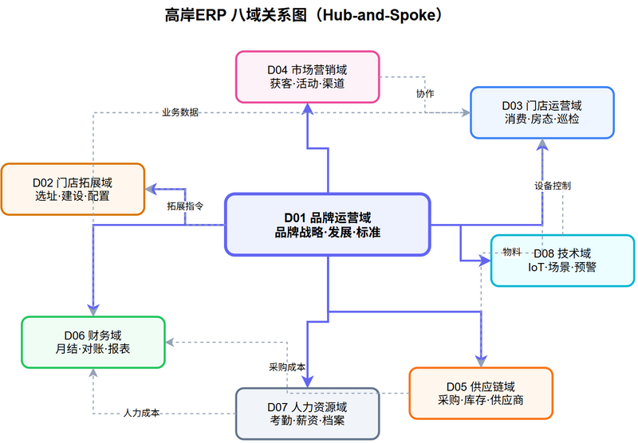
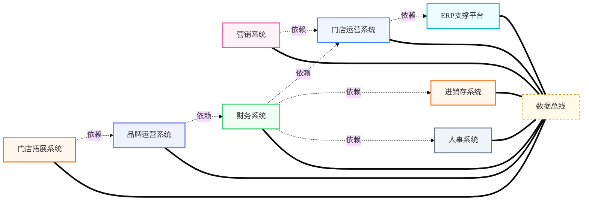
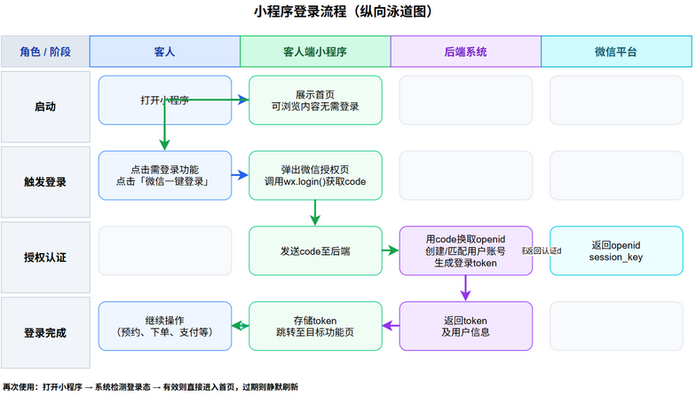
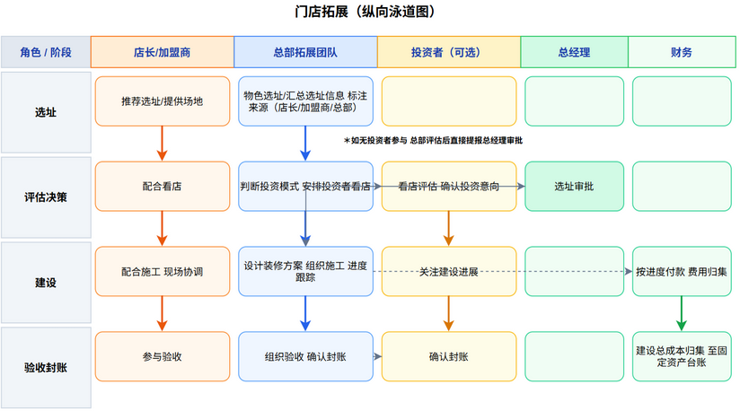
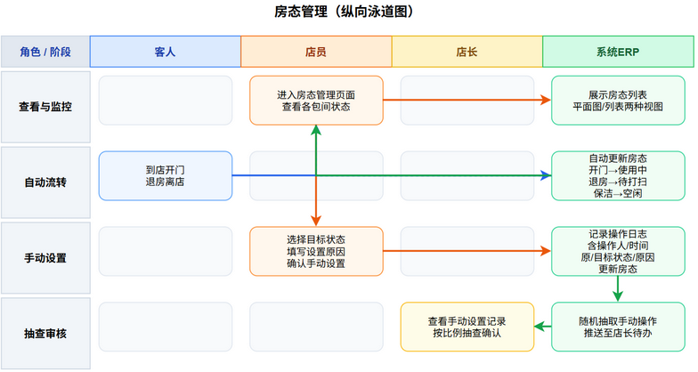
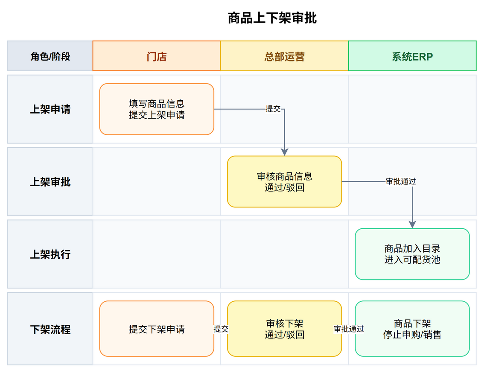
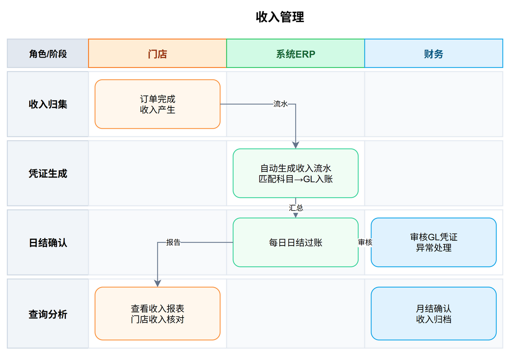
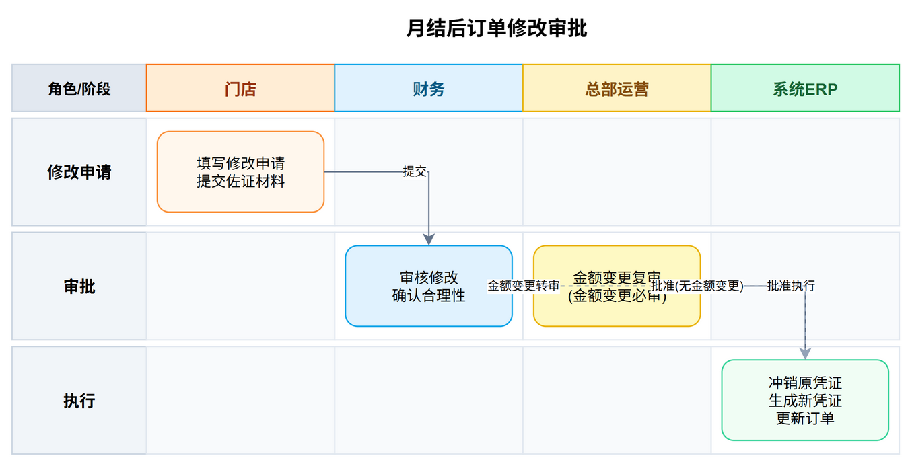

# 高岸茶室ERP系统需求说明书

**版本**：V10.10
**日期**：2026年5月10日
**文档状态**：评审中
**编制依据**：
- 《高岸账务结算规范2025》
- 《金德店月度经营报告-2026年4月》
- 《月结操作规范》
- 《面向对象建模方法论》（方法论1、2、3、4）
- 2026年5月9日评审意见（动态价格体系需求）
- 《AI时代本体平台驱动架构（企业纯化版）V8.5》
- 2026年5月1日、5月3日需求讨论会纪要
- 2026年5月4日Deepseek讨论意见（25条修改意见）
- 2026年5月5日盈隆店项目组评审意见
- 2026年5月7日评审意见

---

## 第一章：项目总览

### 1.1 项目背景

高岸茶室目前以连锁门店模式运营，已开设盈丰店、金德店两家门店，盈隆店正在筹备中。日常经营涉及两条主营业务线：

- **空间租用**：包间、会议室按时/场次计费，客人通过美团、抖音或到店消费
- **零售**：茶叶、茶具、茶点、套餐等商品销售

此外还有会员充值（预付款，属于债务性收入）、充电宝分成、广告分成、赔偿金等辅助收入。

当前各门店的数据（订单、收入、支出、库存）分散在随手记、Excel、各平台后台（美团、抖音、茗匠等），月结工作依赖财务人员手工汇总，对账耗时且容易出错。智能化设备（门锁、空调、灯光）未与经营系统联动，客人从预约到退房全流程存在较多人工干预。

---

### 1.2 核心目标

本项目旨在建立统一的ERP系统，实现两大核心目标，为茶室连锁化运营提供系统化的管理支撑。

| 目标编号 | 目标 | 说明 | 衡量标准 |
|---------|------|------|---------|
| **G1** | 全自动月结 | 每月自动生成《月度经营报告》，收入自动归集、支出自动汇总、利润自动计算，替代手工Excel操作 | 月结操作时间从3天缩至1小时内 |
| **G2** | 物联网设备全流程自动化 | 从客人预约/支付到开门、使用、退房、保洁，全链条由系统自动控制门锁、灯光、空调、音乐等设备，减少人工干预 | 客人到店消费全流程人工介入次数≤1次（仅保洁） |

所有其他功能（收支科目配置、多门店支持、报表导出、AI预警等）均为支撑上述两大目标而设。

---

### 1.3 设计原则

| 原则 | 说明 |
|------|------|
| **业务场景驱动** | 系统围绕茶室经营的实际业务场景构建，以"引流→消费→结算→管理"四大核心链路为功能组织主线，确保每一功能模块均有明确的业务归属 |
| **管理效能导向** | 以提升运营管理效率为直接价值衡量标准，重点消除手工月结、人工对账、线下巡店等低效环节，实现经营数据的自动归集与实时可查 |
| **架构弹性预留** | 采用可扩展架构设计，支撑从单店到多店、从直营到加盟的管理规模演进，关键设计节点保留扩展能力，避免因过度设计导致的建设浪费 |
| **极简交互（IoT）** | 物联网控制以极简操作为设计目标，一键切换场景模式（品茶/会议/K歌），降低门店员工的学习成本与操作负担 |

| **参考行业标准模型** | 系统数据模型充分参考 Microsoft Common Data Model（CDM）标准，CDM 包含 5,000+ 预定义业务实体，覆盖财务、供应链、人力资源、客户关系等核心业务域。通过映射 CDM 实体定义（详见 2.5 节），确保数据结构规范、扩展性好，降低因需求变更带来的数据模型重构风险。CDM 实体定义发布于 GitHub（microsoft/CDM），以开放标准形式持续演进。 |

#### 1.3.1 需求分析方法说明

本需求说明书采用"**从结果反推需求**"的方法进行编写。以月结报告这一经营结果的最总呈现为起点，反向追溯每一组数据项的业务来源（订单→收入流水→会计凭证→月结报告），确保所有功能需求均有明确的财务归宿，避免需求遗漏和功能碎片化。

---

### 1.4 业务类型概述

高岸茶室的经营收入来源于以下业务类型：

#### 1.4.1 主营业务

| 业务类型 | 说明 | 计费方式 | 典型场景 |
|---------|------|---------|---------|
| 空间租用（包间/会议室） | 客人按小时/场次租用包间或会议室 | 时租或场租，不同时段不同价格 | 商务洽谈、朋友聚会、一人品茶、企业培训、团队会议 |
| 商品零售 | 茶叶、茶具、茶点、套餐等 | 按件/按份计价 | 客人到店购买、外卖 |
| 品牌特许经营 | 加盟商支付的品牌使用权及运营管理服务费用 | 一次性品牌加盟金 + 年度品牌管理费 | 加盟店签约、续约 |

#### 1.4.2 辅助收入

| 收入类型 | 说明 | 处理方式 |
|---------|------|---------|
| 会员充值 | 客人预存余额，后续消费扣减 | 债务性收入，消费发生时确认收入 |
| 平台补贴 | 美团/抖音等平台的营销补贴 | 按平台结算单确认收入 |
| 充电宝分成 | 与充电宝供应商的分成收入 | 按供应商结算周期确认 |
| 广告分成 | 包间内展示广告的分成 | 按合同周期确认 |
| 赔偿金 | 客人损坏物品的赔偿 | 偶发收入，发生时确认 |

#### 1.4.3 收入结构

系统区分总部收入与门店收入两大类，两者性质不同、科目独立。

**总部收入**（由品牌运营域管理）：
| 收入类型 | 说明 |
|---------|------|
| 加盟费 | 一次性品牌加盟金，新加盟商签约时收取 |
| 设计费 | 总部为门店提供空间设计服务收取的设计费用 |
| 管理费 | 年度品牌管理费，加盟店按年缴纳 |
| 供应链收入 | 总部向各门店统一供应茶叶等商品产生的批发收入 |

**门店收入**（由门店运营域管理）：
| 收入类型 | 说明 |
|---------|------|
| 空间租用收入 | 包间/会议室按小时或场次计费的收入 |
| 商品零售收入 | 茶叶、茶具、茶点等现场零售收入 |
| 平台外卖收入 | 通过美团/抖音外卖产生的商品销售收入 |

#### 1.4.4 组织架构与基础实体

**组织架构**（树形结构）：
```
高岸总部（高岸总公司）
├── 门店A（对应公司A或个体户A）
│   ├── 运营部
│   │   ├── 员工1
│   │   └── 员工2
│   ├── 人事行政部
│   │   └── 员工3
│   └── ...
├── 门店B（对应公司B或个体户B）
│   └── ...
└── ...
```

**基础业务实体**：
| 实体 | 说明 |
|------|------|
| 公司 | 法律主体，总部为高岸总公司，各门店对应各自的公司或个体户 |
| 法人 | 公司的法定代表人 |
| 股东 | 持有品牌股份（品牌股东）或门店股份（门店股东）的自然人或法人 |
| 资金账户 | 公司/门店的银行账户，用于收支结算 |

组织架构的要点：
- **总部（根节点）**：高岸总公司，对应公司实体
- **门店（一级节点）**：每家门店对应一个公司或个体户，独立核算
- **部门（二级节点）**：各门店下可设子部门（运营部、人事行政部等）
- **员工（末端节点）**：所有员工隶属于某个部门，通过部门归属确定其门店和总部关系

---

### 1.5 经营模式概览

#### 1.5.1 单店经营模式

高岸茶室的单店经营模式可用四大环节概括，所有系统建设均围绕这四大环节展开：


**第一环：引流** — 获客与营销
- 美团、抖音等平台作为流量入口，客人通过平台下单或购买团购券
- 自有小程序作为私域阵地，支持预约、点单、会员充值（详见2.3客户端应用视图）
- 营销活动（优惠券、限时折扣、新客礼包）在各渠道开展
- 会员推荐裂变，老客带新客

**第二环：消费** — 客人到店至离店的全流程
- 预约→到店→开门→使用包间（空调/灯光/音乐自动开启）→点单加购→退房→结算→离店
- 物联网设备在关键节点自动响应，减少人工干预
- 保洁任务在退房后自动触发
- 通过打造极致的到店体验，让客人自发"种草"传播，形成口碑裂变

**第三环：结算** — 收入归集与财务月结
- 每笔订单结束后自动与平台账单比对，差异生成工单
- 每日凌晨自动日结，生成会计凭证
- 每月25日自动月结，生成月度经营报告
- 收入、支出、利润全链条自动计算

**第四环：管理** — 门店运营的管控与决策
- 店长管理本店日常运营（员工排班、采购申请、巡检督导）
- 经营数据实时可查（日营收、客流、商品销售）
- 支出按预算科目管理，审批留痕
- AI预警系统辅助识别经营异常和风险

#### 1.5.2 加盟经营模式

在单店模型基础上，品牌化加盟经营构成第二条价值链路：


**品牌建设** — 建立标准化的品牌体系（视觉识别、服务流程、运营规范），形成可复制的单店模型，为加盟扩张奠定基础。

**加盟招商** — 拓展加盟商，完成加盟签约，收取一次性品牌加盟金。

**赋能输出** — 向加盟商输出成熟的运营体系：ERP系统平台、供应链资源、员工培训体系，使加盟店快速复制总部的运营能力。

**品牌管理** — 持续督导加盟店运营质量，收取年度品牌管理费，维护品牌统一性。

加盟经营与单店经营通过ERP系统实现数据贯通——总部可查看加盟店的经营数据，加盟店使用总部提供的系统平台进行日常运营。

---

### 1.6 用户角色定义

| 角色 | 所属 | 核心职责 | 使用终端 |
|------|------|---------|---------|
| 客人 | 外部 | 预约包间、下单支付、到店消费、查看订单、会员注册与充值、优惠券使用 | 客人端小程序 |
| 店员 | 各门店 | 房态管理、保洁任务、对账工单、商品管理、考勤打卡 | 移动端 + PC |
| 保洁员 | 各门店/外部 | 保洁任务接单与完成、设备故障标记 | 移动端（保洁专用入口，仅查看保洁任务） |
| 店长 | 各门店 | 本店报表查看、支出审批、员工管理、巡检审核、设备管理、采购审批 | 移动端 + PC |
| 总部运营 | 总部 | 门店管理、营销管理、采购管理、库存监控、会员管理、预警处理 | PC + 移动端 |
| 财务 | 总部 | 月结操作、对账监控、支出审批、分红计算、报表审核 | PC + 移动端 |
| 投资人 | 外部 | 查看投资门店的财务数据、分红记录、重大告警 | 移动端（简化视图） |
| 系统管理员 | 总部（技术） | ERP系统日常运维、用户权限管理、设备管理维护、审计日志查看 | PC + 移动端 |

---

---

## 第二章：业务域与子系统

### 2.1 业务域划分

系统按企业部门设置划分为八个业务域，按品牌运营→门店拓展→门店运营→市场营销→供应链→财务→人力资源→技术的价值链顺序排列。

| 编号 | 业务域 | 对应部门 | 核心职责 |
|------|--------|---------|---------|
| D01 | 品牌运营域 | 总经办 | 品牌战略、发展规划、品牌建设与标准、品牌运营看板、投资者关系、集中审批 |
| D02 | 门店拓展域 | 拓展部/项目部 | 门店选址、建设施工、设计图/施工图管理、门店创建与配置 |
| D03 | 门店运营域 | 运营部 | 门店日常经营、客户服务、空间租用、房态管理、保洁任务、门店巡检 |
| D04 | 市场营销域 | 市场部 | 客户获取、营销活动、优惠券管理、渠道运营 |
| D05 | 供应链域 | 采购部/仓储部 | 商品采购、库存管理、供应商管理 |
| D06 | 财务域 | 财务部 | 收入管理、支出管理、月结对账、股东分红、报表体系 |
| D07 | 人力资源域 | 人事行政部 | 考勤管理、薪资核算、员工档案 |
| D08 | 技术域 | 技术部 | IoT设备管理、智能场景控制、系统运维、AI经营预警 |

#### 域间关系说明



---

### 2.2 子系统定义

每个业务域对应一个子系统，子系统负责该域内的功能实现和数据管理。

| 子系统 | 对应业务域 | 主要用户 | 说明 |
|--------|-----------|---------|------|
| 品牌运营系统 | 品牌运营域 | 总部运营、投资人 | 品牌加盟管理、品牌标准管理、运营看板、投资者关系、集中审批 |
| 门店拓展系统 | 门店拓展域 | 总部工程/项目 | 门店选址、建设管理、设计图纸管理、门店配置 |
| 门店运营系统 | 门店运营域 | 店员、店长、客人 | 核心业务系统，处理预约、消费、房态等 |
| 营销系统 | 市场营销域 | 总部运营 | 活动创建、优惠券配置、第三方平台活动管理、效果分析 |
| 进销存系统 | 供应链域 | 店长、总部运营 | 采购、库存、供应商全链路管理 |
| 财务系统 | 财务域 | 财务、店长 | 月结、对账、分红、报表 |
| 人事系统 | 人力资源域 | 店长、总部 | 考勤、薪资、档案管理 |
| ERP支撑平台 | 技术域 | 系统管理员、技术运维 | ERP系统技术底座，含IoT设备管理、智能场景控制、AI经营预警引擎、系统日志与监控、运维管理 |

#### 子系统依赖关系



**依赖说明**：
- 门店运营系统依赖**IoT平台**提供设备控制能力
- 财务系统依赖**门店运营系统**、**进销存系统**、**人事系统**提供业务数据
- 品牌运营系统依赖**财务系统**提供决策数据
- 门店拓展系统依赖**品牌运营系统**获取拓展指令和品牌标准
- 营销系统依赖**门店运营系统**执行活动配置
- 各子系统通过统一**数据总线**交换数据，不直接访问对方数据库

---

### 2.3 客户端应用视图

系统通过四个微信小程序端覆盖不同角色的使用场景，各终端的功能矩阵如下：

| 终端 | 使用角色 | 核心功能 | 使用方式 |
|------|---------|---------|---------|
| **客人端小程序** | 客人 | 包间预约与支付、商品零售购买、会员注册/充值/余额查询、优惠券查看与核销、订单查询 | 微信小程序，客人扫码或搜索进入 |
| **店员端小程序** | 店员、店长、保洁员 | 店员/店长：房态管理、保洁任务、对账工单、商品管理、考勤打卡、门店巡检、IoT设备状态查看<br>保洁员：保洁任务接单与完成、设备故障标记（受限权限，仅保洁相关功能可见） | 微信小程序，员工账号登录；保洁员可单独开通保洁专用权限 |
| **总部端小程序** | 总部运营、财务、系统管理员 | 多门店经营看板、收入/支出数据概览、月结操作入口、审批处理、营销活动配置、预警通知、系统运维与日志查看、用户权限管理 | 微信小程序，总部账号登录 |
| **加盟商端小程序** | 加盟店店长、投资人 | 本店经营数据查看、品牌管理费缴纳、总部分配任务接收、基础运营功能（房态/保洁） | 微信小程序，加盟商账号登录 |

#### 2.3.1 终端功能矩阵说明

**客人端小程序**是面向最终消费者的核心触点，覆盖从引流到结算的全链路自助操作。所有功能均通过小程序内的"首页-门店-我的"三个底部Tab组织：首页展示推荐包间和营销活动，门店页承载预约和点单流程，我的页集中管理订单、会员、优惠券等信息。

**店员端小程序**是门店运营的移动工作台，聚焦任务处理和状态管理。店员登录后默认展示今日待办（保洁任务、对账工单），并可快速切换至房态视图和商品管理。店长在店员端基础上增加审批入口和数据看板。

**总部端小程序**面向多门店管理和系统运维场景，提供聚合数据视图和集中管控入口，便于总部运营、财务和系统管理员在移动端快速处理审批、查看关键指标、接收预警通知、执行系统运维操作。

**加盟商端小程序**专为加盟体系设计，加盟店使用独立终端访问本店数据，同时接收总部的品牌管理要求和任务指派。加盟商端的数据范围严格限定于本店，不可跨店查看。

#### 2.3.2 小程序登录流程

四个小程序端均基于微信登录能力实现身份认证，登录流程如下：

**首次使用**：
1. 用户打开小程序，进入首页（客人端可浏览内容，无需强制登录）
2. 用户点击需登录的功能（预约、支付、下单、查看订单等），系统弹出微信授权登录页
3. 用户点击"微信一键登录"，授权小程序获取微信昵称和头像
4. 系统自动创建用户账号（客人端）或匹配已有员工/管理员账号（店员/总部/加盟商端）
5. 登录成功，用户继续操作

**再次使用**：
1. 用户打开小程序，系统自动检测微信登录态
2. 登录态有效 → 直接进入首页，保持登录状态
3. 登录态过期 → 静默重新登录（用户无感知），失败则提示重新授权

**登录态管理**：
- 客人端登录态有效期7天，过期后需重新授权
- 店员/总部/加盟商端登录态有效期24小时，支持密码+验证码方式登录
- 客人端首次登录时自动完成会员注册（以微信openid作为会员标识）
- 不同端的数据权限在登录后由角色权限体系控制（详见 4.3 节）

<div align="center">


</div>

---

### 2.4 系统边界

#### 2.4.1 首期系统边界

| 子系统 | 包含功能范围 |
|--------|-------------|
| 门店运营系统 | 包间预约与使用、商品零售与外卖、会员管理（注册/充值/消费/退费）、房态管理、保洁任务（含保洁员考核与薪资管理）、门店巡检 |
| 营销系统 | 营销活动创建与配置、优惠券管理、第三方平台活动管理、活动效果分析 |
| 进销存系统 | 采购申请与审批、入库管理、库存管理与预警、门店间调拨、盘点、供应商档案管理、商品管理 |
| 财务系统 | 自动月结与日结、收入归集与核算、支出管理（请款/报销）、平台对账与差异工单、股东分红计算、报表体系（月度经营报告/日营收走势/同比环比分析） |
| 人事系统 | 考勤打卡、请假审批、绩效考核、薪资核算、员工档案管理、智能排班 |
| 品牌运营系统 | 发展规划、品牌建设、品牌运营看板（合并报表/利润排名）、投资者关系、集中审批 |
| 门店拓展系统 | 门店选址、建设管理、设计图/施工图管理、门店创建与信息配置 |
| ERP支撑平台 | 系统运维管理、IoT设备管理（门锁/空调/灯光/音乐/窗帘）、智能场景控制（欢迎/品茶/会议/K歌/节能/预开）、AI经营预警引擎、系统日志与监控 |

#### 2.4.2 远期扩展功能

| 功能 | 说明 |
|--------|------|
| 复杂税务自动计算 | 仅记录税金支出，税务申报由财务人员通过税务系统完成 |
| 巡店视频AI分析 | 成本高、投入产出比低，留待后续 |
| 供应链金融 | 超出当前业务阶段 |

---

### 2.5 数据标准映射（Microsoft Common Data Model）

#### 2.5.1 引用说明

Microsoft Common Data Model（CDM）是一个由微软维护的开源标准业务数据模型，包含 5,000+ 预定义业务实体，按 applicationCommon、foundationCommon、operationsCommon、industryCommon 等逻辑分组发布，源代码托管于 GitHub（microsoft/CDM）。

高岸ERP 参考 CDM 的实体定义，将 8 大业务域中的核心概念映射至 CDM 标准实体，目的如下：

- **规范数据结构**：直接复用经广泛验证的实体定义，避免自创数据模型带来的设计缺陷
- **提升扩展性**：为未来功能扩展提供标准化的实体扩展点，降低因需求变更导致的数据模型重构风险
- **便于对接**：若后续与第三方系统（财务软件、CRM、电商平台）对接，CDM 模型可减少数据转换成本

以下给出各业务域的 CDM 实体映射表，标注每一映射的匹配程度（精确映射/近似映射/概念映射）。

#### 2.5.2 域间CDM实体总览

| 高岸业务域 | 主要CDM实体组 | 实体数量（映射） | 匹配程度 |
|-----------|--------------|----------------|---------|
| D01 品牌运营域 | applicationCommon（Organization/BusinessUnit/Goal/GoalMetric/Territory） | 8 | 近似映射为主 |
| D02 门店拓展域 | applicationCommon（Account/Lead/Opportunity）+ 自定义扩展（门店建设/设计图纸） | 5 | 概念映射+自定义 |
| D03 门店运营域 | applicationCommon（Account/Contact/Order/Appointment/Service/Task） | 12 | 精确映射为主 |
| D04 市场营销域 | applicationCommon（Campaign/Lead/Opportunity/MarketingList/Segment）+ 客户标签 | 9 | 精确映射为主 |
| D05 供应链域 | foundationCommon + operationsCommon（Product/PurchaseOrder/Vendor/Inventory/Warehouse）+ 批次/有效期 | 13 | 精确映射为主 |
| D06 财务域 | operationsCommon（MainAccount/Ledger/Budget/Invoice/Payment/FiscalCalendar）+ GL凭证/AP | 14 | 精确映射为主 |
| D07 人力资源域 | operationsCommon（Employee/Job/Position/Payroll/Compensation） | 8 | 精确映射为主 |
| D08 技术域 | applicationCommon（Device/SystemJob/AuditLog）+ 自定义扩展 | 5 | 概念映射+扩展 |

#### 2.5.3 逐域实体映射

各业务域与 CDM 实体的逐域映射表（含 69 个实体的精确映射/近似映射/概念映射标注）已整理至独立文档《高岸ERP系统-CDMA实体映射说明书》，本文档不再逐表罗列，仅保留域间总览表（见 2.5.2）。

---


## 第三章：功能需求


### 3.1 品牌运营域

品牌运营域是品牌的决策中枢，负责品牌战略、发展规划和品牌标准建设。从系统开发视角，该域提供支撑品牌运营的职能模块，包括发展规划、品牌建设、品牌运营看板、投资者关系。各业务模块中涉及的审批流程均通过统一的工作流引擎驱动（详见 4.7 节）。

#### 3.1.1 发展规划

**功能描述**：总部制定品牌中长期发展目标与经营计划，统筹门店网络规划，跟踪战略执行进度，确保品牌持续健康发展。

**功能点**：

**年度目标管理**：
- 经营目标设定：营收目标、利润目标、门店数量目标、会员增长目标
- 目标分解与下达：按季度/月度分解至各门店，支持调整和审批
- 目标达成跟踪：关键指标仪表盘，偏差自动告警

**门店网络规划**：
- 区域布局规划：目标区域分析、开店节奏规划、直营/加盟占比策略
- 规划执行跟踪：已开店 vs 计划开店对比，进度看板
- 市场分析看板：区域消费趋势、竞品分布（预留外部数据接入）

**战略执行**：
- 里程碑管理：重大事项（品牌升级、新市场进入、组织变革等）的计划与跟踪
- 经营分析报告：周期性战略回顾，输出调整建议

---


#### 3.1.2 品牌建设

**功能描述**：统一管理品牌标准、视觉资产和品牌制度的制定、发布与落地检查。

**功能点**：

**品牌标准管理**：
- 品牌定位与核心价值文档管理
- 视觉识别系统（VI）规范归档与版本管理
- 空间设计标准手册管理

**品牌资产库**：
- 品牌数字资产管理（Logo、标准色、字体、品牌物料模板）
- 资产分类与搜索（按类型、适用场景、更新时间检索）
- 资产下载与分发记录（各门店使用情况跟踪）

**品牌制度与审计**：
- 运营标准手册、服务质量标准、员工行为规范的制定与发布
- 品牌执行检查：门店门头、店内标识、物料使用等合规情况巡检
- 新店品牌导入：开业品牌物料配置清单及发放跟踪

---


#### 3.1.3 品牌运营看板

**功能描述**：总部实时查看全品牌经营数据，支持跨店对比和决策分析。

**功能点**：
- 全品牌总览（总营收、总支出、总利润、各店排行）
- 各店经营数据对比（收入/支出/利润/客流/客单价）
- 趋势分析（月度趋势、同比/环比）
- 门店经营健康度评分（基于营收、成本、客流、巡检等综合指标）
- 异常门店自动标红

**看板模板（示例）**：

| 维度 | 指标 | 门店A | 门店B | 门店C | 目标值 |
|------|------|-------|-------|-------|-------|
| 营收 | 月营收（万元） | — | — | — | — |
| 营收 | 环比增长率 | — | — | — | — |
| 成本 | 成本率 | — | — | — | — |
| 客流 | 月客流（人次） | — | — | — | — |
| 客单价 | 平均客单价（元） | — | — | — | — |
| 会员 | 活跃会员数 | — | — | — | — |
| 健康度 | 综合评分 | — | — | — | — |


---


#### 3.1.4 投资者关系

**功能描述**：投资人查看投资门店的财务数据和分红记录。

**功能点**：
- 投资门店列表（个人投资的门店、持股比例）
- 财务看板：实时营收、门店利润排名（仅限投资门店）
- 近6个月利润趋势图
- 分红记录查看（历史分红明细、到账状态）
- 重大告警推送（设备批量离线、对账大额差异、连续亏损等）

**业务规则**：
- 投资人仅可查看自己投资的门店数据
- 财务看板数据来自已确认的月结报告，非实时流水
- 重大告警实时推送（不依赖月结周期）

**股东信息管理**：

统一管理品牌股东和门店股东的基础信息，为股东分红提供数据基础。

**字段模板**：

| 字段 | 说明 | 备注 |
|------|------|------|
| 股东编号 | 系统自动生成 | 唯一标识 |
| 股东姓名/名称 | 自然人或法人全称 | — |
| 股东类型 | 品牌股东 / 门店股东 | 品牌股东持股对象为品牌整体；门店股东持股对象为具体门店 |
| 证件类型 | 身份证 / 统一社会信用代码 | — |
| 证件号码 | 对应证件编号 | — |
| 持股对象 | 品牌名称 / 具体门店名称 | 选择门店时限定已有门店 |
| 持股比例（%） | 持股百分比 | 同一持股对象所有股东比例之和≤100%，系统自动校验 |
| 出资额（元） | 初始出资金额 | — |
| 出资日期 | 实际出资日期 | — |
| 累计分红金额（元） | 系统自动汇总 | 从分红模块读取 |
| 联系电话 | 股东联系方式 | — |
| 通讯地址 | — | — |
| 银行账户信息 | 开户行、户名、账号 | 分红打款使用 |
| 状态 | 正常 / 冻结 / 退出 | 退出后不再参与后续分红 |
| 退出日期 | 股东退出日期 | 退出时填写 |
| 退出原因 | — | 退出时填写 |
| 录入时间 | 系统自动记录 | — |

**功能点**：
- 股东信息新增、编辑、查看
- 股东退出处理（记录退出日期、退出原因，状态变更为"退出"）
- 持股比例变更记录（变更前后对比、变更人、变更时间）
- 股东信息列表查询与导出（支持按股东类型、门店、状态筛选）
- 与分红模块联动：累计分红金额自动汇总

**业务规则**：
- 品牌股东持股对象为品牌整体，门店股东持股对象为具体门店，两类互不干扰
- 同一持股对象的股东持股比例之和不得超过100%，系统在新增或变更股东信息时自动校验
- 股东退出后不再参与后续分红，历史分红记录保留备查
- 股东信息变更必须留痕：记录变更人、变更时间、变更前后对比、变更原因
- 股东信息属于敏感数据，仅财务和总部运营角色可查看和编辑

**投资者关系看板（示例）**：

| 我的投资 | 投资门店数 | 总投资金额 | 累计分红 | 收益率 |
|----------|-----------|-----------|---------|-------|
| — | — | — | — | — |

**投资门店明细**：

| 门店 | 持股比例 | 本月营收 | 本月利润 | 累计分红 | 到账状态 |
|------|---------|---------|---------|---------|---------|
| — | — | — | — | — | — |


---


### 3.2 门店拓展域

门店拓展域负责从选址到建店的全过程管理，包括门店选址、建设施工、设计图纸管理和门店配置。该域支持投资者参与和不参与两种模式，建设完成后自动封账归集为固定资产。

#### 3.2.1 门店选址与建设

**功能描述**：总部从选址到建设完成的全过程管理，支持投资者参与和不参与两种模式，记录门店建设投资，建设完成后自动封账。

**店铺来源**：
- **店长推荐**：现有店长基于本地资源推荐选址
- **加盟商提供**：加盟商自带物业或推荐场地
- **总部物色**：总部拓展团队主动选址

**功能点**：

**门店选址（投资者参与模式）**：
- 选址信息提报（来源标注、区域、地址、面积、租金、周边环境评估、推荐理由）
- 投资者看店评估：系统安排投资者实地看店，记录评估意见
- 投资意向确认：投资者在线确认投资意向及投资金额
- 选址审批（总部评审 → 总经理批准）
- 历史选址记录查询

**门店选址（投资者不参与模式）**：
- 选址信息提报（来源标注、区域、地址、面积、租金、周边环境评估）
- 选址审批（店长推荐/总部物色 → 总部评审 → 总经理批准）
- 历史选址记录查询

**门店建设**：
- 门店建设计划：制定建设里程碑和时间节点（设计→施工→验收→开业），对照计划跟踪进度，超期自动预警
- 建设费用归集：装修工程费、设备采购费、物资采购费、人工费等分类记录
- 建设进度跟踪：各阶段完成时间、验收记录、施工方信息
- 建设完成后自动封账，封账后不可修改，转为历史存档
- 封账后的建设总成本归集至该门店的固定资产台账

<div align="center">


</div>

---

#### 3.2.2 设计图/施工图管理

**功能描述**：总部统一管理门店建设过程中的设计图和施工图，支持图纸上传、版本管理和施工方查阅。

**功能点**：
- **图纸上传与归档**：空间设计图、施工图、水电图、消防图等分类上传，支持 DWG/PDF/图片格式
- **版本管理**：图纸修改记录版本历史，支持版本对比和回退
- **施工方查阅**：施工方通过系统查阅最新版图纸，确保按图施工
- **图纸关联门店**：每套图纸关联至具体门店建设项目
- **审批与确认**：设计图需经总部审批确认后方可交付施工

#### 3.2.3 门店创建与信息维护

**功能描述**：总部统一管理各门店运营参数、包间信息和基础数据。

**功能点**：

**门店管理**：
- 门店创建与信息维护（名称、地址、电话、营业时间、门店类型：直营/加盟）
- 门店状态管理（营业中/暂停营业/装修中/已关闭）
- 门店运营参数配置（结算周期、配送费规则、保洁超时阈值）

**包间管理**：
- 包间创建与配置（名称、照片、容纳人数、设施类型、价格体系）
- 包间状态管理（启用/停用/维修中）
- 包间设施标注（投影仪、音响、茶台、K歌设备等）

**动态价格体系**：

功能描述：包间价格支持动态调整，系统根据预设规则在基础价格上自动计算实时价格，适应不同时段、节假日和特殊活动的市场需求。

定价原则：
1. **平日基准价**：每个包间设定平日基准价（元/小时），作为价格计算的基础
2. **时段系数**：工作日白天为基准系数1.0，工作日夜间（18:00后）系数1.2，周末及法定节假日系数1.3-1.5
3. **活动/节日溢价**：重大活动或热门节日期间，系统支持预设溢价系数，自动调升价格：
   - 广交会期间（每年4月15日-5月5日、10月15日-11月4日）：系数1.5-2.0
   - 情人节（2月14日）：系数1.5
   - 圣诞节（12月24日-25日）：系数1.3
   - 元旦（12月31日-1月1日）：系数1.4
   - 春节（农历除夕至初六）：系数1.5
   - 中秋、国庆（10月1日-7日）：系数1.5
   - 其他自定义活动：总部运营可创建自定义活动时段并配置系数
4. **闲时折扣**：工作日白天（10:00-16:00）可配置折扣系数（如0.8），鼓励非高峰时段消费
5. **会员专属价**：不同等级会员享受差异化折扣（普通会员无折扣、银牌9.5折、金牌9折、钻石8.5折），会员折扣与活动溢价叠加计算
6. **长时折扣**：单次预约满3小时享9折、满5小时享8.5折（可与会员折扣叠加）
7. **人数差异化定价**：同一包间根据使用人数采用阶梯定价，人数越多单价越高（反映多人使用带来的设备损耗与服务成本）。各包间人数-价格对照表由门店独立配置：
   - 大茶室C（RM004，最大6人）：2人¥98/h、3人¥118/h、4人¥138/h、5人¥158/h、6人¥178/h
   - 大会议室（RM001，最大10人）：4人¥158/h、6人¥188/h、8人¥218/h、10人¥258/h
   - 中茶室A/B（RM002/RM003，最大4人）：2人¥88/h、3人¥118/h、4人¥128/h
8. **夜间与通宵套餐**：23:59至次日8:00期间提供固定价格套餐，不适用人数差异化定价及会员折扣：
   - 夜间套餐：¥278/3小时（23:59-8:00间任意连续3小时）
   - 通宵套餐：¥418/整夜（23:59-8:00全时段）

计算规则：
- 标准预约实时价格 = 所选人数对应单价 × 时长（小时） × 时段系数 × 活动系数（如有） × 长时折扣（如适用）
- 夜间套餐/通宵套餐为固定价格，不适用时段系数、人数差异化定价、长时折扣及会员折扣
- 会员实付价 = 实时价格 × 会员折扣系数（夜间/通宵套餐除外）
- 多个活动重叠时取最高活动系数，不叠加
- 价格展示在客人端小程序实时计算，客人下单时锁定价格（锁定后30分钟内支付有效）
- 抖音验券抵扣：团购券码验证通过后，按券面金额抵扣订单金额，差额部分以其他支付方式补足

业务规则：
- 活动日历由总部运营统一维护，至少提前7天发布
- 活动溢价期间不执行闲时折扣（活动系数优先于闲时折扣）
- 价格变动历史完整记录，支持追溯和审计
- 包间基准价调整需店长审批，活动系数调整需总部审批
- 人数-价格对照表调整需店长审批

**基础数据配置**：
- 收支科目体系配置（一级科目、二级科目、适用门店）
- 支付方式管理（微信/支付宝/会员余额/美团/大众点评/抖音验券，各店可独立启用/关闭）
- 审批流程配置（按金额阈值配置审批节点）
- 通用参数配置（营业时间模板、计费单位、超时规则）

<div align="center">

**门店配置泳道图**：


</div>

---

### 3.3 门店运营域
#### 3.3.1 空间租用（包间预约与消费）

**功能描述**：客人通过小程序选择门店、包间、时段，完成下单支付，系统自动处理预约确认、门禁密码生成和IoT设备联动。

**前置条件**：
- 客人已登录小程序（支持微信一键登录，无需注册）
- 所选门店在营业时间内
- 所选包间在目标时段内空闲

**操作流程**：
1. 客人进入小程序首页，选择目标门店（按距离排序，展示门店图片、评分、距离）
2. 选择包间（展示包间图片、容纳人数、实时价格（含动态定价明细）、设施说明）
3. 选择日期和时段（以30分钟为单位，展示可用时段及对应价格，价格随活动/节日/时段动态变化）
4. 确认订单信息，选择支付方式（微信/支付宝/会员余额/美团/大众点评/抖音验券）。选择抖音验券时，客人输入团购券码，系统验证券码有效性并自动抵扣对应金额
5. 支付完成 → 系统生成预约单
6. 系统自动生成临时门禁密码（支持离线动态密码方案）
7. 推送预约成功通知给客人（含门禁密码、到店指引）
8. 预约开始前5分钟，系统发送预开空调指令至IoT平台

**业务规则**：
- 可预约范围：当前时间+2小时至90天内
- 预约最小单位：30分钟
- 超时保留：超过预约时间30分钟未开门，系统自动取消预约并释放包间
- 取消政策：预约开始时间前2小时以上可免费取消；2小时内取消收取定金的50%作为违约金
- 续订：使用中可自助续订，续订时长以30分钟为单位，结束时间自动对齐整点（:00）或半点（:30）。续订需支付额外费用，支付完成后系统自动延长包间使用时间；未支付前续订不生效
- 同一时段同一包间不可重复预约
- 余额抵扣：选择会员余额支付时，系统自动校验余额是否充足。余额不足时提示客人切换支付方式或跳转充值页面；余额充足时直接从账户扣除对应金额
- 提前退房退费：客人提前结束订单时，退还当前时间30分钟以后的剩余费用。计算方式：退款金额 = (剩余分钟数 - 30分钟宽限期) × 每分钟单价。宽限期内（≤30分钟）不退款
- 商品无理由不退换：客人已购买的商品（茶叶、茶点、茶具等），如无质量问题，不支持退款。存在质量问题时，经店员确认后可办理退换

**异常处理**：
- 支付成功但系统异常 → 生成待确认订单，标记为"待人工处理"，推送通知店长
- 门禁密码下发失败 → 店员可通过房态管理手动开门
- 预约时段内设备离线 → IoT平台告警，推送店员处理

<div align="center">

**包间预约到店消费泳道图**：


</div>

---


---

#### 3.3.2 商品零售

**功能描述**：客人通过小程序或到店扫码浏览商品、下单购买，支持自提及外卖两种方式。

**前置条件**：
- 商品已上架且在售状态
- 库存充足（外卖商品检查库存）

**操作流程**：
1. 客人浏览商品（分类：茶叶/茶具/茶点/套餐，支持搜索和筛选）
2. 查看商品详情（图片、价格、规格说明）
3. 加入购物车或直接购买
4. 选择购买方式：自提/外卖（外卖需填写地址，支持外卖平台同步配送）
5. 确认订单并支付
6. 自提：生成取货码，到店出示核销
7. 外卖：推送订单至店员端，店员备货并标记完成

**业务规则**：
- 商品按分类管理，支持多规格（如茶叶可按泡/罐/斤计价）
- 库存实时扣减，库存不足时阻止下单
- 外卖配送费可配置（满免/固定费用/按距离）

**异常处理**：
- 支付成功但库存不足 → 系统锁定库存，若后续确认无货则退款
- 客人未及时取货 → 超过48小时未取货，订单标记为"超时未取"，订单关闭
- 超时关闭的订单不自动退款，客人如需退款须在订单关闭后自行发起退款申请
- 原因：防止超时后客人到店取货而店员未核对订单状态，导致货物损失

<div align="center">

**商品零售与外卖泳道图**：


</div>

---


---

#### 3.3.3 房态管理

**功能描述**：店员/店长实时查看所有包间的状态（空闲/使用中/待打扫/维修），支持远程控制设备。

**前置条件**：用户拥有房态管理权限

**操作流程**：
1. 进入房态管理页面（平面图/列表两种视图）
2. 查看各包间状态（颜色区分：绿色=空闲、蓝色=使用中、黄色=待打扫、红色=维修、紫色=已预定）
3. 点击包间查看详情（当前订单信息、剩余时间、设备状态）
4. 远程控制操作：开门、调温、开关灯（需填写操作原因，关联工单ID）
5. 手动设置房态：点击包间 → 选择目标状态（如"已预定"），填写设置原因（必填，如"客人线下联系预订"），确认后生效

**业务规则**：
- 包间状态由系统自动更新（开门→使用中，退房→待打扫，保洁完成→空闲）
- 手动设置房态仅限以下场景：客人线下联系预订（设为"已预定"）、房间临时维修（设为"维修"）、其他特殊情况（需注明具体原因）
- 所有手动设置操作必须填写设置原因（不少于5个字），系统记录操作人、时间、原状态、目标状态及原因，记入审计日志
- 手动设置的"已预定"状态超过预定时间后若未实际使用，系统自动恢复为空闲，并标记为"预定未履约"记录
- 远程控制记录记入审计日志
- 强制退房需填写理由并确认关联工单
- 店员手动设置房态的操作需店长在24小时内抽查确认（系统随机抽查比例不低于20%），发现滥用追究责任
- 包间分为可预订型（会议室、茶室，支持完整预约/场景切换/保洁流程）与非预订型（展厅、工作间，不对外出租但可远程控制设备）。非预订型房间不生成保洁任务，不参与场景联动

**异常处理**：
- 远程开门失败 → 显示设备离线状态，建议店员到包间手动开门

<div align="center">


</div>

---

#### 3.3.4 保洁任务管理

**功能描述**：客人退房后自动生成保洁任务，分配至当值店员或外包保洁员，超时未完成通知店长。

**前置条件**：
- 客人已退房，房间状态变更为"待打扫"
- 保洁员已开通保洁端权限（支持外包保洁员单独开通，无需拥有店员完整权限）

**操作流程**：
1. 系统自动生成保洁任务（含房间号、退房时间、保洁要求）
2. 推送至店员端/保洁员端，按时间顺序排列，超时高亮
3. 店员/保洁员接单 → 到达房间 → 开始清洁 → 完成清洁
4. 保洁员点击"完成"，系统更新房间状态为"空闲"

**业务规则**：
- 超时定义：退房后30分钟未接单，推送提醒至店长
- 保洁任务按退房时间排序，先退先扫
- 完成保洁必须由店员/保洁员手动确认，系统不自动完成
- 保洁任务可指定给特定店员或外包保洁员，店长可在后台分配
- 外包保洁员通过店员端小程序的保洁专用入口登录，仅看到自己名下的保洁任务，无其他权限
- 保洁检查清单聚焦于表面清洁、地面清扫、茶具清洗、垃圾清运等保洁员可独立完成的项目。AV设备检测（如投影、音响调试）不纳入保洁任务，由店长/店员在巡店流程中另行检查

**保洁缓冲时段**：
- 退房后自动预留 **15分钟保洁缓冲时间**，该时段内房间在预约时间轴上标记为"🧹 准备中"（黄色）
- 缓冲期间的时间槽在客人端小程序和店员端显示为不可预约状态
- 预约时系统自动校验所选时段是否与其他订单的"使用时间+保洁缓冲"重叠，重叠则阻止预约
- 保洁缓冲时长可配置（默认15分钟），店长可在门店运营参数中调整
- 保洁提前完成时，店员手动确认保洁后缓冲立即结束，房间恢复可预约状态

**异常处理**：
- 店员/保洁员长时间未接单（超时30分钟） → 店长收到提醒，可重新指派或转派给外包保洁员
- 保洁中发现设备故障 → 店员/保洁员可在任务中标记异常，自动创建设备维修工单

<div align="center">

**保洁任务与超时升级泳道图**：


</div>

---


---

#### 3.3.5 巡店管理

**功能描述**：系统按规则自动生成巡店计划，店长可自行执行或指派店员执行，按巡检模板逐项检查门店运营状况和安全状况，异常项拍照记录。

**前置条件**：
- 巡检模板已配置（经营检查项+安全检查项）

**操作流程**：
1. 系统按配置规则自动生成巡店计划（默认早晚各一次）
2. 店长可自行执行或指派店员执行巡店
3. 执行人接收巡店任务后，逐项检查，每项标记"正常"或"异常"
4. 异常项需拍照上传并填写说明
5. 提交巡检报告
6. 店长审核巡检报告，对异常项创建整改工单（指派责任人、整改期限）

**巡检内容模板**：

| 检查类别 | 检查项 | 检查标准 | 检查方式 |
|---------|-------|---------|---------|
| **经营规范** | 员工在岗情况 | 当班员工全部在岗，着装统一 | 人员清点+拍照 |
| 经营规范 | 迎宾服务 | 客人到店5分钟内完成接待 | 系统抽查+现场观察 |
| 经营规范 | 包间状态 | 空闲包间已完成保洁，整洁无异味 | 实地检查 |
| 经营规范 | 外卖订单处理 | 已接单外卖按时完成打包，等待取餐 | 系统核对+现场查看 |
| **服务质量** | 客人满意度 | 在店客人无未处理的投诉/差评 | 系统查看+现场询问 |
| 服务质量 | 响应时效 | 客人呼叫后店员5分钟内响应 | 系统记录抽查 |
| **消防** | 灭火器 | 压力正常，未过期，摆放位置正确 | 检查压力表+拍照 |
| 消防 | 消防通道 | 通道畅通无杂物，应急灯正常 | 实地检查+拍照 |
| 消防 | 烟感报警器 | 指示灯正常，无遮挡 | 逐间检查 |
| **卫生** | 公共区域 | 地面整洁，垃圾桶未满溢 | 实地检查+拍照 |
| 卫生 | 洗手间 | 无异味，纸巾/洗手液充足 | 实地检查 |
| 卫生 | 包间 | 地毯/家具无污渍，茶具已消毒 | 抽查+快速检测 |
| **设备** | 门锁 | 在线正常，电量充足 | 系统查看+测试 |
| 设备 | 空调/灯光 | 可正常远程控制，无异常噪音 | 系统测试+实地检查 |
| 设备 | 网络设备 | 路由器/交换机指示灯正常，WiFi可用 | 实地检查+信号测试 |

以上为默认巡检模板，店长可根据门店实际情况增删检查项或调整检查频次。

<div align="center">

**门店巡检与整改泳道图**：


</div>

---


---


### 3.4 市场营销域
#### 3.4.1 营销活动

**功能描述**：总部运营创建营销活动，配置活动规则，在自有渠道（小程序、会员推送）开展活动，跟踪活动效果。

**前置条件**：
- 活动配置已完成（折扣力度、适用商品、时间段、目标客群）

**操作流程**：
1. 总部运营进入营销管理模块，点击"创建活动"
2. 选择活动类型：限时折扣/满减优惠/新客礼包/充值赠金/会员专享
3. 配置活动规则：
   - 活动名称、时间范围（精确到时分）
   - 折扣力度（折扣率/固定金额）
   - 适用商品范围（全品类/指定商品）
   - 适用门店（指定门店/全部门店）
   - 目标客群（全部用户/新用户/会员等级）
4. 设置活动预算上限和风控规则
5. 提交审批（如有金额限制或跨店活动需审批）
6. 审批通过后活动自动生效
7. 系统在自有渠道展示活动（小程序banner、活动页、会员消息推送）
8. 活动运行中实时跟踪数据：曝光量、参与人数、核销量、优惠金额
9. 活动结束后自动生成效果分析报告（ROI、拉新成本、客单价提升）

**业务规则**：
- 同一商品在同一时间段不可叠加多个活动
- 活动预算超支时自动暂停
- 活动信息可撤回修改（仅限未开始的活动）

<div align="center">

**营销活动创建审批发布泳道图**：


</div>

---


---

#### 3.4.2 优惠券管理

**功能描述**：创建和管理优惠券，支持多种发放方式，与会员注册、充值、消费联动。核销数据自动回流客户画像，更新行为标签。

**前置条件**：优惠券模板已配置

**操作流程**：
1. 创建优惠券模板（类型：满减券/折扣券/现金券/体验券）
2. 配置券面值、使用门槛、有效期、适用商品范围
3. 选择发放方式：
   - 新会员注册自动发放（新客礼包）
   - 充值满额赠送
   - 消费后回赠
   - 手动定向发放（指定会员或会员群体）
4. 会员收到优惠券（小程序卡包、消息推送）
5. 消费时自动匹配可用优惠券，客人选择使用
6. 核销后记录使用数据
7. 系统根据核销行为更新客户标签（如"价格敏感型""特定时段活跃""高复购倾向"），标签数据累积用于后续精准营销

**业务规则**：
- 优惠券不可叠加使用（一笔订单仅可使用一张）
- 过期优惠券自动失效
- 退单时优惠券按规则退回或作废
- 优惠券金额纳入营销费用核算
- 客户标签由系统根据消费和核销行为自动更新，支持人工修正

**联动场景**：
- 新会员注册 → 自动发放新客礼包券 → 核销后标记"新客转化成功"
- 会员充值满500元 → 赠送满减券 → 核销后标记"充值敏感型"
- 消费完成 → 回赠折扣券，引导复购 → 多次核销后标记"高复购倾向"
- 连续3次使用夜间时段券 → 自动标记"夜间活跃客群"

<div align="center">

**优惠券发放与核销泳道图**：


</div>
---

#### 3.4.3 第三方平台活动管理

**功能描述**：记录和管理参加第三方平台（美团、抖音、线下平台等）组织的营销活动，跟踪活动投入与产出，支持跨平台效果对比和财务对账。

**前置条件**：
- 第三方平台活动已上线（平台侧已完成活动配置）
- 门店已在该平台完成入驻上架

**操作流程**：
1. 总部运营在系统中创建第三方活动记录，填写活动基本信息：
   - 活动平台（美团/抖音/线下展会/其他）
   - 活动名称、活动时间范围
   - 活动形式（平台补贴/平台满减/平台秒杀/线下展位/异业合作等）
   - 投入成本（报名费/保证金/展位费/平台佣金优惠等）
2. 配置适用门店范围（参与活动的门店列表）
3. 活动运行期间，系统按日/按周汇总各平台活动数据：
   - 曝光量、点击量、下单量、核销量、交易额
   - 平台补贴金额、平台佣金、实际到账金额
4. 活动结束后，系统自动生成活动效果报告，与同周期自有渠道活动进行对比
5. 活动数据推送至财务域，用于平台对账和差异核销

**业务规则**：
- 第三方平台活动与自有渠道活动独立管理，互不干扰
- 同一时间段同一商品可同时参与自有活动和第三方活动，系统分别记录效果
- 第三方活动数据支持手工录入（平台不提供API时）和自动同步（平台提供API时）
- 活动费用按平台归集，纳入营销费用核算

**功能点**：
- 第三方活动档案管理（增删改查，活动状态：计划中/进行中/已结束）
- 多平台活动数据看板（按平台/时间/门店维度聚合展示）
- 平台活动ROI分析（投入产出比、单客获取成本、单客净利润）
- 平台对账辅助（活动收入与平台账单自动/手动核对，差异标记）

**联动场景**：
- 美团活动 → 活动数据推送至财务域 → 与美团平台对账单核对 → 差异生成对账工单
- 抖音活动 → 核销数据回流 → 更新客户来源标签"抖音渠道"
- 多平台同时期活动 → 横向对比ROI → 辅助下期渠道预算分配决策

---

### 3.5 供应链域
#### 3.5.1 采购与配货管理

**功能描述**：支持统一配货和外部采购两种模式，以统一配货模式为主。门店日常向总部申请调拨或购买商品清单内已有商品，系统自动完成门店与总部的内部结算；外部采购模式由总部发起，用于补充总仓库存或引入新商品。

**前置条件**：
- 商品清单已维护（含内部结算价、建议零售价）
- 供应商信息已注册（外部采购模式需要）

**操作流程**：

**模式一：统一配货/调拨（主要流程）**

适用场景：门店向总部申请调拨库存或申购商品清单内已有商品，此为日常运营的主要采购方式。

1. 门店查看总部可配货库存及商品清单（含内部结算价）
2. 门店发起调拨/申购申请，填写商品、数量、期望到货日期
3. 总部审核申请（库存是否充足、配货量是否合理）
4. 审核通过后，总部仓库发货（调拨出库），库存扣减
5. 门店收货确认，库存更新
6. 系统按内部结算价自动生成门店与总部间的内部结算单
7. 结算数据推送至财务域，计入门店应付/总部应收

**模式二：外部采购（补充流程）**

适用场景：总部向供应商采购新商品、补充总仓库存，或门店申购时总部库存不足需先行采购。

1. 总部运营发起采购申请（可基于库存预警自动生成建议采购单）
2. 选择商品、数量、供应商
3. 提交审批（按金额路由：<500元店长审批，500-5000元店长+财务，>5000元店长+财务+总部）
4. 审批通过后生成采购单，通知供应商发货
5. 到货后总部仓库清点，录入实收数量，库存更新
6. 商品进入可配货池，门店可按模式一流程申请调拨

**业务规则**：
- 统一配货与外部采购共享同一商品清单体系，内部结算价与采购价分离记录
- 门店不可直接向供应商采购，所有外部采购须经总部统一执行
- 调拨/申购单与内部结算单编号关联，可追溯
- 内部结算周期默认按月汇总，门店与总部定期对账
- 实收数量与调拨/采购数量不一致时生成差异记录
- 采购价格变动记录至供应商价格历史

<div align="center">

**采购审批入库泳道图**：


</div>

---


---

#### 3.5.2 库存管理

**功能描述**：管理总部总仓及各门店的库存台账，支持批次追踪、有效期管理、自动先进先出（FIFO）校验、入库、出库、盘点、调拨和预警。涉及食品类商品须严格按批次管理。

**前置条件**：
- 商品已在总部批准的商品清单（商品目录）中登记
- 门店及总仓已完成系统初始化，库存台账已建立

**操作流程**：

**门店库存操作**：
1. **入库**：采购/调拨到货后扫码或手动录入商品、数量，食品类须同时录入批次号、生产日期、到期日，系统按批次增加库存。支持一次入库多批次
2. **出库**：零售销售自动扣减库存，系统按先进先出（FIFO）规则自动匹配最早批次扣减。同一商品多批次时优先扣减到期日最近的批次
3. **盘点**：店员按盘点清单清点实物（含批次维度），录入系统，差异自动生成盘点差异记录（按批次）
4. **调拨**：门店间调拨申请 → 调出方出库（按批次调拨）→ 调入方入库（保留原批次信息）
5. **库存预警**：库存低于阈值自动推送补货提醒；临近到期商品提前30天预警（食品类）

**总部总仓盘点**：
1. **盘点计划**：总部运营按周期（默认月度）或临时发起总仓盘点计划，系统自动生成盘点清单（含商品、批次、系统库存数）
2. **实地清点**：总部仓库人员按清单逐项清点实物，录入实盘数量（含批次维度）
3. **差异处理**：系统自动比对实盘数与系统库存数，生成盘点差异报告。差异分为：
   - 正常损耗（如茶叶自然减重）：在预设损耗率范围内自动通过
   - 异常差异（盘盈/盘亏）：超出范围需填写原因说明，提交总部审批
4. **审批确认**：总部运营/财务审批盘点差异，审批通过后系统自动调整库存台账
5. **盘点记录**：所有盘点历史留存，支持按时间、商品、批次追溯查询

**追朔查询**：
- 按批次号查询该批次的完整流转记录（入库→出库/调拨→最终去向）
- 按商品查询所有批次及其库存分布
- 按到期日查询30天内即将到期的商品清单

**业务规则**：
- 库存按门店及总仓独立核算，按批次精细管理
- 食品类商品必须录入生产日期和到期日，非食品类可选
- 到期商品系统自动冻结，不可出库销售，标记为"过期损耗"
- 门店盘点差异需店长审批确认（正常损耗范围自动通过，超额需说明，含批次信息）
- 总部盘点差异需总部运营/财务审批确认，盘盈商品重新入库，盘亏商品核销处理
- 总仓盘点周期默认月度一次，门店盘点周期默认季度一次，均可临时发起
- 盘点期间涉及的在途调拨/采购单需单独标记，不计入盘点差异
- 库存预警阈值可按商品类别配置，食品类到期预警阈值可独立设置

<div align="center">

**库存盘点泳道图**：


**库存调拨泳道图**：


</div>

---


---

#### 3.5.3 供应商管理

**功能描述**：统一管理供应商档案、价格和采购记录。

**供应商档案字段模板**：

| 字段 | 数据类型 | 说明 | 必填 |
|------|---------|------|------|
| 供应商编号 | 字符串 | 系统自动生成，唯一标识 | 是 |
| 供应商名称 | 字符串 | 企业全称/个体工商户名称 | 是 |
| 联系人 | 字符串 | 主要对接人姓名 | 是 |
| 联系电话 | 字符串 | 手机号或固话 | 是 |
| 供应品类 | 字符串 | 所供应的商品分类（茶叶/茶具/茶点/包材/其他） | 是 |
| 合作状态 | 枚举 | 合作中/暂停合作/已终止 | 是 |
| 注册日期 | 日期 | 首次合作日期 | 是 |
| 统一社会信用代码 | 字符串 | 税务开票用 | 否 |
| 银行账户信息 | 字符串 | 开户行+账号，用于付款 | 否 |
| 地址 | 字符串 | 企业注册/经营地址 | 否 |
| 备注 | 文本 | 其他说明信息 | 否 |

**功能点**：
- 供应商注册与信息维护（增删改查，导入导出）
- 供应商价格管理（按商品维护采购价格，支持历史价格追溯）
- 供应商采购统计（累计采购金额、到货及时率、商品合格率）
- 供应商评价管理（到货时效、质量评分）
- 供应商档案变更历史记录
---


---

#### 3.5.4 商品目录管理

**功能描述**：总部统一管理商品目录（商品清单），所有可配货/可销售商品须先在目录中登记。商品目录是统一配货、库存管理、门店销售的基础数据源。

**前置条件**：
- 商品分类体系已建立

**操作流程**：
1. 总部运营提出商品上架需求，填写以下信息（门店如需引入新品，需向运营提出申请，由运营统一操作）：
   - 商品基本信息：名称、条码/编码、分类（茶叶/茶具/茶点/套餐/其他）、品牌、规格、单位
   - 商品属性：是否食品类（影响批次管理要求）、是否易耗品、保质期（天）
   - 价格信息：内部结算价（总部→门店）、建议零售价、市场参考采购价
   - 供应商信息：默认供应商、采购周期（天）
2. 商品信息审核确认后，商品进入可配货池，门店可在申购/调拨时查看
3. 商品上下架由总部运营统一提出并审批后执行：下架商品不可申购、不可销售，已库存商品可继续销售至库存归零
4. 商品信息变更（调价、改分类等）需经总部审核，变更记录留存

**商品档案字段模板**：

| 字段分类 | 字段名 | 数据类型 | 说明 | 必填 |
|---------|-------|---------|------|------|
| 基本信息 | 商品编码 | 字符串 | 系统自动生成或扫码录入 | 是 |
| 基本信息 | 商品名称 | 字符串 | 商品全称 | 是 |
| 基本信息 | 商品分类 | 枚举 | 茶叶/茶具/茶点/套餐/其他 | 是 |
| 基本信息 | 品牌 | 字符串 | 商品品牌 | 否 |
| 基本信息 | 规格 | 字符串 | 如：500g/盒、200ml/瓶 | 是 |
| 基本信息 | 单位 | 字符串 | 如：盒、瓶、包、份 | 是 |
| 商品属性 | 是否食品类 | 布尔 | 影响批次管理与保质期追踪 | 是 |
| 商品属性 | 是否易耗品 | 布尔 | 影响库存核算方式 | 是 |
| 商品属性 | 保质期（天） | 整数 | 食品类必填 | 否 |
| 价格信息 | 内部结算价 | 金额 | 总部→门店的结算价格 | 是 |
| 价格信息 | 建议零售价 | 金额 | 门店对外销售参考价 | 否 |
| 价格信息 | 市场参考采购价 | 金额 | 总部采购询价参考 | 否 |
| 供应商信息 | 默认供应商 | 字符串 | 关联供应商档案 | 是 |
| 供应商信息 | 采购周期（天） | 整数 | 从下单到到货的标准周期 | 否 |
| 库存参数 | 安全库存 | 整数 | 触发补货预警的库存下限 | 否 |
| 库存参数 | 最大库存 | 整数 | 库存上限 | 否 |
| 状态 | 上架状态 | 枚举 | 已上架/已下架 | 是 |

**商品分类体系（树形结构）**：

```
全部商品
├── 茶叶
│   ├── 绿茶
│   ├── 红茶
│   ├── 乌龙茶
│   └── 普洱茶
├── 茶具
│   ├── 茶壶
│   ├── 茶杯
│   └── 茶道配件
├── 茶点
│   ├── 糕点
│   └── 坚果
├── 套餐
│   ├── 双人套餐
│   └── 商务套餐
└── 其他
```

**商品上下架审批泳道图**：

<div align="center">


</div>

**业务规则**：
- 商品目录由总部统一维护，门店无权新增或删除商品
- 门店如需引入新商品，须向总部运营提出需求，由总部运营统一评估后上架
- 商品下架不影响已有库存的销售，仅阻止新的申购/调拨
- 内部结算价变动时，已生成的未结算调拨单仍按原价结算，新单按新价执行
- 商品目录与供应商档案关联，一个商品可关联多个备选供应商

**功能点**：
- 商品目录增删改查（含批量导入/导出）
- 商品分类管理（树形结构，支持多级分类）
- 商品上下架审批流程
- 商品信息变更历史追溯
- 门店端可查看完整商品目录及库存状态（仅查看，不可修改）
---


### 3.6 财务域
#### 3.6.1 收入管理

**功能描述**：自动归集所有业务收入（空间租用、零售、会员消费等），按收入科目分类汇总。

**收入科目体系**：

| 一级科目 | 二级科目 | 来源 |
|---------|---------|------|
| 主营业务收入 | 空间租用收入 | 包间/会议室订单 |
| 主营业务收入 | 商品零售收入 | 零售订单 |
| 主营业务收入 | 品牌特许经营收入 | 加盟金/品牌管理费 |
| 其他业务收入 | 平台补贴收入 | 平台结算单 |
| 其他业务收入 | 充电宝分成 | 供应商结算 |
| 其他业务收入 | 广告收入 | 合同确认 |
| 其他业务收入 | 赔偿金 | 偶发收入 |
| 债务性收入 | 会员充值 | 充值记录（递延确认） |

**操作流程**：
1. 每笔订单完成后，系统自动生成收入流水
2. 系统根据订单类型自动匹配收入科目，生成总账（GL）待入账凭证（借：银行存款/应收账款  贷：主营业务收入）
3. 每日凌晨自动汇总日收入，确认GL凭证过账（按科目分类）
4. 月结时汇总月收入（详见3.6.3自动月结）
5. 支持按门店、按科目、按时段查询收入明细及对应GL凭证

**业务规则**：
- 收入确认原则：空间租用按实际使用完成确认，零售按交付确认，会员充值按消费扣减确认
- 每笔收入流水实时生成GL凭证，日结时将当日所有凭证汇总过账
- 退款/取消订单自动生成冲减记录（红字冲销原GL凭证）
- 各平台（美团/抖音/小程序）收入独立核算，系统自动区分来源


<div align="center">

**收入管理泳道图**：


</div>

---


---

#### 3.6.2 支出管理

**功能描述**：支持请款（事前申请）和报销（事后凭票报销）两条支出路径，按金额自动分配审批路由。

**支出科目体系**：

| 一级科目 | 二级科目 | 说明 |
|---------|---------|------|
| 营业成本 | 茶叶采购 | 茶叶、茶具等商品采购 |
| 营业成本 | 场地成本 | 门店租金、物业费 |
| 营业成本 | 人力成本 | 工资、社保、公积金 |
| 营业成本 | 水电费 | 各门店水电能耗 |
| 营业成本 | 折旧费 | 固定资产折旧 |
| 销售费用 | 广告费 | 平台推广、营销活动 |
| 管理费用 | 办公费 | 日常办公开支 |
| 管理费用 | 总部费用分摊 | 按门店分摊总部成本 |

**请款流程**：
1. 申请人填写请款单（金额、用途、预算科目、预期付款时间）
2. 按金额自动路由审批（<500元店长 → 500-5000元店长+财务 → >5000元店长+财务+总部）
3. 审批通过后生成待付款记录，同步生成应付账款（AP）挂账凭证（贷：应付账款）
4. 财务执行付款，上传回单
5. 付款完成自动生成付款凭证（借：应付账款  贷：银行存款），AP核销
6. 支出入账，GL凭证过账

**报销流程**：
1. 申请人填写报销单（金额、用途、预算科目、上传发票/凭证）
2. 关联采购申请或独立报销
3. 审批路由同请款
4. 审批通过后生成待付款记录，同步生成应付账款挂账凭证
5. 财务付款后自动生成付款凭证，AP核销，GL凭证过账

**业务规则**：
- 所有支出必须关联预算科目；预算科目的匹配由财务部门在审批环节负责把关，业务部门只需填写支出用途及预算归属，无需选择具体会计科目
- 超过预算科目余额的申请需额外审批
- 审批节点保留操作记录（通过/驳回及意见）
- 每笔支出须生成完整的GL凭证链：审批通过→AP挂账→付款核销→凭证过账，确保总账与明细账一致
- 采购入库完成后自动触发出库单审核，审核通过后确认应付账款

<div align="center">

**请款审批泳道图**：


**报销审批泳道图**：


</div>

---


---

#### 3.6.3 自动月结

**功能描述**：每月25日凌晨自动触发月结，锁定结算周期内所有订单，基于每日GL凭证汇总收入支出（借贷平衡校验），计算利润指标，生成月度经营报告。

**结算周期**：上月25日至本月24日

**操作流程**：
1. 定时任务（每月25日01:00）自动触发月结
2. 锁定结算周期内所有订单（此后不可修改）
3. 确认该周期内所有日GL凭证已过账，总账借贷平衡校验
4. 汇总收入流水（按门店、按科目），与GL收入科目余额核对
5. 汇总支出记录（按门店、按科目），与应付账款明细核对
6. 计算利润指标：收入合计 - 支出合计 = 门店利润
7. 总部费用分摊：按规则将总部费用分摊至各门店
8. 净利润计算：门店利润 - 分摊费用 = 净利润
9. 生成月度经营报告（见3.5.6报表体系），GL凭证归档
10. 推送报告至店长、财务、投资人

**业务规则**：
- 月结触发时若有未处理的差异工单，标记报告为"异常"并通知财务
- 月结后订单不可修改（如需修改，需走特殊流程审批）
- 月结结果可手动重算（如发现错误，修正后重新触发）
- 月结前所有日GL凭证须完成过账，未过账凭证自动拦截月结并告警

<div align="center">

**自动月结泳道图**：


**日结与凭证泳道图**：


</div>


**月结报告结构（Excel输出格式）**：

月结报告包含以下工作表，是财务对外输出的标准格式：

**工作表1：收入明细**

| 字段 | 说明 | 数据来源 |
|------|------|---------|
| 门店名称 | 高岸分店 | 系统门店信息 |
| 日期 | 日结日期 | 系统日结记录 |
| 订单编号 | 系统订单号 | ERP订单系统 |
| 平台 | 美团/抖音/支付宝/微信/现金 | 支付渠道 |
| 商品/服务 | 具体消费项目 | 订单明细 |
| 订单金额 | 客人下单总金额 | 订单金额 |
| 平台优惠 | 平台承担优惠 | 平台结算单 |
| 商家优惠 | 商家承担优惠 | ERP优惠券系统 |
| 平台服务费 | 平台抽成 | 平台结算单 |
| 达人佣金 | 达人带货分成（仅抖音） | 抖音结算单 |
| 实收金额 | 最终到账金额 | 平台结算单 |
| 支付时间 | 实际支付时间 | 支付回调 |
| GL凭证号 | 关联会计凭证号 | GL系统 |

**工作表2：支出明细**

| 字段 | 说明 | 数据来源 |
|------|------|---------|
| 门店名称 | 高岸分店 | 系统门店信息 |
| 日期 | 支出日期 | 支出单据 |
| 单据编号 | 申请单号/报销单号 | 支出管理系统 |
| 支出科目 | 一级/二级科目 | 科目表配置 |
| 供应商/收款人 | 收款方名称 | 供应商/员工信息 |
| 金额 | 含税金额 | 支出单据 |
| 税率 | 增值税率 | 税务配置 |
| 不含税金额 | 税前金额 | 自动计算 |
| 税额 | 增值税额 | 自动计算 |
| 支付方式 | 对公转账/备用金/报销 | 支付方式 |
| 支付状态 | 已支付/待支付/审批中 | 支出管理 |
| GL凭证号 | 关联会计凭证号 | GL系统 |

**工作表3：损益汇总**

| 字段 | 金额 | 说明 |
|------|------|------|
| 营业收入 | 汇总 | 各平台实收金额 + 线下收款 |
| 减：平台服务费 | 汇总 | 各平台抽成合计 |
| 减：营销费用 | 汇总 | 优惠券补贴 + 满减活动 |
| 减：原材料成本 | 汇总 | 当期消耗物料成本 |
| 减：人力成本 | 汇总 | 工资 + 社保 + 公积金 |
| 减：折旧费用 | 汇总 | 固定资产折旧 |
| 减：运营费用 | 汇总 | 房租、水电、物业等 |
| 营业利润 | = 收入 - 各项费用 | — |
| 加：平台补贴收入 | 汇总 | 平台营销补贴 |
| 加：品牌特许经营收入 | 汇总 | 加盟金/品牌管理费 |
| 净利润 | = 营业利润 + 补贴 + 特许收入 | — |

**工作表4：总部收支明细**

| 字段 | 金额 | 说明 |
|------|------|------|
| 总部收入 | | |
| 　品牌特许经营收入 | 汇总 | 各门店加盟金/品牌管理费上缴 |
| 　平台补贴收入 | 汇总 | 各门店平台补贴归集后分摊调整 |
| 　其他业务收入 | 汇总 | 广告收入、赔偿金等 |
| 总部支出 | | |
| 　总部人力成本 | 汇总 | 总部运营团队工资、社保 |
| 　总部场地成本 | 汇总 | 总部办公室租金、物业费 |
| 　管理费用 | 汇总 | 行政办公、差旅、招待等 |
| 　系统运维费用 | 汇总 | ERP系统维护、服务器等IT支出 |
| 　市场推广费用 | 汇总 | 品牌广告、展会等推广支出 |
| 　财务费用 | 汇总 | 银行手续费、利息等 |
| 总部利润 | = 总部收入 - 总部支出 | — |

**工作表5：集团合并损益**

| 字段 | 金额 | 说明 |
|------|------|------|
| 各门店净利润合计 | 汇总 | 各门店损益汇总表净利润之和 |
| 总部利润 | 汇总 | 总部收支明细净利润 |
| 集团净利润 | = 各门店净利润合计 + 总部利润 | — |


---


**月结后订单修改审批**

**功能描述**：月结锁定后，各门店订单数据不可直接修改。如确需修改（如发现计费错误、漏单等），须通过特殊审批流程处理，确保GL凭证和月结报告的一致性。

**适用场景**：
- 月结后发现计费错误（多收/少收）
- 订单漏录或重复录入
- 支付方式或金额与实际不符
- 其他经财务确认需修改的情形

**操作流程**：
1. 门店发起修改申请，填写修改申请单（原订单编号、修改内容、修改原因、佐证材料）
2. 财务审核申请，确认修改的必要性和合理性
3. 修改涉及收入科目变更（如调整金额）→ 转总部运营复审
4. 审批通过后，系统生成冲销凭证（红字冲销原GL凭证）并按修正后的数据生成新凭证
5. 修改记录写入订单变更日志，所有历史版本可追溯
6. 通知门店修改完成，更新门店端数据

**业务规则**：
- 月结后订单修改须经财务审批，涉及金额变动须总部运营复审
- 修改完成后自动生成GL冲销凭证和更正凭证，确保总账平衡
- 修改记录须完整留痕（修改人、审批人、修改时间、修改前后对比）
- 月结报告标注"已修改"并记录修改号，便于审计追溯
- 频繁修改的订单触发预警，列入异常监控清单

<div align="center">

**月结后订单修改审批泳道图**：


</div>

---

#### 3.6.4 智能对账

**功能描述**：系统自动将每笔订单与平台账单比对，发现差异生成工单，由店员处理。提供核销状态漏斗和手动对齐能力，确保月结前所有异常清零。

**对账范围**：
- **平台对账**：美团/抖音等平台的订单金额 vs 系统记录金额
- **ERP内部对账**：系统内部的异常订单（未消费收款、消费未收款、重复支付等）

**核销状态漏斗**：
对账工单按核销状态分为四个层级，支持逐层钻取查看：
- **全部工单**：当前结算周期的所有对账工单总数
- **已匹配**：系统金额与平台金额一致的工单，自动核销通过（diffAmount=0）
- **异常待处理**：存在差额且状态为"待处理"的工单（diffAmount>0），需店员/财务介入
- **已处理**：已完成核销（含手动对齐）的工单

各层级在界面上以统计卡片展示，点击卡片自动筛选对应状态的工单列表。

**待确认流水池**：
系统实时捕获平台结算单中存在但尚未匹配到系统订单的流水（如平台补贴、跨周期结算、退款调整等），放入"待确认流水池"：
- 每条待确认流水标注差异金额、差异率、差异原因、风险等级（高/中/低）
- 店员确认后转入正常流水并关联对应会计科目
- 月结前必须清空待确认流水池，否则月结报告标记异常

**操作流程**：
1. 订单结束后，系统实时比对平台账单与系统订单（在线支付订单）
2. 金额一致 → 自动通过，无需处理
3. 金额不一致 → 创建差异工单，推送至店员端
4. 店员查看工单详情（系统金额 vs 平台金额）
5. 判断差异类型：
   - 平台金额不一致 → 申请调整（提交平台审核）
   - 平台有记录、系统无记录 → 补录订单
   - 系统有记录、平台无记录 → 核实线下交易
   - ERP内部异常 → 核实处理
6. 处理完成后关闭工单
7. 月结时检查是否所有工单已处理
8. 每日凌晨自动日结，生成会计凭证

**业务规则**：
- 差异工单分为两类：平台对账差异和ERP内部异常，分别用不同颜色标识
- 店员处理工单需填写处理说明，留痕备查
- 月结前必须处理完所有工单，否则月结报告标记异常
- 差额>0.1元自动标记为异常，差额>10元标红高亮
- 未匹配流水按风险等级排序，高风险优先处理

**手动对齐（人工调账）**：
对金额差异较小或已知原因的工单，支持手动强行对齐：
- 操作人需填写调账备注理由（必填，如"美团满减活动差额"、"抖音平台服务费差异"）
- 操作记录自动写入审计日志（含调账人、时间、金额、原因、来源页面）
- 调账后工单状态变更为"已通过"，不再计入异常统计
- 审计日志中type标记为"ManualAdjustment"，供后续审计追溯

**渠道筛选**：
支持按渠道维度（包间预订/到店餐饮/团购套餐/会员充值/线下收款）筛选对账工单，便于不同业务线的店员聚焦处理本渠道的差异。

**平台对账口径说明**：

各平台结算规则存在差异，对账系统需针对不同平台配置独立对账口径：

**美团对账口径**：
- 美团"茶室"类目与"CAFE"类目的结算科目不同：茶室类目按"房间费+商品费"合并结算，CAFE类目按单品结算
- 美团结算单中的"平台服务费"包含佣金和营销费用，需按比例拆分入账
- 优惠券/团购券核销金额 = 客人实付 + 平台补贴，系统需分别确认
- 查询路径：美团开放平台 → 数据中心 → 结算管理 → 结算记录 → 下载结算单

**抖音对账口径**：
- 抖音核销后T+1生成结算单，含订单金额、平台佣金、达人佣金、平台补贴
- 注意区分"达人带货佣金"（流水抽成）和"平台技术服务费"（固定比例）
- 查询路径：抖音开放平台 → 数据 → 结算中心 → 店铺结算

**收入渠道对账口径**：

| 收入渠道 | 对账口径 | 查询路径 |
|---------|---------|---------|
| 美团茶室-团购 | 按打款记录录账，结算周期内 | 美团开店宝（非餐饮版）> 打款记录 |
| 美团CAFE-团购 | 按商家应得录账，结算周期内 | 美团开店宝（餐饮版）> 每日收益 |
| 美大收钱码 | 次日到账，查询上月24日～本月23日 | 美团开店宝 > 收钱助手 |
| 抖音券 | 周期性到账，按商家应得录账 | 抖音来客 > 到账与收益 |
| 高德券 | 待调研（优先API，否则手工导入） | 高德平台 |
| 茗匠结算 | 次日到账，查询上月24日～本月23日 | 汇旺财 > 结算查询 |
| 微信支付（直连） | API自动，T+1到账 | 微信商户平台 |
| 支付宝（直连） | API自动对账，T+1到账，按交易账单逐笔比对 | 支付宝商户平台 > 对账中心 > 下载交易账单 |
| 会员余额消费 | 系统内部自动，消费时转营收 | ERP内部账户 |
| 银行转账 | 半自动，导入银行流水 | 银行对账单 |
| 现金 | 手工录入，现金转微信后核销 | 门店日报 |
| 公账收入 | 手工录入，财务确认 | 财务确认 |
| 充电宝租赁分成 | 美团开店宝充电宝模块，手工确认 | 美团开店宝 |
| 平台补贴收入 | 按平台结算单确认 | 各平台结算中心 |

**对账说明**：
- 美团"茶室"类目与"CAFE"类目的结算科目不同，茶室类目按"房间费+商品费"合并结算，CAFE类目按单品结算
- 抖音结算单含订单金额、平台佣金、达人佣金、平台补贴四项，需分别入账
- 各平台均为T+1结算周期（美团结算周期为14天自动/可手工提现）
- 月结时以各平台结算单汇总金额与系统收入流水进行汇总比对（总额对账），确保账实一致


<div align="center">

**平台对账差异泳道图**：


</div>

---


---

#### 3.6.5 股东分红

**功能描述**：支持品牌股东和门店股东的分红计算。

**前置条件**：
- 股东信息已录入（详见 3.1.4 投资者关系）
- 月结报告已生成

**操作流程**：
1. 财务选择月结报告，点击"计算分红"
2. 系统按持股比例和门店利润自动计算
3. 品牌股东分红（按品牌整体利润）
4. 门店股东分红（按单店利润）
5. 生成分红明细表
6. 财务确认后记录分红结果

**业务规则**：
- 品牌股东和门店股东分红互不干扰
- 分红比例可配置
- 分红记录纳入财务总账

<div align="center">

**股东分红泳道图**：


</div>

---


---

#### 3.6.6 报表体系

**功能描述**：多维度经营报表，支持门店独立查看和总部合并查看。

**报表类型**：

| 报表名称 | 内容 | 查看角色 |
|---------|------|---------|
| 月度经营报告 | 门店利润表、收入明细、支出明细 | 店长、财务、投资人 |
| 日营收走势图 | 本月每日营收趋势 | 店长、总部 |
| 同比/环比分析 | 与上月/去年同期对比 | 店长、总部 |
| 合并报表 | 各门店收入/支出/利润对比 | 总部 |
| 利润排名 | 各门店利润排行 | 总部、投资人 |
| 分红记录 | 历史分红明细 | 投资人 |

**操作流程**：
1. 系统自动生成各类报表（月结后、每日凌晨）
2. 各角色按权限查看对应报表
3. 支持报表导出（Excel/PDF）
4. 支持图表对比（柱状图、折线图）

---


---

#### 3.6.7 固定资产管理

**功能描述**：管理各门店固定资产的全生命周期，从资产登记、折旧计提、资产盘点到资产处置，确保折旧费用准确归集至财务月结。

**前置条件**：
- 资产科目已配置（固定资产科目、累计折旧科目）
- 折旧规则已设定（折旧方法、残值率、使用年限）

**功能点**：

**资产登记**：
- 采购入库后符合固定资产标准的资产（空调、家具、电器、装修、电子设备等）转为固定资产
- 登记资产信息：名称、类别、购入日期、原值、使用部门（门店）、存放位置、供应商
- 生成唯一的资产编号（资产标签）
- 关联采购单号，确保采购支出与资产入账一致

**折旧计提**：
- 支持直线折旧法（默认），可按资产类别配置折旧年限和残值率
- 系统每月自动计提折旧，生成折旧凭证
- 折旧费用自动归集至财务域的"营业成本—折旧费"科目
- 新增资产次月开始计提，处置资产当月停止计提

**资产盘点**：
- 定期盘点（默认每年一次，可配）
- 打印盘点清单 → 店员逐项核实 → 录入盘点结果
- 盘盈/盘亏差异自动生成差异记录，需店长审批
- 审批通过后系统更新资产台账

**资产处置**：
- 资产报废、出售、调拨（门店间转移）均需提交处置申请
- 审批流程：店长初审 → 财务审核
- 处置完成后更新资产状态，计算处置损益

**业务规则**：
- 固定资产标准：单价≥2000元且使用年限超过一年（可配置）
- 资产状态：使用中 / 闲置 / 维修 / 已报废 / 已调出
- 折旧计算不可逆，已计提月份不支持修改（如需修正走会计调整流程）

**关联流程**：与采购与配货管理（3.5.1）关联——采购入库满足转固条件后触发资产登记；折旧数据自动归集至月结（3.6.3 自动月结）

---


---


### 3.7 人力资源域
#### 3.7.1 员工档案

**功能描述**：统一管理各门店员工的基本信息、岗位配置、合同信息和权限分配，是人力资源域的基础数据模块，为智能排班（3.7.2）、考勤管理（3.7.3）、薪资核算（3.7.4）等模块提供员工数据支撑。

**字段模板**：

| 类别 | 字段 | 说明 | 备注 |
|------|------|------|------|
| 基本信息 | 员工编号 | 系统自动生成 | 唯一标识 |
| 基本信息 | 姓名 | — | — |
| 基本信息 | 性别 | 男 / 女 | — |
| 基本信息 | 手机号码 | 员工联系电话 | 用于小程序登录、消息推送 |
| 基本信息 | 邮箱 | — | — |
| 基本信息 | 身份证号 | — | 敏感信息，加密存储 |
| 基本信息 | 学历 | 高中/大专/本科/硕士/博士 | — |
| 基本信息 | 毕业院校 | — | — |
| 基本信息 | 专业 | — | — |
| 岗位信息 | 所属门店 | 员工归属门店 | 总部员工归属"总部" |
| 岗位信息 | 岗位 | 店员 / 店长 / 财务 / 总部运营 / 系统管理员等 | 按系统预设角色选择 |
| 岗位信息 | 权限角色 | 对应系统操作权限集 | 岗位决定默认权限，支持单独调整 |
| 岗位信息 | 入职日期 | — | 用于工龄计算 |
| 合同信息 | 合同类型 | 正式 / 兼职 / 实习 / 外包 | — |
| 合同信息 | 用工形式 | 全职 / 兼职 | — |
| 合同信息 | 合同开始日期 | — | — |
| 合同信息 | 合同到期日期 | — | 到期前30天自动提醒 |
| 合同信息 | 试用期截止日期 | — | — |
| 薪资信息 | 工资卡开户行 | — | — |
| 薪资信息 | 工资卡户名 | — | — |
| 薪资信息 | 工资卡账号 | — | 敏感信息，加密存储 |
| 薪资信息 | 社保缴纳地 | — | — |
| 薪资信息 | 公积金缴纳地 | — | — |
| 联系信息 | 紧急联系人 | — | — |
| 联系信息 | 紧急联系电话 | — | — |
| 联系信息 | 家庭地址 | — | — |
| 状态信息 | 员工状态 | 在职 / 离职 / 停薪留职 | — |
| 状态信息 | 离职日期 | — | 离职时填写 |
| 状态信息 | 离职原因 | 主动辞职 / 辞退 / 合同到期不续签 / 其他 | 离职时填写 |
| 状态信息 | 备注 | — | — |

**功能点**：
- 员工信息新增、编辑、查看
- 员工离职处理（填写离职日期、离职原因，状态变更为"离职"）
- 员工调动（跨门店调岗，保留历史记录）
- 岗位与权限配置（预设角色：店员、店长、财务、总部运营、系统管理员）
- 合同到期自动提醒（到期前30天推送至店长/总部）
- 员工信息列表查询与导出（支持按门店、岗位、状态筛选）
- 历史记录追溯（岗位变更、合同续签、薪资调整等关键变更留痕）

**业务规则**：
- 员工信息是人力资源域的基础数据，智能排班、考勤、薪资核算等模块均依赖本模块数据
- 手机号码为员工登录系统的唯一账号，需校验唯一性
- 身份证号和银行卡号属于敏感信息，传输和存储须加密
- 员工离职后，账号冻结但数据保留（考勤、薪资等历史记录不可删除）
- 员工信息变更须记录操作人、变更时间、变更前后对比

---
---

#### 外聘人员档案

**功能描述**：管理保洁员等外聘人员的档案信息，为保洁任务分配、考核评分和薪资核算（详见 3.7.6 保洁员考核与薪资管理）提供人员数据支撑。外聘人员与正式员工分开管理，不纳入排班、考勤等员工管理流程。

**字段模板**：

| 类别 | 字段 | 说明 | 备注 |
|------|------|------|------|
| 基本信息 | 外聘编号 | 系统自动生成 | 唯一标识 |
| 基本信息 | 姓名 | — | — |
| 基本信息 | 性别 | 男 / 女 | — |
| 基本信息 | 手机号码 | — | 用于小程序登录、任务通知推送 |
| 基本信息 | 身份证号 | — | 敏感信息，加密存储 |
| 服务信息 | 服务门店 | 外聘人员服务的门店 | 支持多店服务 |
| 服务信息 | 人员类型 | 保洁员 / 其他 | 当前仅支持保洁员，预留扩展 |
| 服务信息 | 所属公司 | 外包公司名称（如有） | 个人接单可留空 |
| 服务信息 | 服务开始日期 | 首次服务日期 | — |
| 合同信息 | 合同类型 | 劳务协议 / 承揽合同 / 其他 | — |
| 合同信息 | 合同开始日期 | — | — |
| 合同信息 | 合同到期日期 | — | 到期前30天自动提醒 |
| 薪酬信息 | 计薪方式 | 按件计酬 / 按时计酬 | 当前仅支持按件计酬 |
| 薪酬信息 | 计薪单价（元） | 每单/每小时的薪酬单价 | 不同门店可配置不同单价 |
| 薪酬信息 | 工资卡开户行 | — | — |
| 薪酬信息 | 工资卡户名 | — | — |
| 薪酬信息 | 工资卡账号 | — | 敏感信息，加密存储 |
| 联系信息 | 紧急联系人 | — | — |
| 联系信息 | 紧急联系电话 | — | — |
| 联系信息 | 家庭地址 | — | — |
| 状态信息 | 人员状态 | 在岗 / 离职 | — |
| 状态信息 | 离职日期 | — | 离职时填写 |
| 状态信息 | 离职原因 | — | 离职时填写 |
| 状态信息 | 备注 | — | — |

**功能点**：
- 外聘人员信息新增、编辑、查看
- 离职处理（记录离职日期、离职原因，状态变更为"离职"）
- 服务门店变更记录
- 合同到期自动提醒（到期前30天推送至店长）
- 外聘人员列表查询与导出（支持按门店、状态筛选）
- 历史记录追溯

**业务规则**：
- 外聘人员与正式员工分开管理，不参与智能排班和考勤打卡
- 手机号码为外聘人员登录系统（保洁端）的唯一账号，需校验唯一性
- 身份证号和银行卡号属于敏感信息，传输和存储须加密
- 外聘人员离职后，账号冻结但数据保留（任务完成记录、薪资历史不可删除）
- 外聘人员信息变更须记录操作人、变更时间、变更前后对比

---


#### 3.7.2 智能排班

**功能描述**：店长根据门店客流规律和员工可用性，灵活编排各时段的人员班次，系统辅助优化排班方案。

**前置条件**：
- 员工信息已录入系统（详见 3.7.1 员工档案）
- 各岗位（店员）已配置

**操作流程**：
1. 店长进入排班页面，选择排班周期（周/月）
2. 系统根据历史客流数据（各时段预约量、订单量）生成建议排班方案
3. 店长调整班次（拖拽或点击操作），配置各时段在岗人数
4. 员工通过移动端查看自己的排班信息
5. 换班/调班申请：员工提交申请 → 店长审批 → 系统更新排班
6. 排班完成后，系统按排班自动生成考勤核对基准

**业务规则**：
- 排班以半小时为单位，支持早/中/晚班配置
- 系统仅提供建议方案，最终排班由店长决定
- 换班申请需提前至少24小时提交

---


---

#### 3.7.3 考勤管理

**功能描述**：员工通过移动端上下班打卡，支持请假申请和审批。

**操作流程**：
1. 店员通过移动端上班打卡（到店时）、下班打卡（离店时）
2. 打卡记录自动归集至考勤表
3. 请假申请：选择假别（事假/病假/年假/调休）、时段、事由
4. 店长审批请假申请
5. 月考勤汇总（出勤天数、请假天数、迟到/早退次数）
6. 考勤数据推送至薪资核算

**业务规则**：
- 打卡范围：门店GPS定位范围内打卡
- 补卡需店长审批

<div align="center">

**考勤与请假泳道图**：


</div>

---


---

#### 3.7.4 薪资核算

**功能描述**：基于考勤数据和薪资规则，自动计算各店员工薪酬。

**功能点**：
- 薪资规则配置（基本工资、岗位津贴、绩效工资、加班费计算规则）
- 薪资等级体系配置：定义岗位对应的薪资等级（如店员P1~P5、店长M1~M3），每级对应薪资区间（下限/中位值/上限）
- 月考勤数据自动汇总至薪资表
- 薪资计算（自动计算应发、社保扣除、个税、实发）
- 生成薪资条
- 薪资支出自动归集至财务域

**薪资晋级机制**：

**晋级条件**：
- 任职年限：在当前等级任职满一定期限（默认12个月，可配置）
- 绩效考核：近2次绩效考核结果达到"良好"及以上
- 技能认证（可选）：完成指定培训或获得相关证书
- 岗位晋升：晋升至更高岗位时自动匹配对应的薪资等级

**晋级评审流程**：
1. 系统每月自动扫描符合晋级条件的员工，生成建议晋级名单
2. 店长/总部对建议名单进行复核，确认晋级等级
3. 晋级审批：店长提报 → 总部运营审批
4. 审批通过后，系统自动调整该员工薪资等级，次月生效
5. 晋级记录写入员工档案（3.7.1），历史等级可追溯

**晋级规则**：
- 晋级按逐级晋升，原则上不支持跨级晋升（特殊情况需总部特批）
- 薪资调整幅度：晋一级原则上调增不超过当前薪资的15%（可配置）
- 晋级后薪资不得低于新等级的下限，超出上限的部分以绩效奖金形式发放
- 连续2次绩效考核"不合格"的员工，可触发降级处理（薪资等级下调一级，同步调整薪资）
- 晋级评审周期：默认每年1月和7月各一次（可配置）
- 晋级预算控制：单次晋级总成本增幅不超过门店人力成本的5%（总部把控）

> **注**：外包保洁员的薪资按件计酬，不在本模块核算，详见 3.7.6 保洁员考核与薪资管理。


---


#### 3.7.5 绩效考核

**功能描述**：基于考核规则对员工工作表现进行评分，考核结果与薪资核算关联。

**功能点**：
- 考核规则配置：按岗位定义考核维度（如店员考核：成交量、好评数、差评数、物品损坏等）
- 考核数据来源：系统自动采集（订单量、好评/差评数据）+ 店长手动评分（工作态度、协作等）
- 考核周期配置（月/季/年）
- 考核结果自动汇总，推送至薪资核算模块

**业务规则**：
- 考核标准由店长/总部按门店实际情况配置，系统不做强制统一
- 考核结果仅作为薪资核算的参考因子，不替代基本工资

> **注**：外包保洁员的考核以任务完成质量为核心，按件计酬，不适用本模块的绩效考核体系，详见 3.7.6 保洁员考核与薪资管理。

---
---

#### 3.7.6 保洁员考核与薪资管理

**功能描述**：对外包保洁员的服务质量进行考核评分，并根据任务完成情况自动核算保洁薪酬，支持按件计酬与奖惩机制。

**前置条件**：
- 保洁员已在系统注册并开通保洁端权限
- 保洁任务有完整的完成记录（接单时间、完成时间、完成确认人）

**考核维度**：
- 响应时效：接单后到达房间的时间是否在规定范围内
- 完成质量：店长抽查评分（优良中差），客人投诉经核实后记入考核
- 任务完成率：当月实际完成数 / 当月派单数
- 设备故障上报：保洁过程中是否按规定上报设备故障

**操作流程**：
1. 每单保洁任务完成后，系统自动记录响应时间和完成时长
2. 店长可对每单保洁质量进行抽查评分（优良中差）
3. 客人投诉经店长核实后记入对应保洁员的考核记录
4. 月末系统自动生成保洁员月度考核汇总（含响应时效、完成质量、完成率、奖惩记录）
5. 考核结果推送至保洁薪资核算

**薪资规则**：
- 计薪方式：按件计酬，每完成一单保洁任务按固定单价累计薪酬
- 质量奖惩：考核优秀的按约定比例给与奖励；客人投诉经核实后扣减相应薪酬
- 薪资周期：按月结算，次月固定日期生成保洁薪资单
- 支付方式：薪资数据推送至财务域，由财务统一支付

**功能点**：
- 保洁员薪资规则配置（单间保洁单价、奖励系数、扣减标准）
- 月度保洁任务统计与薪酬自动计算
- 保洁员薪资单生成与查看（保洁员端可查看本人薪资单）
- 薪资支出自动归集至财务域（科目：人力成本-保洁）

---

---


### 3.8 技术域
#### 3.8.1 IoT设备管理

**功能描述**：统一管理各门店的IoT设备（门锁、空调、灯光、音乐、窗帘），实时监控设备状态，通过指令队列和心跳监测确保设备控制的可靠性和实时性。

**功能点**：
- 设备注册与配置（添加新设备、设置设备参数、关联房间）
- 设备状态监控（在线/离线/故障，列表+平面图展示）
- 设备控制（远程开门、调温、开关灯等）
- 设备故障告警（离线超时、电池电量低、异常上报）
- 设备日志（开关记录、操作记录、故障记录）

**业务规则**：
- 设备离线超过30分钟自动告警，推送至店长
- 关键设备（门锁）支持离线动态密码方案，断网不影响开门
- 所有操作记录留存，可追溯

**485指令队列**：
设备控制指令通过FIFO队列逐条执行，防止485总线并发冲突：
- **FIFO顺序执行**：指令按入队顺序逐条下发，前一条执行完成（或超时）后取下一条
- **防抖去重**：同一设备+同一动作的连续指令，30秒内仅执行一次（如连续按"开门"只执行一次）
- **冲突检测**：检测互斥指令对（开/关、锁定/解锁、播放/暂停），当前一条正在执行时阻止后一条并提示
- **指令状态追踪**：每条指令记录完整生命周期：pending → sending → success/failed，前端实时展示状态
- **批量指令**：场景联动（如Welcome场景涉及多设备）支持同时入队，按设备类型顺序执行
- **超时重试**：单条指令超时（默认5秒无响应）自动标记为failed并继续执行下一条
- **操作审计**：每条指令记录操作人、来源IP、设备ID、动作、执行结果，写入审计日志

**全局心跳监测**：
系统通过周期性心跳检测（默认每5秒）监控IoT网关与ERP系统的连接状态：
- **三态指示**：延迟<50ms为绿色（正常）、50-200ms为橙色（缓慢）、>200ms为红色（异常）
- **全局可见**：心跳状态在系统所有页面的全局Header中实时显示，点击可重置
- **联动告警**：连续3次心跳超时触发设备离线告警，推送至系统管理员
- **历史记录**：心跳延迟数据保留最近24小时，用于排查网络波动

<div align="center">

**IoT设备故障处理泳道图**：


</div>

---


---

#### 3.8.2 智能场景联动

**功能描述**：根据客人消费状态自动切换房间设备场景，减少人工干预。

**场景定义**：

| 场景 | 触发条件 | 设备动作 | 适用 |
|------|---------|---------|------|
| 欢迎场景 | 客人开门 | 开灯→开空调（预设温度）→播放轻音乐 | 所有包间 |
| 品茶场景 | 包间使用中 | 灯光调至暖色（3000K）→ 保持空调 | 茶室 |
| 会议场景 | 手动切换 | 灯光调至冷白（4000K）→ 静音 | 会议室 |
| K歌场景 | 手动切换 | 灯光调至彩灯模式 → 音响开启 | 娱乐包间 |
| 节能场景 | 退房 | 关灯→关空调→关音乐→关窗帘 | 所有包间 |
| 预开场景 | 预约前5分钟 | 开空调至预设温度 | 所有包间 |

**操作流程**：
1. 系统接收事件信号（开门/退房/手动切换）
2. 匹配场景规则
3. 批量下发设备控制指令
4. 确认设备执行结果
5. 未执行成功的设备记录告警

**业务规则**：
- 场景可配置（每个包间可独立设置场景参数）
- 手动控制优先于场景控制

<div align="center">

**智能场景联动泳道图**：


</div>

---


---

#### 3.8.3 AI预警

**功能描述**：系统通过数据分析和规则引擎，主动发现经营异常并提供策略建议。

**预警类型**：

| 预警类型 | 触发条件 | 推送对象 |
|---------|---------|---------|
| 营收异常下降 | 日营收环比下降>30% | 店长、总部 |
| 成本异常上升 | 月度成本率超过阈值 | 店长、财务 |
| 对账大额差异 | 单笔差异金额>1000元 | 财务 |
| 库存积压 | 商品库存周转天数>90天 | 店长、总部 |
| 设备批量离线 | 单店离线设备>3台 | 店长、技术 |
| 客流异常 | 日客流环比下降>40% | 店长、市场 |
| 差评预警 | 平台差评数量超过阈值 | 店长、总部 |


**阈值配置说明**：
- 以上阈值均为系统默认值，支持按门店独立配置
- 环比计算周期：默认7天滚动环比，可切换为30天
- 预警频率：同一类型同一门店24小时内仅触发一次
- 预警升级：触发后4小时未被处理，升级推送至上一级管理员
- 静默期：已标记"已处理"的同类型预警，7天内不重复触发

**预警处理SLA**：
| 预警类型 | 响应时限 | 升级条件 |
|---------|---------|---------|
| 营收异常下降 | 2小时 | 超时 → 推送至总部运营总监 |
| 成本异常上升 | 4小时 | 超时 → 推送至财务总监 |
| 对账大额差异 | 1小时 | 超时 → 推送至财务经理 |
| 库存积压 | 4小时 | 超时 → 推送至供应链经理 |
| 设备批量离线 | 30分钟 | 超时 → 推送至技术负责人 |
| 客流异常 | 2小时 | 超时 → 推送至市场总监 |
| 差评预警 | 1小时 | 超时 → 推送至运营总监 |


**操作流程**：
1. 系统按规则引擎自动扫描数据
2. 发现异常 → 生成预警记录
3. 按预警类型推送至对应角色
4. 接收人查看预警详情（异常数据、趋势图）
5. 系统同时给出策略建议（如：营收异常→建议调整价格或开展活动）
6. 接收人标记已读/已处理/忽略

<div align="center">

**AI预警泳道图**：


</div>

---

#### 3.8.4 数据备份与恢复

**功能描述**：建立完善的数据备份机制，确保系统在发生硬件故障、数据损坏或灾难性事件时能够快速恢复，降低对门店运营的影响。

**备份策略**：

| 备份类型 | 备份内容 | 备份频率 | 保留期限 | 说明 |
|---------|---------|---------|---------|------|
| 全量备份 | 数据库全部数据 | 每日凌晨（业务低峰期） | 最近30天 | 自动执行，无需人工干预 |
| 增量备份 | 当日变更数据 | 每4小时 | 最近7天 | 在全量备份之间执行，降低数据丢失窗口 |
| 敏感数据即时备份 | 订单数据、支付流水、账户信息、员工/股东敏感信息 | 变更后实时触发 | 与全量备份同步保留 | 关键数据每次增删改操作完成后立即同步至备份存储 |
| 配置备份 | 系统配置、审批路由、科目表等 | 每次配置变更后 | 保留最近10个版本 | 配置变更时自动触发，支持版本回退 |
| 异地容灾备份 | 全量数据库 | 每日 | 最近7天 | 备份至异地服务器或云存储，防止机房级故障 |

**恢复流程**：
1. 数据损坏或丢失时，管理员发起数据恢复申请
2. 选择恢复时间点（支持恢复到指定日期的全量备份 + 增量备份）
3. 系统自动执行恢复操作，恢复期间受影响模块暂停服务
4. 恢复完成后自动进行数据完整性校验（借贷平衡校验、关键数据条数比对）
5. 校验通过后恢复服务，通知相关角色（店长、财务、总部运营）
6. 校验不通过则告警，由技术人员介入排查

**业务规则**：
- 每日全量备份完成后自动发送备份状态通知至系统管理员（飞书/短信）
- 连续2次备份失败自动告警升级，通知技术负责人
- 敏感数据即时备份采用异步方式，不影响业务操作的响应时间
- 恢复操作需双人确认（管理员发起 + 技术负责人审批），防止误操作
- 月度进行一次恢复演练，验证备份数据的可用性
- 备份数据在传输和存储过程中须加密

---

#### 3.8.5 账户与权限管理

**功能描述**：建立统一的系统账户管理体系，支持多角色、细粒度的权限配置，确保各角色用户仅能访问其授权范围内的数据和功能，防止越权操作和信息泄露。

**账户类型与角色体系**：

| 角色 | 所属范围 | 主要权限 | 说明 |
|------|---------|---------|------|
| 客人 | 门店 | 小程序端预约、点单、支付、查看本人订单 | 无需后台系统账户，通过微信授权登录 |
| 店员 | 门店 | 房态管理、订单处理、保洁确认、对账工单处理 | 门店级操作权限，不可查看财务数据 |
| 店长 | 门店 | 店员权限 + 排班管理、请假审批、巡店管理、门店报表查看 | 门店级管理权限 |
| 财务 | 总部 | 收入/支出管理、月结操作、对账处理、分红计算、财务报表查看 | 财务数据全权限，不可操作门店运营事务 |
| 总部运营 | 总部 | 商品目录管理、供应商管理、营销活动管理、集中审批、运营看板 | 总部级运营权限 |
| 投资人 | 外部 | 投资门店的财务看板、分红记录查看，数据脱敏 | 仅可查看已投资门店的汇总数据，不可查看门店运营细节 |
| 系统管理员 | 总部 | 用户管理、角色权限配置、审计日志查看、系统配置 | 技术管理权限，不可操作业务数据 |

**功能点**：

**账户管理**：
- 账户创建/禁用/删除（系统管理员操作）
- 账户与员工信息关联：正式员工账户关联 3.7.1 员工档案，保洁员账户关联外聘人员档案
- 微信授权登录绑定（客人/店员/店长）
- 密码策略配置（复杂度要求、有效期、历史密码去重）
- 账户锁定/解锁（连续登录失败自动锁定，管理员可手动解锁）

**权限管理**：
- 基于角色的访问控制（RBAC）：角色定义、角色-权限映射
- 数据级权限控制：门店级隔离（店员仅能看到本门店数据）、功能级隔离（财务不可操作门店事务）
- 权限模板：按岗位预设权限集，减少手工配置
- 数据脱敏规则配置：投资人查看订单流水时隐藏客人姓名和手机号中间4位

**审计与安全**：
- 登录日志：记录每次登录的时间、IP地址、设备信息、登录结果（成功/失败）
- 操作审计：所有关键操作（退款、修改金额、审批、强制开门、角色变更、权限修改等）记录操作人、时间、IP地址、操作内容，日志保留至少1年
- **远程操作标记**：所有远程操作（Web/API发起而非门店本地操作）自动标记"remote"标识，记录来源公网IP，区分远程与本地操作来源
- **执行结果记录**：每条操作记录执行结果（success/failed），失败的远程操作额外记录失败原因（设备无响应、网络超时、权限不足等），便于运维排障
- **操作类型分类**：审计日志按操作类型分类（ForceCheckout/RemoteUnlock/ManualStatusChange/SceneOverride/DeviceControl等），支持按类型筛选和统计分析
- **审计抽查复核**：手动房态变更、强制退房等高危操作需店长在24小时内抽查复核（系统随机抽查比例不低于20%），复核通过或异常标记均记录审核人和审核备注
- 越权告警：系统检测到异常访问模式（如门店账户尝试访问总部数据）时自动告警并记录
- 敏感操作二次确认：涉及资金、权限变更的操作需二次确认（短信验证码或审批）

**业务规则**：
- 每个用户仅能关联一个角色，角色变更需有审批记录
- 账户禁用后，该用户的所有未完成操作（待审批、待处理工单）自动转交至上级角色
- 系统管理员账户至少配置2人，避免单点故障
- 权限配置变更须记录变更前后对比，并通知相关角色
- 新创建的账户默认禁用，由管理员分配权限后启用
- 连续6个月未登录的账户自动标记为"休眠"，通知管理员处理

---

## 第四章：非功能性需求

非功能性需求定义系统的质量属性，是后续技术架构设计（ARC-01）的输入约束。

### 4.1 性能需求

| 需求编号 | NFR-01 |
|----------|--------|
| **需求名称** | 系统响应时间要求 |
| **描述** | 普通用户操作应在可接受的时间内完成。 |
| **具体指标** | 1. 客人端操作：页面加载、按钮响应、支付提交 <= 2秒。<br>2. 店员端操作：房态刷新、订单查询、工单处理 <= 3秒。<br>3. 物联网控制：从触发（开门、支付）到设备动作（开灯、开空调）<= 2秒。<br>4. 月结报告生成：单店报告 <= 30秒；合并报告（3店）<= 60秒。<br>5. 报表导出：Excel导出 <= 60秒。 |

### 4.2 可靠性需求

| 需求编号 | NFR-02 |
|----------|--------|
| **需求名称** | 系统可用性与容错 |
| **描述** | 系统应具备容错能力，核心业务功能不受局部故障影响。 |
| **具体指标** | 1. 门店门禁、灯光、空调须在网络断开时仍可正常工作（离线密码机制）。<br>2. 支付回调失败时，系统通过定时轮询（每5分钟）最终完成订单状态同步。<br>3. 数据库每日自动备份，保留最近30天备份文件。<br>4. 系统年度可用性 >= 99.5%（计划内维护除外）。 |

### 4.3 安全性需求

| 需求编号 | NFR-03 |
|----------|--------|
| **需求名称** | 数据安全与权限控制 |
| **描述** | 保护系统数据不被未授权访问、篡改、泄露。 |
| **具体指标** | 1. 身份认证：所有用户需通过密码或微信授权登录。<br>2. 角色隔离：不同角色（客人、店员、店长、财务、总部、投资人、系统管理员）拥有独立数据访问权限。<br>3. 数据脱敏：投资人查看订单流水时，隐藏客人具体姓名和手机号中间4位。<br>4. 敏感信息加密：门禁密码等敏感信息在传输和存储时须加密。<br>5. 审计日志：所有关键操作（退款、修改金额、审批、强制开门等）记录操作人、时间、IP地址、操作内容。日志保留至少1年。<br>6. 登录安全：同一账号连续5次登录失败，锁定15分钟。 |

### 4.4 可扩展性需求

| 需求编号 | NFR-04 |
|----------|--------|
| **需求名称** | 支持未来功能扩展与门店增加 |
| **描述** | 系统设计应预留扩展点，便于后期增加新功能、新平台、新门店。 |
| **具体指标** | 1. 基础数据可配置：收入科目、支出科目、支付方式等支持动态增删改，不依赖代码变更。<br>2. 审批流程可配置：审批路由、金额阈值、审批角色支持后台配置，无需开发介入。<br>3. 多平台对接：美团、抖音、高德、小红书等平台对接设计为可插拔模块，新增平台只需增加适配组件。<br>4. 门店横向扩展：门店数量增加不应导致系统性能显著下降，数据库支持分库或读写分离。 |

### 4.5 可维护性需求

| 需求编号 | NFR-05 |
|----------|--------|
| **需求名称** | 系统易于运维和排障 |
| **描述** | 系统提供必要的运维工具和日志，便于管理员监控、诊断和修复问题。 |
| **具体指标** | 1. 监控看板：管理员可查看各模块运行状态、队列堆积、错误率等。<br>2. 详细日志：关键业务操作（支付、对账、月结）记录请求参数、响应结果、耗时。<br>3. 远程日志查看：管理员可远程查看系统日志，不必登录服务器。<br>4. 定时任务管理：管理员可查看定时任务执行状态、日志，并支持手动触发。 |

### 4.6 易用性需求

| 需求编号 | NFR-06 |
|----------|--------|
| **需求名称** | 用户界面友好、操作直观 |
| **描述** | 系统界面应符合主流用户体验标准，减少学习成本。 |
| **具体指标** | 1. 客人端：预约、点单、支付操作步骤不超过3步。<br>2. 店员端：常用功能（保洁确认、开门、对账工单）应在工作台首页一键可达。<br>3. 表单设计：所有表单应有清晰的输入提示和实时的校验反馈。<br>4. 移动端适配：小程序界面适配主流手机屏幕尺寸（iOS、Android）。 |

### 4.7 工作流引擎要求

| 需求编号 | NFR-07 |
|----------|--------|
| **需求名称** | 基于工作流引擎实现审批流程 |
| **描述** | 所有审批流程必须基于开源工作流引擎实现，禁止手写状态机。 |
| **具体指标** | 1. 推荐采用 Activiti 或 Flowable 等开源工作流引擎。<br>2. 工作流引擎需支持：条件分支（按金额阈值）、并行审批（会签）、超时升级、回退重审。<br>3. 审批消息通过小程序推送，支持在线操作。<br>4. 所有审批节点留痕：记录时间、操作人、意见。<br>5. 范围：支出审批、月结审批、资产变动审批、巡检整改审批等所有涉及多级审批的业务。<br>6. 集中审批功能：超出门店权限的申请自动汇集至总部集中审批列表，支持审批详情查看（申请内容、历史审批链、附件）、审批操作（通过/驳回/退回补充）、操作留痕、超时告警（超48小时未处理推送提醒）。 |

---

### 4.8 物联网实现路径

#### 4.8.1 总体架构要求

系统需采用**智能家居网关**作为物联网设备控制中枢，负责设备接入管理、自动化规则执行和设备状态采集。ERP系统通过标准网络接口与智能家居网关通信，不直接操作硬件设备，实现业务逻辑与设备协议的解耦。网关应支持主流无线通信协议（WiFi、Zigbee等），具备离线场景下基本自动化能力。

系统部署采用三层结构：
- **业务控制层**（ERP端）：根据业务事件（订单支付、退房、预约开始）生成设备控制指令
- **设备管理层**（智能家居网关）：接收ERP指令并转换为设备控制信号，同时汇聚设备状态上报给ERP
- **物理设备层**：执行开/关、温度调节、传感器采集等物理操作

**要求**：设备管理层应独立于ERP运行，即使ERP或网络出现故障，已设定的自动化规则仍可正常工作。

#### 4.8.2 各设备类型需求

| 设备类型 | 功能需求 | 离线容错需求 |
|---------|---------|-------------|
| **智能门锁** | 接收ERP下发的临时密码并验证开锁；支持小程序推送密码至客人；开门事件上报至系统 | 支持离线动态密码机制：即使网关断网，门锁也能根据时间同步算法验证密码有效性 |
| **中央空调/分体机** | ERP可按房间维度发送开关机、温度设定指令；支持预约开始前预冷/预热；房间退房后关闭对应区域 | 保留物理遥控器操作方式，网关故障时仍可人工开关空调 |
| **灯光照明** | ERP根据场景（欢迎/会议/K歌/退房）发送开关、亮度调节指令；物理开关面板可手动控制 | 物理开关直控继电器，按键操作独立于网络运行，网关仅读取状态 |
| **电动窗帘** | 接收开/关/停指令，根据场景和时段联动（如白天开门自动打开，退房关闭） | 支持手动拉拽操作 |
| **音响/背景音乐** | 支持场景联动播放预设曲目；客人可通过小程序控制播放/切换/音量；店员可远程操作空闲房间音乐 | 保留面板物理操控手段 |

---

## 第五章：外部接口需求

外部接口需求定义高岸ERP系统与外部系统/硬件之间的交互边界，是后续技术架构设计（ARC-01）的输入约束。

### 5.1 支付平台接口

#### 5.1.1 微信支付

| 接口项 | 说明 |
|--------|------|
| 交互方式 | 微信支付JSAPI（小程序内支付）+ Native（扫码支付） |
| 使用场景 | 小程序内下单支付、到店扫码支付 |
| 数据交互 | 下单请求→获取预支付ID→调起支付→接收支付结果回调 |
| 关键约束 | 支付结果依赖异步回调通知，需设计超时重试和人工核查兜底机制 |
| 对账要求 | 每日拉取微信支付对账单，与系统订单逐笔比对 |

#### 5.1.2 支付宝

| 接口项 | 说明 |
|--------|------|
| 交互方式 | 支付宝小程序支付 / 电脑网站支付 |
| 使用场景 | 小程序内支付（用户选择支付宝时） |
| 数据交互 | 同微信支付模式：下单→调起→回调 |
| 对账要求 | 每日拉取支付宝对账单，与系统订单逐笔比对 |

---

### 5.2 平台结算接口

#### 5.2.1 美团

| 接口项 | 说明 |
|--------|------|
| 交互方式 | 美团开放平台API（HTTP + OAuth2鉴权） |
| 使用场景 | 团购券核销、订单同步、结算对账 |
| 数据交互 | 拉取美团订单列表→比对系统订单→核销团购券→拉取结算单 |
| 对账约束 | 美团结算周期为T+1，每日自动拉取前一日结算数据，与系统收入流水比对 |

#### 5.2.2 抖音

| 接口项 | 说明 |
|--------|------|
| 交互方式 | 抖音生活服务开放平台API |
| 使用场景 | 团购券核销、订单同步、结算对账 |
| 数据交互 | 同美团模式：拉取订单→比对→核销→结算对账 |
| 对账约束 | 抖音结算周期T+1，需对接抖音对账单格式 |

---

### 5.3 消息通知接口

#### 5.3.1 小程序订阅消息

| 接口项 | 说明 |
|--------|------|
| 交互方式 | 微信小程序订阅消息API |
| 使用场景 | 预约成功通知、订单状态变更、保洁任务指派、优惠券到账 |
| 约束 | 需在用户授权模板范围内发送，一次性订阅仅生效一次 |

#### 5.3.2 飞书机器人

| 接口项 | 说明 |
|--------|------|
| 交互方式 | 飞书自定义机器人Webhook |
| 使用场景 | 内部告警推送（设备离线、对账差异、审批超时） |
| 约束 | 仅用于内部通知，不涉及用户隐私数据 |

#### 5.3.3 短信网关

| 接口项 | 说明 |
|--------|------|
| 交互方式 | HTTP API对接短信服务商 |
| 使用场景 | 门禁密码下发（备用通道）、重要告警通知、验证码发送 |
| 约束 | 仅用于关键场景，控制短信成本 |

---

### 5.4 硬件接口

#### 5.4.1 485串口服务器

| 接口项 | 说明 |
|--------|------|
| 通信协议 | Modbus RTU over TCP（通过网络转485） |
| 连接方式 | IoT平台通过TCP连接到串口服务器，串口服务器通过485总线连接设备 |
| 设备类型 | 门锁控制器、空调控制器（VRF网关）、灯光继电器、窗帘电机 |
| 指令格式 | 按Modbus标准协议封装：设备地址 + 功能码 + 寄存器地址 + 数据值 + CRC校验 |
| 约束 | 单台串口服务器挂载设备数量不超过32个；485总线理论最大距离1200米 |

#### 5.4.2 门锁

| 接口项 | 说明 |
|--------|------|
| 控制方式 | 485有线控制，支持通电开锁/断电开锁 |
| 状态反馈 | 门状态传感器反馈（开门/关门信号） |
| 离线方案 | 支持离线动态密码（预约时生成一次性密码，门锁本地校验） |
| 故障检测 | 门锁离线超30分钟告警，电池电量（如使用电池供电）低电量告警 |

#### 5.4.3 空调

| 接口项 | 说明 |
|--------|------|
| 控制方式 | 通过VRF网关接入485总线，使用空调厂商协议转换 |
| 控制参数 | 开关机、温度设定（16-30℃）、模式（制冷/制热/送风）、风速 |
| 状态反馈 | 运行状态、当前温度、故障代码 |
| 约束 | 预开空调需在预约前5分钟下发指令，确保客人到店时温度适宜 |

#### 5.4.4 灯光与窗帘

| 接口项 | 说明 |
|--------|------|
| 控制方式 | 485继电器模块 / 智能灯光控制器 |
| 控制参数 | 开关、亮度调节（调光型）、色温调节（品茶3000K/会议4000K） |
| 窗帘控制 | 开/关/停，支持百叶窗角度调节（如有） |

---

### 5.5 短信与文件存储接口

| 接口项 | 说明 |
|--------|------|
| 对象存储 | 图片上传（商品图片、巡检照片、设备图片），使用OSS/S3兼容存储 |
| 文件导出 | 报表导出支持PDF和Excel格式 |
| 打印 | 支持小票打印（蓝牙打印机，到店自提/外卖小票） |

---

### 5.6 银行账户接口

系统支持对接银行API，实现资金账户的查询、交易流水拉取和自动对账，减少财务人工操作。

| 接口项 | 说明 |
|--------|------|
| 交互方式 | 银行开放平台API（HTTP + 数字证书/OAuth2鉴权），或银企直连（SFTP文件交换） |
| 使用场景 | 自动拉取银行交易流水、余额查询、对账、付款指令下发 |
| 支持账户类型 | 对公账户（各门店基本户、一般户）、总部资金归集账户 |
| 数据交互 | 定时自动拉取银行流水（每日凌晨）→ 系统自动匹配收入/支出 → 生成对账结果 → 差异标记待处理 |
| 关键约束 | 各银行API差异较大，需按银行分别适配。首批优先对接常用银行（如招商银行、工商银行、建设银行），后续按需扩展 |
| 对账要求 | 银行流水与系统应收/应付记录逐笔比对，差异部分标记并推送至财务处理 |
| 付款能力 | 支持通过银行接口发起付款（供应商付款、薪资发放、分红打款），需财务双人审批后执行 |

**业务规则**：
- 银行账户信息（户名、账号、开户行）在系统中统一维护，归属于对应门店或总部
- 拉取的银行流水自动归集至财务域，作为收入确认和支出核销的辅助依据
- 银行接口采用只读模式（余额查询、流水拉取），付款操作需额外开通付款权限
- 银行凭证（回单、对账单）自动下载归档，关联对应凭证号

---

## 附录：业务术语表

| 术语 | 定义 | 所属域 |
|------|------|--------|
| 门店 | 高岸茶室的线下实体经营场所（如盈丰店、金德店、盈隆店筹备中） | 通用 |
| 总部 | 负责品牌管理、统一采购、财务月结、标准化制定的中央管理机构 | 通用 |
| 包间 | 供客人使用的独立空间（茶室包间/会议室），按小时或场次计费 | 门店运营 |
| 空间租用 | 主营业务之一，客人按小时或场次租用茶室/会议室 | 门店运营 |
| 零售 | 主营业务之一，客人购买茶叶、茶点、茶具、套餐等商品 | 门店运营 |
| 会员卡 | 客人充值预付款，属于债务性收入。卡内余额可用于消费扣减 | 门店运营 |
| 预约单 | 客人预约包间时生成的记录，包含门店、包间、时段、金额信息 | 门店运营 |
| 订单 | 一次消费的完整记录，可包含多种业务类型 | 门店运营 |
| 收入流水 | 确认到账后的资金记录，每个订单可能产生多条流水 | 财务 |
| 会计凭证 | 日结汇总生成的记账凭证，符合会计准则 | 财务 |
| 结算周期 | 上月25日至本月24日 | 财务 |
| 月结 | 每月25日自动结算上月25日至本月24日的经营数据 | 财务 |
| 日结 | 每日凌晨自动汇总前一日经营数据的操作 | 财务 |
| 月度经营报告 | 每月自动生成的经营分析报告，含利润表、收入明细、支出明细 | 财务 |
| 对账工单 | 订单金额与平台账单不一致时自动创建的待处理任务 | 财务 |
| 差异工单 | 包含平台对账差异和ERP内部异常（未消费收款、消费未收款等）的工单 | 财务 |
| 请款 | 事先申请资金（事前支出） | 财务 |
| 报销 | 事后凭票申请报销（事后支出） | 财务 |
| 审批路由 | 按金额自动分配审批节点（<500元店长/500-5000元店长+财务/>5000元加总部） | 财务 |
| 预算科目 | 收入与支出的分类科目框架 | 财务 |
| 供应商 | 所有对外付款的接收方（含商品供应商、服务商等） | 供应链 |
| 固定资产 | 会计准则定义的固定资产：使用年限超过一年、价值较高的资产 | 供应链 |
| 采购单 | 向供应商发出的商品采购请求 | 供应链 |
| 库存预警 | 库存低于阈值时自动触发补货提醒 | 供应链 |
| 盘点 | 定期对库存实物进行清点并与系统数据比对 | 供应链 |
| 调拨 | 门店间商品的调配操作 | 供应链 |
| 巡检 | 门店日常经营情况检查（运营规范、服务质量）和安全检查（消防、卫生、设备等） | 门店运营 |
| 整改工单 | 巡检中发现异常后创建的待整改任务 | 门店运营 |
| 保洁任务 | 客人退房后自动生成的清洁整理任务 | 门店运营 |
| 考勤 | 员工通过移动端上下班打卡记录 | 人力资源 |
| 营销活动 | 在自有渠道开展的促销、推广活动（优惠券、限时折扣、新客礼包等） | 市场营销 |
| 优惠券 | 电子优惠凭证，支持满减、折扣、现金等多种类型 | 市场营销 |
| IoT设备 | 物联网设备（门锁、空调、灯光、音乐、窗帘等） | 技术 |
| 智能场景 | 根据客人消费状态自动切换的设备组合配置（欢迎/品茶/会议/K歌/节能） | 技术 |
| AI预警 | 系统通过数据分析和规则引擎，主动发现经营异常、风险隐患并提供策略建议 | 技术 |
| 直营店 | 由总部直接投资并管理的门店 | 总部管理 |
| 加盟店 | 由加盟商投资、总部提供品牌和管理支持的（未发生，预留概念） | 总部管理 |
| 品牌股东 | 持有高岸品牌股份的股东 | 总部管理 |
| 门店股东 | 仅持有一家门店股份的股东 | 总部管理 |
| 持股比例 | 股东在品牌或门店中的股份占比 | 总部管理 |
| 分红 | 按持股比例分配利润 | 总部管理 |
| 系统管理员 | 负责系统配置、用户权限管理、审计日志查看的角色 | 技术 |
| 审计日志 | 系统所有关键操作的记录，用于追溯 | 技术 |
| 指令队列 | IoT设备控制的FIFO队列，防并发冲突、防抖去重、状态追踪 | 技术 |
| 心跳监测 | IoT网关与ERP系统的周期性连接检测，三态指示连接质量 | 技术 |
| 保洁缓冲 | 退房后预留的保洁时间（默认15分钟），期间房间不可预约 | 门店运营 |
| 手动调账 | 对金额差异较小的对账工单手动强行对齐，记录审计日志 | 财务 |
| 审计抽查 | 店长对高危操作（手动房态变更等）的抽样复核机制 | 技术 |

---


---

## 附录B：待决策事项清单

以下事项需要在系统开发启动前由项目决策方明确，以便在需求中锁定范围：

| 编号 | 事项 | 提出方 | 建议方案 | 决策截止 | 状态 |
|------|------|-------|---------|---------|------|
| D-01 | 投资人是否可以查看门店实时流水 | 法务 | 建议投资人仅查看月度汇总数据，不暴露日流水级别的经营细节 | 需求评审前 | ⏳ 待决策 |
| D-02 | 品牌管理费收取方式：按月固定 vs 按营收比例 | 总经办 | 建议按营收比例（2%-5%），与加盟店经营状况挂钩 | 需求评审前 | ⏳ 待商定 |
| D-03 | 数据迁移策略：历史数据（新ERP上线前各门店在随手记、Excel、茗匠、各平台后台中产生的经营数据）是否导入新系统 | 技术部 | 建议仅导入近12个月数据用于月结对比和趋势分析，更早数据归档后离线查询 | 需求评审前 | ⏳ 待商定 |

> 说明：上表所列事项涉及业务流程或财务处理的核心策略选择，需由相关方在开发启动前明确决策。未决策事项将在开发过程中按"默认方案"先行实现，后续变更可能产生返工成本。

---


## 修订历史

| 版本 | 日期 | 修订内容 | 修订人 |
|------|------|---------|--------|
| V10.0 | 2026-05-06 | 重构版发布：按7大业务域组织，新增第四章（非功能性需求）、第五章（外部接口需求） | Claude Code |
| V10.1 | 2026-05-06 | 嵌入19个业务泳道图+域间关系Hub-and-Spoke图，修复Mermaid中文截断，新增2.3客户端应用视图，新增窗帘电机RS485协议评估 | Claude Code |
| V10.2 | 2026-05-06 | 修复泳道图排版问题：图片移至章节末尾，标题与图片居中对齐；泳道图补充异常处理路径（9张图） | Claude Code |
| V10.3 | 2026-05-06 | 全面重构：7大业务域重新排序、总部管理域拆分为发展规划/品牌建设/门店拓展（含投资者两种模式）/门店配置/集中审批/品牌运营看板/投资者关系、新增门店拓展与门店配置泳道图（F20/F21）、恢复第四章非功能性需求、补充店铺多来源渠道（店长推荐/加盟商提供/总部物色）、补充引流私域呼应、消费种草体验、新增系统管理员角色、域间关系图Mermaid替换为Hub-and-Spoke、技术平台改为ERP支撑平台、商品管理移至供应链域、智能排班移至人力资源域、绩效考核优化描述、首期边界调整 | Claude Code |
| V10.4 | 2026-05-06 | 集中审批融入各层级审批流程（不再单列）、新增2.5节 Microsoft CDM 实体映射（7大域共63个实体映射）、1.3 CDM参考指向2.5节、3.1.5补充审批流程子节、4.7工作流引擎增加集中审批能力 | Claude Code |
| V10.5 | 2026-05-06 | 基于CDM标准重构：3.4.2库存管理新增批次追踪/有效期管理/FIFO校验/到期预警，3.3.2优惠券管理新增核销后客户标签闭环，3.5.1收入管理/3.5.2支出管理/3.5.3自动月结新增交易级GL凭证自动生成与借贷平衡校验、应付账款挂账与核销 | Claude Code |
| V10.6 | 2026-05-07 | 根据于晓光5月7日评审意见修订：7大业务域→8大业务域（品牌运营D01→门店拓展D02→门店运营D03→市场营销D04→供应链D05→财务D06→人力资源D07→技术D08）；总部管理域更名为品牌运营域；新增门店拓展域（含设计图/施工图管理）；包间/会议室合并为空间租用；总部收入与门店收入分开列示；新增组织架构树形结构和基础业务实体（公司/法人/股东/资金账户）；更新编制依据 | Claude Code |
| V10.6 | 2026-05-07 | CDM逐域实体映射移出正文（独立为《CDM实体映射说明书》），3.5.4对账口径替换为13行渠道-查询路径对照表（吸收Claude V7.0版），3.5.3月结报告补充Excel结构，AI预警量化阈值增强，新增待决策事项清单（附录B，10项） | Claude Code |
| V10.8 | 2026-05-08 | 新增股东信息管理模块归入3.1.4投资者关系；3.6.5股东分红前置条件引用改为3.1.4；3.6.7固定资产管理关联流程修正3.4.3→3.6.3；员工档案移至3.7.1并扩展为完整字段模板（5类30字段），原3.7.1~3.7.4顺延为3.7.2~3.7.4；3.7.1新增外聘人员档案（含保洁员等，独立字段模板4类24字段）；3.7.4薪资核算新增薪资晋级机制（等级体系、晋级条件、评审流程、晋级规则）；3.8.4新增数据备份与恢复模块（五级备份策略及恢复流程）；3.8.5新增账户与权限管理体系（7类角色定义、RBAC权限模型、数据级隔离、审计与越权告警）；5.6新增银行账户接口；附录B根据于总决策更新，已确定7项从清单去除，D-04/D-09/D-10保留待定 | Claude Code |
| V10.10 | 2026-05-10 | 5项架构强化同步需求文档：3.3.4新增保洁缓冲时段规则（15分钟准备中，时间轴不可预约）；3.6.4智能对账增强（核销状态漏斗、待确认流水池、手动对齐调账、渠道筛选、风险等级）；3.8.1新增485指令队列（FIFO去重/冲突检测/状态追踪）和全局心跳监测（三态指示）；3.8.5审计增强（远程标记/执行结果/操作分类/抽查复核）；术语表新增5项 | Claude Code + Gemini评审 |
| V10.9 | 2026-05-10 | 顾客端小程序体验优化：动态价格体系新增人数差异化定价（7. 人数差异化定价）及夜间/通宵套餐（8. 夜间与通宵套餐）；空间租用支付方式扩展为微信/支付宝/会员余额/美团/大众点评/抖音验券六种；新增余额抵扣与充值跳转规则、续订支付确认规则（对齐整点/半点）、提前退房退费规则（30分钟宽限期后按比例退款）、商品无质量问题不退换规则 | Claude Code |
| V10.9 | 2026-05-10 | 交互原型打磨：3.3.3房态管理新增包间可预订型/非预订型分类规则、3.3.4保洁任务管理明确保洁检查清单范围（不含AV设备检测） | Claude Code |
| V10.7 | 2026-05-08 | 外包保洁员支持：1.6/K.3增加保洁员角色定义，2.3.1店员端支持保洁员专用入口，3.3.4保洁任务管理重构支持外包分配；3.3.5保洁员考核与薪资管理移至3.7.6（人力资源域）；3.3.5巡店管理新增自动巡店计划（默认早晚各一次）+巡检内容模板表；3.7.3/3.7.5加交叉引用注；F03泳道图新增考核与薪资核算泳道（含财务）；新增F-房态管理泳道图；新增3.4.3第三方平台活动管理（美团/抖音/线下活动记录、ROI分析、平台对账辅助）；3.5.1采购管理重构为采购与配货管理（统一配货+内部结算）；3.5.4商品管理重构为商品目录管理（总部统一维护商品清单）；3.5.2库存管理修复前置条件矛盾 | Claude Code |；3.5.3供应商管理新增档案字段模板；3.5.4商品目录管理新增档案字段模板+商品分类树形图+商品上下架审批流程图；3.6.1收入管理修正错误交叉引用 | Claude Code；3.6.2支出管理明确预算科目把关责任归财务部门；3.6.1收入管理新增流程泳道图 | Claude Code；3.5.3供应商管理新增档案字段模板；3.5.4商品目录管理新增档案字段模板+商品分类树形图+商品上下架审批泳道图（F24）；3.5.4收入管理新增收入管理泳道图（F25）；3.6.2支出管理明确预算科目把关责任归财务部门；3.6.1收入管理修正错误交叉引用+新增流程泳道图 | Claude Code；3.6.4智能对账支付宝归入收取渠道对账口径表 | Claude Code；3.6.3自动月结新增月结后订单修改特殊审批流程（含泳道图F26）及总部收支明细表/集团合并损益表；3.6.4智能对账支付宝归入收取渠道对账口径表 | Claude Code |


