# 高岸茶室ERP系统需求说明书

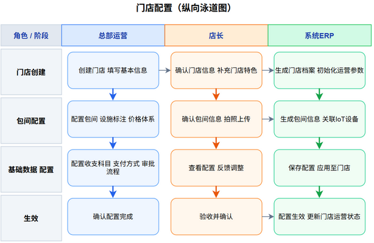

---

### 3.2 门店运营域
#### 3.2.1 包间预约与消费

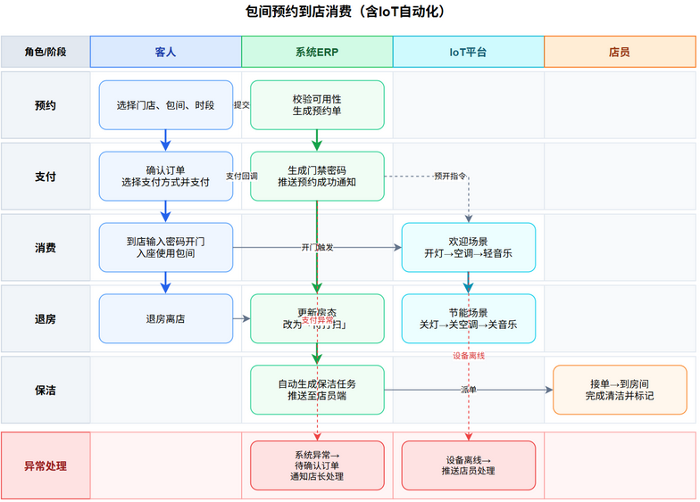

---

---

#### 3.2.2 商品零售

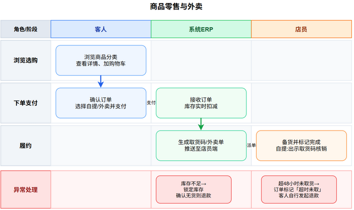

---

---

#### 3.2.3 房态管理

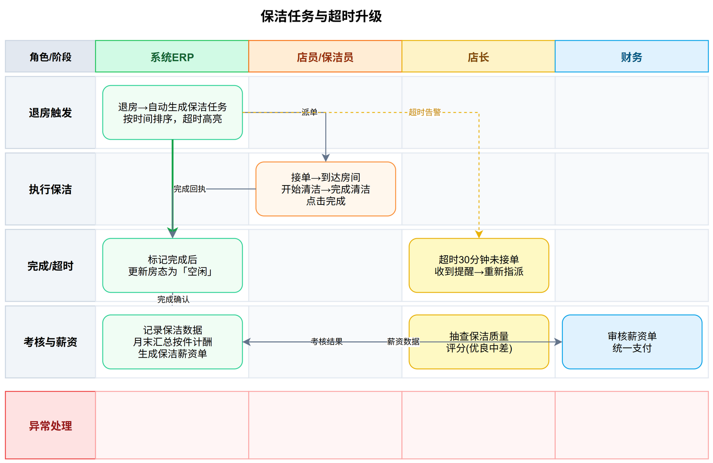

---

---

#### 3.2.5 巡店管理

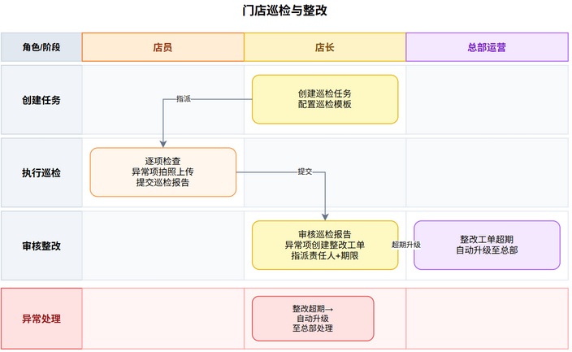

---

---

### 4.3 市场营销域
#### 4.3.1 营销活动

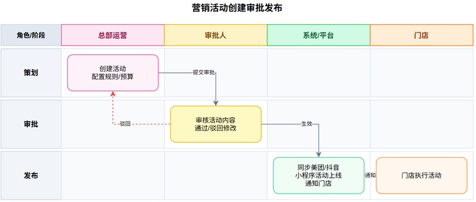

---

---

#### 4.3.2 优惠券管理

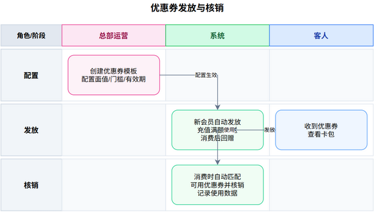

---

---

### 3.4 供应链域
#### 3.4.1 采购管理

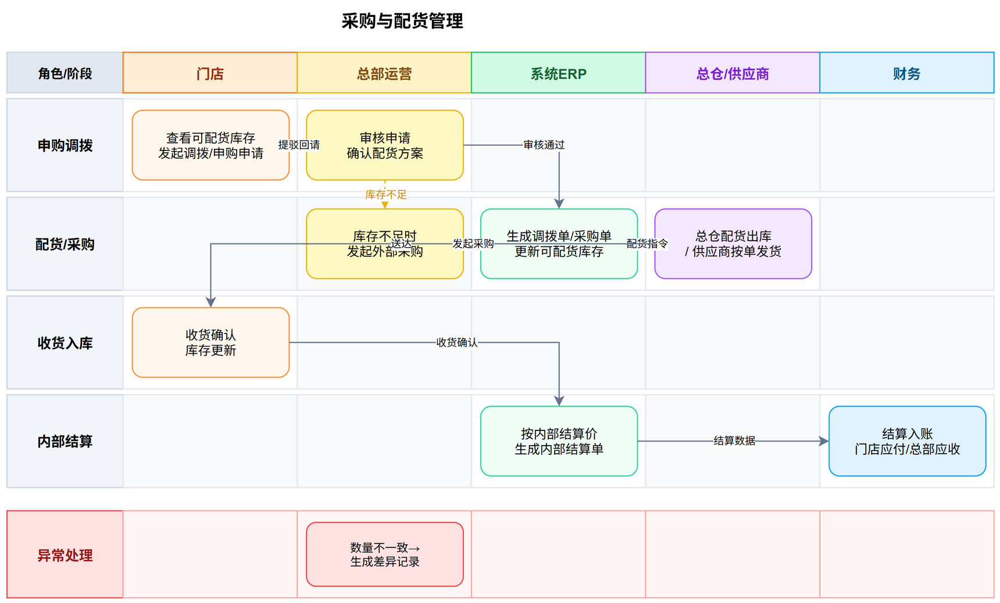

---

---

#### 3.4.2 库存管理

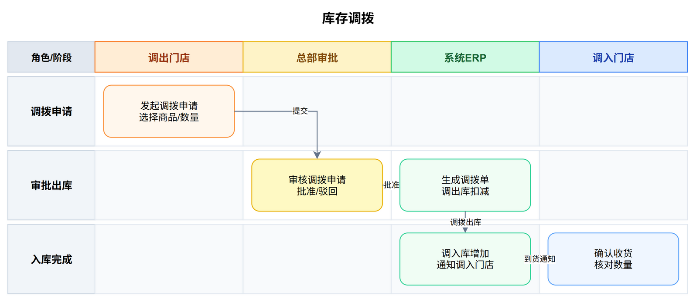

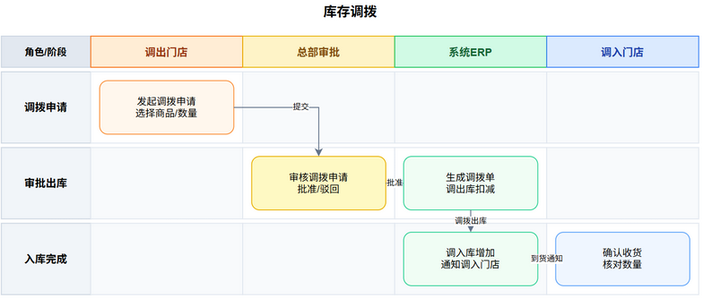

---

---

#### 3.4.3 供应商管理

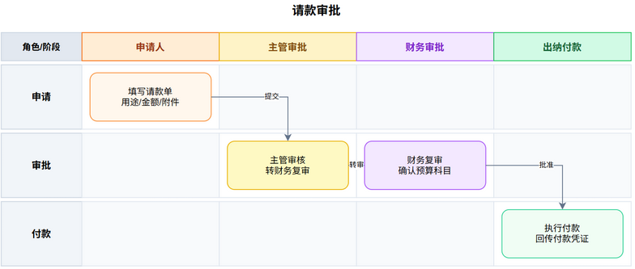

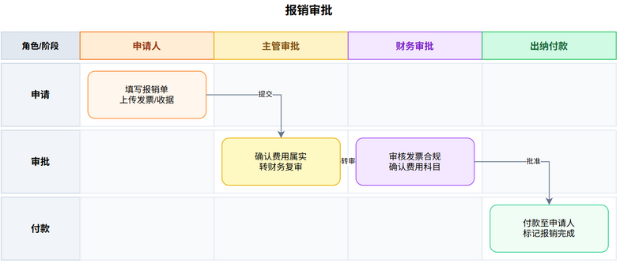

---

---

#### 3.5.3 自动月结

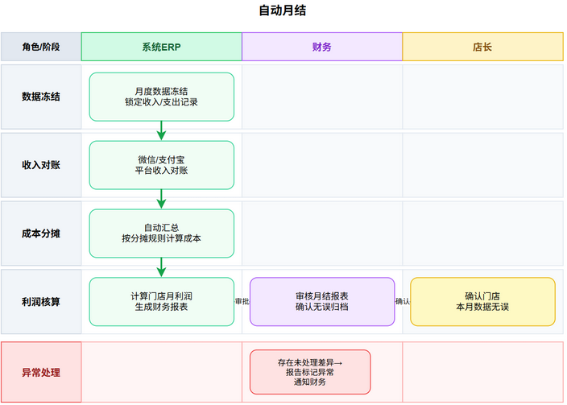

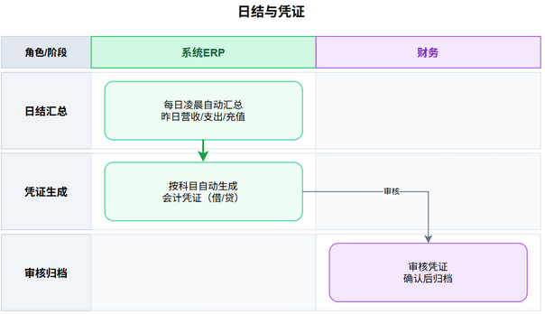

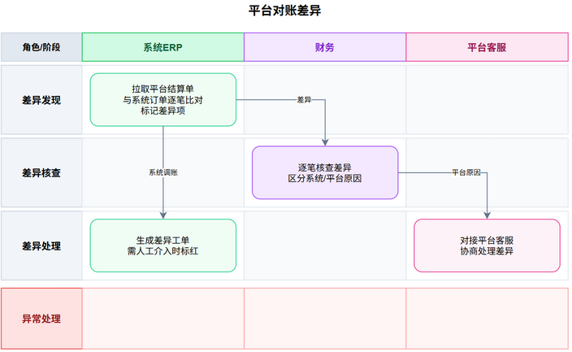

---

---

#### 3.5.5 股东分红

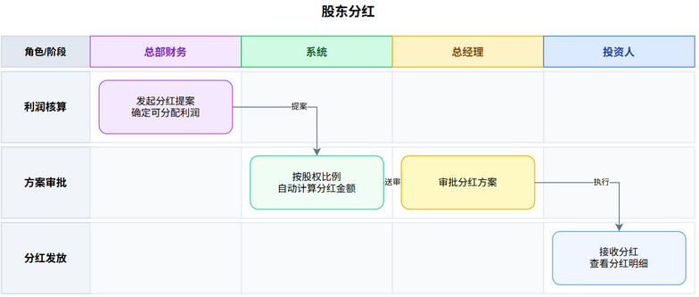

---

---

#### 3.5.6 报表体系

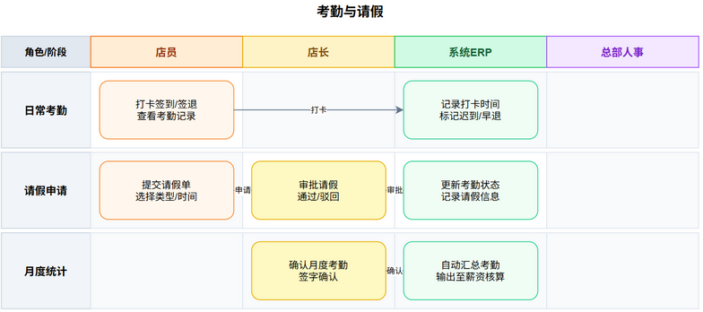

---

---

#### 3.6.3 薪资核算

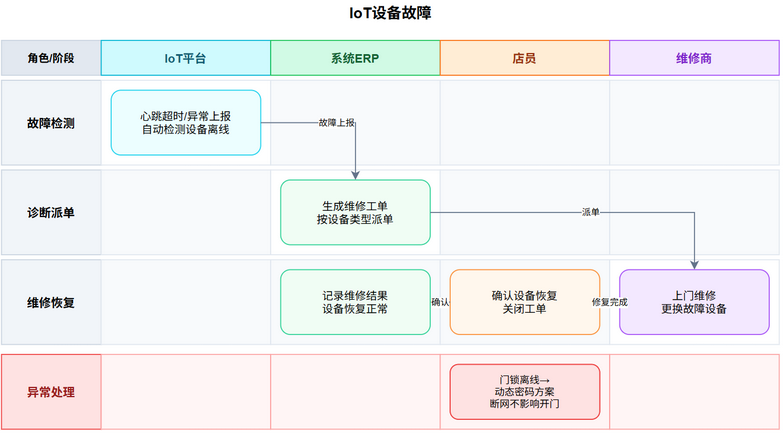

---

---

#### 3.7.2 智能场景联动

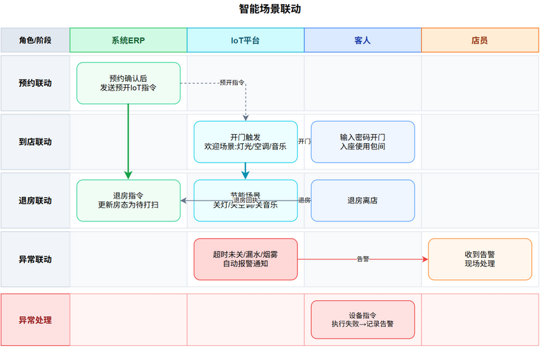

---

---

#### 3.7.3 AI预警

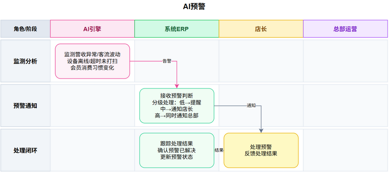

---

## 第四章：非功能性需求

非功能性需求定义系统的质量属性，是后续技术架构设计（ARC-01）的输入约束。

### 4.1 性能需求

| 需求编号 | NFR-01 |
|----------|--------|
| **需求名称** | 系统响应时间要求 |
| **描述** | 普通用户操作应在可接受的时间内完成。 |
| **具体指标** | 1. 客人端操作：页面加载、按钮响应、支付提交 <= 2秒。 2. 店员端操作：房态刷新、订单查询、工单处理 <= 3秒。 3. 物联网控制：从触发（开门、支付）到设备动作（开灯、开空调）<= 2秒。 4. 月结报告生成：单店报告 <= 30秒；合并报告（3店）<= 60秒。 5. 报表导出：Excel导出 <= 60秒。 |

### 4.2 可靠性需求

| 需求编号 | NFR-02 |
|----------|--------|
| **需求名称** | 系统可用性与容错 |
| **描述** | 系统应具备容错能力，核心业务功能不受局部故障影响。 |
| **具体指标** | 1. 门店门禁、灯光、空调须在网络断开时仍可正常工作（离线密码机制）。 2. 支付回调失败时，系统通过定时轮询（每5分钟）最终完成订单状态同步。 3. 数据库每日自动备份，保留最近30天备份文件。 4. 系统年度可用性 >= 99.5%（计划内维护除外）。 |

### 4.3 安全性需求

| 需求编号 | NFR-03 |
|----------|--------|
| **需求名称** | 数据安全与权限控制 |
| **描述** | 保护系统数据不被未授权访问、篡改、泄露。 |
| **具体指标** | 1. 身份认证：所有用户需通过密码或微信授权登录。 2. 角色隔离：不同角色（客人、店员、店长、财务、总部、投资人、系统管理员）拥有独立数据访问权限。 3. 数据脱敏：投资人查看订单流水时，隐藏客人具体姓名和手机号中间4位。 4. 敏感信息加密：门禁密码等敏感信息在传输和存储时须加密。 5. 审计日志：所有关键操作（退款、修改金额、审批、强制开门等）记录操作人、时间、IP地址、操作内容。日志保留至少1年。 6. 登录安全：同一账号连续5次登录失败，锁定15分钟。 |

### 4.4 可扩展性需求

| 需求编号 | NFR-04 |
|----------|--------|
| **需求名称** | 支持未来功能扩展与门店增加 |
| **描述** | 系统设计应预留扩展点，便于后期增加新功能、新平台、新门店。 |
| **具体指标** | 1. 基础数据可配置：收入科目、支出科目、支付方式等支持动态增删改，不依赖代码变更。 2. 审批流程可配置：审批路由、金额阈值、审批角色支持后台配置，无需开发介入。 3. 多平台对接：美团、抖音、高德、小红书等平台对接设计为可插拔模块，新增平台只需增加适配组件。 4. 门店横向扩展：门店数量增加不应导致系统性能显著下降，数据库支持分库或读写分离。 |

### 4.5 可维护性需求

| 需求编号 | NFR-05 |
|----------|--------|
| **需求名称** | 系统易于运维和排障 |
| **描述** | 系统提供必要的运维工具和日志，便于管理员监控、诊断和修复问题。 |
| **具体指标** | 1. 监控看板：管理员可查看各模块运行状态、队列堆积、错误率等。 2. 详细日志：关键业务操作（支付、对账、月结）记录请求参数、响应结果、耗时。 3. 远程日志查看：管理员可远程查看系统日志，不必登录服务器。 4. 定时任务管理：管理员可查看定时任务执行状态、日志，并支持手动触发。 |

### 4.6 易用性需求

| 需求编号 | NFR-06 |
|----------|--------|
| **需求名称** | 用户界面友好、操作直观 |
| **描述** | 系统界面应符合主流用户体验标准，减少学习成本。 |
| **具体指标** | 1. 客人端：预约、点单、支付操作步骤不超过3步。 2. 店员端：常用功能（保洁确认、开门、对账工单）应在工作台首页一键可达。 3. 表单设计：所有表单应有清晰的输入提示和实时的校验反馈。 4. 移动端适配：小程序界面适配主流手机屏幕尺寸（iOS、Android）。 |

### 4.7 工作流引擎要求

| 需求编号 | NFR-07 |
|----------|--------|
| **需求名称** | 基于工作流引擎实现审批流程 |
| **描述** | 所有审批流程必须基于开源工作流引擎实现，禁止手写状态机。 |
| **具体指标** | 1. 推荐采用 Activiti 或 Flowable 等开源工作流引擎。 2. 工作流引擎需支持：条件分支（按金额阈值）、并行审批（会签）、超时升级、回退重审。 3. 审批消息通过小程序推送，支持在线操作。 4. 所有审批节点留痕：记录时间、操作人、意见。 5. 范围：支出审批、月结审批、资产变动审批、巡检整改审批等所有涉及多级审批的业务。 6. 集中审批功能：超出门店权限的申请自动汇集至总部集中审批列表，支持审批详情查看（申请内容、历史审批链、附件）、审批操作（通过/驳回/退回补充）、操作留痕、超时告警（超48小时未处理推送提醒）。 |

---

### 4.8 物联网实现路径

#### 4.8.1 总体架构要求

系统需采用**智能家居网关**作为物联网设备控制中枢，负责设备接入管理、自动化规则执行和设备状态采集。ERP系统通过标准网络接口与智能家居网关通信，不直接操作硬件设备，实现业务逻辑与设备协议的解耦。网关应支持主流无线通信协议（WiFi、Zigbee等），具备离线场景下基本自动化能力。

系统部署采用三层结构：
- **业务控制层**（ERP端）：根据业务事件（订单支付、退房、预约开始）生成设备控制指令
- **设备管理层**（智能家居网关）：接收ERP指令并转换为设备控制信号，同时汇聚设备状态上报给ERP
- **物理设备层**：执行开/关、温度调节、传感器采集等物理操作

**要求**：设备管理层应独立于ERP运行，即使ERP或网络出现故障，已设定的自动化规则仍可正常工作。

#### 4.8.2 各设备类型需求

| 设备类型 | 功能需求 | 离线容错需求 |
|---------|---------|-------------|
| **智能门锁** | 接收ERP下发的临时密码并验证开锁；支持小程序推送密码至客人；开门事件上报至系统 | 支持离线动态密码机制：即使网关断网，门锁也能根据时间同步算法验证密码有效性 |
| **中央空调/分体机** | ERP可按房间维度发送开关机、温度设定指令；支持预约开始前预冷/预热；房间退房后关闭对应区域 | 保留物理遥控器操作方式，网关故障时仍可人工开关空调 |
| **灯光照明** | ERP根据场景（欢迎/会议/K歌/退房）发送开关、亮度调节指令；物理开关面板可手动控制 | 物理开关直控继电器，按键操作独立于网络运行，网关仅读取状态 |
| **电动窗帘** | 接收开/关/停指令，根据场景和时段联动（如白天开门自动打开，退房关闭） | 支持手动拉拽操作 |
| **音响/背景音乐** | 支持场景联动播放预设曲目；客人可通过小程序控制播放/切换/音量；店员可远程操作空闲房间音乐 | 保留面板物理操控手段 |

---

## 第五章：外部接口需求

外部接口需求定义高岸ERP系统与外部系统/硬件之间的交互边界，是后续技术架构设计（ARC-01）的输入约束。

### 5.1 支付平台接口

#### 5.1.1 微信支付

| 接口项 | 说明 |
|--------|------|
| 交互方式 | 微信支付JSAPI（小程序内支付）+ Native（扫码支付） |
| 使用场景 | 小程序内下单支付、到店扫码支付 |
| 数据交互 | 下单请求→获取预支付ID→调起支付→接收支付结果回调 |
| 关键约束 | 支付结果依赖异步回调通知，需设计超时重试和人工核查兜底机制 |
| 对账要求 | 每日拉取微信支付对账单，与系统订单逐笔比对 |

#### 5.1.2 支付宝

| 接口项 | 说明 |
|--------|------|
| 交互方式 | 支付宝小程序支付 / 电脑网站支付 |
| 使用场景 | 小程序内支付（用户选择支付宝时） |
| 数据交互 | 同微信支付模式：下单→调起→回调 |
| 对账要求 | 每日拉取支付宝对账单，与系统订单逐笔比对 |

---

### 5.2 平台结算接口

#### 5.2.1 美团

| 接口项 | 说明 |
|--------|------|
| 交互方式 | 美团开放平台API（HTTP + OAuth2鉴权） |
| 使用场景 | 团购券核销、订单同步、结算对账 |
| 数据交互 | 拉取美团订单列表→比对系统订单→核销团购券→拉取结算单 |
| 对账约束 | 美团结算周期为T+1，每日自动拉取前一日结算数据，与系统收入流水比对 |

#### 5.2.2 抖音

| 接口项 | 说明 |
|--------|------|
| 交互方式 | 抖音生活服务开放平台API |
| 使用场景 | 团购券核销、订单同步、结算对账 |
| 数据交互 | 同美团模式：拉取订单→比对→核销→结算对账 |
| 对账约束 | 抖音结算周期T+1，需对接抖音对账单格式 |

---

### 5.3 消息通知接口

#### 5.3.1 小程序订阅消息

| 接口项 | 说明 |
|--------|------|
| 交互方式 | 微信小程序订阅消息API |
| 使用场景 | 预约成功通知、订单状态变更、保洁任务指派、优惠券到账 |
| 约束 | 需在用户授权模板范围内发送，一次性订阅仅生效一次 |

#### 5.3.2 飞书机器人

| 接口项 | 说明 |
|--------|------|
| 交互方式 | 飞书自定义机器人Webhook |
| 使用场景 | 内部告警推送（设备离线、对账差异、审批超时） |
| 约束 | 仅用于内部通知，不涉及用户隐私数据 |

#### 5.3.3 短信网关

| 接口项 | 说明 |
|--------|------|
| 交互方式 | HTTP API对接短信服务商 |
| 使用场景 | 门禁密码下发（备用通道）、重要告警通知、验证码发送 |
| 约束 | 仅用于关键场景，控制短信成本 |

---

### 5.4 硬件接口

#### 5.4.1 485串口服务器

| 接口项 | 说明 |
|--------|------|
| 通信协议 | Modbus RTU over TCP（通过网络转485） |
| 连接方式 | IoT平台通过TCP连接到串口服务器，串口服务器通过485总线连接设备 |
| 设备类型 | 门锁控制器、空调控制器（VRF网关）、灯光继电器、窗帘电机 |
| 指令格式 | 按Modbus标准协议封装：设备地址 + 功能码 + 寄存器地址 + 数据值 + CRC校验 |
| 约束 | 单台串口服务器挂载设备数量不超过32个；485总线理论最大距离1200米 |

#### 5.4.2 门锁

| 接口项 | 说明 |
|--------|------|
| 控制方式 | 485有线控制，支持通电开锁/断电开锁 |
| 状态反馈 | 门状态传感器反馈（开门/关门信号） |
| 离线方案 | 支持离线动态密码（预约时生成一次性密码，门锁本地校验） |
| 故障检测 | 门锁离线超30分钟告警，电池电量（如使用电池供电）低电量告警 |

#### 5.4.3 空调

| 接口项 | 说明 |
|--------|------|
| 控制方式 | 通过VRF网关接入485总线，使用空调厂商协议转换 |
| 控制参数 | 开关机、温度设定（16-30℃）、模式（制冷/制热/送风）、风速 |
| 状态反馈 | 运行状态、当前温度、故障代码 |
| 约束 | 预开空调需在预约前5分钟下发指令，确保客人到店时温度适宜 |

#### 5.4.4 灯光与窗帘

| 接口项 | 说明 |
|--------|------|
| 控制方式 | 485继电器模块 / 智能灯光控制器 |
| 控制参数 | 开关、亮度调节（调光型）、色温调节（品茶3000K/会议4000K） |
| 窗帘控制 | 开/关/停，支持百叶窗角度调节（如有） |

---

### 5.5 短信与文件存储接口

| 接口项 | 说明 |
|--------|------|
| 对象存储 | 图片上传（商品图片、巡检照片、设备图片），使用OSS/S3兼容存储 |
| 文件导出 | 报表导出支持PDF和Excel格式 |
| 打印 | 支持小票打印（蓝牙打印机，到店自提/外卖小票） |

---

## 附录：业务术语表

| 术语 | 定义 | 所属域 |
|------|------|--------|
| 门店 | 高岸茶室的线下实体经营场所（如盈丰店、金德店、盈隆店筹备中） | 通用 |
| 总部 | 负责品牌管理、统一采购、财务月结、标准化制定的中央管理机构 | 通用 |
| 包间 | 供客人使用的独立空间（茶室空间租用），按小时或场次计费 | 门店运营 |
| 空间租用 | 主营业务之一，客人按小时或场次租用茶室/会议室 | 门店运营 |
| 零售 | 主营业务之一，客人购买茶叶、茶点、茶具、套餐等商品 | 门店运营 |
| 会员卡 | 客人充值预付款，属于债务性收入。卡内余额可用于消费扣减 | 门店运营 |
| 预约单 | 客人预约包间时生成的记录，包含门店、包间、时段、金额信息 | 门店运营 |
| 订单 | 一次消费的完整记录，可包含多种业务类型 | 门店运营 |
| 收入流水 | 确认到账后的资金记录，每个订单可能产生多条流水 | 财务 |
| 会计凭证 | 日结汇总生成的记账凭证，符合会计准则 | 财务 |
| 结算周期 | 上月25日至本月24日 | 财务 |
| 月结 | 每月25日自动结算上月25日至本月24日的经营数据 | 财务 |
| 日结 | 每日凌晨自动汇总前一日经营数据的操作 | 财务 |
| 月度经营报告 | 每月自动生成的经营分析报告，含利润表、收入明细、支出明细 | 财务 |
| 对账工单 | 订单金额与平台账单不一致时自动创建的待处理任务 | 财务 |
| 差异工单 | 包含平台对账差异和ERP内部异常（未消费收款、消费未收款等）的工单 | 财务 |
| 请款 | 事先申请资金（事前支出） | 财务 |
| 报销 | 事后凭票申请报销（事后支出） | 财务 |
| 审批路由 | 按金额自动分配审批节点（<500元店长/500-5000元店长+财务/>5000元加总部） | 财务 |
| 预算科目 | 收入与支出的分类科目框架 | 财务 |
| 供应商 | 所有对外付款的接收方（含商品供应商、服务商等） | 供应链 |
| 固定资产 | 会计准则定义的固定资产：使用年限超过一年、价值较高的资产 | 供应链 |
| 采购单 | 向供应商发出的商品采购请求 | 供应链 |
| 库存预警 | 库存低于阈值时自动触发补货提醒 | 供应链 |
| 盘点 | 定期对库存实物进行清点并与系统数据比对 | 供应链 |
| 调拨 | 门店间商品的调配操作 | 供应链 |
| 巡检 | 门店日常经营情况检查（运营规范、服务质量）和安全检查（消防、卫生、设备等） | 门店运营 |
| 整改工单 | 巡检中发现异常后创建的待整改任务 | 门店运营 |
| 保洁任务 | 客人退房后自动生成的清洁整理任务 | 门店运营 |
| 考勤 | 员工通过移动端上下班打卡记录 | 人力资源 |
| 营销活动 | 在自有渠道开展的促销、推广活动（优惠券、限时折扣、新客礼包等） | 市场营销 |
| 优惠券 | 电子优惠凭证，支持满减、折扣、现金等多种类型 | 市场营销 |
| IoT设备 | 物联网设备（门锁、空调、灯光、音乐、窗帘等） | 技术 |
| 智能场景 | 根据客人消费状态自动切换的设备组合配置（欢迎/品茶/会议/K歌/节能） | 技术 |
| AI预警 | 系统通过数据分析和规则引擎，主动发现经营异常、风险隐患并提供策略建议 | 技术 |
| 直营店 | 由总部直接投资并管理的门店 | 总部管理 |
| 加盟店 | 由加盟商投资、总部提供品牌和管理支持的（未发生，预留概念） | 总部管理 |
| 品牌股东 | 持有高岸品牌股份的股东 | 总部管理 |
| 门店股东 | 仅持有一家门店股份的股东 | 总部管理 |
| 持股比例 | 股东在品牌或门店中的股份占比 | 总部管理 |
| 分红 | 按持股比例分配利润 | 总部管理 |
| 系统管理员 | 负责系统配置、用户权限管理、审计日志查看的角色 | 技术 |
| 审计日志 | 系统所有关键操作的记录，用于追溯 | 技术 |

---

---

## 附录B：待决策事项清单

以下事项需要在系统开发启动前由项目决策方明确，以便在需求中锁定范围：

| 编号 | 事项 | 提出方 | 建议方案 | 决策截止 | 状态 |
|------|------|-------|---------|---------|------|
| D-01 | 多门店统一会员体系 vs 一店一会员 | 运营部 | 建议统一会员体系（跨店积分通兑），但需评估各店独立核算的复杂度 | 需求评审前 | ⏳ 待决策 |
| D-02 | 平台补贴是否纳入主营收入科目 | 财务部 | 建议单列为"其他业务收入-平台补贴收入"，不影响毛利率计算 | 需求评审前 | ⏳ 待决策 |
| D-03 | 加盟店是否必须使用总部ERP系统 | 总经办 | 建议强制使用，确保数据贯通和管理费自动计算 | 需求评审前 | ⏳ 待决策 |
| D-04 | 投资人是否可以查看门店实时流水 | 法务 | 建议投资人仅查看月度汇总数据，不暴露日流水级别的经营细节 | 需求评审前 | ⏳ 待决策 |
| D-05 | GL凭证生成时机：实时 vs 日结批量 | 财务部 | 建议交易级实时生成，便于日终对账 | 需求评审前 | ⏳ 待决策 |
| D-06 | 固定资产折旧方法：直线法 vs 加速折旧 | 财务部 | 建议统一采用直线法（年限平均法），简化折旧计算 | 需求评审前 | ⏳ 待决策 |
| D-07 | 智能排班是否与考勤数据自动挂钩 | HR | 建议自动挂钩，排班数据直接作为考勤基准，减少重复录入 | 需求评审前 | ⏳ 待决策 |
| D-08 | 加盟商端小程序开发优先级 | 总经办 | 建议首期不包含，作为V2.0规划 | 需求评审前 | ⏳ 待决策 |
| D-09 | 品牌管理费收取方式：按月固定 vs 按营收比例 | 总经办 | 建议按营收比例（2%-5%），与加盟店经营状况挂钩 | 需求评审前 | ⏳ 待决策 |
| D-10 | 数据迁移策略：历史数据是否导入新系统 | 技术部 | 建议仅导入近12个月数据，更早数据归档后离线查询 | 需求评审前 | ⏳ 待决策 |

> 说明：上表所列事项涉及业务流程或财务处理的核心策略选择，需由相关方在开发启动前明确决策。未决策事项将在开发过程中按"默认方案"先行实现，后续变更可能产生返工成本。

---

## 修订历史

| 版本 | 日期 | 修订内容 | 修订人 |
|------|------|---------|--------|
| V10.0 | 2026-05-06 | 重构版发布：按7大业务域组织，新增第四章（非功能性需求）、第五章（外部接口需求） | Claude Code |
| V10.1 | 2026-05-06 | 嵌入19个业务泳道图+域间关系Hub-and-Spoke图，修复Mermaid中文截断，新增2.3客户端应用视图，新增窗帘电机RS485协议评估 | Claude Code |
| V10.2 | 2026-05-06 | 修复泳道图排版问题：图片移至章节末尾，标题与图片居中对齐；泳道图补充异常处理路径（9张图） | Claude Code |
| V10.3 | 2026-05-06 | 全面重构：7大业务域重新排序、总部管理域拆分为发展规划/品牌建设/门店拓展（含投资者两种模式）/门店配置/集中审批/品牌运营看板/投资者关系、新增门店拓展与门店配置泳道图（F20/F21）、恢复第四章非功能性需求、补充店铺多来源渠道（店长推荐/加盟商提供/总部物色）、补充引流私域呼应、消费种草体验、新增系统管理员角色、域间关系图Mermaid替换为Hub-and-Spoke、技术平台改为ERP支撑平台、商品管理移至供应链域、智能排班移至人力资源域、绩效考核优化描述、首期边界调整 | Claude Code |
| V10.4 | 2026-05-06 | 集中审批融入各层级审批流程（不再单列）、新增2.5节 Microsoft CDM 实体映射（7大域共63个实体映射）、1.3 CDM参考指向2.5节、3.1.5补充审批流程子节、4.7工作流引擎增加集中审批能力 | Claude Code |
| V10.5 | 2026-05-06 | 基于CDM标准重构：3.4.2库存管理新增批次追踪/有效期管理/FIFO校验/到期预警，3.3.2优惠券管理新增核销后客户标签闭环，3.5.1收入管理/3.5.2支出管理/3.5.3自动月结新增交易级GL凭证自动生成与借贷平衡校验、应付账款挂账与核销 | Claude Code |
| V10.6 | 2026-05-07 | CDM逐域实体映射移出正文（独立为《CDM实体映射说明书》），3.5.4对账口径替换为13行渠道-查询路径对照表（吸收Claude V7.0版），3.5.3月结报告补充Excel结构，AI预警量化阈值增强，新增待决策事项清单（附录B，10项） | Claude Code |
| V10.7 | 2026-05-07 | 根据于总评审意见全面重构：总部管理域→品牌运营域（D01），新增门店拓展域（D02），8域重排（品牌运营→门店拓展→门店运营→市场营销→供应链→财务→人力资源→技术）；包间/会议室合并为空间租用；收入科目按总部/门店拆分（总部：加盟金/管理费/设计费/供应链茶叶销售）；新增组织架构树形结构（总部→门店→部门）及基础实体（公司/法人/股东/资金账户）；门店拓展域新增设计图施工图管理功能 | Claude Code |

