# 高岸ERP系统-智能设备场景对象模型（V1.0，2026年5月8日）

**版本**：V1.0
**日期**：2026年5月8日
**文档状态**：草稿
**文档编号**：ROM-02
**编制依据**：
- 《高岸ERP系统-需求说明书（V10.8，2026年5月8日）》第3.3.1、3.3.3、3.3.4、3.8.1、3.8.2节
- 《高岸ERP系统-对象模型设计（V1.0，2026年5月8日）》（ROM-01）
- 《高岸ERP系统-IoT技术实施与家庭测试方案（V1.0，2026年5月5日）》（IOT-02）

---

## 1. 文档目的与范围

### 1.1 文档定位

本文档为 ROM-01（全量104实体对象模型）的**讨论版补充**，聚焦店内智能设备场景，以可视化类图、时序图、状态图替代纯文字表格，用于项目组和干系人评审讨论。

**目标读者**：后端开发、前端开发（小程序）、IoT工程师、项目经理、于总（干系人评审）。

### 1.2 与ROM-01的关系

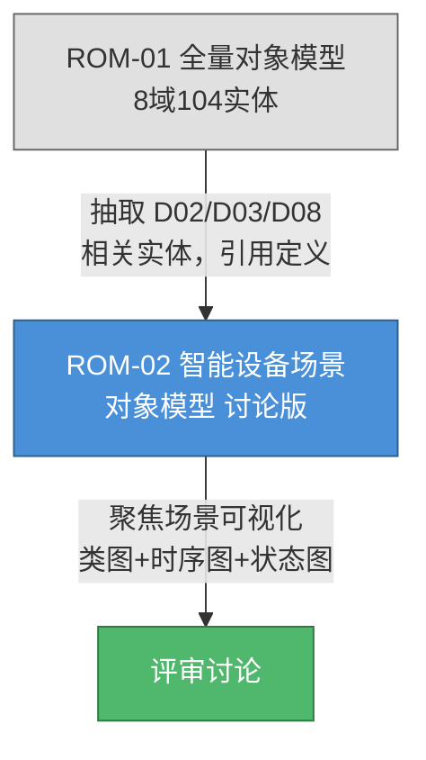
```mermaid
graph TB
    ROM01[ROM-01 全量对象模型<br/>8域104实体]
    ROM02[ROM-02 智能设备场景<br/>对象模型 讨论版]
    
    ROM01 -->|"抽取 D02/D03/D08<br/>相关实体，引用定义"| ROM02
    ROM02 -->|"聚焦场景可视化<br/>类图+时序图+状态图"| REVIEW[评审讨论]
    
    style ROM01 fill:#e0e0e0,stroke:#666
    style ROM02 fill:#4a90d9,stroke:#2c5f8a,color:#fff
    style REVIEW fill:#50b86c,stroke:#2d7a40,color:#fff
```

ROM-02 **不重复** ROM-01 的实体属性定义。本文档中每处实体引用均标注 `(ROM-01 §章节号)` 指针，完整属性定义查阅 ROM-01 对应章节。

### 1.3 范围边界

| 范围项 | 包含/不包含 | 说明 |
|--------|------------|------|
| 包间设备联动 | **包含** | 门锁、空调、灯光、窗帘、音响的6场景联动 |
| 预约→开门→退房IoT链路 | **包含** | 客人全流程设备自动化 |
| 店员远程设备控制 | **包含** | 手动开门、场景切换、设备监控 |
| 设备故障告警处理 | **包含** | IoT故障检测→告警→店员处理→闭环 |
| 房态自动流转 | **包含** | 空闲→已预定→使用中→待打扫→空闲 |
| 保洁任务与设备故障标记 | **包含** | 保洁中发现的设备故障上报 |
| 财务结算/报表 | 不包含 | 见 ROM-01 第9章（D06） |
| 营销活动/优惠券 | 不包含 | 见 ROM-01 第7章（D04） |
| 供应链/采购/库存 | 不包含 | 见 ROM-01 第8章（D05） |
| 人事/考勤/薪资 | 不包含 | 见 ROM-01 第10章（D07） |

---

## 2. 场景内实体关系总览

### 2.1 实体选取

从 ROM-01 的104个实体中，选取与智能设备场景直接相关的 **17个实体**，跨越三个域：

| 域 | 实体 | ROM-01引用 | 在智能设备场景中的角色 |
|----|------|-----------|---------------------|
| **D02** | Room | §5.2.8 | 设备挂载的物理空间，场景作用的载体 |
| **D02** | Store | §5.2.2 | 门店多租户隔离键，设备所属门店 |
| **D03** | Customer | §6.2.1 | 客人主体，预约和控制设备的使用者 |
| **D03** | Order | §6.2.5 | 订单，承载预约信息和支付状态 |
| **D03** | OrderItem | §6.2.6 | 订单明细（包间租赁/商品消费） |
| **D03** | RoomAppointment | §6.2.7 | 预约记录，含门禁密码和预开状态 |
| **D03** | RoomStatus | §6.2.8 | 房态，IoT事件驱动的状态流转 |
| **D03** | CleaningTask | §6.2.9 | 保洁任务，退房后自动生成 |
| **D07** | Employee | §10.2.1 | 店员/保洁员，设备操作者和任务执行者 |
| **D08** | IoTDevice | §11.2.1 | 物联网设备主数据 |
| **D08** | DeviceEvent | §11.2.2 | 设备事件日志（开门/心跳/故障） |
| **D08** | SmartScene | §11.2.3 | 智能场景定义 |
| **D08** | SceneRule | §11.2.4 | 场景内的设备控制规则 |
| **D08** | RoomSceneBinding | §11.2.5 | 包间与场景的绑定关系 |
| **D08** | UserAccount | §11.2.6 | 用户账号（客人/店员/保洁员） |
| **D08** | AlertRule | §11.2.10 | 设备告警规则（离线/低电量） |
| **D08** | AlertRecord | §11.2.11 | 告警记录与处理状态 |

### 2.2 三域交集总览图

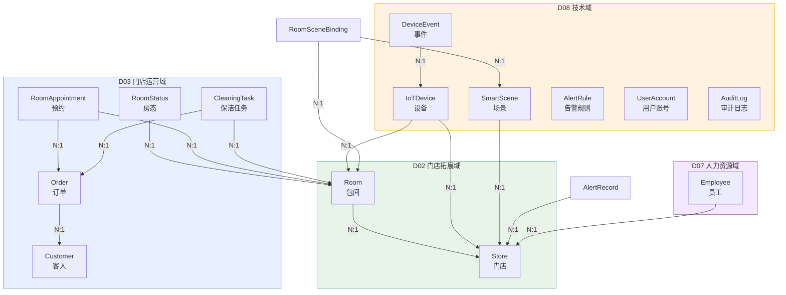
```mermaid
graph TB
    subgraph D02["D02 门店拓展域"]
        Store["Store<br/>门店"]
        Room["Room<br/>包间"]
    end
    
    subgraph D03["D03 门店运营域"]
        Customer["Customer<br/>客人"]
        Order["Order<br/>订单"]
        RoomAppointment["RoomAppointment<br/>预约"]
        RoomStatus["RoomStatus<br/>房态"]
        CleaningTask["CleaningTask<br/>保洁任务"]
    end
    
    subgraph D08["D08 技术域"]
        IoTDevice["IoTDevice<br/>设备"]
        SmartScene["SmartScene<br/>场景"]
        DeviceEvent["DeviceEvent<br/>事件"]
        AlertRule["AlertRule<br/>告警规则"]
        UserAccount["UserAccount<br/>用户账号"]
        AuditLog["AuditLog<br/>审计日志"]
    end
    
    subgraph D07["D07 人力资源域"]
        Employee["Employee<br/>员工"]
    end
    
    Room -->|"N:1"| Store
    IoTDevice -->|"N:1"| Room
    IoTDevice -->|"N:1"| Store
    RoomStatus -->|"N:1"| Room
    RoomAppointment -->|"N:1"| Room
    RoomAppointment -->|"N:1"| Order
    Order -->|"N:1"| Customer
    CleaningTask -->|"N:1"| Room
    CleaningTask -->|"N:1"| Order
    DeviceEvent -->|"N:1"| IoTDevice
    SmartScene -->|"N:1"| Store
    RoomSceneBinding -->|"N:1"| Room
    RoomSceneBinding -->|"N:1"| SmartScene
    AlertRecord -->|"N:1"| Store
    Employee -->|"N:1"| Store
    
    style D02 fill:#e8f4e8,stroke:#5a9
    style D03 fill:#e8f0ff,stroke:#59a
    style D08 fill:#fff3e0,stroke:#fa0
    style D07 fill:#f3e8ff,stroke:#a5a
```

---

## 3. 核心实体关系类图

> 以下类图聚焦不同侧面，将17个实体拆分为4个关注点，避免单图过于复杂。

### 3.1 设备与场景配置模型

**关注点**：设备如何挂载到房间、场景如何定义规则、房间如何绑定场景。

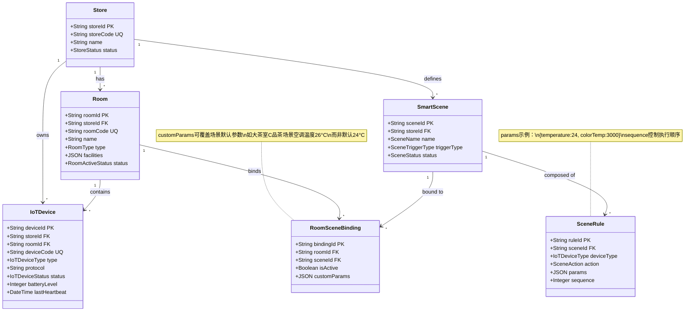
```mermaid
classDiagram
    class Store {
        +String storeId PK
        +String storeCode UQ
        +String name
        +StoreStatus status
    }
    
    class Room {
        +String roomId PK
        +String storeId FK
        +String roomCode UQ
        +String name
        +RoomType type
        +JSON facilities
        +RoomActiveStatus status
    }
    
    class IoTDevice {
        +String deviceId PK
        +String storeId FK
        +String roomId FK
        +String deviceCode UQ
        +IoTDeviceType type
        +String protocol
        +IoTDeviceStatus status
        +Integer batteryLevel
        +DateTime lastHeartbeat
    }
    
    class SmartScene {
        +String sceneId PK
        +String storeId FK
        +SceneName name
        +SceneTriggerType triggerType
        +SceneStatus status
    }
    
    class SceneRule {
        +String ruleId PK
        +String sceneId FK
        +IoTDeviceType deviceType
        +SceneAction action
        +JSON params
        +Integer sequence
    }
    
    class RoomSceneBinding {
        +String bindingId PK
        +String roomId FK
        +String sceneId FK
        +Boolean isActive
        +JSON customParams
    }
    
    Store "1" --> "*" Room : has
    Store "1" --> "*" IoTDevice : owns
    Store "1" --> "*" SmartScene : defines
    Room "1" --> "*" IoTDevice : contains
    Room "1" --> "*" RoomSceneBinding : binds
    SmartScene "1" --> "*" SceneRule : composed of
    SmartScene "1" --> "*" RoomSceneBinding : bound to
    
    note for SceneRule "params示例：\n{temperature:24, colorTemp:3000}\nsequence控制执行顺序"
    note for RoomSceneBinding "customParams可覆盖场景默认参数\n如大茶室C品茶场景空调温度26°C\n而非默认24°C"
```

**关键不变量**：
- 每个 Room 至少挂载门锁、空调、灯光各1台设备
- 同一 Room 不允许绑定相同 `(sceneId, roomId)` 的重复绑定记录
- 场景规则中 `sequence` 决定设备命令下发顺序（如先开灯再开音响）

### 3.2 预约消费与房态模型

**关注点**：预约如何关联订单和房间、房态如何记录当前状态。

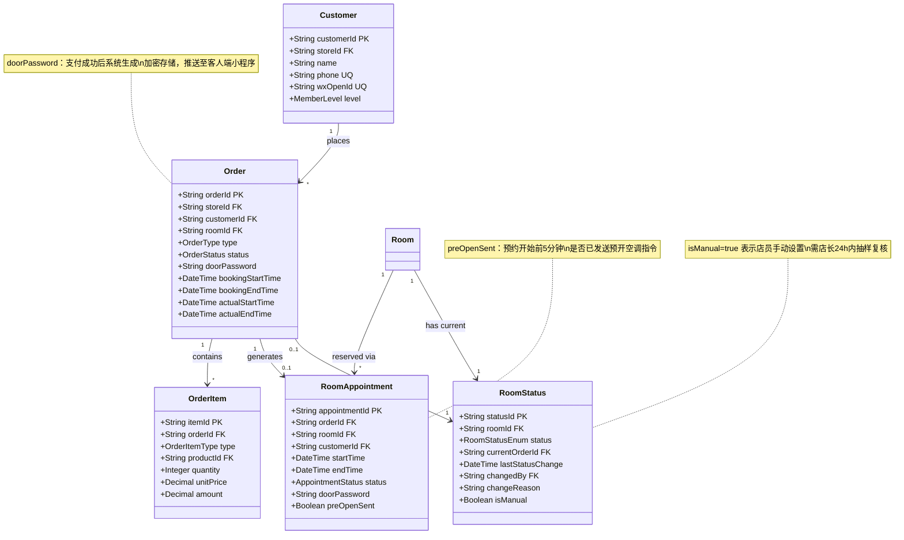
```mermaid
classDiagram
    class Customer {
        +String customerId PK
        +String storeId FK
        +String name
        +String phone UQ
        +String wxOpenId UQ
        +MemberLevel level
    }
    
    class Order {
        +String orderId PK
        +String storeId FK
        +String customerId FK
        +String roomId FK
        +OrderType type
        +OrderStatus status
        +String doorPassword
        +DateTime bookingStartTime
        +DateTime bookingEndTime
        +DateTime actualStartTime
        +DateTime actualEndTime
    }
    
    class OrderItem {
        +String itemId PK
        +String orderId FK
        +OrderItemType type
        +String productId FK
        +Integer quantity
        +Decimal unitPrice
        +Decimal amount
    }
    
    class RoomAppointment {
        +String appointmentId PK
        +String orderId FK
        +String roomId FK
        +String customerId FK
        +DateTime startTime
        +DateTime endTime
        +AppointmentStatus status
        +String doorPassword
        +Boolean preOpenSent
    }
    
    class RoomStatus {
        +String statusId PK
        +String roomId FK
        +RoomStatusEnum status
        +String currentOrderId FK
        +DateTime lastStatusChange
        +String changedBy FK
        +String changeReason
        +Boolean isManual
    }
    
    Customer "1" --> "*" Order : places
    Order "1" --> "*" OrderItem : contains
    Order "1" --> "0..1" RoomAppointment : generates
    Room "1" --> "*" RoomAppointment : reserved via
    Room "1" --> "1" RoomStatus : has current
    Order "0..1" --> "1" RoomStatus : linked to
    
    note for Order "doorPassword：支付成功后系统生成\n加密存储，推送至客人端小程序"
    note for RoomAppointment "preOpenSent：预约开始前5分钟\n是否已发送预开空调指令"
    note for RoomStatus "isManual=true 表示店员手动设置\n需店长24h内抽样复核"
```

**关键不变量**：
- Order 创建时 `status=PendingPay`，15分钟未支付自动取消
- RoomAppointment 的 `doorPassword` 与 Order 的 `doorPassword` 保持一致
- Room 任一时点最多有一个活跃的 RoomStatus（`status != Free`）

### 3.3 设备事件与场景联动模型

**关注点**：设备事件如何触发场景、场景如何下发设备命令。

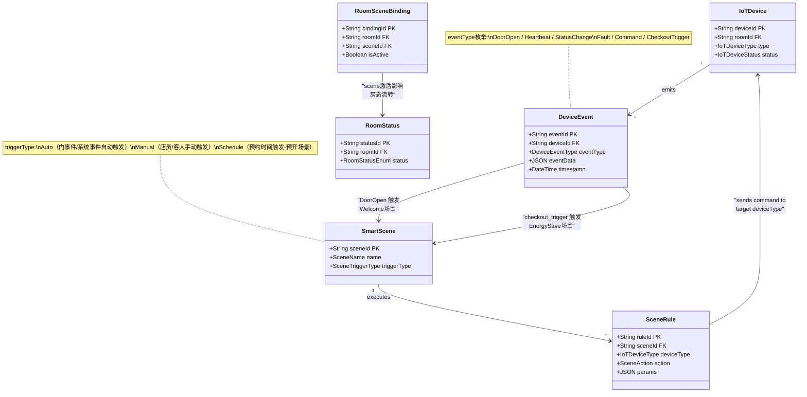
```mermaid
classDiagram
    class IoTDevice {
        +String deviceId PK
        +String roomId FK
        +IoTDeviceType type
        +IoTDeviceStatus status
    }
    
    class DeviceEvent {
        +String eventId PK
        +String deviceId FK
        +DeviceEventType eventType
        +JSON eventData
        +DateTime timestamp
    }
    
    class SmartScene {
        +String sceneId PK
        +SceneName name
        +SceneTriggerType triggerType
    }
    
    class SceneRule {
        +String ruleId PK
        +String sceneId FK
        +IoTDeviceType deviceType
        +SceneAction action
        +JSON params
    }
    
    class RoomSceneBinding {
        +String bindingId PK
        +String roomId FK
        +String sceneId FK
        +Boolean isActive
    }
    
    class RoomStatus {
        +String statusId PK
        +String roomId FK
        +RoomStatusEnum status
    }
    
    IoTDevice "1" --> "*" DeviceEvent : emits
    DeviceEvent --> SmartScene : "DoorOpen 触发<br/>Welcome场景"
    DeviceEvent --> SmartScene : "checkout_trigger 触发<br/>EnergySave场景"
    SmartScene "1" --> "*" SceneRule : executes
    SceneRule --> IoTDevice : "sends command to<br/>target deviceType"
    RoomSceneBinding --> RoomStatus : "scene激活影响<br/>房态流转"
    
    note for DeviceEvent "eventType枚举:\nDoorOpen / Heartbeat / StatusChange\nFault / Command / CheckoutTrigger"
    note for SmartScene "triggerType:\nAuto（门事件/系统事件自动触发）\nManual（店员/客人手动触发）\nSchedule（预约时间触发-预开场景）"
```

**事件→场景→设备联动链**：

| 触发事件 | 事件来源 | 匹配场景 | 执行规则（设备命令序列） |
|---------|---------|---------|---------------------|
| DoorOpen | 门锁 | Welcome | Light:On→AC:On(24°C)→Speaker:Play(轻音乐) |
| CheckoutTrigger | 系统 | EnergySave | Speaker:Off→AC:Off→Light:Off→Curtain:Close |
| Schedule(预约前5分钟) | 系统定时 | PreOpen | AC:On→Light:On(50%亮度) |
| Manual(品茶) | 店员/客人 | TeaSession | Light:ColorTemp(3000K)→AC:On(24°C)→Speaker:Play(轻音乐) |
| Manual(会议) | 店员/客人 | Meeting | Light:ColorTemp(4000K)→Speaker:Mute |
| Manual(K歌) | 店员/客人 | Karaoke | Light:Color→Speaker:On(KTV音源) |
| DeviceOffline(>30min) | 心跳超时 | — | 不触发场景，生成AlertRecord |

### 3.4 权限与审计模型

**关注点**：谁可以操作设备/触发场景、操作如何被记录。

```mermaid
classDiagram
    class UserAccount {
        +String userId PK
        +UserRole role
        +AccountStatus status
        +String wxOpenId UQ
    }
    
    class Role {
        +String roleId PK
        +UserRole name
    }
    
    class Permission {
        +String permissionId PK
        +String roleId FK
        +String resource
        +PermAction action
        +PermScope scope
    }
    
    class AuditLog {
        +String logId PK
        +String userId FK
        +String operation
        +String resourceType
        +String resourceId
        +JSON oldValue
        +JSON newValue
        +DateTime timestamp
    }
    
    class Employee {
        +String employeeId PK
        +String storeId FK
        +String name
        +String phone
    }
    
    class Customer {
        +String customerId PK
        +String name
        +String phone
    }
    
    Role "1" --> "*" Permission : grants
    UserAccount --> Role : "N:1 assigned"
    UserAccount --> Employee : "0..1 linked (店员)"
    UserAccount --> Customer : "0..1 linked (客人)"
    UserAccount "1" --> "*" AuditLog : generates
    
    note for Permission "resource示例:\n'room_scene','device','room_status'\naction: Read/Write/Approve\nscope: All/OwnStore/Own"
    note for AuditLog "所有设备远程操作、手动场景触发\n手动房态变更均记录"
```

**智能设备场景相关权限矩阵**：

| 操作 | Customer | Staff | Manager | Cleaner | Admin |
|------|----------|-------|---------|---------|-------|
| 查看本店设备状态 | — | OwnStore | OwnStore | — | All |
| 查看本人订单预约 | Own | OwnStore | OwnStore | — | All |
| 触发场景（自动） | — | — | — | — | — |
| 手动触发包间内场景 | Own(当前订单) | OwnStore | OwnStore | — | All |
| 远程控制设备 | — | OwnStore(需填原因) | OwnStore | — | All |
| 手动变更房态 | — | OwnStore | OwnStore | — | All |
| 设备故障标记 | — | OwnStore | OwnStore | OwnStore | All |
| 场景参数配置 | — | — | OwnStore | — | All |

---

## 4. 盈隆店包间-设备部署图

### 4.1 物理部署

以盈隆店（扇形场地，4包间+展厅+工作间）为实例：

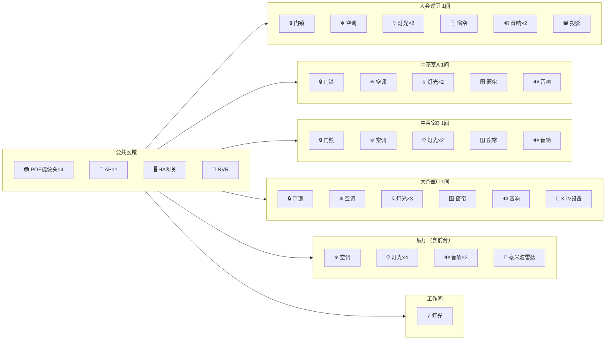
```mermaid
graph LR
    subgraph 大会议室["大会议室 1间"]
        D_Door1["🔒 门锁"]
        D_AC1["❄ 空调"]
        D_Light1A["💡 灯光×2"]
        D_Curtain1["🪟 窗帘"]
        D_Speaker1A["🔊 音响×2"]
        D_Projector["📽 投影"]
    end
    
    subgraph 中茶室A["中茶室A 1间"]
        T_DoorA["🔒 门锁"]
        T_ACA["❄ 空调"]
        T_LightA["💡 灯光×2"]
        T_CurtainA["🪟 窗帘"]
        T_SpeakerA["🔊 音响"]
    end
    
    subgraph 中茶室B["中茶室B 1间"]
        T_DoorB["🔒 门锁"]
        T_ACB["❄ 空调"]
        T_LightB["💡 灯光×2"]
        T_CurtainB["🪟 窗帘"]
        T_SpeakerB["🔊 音响"]
    end
    
    subgraph 大茶室C["大茶室C 1间"]
        C_Door["🔒 门锁"]
        C_AC["❄ 空调"]
        C_Light["💡 灯光×3"]
        C_Curtain["🪟 窗帘"]
        C_Speaker["🔊 音响"]
        C_KTV["🎤 KTV设备"]
    end
    
    subgraph 展厅["展厅（含前台）"]
        H_AC["❄ 空调"]
        H_Light["💡 灯光×4"]
        H_Speaker["🔊 音响×2"]
        H_Radar["📡 毫米波雷达"]
    end
    
    subgraph 工作间["工作间"]
        W_Light["💡 灯光"]
    end
    
    subgraph 公共["公共区域"]
        Cam["📷 POE摄像头×4"]
        AP["📶 AP×1"]
        GW["🖥 HA网关"]
        NVR["💾 NVR"]
    end
    
    公共 --> 大会议室
    公共 --> 中茶室A
    公共 --> 中茶室B
    公共 --> 大茶室C
    公共 --> 展厅
    公共 --> 工作间
```

**设备数量汇总**：

| 设备类型 | 大会议室 | 中茶室A | 中茶室B | 大茶室C | 展厅 | 工作间 | 公共 | 合计 |
|---------|---------|---------|---------|---------|------|-------|------|------|
| 门锁 | 1 | 1 | 1 | 1 | — | — | — | **4** |
| 空调 | 1 | 1 | 1 | 1 | 1 | — | — | **5** |
| 灯光（组） | 2 | 2 | 2 | 3 | 4 | 1 | — | **14** |
| 窗帘 | 1 | 1 | 1 | 1 | — | — | — | **4** |
| 音响 | 2 | 1 | 1 | 1 | 2 | — | — | **7** |
| 毫米波雷达 | — | — | — | — | 1 | — | — | **1** |
| 投影 | 1 | — | — | — | — | — | — | **1** |
| KTV | — | — | — | 1 | — | — | — | **1** |
| 摄像头 | — | — | — | — | — | — | 4 | **4** |
| AP | — | — | — | — | — | — | 1 | **1** |

### 4.2 场景-房间适用矩阵

| 场景 | 大会议室 | 中茶室A/B | 大茶室C | 展厅 | 触发方式 |
|------|---------|----------|---------|------|---------|
| **Welcome** 欢迎 | ✓ | ✓ | ✓ | — | Auto（开门事件） |
| **TeaSession** 品茶 | — | ✓ | ✓ | — | Manual（店员/客人切换） |
| **Meeting** 会议 | ✓ | — | — | — | Manual（店员/客人切换） |
| **Karaoke** K歌 | — | — | ✓ | — | Manual（店员/客人切换） |
| **EnergySave** 节能 | ✓ | ✓ | ✓ | ✓ | Auto（退房事件） |
| **PreOpen** 预开 | ✓ | ✓ | ✓ | — | Schedule（预约前5分钟） |

### 4.3 IoT三层架构

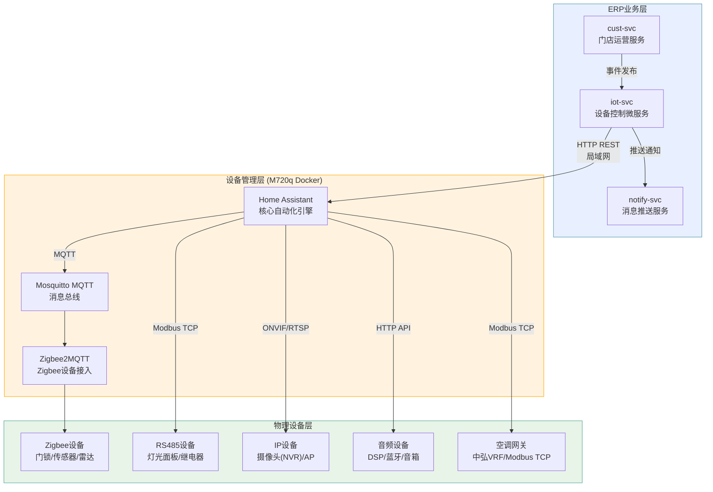
```mermaid
graph TB
    subgraph ERP["ERP业务层"]
        iotsvc["iot-svc<br/>设备控制微服务"]
        custsvc["cust-svc<br/>门店运营服务"]
        notifysvc["notify-svc<br/>消息推送服务"]
    end
    
    subgraph GW["设备管理层 (M720q Docker)"]
        HA["Home Assistant<br/>核心自动化引擎"]
        MQTT["Mosquitto MQTT<br/>消息总线"]
        Z2M["Zigbee2MQTT<br/>Zigbee设备接入"]
    end
    
    subgraph DEV["物理设备层"]
        Zigbee["Zigbee设备<br/>门锁/传感器/雷达"]
        RS485["RS485设备<br/>灯光面板/继电器"]
        IPDev["IP设备<br/>摄像头(NVR)/AP"]
        Audio["音频设备<br/>DSP/蓝牙/音箱"]
        AC["空调网关<br/>中弘VRF/Modbus TCP"]
    end
    
    iotsvc -->|"HTTP REST<br/>局域网"| HA
    custsvc -->|"事件发布"| iotsvc
    iotsvc -->|"推送通知"| notifysvc
    HA -->|"MQTT"| MQTT
    MQTT --> Z2M
    Z2M --> Zigbee
    HA -->|"Modbus TCP"| RS485
    HA -->|"ONVIF/RTSP"| IPDev
    HA -->|"HTTP API"| Audio
    HA -->|"Modbus TCP"| AC
    
    style ERP fill:#e8f0ff,stroke:#59a
    style GW fill:#fff3e0,stroke:#fa0
    style DEV fill:#e8f4e8,stroke:#5a9
```

**架构关键约束**：
- IoT层（HA）与ERP业务层解耦——HA可脱离ERP独立执行已配置的自动化规则
- 客人WiFi（VLAN 20）与设备网络（VLAN 10）物理隔离，客人端小程序通过云端API间接控制设备
- 所有设备控制指令由 iot-svc 统一代理，不直接暴露HA API

---

## 5. 关键时序图

> 以下时序图覆盖智能设备场景的6个核心交互流程。参与者缩写：`小程序`=微信小程序端，`svc`=后端微服务，`HA`=Home Assistant网关。

### 5.1 客人预约到店全流程

覆盖从选择包间到进门的完整链路（对应泳道图F01）。

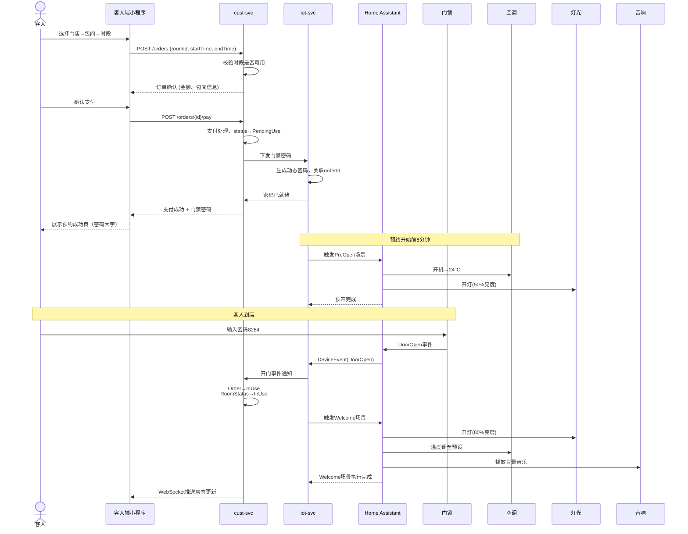
```mermaid
sequenceDiagram
    actor Guest as 客人
    participant MP as 客人端小程序
    participant Cust as cust-svc
    participant IoT as iot-svc
    participant HA as Home Assistant
    participant Lock as 门锁
    participant AC as 空调
    participant Light as 灯光
    participant Speaker as 音响
    
    Guest->>MP: 选择门店→包间→时段
    MP->>Cust: POST /orders (roomId, startTime, endTime)
    Cust->>Cust: 校验时段是否可用
    Cust-->>MP: 订单确认 (金额、包间信息)
    Guest->>MP: 确认支付
    MP->>Cust: POST /orders/{id}/pay
    Cust->>Cust: 支付处理，status→PendingUse
    Cust->>IoT: 下发门禁密码
    IoT->>IoT: 生成动态密码，关联orderId
    IoT-->>Cust: 密码已就绪
    Cust-->>MP: 支付成功 + 门禁密码
    MP-->>Guest: 展示预约成功页（密码大字）
    
    Note over IoT,AC: 预约开始前5分钟
    IoT->>HA: 触发PreOpen场景
    HA->>AC: 开机→24°C
    HA->>Light: 开灯(50%亮度)
    HA-->>IoT: 预开完成
    
    Note over Guest,Lock: 客人到店
    Guest->>Lock: 输入密码8264
    Lock->>HA: DoorOpen事件
    HA->>IoT: DeviceEvent(DoorOpen)
    IoT->>Cust: 开门事件通知
    Cust->>Cust: Order→InUse<br/>RoomStatus→InUse
    IoT->>HA: 触发Welcome场景
    HA->>Light: 开灯(80%亮度)
    HA->>AC: 温度调至预设
    HA->>Speaker: 播放背景音乐
    HA-->>IoT: Welcome场景执行完成
    Cust-->>MP: WebSocket推送房态更新
```

**异常分支**：
- 预约开始后30分钟未开门 → RoomStatus→Free，Order→Cancelled，清除门禁密码
- 门锁密码验证失败3次 → 推送店员端告警

### 5.2 包间内场景切换

覆盖客人或店员手动切换场景，以及手动覆盖自动场景的优先级规则。

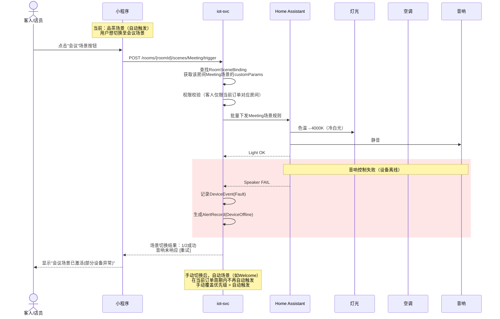
```mermaid
sequenceDiagram
    actor User as 客人/店员
    participant MP as 小程序
    participant IoT as iot-svc
    participant HA as Home Assistant
    participant Light as 灯光
    participant AC as 空调
    participant Speaker as 音响
    
    Note over MP: 当前：品茶场景（自动触发）<br/>用户想切换至会议场景
    
    User->>MP: 点击"会议"场景按钮
    MP->>IoT: POST /rooms/{roomId}/scenes/Meeting/trigger
    IoT->>IoT: 查找RoomSceneBinding<br/>获取该房间Meeting场景的customParams
    IoT->>IoT: 权限校验（客人仅限当前订单对应房间）
    IoT->>HA: 批量下发Meeting场景规则
    
    HA->>Light: 色温→4000K（冷白光）
    HA->>Speaker: 静音
    HA-->>IoT: Light OK
    
    rect rgb(255, 230, 230)
        Note over HA,Speaker: 音响控制失败（设备离线）
        HA-->>IoT: Speaker FAIL
        IoT->>IoT: 记录DeviceEvent(Fault)
        IoT->>IoT: 生成AlertRecord(DeviceOffline)
    end
    
    IoT-->>MP: 场景切换结果：1/2成功<br/>音响未响应 [重试]
    MP-->>User: 显示"会议场景已激活(部分设备异常)"
    
    Note over IoT: 手动切换后，自动场景（如Welcome）<br/>在当前订单周期内不再自动触发<br/>手动覆盖优先级 > 自动触发
```

**关键规则**：
- 手动切换场景后，该订单周期内同房间的自动场景不再触发（防止"手动切会议→开门事件又切回欢迎"的乒乓效应）
- 退房事件触发的 EnergySave 场景优先级最高，无论当前是什么手动场景，退房时必须执行节能

### 5.3 退房与节能联动

覆盖客人退房→节能场景→保洁派单→保洁完成→房态恢复的完整闭环。

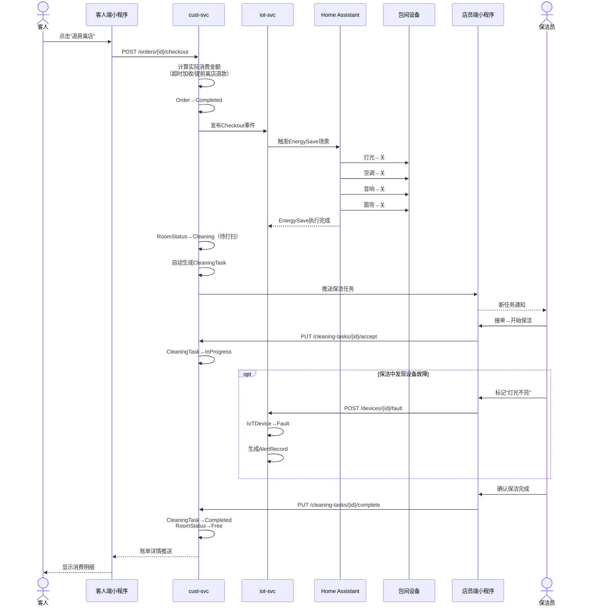
```mermaid
sequenceDiagram
    actor Guest as 客人
    participant MP as 客人端小程序
    participant Cust as cust-svc
    participant IoT as iot-svc
    participant HA as Home Assistant
    participant Dev as 包间设备
    participant StaffMP as 店员端小程序
    actor Cleaner as 保洁员
    
    Guest->>MP: 点击"退房离店"
    MP->>Cust: POST /orders/{id}/checkout
    Cust->>Cust: 计算实际消费金额<br/>（超时加收/提前离店退款）
    Cust->>Cust: Order→Completed
    Cust->>IoT: 发布Checkout事件
    
    IoT->>HA: 触发EnergySave场景
    HA->>Dev: 灯光→关
    HA->>Dev: 空调→关
    HA->>Dev: 音响→关
    HA->>Dev: 窗帘→关
    HA-->>IoT: EnergySave执行完成
    
    Cust->>Cust: RoomStatus→Cleaning（待打扫）
    Cust->>Cust: 自动生成CleaningTask
    Cust->>StaffMP: 推送保洁任务
    
    StaffMP-->>Cleaner: 新任务通知
    Cleaner->>StaffMP: 接单→开始保洁
    StaffMP->>Cust: PUT /cleaning-tasks/{id}/accept
    Cust->>Cust: CleaningTask→InProgress
    
    opt 保洁中发现设备故障
        Cleaner->>StaffMP: 标记"灯光不亮"
        StaffMP->>IoT: POST /devices/{id}/fault
        IoT->>IoT: IoTDevice→Fault
        IoT->>IoT: 生成AlertRecord
    end
    
    Cleaner->>StaffMP: 确认保洁完成
    StaffMP->>Cust: PUT /cleaning-tasks/{id}/complete
    Cust->>Cust: CleaningTask→Completed<br/>RoomStatus→Free
    
    Cust-->>MP: 账单详情推送
    MP-->>Guest: 显示消费明细
```

### 5.4 店员远程控制

覆盖店员手动控制设备、权限校验、审计记录、故障处理。

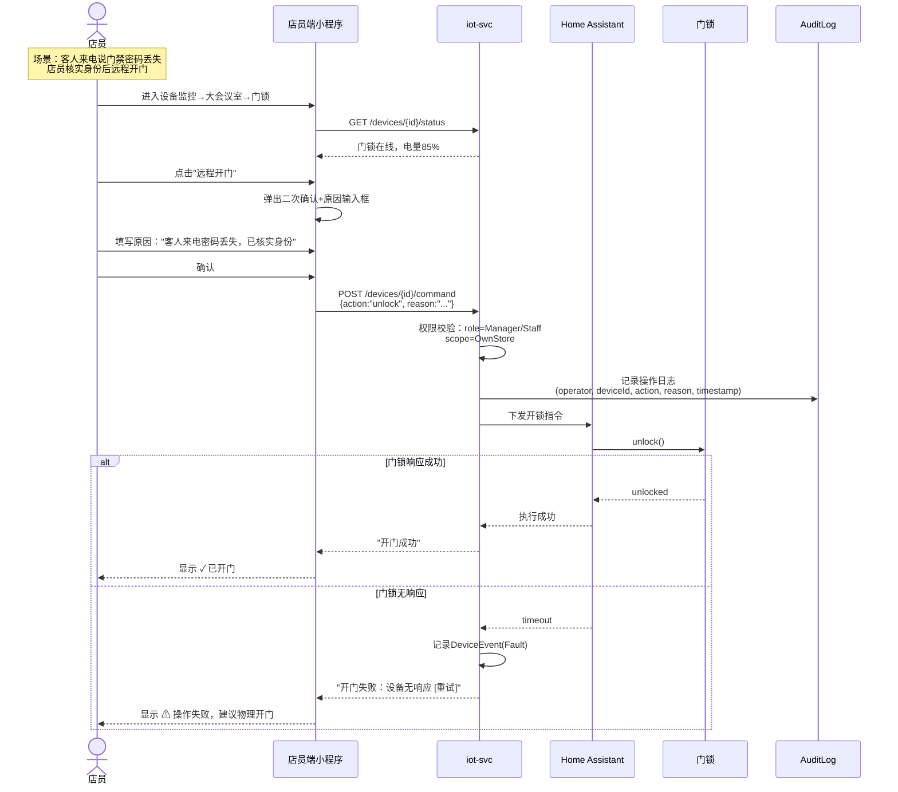
```mermaid
sequenceDiagram
    actor Staff as 店员
    participant MP as 店员端小程序
    participant IoT as iot-svc
    participant HA as Home Assistant
    participant Lock as 门锁
    participant Audit as AuditLog
    
    Note over Staff: 场景：客人来电说门禁密码丢失<br/>店员核实身份后远程开门
    
    Staff->>MP: 进入设备监控→大会议室→门锁
    MP->>IoT: GET /devices/{id}/status
    IoT-->>MP: 门锁在线，电量85%
    
    Staff->>MP: 点击"远程开门"
    MP->>MP: 弹出二次确认+原因输入框
    Staff->>MP: 填写原因："客人来电密码丢失，已核实身份"
    Staff->>MP: 确认
    
    MP->>IoT: POST /devices/{id}/command<br/>{action:"unlock", reason:"..."}
    IoT->>IoT: 权限校验：role=Manager/Staff<br/>scope=OwnStore
    IoT->>Audit: 记录操作日志<br/>(operator, deviceId, action, reason, timestamp)
    
    IoT->>HA: 下发开锁指令
    HA->>Lock: unlock()
    
    alt 门锁响应成功
        Lock-->>HA: unlocked
        HA-->>IoT: 执行成功
        IoT-->>MP: "开门成功"
        MP-->>Staff: 显示 ✓ 已开门
    else 门锁无响应
        HA-->>IoT: timeout
        IoT->>IoT: 记录DeviceEvent(Fault)
        IoT-->>MP: "开门失败：设备无响应 [重试]"
        MP-->>Staff: 显示 ⚠ 操作失败，建议物理开门
    end
```

**所有远程操作均需**：
1. 填写操作原因（≥5字）
2. 二次确认（高风险操作如开门）
3. 写入 AuditLog
4. 手动房态变更需店长24h内抽样复核（20%采样率）

### 5.5 设备故障告警处理

覆盖HA心跳超时检测→ERP告警生成→店员推送→处理闭环（对应泳道图F18）。

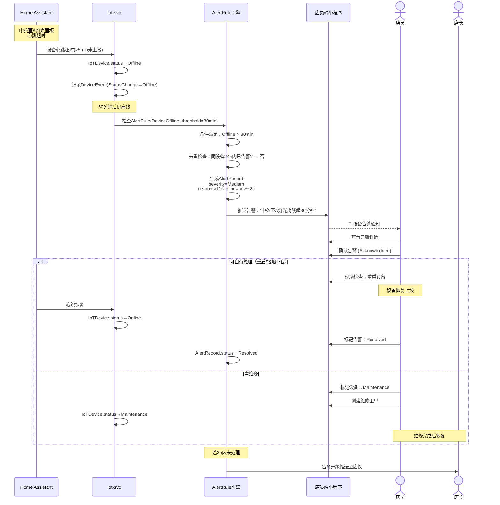
```mermaid
sequenceDiagram
    participant HA as Home Assistant
    participant IoT as iot-svc
    participant Alert as AlertRule引擎
    participant StaffMP as 店员端小程序
    actor Staff as 店员
    actor Manager as 店长
    
    Note over HA: 中茶室A灯光面板<br/>心跳超时
    
    HA->>IoT: 设备心跳超时(>5min未上报)
    IoT->>IoT: IoTDevice.status→Offline
    IoT->>IoT: 记录DeviceEvent(StatusChange→Offline)
    
    Note over IoT: 30分钟后仍离线
    IoT->>Alert: 检查AlertRule(DeviceOffline, threshold=30min)
    Alert->>Alert: 条件满足：Offline > 30min
    Alert->>Alert: 去重检查：同设备24h内已告警? → 否
    Alert->>Alert: 生成AlertRecord<br/>severity=Medium<br/>responseDeadline=now+2h
    Alert->>StaffMP: 推送告警："中茶室A灯光离线超30分钟"
    
    StaffMP-->>Staff: 🔴 设备告警通知
    Staff->>StaffMP: 查看告警详情
    Staff->>StaffMP: 确认告警 (Acknowledged)
    
    alt 可自行处理（重启/接触不良）
        Staff->>StaffMP: 现场检查→重启设备
        Note over Staff: 设备恢复上线
        HA->>IoT: 心跳恢复
        IoT->>IoT: IoTDevice.status→Online
        Staff->>StaffMP: 标记告警：Resolved
        Alert->>Alert: AlertRecord.status→Resolved
    else 需维修
        Staff->>StaffMP: 标记设备→Maintenance
        Staff->>StaffMP: 创建维修工单
        IoT->>IoT: IoTDevice.status→Maintenance
        Note over Staff,Manager: 维修完成后恢复
    end
    
    Note over Alert: 若2h内未处理
    Alert->>Manager: 告警升级推送至店长
```

**告警去重规则**：
- 同设备+同告警类型24h内只生成一次 AlertRecord
- 已解决的告警，7天内同条件不再触发
- 超时未处理自动升级（店员30min→店长2h→总部运营4h）

### 5.6 店员房态看板刷新

覆盖店员打开小程序时房态数据加载和实时推送。

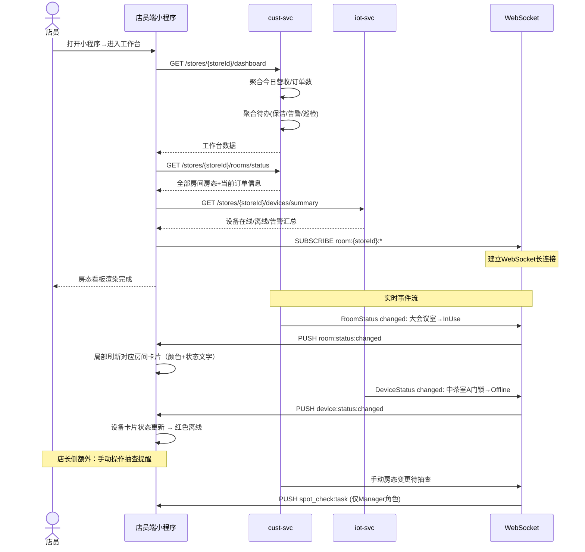
```mermaid
sequenceDiagram
    actor Staff as 店员
    participant MP as 店员端小程序
    participant Cust as cust-svc
    participant IoT as iot-svc
    participant WS as WebSocket
    
    Staff->>MP: 打开小程序→进入工作台
    MP->>Cust: GET /stores/{storeId}/dashboard
    Cust->>Cust: 聚合今日营收/订单数
    Cust->>Cust: 聚合待办(保洁/告警/巡检)
    Cust-->>MP: 工作台数据
    
    MP->>Cust: GET /stores/{storeId}/rooms/status
    Cust-->>MP: 全部房间房态+当前订单信息
    
    MP->>IoT: GET /stores/{storeId}/devices/summary
    IoT-->>MP: 设备在线/离线/告警汇总
    
    MP->>WS: SUBSCRIBE room:{storeId}:*
    Note over WS: 建立WebSocket长连接
    
    MP-->>Staff: 房态看板渲染完成
    
    Note over Cust,WS: 实时事件流
    Cust->>WS: RoomStatus changed: 大会议室→InUse
    WS->>MP: PUSH room:status:changed
    MP->>MP: 局部刷新对应房间卡片（颜色+状态文字）
    
    IoT->>WS: DeviceStatus changed: 中茶室A门锁→Offline
    WS->>MP: PUSH device:status:changed
    MP->>MP: 设备卡片状态更新 → 红色离线
    
    Note over MP,Staff: 店长侧额外：手动操作抽查提醒
    Cust->>WS: 手动房态变更待抽查
    WS->>MP: PUSH spot_check:task (仅Manager角色)
```

**WebSocket订阅主题设计**：

| 主题 | 推送内容 | 订阅者 |
|------|---------|--------|
| `room:{storeId}:status` | 房态变更事件 | 店员端（本店全员） |
| `device:{storeId}:status` | 设备在线状态变更 | 店员端（本店全员） |
| `device:{storeId}:alert` | 设备告警通知 | 店员端 + 店长 |
| `cleaning:{storeId}:task` | 保洁任务新增/完成 | 店员端 + 保洁员 |
| `spot_check:{storeId}` | 手动操作抽查提醒 | 店长端 |
| `order:{storeId}:active` | 订单状态变更 | 店员端 |

---

## 6. 关键状态机

### 6.1 IoTDevice 设备状态机

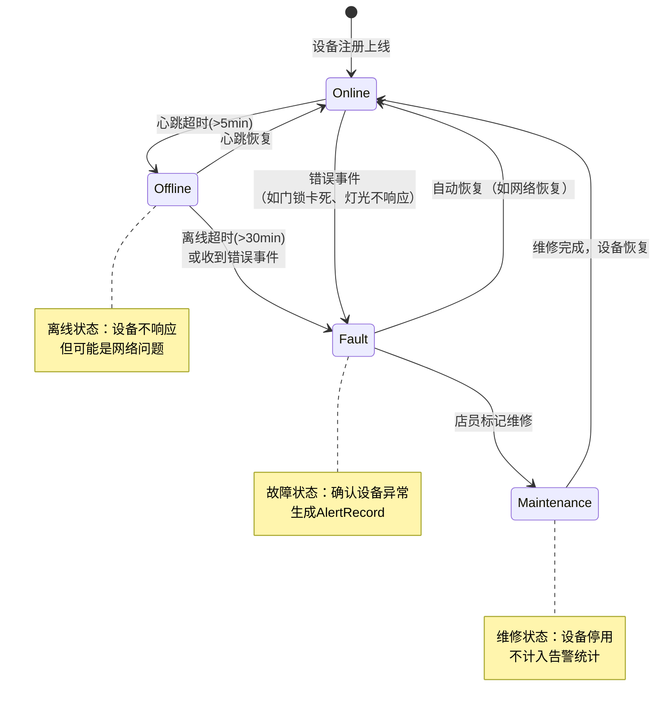
```mermaid
stateDiagram-v2
    [*] --> Online : 设备注册上线
    
    Online --> Offline : 心跳超时(>5min)
    Offline --> Online : 心跳恢复
    Offline --> Fault : 离线超时(>30min)<br/>或收到错误事件
    Online --> Fault : 错误事件<br/>（如门锁卡死、灯光不响应）
    Fault --> Maintenance : 店员标记维修
    Maintenance --> Online : 维修完成，设备恢复
    Fault --> Online : 自动恢复（如网络恢复）
    
    note right of Offline : 离线状态：设备不响应<br/>但可能是网络问题
    note right of Fault : 故障状态：确认设备异常<br/>生成AlertRecord
    note right of Maintenance : 维修状态：设备停用<br/>不计入告警统计
```

**状态触发器**：
- `Online→Offline`：HA心跳超时>5分钟，或Zigbee设备LQI=0
- `Offline→Fault`：持续离线>30分钟，或收到设备错误码
- `Online→Fault`：设备主动上报故障码
- `Fault/Offline→Online`：心跳恢复+设备状态自检通过
- `→Maintenance`：店员手动标记，需填写维修原因

### 6.2 Order-IoT联动状态机

```mermaid
stateDiagram-v2
    [*] --> PendingPay : 客人提交预约
    
    PendingPay --> PendingUse : 支付成功<br/>▶ IoT: 生成门禁密码
    PendingPay --> Cancelled : 支付超时(15min)<br/>或用户取消
    
    PendingUse --> InUse : 门锁DoorOpen事件<br/>▶ IoT: Welcome场景<br/>▶ RoomStatus→InUse
    PendingUse --> Cancelled : 超时30min未开门<br/>▶ IoT: 清除门禁密码<br/>▶ RoomStatus→Free
    
    InUse --> Completed : 客人退房<br/>▶ IoT: EnergySave场景<br/>▶ RoomStatus→Cleaning<br/>▶ 生成CleaningTask
    InUse --> Completed : 店员强制退房<br/>▶ IoT: EnergySave场景
    
    Completed --> [*]
    Cancelled --> [*]
    
    note left of PendingUse : 预约前5分钟<br/>▶ IoT: PreOpen场景<br/>（预开空调）
    note left of InUse : 使用中可续订<br/>（最小1小时增量）
```

### 6.3 RoomStatus 房态与设备联动

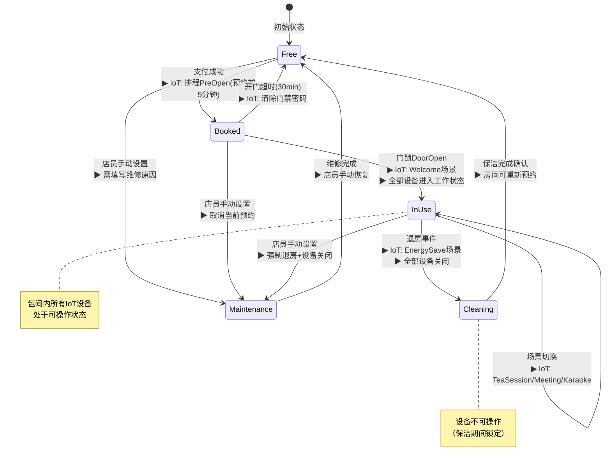
```mermaid
stateDiagram-v2
    [*] --> Free : 初始状态
    
    Free --> Booked : 支付成功<br/>▶ IoT: 排程PreOpen(预约前5分钟)
    Booked --> Free : 开门超时(30min)<br/>▶ IoT: 清除门禁密码
    
    Booked --> InUse : 门锁DoorOpen<br/>▶ IoT: Welcome场景<br/>▶ 全部设备进入工作状态
    InUse --> InUse : 场景切换<br/>▶ IoT: TeaSession/Meeting/Karaoke
    
    InUse --> Cleaning : 退房事件<br/>▶ IoT: EnergySave场景<br/>▶ 全部设备关闭
    Cleaning --> Free : 保洁完成确认<br/>▶ 房间可重新预约
    
    Free --> Maintenance : 店员手动设置<br/>▶ 需填写维修原因
    Booked --> Maintenance : 店员手动设置<br/>▶ 取消当前预约
    InUse --> Maintenance : 店员手动设置<br/>▶ 强制退房+设备关闭
    Maintenance --> Free : 维修完成<br/>▶ 店员手动恢复
    
    note right of InUse : 包间内所有IoT设备<br/>处于可操作状态
    note right of Cleaning : 设备不可操作<br/>（保洁期间锁定）
```

**房态颜色编码**（店员端小程序渲染标准）：
- 🔵 Free = 蓝色
- 🟣 Booked = 紫色
- 🟢 InUse = 绿色
- 🟡 Cleaning = 黄色
- 🔴 Maintenance = 红色

### 6.4 SmartScene 场景激活生命周期

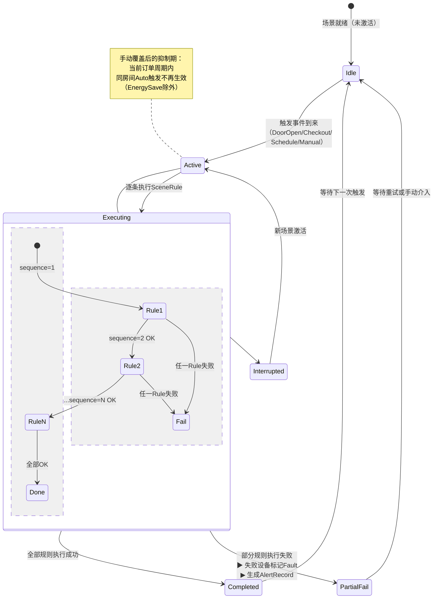
```mermaid
stateDiagram-v2
    [*] --> Idle : 场景就绪（未激活）
    
    Idle --> Active : 触发事件到来<br/>（DoorOpen/Checkout/<br/>Schedule/Manual）
    
    Active --> Executing : 逐条执行SceneRule
    
    state Executing {
        [*] --> Rule1 : sequence=1
        Rule1 --> Rule2 : sequence=2 OK
        Rule2 --> RuleN : ...sequence=N OK
        RuleN --> Done : 全部OK
        --
        Rule1 --> Fail : 任一Rule失败
        Rule2 --> Fail : 任一Rule失败
    }
    
    Executing --> Completed : 全部规则执行成功
    Executing --> PartialFail : 部分规则执行失败<br/>▶ 失败设备标记Fault<br/>▶ 生成AlertRecord
    
    Completed --> Idle : 等待下一次触发
    PartialFail --> Idle : 等待重试或手动介入
    
    Active --> Interrupted : 手动覆盖<br/>（如手动切换至另一场景）
    Interrupted --> Active : 新场景激活
    
    note left of Active : 手动覆盖后的抑制期：<br/>当前订单周期内<br/>同房间Auto触发不再生效<br/>（EnergySave除外）
```

### 6.5 CleaningTask 与设备故障交叉

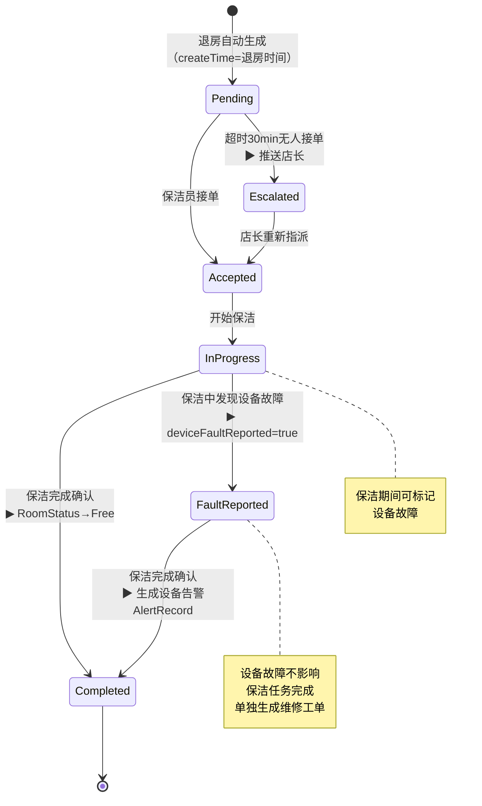
```mermaid
stateDiagram-v2
    [*] --> Pending : 退房自动生成<br/>（createTime=退房时间）
    
    Pending --> Accepted : 保洁员接单
    Pending --> Escalated : 超时30min无人接单<br/>▶ 推送店长
    
    Accepted --> InProgress : 开始保洁
    
    InProgress --> Completed : 保洁完成确认<br/>▶ RoomStatus→Free
    InProgress --> FaultReported : 保洁中发现设备故障<br/>▶ deviceFaultReported=true
    
    FaultReported --> Completed : 保洁完成确认<br/>▶ 生成设备告警AlertRecord
    
    Completed --> [*]
    Escalated --> Accepted : 店长重新指派
    
    note right of InProgress : 保洁期间可标记<br/>设备故障
    note right of FaultReported : 设备故障不影响<br/>保洁任务完成<br/>单独生成维修工单
```

**保洁任务与设备的交互约束**：
- 保洁期间该房间的IoT设备锁定，不可远程操作（防止保洁员在房间内时设备被意外控制）
- 保洁完成确认后，系统自动检查该房间所有设备是否在线，离线设备生成告警

---

## 7. 域间集成点说明

### 7.1 D08→D03 集成架构

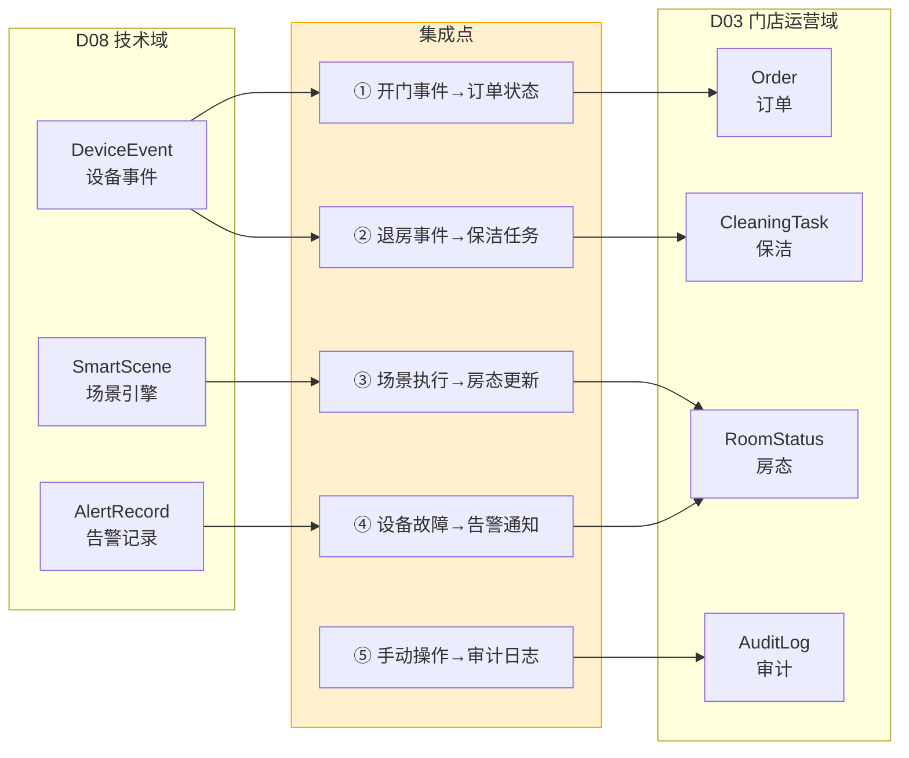
```mermaid
graph LR
    subgraph D08["D08 技术域"]
        DeviceEvent["DeviceEvent<br/>设备事件"]
        SmartScene["SmartScene<br/>场景引擎"]
        AlertRecord["AlertRecord<br/>告警记录"]
    end
    
    subgraph INTEG["集成点"]
        direction TB
        E1["① 开门事件→订单状态"]
        E2["② 退房事件→保洁任务"]
        E3["③ 场景执行→房态更新"]
        E4["④ 设备故障→告警通知"]
        E5["⑤ 手动操作→审计日志"]
    end
    
    subgraph D03["D03 门店运营域"]
        Order["Order<br/>订单"]
        RoomStatus["RoomStatus<br/>房态"]
        CleaningTask["CleaningTask<br/>保洁"]
        AuditLog["AuditLog<br/>审计"]
    end
    
    DeviceEvent --> E1
    SmartScene --> E3
    AlertRecord --> E4
    DeviceEvent --> E2
    
    E1 --> Order
    E2 --> CleaningTask
    E3 --> RoomStatus
    E4 --> RoomStatus
    E5 --> AuditLog
    
    style INTEG fill:#fff0d0,stroke:#fa0
```

### 7.2 事件→动作映射表

| # | 触发事件 | 事件来源（域） | 作用目标（域） | 动作 |
|---|---------|-------------|-------------|------|
| ① | DoorOpen | DeviceEvent(D08) | Order(D03) | Order→InUse, 记录actualStartTime |
| ① | DoorOpen | DeviceEvent(D08) | RoomStatus(D03) | RoomStatus→InUse |
| ① | DoorOpen | DeviceEvent(D08) | SmartScene(D08) | 触发Welcome场景 |
| ② | Checkout | Order(D03) | RoomStatus(D03) | RoomStatus→Cleaning |
| ② | Checkout | Order(D03) | CleaningTask(D03) | 自动生成保洁任务 |
| ② | Checkout | Order(D03) | SmartScene(D08) | 触发EnergySave场景 |
| ③ | ScenarioCompleted | SmartScene(D08) | DeviceEvent(D08) | 记录场景执行日志 |
| ③ | ScenarioFailed | SmartScene(D08) | AlertRecord(D08) | 生成部分失败告警 |
| ④ | DeviceFault | IoTDevice(D08) | AlertRecord(D08) | 生成告警，推送店员 |
| ④ | DeviceOffline>30min | IoTDevice(D08) | AlertRecord(D08) | 生成离线告警 |
| ⑤ | ManualRoomStatusChange | RoomStatus(D03) | AuditLog(D08) | 记录操作者/时间/原因 |
| ⑤ | DeviceCommand | IoTDevice(D08) | AuditLog(D08) | 记录远程操作 |
| — | PreOpenSchedule | SystemJob(D08) | SmartScene(D08) | 预约前5分钟触发PreOpen |

### 7.3 概念性服务契约

以下为 iot-svc 的核心API端点草稿（非正式接口规范，供评审讨论）：

| 方法 | 路径 | 说明 | 调用方 |
|------|------|------|--------|
| `POST` | `/iot/rooms/{roomId}/scenes/{sceneId}/trigger` | 手动触发场景 | 客人端/店员端小程序 |
| `POST` | `/iot/devices/{deviceId}/command` | 发送设备控制指令 | 店员端小程序 |
| `GET` | `/iot/stores/{storeId}/devices` | 获取门店设备列表 | 店员端小程序 |
| `GET` | `/iot/devices/{deviceId}/status` | 获取单设备实时状态 | 店员端小程序 |
| `GET` | `/iot/rooms/{roomId}/devices/status` | 获取房间内所有设备状态 | 客人端小程序 |
| `POST` | `/iot/devices/{deviceId}/fault` | 标记设备故障 | 店员端小程序（保洁上报） |
| `GET` | `/iot/stores/{storeId}/alerts` | 获取设备告警列表 | 店员端小程序 |
| `PUT` | `/iot/alerts/{alertId}/resolve` | 解决告警 | 店员端小程序 |
| `WS` | `/ws/iot/{storeId}` | WebSocket实时推送 | 店员端/客人端小程序 |

---

## 8. 评审讨论议题

> 以下问题提请于总和项目组在评审会上讨论确认。

### 8.1 场景切换策略

**问题**：客人端是否应该控制全部场景（目前需求仅提到音乐控制），还是提供更完整的场景切换能力（品茶/会议/K歌）？

- **选项A**：客人端仅控制音乐，场景切换仅限店员端——理由：避免客人误操作，保持服务一致性
- **选项B**：客人端可切换全部场景——理由：提升自助体验，减少店员干预

**影响**：决定客人端小程序的"包间内控制页"功能范围。

### 8.2 自动与手动覆盖并发

**问题**：自动场景（Welcome/EnergySave）与手动场景切换的并发策略。

- 当前设计：手动覆盖后抑制当前订单周期的自动场景（EnergySave除外）。但边角场景需要讨论：
  - 客人在店员手动切到Meeting后自己又按了TeaSession → 谁生效？
  - 最后一个操作者优先 vs 角色优先级？

### 8.3 门锁离线动态密码

**问题**：客人端小程序获取门禁密码后，是否需要本地缓存密码？

- **选项A**：仅实时从服务端获取（每次都需网络）
- **选项B**：小程序本地存储当前订单密码（离线也可查看）
- 当前设备方案：门锁支持离线动态密码（时间同步算法），即使网关断网也能验证。但客人端显示密码是否需要网络待定。

### 8.4 展厅和工作间场景自动化

**问题**：展厅和工作间是否需要完整的场景自动化？

- 展厅：有空调、灯光、音响、毫米波雷达——可做Welcome和EnergySave
- 工作间：仅灯光——场景价值有限
- 建议：展厅可配置预开空调（上班前30分钟），但不绑定预约流程

### 8.5 音乐控制归属

**问题**：包间内音乐的优先级——系统背景音乐 vs 客人蓝牙直连。

- 当前IoT方案：客人蓝牙连接→DSP自动切换音源；蓝牙断开→恢复背景音乐
- 但若客人正在使用蓝牙播放，店员通过场景切换（如Meeting场景的静音指令）是否应该覆盖？
- 建议：Meeting场景的静音指令覆盖蓝牙，但其他场景不中断客人蓝牙连接

### 8.6 窗帘联动规则

**问题**：窗帘是否与时间/光照传感器绑定？

- 当前设计：窗帘仅跟随场景（Welcome开、EnergySave关）
- 可选增强：中茶室沿落地窗，下午西晒时可接入光照传感器自动关窗帘
- 这是否作为V1.0范围，还是留待后续迭代？

### 8.7 SceneRule参数可配置范围

**问题**：店员能否调整场景参数（空调温度、灯光色温、音响音量）？

- 当前设计：仅管理员（Admin/Manager角色）可配置 RoomSceneBinding.customParams
- 是否需要允许普通店员调整？如大茶室C客人觉得24°C太冷，店员能否直接改为26°C而不经过管理员？
- 建议：店员可以临时调整单次执行参数（不保存），管理员可以修改默认参数（持久化）

---

## 附录A：实体→ROM-01章节交叉引用

| 实体 | ROM-01章节 | 实体 | ROM-01章节 |
|------|-----------|------|-----------|
| Store | §5.2.2 | Room | §5.2.8 |
| Customer | §6.2.1 | Order | §6.2.5 |
| OrderItem | §6.2.6 | RoomAppointment | §6.2.7 |
| RoomStatus | §6.2.8 | CleaningTask | §6.2.9 |
| Employee | §10.2.1 | IoTDevice | §11.2.1 |
| DeviceEvent | §11.2.2 | SmartScene | §11.2.3 |
| SceneRule | §11.2.4 | RoomSceneBinding | §11.2.5 |
| UserAccount | §11.2.6 | Role | §11.2.7 |
| Permission | §11.2.8 | AuditLog | §11.2.9 |
| AlertRule | §11.2.10 | AlertRecord | §11.2.11 |

完整属性定义、业务约束、CDM映射详见 ROM-01 对应章节。

## 附录B：图表索引

| 编号 | 类型 | 名称 |
|------|------|------|
| 图1.2 | graph TB | ROM-02与ROM-01关系图 |
| 图2.2 | graph TB | 三域交集总览图 |
| 图3.1 | classDiagram | 设备与场景配置模型 |
| 图3.2 | classDiagram | 预约消费与房态模型 |
| 图3.3 | classDiagram | 设备事件与场景联动模型 |
| 图3.4 | classDiagram | 权限与审计模型 |
| 图4.1 | graph LR | 盈隆店物理部署图 |
| 图4.3 | graph TB | IoT三层架构图 |
| 图5.1 | sequenceDiagram | 客人预约到店全流程 |
| 图5.2 | sequenceDiagram | 包间内场景切换 |
| 图5.3 | sequenceDiagram | 退房与节能联动 |
| 图5.4 | sequenceDiagram | 店员远程控制 |
| 图5.5 | sequenceDiagram | 设备故障告警处理 |
| 图5.6 | sequenceDiagram | 店员房态看板刷新 |
| 图6.1 | stateDiagram | IoTDevice状态机 |
| 图6.2 | stateDiagram | Order-IoT联动状态机 |
| 图6.3 | stateDiagram | RoomStatus房态联动 |
| 图6.4 | stateDiagram | SmartScene生命周期 |
| 图6.5 | stateDiagram | CleaningTask与故障交叉 |
| 图7.1 | graph LR | D08→D03集成架构 |

## 附录C：修订历史

| 版本 | 日期 | 说明 |
|------|------|------|
| V1.0 | 2026-05-08 | 初稿，提取自ROM-01 D02/D03/D08相关实体，含6时序图+5状态机+4类图 |
