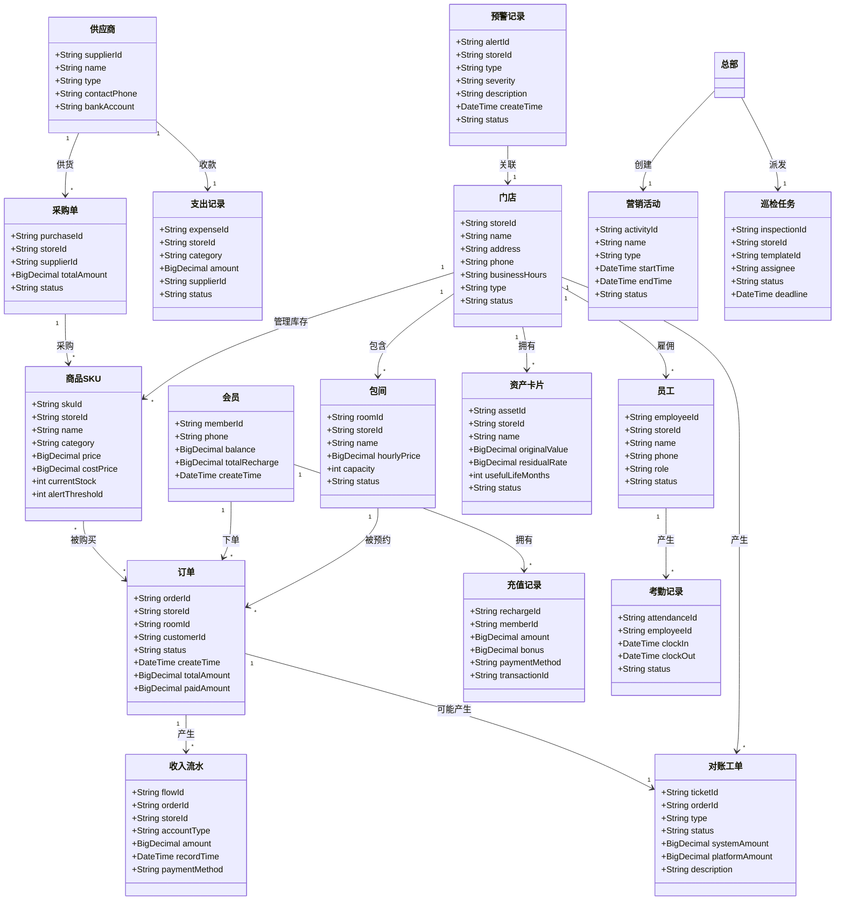
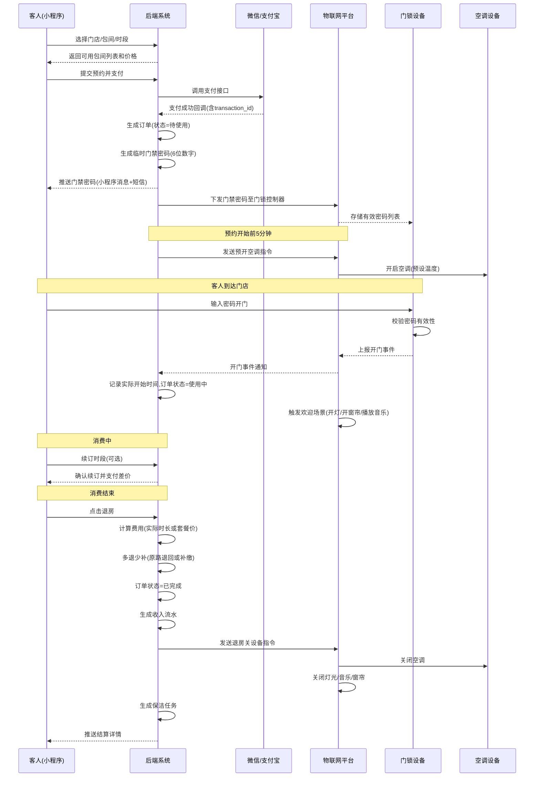
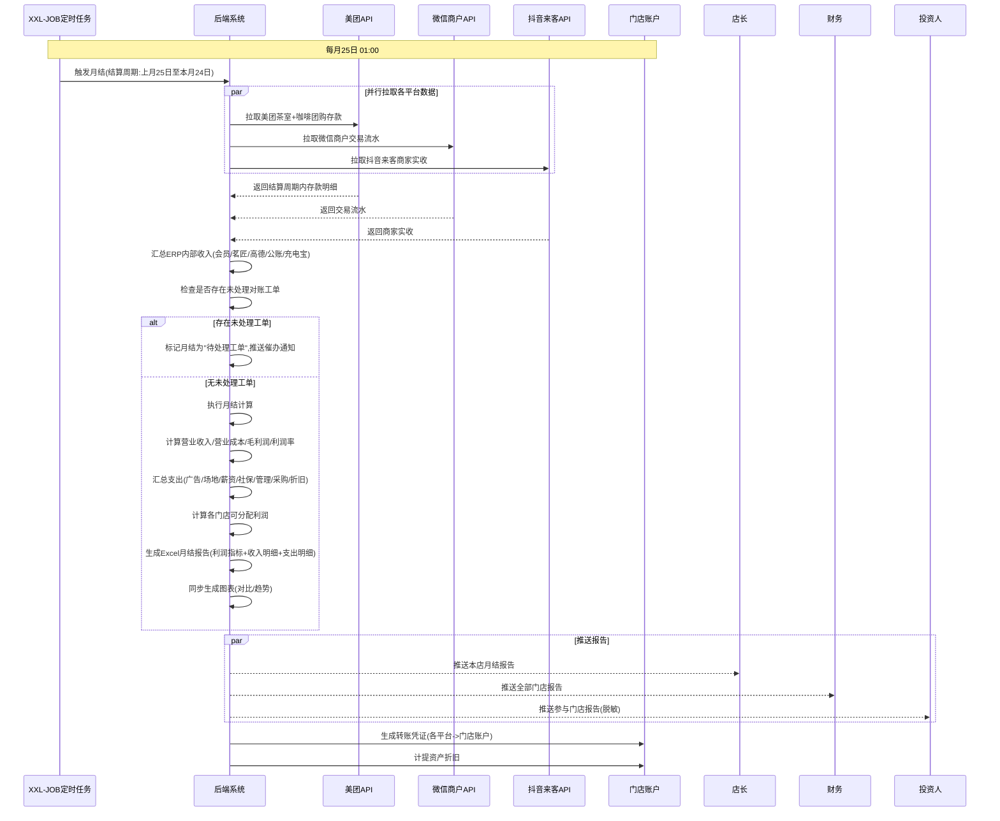
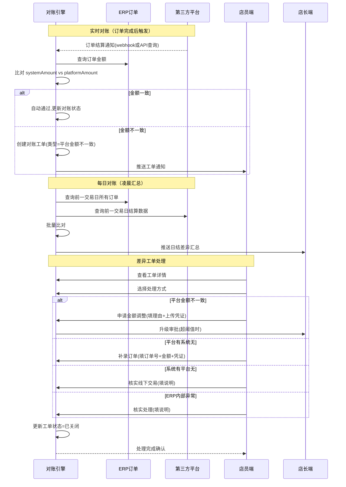
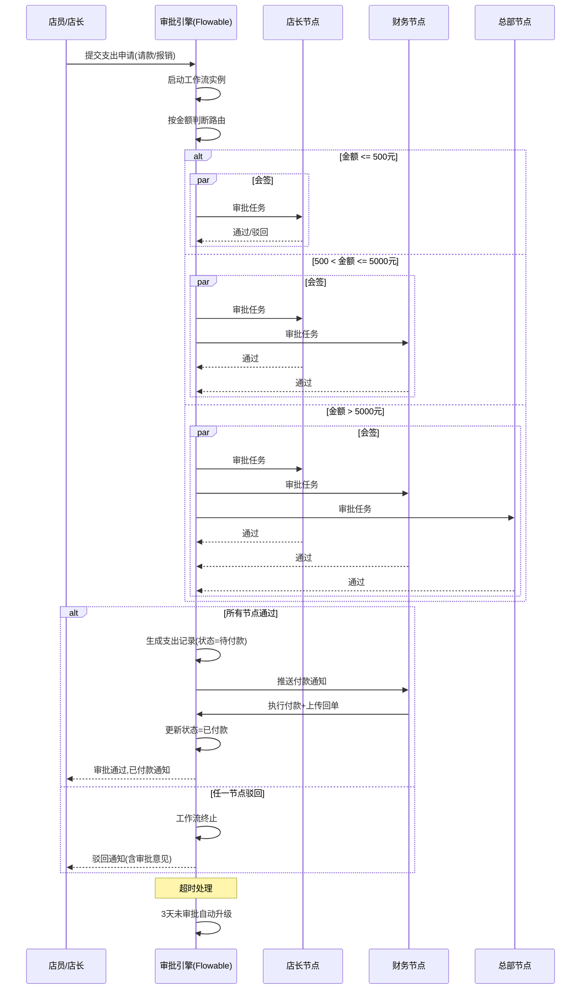
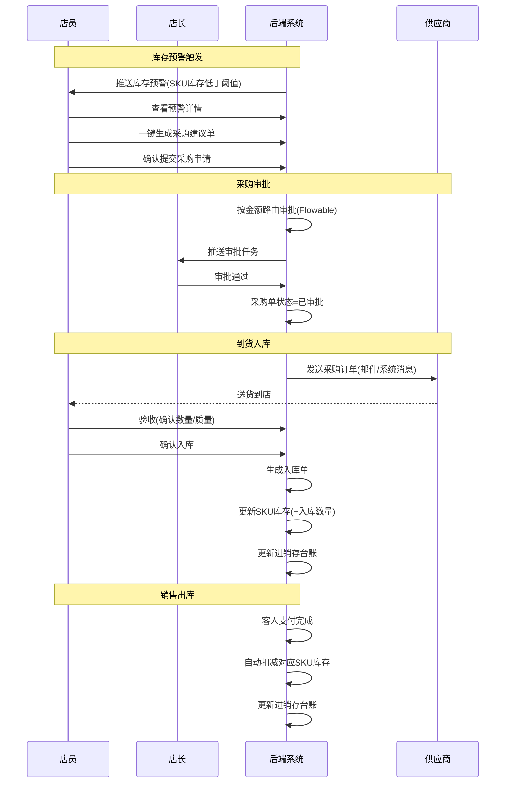

# 高岸ERP系统 — 技术方案与对象模型设计

**版本**：V1.0  
**日期**：2026年5月5日  
**文档状态**：评审版  
**前置文档**：《高岸ERP系统需求说明书 V9.1》

---

## 第一章：技术栈选择

### 1.1 总体架构

```
┌─────────────────────────────────────────────────────┐
│                    展现层                             │
│  ┌──────────┐  ┌──────────┐  ┌──────────────────┐  │
│  │ 客人小程序 │  │ 店员/店长 │  │ 总部/投资人PC端  │  │
│  │ (uni-app) │  │ 移动端   │  │ (Vue3 + Admin)  │  │
│  └─────┬────┘  └────┬─────┘  └────────┬─────────┘  │
├────────┼─────────────┼────────────────┼────────────┤
│        └─────────────┴────────────────┘             │
│                        │  HTTPS/REST               │
│  ┌─────────────────────┴─────────────────────────┐  │
│  │              API 网关 (Spring Cloud Gateway)    │  │
│  └──────┬──────────┬──────────┬─────────────────┘  │
│         │          │          │                      │
│  ┌──────┴──┐ ┌─────┴─────┐ ┌─┴──────────────┐      │
│  │ 业务服务  │ │ 工作流引擎 │ │ 平台对接层      │      │
│  │(微服务)  │ │(Flowable) │ │(美团/抖音API)  │      │
│  └──────┬──┘ └─────┬─────┘ └───────┬────────┘      │
│         │          │                │               │
│  ┌──────┴──────────┴────────────────┴────────┐     │
│  │             数据层                          │     │
│  │  ┌──────┐ ┌──────┐ ┌──────┐ ┌──────────┐  │     │
│  │  │MySQL │ │Redis │ │OSS   │ │MQTT Broker│  │     │
│  │  └──────┘ └──────┘ └──────┘ └──────────┘  │     │
│  └─────────────────────────────────────────────┘      │
│                                                       │
│  ┌─────────────────────────────────────────────────┐  │
│  │             物联网层                              │  │
│  │    门锁 ─ 空调 ─ 灯光 ─ 音响 ─ 雷达              │  │
│  └─────────────────────────────────────────────────┘  │
└─────────────────────────────────────────────────────┘
```

### 1.2 技术选型表

| 层级 | 技术 | 版本 | 选择理由 |
|------|------|------|----------|
| **移动端** | uni-app + Vue3 | uni-app 3.x + Vue3 | 一套代码编译为微信小程序、iOS、Android，减少多端重复开发。社区成熟，插件丰富。 |
| **PC管理端** | Vue3 + Element Plus | Vue 3.4 + Element Plus 2.x | 国内最流行的中后台UI框架，与uni-app同属Vue生态，团队可复用前端技能。 |
| **后端框架** | Spring Boot 3.x | 3.4+ | 企业级应用的事实标准。事务管理成熟、生态完善（安全、缓存、消息队列均有成熟方案）。 |
| **工作流引擎** | Flowable | 7.x | 开源BPMN 2.0引擎，原生支持Spring Boot集成。条件分支、会签、超时升级、回退重审均可通过BPMN配置实现，无需手写状态机。 |
| **数据库** | MySQL 8.0+ | 8.0+ (InnoDB) | ACID事务保障金融数据一致性。各门店数据可按store_id分表，支持未来水平扩展。 |
| **缓存** | Redis 7.x | 7.x | 会话管理、实时房态缓存、API限流。订阅发布模式可用于IoT消息中转。 |
| **消息队列** | RabbitMQ | 3.x | 异步处理对账任务、月结任务、消息推送。可靠投递保障（确认机制+死信队列）。 |
| **对象存储** | 阿里云OSS / MinIO | — | 存放商品图片、巡检照片、报销凭证等非结构化文件。本地开发用MinIO，生产用阿里云。 |
| **IoT通信** | MQTT (EMQX) | 5.x | 物联网场景的标准协议，轻量级、支持离线消息、QoS分级。适配门锁、空调、灯光等低功耗设备。 |
| **定时任务** | XXL-JOB | 2.4+ | 分布式定时任务调度。月结触发（25日01:00）、日结（每日00:05）、对账拉取（每5分钟）等任务统一管理和监控。 |
| **AI集成** | LLM API + 规则引擎 | — | 预警与AI策略建议：规则引擎处理可量化的异常检测（同比/环比阈值），LLM处理需要语义理解的策略建议。 |

### 1.3 核心架构决策说明

| 决策 | 选项 | 选择 | 理由 |
|------|------|------|------|
| **单体 vs 微服务** | 单体/微服务 | **一期：单体架构（模块化拆分）** | 初期门店少（3-5家），单体部署简单，开发运维成本低。代码按业务域分包，未来可拆分为微服务。 |
| **ORM框架** | MyBatis-Plus / JPA | **MyBatis-Plus** | 国内ERP项目最常用，复杂SQL可控性强。逆向工程+代码生成器可大幅提升CRUD开发效率。 |
| **分库分表** | ShardingSphere / 应用层 | **应用层按store_id分表** | 当前数据量小，应用层分表即可满足。如需水平扩展可后续引入ShardingSphere。 |
| **部署方式** | 物理机/云服务器/K8s | **云服务器 + Docker Compose** | 初期部署运维简便。门店和投资人通过公网访问，安全性由云服务商保障。 |
| **前后端分离** | 是/否 | **前后端分离** | 支持PC管理端和移动端共用一套后端API，开发效率高。 |

---

## 第二章：业务域对象模型

### 2.1 对象模型总览（域关系图）



### 2.2 核心对象详细定义

#### 2.2.1 门店（Store）

| 字段 | 类型 | 说明 |
|------|------|------|
| storeId | String(20) | 主键，如 "STORE001" |
| name | String(50) | 门店名称，如 "金德店" |
| address | String(200) | 详细地址 |
| phone | String(20) | 门店电话 |
| businessHours | String(50) | 营业时间，如 "09:00-23:00" |
| type | Enum | 茶室 / 咖啡 / 混合 |
| status | Enum | 正常 / 停业 |
| latitude | BigDecimal | 纬度（地图定位） |
| longitude | BigDecimal | 经度（地图定位） |
| storeManagerId | String(20) | 店长员工ID |
| wxMerchantId | String(50) | 微信商户号 |
| mtShopId | String(50) | 美团门店ID |
| dyShopId | String(50) | 抖音门店ID |

#### 2.2.2 订单（Order）

| 字段 | 类型 | 说明 |
|------|------|------|
| orderId | String(32) | 主键，雪花算法生成 |
| storeId | String(20) | 所属门店 |
| roomId | String(20) | 包间ID（空间租用订单） |
| customerId | String(32) | 会员ID（未注册为客人则为空） |
| customerPhone | String(20) | 客人手机号 |
| orderType | Enum | 空间租用 / 零售商品 / 混合 |
| status | Enum | 待支付 / 待使用 / 使用中 / 已完成 / 已取消 |
| totalAmount | BigDecimal | 总金额 |
| paidAmount | BigDecimal | 实付金额 |
| paymentMethod | Enum | 微信 / 支付宝 / 会员余额 / 美团券 / 抖音券 / 混合支付 |
| platformOrderId | String(64) | 第三方平台订单号（美团团购券号等） |
| bookingStartTime | DateTime | 预约开始时间 |
| bookingEndTime | DateTime | 预约结束时间 |
| actualStartTime | DateTime | 实际开门时间（首次开门事件） |
| actualEndTime | DateTime | 实际退房时间 |
| doorPassword | String(6) | 临时门禁密码（加密存储） |
| createTime | DateTime | 创建时间 |
| updateTime | DateTime | 最后更新时间 |

**状态流转**：
```
待支付 ──支付成功──> 待使用 ──首次开门──> 使用中 ──退房──> 已完成
   │                     │                     │
   └─超时取消             └─预约开始未到店       └─超时自动退房
       已取消                 已取消                  已完成
```

#### 2.2.3 收入流水（RevenueFlow）

| 字段 | 类型 | 说明 |
|------|------|------|
| flowId | String(32) | 主键 |
| storeId | String(20) | 所属门店 |
| orderId | String(32) | 关联订单 |
| accountType | Enum | 收入账户类型：美大茶室-团购 / 美大咖啡-团购 / 美大收钱码 / 茗匠收入 / 微信收入 / 抖音收入 / 会员收入 / 高德收入 / 公账收入 / 充电宝收入 / 其他收入 |
| amount | BigDecimal | 金额 |
| paymentMethod | Enum | 支付方式 |
| businessType | Enum | 主营业务收入（空间租用/零售）/ 其他业务收入 / 债务性收入（会员充值） |
| isRevenue | Boolean | 是否计入营业收入（充值false，消费true） |
| platformTransactionId | String(64) | 平台交易号 |
| recordTime | DateTime | 流水发生时间 |
| settleCycle | String(20) | 结算周期，如 "20260325-20260424" |

#### 2.2.4 支出记录（ExpenseRecord）

| 字段 | 类型 | 说明 |
|------|------|------|
| expenseId | String(32) | 主键 |
| storeId | String(20) | 所属门店 |
| category | Enum | 美团广告 / 场地成本 / 员工薪资 / 员工社保 / 管理费用 / 门店采购 / 门店运营 / 门店管理 / 总部采购 / 资产折旧 |
| amount | BigDecimal | 金额 |
| supplierId | String(20) | 供应商ID（所有支出必须关联供应商） |
| expenseType | Enum | 请款（事前）/ 报销（事后）/ 自动归集 |
| status | Enum | 待审批 / 待付款 / 已付款 / 已驳回 |
| approvalFlowId | String(32) | 工作流实例ID |
| attachment | String(200) | 凭证文件URL |
| description | String(500) | 说明 |
| recordTime | DateTime | 记录时间 |

#### 2.2.5 会员（Member）

| 字段 | 类型 | 说明 |
|------|------|------|
| memberId | String(32) | 主键 |
| wxOpenId | String(64) | 微信OpenID |
| phone | String(20) | 手机号（微信授权获取） |
| nickname | String(50) | 昵称（可选） |
| birthday | Date | 生日（可选） |
| balance | BigDecimal | 当前余额（实付+赠送） |
| totalRecharge | BigDecimal | 累计充值金额（仅实付） |
| totalConsume | BigDecimal | 累计消费金额 |
| bonusBalance | BigDecimal | 赠送余额（退费时赠送部分不退） |
| status | Enum | 正常 / 禁用 |
| createTime | DateTime | 注册时间 |

#### 2.2.6 对账工单（ReconciliationTicket）

| 字段 | 类型 | 说明 |
|------|------|------|
| ticketId | String(32) | 主键 |
| storeId | String(20) | 所属门店 |
| orderId | String(32) | 关联订单（可为空） |
| type | Enum | 平台金额不一致 / 平台有系统无 / 系统有平台无 / ERP内部异常 |
| status | Enum | 待处理 / 处理中 / 已关闭 / 已升级 |
| systemAmount | BigDecimal | 系统记录金额 |
| platformAmount | BigDecimal | 平台结算金额 |
| difference | BigDecimal | 差异金额 |
| description | String(500) | 异常描述 |
| handlerId | String(20) | 处理人 |
| closeReason | String(500) | 关闭理由 |
| escalateTime | DateTime | 升级时间（超时自动） |
| createTime | DateTime | 创建时间 |

#### 2.2.7 商品SKU（ProductSku）

| 字段 | 类型 | 说明 |
|------|------|------|
| skuId | String(32) | 主键 |
| storeId | String(20) | 所属门店（门店独立库存） |
| name | String(100) | 商品名称 |
| category | Enum | 茶叶 / 茶点 / 茶具 / 套餐 |
| description | String(500) | 商品描述 |
| images | JSON | 图片URL列表 |
| price | BigDecimal | 售价 |
| costPrice | BigDecimal | 成本价 |
| unit | String(10) | 库存单位，如 "壶"、"杯"、"克" |
| saleUnit | String(10) | 销售单位（与库存单位可能不同） |
| currentStock | int | 当前库存 |
| alertThreshold | int | 预警阈值 |
| supplierId | String(20) | 默认供应商 |
| status | Enum | 上架 / 下架 |
| stockCalculation | Enum | 按库存扣减 / 不扣库存（服务类） |

#### 2.2.8 资产卡片（Asset）

| 字段 | 类型 | 说明 |
|------|------|------|
| assetId | String(32) | 主键 |
| storeId | String(20) | 所属门店 |
| name | String(100) | 资产名称 |
| category | Enum | 装修 / 家具 / 设备 / 其他 |
| originalValue | BigDecimal | 原值 |
| residualRate | BigDecimal | 残值率（默认0） |
| usefulLifeMonths | int | 使用年限（月），装修=36 |
| purchaseDate | Date | 入账日期 |
| depreciationStartDate | Date | 折旧起始日期（入账次月） |
| accumulatedDepreciation | BigDecimal | 累计折旧额 |
| status | Enum | 正常 / 已报废 / 已转移 |
| attachments | JSON | 合同、发票附件URL |

#### 2.2.9 员工（Employee）

| 字段 | 类型 | 说明 |
|------|------|------|
| employeeId | String(20) | 主键 |
| storeId | String(20) | 所属门店（跨店可多个） |
| name | String(50) | 姓名 |
| phone | String(20) | 手机号 |
| role | Enum | 店员 / 店长 / 财务 / 总部运营 / 系统管理员 |
| position | String(50) | 岗位名称 |
| baseSalary | BigDecimal | 基本工资 |
| socialSecurityBase | BigDecimal | 社保基数 |
| status | Enum | 在职 / 离职 |
| loginPassword | String(256) | 登录密码（BCrypt加密） |

#### 2.2.10 供应商（Supplier）

| 字段 | 类型 | 说明 |
|------|------|------|
| supplierId | String(20) | 主键 |
| name | String(100) | 供应商名称 |
| type | Enum | 商品供应商 / 场地出租方 / 广告服务商 / 人力服务商 / 固定资产供应商 / 其他 |
| contactPerson | String(50) | 联系人 |
| contactPhone | String(20) | 联系电话 |
| bankAccountName | String(100) | 开户名 |
| bankName | String(100) | 开户行 |
| bankAccount | String(50) | 银行账号 |
| taxId | String(50) | 税号 |
| paymentTerms | Enum | 月结 / 现结 / 预付 |
| status | Enum | 启用 / 禁用 |

#### 2.2.11 营销活动（MarketingActivity）

| 字段 | 类型 | 说明 |
|------|------|------|
| activityId | String(32) | 主键 |
| name | String(100) | 活动名称 |
| type | Enum | 折扣促销 / 满减 / 优惠券 / 限时特价 |
| status | Enum | 草稿 / 待审批 / 已生效 / 已结束 / 已作废 |
| discountRate | BigDecimal | 折扣率（折扣促销时使用） |
| fullAmount | BigDecimal | 满减门槛 |
|减Amount | BigDecimal | 满减金额 |
| applicableStores | JSON | 适用门店ID列表 |
| applicableSkus | JSON | 适用商品SKU列表（空=全部） |
| startTime | DateTime | 活动开始时间 |
| endTime | DateTime | 活动结束时间 |
| platformSyncStatus | JSON | 各平台同步状态 {"mt":"已同步","dy":"失败"} |
| createUserId | String(20) | 创建人 |
| approveUserId | String(20) | 审批人 |
| createTime | DateTime | 创建时间 |

#### 2.2.12 采购单（PurchaseOrder）

| 字段 | 类型 | 说明 |
|------|------|------|
| purchaseId | String(32) | 主键 |
| storeId | String(20) | 采购门店 |
| supplierId | String(20) | 供应商 |
| category | Enum | 商品采购 / 固定资产采购 / 其他 |
| totalAmount | BigDecimal | 采购总金额 |
| status | Enum | 待审批 / 审批中 / 已审批 / 已到货 / 已完成 / 已驳回 |
| expectedArrivalDate | Date | 期望到货日期 |
| actualArrivalDate | Date | 实际到货日期 |
| attachments | JSON | 合同附件 |
| createUserId | String(20) | 创建人 |
| createTime | DateTime | 创建时间 |

**采购单明细（PurchaseOrderItem）**：

| 字段 | 类型 | 说明 |
|------|------|------|
| itemId | String(32) | 主键 |
| purchaseId | String(32) | 关联采购单 |
| skuId | String(32) | 商品SKU |
| quantity | int | 采购数量 |
| unitPrice | BigDecimal | 单价 |
| subtotal | BigDecimal | 小计 |

#### 2.2.13 考勤记录（AttendanceRecord）

| 字段 | 类型 | 说明 |
|------|------|------|
| attendanceId | String(32) | 主键 |
| employeeId | String(20) | 员工ID |
| storeId | String(20) | 门店 |
| clockInTime | DateTime | 上班打卡时间 |
| clockOutTime | DateTime | 下班打卡时间（可空） |
| scheduledStartTime | DateTime | 排班上班时间 |
| scheduledEndTime | DateTime | 排班下班时间 |
| status | Enum | 正常 / 迟到 / 早退 / 漏卡 / 补卡 |
| leaveType | Enum | 无 / 年假 / 病假 / 事假 |
| overtimeHours | BigDecimal | 加班工时 |
| approveStatus | Enum | 未审批 / 已审批 / 已驳回 |

#### 2.2.14 巡检任务（InspectionTask）

| 字段 | 类型 | 说明 |
|------|------|------|
| inspectionId | String(32) | 主键 |
| storeId | String(20) | 门店 |
| templateId | String(20) | 巡检模板ID |
| assigneeId | String(20) | 执行人 |
| status | Enum | 待执行 / 执行中 / 已完成 / 超时 |
| deadline | DateTime | 截止时间 |
| submittedAt | DateTime | 提交时间 |
| abnormalCount | int | 异常项数量 |

**巡检项结果（InspectionItemResult）**：

| 字段 | 类型 | 说明 |
|------|------|------|
| resultId | String(32) | 主键 |
| inspectionId | String(32) | 关联巡检任务 |
| itemName | String(100) | 检查项名称 |
| isNormal | Boolean | 是否正常 |
| photoUrls | JSON | 异常照片URL |
| remark | String(500) | 备注 |
| rectificationStatus | Enum | 无需整改 / 待整改 / 已整改 / 已验收 |

#### 2.2.15 预警记录（AlertRecord）

| 字段 | 类型 | 说明 |
|------|------|------|
| alertId | String(32) | 主键 |
| storeId | String(20) | 门店 |
| type | Enum | 营收异常下降 / 成本异常上升 / 库存积压 / 对账大额差异 / 设备批量离线 / 连续亏损 |
| severity | Enum | 低 / 中 / 高 |
| description | String(500) | 预警描述 |
| sourceData | JSON | 触发预警的原始数据快照 |
| status | Enum | 未处理 / 已确认 / 已关闭 |
| handlerId | String(20) | 处理人 |
| aiSuggestion | Text | AI策略建议（可选） |
| createTime | DateTime | 预警时间 |

---

## 第三章：核心交互流程

### 3.1 客人预约到店消费全流程时序



### 3.2 月结流程时序



### 3.3 对账处理时序



### 3.4 支出审批流程时序



### 3.5 采购与库存流程时序



---

## 第四章：API接口清单（核心）

### 4.1 客人端API

| 方法 | 路径 | 说明 | 认证 |
|------|------|------|------|
| GET | /api/v1/stores | 附近门店列表 | 否 |
| GET | /api/v1/stores/{storeId}/rooms | 查询门店包间 | 否 |
| GET | /api/v1/stores/{storeId}/products | 查询门店商品 | 否 |
| POST | /api/v1/orders | 创建订单/预约 | 微信登录 |
| POST | /api/v1/orders/{orderId}/pay | 发起支付 | 微信登录 |
| GET | /api/v1/orders/{orderId} | 查询订单详情 | 微信登录 |
| POST | /api/v1/orders/{orderId}/checkout | 退房结算 | 微信登录 |
| POST | /api/v1/orders/{orderId}/renew | 续订时段 | 微信登录 |
| POST | /api/v1/members/recharge | 会员充值 | 微信登录 |
| POST | /api/v1/members/refund | 退费申请 | 微信登录 |
| GET | /api/v1/members/balance | 查询余额 | 微信登录 |
| GET | /api/v1/activities | 当前营销活动 | 否 |
| POST | /api/v1/iot/call-staff | 呼叫店员 | 微信登录 |

### 4.2 店员/店长端API

| 方法 | 路径 | 说明 | 认证 |
|------|------|------|------|
| GET | /api/v1/staff/dashboard | 工作台概览 | 员工登录 |
| GET | /api/v1/staff/rooms | 房态列表 | 员工登录 |
| POST | /api/v1/staff/rooms/{roomId}/force-checkout | 强制退房 | 员工登录 |
| PUT | /api/v1/staff/cleaning/{taskId}/start | 开始保洁 | 员工登录 |
| PUT | /api/v1/staff/cleaning/{taskId}/complete | 完成保洁 | 员工登录 |
| GET | /api/v1/staff/tickets | 对账工单列表 | 员工登录 |
| PUT | /api/v1/staff/tickets/{ticketId}/process | 处理对账工单 | 员工登录 |
| POST | /api/v1/staff/expenses | 提交请款/报销单 | 员工登录 |
| GET | /api/v1/staff/expenses/approvals | 待审批列表 | 店长登录 |
| PUT | /api/v1/staff/expenses/{expenseId}/approve | 审批操作 | 店长/财务/总部 |
| POST | /api/v1/staff/attendance/clock-in | 上班打卡 | 员工登录 |
| POST | /api/v1/staff/attendance/clock-out | 下班打卡 | 员工登录 |
| POST | /api/v1/staff/attendance/leave | 请假申请 | 员工登录 |
| GET | /api/v1/staff/inspections | 巡检任务列表 | 员工登录 |
| PUT | /api/v1/staff/inspections/{taskId}/submit | 提交巡检报告 | 员工登录 |
| GET | /api/v1/staff/inventory | 库存台账 | 员工登录 |
| POST | /api/v1/staff/purchases | 创建采购单 | 员工登录 |
| GET | /api/v1/staff/reports/monthly | 本店月结报告 | 店长登录 |

### 4.3 总部端API

| 方法 | 路径 | 说明 | 认证 |
|------|------|------|------|
| GET | /api/v1/admin/stores | 门店列表 | 管理员 |
| POST | /api/v1/admin/stores | 创建门店 | 管理员 |
| POST | /api/v1/admin/employees | 创建员工 | 管理员 |
| GET | /api/v1/admin/employees | 员工列表 | 管理员 |
| POST | /api/v1/admin/activities | 创建营销活动 | 管理员 |
| PUT | /api/v1/admin/activities/{id}/approve | 审批活动 | 管理员 |
| POST | /api/v1/admin/activities/{id}/sync | 手动同步活动至平台 | 管理员 |
| GET | /api/v1/admin/reports/consolidated | 合并月结报告 | 管理员 |
| GET | /api/v1/admin/reports/stores/{storeId} | 单店月结报告 | 管理员 |
| POST | /api/v1/admin/month-end/trigger | 手动触发月结 | 财务 |
| GET | /api/v1/admin/ai/alerts | AI预警列表 | 管理员 |
| GET | /api/v1/admin/ai/suggestions | AI策略建议 | 管理员 |
| PUT | /api/v1/admin/suppliers | 供应商管理 | 管理员 |
| POST | /api/v1/admin/salary-import | 薪资表导入 | 财务 |
| GET | /api/v1/admin/dividends | 分红计算与记录 | 财务 |

### 4.4 IoT设备API

| 方法 | 路径 | 说明 | 认证 |
|------|------|------|------|
| POST | /api/v1/iot/lock/{roomId}/push-pwd | 下发门禁密码 | 后端内部 |
| POST | /api/v1/iot/lock/{roomId}/invalidate-pwd | 作废门禁密码 | 后端内部 |
| POST | /api/v1/iot/ac/{roomId}/turn-on | 开启空调 | 后端内部 |
| POST | /api/v1/iot/ac/{roomId}/turn-off | 关闭空调 | 后端内部 |
| POST | /api/v1/iot/scene/{roomId}/welcome | 触发欢迎场景 | 后端内部 |
| POST | /api/v1/iot/scene/{roomId}/shutdown | 触发关闭场景 | 后端内部 |
| GET | /api/v1/iot/devices/{storeId} | 设备状态列表 | 员工/管理员 |
| POST | /api/v1/iot/events/door-open | 门锁开门事件上报 | IoT设备 |
| POST | /api/v1/iot/events/heartbeat | 设备心跳上报 | IoT设备 |

---

## 第五章：数据库核心表结构

### 5.1 表清单

| 表名 | 说明 | 分表策略 |
|------|------|----------|
| store | 门店表 | 单表 |
| room | 包间表 | store_id分表 |
| product_sku | 商品SKU表 | store_id分表 |
| orders | 订单主表 | store_id分表 |
| order_item | 订单明细表 | order_id分表 |
| revenue_flow | 收入流水表 | store_id+月份分表 |
| expense_record | 支出记录表 | store_id+月份分表 |
| member | 会员表 | 单表 |
| recharge_record | 充值记录表 | member_id分表 |
| reconciliation_ticket | 对账工单表 | store_id分表 |
| asset | 资产卡片表 | store_id分表 |
| depreciation_record | 折旧记录表 | store_id分表 |
| employee | 员工表 | 单表 |
| attendance_record | 考勤记录表 | store_id+月份分表 |
| supplier | 供应商表 | store_id分表 |
| purchase_order | 采购单主表 | store_id分表 |
| purchase_order_item | 采购单明细表 | purchase_id分表 |
| inventory_record | 进销存台账 | store_id+月份分表 |
| marketing_activity | 营销活动表 | 单表 |
| inspection_task | 巡检任务表 | store_id分表 |
| inspection_item_result | 巡检项结果表 | inspection_id分表 |
| alert_record | 预警记录表 | 单表 |
| flowable（工作流表） | Flowable引擎表（约50+张） | 单表（数据量小） |

### 5.2 orders表DDL示例

```sql
CREATE TABLE `orders` (
    `order_id`           VARCHAR(32)    NOT NULL COMMENT '订单ID',
    `store_id`           VARCHAR(20)    NOT NULL COMMENT '门店ID',
    `room_id`            VARCHAR(20)    DEFAULT NULL COMMENT '包间ID',
    `customer_id`        VARCHAR(32)    DEFAULT NULL COMMENT '会员ID',
    `customer_phone`     VARCHAR(20)    DEFAULT NULL COMMENT '客人手机号',
    `order_type`         TINYINT        NOT NULL COMMENT '1-空间租用 2-零售商品 3-混合',
    `status`             TINYINT        NOT NULL COMMENT '1-待支付 2-待使用 3-使用中 4-已完成 5-已取消',
    `total_amount`       DECIMAL(12,2)  NOT NULL DEFAULT 0.00 COMMENT '总金额',
    `paid_amount`        DECIMAL(12,2)  NOT NULL DEFAULT 0.00 COMMENT '实付金额',
    `payment_method`     TINYINT        DEFAULT NULL COMMENT '1-微信 2-支付宝 3-会员余额 4-美团券 5-抖音券 6-混合',
    `platform_order_id`  VARCHAR(64)    DEFAULT NULL COMMENT '第三方平台订单号',
    `booking_start_time` DATETIME       DEFAULT NULL COMMENT '预约开始时间',
    `booking_end_time`   DATETIME       DEFAULT NULL COMMENT '预约结束时间',
    `actual_start_time`  DATETIME       DEFAULT NULL COMMENT '实际开门时间',
    `actual_end_time`    DATETIME       DEFAULT NULL COMMENT '实际退房时间',
    `door_password`      VARCHAR(256)   DEFAULT NULL COMMENT '门禁密码(加密)',
    `create_time`        DATETIME       NOT NULL DEFAULT CURRENT_TIMESTAMP,
    `update_time`        DATETIME       NOT NULL DEFAULT CURRENT_TIMESTAMP ON UPDATE CURRENT_TIMESTAMP,
    PRIMARY KEY (`order_id`),
    KEY `idx_store_id` (`store_id`),
    KEY `idx_customer_id` (`customer_id`),
    KEY `idx_status` (`status`),
    KEY `idx_booking_time` (`booking_start_time`, `booking_end_time`)
) ENGINE=InnoDB DEFAULT CHARSET=utf8mb4 COMMENT='订单主表';
```

### 5.3 revenue_flow表DDL示例

```sql
CREATE TABLE `revenue_flow` (
    `flow_id`              VARCHAR(32)    NOT NULL COMMENT '流水ID',
    `store_id`             VARCHAR(20)    NOT NULL COMMENT '门店ID',
    `order_id`             VARCHAR(32)    DEFAULT NULL COMMENT '关联订单ID',
    `account_type`         TINYINT        NOT NULL COMMENT '1-美大茶室团购 2-美大咖啡团购 3-美大收钱码 4-茗匠 5-微信 6-抖音 7-会员 8-高德 9-公账 10-充电宝 11-其他',
    `amount`               DECIMAL(12,2)  NOT NULL COMMENT '金额',
    `payment_method`       TINYINT        DEFAULT NULL COMMENT '支付方式',
    `business_type`        TINYINT        NOT NULL COMMENT '1-主营业务收入 2-其他业务收入 3-债务性收入',
    `is_revenue`           TINYINT(1)     NOT NULL DEFAULT 1 COMMENT '是否计入营收 1-是 0-否(充值)',
    `platform_transaction_id` VARCHAR(64) DEFAULT NULL COMMENT '平台交易号',
    `record_time`          DATETIME       NOT NULL COMMENT '流水发生时间',
    `settle_cycle`         VARCHAR(20)    DEFAULT NULL COMMENT '结算周期 20260325-20260424',
    `create_time`          DATETIME       NOT NULL DEFAULT CURRENT_TIMESTAMP,
    PRIMARY KEY (`flow_id`),
    KEY `idx_store_cycle` (`store_id`, `settle_cycle`),
    KEY `idx_order_id` (`order_id`),
    KEY `idx_record_time` (`record_time`)
) ENGINE=InnoDB DEFAULT CHARSET=utf8mb4 COMMENT='收入流水表';
```

### 5.4 reconciliation_ticket表DDL示例

```sql
CREATE TABLE `reconciliation_ticket` (
    `ticket_id`       VARCHAR(32)    NOT NULL COMMENT '工单ID',
    `store_id`        VARCHAR(20)    NOT NULL COMMENT '门店ID',
    `order_id`        VARCHAR(32)    DEFAULT NULL COMMENT '关联订单ID',
    `type`            TINYINT        NOT NULL COMMENT '1-平台金额不一致 2-平台有系统无 3-系统有平台无 4-ERP内部异常',
    `status`          TINYINT        NOT NULL DEFAULT 1 COMMENT '1-待处理 2-处理中 3-已关闭 4-已升级',
    `system_amount`   DECIMAL(12,2)  DEFAULT NULL COMMENT '系统金额',
    `platform_amount` DECIMAL(12,2)  DEFAULT NULL COMMENT '平台金额',
    `difference`      DECIMAL(12,2)  DEFAULT NULL COMMENT '差异金额',
    `description`     VARCHAR(500)   DEFAULT NULL COMMENT '异常描述',
    `handler_id`      VARCHAR(20)    DEFAULT NULL COMMENT '处理人',
    `close_reason`    VARCHAR(500)   DEFAULT NULL COMMENT '关闭理由',
    `escalate_time`   DATETIME       DEFAULT NULL COMMENT '升级时间',
    `create_time`     DATETIME       NOT NULL DEFAULT CURRENT_TIMESTAMP,
    PRIMARY KEY (`ticket_id`),
    KEY `idx_store_status` (`store_id`, `status`),
    KEY `idx_type` (`type`)
) ENGINE=InnoDB DEFAULT CHARSET=utf8mb4 COMMENT='对账工单表';
```

---

## 第六章：物理部署方案

### 6.1 部署架构（一期）

```
┌─────────────────────────────────────────────────────────────┐
│                      云服务器 (8C 16G)                        │
│                                                             │
│  ┌─────────────────────────────────────────────────────────┐ │
│  │  Docker Compose（单机部署，各服务容器化）                  │ │
│  │                                                         │ │
│  │  ┌─────────────┐  ┌─────────────┐  ┌───────────────┐  │ │
│  │  │  Nginx(反向代理) │  │  SpringBoot  │  │  Redis        │  │ │
│  │  │  + SSL证书    │  │  (业务服务)   │  │  (缓存/会话)   │  │ │
│  │  └─────────────┘  └──────┬──────┘  └───────────────┘  │ │
│  │                          │                             │ │
│  │  ┌─────────────┐  ┌──────┴──────┐  ┌───────────────┐  │ │
│  │  │  MySQL 8.0   │  │  RabbitMQ   │  │  XXL-JOB调度  │  │ │
│  │  │  (主库)      │  │  (消息队列)  │  │  (定时任务)    │  │ │
│  │  └─────────────┘  └─────────────┘  └───────────────┘  │ │
│  │                                                         │ │
│  │  ┌─────────────┐  ┌─────────────┐  ┌───────────────┐  │ │
│  │  │  MinIO      │  │  EMQX       │  │  Flowable引擎  │  │ │
│  │  │  (文件存储)  │  │  (MQTT代理)  │  │  (BPMN工作流)   │  │ │
│  │  └─────────────┘  └─────────────┘  └───────────────┘  │ │
│  └─────────────────────────────────────────────────────────┘ │
│                                                             │
│  ┌──────────────────────┐  ┌──────────────────────────┐     │
│  │  阿里云OSS（图片/凭证）│  │  微信/支付宝/美团/抖音API  │     │
│  └──────────────────────┘  └──────────────────────────┘     │
└─────────────────────────────────────────────────────────────┘
```

### 6.2 开发者工具链

| 工具 | 用途 |
|------|------|
| Maven | 项目构建管理 |
| Git + GitHub | 版本控制 |
| Apifox | API文档与测试 |
| Flowable Modeler | BPMN流程图在线编辑 |
| Nacos（可选） | 配置中心（未来微服务化时引入） |

---

## 附录A：端到端场景验证

以下通过三个典型业务场景，验证对象模型是否覆盖需求。

### 场景1：客人预约包间→支付→开门→使用→退房→触发保洁

```
客户在小程序操作:
  1. 选择门店(store) → 选择包间(room) → 选择时段(booking_start/end)
  2. 提交支付(payment_method=微信, 通过微信支付API)
  3. 创建订单(order, status=待支付)
  4. 支付成功回调 → 订单状态=待使用
  5. 生成门禁密码(存入order.door_password)
  6. 推送密码至客人
  7. 预开空调(预约开始-5分钟, IoT)
  8. 客人到店输入密码 → 门锁验证通过
  9. IoT上报开门事件 → 订单状态=使用中, actual_start_time=now
  10. 触发欢迎场景(灯光/空调/音乐)
  11. 客人使用中→续订(renew)→延长时间段→支付差价
  12. 客人点击退房 → 计算费用(多退少补)
  13. 订单状态=已完成, actual_end_time=now
  14. 生成收入流水(revenue_flow, account_type=微信收入)
  15. 门锁密码失效, IoT关闭设备
  16. 生成保洁任务(推送店员端)

涉及对象: store, room, order, order_item(可选), revenue_flow, member(可选)
涉及API: POST /orders, POST /orders/{id}/pay, POST /orders/{id}/checkout, POST /orders/{id}/renew
         POST /iot/events/door-open, POST /iot/lock/{id}/push-pwd, POST /iot/scene/{id}/welcome
验证结果: ✓ 全部覆盖
```

### 场景2：月结：多平台数据拉取→对账→差异处理→生成报告→分红

```
每月25日01:00:
  1. 定时任务触发月结流程
  2. 并行拉取美团/微信/抖音等平台结算数据
  3. 汇总ERP内部收入流水(revenue_flow, settle_cycle=当前周期)
  4. 检查对账工单(reconciliation_ticket, status!=已关闭)
  5. 如有未处理工单 → 标记月结异常, 推送催办
  6. 无异常 → 执行利润计算
     - 营业收入 = sum(revenue_flow where is_revenue=true)
     - 营业成本 = sum(expense_record where category in 采购/场地/人力...)
     - 资产折旧 = sum(depreciation_record)
     - 毛利润 = 营业收入 - 营业成本
     - 利润 = 毛利润 - 折旧
  7. 生成月结报告(Excel + 图表)
  8. 按股东比例计算分红
  9. 推送报告至各角色

涉及对象: revenue_flow, expense_record, reconciliation_ticket, depreciation_record, asset, store
验证结果: ✓ 全部覆盖
```

### 场景3：库存低于阈值→自动预警→创建采购单→审批→到货入库

```
日常运营:
  1. 日结时系统扫描商品SKU(product_sku, currentStock < alertThreshold)
  2. 生成库存预警推送店员
  3. 店员查看预警 → 一键生成采购建议单
  4. 店员确认 → 创建采购单(purchase_order, status=待审批)
  5. 系统启动Flowable工作流 → 按金额路由审批
  6. 店长审批通过 → 采购单状态=已审批
  7. 供应商发货 → 到货验收 → 店员确认入库
  8. 生成入库单 → 更新库存(product_sku.currentStock += quantity)
  9. 写入进销存台账(inventory_record)

涉及对象: product_sku, purchase_order, purchase_order_item, supplier, inventory_record
验证结果: ✓ 全部覆盖
```

---

*文档结束*
