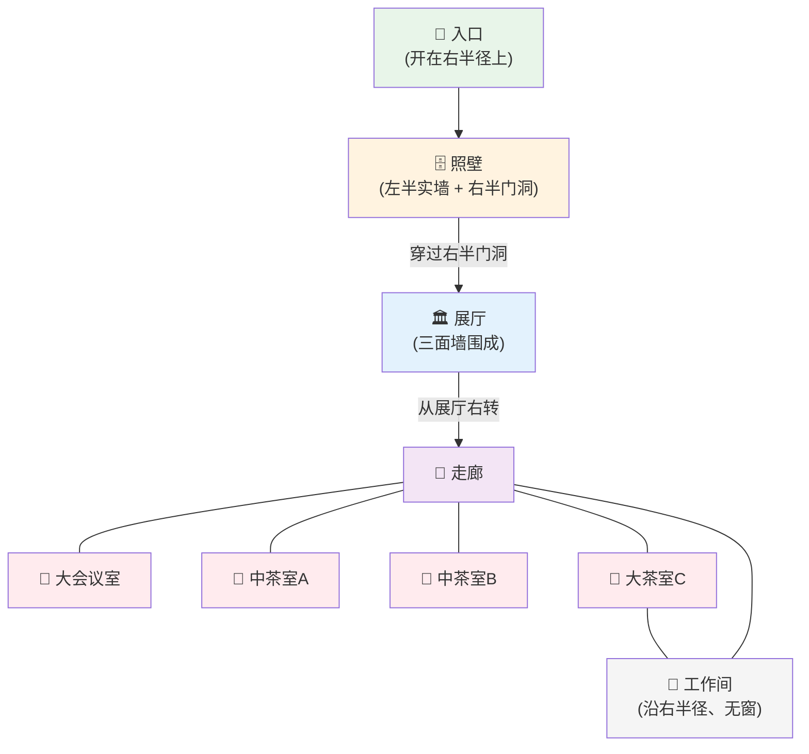

# 盈隆店布局示意

```mermaid
flowchart TD
    ENTRANCE["🚪 入口<br/>(开在右半径上)"]
    WALL["🗄 照壁<br/>(左半实墙 + 右半门洞)"]
    ENTRANCE --> WALL

    WALL -->|穿过右半门洞| HALL["🏛 展厅<br/>(三面墙围成)"]

    CORRIDOR["🚶 走廊"]

    HALL -->|从展厅右转| CORRIDOR

    R1["📐 大会议室"]
    R2["🍵 中茶室A"]
    R3B["🍵 中茶室B"]
    R3C["🍵 大茶室C"]
    WORKSHOP["🔧 工作间<br/>(沿右半径、无窗)"]

    CORRIDOR --- R1
    CORRIDOR --- R2
    CORRIDOR --- R3B
    CORRIDOR --- R3C
    R3C --- WORKSHOP
    CORRIDOR --- WORKSHOP

    style ENTRANCE fill:#e8f5e9
    style WALL fill:#fff3e0
    style HALL fill:#e3f2fd
    style CORRIDOR fill:#f3e5f5
    style R1 fill:#ffebee
    style R2 fill:#ffebee
    style R3B fill:#ffebee
    style R3C fill:#ffebee
    style WORKSHOP fill:#f5f5f5
```

**动线**：入口 → 照壁（左实右虚）→ 右半门洞 → 展厅（三面墙：左半径墙/照壁背面/大会议室外墙）→ 右转 → 走廊 → 各房间

**沿走廊排列**（近→远）：
- 左手边：大会议室 → 中茶室A → 中茶室B（偏左）→ 大茶室C（偏右，邻工作间）
- 右手边：工作间（沿右半径延伸，无窗）
