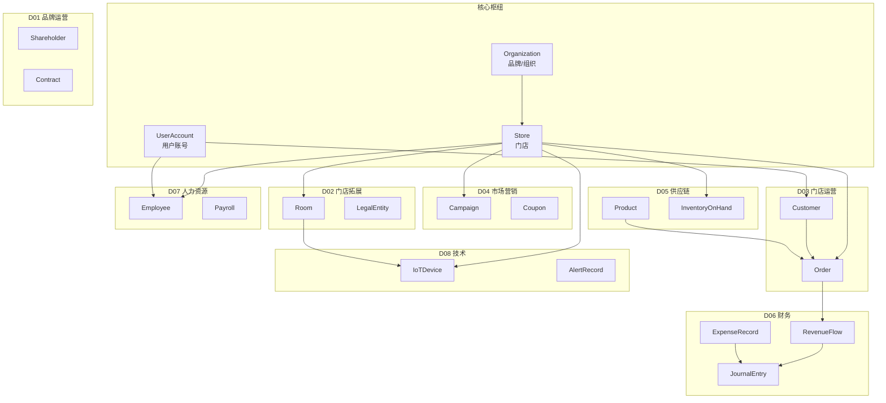
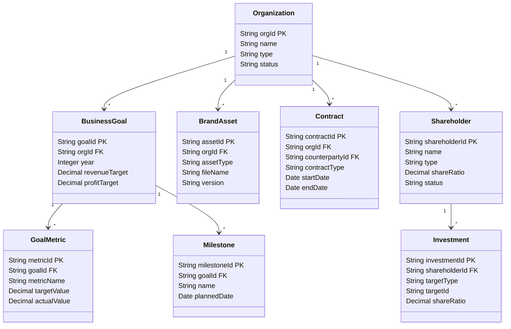
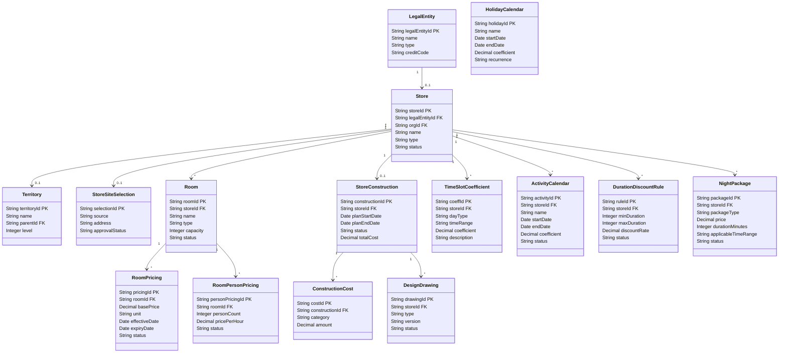
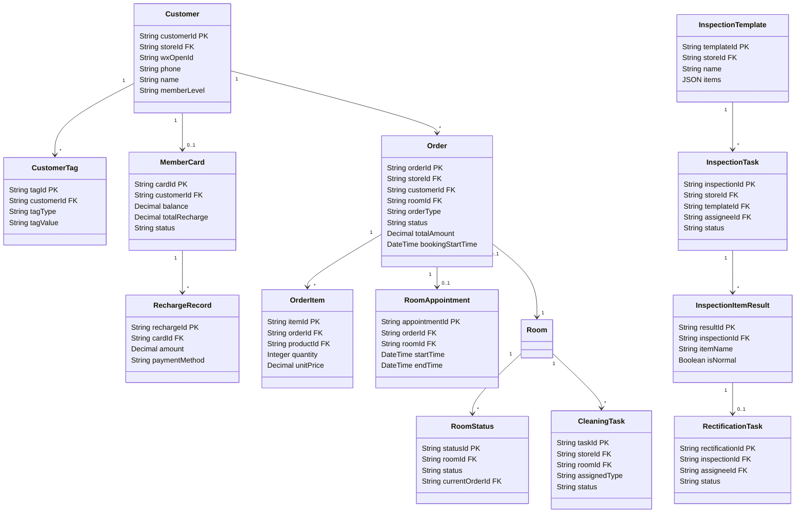
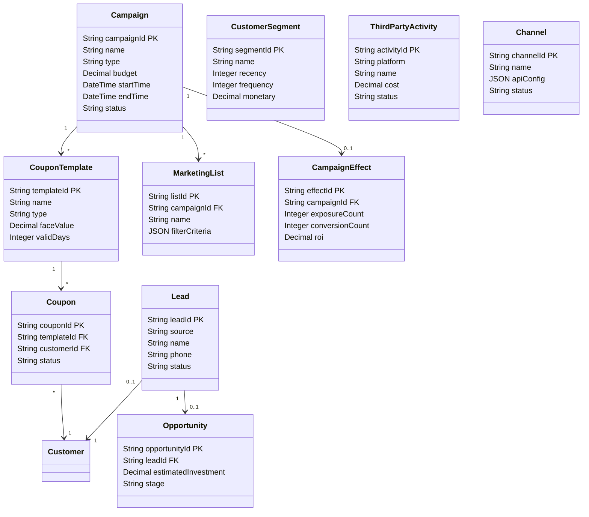
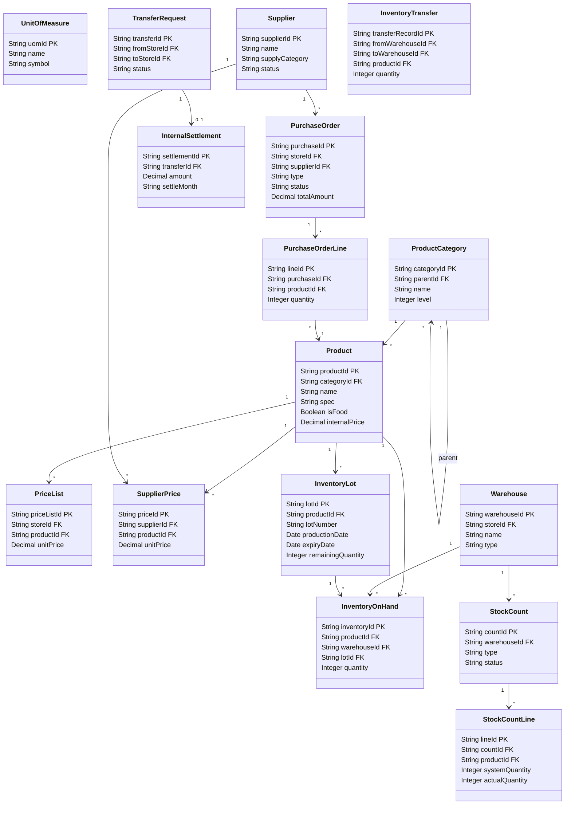
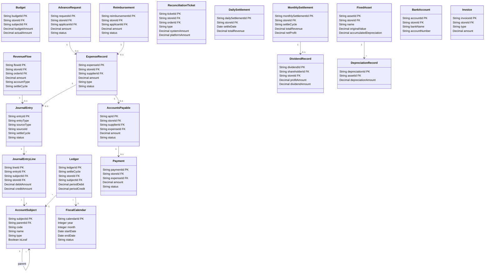
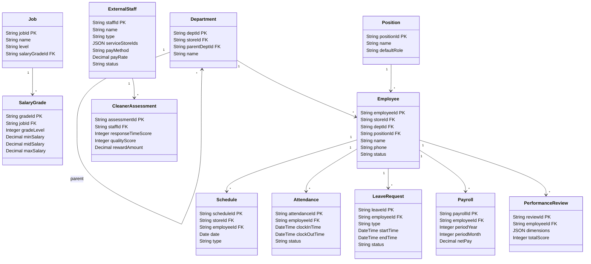
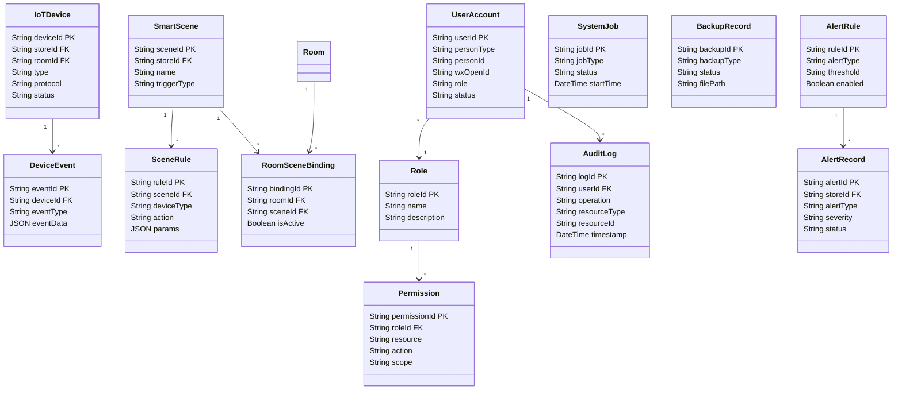

# 高岸ERP系统-对象模型设计

**版本**：V1.1
**日期**：2026年5月10日
**文档状态**：草稿
**编制依据**：
- 《高岸ERP系统-需求说明书（V10.10，2026年5月10日）》全文，特别是第二章业务域划分、第三章功能需求
- 《高岸ERP系统-CDM实体映射说明书（V1.1，2026年5月7日）》
- 《面向对象建模方法论》

---

## 1. 文档目的

本文档定义高岸ERP系统的核心对象模型，覆盖8大业务域的全部核心实体及其属性、关联关系和业务约束。本文档是后续数据库设计（DBA-01）、API接口设计（API-01）和技术架构实现（ARC-01）的权威数据模型参考。

**目标读者**：后端开发工程师、数据库设计师、API设计师、系统架构师。

**与其他文档的关系**：
- 上游输入：REQ-01（需求说明书）定义业务需求，REQ-03（CDM映射说明书）提供标准实体映射参考
- 下游输出：DBA-01（数据库设计）将本模型转化为物理表结构，API-01（接口设计）基于本模型定义资源端点

---

## 2. 前置条件与建模约定

### 2.1 依赖文档

| 依赖文档 | 版本 | 关系说明 |
|---------|------|---------|
| 高岸ERP系统-需求说明书（REQ-01） | V10.8 | 全文引用，实体定义追溯至各功能需求章节 |
| 高岸ERP系统-CDM实体映射说明书（REQ-03） | V1.1 | 每个实体标注CDM映射类型和对应CDM实体 |
| 高岸ERP系统-系统技术架构设计（ARC-01） | V1.0 | 实体模型的技术实现约束 |

### 2.2 建模约定

| 约定项 | 说明 |
|--------|------|
| **实体命名** | 英文PascalCase（如 `RevenueFlow`），中文名称附后 |
| **属性命名** | 英文camelCase（如 `storeId`），中文说明附后 |
| **主键策略** | 交易型实体使用Snowflake算法生成19位长整型；主数据型实体使用短编码（如 `STORE-001`） |
| **CDM映射标注** | 每个实体标注映射类型：精确映射 / 近似映射 / 概念映射，并注明CDM实体名 |
| **关联基数** | 使用 `1:1`、`1:N`、`N:M` 标准UML基数标记 |
| **类图工具** | 使用Mermaid classDiagram绘制域内实体关系图 |
| **属性类型** | String(n) / Integer / Decimal(p,s) / Boolean / Date / DateTime / JSON / Enum |

### 2.3 实体定义表格式

每个实体按以下模板定义：

| 属性名 | 类型 | 必填 | 说明 | 约束 |
|--------|------|------|------|------|
| — | — | — | — | PK / FK→TargetEntity / UQ / INDEX |

关联关系单独列表：

| 关联方向 | 目标实体 | 基数 | 外键 | 说明 |
|---------|---------|------|------|------|

---

## 3. 对象模型总览

### 3.1 域间实体分布

| 业务域 | 实体数量 | 核心实体 |
|--------|---------|---------|
| D01 品牌运营域 | 8 | Organization, Shareholder, Contract, BusinessGoal |
| D02 门店拓展域 | 14 | Store, LegalEntity, Room, RoomPricing, RoomPersonPricing, TimeSlotCoefficient, HolidayCalendar, ActivityCalendar, DurationDiscountRule, NightPackage, StoreConstruction |
| D03 门店运营域 | 13 | Customer, Order, MemberCard, RoomStatus, CleaningTask |
| D04 市场营销域 | 10 | Campaign, CouponTemplate, Coupon, CustomerSegment |
| D05 供应链域 | 16 | Product, PurchaseOrder, Supplier, InventoryOnHand, InventoryLot |
| D06 财务域 | 20 | RevenueFlow, ExpenseRecord, JournalEntry, MonthlySettlement, AccountsPayable |
| D07 人力资源域 | 15 | Employee, ExternalStaff, Attendance, Payroll, Schedule |
| D08 技术域 | 15 | IoTDevice, SmartScene, UserAccount, AlertRecord, AuditLog, CommandQueue, HeartbeatRecord |
| **合计** | **111** | — |

### 3.2 域间关系总览（Hub-and-Spoke）



### 3.3 跨域共享实体

以下实体被多个业务域引用，构成系统的数据骨架：

| 实体 | 所属域 | 被引用域 | 说明 |
|------|--------|---------|------|
| **Organization** | D01 | 全部8域 | 品牌/组织根节点，决定数据所有权 |
| **Store** | D02 | D03/D04/D05/D06/D07/D08 | 门店作为所有交易实体的租户键 |
| **Department** | D07 | D02/D07 | 部门层级结构，员工归属 |
| **Employee** | D07 | D03/D05/D06/D07 | 所有人工操作的执行者 |
| **UserAccount** | D08 | D03/D04/D06/D07 | 统一登录认证账号 |
| **Product** | D05 | D03/D04/D06 | 商品主数据，贯穿零售、营销、财务 |
| **AccountSubject** | D06 | D06（全财务域） | 会计科目体系，所有GL凭证的基础 |

### 3.4 域间依赖链

```
D01 品牌运营 ──→ D02 门店拓展 ──→ D03 门店运营 ──→ D06 财务
                    │                  │                  │
                    │                  ├──→ D04 市场营销   │
                    │                  ├──→ D05 供应链 ────┘
                    │                  ├──→ D07 人力资源 ──┘
                    │                  └──→ D08 技术支撑
                    │
                    └── D01 审批/标准下达至各域
```

依赖规则：
- **D02→D01**：门店拓展需品牌授权和标准输入
- **D03→D02**：门店运营依赖门店基础配置和包间定义
- **D06→D03/D05/D07**：财务月结需汇总门店运营收入、供应链成本和人力成本
- **D04→D03**：营销活动在门店运营中执行和核销
- **D08→D03**：IoT设备和智能场景服务于包间运营

### 3.5 建表顺序建议

基于外键依赖关系，数据库建表应按以下顺序：

1. **基础层**：Organization → LegalEntity → Store → Department → Employee/ExternalStaff → UserAccount/Role/Permission
2. **主数据层**：ProductCategory → Product → Supplier → Warehouse → Room → Customer → AccountSubject → FiscalCalendar
3. **交易层**：Order → OrderItem → RoomAppointment → MemberCard → RechargeRecord → PurchaseOrder → RevenueFlow → ExpenseRecord
4. **财务层**：JournalEntry → JournalEntryLine → Ledger → AccountsPayable → Payment → DailySettlement → MonthlySettlement → DividendRecord
5. **辅助层**：剩余所有实体

---

## 4. D01 品牌运营域

品牌运营域是品牌的决策中枢，负责品牌战略、发展规划、品牌标准建设和投资者关系管理。

### 4.1 域内实体总览



### 4.2 实体定义

#### 4.2.1 Organization — 品牌/组织

| CDM映射 | Organization (applicationCommon) — 近似映射 |
|----------|---------------------------------------------|
| 所属域 | D01 |
| 主键策略 | Snowflake (19位) |

**属性定义**：

| 属性名 | 类型 | 必填 | 说明 | 约束 |
|--------|------|------|------|------|
| orgId | String(32) | 是 | 组织唯一标识 | PK |
| parentOrgId | String(32) | 否 | 父级组织 | FK→Organization |
| name | String(100) | 是 | 品牌/组织全称 | UQ |
| shortName | String(50) | 否 | 品牌简称 | — |
| type | Enum | 是 | HQ(总部)/Franchisee(加盟商) | — |
| creditCode | String(18) | 否 | 统一社会信用代码 | — |
| legalRep | String(50) | 否 | 法定代表人 | — |
| registeredAddress | String(200) | 否 | 注册地址 | — |
| contactPhone | String(20) | 否 | 联系电话 | — |
| logo | String(500) | 否 | 品牌Logo URL | — |
| status | Enum | 是 | Active/Inactive | — |
| establishedDate | Date | 否 | 成立日期 | — |
| createdAt | DateTime | 是 | 创建时间 | — |
| updatedAt | DateTime | 是 | 更新时间 | — |

**关联关系**：

| 关联方向 | 目标实体 | 基数 | 外键 | 说明 |
|---------|---------|------|------|------|
| 自关联 | Organization | N:1 | parentOrgId | 树形层级（总部→区域→加盟商） |

**业务约束**：
- 总部（type=HQ）有且仅有一条记录
- 加盟商必须关联一个总部组织作为父节点

---

#### 4.2.2 BusinessGoal — 经营目标

| CDM映射 | Goal (applicationCommon) — 近似映射 |
|----------|-------------------------------------|
| 所属域 | D01 |
| 主键策略 | Snowflake |

**属性定义**：

| 属性名 | 类型 | 必填 | 说明 | 约束 |
|--------|------|------|------|------|
| goalId | String(32) | 是 | 目标唯一标识 | PK |
| orgId | String(32) | 是 | 所属组织 | FK→Organization |
| year | Integer | 是 | 目标年度 | — |
| quarter | Integer | 否 | 目标季度（1-4） | 年度目标为空 |
| revenueTarget | Decimal(15,2) | 否 | 营收目标（元） | — |
| profitTarget | Decimal(15,2) | 否 | 利润目标（元） | — |
| storeCountTarget | Integer | 否 | 门店数量目标 | — |
| memberGrowthTarget | Integer | 否 | 会员增长目标 | — |
| status | Enum | 是 | Draft/Active/Closed | — |
| createdAt | DateTime | 是 | 创建时间 | — |

**业务约束**：
- 年度目标的quarter为空；季度目标的year+quarter组合同组织下唯一
- 目标关闭后不可再编辑

---

#### 4.2.3 GoalMetric — 目标指标

| CDM映射 | GoalMetric (applicationCommon) — 近似映射 |
|----------|-------------------------------------------|

| 属性名 | 类型 | 必填 | 说明 | 约束 |
|--------|------|------|------|------|
| metricId | String(32) | 是 | 指标唯一标识 | PK |
| goalId | String(32) | 是 | 所属目标 | FK→BusinessGoal |
| metricName | String(50) | 是 | 指标名称 | — |
| targetValue | Decimal(15,2) | 是 | 目标值 | — |
| actualValue | Decimal(15,2) | 否 | 实际完成值 | 系统汇总 |
| unit | String(20) | 是 | 单位（元/家/人/%） | — |
| updatedAt | DateTime | 是 | 最后更新时间 | — |

---

#### 4.2.4 BrandAsset — 品牌资产

| CDM映射 | Document (applicationCommon) — 概念映射 |
|----------|------------------------------------------|

| 属性名 | 类型 | 必填 | 说明 | 约束 |
|--------|------|------|------|------|
| assetId | String(32) | 是 | 资产唯一标识 | PK |
| orgId | String(32) | 是 | 所属组织 | FK→Organization |
| assetType | Enum | 是 | Logo/VI/Manual/Template/PromotionMaterial | — |
| name | String(100) | 是 | 资产名称 | — |
| fileName | String(200) | 是 | 文件存储路径 | — |
| fileSize | Integer | 否 | 文件大小（字节） | — |
| version | String(20) | 是 | 版本号 | — |
| tags | JSON | 否 | 分类标签 | — |
| status | Enum | 是 | Active/Archived | — |
| uploadedBy | String(32) | 是 | 上传人 | FK→Employee |
| uploadedAt | DateTime | 是 | 上传时间 | — |

---

#### 4.2.5 Contract — 加盟/设计/管理合同

| CDM映射 | Contract (applicationCommon) — 近似映射 |
|----------|------------------------------------------|

| 属性名 | 类型 | 必填 | 说明 | 约束 |
|--------|------|------|------|------|
| contractId | String(32) | 是 | 合同唯一标识 | PK |
| contractNumber | String(50) | 是 | 人工合同编号 | UQ |
| orgId | String(32) | 是 | 品牌方（总部） | FK→Organization |
| counterpartyId | String(32) | 是 | 对方主体 | FK→Organization |
| storeId | String(32) | 否 | 关联门店 | FK→Store |
| contractType | Enum | 是 | Franchise(加盟)/Design(设计)/Management(管理) | — |
| startDate | Date | 是 | 合同开始日期 | — |
| endDate | Date | 是 | 合同到期日期 | — |
| amount | Decimal(15,2) | 是 | 合同金额（元） | — |
| paymentTerms | String(500) | 否 | 支付条款 | — |
| attachmentUrls | JSON | 否 | 附件URL列表 | — |
| status | Enum | 是 | Draft/Active/Expired/Terminated | — |
| signedAt | Date | 否 | 签约日期 | — |

**业务约束**：
- 合同到期前30天自动提醒续约
- 合同终止后关联加盟商门店权限自动调整

---

#### 4.2.6 Shareholder — 股东

| CDM映射 | Account扩展 — 概念映射 |
|----------|-------------------------|

| 属性名 | 类型 | 必填 | 说明 | 约束 |
|--------|------|------|------|------|
| shareholderId | String(32) | 是 | 股东唯一标识 | PK |
| shareholderNumber | String(20) | 是 | 股东编号（系统生成） | UQ |
| name | String(100) | 是 | 股东姓名/名称 | — |
| type | Enum | 是 | Brand(品牌股东)/Store(门店股东) | — |
| idType | Enum | 是 | IDCard/CreditCode | — |
| idNumber | String(50) | 是 | 证件号码 | 加密存储 |
| phone | String(20) | 否 | 联系电话 | — |
| address | String(200) | 否 | 通讯地址 | — |
| bankName | String(100) | 否 | 开户行 | — |
| bankAccountName | String(100) | 否 | 银行户名 | — |
| bankAccountNumber | String(50) | 否 | 银行账号 | 加密存储 |
| totalDividend | Decimal(15,2) | 否 | 累计分红金额 | 系统汇总 |
| status | Enum | 是 | Active/Frozen/Exited | — |
| exitDate | Date | 否 | 退出日期 | — |
| exitReason | String(500) | 否 | 退出原因 | — |
| createdAt | DateTime | 是 | 录入时间 | — |
| updatedAt | DateTime | 是 | 更新时间 | — |

**业务约束**：
- 同一持股对象股东持股比例之和 ≤ 100%
- 股东退出后不再参与后续分红，历史记录保留
- 股东信息变更必须留痕（变更前后对比、操作人、时间）
- 仅财务和总部运营角色可查看和编辑

---

#### 4.2.7 Investment — 投资关系

| CDM映射 | 自定义 — 概念映射 |
|----------|--------------------|

| 属性名 | 类型 | 必填 | 说明 | 约束 |
|--------|------|------|------|------|
| investmentId | String(32) | 是 | 投资关系唯一标识 | PK |
| shareholderId | String(32) | 是 | 股东 | FK→Shareholder |
| targetType | Enum | 是 | Brand(品牌)/Store(门店) | — |
| targetId | String(32) | 是 | 持股对象ID | 关联Organization或Store |
| shareRatio | Decimal(5,4) | 是 | 持股比例 | 0.0001~1.0000 |
| investmentAmount | Decimal(15,2) | 是 | 出资额（元） | — |
| investmentDate | Date | 是 | 出资日期 | — |
| exitDate | Date | 否 | 退出日期 | — |
| status | Enum | 是 | Active/Exited | — |
| changeLogs | JSON | 否 | 持股比例变更历史 | — |

**业务约束**：
- 同一targetId下所有Active状态投资的shareRatio之和 ≤ 100%，新增或变更时系统自动校验

---

#### 4.2.8 Milestone — 里程碑

| CDM映射 | 自定义 — 概念映射 |
|----------|--------------------|

| 属性名 | 类型 | 必填 | 说明 | 约束 |
|--------|------|------|------|------|
| milestoneId | String(32) | 是 | 里程碑唯一标识 | PK |
| goalId | String(32) | 是 | 所属目标 | FK→BusinessGoal |
| name | String(100) | 是 | 里程碑名称 | — |
| description | String(500) | 否 | 详细描述 | — |
| plannedDate | Date | 是 | 计划完成日期 | — |
| actualDate | Date | 否 | 实际完成日期 | — |
| status | Enum | 是 | Planned/InProgress/Completed/Delayed | — |
| sortOrder | Integer | 否 | 排序号 | — |

---

## 5. D02 门店拓展域

门店拓展域负责从选址到建店的全过程管理，包括门店选址、建设施工、设计图纸管理、门店创建与包间配置。

### 5.1 域内实体总览



### 5.2 实体定义

#### 5.2.1 LegalEntity — 公司/法律主体

| CDM映射 | Account (applicationCommon) — 概念映射 |
|----------|-----------------------------------------|
| 所属域 | D02 |
| 主键策略 | Snowflake |

| 属性名 | 类型 | 必填 | 说明 | 约束 |
|--------|------|------|------|------|
| legalEntityId | String(32) | 是 | 法律主体唯一标识 | PK |
| name | String(200) | 是 | 公司全称 | — |
| type | Enum | 是 | Limited(有限责任公司)/SoleProprietor(个体工商户) | — |
| creditCode | String(18) | 否 | 统一社会信用代码 | UQ |
| legalRep | String(50) | 是 | 法定代表人 | — |
| registeredCapital | Decimal(15,2) | 否 | 注册资本 | — |
| registeredAddress | String(200) | 否 | 注册地址 | — |
| businessScope | String(500) | 否 | 经营范围 | — |
| establishedDate | Date | 否 | 成立日期 | — |
| status | Enum | 是 | Active/Inactive | — |

**业务约束**：
- 统一社会信用代码全局唯一
- 每家门店最多对应一个LegalEntity

---

#### 5.2.2 Store — 门店

| CDM映射 | BusinessUnit (applicationCommon) — 近似映射 |
|----------|----------------------------------------------|

| 属性名 | 类型 | 必填 | 说明 | 约束 |
|--------|------|------|------|------|
| storeId | String(32) | 是 | 门店唯一标识 | PK |
| storeCode | String(20) | 是 | 门店编码 | UQ |
| legalEntityId | String(32) | 否 | 关联法律主体 | FK→LegalEntity |
| orgId | String(32) | 是 | 所属品牌 | FK→Organization |
| territoryId | String(32) | 否 | 所属区域 | FK→Territory |
| name | String(100) | 是 | 门店名称 | — |
| type | Enum | 是 | Direct(直营)/Franchise(加盟) | — |
| address | String(200) | 是 | 门店地址 | — |
| lat | Decimal(10,7) | 否 | 纬度 | — |
| lng | Decimal(10,7) | 否 | 经度 | — |
| phone | String(20) | 否 | 联系电话 | — |
| businessHours | JSON | 否 | 营业时间 | {"open":"09:00","close":"23:00"} |
| area | Decimal(10,2) | 否 | 营业面积（㎡） | — |
| wxMerchantId | String(50) | 否 | 微信商户号 | — |
| mtShopId | String(50) | 否 | 美团店铺ID | — |
| dyShopId | String(50) | 否 | 抖音店铺ID | — |
| status | Enum | 是 | Operating/Suspended/Renovating/Closed | — |
| openDate | Date | 否 | 开业日期 | — |
| closeDate | Date | 否 | 关闭日期 | — |
| cleaningTimeout | Integer | 否 | 保洁超时阈值（分钟） | 默认30 |
| createdAt | DateTime | 是 | 创建时间 | — |

**关联关系**：

| 关联方向 | 目标实体 | 基数 | 外键 | 说明 |
|---------|---------|------|------|------|
| 多对一 | Organization | N:1 | orgId | 所属品牌 |
| 多对一 | LegalEntity | N:1 | legalEntityId | 法律主体 |
| 多对一 | Territory | N:1 | territoryId | 所属区域 |
| 一对多 | Room | 1:N | — | 门店包间 |
| 一对多 | Department | 1:N | — | 门店部门 |
| 一对多 | BankAccount | 1:N | — | 门店银行账户 |

**业务约束**：
- storeCode全局唯一
- 门店状态变更（营业→装修→关闭）需审批
- Store是系统的租户隔离键：所有门店级数据必须含storeId

---

#### 5.2.3 Territory — 销售区域

| CDM映射 | Territory (applicationCommon) — 近似映射 |
|----------|------------------------------------------|

| 属性名 | 类型 | 必填 | 说明 | 约束 |
|--------|------|------|------|------|
| territoryId | String(32) | 是 | 区域唯一标识 | PK |
| parentId | String(32) | 否 | 父级区域 | FK→Territory |
| name | String(100) | 是 | 区域名称 | — |
| level | Integer | 是 | 层级（1省/2市/3区） | — |
| status | Enum | 是 | Active/Inactive | — |

---

#### 5.2.4 StoreSiteSelection — 门店选址

| CDM映射 | 自定义 — 概念映射 |
|----------|--------------------|

| 属性名 | 类型 | 必填 | 说明 | 约束 |
|--------|------|------|------|------|
| selectionId | String(32) | 是 | 选址唯一标识 | PK |
| source | Enum | 是 | Manager(店长推荐)/Franchisee(加盟商提供)/HQ(总部物色) | — |
| region | String(100) | 是 | 目标区域 | — |
| address | String(200) | 是 | 详细地址 | — |
| area | Decimal(10,2) | 否 | 物业面积（㎡） | — |
| rent | Decimal(15,2) | 否 | 月租金（元） | — |
| environmentAssessment | String(1000) | 否 | 周边环境评估 | — |
| recommendationReason | String(500) | 否 | 推荐理由 | — |
| investorFeedback | String(1000) | 否 | 投资者评估意见 | — |
| investorConfirmed | Boolean | 否 | 投资者是否确认意向 | — |
| investorAmount | Decimal(15,2) | 否 | 投资者确认投资金额 | — |
| approvalStatus | Enum | 是 | Pending/UnderReview/Approved/Rejected | — |
| approvalFlowId | String(32) | 否 | 审批流ID | — |
| resultStoreId | String(32) | 否 | 审批通过后创建的门店 | FK→Store |
| submittedBy | String(32) | 是 | 提报人 | FK→Employee |
| createdAt | DateTime | 是 | 创建时间 | — |

---

#### 5.2.5 StoreConstruction — 门店建设

| CDM映射 | 自定义 — 概念映射 |
|----------|--------------------|

| 属性名 | 类型 | 必填 | 说明 | 约束 |
|--------|------|------|------|------|
| constructionId | String(32) | 是 | 建设单唯一标识 | PK |
| storeId | String(32) | 是 | 目标门店 | FK→Store |
| planStartDate | Date | 是 | 计划开工日期 | — |
| planEndDate | Date | 是 | 计划完工日期 | — |
| actualStartDate | Date | 否 | 实际开工日期 | — |
| actualEndDate | Date | 否 | 实际完工日期 | — |
| totalCost | Decimal(15,2) | 否 | 建设总成本（自动汇总） | — |
| status | Enum | 是 | Planned/InProgress/Completed/Sealed | — |
| sealedAt | DateTime | 否 | 封账时间 | — |
| sealedBy | String(32) | 否 | 封账操作人 | FK→Employee |

**业务约束**：
- 封账后不可再修改任何建设数据
- 封账后totalCost归集至D06 FixedAsset
- 超期（超过planEndDate）自动预警

---

#### 5.2.6 ConstructionCost — 建设费用

| CDM映射 | 自定义 — 概念映射 |
|----------|--------------------|

| 属性名 | 类型 | 必填 | 说明 | 约束 |
|--------|------|------|------|------|
| costId | String(32) | 是 | 费用唯一标识 | PK |
| constructionId | String(32) | 是 | 所属建设单 | FK→StoreConstruction |
| category | Enum | 是 | Decoration/Equipment/Material/Labor/Other | — |
| description | String(200) | 是 | 费用说明 | — |
| amount | Decimal(15,2) | 是 | 金额（元） | — |
| supplierId | String(32) | 否 | 供应商 | FK→Supplier |
| voucherUrl | String(500) | 否 | 凭证/发票URL | — |
| incurredDate | Date | 是 | 费用发生日期 | — |

---

#### 5.2.7 DesignDrawing — 设计图/施工图

| CDM映射 | Document (applicationCommon) — 概念映射 |
|----------|------------------------------------------|

| 属性名 | 类型 | 必填 | 说明 | 约束 |
|--------|------|------|------|------|
| drawingId | String(32) | 是 | 图纸唯一标识 | PK |
| storeId | String(32) | 是 | 关联门店 | FK→Store |
| constructionId | String(32) | 否 | 关联建设项目 | FK→StoreConstruction |
| type | Enum | 是 | Space/MEP/Fire/HVAC/Completion | — |
| name | String(200) | 是 | 图纸名称 | — |
| fileName | String(200) | 是 | 文件存储路径 | — |
| fileFormat | String(10) | 是 | DWG/PDF/PNG | — |
| version | String(20) | 是 | 版本号 | — |
| status | Enum | 是 | Draft/Approved/Construction/Archived | — |
| uploadedBy | String(32) | 是 | 上传人 | FK→Employee |
| approvedBy | String(32) | 否 | 审批人 | FK→Employee |

**业务约束**：
- 状态变更为Construction前必须通过审批
- 版本历史通过version追溯

---

#### 5.2.8 Room — 包间

| CDM映射 | Service (applicationCommon) — 近似映射 |
|----------|-----------------------------------------|
| 所属域 | D02（基础定义在D02，运营使用在D03） |

| 属性名 | 类型 | 必填 | 说明 | 约束 |
|--------|------|------|------|------|
| roomId | String(32) | 是 | 包间唯一标识 | PK |
| roomCode | String(20) | 是 | 包间编码 | UQ(storeId+roomCode) |
| storeId | String(32) | 是 | 所属门店 | FK→Store |
| name | String(100) | 是 | 包间名称 | — |
| type | Enum | 是 | TeaRoom/MeetingRoom/Entertainment/Exhibition/Workspace | Exhibition和Workspace为不可预订型，不参与预约流程和保洁任务生成，但支持设备远程控制 |
| floor | String(20) | 否 | 楼层 | — |
| capacity | Integer | 是 | 容纳人数 | — |
| area | Decimal(8,2) | 否 | 面积（㎡） | — |
| facilities | JSON | 否 | 设施列表 | ["projector","teaTable","karaoke"] |
| photos | JSON | 否 | 照片URL列表 | — |
| description | String(500) | 否 | 包间描述 | — |
| sortOrder | Integer | 否 | 展示排序 | — |
| status | Enum | 是 | Active/Inactive/Maintenance | — |
| createdAt | DateTime | 是 | 创建时间 | — |

**关联关系**：

| 关联方向 | 目标实体 | 基数 | 外键 | 说明 |
|---------|---------|------|------|------|
| 多对一 | Store | N:1 | storeId | 所属门店 |
| 一对多 | RoomPricing | 1:N | — | 包间基准价 |
| 一对多 | RoomPersonPricing | 1:N | — | 人数差异化定价 |
| 一对多 | IoTDevice | 1:N | — | 包间内设备 |

**业务约束**：
- 同一门店内roomCode唯一
- 包间停用/维修前必须确保无进行中订单

---

#### 5.2.9 RoomPricing — 包间基准价

| CDM映射 | PriceList (foundationCommon) — 近似映射 |
|----------|------------------------------------------|
| 所属域 | D02 |
| 主键策略 | Snowflake |

**属性定义**：

| 属性名 | 类型 | 必填 | 说明 | 约束 |
|--------|------|------|------|------|
| pricingId | String(32) | 是 | 定价唯一标识 | PK |
| roomId | String(32) | 是 | 包间 | FK→Room |
| basePrice | Decimal(10,2) | 是 | 平日基准价（元/小时） | — |
| unit | Enum | 是 | PerHour(按小时)/PerSession(按场次) | — |
| effectiveDate | Date | 是 | 生效日期 | — |
| expiryDate | Date | 否 | 失效日期 | 空=长期有效 |
| status | Enum | 是 | Active/Inactive | — |

**业务约束**：
- 同一包间仅允许一条Active基准价记录
- 价格变更创建新记录，旧记录标记Inactive
- 基准价为小时单价，实际预约价格 = 基准价 × 时段系数 × 活动系数 × 会员折扣 × 长时折扣（详见需求说明书 §3.2 动态价格体系）

---

#### 5.2.10 RoomPersonPricing — 包间人数差异化定价

| CDM映射 | 自定义 — 概念映射 |
|----------|--------------------|
| 所属域 | D02 |
| 主键策略 | Snowflake |

**属性定义**：

| 属性名 | 类型 | 必填 | 说明 | 约束 |
|--------|------|------|------|------|
| personPricingId | String(32) | 是 | 定价唯一标识 | PK |
| roomId | String(32) | 是 | 包间 | FK→Room |
| personCount | Integer | 是 | 人数 | — |
| pricePerHour | Decimal(10,2) | 是 | 该人数单价（元/小时） | — |
| status | Enum | 是 | Active/Inactive | — |

**业务约束**：
- 同一包间同一人数仅允许一条Active定价记录
- 人数-价格对照表由门店独立配置，调整需店长审批
- 示例：大茶室C → 2人¥98/h、3人¥118/h、4人¥138/h、5人¥158/h、6人¥178/h

---

#### 5.2.11 TimeSlotCoefficient — 时段系数

| CDM映射 | 自定义 — 概念映射 |
|----------|--------------------|
| 所属域 | D02 |
| 主键策略 | Snowflake |

**属性定义**：

| 属性名 | 类型 | 必填 | 说明 | 约束 |
|--------|------|------|------|------|
| coeffId | String(32) | 是 | 系数唯一标识 | PK |
| storeId | String(32) | 是 | 适用门店 | FK→Store |
| dayType | Enum | 是 | Weekday(工作日)/Weekend(周末)/Holiday(法定节假日) | — |
| timeRange | JSON | 是 | 适用时间段 | {"start":"10:00","end":"18:00"} |
| coefficient | Decimal(4,2) | 是 | 价格系数 | — |
| description | String(200) | 否 | 说明（如"工作日白天闲时折扣"） | — |

**业务约束**：
- 同一门店同一dayType+timeRange仅一条活跃记录
- 默认系数：工作日白天1.0、工作日夜间(18:00后)1.2、周末1.3、法定节假日1.5
- 闲时折扣（工作日白天10:00-16:00，系数0.8）通过此实体配置

---

#### 5.2.12 HolidayCalendar — 节日/活动日历

| CDM映射 | 自定义 — 概念映射 |
|----------|--------------------|
| 所属域 | D02（全局节假日定义，各门店引用） |
| 主键策略 | Snowflake |

**属性定义**：

| 属性名 | 类型 | 必填 | 说明 | 约束 |
|--------|------|------|------|------|
| holidayId | String(32) | 是 | 节日唯一标识 | PK |
| name | String(100) | 是 | 节日/活动名称 | — |
| startDate | Date | 是 | 开始日期 | — |
| endDate | Date | 是 | 结束日期 | — |
| coefficient | Decimal(4,2) | 是 | 溢价系数 | — |
| recurrence | Enum | 否 | None(不重复)/Yearly(每年) | 空=不重复 |
| status | Enum | 是 | Active/Inactive | — |

**预置节日**：
| 节日 | 日期 | 系数 |
|------|------|------|
| 广交会春 | 4月15日-5月5日 | 1.5-2.0 |
| 广交会秋 | 10月15日-11月4日 | 1.5-2.0 |
| 情人节 | 2月14日 | 1.5 |
| 圣诞节 | 12月24日-25日 | 1.3 |
| 元旦 | 12月31日-1月1日 | 1.4 |
| 春节 | 农历除夕-初六 | 1.5 |
| 中秋/国庆 | 10月1日-7日 | 1.5 |

**业务约束**：
- 多个重叠节日的溢价取最高系数，不叠加
- 节日溢价期间不执行闲时折扣（活动系数优先于闲时折扣）
- 活动日历由总部运营统一维护，至少提前7天发布

---

#### 5.2.13 ActivityCalendar — 自定义活动日历

| CDM映射 | 自定义 — 概念映射 |
|----------|--------------------|
| 所属域 | D02（门店级活动配置） |
| 主键策略 | Snowflake |

**属性定义**：

| 属性名 | 类型 | 必填 | 说明 | 约束 |
|--------|------|------|------|------|
| activityId | String(32) | 是 | 活动唯一标识 | PK |
| storeId | String(32) | 是 | 适用门店 | FK→Store |
| name | String(100) | 是 | 活动名称 | — |
| startDate | Date | 是 | 开始日期 | — |
| endDate | Date | 是 | 结束日期 | — |
| coefficient | Decimal(4,2) | 是 | 活动溢价系数 | >1.0为溢价，<1.0为折扣 |
| status | Enum | 是 | Draft/Active/Expired | — |

**业务约束**：
- 活动溢价期间不执行闲时折扣
- 若活动与节日重叠，取最高系数
- 活动系数调整需总部审批

---

#### 5.2.14 DurationDiscountRule — 长时折扣规则

| CDM映射 | 自定义 — 概念映射 |
|----------|--------------------|
| 所属域 | D02 |
| 主键策略 | Snowflake |

**属性定义**：

| 属性名 | 类型 | 必填 | 说明 | 约束 |
|--------|------|------|------|------|
| ruleId | String(32) | 是 | 规则唯一标识 | PK |
| storeId | String(32) | 是 | 适用门店 | FK→Store |
| minDuration | Integer | 是 | 最短时长（分钟） | — |
| maxDuration | Integer | 否 | 最长时长（分钟） | 空=无上限 |
| discountRate | Decimal(4,2) | 是 | 折扣率 | 0.85=85折 |
| status | Enum | 是 | Active/Inactive | — |

**预置规则**：
- 满3小时(180分钟)：折扣率0.9（9折）
- 满5小时(300分钟)：折扣率0.85（85折）

**业务约束**：
- 同一门店多条规则按minDuration升序匹配，取最大折扣
- 长时折扣与会员折扣可叠加
- 夜间/通宵套餐不适用长时折扣

---

#### 5.2.15 NightPackage — 夜间/通宵套餐

| CDM映射 | 自定义 — 概念映射 |
|----------|--------------------|
| 所属域 | D02 |
| 主键策略 | Snowflake |

**属性定义**：

| 属性名 | 类型 | 必填 | 说明 | 约束 |
|--------|------|------|------|------|
| packageId | String(32) | 是 | 套餐唯一标识 | PK |
| storeId | String(32) | 是 | 适用门店 | FK→Store |
| packageType | Enum | 是 | Night(夜间)/Overnight(通宵) | — |
| price | Decimal(10,2) | 是 | 固定价格（元） | — |
| durationMinutes | Integer | 是 | 时长（分钟） | Night=180, Overnight=480 |
| applicableTimeRange | JSON | 是 | 可用时段 | {"start":"23:59","end":"08:00"} |
| status | Enum | 是 | Active/Inactive | — |

**业务规则**：
- 夜间/通宵套餐为固定价格，不适用时段系数、人数差异化定价、长时折扣及会员折扣
- Night(夜间)：任意连续3小时，¥278/3小时
- Overnight(通宵)：全时段23:59-08:00，¥418/整夜

## 6. D03 门店运营域

门店运营域是系统的核心业务域，处理客人从预约到离店的全流程，包括空间租用、商品零售、房态管理、保洁任务和门店巡检。

### 6.1 域内实体总览



### 6.2 实体定义

#### 6.2.1 Customer — 客人/客户

| CDM映射 | Account (applicationCommon) — 精确映射 |
|----------|-----------------------------------------|
| 所属域 | D03 |
| 主键策略 | Snowflake |

| 属性名 | 类型 | 必填 | 说明 | 约束 |
|--------|------|------|------|------|
| customerId | String(32) | 是 | 客户唯一标识 | PK |
| wxOpenId | String(100) | 是 | 微信OpenID | UQ |
| wxUnionId | String(100) | 否 | 微信UnionID | — |
| phone | String(20) | 否 | 手机号 | 加密存储 |
| name | String(50) | 否 | 姓名 | — |
| nickname | String(100) | 否 | 微信昵称 | — |
| avatar | String(500) | 否 | 头像URL | — |
| gender | Enum | 否 | Male/Female/Unknown | — |
| birthday | Date | 否 | 生日 | — |
| memberLevel | Enum | 否 | Normal/Silver/Gold/Platinum | 默认Normal |
| registerStoreId | String(32) | 否 | 注册门店 | FK→Store |
| registerTime | DateTime | 是 | 注册时间 | — |
| tags | JSON | 否 | 客户标签集合 | 系统自动+人工维护 |
| status | Enum | 是 | Active/Inactive | — |

**关联关系**：

| 关联方向 | 目标实体 | 基数 | 外键 | 说明 |
|---------|---------|------|------|------|
| 多对一 | Store | N:1 | registerStoreId | 注册门店 |
| 一对零或一 | MemberCard | 1:0..1 | — | 会员卡 |
| 一对多 | Order | 1:N | — | 历史订单 |
| 一对多 | Coupon | 1:N | — | 持有的优惠券 |
| 一对一 | UserAccount | 1:1 | — | 关联登录账号 |

**业务约束**：
- wxOpenId全局唯一，作为客人唯一标识
- 首次登录自动创建Customer记录并完成会员注册

---

#### 6.2.2 CustomerTag — 客户标签

| CDM映射 | Account扩展 — 概念映射 |
|----------|-------------------------|

| 属性名 | 类型 | 必填 | 说明 | 约束 |
|--------|------|------|------|------|
| tagId | String(32) | 是 | 标签唯一标识 | PK |
| customerId | String(32) | 是 | 客户 | FK→Customer |
| tagType | String(50) | 是 | 标签类型 | 如"消费偏好""活跃时段""价格敏感度" |
| tagValue | String(100) | 是 | 标签值 | 如"高复购倾向""夜间活跃" |
| source | Enum | 是 | Auto(系统自动)/Manual(人工修正) | — |
| createdAt | DateTime | 是 | 打标时间 | — |

**业务约束**：
- 系统根据消费/核销行为自动更新标签
- 同类型标签自动更新（新值覆盖旧值）

---

#### 6.2.3 MemberCard — 会员卡

| CDM映射 | 自定义 — 概念映射 |
|----------|--------------------|

| 属性名 | 类型 | 必填 | 说明 | 约束 |
|--------|------|------|------|------|
| cardId | String(32) | 是 | 会员卡唯一标识 | PK |
| cardNumber | String(20) | 是 | 会员卡号 | UQ |
| customerId | String(32) | 是 | 持卡客户 | FK→Customer |
| balance | Decimal(12,2) | 是 | 本金余额（元） | ≥0 |
| bonusBalance | Decimal(12,2) | 否 | 赠金余额（元） | ≥0 |
| totalRecharge | Decimal(15,2) | 是 | 累计充值金额 | 系统汇总 |
| totalConsume | Decimal(15,2) | 是 | 累计消费金额 | 系统汇总 |
| status | Enum | 是 | Active/Frozen/Closed | — |
| createdAt | DateTime | 是 | 开卡时间 | — |

**业务约束**：
- 充值金额属于债务性收入，消费发生时确认收入
- 消费扣减优先级：赠金 > 本金
- 余额不可为负

---

#### 6.2.4 RechargeRecord — 充值记录

| CDM映射 | Payment (approximate) |
|----------|------------------------|

| 属性名 | 类型 | 必填 | 说明 | 约束 |
|--------|------|------|------|------|
| rechargeId | String(32) | 是 | 充值唯一标识 | PK |
| cardId | String(32) | 是 | 会员卡 | FK→MemberCard |
| amount | Decimal(12,2) | 是 | 充值金额（元） | >0 |
| bonusAmount | Decimal(12,2) | 否 | 赠送金额（元） | ≥0 |
| paymentMethod | Enum | 是 | WxPay/AliPay/BankTransfer | — |
| transactionId | String(64) | 否 | 第三方支付交易号 | — |
| isRevenue | Boolean | 是 | 是否已转为收入 | 默认false |
| storeId | String(32) | 是 | 充值门店 | FK→Store |
| createdAt | DateTime | 是 | 充值时间 | — |

**业务约束**：
- 充值时isRevenue=false，消费扣减时对应金额isRevenue转为true
- 充值记录的amount+bonusAmount计入MemberCard.balance

---

#### 6.2.5 Order — 订单

| CDM映射 | Order (foundationCommon) — 精确映射 |
|----------|--------------------------------------|

| 属性名 | 类型 | 必填 | 说明 | 约束 |
|--------|------|------|------|------|
| orderId | String(32) | 是 | 订单唯一标识 | PK |
| orderNumber | String(30) | 是 | 订单编号（系统生成） | UQ |
| storeId | String(32) | 是 | 所属门店 | FK→Store |
| customerId | String(32) | 是 | 下单客户 | FK→Customer |
| roomId | String(32) | 否 | 关联包间（空间租用订单必填） | FK→Room |
| orderType | Enum | 是 | Room(空间租用)/Retail(零售)/Mixed(混合) | — |
| status | Enum | 是 | PendingPay(待支付)/PendingUse(待使用)/InUse(使用中)/Completed(已完成)/Cancelled(已取消)/Refunded(已退款) | — |
| totalAmount | Decimal(12,2) | 是 | 订单总金额（元） | — |
| discountAmount | Decimal(12,2) | 否 | 优惠金额 | 默认0 |
| paidAmount | Decimal(12,2) | 否 | 实付金额 | — |
| paymentMethod | Enum | 否 | WxPay/AliPay/MemberBalance/Mixed | — |
| paymentTime | DateTime | 否 | 支付时间 | — |
| platform | Enum | 是 | MiniProgram(小程序)/MT(美团)/DY(抖音)/Offline(线下) | — |
| platformOrderId | String(64) | 否 | 平台订单号 | — |
| bookingStartTime | DateTime | 否 | 预约开始时间（空间租用） | — |
| bookingEndTime | DateTime | 否 | 预约结束时间 | — |
| actualStartTime | DateTime | 否 | 实际开门时间 | — |
| actualEndTime | DateTime | 否 | 实际退房时间 | — |
| doorPassword | String(50) | 否 | 门禁密码 | 加密存储 |
| settleCycle | String(10) | 否 | 结算周期标识 | 如"2026-05" |
| cancellationTime | DateTime | 否 | 取消时间 | — |
| cancellationReason | String(500) | 否 | 取消原因 | — |
| createdAt | DateTime | 是 | 创建时间 | — |

**关联关系**：

| 关联方向 | 目标实体 | 基数 | 外键 | 说明 |
|---------|---------|------|------|------|
| 多对一 | Store | N:1 | storeId | 订单门店 |
| 多对一 | Customer | N:1 | customerId | 下单客户 |
| 多对一 | Room | N:1 | roomId | 关联包间 |
| 一对多 | OrderItem | 1:N | — | 订单明细 |
| 一对零或一 | RoomAppointment | 1:0..1 | — | 预约信息 |
| 一对多 | RevenueFlow | 1:N | — | 收入流水 |
| 一对零或一 | ReconciliationTicket | 1:0..1 | — | 对账工单 |

**业务约束**：
- 月结锁定后（settleCycle已结算）订单不可修改，修改需走特殊审批
- 空间租用订单必须填写roomId和bookingStartTime/bookingEndTime
- 同一包间同一时段不可重复预约
- 退款/取消自动生成冲减GL凭证

---

#### 6.2.6 OrderItem — 订单明细

| CDM映射 | OrderProduct (foundationCommon) — 精确映射 |
|----------|----------------------------------------------|

| 属性名 | 类型 | 必填 | 说明 | 约束 |
|--------|------|------|------|------|
| itemId | String(32) | 是 | 明细唯一标识 | PK |
| orderId | String(32) | 是 | 所属订单 | FK→Order |
| itemType | Enum | 是 | Room(包间时段)/Product(商品) | — |
| productId | String(32) | 否 | 商品ID（零售类必填） | FK→Product |
| roomId | String(32) | 否 | 包间ID（空间类必填） | FK→Room |
| quantity | Integer | 是 | 数量 | >0 |
| unitPrice | Decimal(10,2) | 是 | 单价（元） | — |
| subtotal | Decimal(12,2) | 是 | 小计（元） | — |
| discountAmount | Decimal(10,2) | 否 | 本行优惠金额 | 默认0 |
| couponId | String(32) | 否 | 使用的优惠券 | FK→Coupon |

---

#### 6.2.7 RoomAppointment — 包间预约

| CDM映射 | Appointment (applicationCommon) — 精确映射 |
|----------|----------------------------------------------|

| 属性名 | 类型 | 必填 | 说明 | 约束 |
|--------|------|------|------|------|
| appointmentId | String(32) | 是 | 预约唯一标识 | PK |
| orderId | String(32) | 是 | 关联订单 | FK→Order |
| roomId | String(32) | 是 | 预约包间 | FK→Room |
| customerId | String(32) | 是 | 预约客户 | FK→Customer |
| startTime | DateTime | 是 | 预约开始时间 | — |
| endTime | DateTime | 是 | 预约结束时间 | — |
| status | Enum | 是 | Confirmed/InUse/Completed/Cancelled/NoShow | — |
| cancelTime | DateTime | 否 | 取消时间 | — |
| cancelReason | String(500) | 否 | 取消原因 | — |
| doorPassword | String(50) | 否 | 门禁密码 | 加密存储 |
| preOpenSent | Boolean | 否 | 是否已发送预开空调指令 | 默认false |

**业务约束**：
- 可预约范围：当前时间+2h至30天内
- 超时30分钟未开门自动取消并释放包间
- 开始前2h以上免费取消；2h内取消收取50%首小时费用

---

#### 6.2.8 RoomStatus — 房态记录

| CDM映射 | 自定义 — 概念映射 |
|----------|--------------------|

| 属性名 | 类型 | 必填 | 说明 | 约束 |
|--------|------|------|------|------|
| statusId | String(32) | 是 | 状态记录唯一标识 | PK |
| roomId | String(32) | 是 | 包间 | FK→Room |
| status | Enum | 是 | Free/Booked/InUse/Cleaning/Maintenance | — |
| currentOrderId | String(32) | 否 | 当前关联订单 | FK→Order |
| lastStatusChange | DateTime | 是 | 上次状态变更时间 | — |
| changedBy | String(32) | 否 | 操作人 | FK→UserAccount |
| changeReason | String(200) | 否 | 变更原因 | — |
| isManual | Boolean | 是 | 是否手动设置 | 默认false |
| createdAt | DateTime | 是 | 记录创建时间 | — |

**业务约束**：
- 包间状态由系统事件自动更新（开门→InUse，退房→Cleaning，保洁完成→Free）
- 手动设置必须填写原因（不少于5字），记录操作人、时间、原状态、目标状态
- 手动设置的Booked状态超时未使用自动恢复Free

---

#### 6.2.9 CleaningTask — 保洁任务

| CDM映射 | Task (applicationCommon) — 精确映射 |
|----------|--------------------------------------|

| 属性名 | 类型 | 必填 | 说明 | 约束 |
|--------|------|------|------|------|
| taskId | String(32) | 是 | 保洁任务唯一标识 | PK |
| storeId | String(32) | 是 | 所属门店 | FK→Store |
| roomId | String(32) | 是 | 保洁包间 | FK→Room |
| orderId | String(32) | 否 | 关联退房订单 | FK→Order |
| assignedType | Enum | 是 | Employee(店员)/ExternalStaff(外包保洁员) | — |
| assignedId | String(32) | 是 | 指派人ID | 关联Employee或ExternalStaff |
| status | Enum | 是 | Pending/Accepted/InProgress/Completed | — |
| createTime | DateTime | 是 | 任务生成时间（退房时间） | — |
| acceptTime | DateTime | 否 | 接单时间 | — |
| completeTime | DateTime | 否 | 完成时间 | — |
| deadline | DateTime | 是 | 超时截止时间 | createTime + store.cleaningTimeout |
| deviceFaultReported | Boolean | 否 | 是否上报设备故障 | 默认false |
| deviceFaultDescription | String(500) | 否 | 故障描述 | — |

**业务约束**：
- 退房后自动生成，按退房时间排序
- 超时未接单推送店长，可重新指派
- 保洁中发现设备故障可标记异常，自动创建设备维修工单
- 完成必须手动确认，系统不自动完成

---

#### 6.2.10 InspectionTemplate — 巡检模板

| CDM映射 | 自定义 — 概念映射 |
|----------|--------------------|

| 属性名 | 类型 | 必填 | 说明 | 约束 |
|--------|------|------|------|------|
| templateId | String(32) | 是 | 模板唯一标识 | PK |
| storeId | String(32) | 是 | 适用门店 | FK→Store |
| name | String(100) | 是 | 模板名称 | — |
| items | JSON | 是 | 检查项列表 | 含category/name/standard |
| isDefault | Boolean | 是 | 是否默认模板 | — |
| frequency | Enum | 是 | Daily/Monthly/Custom | — |
| status | Enum | 是 | Active/Inactive | — |

---

#### 6.2.11 InspectionTask — 巡检任务

| CDM映射 | 自定义 — 概念映射 |
|----------|--------------------|

| 属性名 | 类型 | 必填 | 说明 | 约束 |
|--------|------|------|------|------|
| inspectionId | String(32) | 是 | 巡检任务唯一标识 | PK |
| storeId | String(32) | 是 | 巡检门店 | FK→Store |
| templateId | String(32) | 是 | 巡检模板 | FK→InspectionTemplate |
| assigneeId | String(32) | 是 | 执行人 | FK→Employee |
| status | Enum | 是 | Pending/InProgress/Submitted/Reviewed | — |
| deadline | DateTime | 是 | 截止时间 | — |
| submitTime | DateTime | 否 | 提交时间 | — |
| abnormalCount | Integer | 否 | 异常项数量 | — |
| reviewerId | String(32) | 否 | 审核人 | FK→Employee |
| reviewComment | String(500) | 否 | 审核意见 | — |

**业务约束**：
- 系统按配置频率自动生成巡检计划（默认早晚各一次）
- 异常项需拍照上传并填写说明

---

#### 6.2.12 InspectionItemResult — 巡检项结果

| CDM映射 | 自定义 — 概念映射 |
|----------|--------------------|

| 属性名 | 类型 | 必填 | 说明 | 约束 |
|--------|------|------|------|------|
| resultId | String(32) | 是 | 结果唯一标识 | PK |
| inspectionId | String(32) | 是 | 所属巡检 | FK→InspectionTask |
| itemName | String(100) | 是 | 检查项名称 | — |
| category | Enum | 是 | Operation/Quality/Fire/Hygiene/Equipment | — |
| isNormal | Boolean | 是 | 是否正常 | — |
| photoUrls | JSON | 否 | 异常照片URL列表 | — |
| remark | String(500) | 否 | 异常说明 | — |
| rectificationStatus | Enum | 否 | None/Pending/InProgress/Completed | — |

---

#### 6.2.13 RectificationTask — 整改工单

| CDM映射 | 自定义 — 概念映射 |
|----------|--------------------|

| 属性名 | 类型 | 必填 | 说明 | 约束 |
|--------|------|------|------|------|
| rectificationId | String(32) | 是 | 整改工单唯一标识 | PK |
| inspectionId | String(32) | 是 | 来源巡检 | FK→InspectionTask |
| itemResultId | String(32) | 是 | 来源巡检项 | FK→InspectionItemResult |
| assigneeId | String(32) | 是 | 整改责任人 | FK→Employee |
| description | String(500) | 是 | 整改描述 | — |
| deadline | Date | 是 | 整改期限 | — |
| completeTime | DateTime | 否 | 完成时间 | — |
| completePhotoUrls | JSON | 否 | 整改后照片 | — |
| status | Enum | 是 | Pending/InProgress/Completed/Verified | — |
| verifiedBy | String(32) | 否 | 验证人 | FK→Employee |

---

## 7. D04 市场营销域

市场营销域负责客户获取、营销活动管理、优惠券配置与核销、第三方平台活动跟踪和客户分群。

### 7.1 域内实体总览



### 7.2 实体定义

#### 7.2.1 Campaign — 营销活动

| CDM映射 | Campaign (applicationCommon) — 精确映射 |
|----------|------------------------------------------|

| 属性名 | 类型 | 必填 | 说明 | 约束 |
|--------|------|------|------|------|
| campaignId | String(32) | 是 | 活动唯一标识 | PK |
| name | String(100) | 是 | 活动名称 | — |
| type | Enum | 是 | Discount(限时折扣)/FullReduce(满减)/NewCustomer(新客礼包)/RechargeGift(充值赠金)/MemberOnly(会员专享) | — |
| discountRate | Decimal(3,2) | 否 | 折扣率 | 如0.85=85折 |
| fullAmount | Decimal(10,2) | 否 | 满减门槛（元） | — |
| reduceAmount | Decimal(10,2) | 否 | 满减金额（元） | — |
| budget | Decimal(15,2) | 是 | 活动预算上限（元） | — |
| actualCost | Decimal(15,2) | 否 | 实际花费（元） | 系统汇总 |
| startTime | DateTime | 是 | 活动开始时间 | — |
| endTime | DateTime | 是 | 活动结束时间 | — |
| applicableStores | JSON | 否 | 适用门店ID列表 | 空=全部门店 |
| applicableProducts | JSON | 否 | 适用商品ID列表 | 空=全品类 |
| targetSegment | JSON | 否 | 目标客群规则 | — |
| status | Enum | 是 | Draft/PendingApproval/Active/Paused/Ended | — |
| createdBy | String(32) | 是 | 创建人 | FK→Employee |
| createdAt | DateTime | 是 | 创建时间 | — |

**业务约束**：
- 同一商品同一时段不可叠加多个活动
- 活动预算超支自动暂停
- 未开始的活动可撤回修改

---

#### 7.2.2 CouponTemplate — 优惠券模板

| CDM映射 | 自定义 — 概念映射 |
|----------|--------------------|

| 属性名 | 类型 | 必填 | 说明 | 约束 |
|--------|------|------|------|------|
| templateId | String(32) | 是 | 模板唯一标识 | PK |
| campaignId | String(32) | 否 | 关联活动 | FK→Campaign |
| name | String(100) | 是 | 优惠券名称 | — |
| type | Enum | 是 | FullReduce(满减券)/Discount(折扣券)/Cash(现金券)/Experience(体验券) | — |
| faceValue | Decimal(10,2) | 是 | 券面值（元）/折扣率 | — |
| threshold | Decimal(10,2) | 否 | 使用门槛（元） | 满减券必填 |
| validDays | Integer | 是 | 有效期（天，自领取起算） | — |
| applicableProducts | JSON | 否 | 适用商品范围 | — |
| distributeMethod | Enum | 是 | NewMember(新客发放)/RechargeGift(充值赠送)/ConsumeReturn(消费回赠)/Manual(手动发放) | — |
| totalQuantity | Integer | 否 | 发行总量 | — |
| distributedQuantity | Integer | 否 | 已发放数量 | — |
| status | Enum | 是 | Active/Inactive | — |

---

#### 7.2.3 Coupon — 优惠券

| CDM映射 | 自定义 — 概念映射 |
|----------|--------------------|

| 属性名 | 类型 | 必填 | 说明 | 约束 |
|--------|------|------|------|------|
| couponId | String(32) | 是 | 优惠券唯一标识 | PK |
| couponCode | String(30) | 是 | 券码 | UQ |
| templateId | String(32) | 是 | 券模板 | FK→CouponTemplate |
| customerId | String(32) | 是 | 持有人 | FK→Customer |
| status | Enum | 是 | Active(可用)/Used(已用)/Expired(过期)/Voided(作废) | — |
| receiveTime | DateTime | 是 | 领取时间 | — |
| useTime | DateTime | 否 | 使用时间 | — |
| useOrderId | String(32) | 否 | 使用订单 | FK→Order |
| expireTime | DateTime | 是 | 过期时间 | — |

**业务约束**：
- 一笔订单仅可使用一张优惠券
- 过期自动失效
- 退单时优惠券按规则退回或作废
- 核销数据自动回流客户标签

---

#### 7.2.4 Lead — 潜客/新客

| CDM映射 | Lead (applicationCommon) — 精确映射 |
|----------|--------------------------------------|

| 属性名 | 类型 | 必填 | 说明 | 约束 |
|--------|------|------|------|------|
| leadId | String(32) | 是 | 潜客唯一标识 | PK |
| source | Enum | 是 | MT(美团)/DY(抖音)/Referral(推荐)/Other | — |
| name | String(50) | 否 | 姓名 | — |
| phone | String(20) | 否 | 手机号 | — |
| wxOpenId | String(100) | 否 | 微信OpenID | — |
| interestLevel | Enum | 是 | High/Medium/Low | — |
| status | Enum | 是 | New/Contacted/Qualified/Lost | — |
| convertCustomerId | String(32) | 否 | 转化客户ID | FK→Customer |
| createdAt | DateTime | 是 | 创建时间 | — |

---

#### 7.2.5 Opportunity — 加盟商机

| CDM映射 | Opportunity (applicationCommon) — 精确映射 |
|----------|----------------------------------------------|

| 属性名 | 类型 | 必填 | 说明 | 约束 |
|--------|------|------|------|------|
| opportunityId | String(32) | 是 | 商机唯一标识 | PK |
| leadId | String(32) | 否 | 来源潜客 | FK→Lead |
| estimatedInvestment | Decimal(15,2) | 否 | 预计投资额 | — |
| probability | Integer | 否 | 成交概率（%） | 0-100 |
| stage | Enum | 是 | Contact(接触)/Negotiation(沟通)/Signing(签约)/ClosedWon(成交)/ClosedLost(流失) | — |
| expectedCloseDate | Date | 否 | 预计成交日期 | — |
| contractId | String(32) | 否 | 关联合同 | FK→Contract |
| notes | String(1000) | 否 | 跟进记录 | — |

---

#### 7.2.6 MarketingList — 营销名单

| CDM映射 | MarketingList (applicationCommon) — 精确映射 |
|----------|------------------------------------------------|

| 属性名 | 类型 | 必填 | 说明 | 约束 |
|--------|------|------|------|------|
| listId | String(32) | 是 | 名单唯一标识 | PK |
| campaignId | String(32) | 是 | 关联活动 | FK→Campaign |
| name | String(100) | 是 | 名单名称 | — |
| filterCriteria | JSON | 是 | 筛选条件 | — |
| customerCount | Integer | 否 | 名单人数 | — |
| createdAt | DateTime | 是 | 创建时间 | — |

---

#### 7.2.7 CustomerSegment — 客户分群

| CDM映射 | Segment (applicationCommon) — 精确映射 |
|----------|------------------------------------------|

| 属性名 | 类型 | 必填 | 说明 | 约束 |
|--------|------|------|------|------|
| segmentId | String(32) | 是 | 分群唯一标识 | PK |
| name | String(100) | 是 | 分群名称 | — |
| description | String(500) | 否 | 分群描述 | — |
| rfmScore | Integer | 否 | RFM综合评分 | — |
| recency | Integer | 否 | 最近消费距今天数 | — |
| frequency | Integer | 否 | 消费频次 | — |
| monetary | Decimal(12,2) | 否 | 累计消费金额 | — |
| segmentRule | JSON | 否 | 分群规则表达式 | — |
| customerCount | Integer | 否 | 分群人数 | — |
| updatedAt | DateTime | 是 | 最后更新 | — |

---

#### 7.2.8 ThirdPartyActivity — 第三方平台活动

| CDM映射 | 自定义 — 概念映射 |
|----------|--------------------|

| 属性名 | 类型 | 必填 | 说明 | 约束 |
|--------|------|------|------|------|
| activityId | String(32) | 是 | 第三方活动唯一标识 | PK |
| platform | Enum | 是 | MT(美团)/DY(抖音)/Offline(线下展会)/Other | — |
| name | String(100) | 是 | 活动名称 | — |
| type | String(50) | 否 | 活动形式 | — |
| cost | Decimal(12,2) | 是 | 投入成本（元） | — |
| startTime | DateTime | 是 | 活动开始时间 | — |
| endTime | DateTime | 是 | 活动结束时间 | — |
| applicableStores | JSON | 否 | 参与门店 | — |
| exposureCount | Integer | 否 | 曝光量 | — |
| orderCount | Integer | 否 | 下单量 | — |
| transactionAmount | Decimal(15,2) | 否 | 交易额 | — |
| roi | Decimal(6,4) | 否 | 投入产出比 | — |
| status | Enum | 是 | Planned/Active/Ended | — |

---

#### 7.2.9 CampaignEffect — 活动效果

| CDM映射 | Campaign扩展 — 近似映射 |
|----------|---------------------------|

| 属性名 | 类型 | 必填 | 说明 | 约束 |
|--------|------|------|------|------|
| effectId | String(32) | 是 | 效果记录唯一标识 | PK |
| campaignId | String(32) | 是 | 关联活动 | FK→Campaign |
| exposureCount | Integer | 否 | 曝光量 | — |
| participationCount | Integer | 否 | 参与人数 | — |
| conversionCount | Integer | 否 | 核销/转化数 | — |
| couponUsedAmount | Decimal(12,2) | 否 | 优惠券使用金额 | — |
| newCustomerCount | Integer | 否 | 拉新人数 | — |
| totalTransactionAmount | Decimal(15,2) | 否 | 带动交易额 | — |
| roi | Decimal(6,4) | 否 | ROI | — |
| recordedAt | DateTime | 是 | 记录时间 | — |

---

#### 7.2.10 Channel — 渠道/平台

| CDM映射 | 自定义 — 概念映射 |
|----------|--------------------|

| 属性名 | 类型 | 必填 | 说明 | 约束 |
|--------|------|------|------|------|
| channelId | String(32) | 是 | 渠道唯一标识 | PK |
| name | Enum | 是 | MT(美团)/DY(抖音)/WxPay(微信支付)/AliPay(支付宝)/Gaode(高德)/MingJiang(茗匠)/Offline(线下) | — |
| apiConfig | JSON | 否 | API对接配置 | — |
| settlementCycle | String(50) | 否 | 平台结算周期 | — |
| status | Enum | 是 | Active/Inactive | — |

**业务约束**：
- 每个渠道的apiConfig包含该平台的API密钥、回调地址等配置
- 新增平台只需增加Channel记录并实现适配组件

---

## 8. D05 供应链域

供应链域管理商品目录、采购配货、库存台账、供应商和盘点，支持统一配货（主要模式）和外部采购（补充模式），库存按批次追踪、FIFO出库。

### 8.1 域内实体总览



### 8.2 实体定义

#### 8.2.1 ProductCategory — 商品分类

| CDM映射 | ProductCategory (foundationCommon) — 精确映射 |
|----------|-------------------------------------------------|

| 属性名 | 类型 | 必填 | 说明 | 约束 |
|--------|------|------|------|------|
| categoryId | String(32) | 是 | 分类唯一标识 | PK |
| parentId | String(32) | 否 | 父级分类 | FK→ProductCategory |
| name | String(50) | 是 | 分类名称 | — |
| level | Integer | 是 | 层级（1=大类/2=中类/3=小类） | — |
| sortOrder | Integer | 否 | 排序 | — |
| status | Enum | 是 | Active/Inactive | — |

**分类树示例**：全部商品 → 茶叶（绿茶/红茶/乌龙茶/普洱）→ 茶具（茶壶/茶杯/茶道配件）→ 茶点（糕点/坚果）→ 套餐（双人/商务）→ 其他

---

#### 8.2.2 Product — 商品

| CDM映射 | Product (foundationCommon) — 精确映射 |
|----------|----------------------------------------|

| 属性名 | 类型 | 必填 | 说明 | 约束 |
|--------|------|------|------|------|
| productId | String(32) | 是 | 商品唯一标识 | PK |
| productCode | String(30) | 是 | 商品编码 | UQ |
| categoryId | String(32) | 是 | 商品分类 | FK→ProductCategory |
| name | String(100) | 是 | 商品名称 | — |
| brand | String(50) | 否 | 品牌 | — |
| spec | String(50) | 是 | 规格 | 如"500g/盒" |
| unit | String(20) | 是 | 单位 | 如"盒、瓶、包、份" |
| isFood | Boolean | 是 | 是否食品类 | 影响批次管理 |
| isPerishable | Boolean | 是 | 是否易耗品 | — |
| shelfLifeDays | Integer | 否 | 保质期（天） | 食品类必填 |
| internalPrice | Decimal(10,2) | 是 | 内部结算价（总部→门店） | — |
| suggestedRetailPrice | Decimal(10,2) | 否 | 建议零售价 | — |
| referencePurchasePrice | Decimal(10,2) | 否 | 市场参考采购价 | — |
| defaultSupplierId | String(32) | 是 | 默认供应商 | FK→Supplier |
| purchaseCycleDays | Integer | 否 | 采购周期（天） | — |
| safetyStock | Integer | 否 | 安全库存下限 | — |
| maxStock | Integer | 否 | 库存上限 | — |
| status | Enum | 是 | OnSale(已上架)/OffSale(已下架) | — |
| createdAt | DateTime | 是 | 创建时间 | — |

**业务约束**：
- 商品目录由总部统一维护，门店无权新增
- 下架商品不可申购，已有库存可继续销售至归零
- 内部结算价变动时，已生成的未结算调拨单仍按原价

---

#### 8.2.3 UnitOfMeasure — 计量单位

| CDM映射 | UnitOfMeasure (foundationCommon) — 精确映射 |
|----------|-----------------------------------------------|

| 属性名 | 类型 | 必填 | 说明 | 约束 |
|--------|------|------|------|------|
| uomId | String(32) | 是 | 单位唯一标识 | PK |
| name | String(20) | 是 | 单位名称 | — |
| symbol | String(10) | 是 | 单位符号 | — |
| conversionRate | Decimal(10,4) | 否 | 换算率（相对基准单位） | — |
| baseUomId | String(32) | 否 | 基准单位 | FK→UnitOfMeasure |

---

#### 8.2.4 PriceList — 门店价格表

| CDM映射 | PriceList (foundationCommon) — 精确映射 |
|----------|------------------------------------------|

| 属性名 | 类型 | 必填 | 说明 | 约束 |
|--------|------|------|------|------|
| priceListId | String(32) | 是 | 价格记录唯一标识 | PK |
| storeId | String(32) | 是 | 门店 | FK→Store |
| productId | String(32) | 是 | 商品 | FK→Product |
| unitPrice | Decimal(10,2) | 是 | 零售单价（元） | — |
| effectiveDate | Date | 是 | 生效日期 | — |
| expiryDate | Date | 否 | 失效日期 | — |
| status | Enum | 是 | Active/Inactive | — |

---

#### 8.2.5 Supplier — 供应商

| CDM映射 | Vendor (operationsCommon) — 精确映射 |
|----------|---------------------------------------|

| 属性名 | 类型 | 必填 | 说明 | 约束 |
|--------|------|------|------|------|
| supplierId | String(32) | 是 | 供应商唯一标识 | PK |
| supplierCode | String(20) | 是 | 供应商编号 | UQ |
| name | String(100) | 是 | 供应商名称 | — |
| contactPerson | String(50) | 是 | 联系人 | — |
| contactPhone | String(20) | 是 | 联系电话 | — |
| supplyCategory | String(100) | 是 | 供应品类 | — |
| creditCode | String(18) | 否 | 统一社会信用代码 | — |
| bankName | String(100) | 否 | 开户行 | — |
| bankAccountNumber | String(50) | 否 | 银行账号 | 加密存储 |
| address | String(200) | 否 | 地址 | — |
| rating | Decimal(3,2) | 否 | 综合评分 | 1.00~5.00 |
| totalPurchaseAmount | Decimal(15,2) | 否 | 累计采购金额 | 系统汇总 |
| onTimeDeliveryRate | Decimal(4,3) | 否 | 到货及时率 | — |
| status | Enum | 是 | Active(合作中)/Suspended(暂停)/Terminated(已终止) | — |
| registeredAt | Date | 是 | 首次合作日期 | — |

---

#### 8.2.6 SupplierPrice — 供应商价格

| CDM映射 | VendorCatalog (operationsCommon) — 近似映射 |
|----------|-----------------------------------------------|

| 属性名 | 类型 | 必填 | 说明 | 约束 |
|--------|------|------|------|------|
| priceId | String(32) | 是 | 价格记录唯一标识 | PK |
| supplierId | String(32) | 是 | 供应商 | FK→Supplier |
| productId | String(32) | 是 | 商品 | FK→Product |
| unitPrice | Decimal(10,2) | 是 | 采购单价（元） | — |
| effectiveDate | Date | 是 | 生效日期 | — |
| status | Enum | 是 | Active/Inactive | — |

---

#### 8.2.7 PurchaseOrder — 采购单

| CDM映射 | PurchaseOrder (operationsCommon) — 精确映射 |
|----------|-----------------------------------------------|

| 属性名 | 类型 | 必填 | 说明 | 约束 |
|--------|------|------|------|------|
| purchaseId | String(32) | 是 | 采购单唯一标识 | PK |
| purchaseNumber | String(30) | 是 | 采购单号 | UQ |
| storeId | String(32) | 是 | 申请门店 | FK→Store |
| supplierId | String(32) | 是 | 供应商 | FK→Supplier |
| type | Enum | 是 | External(外部采购)/Transfer(内部调拨) | — |
| totalAmount | Decimal(15,2) | 否 | 采购总金额 | — |
| status | Enum | 是 | PendingApproval/Approved/Shipped/Received/Completed/Cancelled | — |
| expectedArrivalDate | Date | 否 | 期望到货日期 | — |
| actualArrivalDate | Date | 否 | 实际到货日期 | — |
| approvalFlowId | String(32) | 否 | 审批流ID | — |
| createdBy | String(32) | 是 | 创建人 | FK→Employee |
| createdAt | DateTime | 是 | 创建时间 | — |

**业务约束**：
- 外部采购审批路由：<500元店长，500-5000店长+财务，>5000加总部
- 统一配货的采购单类型为Transfer
- 门店不可直接向供应商采购

---

#### 8.2.8 PurchaseOrderLine — 采购单明细

| CDM映射 | PurchaseOrderLine (operationsCommon) — 精确映射 |
|----------|---------------------------------------------------|

| 属性名 | 类型 | 必填 | 说明 | 约束 |
|--------|------|------|------|------|
| lineId | String(32) | 是 | 明细唯一标识 | PK |
| purchaseId | String(32) | 是 | 采购单 | FK→PurchaseOrder |
| productId | String(32) | 是 | 商品 | FK→Product |
| quantity | Integer | 是 | 采购数量 | >0 |
| unitPrice | Decimal(10,2) | 是 | 单价（元） | — |
| subtotal | Decimal(12,2) | 是 | 小计 | — |
| receivedQuantity | Integer | 否 | 实收数量 | — |

---

#### 8.2.9 TransferRequest — 调拨申请

| CDM映射 | 自定义 — 概念映射 |
|----------|--------------------|

| 属性名 | 类型 | 必填 | 说明 | 约束 |
|--------|------|------|------|------|
| transferId | String(32) | 是 | 调拨唯一标识 | PK |
| fromStoreId | String(32) | 是 | 调出门店 | FK→Store |
| toStoreId | String(32) | 是 | 调入门店 | FK→Store |
| productId | String(32) | 是 | 商品 | FK→Product |
| quantity | Integer | 是 | 调拨数量 | >0 |
| internalSettlementAmount | Decimal(12,2) | 否 | 内部结算金额 | — |
| status | Enum | 是 | Pending/Approved/Shipped/Received/Completed | — |
| approvalFlowId | String(32) | 否 | 审批流ID | — |
| createdAt | DateTime | 是 | 创建时间 | — |

---

#### 8.2.10 InternalSettlement — 内部结算单

| CDM映射 | 自定义 — 概念映射 |
|----------|--------------------|

| 属性名 | 类型 | 必填 | 说明 | 约束 |
|--------|------|------|------|------|
| settlementId | String(32) | 是 | 结算单唯一标识 | PK |
| transferId | String(32) | 是 | 来源调拨单 | FK→TransferRequest |
| fromStoreId | String(32) | 是 | 应付方（调出门店） | FK→Store |
| toStoreId | String(32) | 是 | 应收方（调入门店/总部） | FK→Store |
| amount | Decimal(12,2) | 是 | 结算金额 | — |
| settleMonth | String(7) | 是 | 结算月份 | 如"2026-05" |
| status | Enum | 是 | Pending/Settled | — |

**业务约束**：
- 内部结算周期默认按月汇总
- 结算数据推送至财务域

---

#### 8.2.11 Warehouse — 仓库

| CDM映射 | Warehouse (operationsCommon) — 精确映射 |
|----------|------------------------------------------|

| 属性名 | 类型 | 必填 | 说明 | 约束 |
|--------|------|------|------|------|
| warehouseId | String(32) | 是 | 仓库唯一标识 | PK |
| storeId | String(32) | 是 | 所属门店（总部总仓storeId指向总部） | FK→Store |
| name | String(100) | 是 | 仓库名称 | — |
| type | Enum | 是 | HQ(总仓)/Store(门店仓) | — |
| address | String(200) | 否 | 仓库地址 | — |
| status | Enum | 是 | Active/Inactive | — |

---

#### 8.2.12 InventoryLot — 批次

| CDM映射 | 自定义 — 概念映射 |
|----------|--------------------|

| 属性名 | 类型 | 必填 | 说明 | 约束 |
|--------|------|------|------|------|
| lotId | String(32) | 是 | 批次唯一标识 | PK |
| productId | String(32) | 是 | 商品 | FK→Product |
| lotNumber | String(50) | 是 | 批次号 | UQ(productId+lotNumber) |
| productionDate | Date | 是 | 生产日期 | — |
| expiryDate | Date | 否 | 到期日 | 食品类必填 |
| receivedDate | Date | 是 | 入库日期 | — |
| receivedQuantity | Integer | 是 | 入库数量 | — |
| remainingQuantity | Integer | 是 | 剩余数量 | — |
| purchaseId | String(32) | 否 | 来源采购单 | FK→PurchaseOrder |
| status | Enum | 是 | Active/Frozen/Expired | — |

**业务约束**：
- 食品类商品必须填写productionDate和expiryDate
- 到期前30天预警
- 到期自动冻结（status=Expired），不可出库
- 出库按FIFO：到期日最近的批次优先扣减

---

#### 8.2.13 InventoryOnHand — 库存量

| CDM映射 | InventoryOnHand (operationsCommon) — 精确映射 |
|----------|-------------------------------------------------|

| 属性名 | 类型 | 必填 | 说明 | 约束 |
|--------|------|------|------|------|
| inventoryId | String(32) | 是 | 库存记录唯一标识 | PK |
| productId | String(32) | 是 | 商品 | FK→Product |
| warehouseId | String(32) | 是 | 仓库 | FK→Warehouse |
| lotId | String(32) | 是 | 批次 | FK→InventoryLot |
| quantity | Integer | 是 | 在库数量 | ≥0 |
| availableQuantity | Integer | 是 | 可用数量 | ≥0 |
| frozenQuantity | Integer | 否 | 冻结数量（盘点中/调拨中） | 默认0 |
| lastUpdated | DateTime | 是 | 最后更新时间 | — |

**业务约束**：
- 库存按 warehouseId + lotId 维度管理
- quantity = availableQuantity + frozenQuantity

---

#### 8.2.14 InventoryTransfer — 库存流转记录

| CDM映射 | InventoryTransfer (operationsCommon) — 精确映射 |
|----------|----------------------------------------------------|

| 属性名 | 类型 | 必填 | 说明 | 约束 |
|--------|------|------|------|------|
| transferRecordId | String(32) | 是 | 流转唯一标识 | PK |
| fromWarehouseId | String(32) | 否 | 来源仓库 | FK→Warehouse |
| toWarehouseId | String(32) | 否 | 目标仓库 | FK→Warehouse |
| productId | String(32) | 是 | 商品 | FK→Product |
| lotId | String(32) | 是 | 批次 | FK→InventoryLot |
| quantity | Integer | 是 | 数量 | — |
| type | Enum | 是 | In(入库)/Out(出库)/Transfer(调拨)/Adjust(盘点调整) | — |
| referenceOrderId | String(32) | 否 | 关联订单/采购单/调拨单 | — |
| createdAt | DateTime | 是 | 发生时间 | — |

**业务约束**：
- 每笔库存变动必须记录流转日志，实现批次全链路追溯

---

#### 8.2.15 StockCount — 盘点单

| CDM映射 | StockCount (operationsCommon) — 精确映射 |
|----------|--------------------------------------------|

| 属性名 | 类型 | 必填 | 说明 | 约束 |
|--------|------|------|------|------|
| countId | String(32) | 是 | 盘点唯一标识 | PK |
| warehouseId | String(32) | 是 | 盘点仓库 | FK→Warehouse |
| type | Enum | 是 | Monthly(月度)/Quarterly(季度)/AdHoc(临时) | — |
| status | Enum | 是 | Planned/InProgress/PendingApproval/Completed | — |
| startTime | DateTime | 否 | 开始时间 | — |
| endTime | DateTime | 否 | 完成时间 | — |
| createdBy | String(32) | 是 | 创建人 | FK→Employee |
| approvedBy | String(32) | 否 | 审批人 | FK→Employee |

**业务约束**：
- 总仓默认月度，门店默认季度
- 盘点期间在途调拨/采购单单独标记，不计入盘点差异
- 正常损耗自动通过，超额差异需审批

---

#### 8.2.16 StockCountLine — 盘点明细

| CDM映射 | StockCountLine (operationsCommon) — 精确映射 |
|----------|------------------------------------------------|

| 属性名 | 类型 | 必填 | 说明 | 约束 |
|--------|------|------|------|------|
| lineId | String(32) | 是 | 明细唯一标识 | PK |
| countId | String(32) | 是 | 盘点单 | FK→StockCount |
| productId | String(32) | 是 | 商品 | FK→Product |
| lotId | String(32) | 否 | 批次 | FK→InventoryLot |
| systemQuantity | Integer | 是 | 系统库存数 | — |
| actualQuantity | Integer | 是 | 实盘数量 | — |
| difference | Integer | 是 | 差异（实盘-系统） | — |
| reason | String(500) | 否 | 差异原因说明 | — |
| status | Enum | 是 | Pending/Approved/Adjusted | — |

---

## 9. D06 财务域

财务域是系统的核算中枢，实现收入归集、支出管理、自动月结、平台对账、股东分红和固定资产管理。核心链路：Order→RevenueFlow→JournalEntry→Ledger→MonthlySettlement。

### 9.1 域内实体总览



### 9.2 实体定义

#### 9.2.1 AccountSubject — 会计科目

| CDM映射 | MainAccount (operationsCommon) — 精确映射 |
|----------|---------------------------------------------|
| 所属域 | D06 |
| 主键策略 | 短编码（如 1001, 6001） |

| 属性名 | 类型 | 必填 | 说明 | 约束 |
|--------|------|------|------|------|
| subjectId | String(32) | 是 | 科目唯一标识 | PK |
| parentId | String(32) | 否 | 上级科目 | FK→AccountSubject |
| code | String(20) | 是 | 科目编码 | UQ |
| name | String(100) | 是 | 科目名称 | — |
| level | Integer | 是 | 层级（1=一级/2=二级） | — |
| type | Enum | 是 | Revenue(收入)/Expense(支出)/Asset(资产)/Liability(负债)/Equity(权益) | — |
| category | Enum | 否 | MainRevenue/OtherRevenue/DebtRevenue/Cost/SellingExpense/AdminExpense | — |
| isLeaf | Boolean | 是 | 是否叶子科目 | 只有叶子科目可用于记账 |
| status | Enum | 是 | Active/Inactive | — |

**科目体系示例**：

| 一级科目 | 二级科目 |
|---------|---------|
| 主营业务收入 | 空间租用收入 / 商品零售收入 / 品牌特许经营收入 |
| 其他业务收入 | 平台补贴收入 / 充电宝分成 / 广告收入 / 赔偿金 |
| 债务性收入 | 会员充值 |
| 营业成本 | 茶叶采购 / 场地成本 / 人力成本 / 水电费 / 折旧费 |
| 销售费用 | 广告费 |
| 管理费用 | 办公费 / 总部费用分摊 |

---

#### 9.2.2 FiscalCalendar — 会计日历

| CDM映射 | FiscalCalendar (operationsCommon) — 精确映射 |
|----------|------------------------------------------------|

| 属性名 | 类型 | 必填 | 说明 | 约束 |
|--------|------|------|------|------|
| calendarId | String(32) | 是 | 日历唯一标识 | PK |
| year | Integer | 是 | 年份 | — |
| month | Integer | 是 | 月份 | — |
| startDate | Date | 是 | 周期开始（上月25日） | — |
| endDate | Date | 是 | 周期结束（本月24日） | — |
| status | Enum | 是 | Open(打开)/Closed(已关账) | — |

**业务约束**：
- 结算周期固定为上月25日至本月24日
- 关账后该周期内所有GL凭证不可修改

---

#### 9.2.3 JournalEntry — GL凭证

| CDM映射 | JournalEntry (operationsCommon) — 精确映射 |
|----------|-----------------------------------------------|

| 属性名 | 类型 | 必填 | 说明 | 约束 |
|--------|------|------|------|------|
| entryId | String(32) | 是 | 凭证唯一标识 | PK |
| entryNumber | String(30) | 是 | 凭证号 | UQ |
| entryDate | Date | 是 | 凭证日期 | — |
| entryType | Enum | 是 | Daily(日常)/MonthEnd(月结)/Adjustment(调整)/Reversal(冲销) | — |
| sourceType | Enum | 是 | Order(订单)/Recharge(充值)/Expense(支出)/Depreciation(折旧)/Adjustment | — |
| sourceId | String(32) | 是 | 来源单据ID | — |
| description | String(200) | 是 | 摘要 | — |
| settleCycle | String(10) | 是 | 结算周期 | 如"2026-05" |
| storeId | String(32) | 是 | 所属门店 | FK→Store |
| status | Enum | 是 | Pending(待过账)/Posted(已过账)/Reversed(已冲销) | — |
| createdAt | DateTime | 是 | 创建时间 | — |

**业务约束**：
- 每笔JournalEntry的JournalEntryLine借贷合计必须相等（借=贷）
- 已过账凭证不可直接修改，需生成冲销凭证

---

#### 9.2.4 JournalEntryLine — GL凭证行

| CDM映射 | JournalEntryLine (operationsCommon) — 精确映射 |
|----------|---------------------------------------------------|

| 属性名 | 类型 | 必填 | 说明 | 约束 |
|--------|------|------|------|------|
| lineId | String(32) | 是 | 凭证行唯一标识 | PK |
| entryId | String(32) | 是 | 所属凭证 | FK→JournalEntry |
| subjectId | String(32) | 是 | 会计科目 | FK→AccountSubject |
| storeId | String(32) | 是 | 所属门店 | FK→Store |
| debitAmount | Decimal(15,2) | 否 | 借方金额 | ≥0 |
| creditAmount | Decimal(15,2) | 否 | 贷方金额 | ≥0 |
| description | String(200) | 否 | 行摘要 | — |

**业务约束**：
- 每行debitAmount和creditAmount不能同时 > 0（单行单向记账）
- 同一凭证下所有行 SUM(debitAmount) = SUM(creditAmount)

---

#### 9.2.5 Ledger — 总账

| CDM映射 | Ledger (operationsCommon) — 精确映射 |
|----------|---------------------------------------|

| 属性名 | 类型 | 必填 | 说明 | 约束 |
|--------|------|------|------|------|
| ledgerId | String(32) | 是 | 总账记录唯一标识 | PK |
| settleCycle | String(10) | 是 | 结算周期 | FK→FiscalCalendar |
| storeId | String(32) | 是 | 门店 | FK→Store |
| subjectId | String(32) | 是 | 会计科目 | FK→AccountSubject |
| openingDebit | Decimal(15,2) | 是 | 期初借方余额 | — |
| openingCredit | Decimal(15,2) | 是 | 期初贷方余额 | — |
| periodDebit | Decimal(15,2) | 是 | 本期借方发生额 | — |
| periodCredit | Decimal(15,2) | 是 | 本期贷方发生额 | — |
| closingDebit | Decimal(15,2) | 是 | 期末借方余额 | — |
| closingCredit | Decimal(15,2) | 是 | 期末贷方余额 | — |

**业务约束**：
- 日结时汇总当日凭证更新periodDebit/periodCredit
- 月结时结转至下一周期openingDebit/openingCredit

---

#### 9.2.6 Budget — 预算

| CDM映射 | Budget (operationsCommon) — 精确映射 |
|----------|---------------------------------------|

| 属性名 | 类型 | 必填 | 说明 | 约束 |
|--------|------|------|------|------|
| budgetId | String(32) | 是 | 预算唯一标识 | PK |
| storeId | String(32) | 是 | 门店 | FK→Store |
| subjectId | String(32) | 是 | 科目 | FK→AccountSubject |
| year | Integer | 是 | 预算年度 | — |
| month | Integer | 否 | 预算月份 | — |
| budgetAmount | Decimal(15,2) | 是 | 预算金额 | — |
| actualAmount | Decimal(15,2) | 否 | 实际发生额 | 系统汇总 |
| variance | Decimal(15,2) | 否 | 偏差 | — |

**业务约束**：
- 超过预算余额的支出申请需额外审批

---

#### 9.2.7 RevenueFlow — 收入流水

| CDM映射 | Order-based — 精确映射 |
|----------|-------------------------|

| 属性名 | 类型 | 必填 | 说明 | 约束 |
|--------|------|------|------|------|
| flowId | String(32) | 是 | 收入流水唯一标识 | PK |
| storeId | String(32) | 是 | 所属门店 | FK→Store |
| orderId | String(32) | 是 | 来源订单 | FK→Order |
| amount | Decimal(12,2) | 是 | 金额（元） | — |
| accountType | Enum | 是 | MTTea(美团茶室)/MTCoffee(美团CAFE)/MTQR(美团收钱码)/DY(抖音)/WxPay(微信)/AliPay(支付宝)/MemberBalance(会员余额)/Bank(银行转账)/Cash(现金)/Gaode(高德)/MingJiang(茗匠)/PowerBank(充电宝)/Other | — |
| paymentMethod | Enum | 是 | WxPay/AliPay/MemberBalance/BankTransfer/Cash | — |
| businessType | Enum | 是 | MainRevenue(主营)/OtherRevenue(其他)/DebtRevenue(债务性) | — |
| isRevenue | Boolean | 是 | 是否确认收入 | 会员充值为false，消费扣减时为true |
| platformTransactionId | String(64) | 否 | 平台交易号 | — |
| settleCycle | String(10) | 是 | 归属结算周期 | FK→FiscalCalendar |
| recordedAt | DateTime | 是 | 记录时间 | — |

**业务约束**：
- 收入确认原则：空间租用=实际使用完成，零售=交付确认，会员=消费扣减确认
- 退款自动生成负数冲减记录

---

#### 9.2.8 ExpenseRecord — 支出记录

| CDM映射 | 自定义 — 概念映射 |
|----------|--------------------|

| 属性名 | 类型 | 必填 | 说明 | 约束 |
|--------|------|------|------|------|
| expenseId | String(32) | 是 | 支出唯一标识 | PK |
| expenseNumber | String(30) | 是 | 支出编号 | UQ |
| storeId | String(32) | 是 | 所属门店 | FK→Store |
| supplierId | String(32) | 否 | 收款方 | FK→Supplier |
| subjectId | String(32) | 是 | 支出科目 | FK→AccountSubject |
| type | Enum | 是 | AdvanceRequest(请款)/Reimbursement(报销)/Auto(系统自动-折旧/薪资) | — |
| amount | Decimal(12,2) | 是 | 金额（含税） | — |
| taxRate | Decimal(3,2) | 否 | 税率 | — |
| taxAmount | Decimal(12,2) | 否 | 税额 | — |
| netAmount | Decimal(12,2) | 否 | 不含税金额 | — |
| paymentMethod | Enum | 否 | BankTransfer(对公转账)/PettyCash(备用金)/Reimbursement(报销) | — |
| status | Enum | 是 | PendingApproval/Approved/PendingPayment/Paid/Rejected | — |
| approvalFlowId | String(32) | 否 | 审批流ID | — |
| voucherUrls | JSON | 否 | 凭证/发票URL列表 | — |
| settleCycle | String(10) | 是 | 归属结算周期 | — |
| createdAt | DateTime | 是 | 创建时间 | — |

---

#### 9.2.9 AdvanceRequest — 请款单

| CDM映射 | 自定义 — 概念映射 |
|----------|--------------------|

| 属性名 | 类型 | 必填 | 说明 | 约束 |
|--------|------|------|------|------|
| requestId | String(32) | 是 | 请款单唯一标识 | PK |
| storeId | String(32) | 是 | 申请门店 | FK→Store |
| applicantId | String(32) | 是 | 申请人 | FK→Employee |
| amount | Decimal(12,2) | 是 | 请款金额 | — |
| subjectId | String(32) | 是 | 预算科目 | FK→AccountSubject |
| purpose | String(500) | 是 | 用途说明 | — |
| expectedPayDate | Date | 是 | 预期付款时间 | — |
| status | Enum | 是 | PendingApproval/Approved/Rejected/Cancelled | — |
| approvalFlowId | String(32) | 否 | 审批流ID | — |
| resultExpenseId | String(32) | 否 | 审批通过后生成的支出记录 | FK→ExpenseRecord |

**业务约束**：
- 审批通过→生成ExpenseRecord（status=PendingPayment）→生成AccountsPayable（AP挂账）
- 审批路由：<500元店长 → 500-5000店长+财务 → >5000加总部

---

#### 9.2.10 Reimbursement — 报销单

| CDM映射 | 自定义 — 概念映射 |
|----------|--------------------|

| 属性名 | 类型 | 必填 | 说明 | 约束 |
|--------|------|------|------|------|
| reimbursementId | String(32) | 是 | 报销单唯一标识 | PK |
| storeId | String(32) | 是 | 申请门店 | FK→Store |
| applicantId | String(32) | 是 | 申请人 | FK→Employee |
| purchaseId | String(32) | 否 | 关联采购单 | FK→PurchaseOrder |
| amount | Decimal(12,2) | 是 | 报销金额 | — |
| subjectId | String(32) | 是 | 预算科目 | FK→AccountSubject |
| purpose | String(500) | 是 | 用途说明 | — |
| invoiceUrls | JSON | 是 | 发票/凭证URL列表 | — |
| status | Enum | 是 | PendingApproval/Approved/Rejected | — |
| approvalFlowId | String(32) | 否 | 审批流ID | — |
| resultExpenseId | String(32) | 否 | 审批通过后生成的支出记录 | FK→ExpenseRecord |

---

#### 9.2.11 Payment — 付款记录

| CDM映射 | Payment (operationsCommon) — 近似映射 |
|----------|-----------------------------------------|

| 属性名 | 类型 | 必填 | 说明 | 约束 |
|--------|------|------|------|------|
| paymentId | String(32) | 是 | 付款唯一标识 | PK |
| storeId | String(32) | 是 | 付款门店 | FK→Store |
| expenseId | String(32) | 是 | 关联支出 | FK→ExpenseRecord |
| payeeType | Enum | 是 | Supplier(供应商)/Employee(员工)/Shareholder(股东) | — |
| payeeId | String(32) | 是 | 收款方ID | — |
| amount | Decimal(12,2) | 是 | 付款金额 | — |
| paymentMethod | Enum | 是 | BankTransfer/WxPay/AliPay | — |
| bankTransactionId | String(64) | 否 | 银行交易流水号 | — |
| bankAccountId | String(32) | 是 | 付款账户 | FK→BankAccount |
| voucherUrl | String(500) | 否 | 回单URL | — |
| status | Enum | 是 | Pending/Completed/Failed | — |
| paidAt | DateTime | 否 | 付款时间 | — |

**业务约束**：
- 付款完成后核销对应的AccountsPayable
- 自动生成付款GL凭证（借：应付账款 贷：银行存款）

---

#### 9.2.12 AccountsPayable — 应付账款

| CDM映射 | VendorPayment (operationsCommon) — 近似映射 |
|----------|------------------------------------------------|

| 属性名 | 类型 | 必填 | 说明 | 约束 |
|--------|------|------|------|------|
| apId | String(32) | 是 | AP唯一标识 | PK |
| storeId | String(32) | 是 | 门店 | FK→Store |
| supplierId | String(32) | 是 | 债权人 | FK→Supplier |
| expenseId | String(32) | 是 | 来源支出 | FK→ExpenseRecord |
| amount | Decimal(12,2) | 是 | 应付金额 | — |
| paidAmount | Decimal(12,2) | 否 | 已付金额 | 默认0 |
| dueDate | Date | 否 | 到期日 | — |
| status | Enum | 是 | Outstanding(未付)/PartialPaid(部分付)/Settled(已付清) | — |

**业务约束**：
- 支出审批通过后生成AP挂账（贷：应付账款）
- 付款完成后核销AP（借：应付账款），更新paidAmount

---

#### 9.2.13 ReconciliationTicket — 对账工单

| CDM映射 | 自定义 — 概念映射 |
|----------|--------------------|

| 属性名 | 类型 | 必填 | 说明 | 约束 |
|--------|------|------|------|------|
| ticketId | String(32) | 是 | 对账工单唯一标识 | PK |
| storeId | String(32) | 是 | 门店 | FK→Store |
| orderId | String(32) | 是 | 关联订单 | FK→Order |
| type | Enum | 是 | PlatformDiff(平台差异)/SystemOnly(系统有平台无)/PlatformOnly(平台有系统无)/InternalError(ERP内部异常) | — |
| systemAmount | Decimal(12,2) | 是 | 系统记录金额 | — |
| platformAmount | Decimal(12,2) | 是 | 平台记录金额 | — |
| difference | Decimal(12,2) | 是 | 差异金额 | — |
| handlerId | String(32) | 否 | 处理人 | FK→Employee |
| resolution | String(500) | 否 | 处理说明 | — |
| status | Enum | 是 | Open/InProgress/Resolved/Escalated | — |
| escalatedAt | DateTime | 否 | 升级时间 | — |
| createdAt | DateTime | 是 | 创建时间 | — |

**业务约束**：
- 月结前必须处理完所有工单，否则月结报告标记异常
- 对账频率：在线支付实时对比，ERP内部异常每日检查

---

#### 9.2.14 DailySettlement — 日结记录

| CDM映射 | 自定义 — 概念映射 |
|----------|--------------------|

| 属性名 | 类型 | 必填 | 说明 | 约束 |
|--------|------|------|------|------|
| dailySettlementId | String(32) | 是 | 日结唯一标识 | PK |
| storeId | String(32) | 是 | 门店 | FK→Store |
| settleDate | Date | 是 | 日结日期 | — |
| totalRevenue | Decimal(15,2) | 是 | 当日收入合计 | — |
| totalExpense | Decimal(15,2) | 否 | 当日支出合计 | — |
| journalEntryBatchId | String(32) | 否 | 汇总凭证批号 | — |
| status | Enum | 是 | Completed/Verified | — |
| executedAt | DateTime | 是 | 执行时间 | — |

**业务约束**：
- 每日凌晨自动执行
- 汇总当日所有RevenueFlow和ExpenseRecord生成GL凭证
- 日结凭证过账后更新Ledger

---

#### 9.2.15 MonthlySettlement — 月结记录

| CDM映射 | 自定义 — 概念映射 |
|----------|--------------------|

| 属性名 | 类型 | 必填 | 说明 | 约束 |
|--------|------|------|------|------|
| monthlySettlementId | String(32) | 是 | 月结唯一标识 | PK |
| storeId | String(32) | 是 | 门店 | FK→Store |
| settleCycle | String(10) | 是 | 结算周期 | FK→FiscalCalendar |
| totalRevenue | Decimal(15,2) | 是 | 月收入合计 | — |
| totalExpense | Decimal(15,2) | 是 | 月支出合计 | — |
| grossProfit | Decimal(15,2) | 是 | 毛利 | =totalRevenue - costOfGoods |
| allocatedHQExpense | Decimal(15,2) | 否 | 总部费用分摊 | — |
| netProfit | Decimal(15,2) | 是 | 净利润 | =grossProfit - allocatedHQExpense |
| hasUnresolvedTickets | Boolean | 是 | 是否有未处理对账工单 | — |
| reportUrl | String(500) | 否 | 月结报告存储URL | — |
| status | Enum | 是 | Generated/Reviewed/Approved/Corrected | — |
| generatedAt | DateTime | 是 | 生成时间 | — |
| approvedBy | String(32) | 否 | 审批人 | FK→Employee |

**业务约束**：
- 每月25日01:00自动触发
- 触发时若有未处理差异工单，标记报告为"异常"
- 月结后订单不可修改，修改需走特殊审批→生成冲销+更正凭证

---

#### 9.2.16 DividendRecord — 分红记录

| CDM映射 | 自定义 — 概念映射 |
|----------|--------------------|

| 属性名 | 类型 | 必填 | 说明 | 约束 |
|--------|------|------|------|------|
| dividendId | String(32) | 是 | 分红唯一标识 | PK |
| shareholderId | String(32) | 是 | 股东 | FK→Shareholder |
| storeId | String(32) | 是 | 分红门店（品牌股东指向总部） | FK→Store |
| settleCycle | String(10) | 是 | 结算周期 | — |
| profitAmount | Decimal(15,2) | 是 | 可分配利润 | — |
| shareRatio | Decimal(5,4) | 是 | 持股比例 | — |
| dividendAmount | Decimal(12,2) | 是 | 分红金额 | =profitAmount × shareRatio |
| status | Enum | 是 | Calculated/Approved/Paid | — |
| paidAt | DateTime | 否 | 打款时间 | — |
| bankTransactionId | String(64) | 否 | 打款交易流水号 | — |

**业务约束**：
- 品牌股东和门店股东分红互不干扰
- 分红数据推送至财务总账

---

#### 9.2.17 FixedAsset — 固定资产

| CDM映射 | FixedAsset (operationsCommon) — 精确映射 |
|----------|--------------------------------------------|

| 属性名 | 类型 | 必填 | 说明 | 约束 |
|--------|------|------|------|------|
| assetId | String(32) | 是 | 资产唯一标识 | PK |
| assetNumber | String(30) | 是 | 资产编号（标签） | UQ |
| storeId | String(32) | 是 | 使用门店 | FK→Store |
| name | String(100) | 是 | 资产名称 | — |
| category | Enum | 是 | AC(空调)/Furniture(家具)/Appliance(电器)/Decoration(装修)/Electronics(电子设备)/Other | — |
| originalValue | Decimal(15,2) | 是 | 原值（元） | — |
| residualRate | Decimal(3,2) | 是 | 残值率 | 默认0.05 |
| usefulLifeMonths | Integer | 是 | 使用年限（月） | — |
| monthlyDepreciation | Decimal(12,2) | 是 | 月折旧额 | 系统计算 |
| purchaseDate | Date | 是 | 购入日期 | — |
| depreciationStartDate | Date | 是 | 折旧开始日期 | 购入次月 |
| accumulatedDepreciation | Decimal(15,2) | 是 | 累计折旧 | 默认0 |
| netBookValue | Decimal(15,2) | 是 | 账面净值 | =originalValue - accumulatedDepreciation |
| purchaseOrderId | String(32) | 否 | 来源采购单 | FK→PurchaseOrder |
| constructionId | String(32) | 否 | 来源建设项目 | FK→StoreConstruction |
| location | String(200) | 否 | 存放位置 | — |
| status | Enum | 是 | InUse(使用中)/Idle(闲置)/Repairing(维修)/Scrapped(已报废)/TransferredOut(已调出) | — |

**业务约束**：
- 固定资产标准：单价≥2000元且使用年限超过一年（可配置）
- 新增资产次月开始计提折旧
- 处置资产当月停止计提折旧

---

#### 9.2.18 DepreciationRecord — 折旧记录

| CDM映射 | 自定义 — 概念映射 |
|----------|--------------------|

| 属性名 | 类型 | 必填 | 说明 | 约束 |
|--------|------|------|------|------|
| depreciationId | String(32) | 是 | 折旧记录唯一标识 | PK |
| assetId | String(32) | 是 | 资产 | FK→FixedAsset |
| periodYear | Integer | 是 | 折旧年度 | — |
| periodMonth | Integer | 是 | 折旧月份 | — |
| depreciationAmount | Decimal(12,2) | 是 | 本月折旧额 | — |
| accumulatedAmount | Decimal(15,2) | 是 | 累计折旧额 | — |
| netBookValue | Decimal(15,2) | 是 | 期末净值 | — |
| journalEntryId | String(32) | 否 | 关联GL凭证 | FK→JournalEntry |

**业务约束**：
- 折旧记录不可逆，已计提月份不支持修改

---

#### 9.2.19 BankAccount — 资金账户

| CDM映射 | 自定义 — 概念映射 |
|----------|--------------------|

| 属性名 | 类型 | 必填 | 说明 | 约束 |
|--------|------|------|------|------|
| accountId | String(32) | 是 | 账户唯一标识 | PK |
| storeId | String(32) | 是 | 所属门店 | FK→Store |
| bankName | String(100) | 是 | 开户行 | — |
| accountNumber | String(50) | 是 | 银行账号 | 加密存储 |
| accountName | String(100) | 是 | 账户户名 | — |
| type | Enum | 是 | Basic(基本户)/General(一般户)/Settlement(结算户) | — |
| apiConfig | JSON | 否 | 银行API对接配置 | — |
| status | Enum | 是 | Active/Inactive | — |

---

#### 9.2.20 Invoice — 发票

| CDM映射 | Invoice (foundationCommon) — 精确映射 |
|----------|----------------------------------------|

| 属性名 | 类型 | 必填 | 说明 | 约束 |
|--------|------|------|------|------|
| invoiceId | String(32) | 是 | 发票唯一标识 | PK |
| storeId | String(32) | 是 | 门店 | FK→Store |
| type | Enum | 是 | Platform(平台结算单)/System(系统发票) | — |
| invoiceNumber | String(50) | 是 | 发票号/结算单号 | — |
| amount | Decimal(15,2) | 是 | 金额 | — |
| taxAmount | Decimal(12,2) | 否 | 税额 | — |
| issueDate | Date | 是 | 开票日期 | — |
| relatedOrderIds | JSON | 否 | 关联订单ID列表 | — |
| settleCycle | String(10) | 否 | 归属结算周期 | — |
| fileUrl | String(500) | 否 | 发票文件URL | — |

---

## 10. D07 人力资源域

人力资源域管理员工和外聘人员档案、智能排班、考勤、薪资核算、绩效考核和保洁员考核薪资。

### 10.1 域内实体总览



### 10.2 实体定义

#### 10.2.1 Department — 部门

| CDM映射 | 自定义 — 概念映射 |
|----------|--------------------|
| 所属域 | D07 |
| 主键策略 | Snowflake |

| 属性名 | 类型 | 必填 | 说明 | 约束 |
|--------|------|------|------|------|
| deptId | String(32) | 是 | 部门唯一标识 | PK |
| storeId | String(32) | 是 | 所属门店 | FK→Store |
| parentDeptId | String(32) | 否 | 上级部门 | FK→Department |
| name | String(100) | 是 | 部门名称 | — |
| type | Enum | 是 | Operation(运营部)/HRAdmin(人事行政部)/Other | — |
| managerId | String(32) | 否 | 部门负责人 | FK→Employee |
| status | Enum | 是 | Active/Inactive | — |

---

#### 10.2.2 Position — 岗位

| CDM映射 | Position (operationsCommon) — 精确映射 |
|----------|------------------------------------------|

| 属性名 | 类型 | 必填 | 说明 | 约束 |
|--------|------|------|------|------|
| positionId | String(32) | 是 | 岗位唯一标识 | PK |
| name | Enum | 是 | Staff(店员)/Manager(店长)/Finance(财务)/HQOps(总部运营)/Admin(系统管理员)/Cleaner(保洁员) | — |
| description | String(200) | 否 | 岗位描述 | — |
| defaultRole | String(32) | 是 | 默认权限角色 | FK→Role |

---

#### 10.2.3 Job — 职位

| CDM映射 | Job (operationsCommon) — 精确映射 |
|----------|------------------------------------|

| 属性名 | 类型 | 必填 | 说明 | 约束 |
|--------|------|------|------|------|
| jobId | String(32) | 是 | 职位唯一标识 | PK |
| name | String(50) | 是 | 职位名称 | — |
| level | Enum | 是 | Executive(高管)/Manager(经理)/Staff(员工)/Intern(实习) | — |
| salaryGradeId | String(32) | 否 | 对应薪资等级 | FK→SalaryGrade |

---

#### 10.2.4 SalaryGrade — 薪资等级

| CDM映射 | 自定义 — 概念映射 |
|----------|--------------------|

| 属性名 | 类型 | 必填 | 说明 | 约束 |
|--------|------|------|------|------|
| gradeId | String(32) | 是 | 等级唯一标识 | PK |
| jobId | String(32) | 是 | 职位 | FK→Job |
| gradeLevel | Integer | 是 | 等级序号 | 如P1~P5, M1~M3 |
| gradeCode | String(10) | 是 | 等级编码 | 如"P3"、"M2" |
| minSalary | Decimal(10,2) | 是 | 薪资下限 | — |
| midSalary | Decimal(10,2) | 是 | 薪资中位值 | — |
| maxSalary | Decimal(10,2) | 是 | 薪资上限 | — |
| promotionMonths | Integer | 是 | 晋级所需任职月数 | 默认12 |

---

#### 10.2.5 PromotionRecord — 晋级记录

| CDM映射 | 自定义 — 概念映射 |
|----------|--------------------|

| 属性名 | 类型 | 必填 | 说明 | 约束 |
|--------|------|------|------|------|
| promotionId | String(32) | 是 | 晋级记录唯一标识 | PK |
| employeeId | String(32) | 是 | 员工 | FK→Employee |
| fromGradeId | String(32) | 是 | 原薪资等级 | FK→SalaryGrade |
| toGradeId | String(32) | 是 | 新薪资等级 | FK→SalaryGrade |
| fromSalary | Decimal(10,2) | 是 | 原薪资 | — |
| toSalary | Decimal(10,2) | 是 | 新薪资 | — |
| effectiveDate | Date | 是 | 生效日期 | — |
| reason | String(500) | 是 | 晋级原因 | — |
| approvalFlowId | String(32) | 否 | 审批流ID | — |

---

#### 10.2.6 Employee — 员工

| CDM映射 | Employee (operationsCommon) — 精确映射 |
|----------|------------------------------------------|

| 属性名 | 类型 | 必填 | 说明 | 约束 |
|--------|------|------|------|------|
| employeeId | String(32) | 是 | 员工唯一标识 | PK |
| employeeNumber | String(20) | 是 | 员工编号 | UQ |
| storeId | String(32) | 是 | 所属门店 | FK→Store |
| deptId | String(32) | 否 | 所属部门 | FK→Department |
| positionId | String(32) | 是 | 岗位 | FK→Position |
| jobId | String(32) | 否 | 职位 | FK→Job |
| name | String(50) | 是 | 姓名 | — |
| gender | Enum | 否 | Male/Female | — |
| phone | String(20) | 是 | 手机号（登录账号） | UQ |
| email | String(100) | 否 | 邮箱 | — |
| idNumber | String(18) | 否 | 身份证号 | 加密存储 |
| education | Enum | 否 | HighSchool/Associate/Bachelor/Master/Doctor | — |
| school | String(100) | 否 | 毕业院校 | — |
| major | String(100) | 否 | 专业 | — |
| contractType | Enum | 否 | Regular(正式)/PartTime(兼职)/Intern(实习)/Outsource(外包) | — |
| employmentType | Enum | 否 | FullTime(全职)/PartTime(兼职) | — |
| contractStartDate | Date | 否 | 合同开始日期 | — |
| contractEndDate | Date | 否 | 合同到期日期 | — |
| probationEndDate | Date | 否 | 试用期截止 | — |
| hireDate | Date | 是 | 入职日期 | — |
| bankName | String(100) | 否 | 工资卡开户行 | — |
| bankAccountName | String(100) | 否 | 工资卡户名 | — |
| bankAccountNumber | String(50) | 否 | 工资卡账号 | 加密存储 |
| socialSecurityBase | String(50) | 否 | 社保缴纳地 | — |
| emergencyContact | String(50) | 否 | 紧急联系人 | — |
| emergencyPhone | String(20) | 否 | 紧急联系电话 | — |
| homeAddress | String(200) | 否 | 家庭地址 | — |
| status | Enum | 是 | Active(在职)/Resigned(离职)/Suspended(停薪留职) | — |
| resignDate | Date | 否 | 离职日期 | — |
| resignReason | String(500) | 否 | 离职原因 | — |
| createdAt | DateTime | 是 | 创建时间 | — |

**业务约束**：
- 手机号为登录唯一账号，需校验唯一性
- 身份证号和银行卡号加密存储
- 合同到期前30天自动提醒
- 离职后账号冻结但数据保留

---

#### 10.2.7 ExternalStaff — 外聘人员

| CDM映射 | 自定义 — 概念映射 |
|----------|--------------------|

| 属性名 | 类型 | 必填 | 说明 | 约束 |
|--------|------|------|------|------|
| staffId | String(32) | 是 | 外聘人员唯一标识 | PK |
| staffNumber | String(20) | 是 | 外聘编号 | UQ |
| name | String(50) | 是 | 姓名 | — |
| gender | Enum | 否 | Male/Female | — |
| phone | String(20) | 是 | 手机号 | UQ |
| idNumber | String(18) | 否 | 身份证号 | 加密存储 |
| type | Enum | 是 | Cleaner(保洁员)/Other | — |
| serviceStoreIds | JSON | 是 | 服务门店ID列表 | — |
| company | String(100) | 否 | 所属外包公司 | — |
| contractType | Enum | 否 | LaborAgreement(劳务协议)/ServiceContract(承揽合同) | — |
| contractStartDate | Date | 否 | 合同开始日期 | — |
| contractEndDate | Date | 否 | 合同到期日期 | — |
| payMethod | Enum | 是 | PerTask(按件计酬)/PerHour(按时计酬) | — |
| payRate | Decimal(10,2) | 是 | 计薪单价（元） | — |
| bankName | String(100) | 否 | 工资卡开户行 | — |
| bankAccountName | String(100) | 否 | 工资卡户名 | — |
| bankAccountNumber | String(50) | 否 | 工资卡账号 | 加密存储 |
| status | Enum | 是 | Active(在岗)/Resigned(离职) | — |
| resignDate | Date | 否 | 离职日期 | — |

**业务约束**：
- 外聘人员与正式员工分开管理，不参与排班和考勤
- 手机号为登录保洁端唯一账号

---

#### 10.2.8 Schedule — 排班

| CDM映射 | 自定义 — 概念映射 |
|----------|--------------------|

| 属性名 | 类型 | 必填 | 说明 | 约束 |
|--------|------|------|------|------|
| scheduleId | String(32) | 是 | 排班唯一标识 | PK |
| storeId | String(32) | 是 | 门店 | FK→Store |
| employeeId | String(32) | 是 | 员工 | FK→Employee |
| date | Date | 是 | 排班日期 | — |
| startTime | String(5) | 是 | 开始时间 | HH:mm |
| endTime | String(5) | 是 | 结束时间 | HH:mm |
| type | Enum | 是 | Morning(早班)/Afternoon(午班)/Night(晚班) | — |
| createdBy | String(32) | 是 | 排班人 | FK→Employee |

**业务约束**：
- 排班以半小时为单位
- 换班需提前24小时申请

---

#### 10.2.9 ScheduleSwap — 换班申请

| CDM映射 | 自定义 — 概念映射 |
|----------|--------------------|

| 属性名 | 类型 | 必填 | 说明 | 约束 |
|--------|------|------|------|------|
| swapId | String(32) | 是 | 换班申请唯一标识 | PK |
| scheduleId | String(32) | 是 | 原排班 | FK→Schedule |
| fromEmployeeId | String(32) | 是 | 申请换出人 | FK→Employee |
| toEmployeeId | String(32) | 是 | 换入人 | FK→Employee |
| reason | String(500) | 是 | 换班原因 | — |
| status | Enum | 是 | Pending/Approved/Rejected | — |
| approvalFlowId | String(32) | 否 | 审批流ID | — |

---

#### 10.2.10 Attendance — 考勤打卡

| CDM映射 | 自定义 — 概念映射 |
|----------|--------------------|

| 属性名 | 类型 | 必填 | 说明 | 约束 |
|--------|------|------|------|------|
| attendanceId | String(32) | 是 | 考勤唯一标识 | PK |
| employeeId | String(32) | 是 | 员工 | FK→Employee |
| storeId | String(32) | 是 | 打卡门店 | FK→Store |
| scheduleId | String(32) | 否 | 关联排班 | FK→Schedule |
| clockInTime | DateTime | 是 | 上班打卡时间 | — |
| clockOutTime | DateTime | 否 | 下班打卡时间 | — |
| clockInLocation | JSON | 否 | 打卡位置 | {lat, lng} |
| status | Enum | 是 | Normal(正常)/Late(迟到)/Early(早退)/Missed(缺卡)/Remedied(已补卡) | — |
| overtimeHours | Decimal(4,2) | 否 | 加班小时数 | — |
| leaveType | Enum | 否 | Annual(年假)/Sick(病假)/Personal(事假)/Comp(调休) | — |
| approvedById | String(32) | 否 | 审批人 | FK→Employee |

**业务约束**：
- 打卡需在门店GPS范围内
- 补卡需店长审批

---

#### 10.2.11 LeaveRequest — 请假申请

| CDM映射 | 自定义 — 概念映射 |
|----------|--------------------|

| 属性名 | 类型 | 必填 | 说明 | 约束 |
|--------|------|------|------|------|
| leaveId | String(32) | 是 | 请假唯一标识 | PK |
| employeeId | String(32) | 是 | 员工 | FK→Employee |
| type | Enum | 是 | Annual(年假)/Sick(病假)/Personal(事假)/Comp(调休) | — |
| startTime | DateTime | 是 | 开始时间 | — |
| endTime | DateTime | 是 | 结束时间 | — |
| reason | String(500) | 是 | 请假原因 | — |
| status | Enum | 是 | Pending/Approved/Rejected | — |
| approvalFlowId | String(32) | 否 | 审批流ID | — |

---

#### 10.2.12 Payroll — 薪资单

| CDM映射 | Payroll (operationsCommon) — 精确映射 |
|----------|-----------------------------------------|

| 属性名 | 类型 | 必填 | 说明 | 约束 |
|--------|------|------|------|------|
| payrollId | String(32) | 是 | 薪资单唯一标识 | PK |
| employeeId | String(32) | 是 | 员工 | FK→Employee |
| storeId | String(32) | 是 | 所属门店 | FK→Store |
| periodYear | Integer | 是 | 薪资年度 | — |
| periodMonth | Integer | 是 | 薪资月份 | — |
| baseSalary | Decimal(10,2) | 是 | 基本工资 | — |
| positionAllowance | Decimal(10,2) | 否 | 岗位津贴 | — |
| performanceBonus | Decimal(10,2) | 否 | 绩效奖金 | — |
| overtimePay | Decimal(10,2) | 否 | 加班费 | — |
| otherAdditions | Decimal(10,2) | 否 | 其他加项 | — |
| socialSecurityDeduction | Decimal(10,2) | 否 | 社保扣除 | — |
| taxDeduction | Decimal(10,2) | 否 | 个税扣除 | — |
| otherDeductions | Decimal(10,2) | 否 | 其他扣款 | — |
| grossPay | Decimal(10,2) | 是 | 应发合计 | — |
| netPay | Decimal(10,2) | 是 | 实发合计 | — |
| status | Enum | 是 | Draft/Confirmed/Paid | — |
| createdAt | DateTime | 是 | 生成时间 | — |

**业务约束**：
- 薪资支出自动归集至财务域（科目：人力成本）

---

#### 10.2.13 PayrollItem — 薪资明细

| CDM映射 | Compensation (operationsCommon) — 近似映射 |
|----------|-----------------------------------------------|

| 属性名 | 类型 | 必填 | 说明 | 约束 |
|--------|------|------|------|------|
| itemId | String(32) | 是 | 明细唯一标识 | PK |
| payrollId | String(32) | 是 | 薪资单 | FK→Payroll |
| itemType | Enum | 是 | Base(基本)/Allowance(津贴)/Bonus(奖金)/Overtime(加班)/Deduction(扣款) | — |
| itemName | String(50) | 是 | 项目名称 | — |
| amount | Decimal(10,2) | 是 | 金额 | — |

---

#### 10.2.14 PerformanceReview — 绩效考核

| CDM映射 | PerformanceReview (operationsCommon) — 精确映射 |
|----------|----------------------------------------------------|

| 属性名 | 类型 | 必填 | 说明 | 约束 |
|--------|------|------|------|------|
| reviewId | String(32) | 是 | 考核唯一标识 | PK |
| employeeId | String(32) | 是 | 员工 | FK→Employee |
| periodStart | Date | 是 | 考核周期开始 | — |
| periodEnd | Date | 是 | 考核周期结束 | — |
| dimensions | JSON | 是 | 考核维度及评分 | 系统采集+手动评分 |
| autoScore | Integer | 否 | 系统自动评分 | — |
| manualScore | Integer | 否 | 店长手动评分 | — |
| totalScore | Integer | 是 | 综合评分 | — |
| grade | Enum | 是 | Excellent(优秀)/Good(良好)/Qualified(合格)/Unqualified(不合格) | — |
| comments | String(500) | 否 | 评语 | — |
| reviewedBy | String(32) | 否 | 考核人 | FK→Employee |

---

#### 10.2.15 CleanerAssessment — 保洁员考核

| CDM映射 | 自定义 — 概念映射 |
|----------|--------------------|

| 属性名 | 类型 | 必填 | 说明 | 约束 |
|--------|------|------|------|------|
| assessmentId | String(32) | 是 | 考核唯一标识 | PK |
| staffId | String(32) | 是 | 保洁员 | FK→ExternalStaff |
| periodYear | Integer | 是 | 考核年度 | — |
| periodMonth | Integer | 是 | 考核月份 | — |
| totalTasks | Integer | 是 | 当月派单数 | — |
| completedTasks | Integer | 是 | 当月完成数 | — |
| completionRate | Decimal(4,3) | 是 | 完成率 | — |
| responseTimeScore | Integer | 是 | 响应时效评分 | — |
| qualityScore | Integer | 是 | 完成质量评分 | — |
| complaintCount | Integer | 否 | 投诉次数 | — |
| totalScore | Integer | 是 | 综合评分 | — |
| basePay | Decimal(10,2) | 是 | 基础薪酬 | =completedTasks × payRate |
| rewardAmount | Decimal(10,2) | 否 | 奖励金额 | — |
| deductionAmount | Decimal(10,2) | 否 | 扣减金额 | — |
| netPay | Decimal(10,2) | 是 | 实发薪酬 | — |
| status | Enum | 是 | Draft/Confirmed/Paid | — |

**业务约束**：
- 按件计酬：每完成一单按固定单价累计
- 投诉核实后扣减相应薪酬
- 薪资数据推送至财务域（科目：人力成本-保洁）

---

## 11. D08 技术域

技术域是ERP系统的技术底座，负责IoT设备管理、智能场景联动、AI预警、账户权限管理和系统运维。

### 11.1 域内实体总览



### 11.2 实体定义

#### 11.2.1 IoTDevice — 物联网设备

| CDM映射 | Device — 概念映射 |
|----------|---------------------|
| 所属域 | D08 |
| 主键策略 | Snowflake |

| 属性名 | 类型 | 必填 | 说明 | 约束 |
|--------|------|------|------|------|
| deviceId | String(32) | 是 | 设备唯一标识 | PK |
| deviceCode | String(30) | 是 | 设备编码 | UQ |
| storeId | String(32) | 是 | 所属门店 | FK→Store |
| roomId | String(32) | 否 | 关联包间 | FK→Room |
| type | Enum | 是 | Lock(门锁)/AC(空调)/Light(灯光)/Curtain(窗帘)/Speaker(音响)/Sensor(传感器) | — |
| protocol | Enum | 是 | WiFi/Zigbee/Bluetooth/RS485 | — |
| manufacturer | String(50) | 否 | 制造商 | — |
| model | String(50) | 否 | 设备型号 | — |
| serialNumber | String(50) | 否 | 序列号 | — |
| firmwareVersion | String(20) | 否 | 固件版本 | — |
| ipAddress | String(45) | 否 | IP地址 | — |
| status | Enum | 是 | Online(在线)/Offline(离线)/Fault(故障)/Maintenance(维护中) | — |
| batteryLevel | Integer | 否 | 电量百分比 | 0-100 |
| lastHeartbeat | DateTime | 否 | 最后心跳时间 | — |
| registeredAt | DateTime | 是 | 注册时间 | — |

**业务约束**：
- 设备离线超30分钟自动告警
- 关键设备（门锁）支持离线动态密码方案
- 所有操作记录留存审计

---

#### 11.2.2 DeviceEvent — 设备事件

| CDM映射 | 自定义 — 概念映射 |
|----------|--------------------|

| 属性名 | 类型 | 必填 | 说明 | 约束 |
|--------|------|------|------|------|
| eventId | String(32) | 是 | 事件唯一标识 | PK |
| deviceId | String(32) | 是 | 设备 | FK→IoTDevice |
| eventType | Enum | 是 | DoorOpen(开门)/Heartbeat(心跳)/StatusChange(状态变更)/Fault(故障)/Command(指令下发) | — |
| eventData | JSON | 否 | 事件数据 | — |
| timestamp | DateTime | 是 | 事件时间 | — |

---

#### 11.2.3 SmartScene — 智能场景

| CDM映射 | 自定义 — 概念映射 |
|----------|--------------------|

| 属性名 | 类型 | 必填 | 说明 | 约束 |
|--------|------|------|------|------|
| sceneId | String(32) | 是 | 场景唯一标识 | PK |
| storeId | String(32) | 是 | 所属门店 | FK→Store |
| name | Enum | 是 | Welcome(欢迎)/TeaSession(品茶)/Meeting(会议)/Karaoke(K歌)/EnergySave(节能)/PreOpen(预开) | — |
| triggerType | Enum | 是 | Auto(自动-门事件)/Manual(手动切换)/Schedule(定时) | — |
| description | String(200) | 否 | 场景描述 | — |
| status | Enum | 是 | Active/Inactive | — |

---

#### 11.2.4 SceneRule — 场景规则

| CDM映射 | 自定义 — 概念映射 |
|----------|--------------------|

| 属性名 | 类型 | 必填 | 说明 | 约束 |
|--------|------|------|------|------|
| ruleId | String(32) | 是 | 规则唯一标识 | PK |
| sceneId | String(32) | 是 | 所属场景 | FK→SmartScene |
| deviceType | Enum | 是 | Lock/AC/Light/Curtain/Speaker | — |
| action | Enum | 是 | On/Off/Temperature/Brightness/ColorTemp/Volume | — |
| params | JSON | 是 | 动作参数 | 如{"temperature":24,"colorTemp":3000} |
| sequence | Integer | 是 | 执行顺序 | — |

---

#### 11.2.5 RoomSceneBinding — 包间场景绑定

| CDM映射 | 自定义 — 概念映射 |
|----------|--------------------|

| 属性名 | 类型 | 必填 | 说明 | 约束 |
|--------|------|------|------|------|
| bindingId | String(32) | 是 | 绑定唯一标识 | PK |
| roomId | String(32) | 是 | 包间 | FK→Room |
| sceneId | String(32) | 是 | 场景 | FK→SmartScene |
| isActive | Boolean | 是 | 是否启用 | 默认true |
| customParams | JSON | 否 | 自定义参数覆写 | — |

**业务约束**：
- 手动控制优先于场景控制
- 每个包间可独立设置场景参数

---

#### 11.2.6 UserAccount — 用户账号

| CDM映射 | User (applicationCommon) — 精确映射 |
|----------|--------------------------------------|

| 属性名 | 类型 | 必填 | 说明 | 约束 |
|--------|------|------|------|------|
| userId | String(32) | 是 | 用户唯一标识 | PK |
| personType | Enum | 是 | Customer(客人)/Employee(员工)/ExternalStaff(外聘人员) | — |
| personId | String(32) | 是 | 关联人员ID | 联合外键 |
| wxOpenId | String(100) | 是 | 微信OpenID | UQ |
| wxUnionId | String(100) | 否 | 微信UnionID | — |
| role | Enum | 是 | Customer/Staff/Manager/Finance/HQOps/Investor/Admin/Cleaner | — |
| status | Enum | 是 | Active/Disabled/Locked/Dormant | — |
| lastLoginTime | DateTime | 否 | 最后登录时间 | — |
| loginFailCount | Integer | 否 | 连续登录失败次数 | 默认0 |
| lockedUntil | DateTime | 否 | 锁定至 | — |
| createdAt | DateTime | 是 | 创建时间 | — |

**业务约束**：
- 连续5次登录失败锁定15分钟
- 连续6个月未登录自动标记为Dormant
- 账号禁用后未完成任务自动转交上级
- 每个用户仅关联一个角色

---

#### 11.2.7 Role — 角色

| CDM映射 | 自定义 — 概念映射 |
|----------|--------------------|

| 属性名 | 类型 | 必填 | 说明 | 约束 |
|--------|------|------|------|------|
| roleId | String(32) | 是 | 角色唯一标识 | PK |
| name | Enum | 是 | Customer/Staff/Manager/Finance/HQOps/Investor/Admin/Cleaner | UQ |
| description | String(200) | 否 | 角色描述 | — |

**预定义角色-权限映射**：

| 角色 | 数据范围 | 核心权限 |
|------|---------|---------|
| Customer | 仅自己数据 | 预约、下单、支付、查看个人订单 |
| Staff | 单店 | 房态管理、订单处理、保洁确认、对账工单 |
| Manager | 单店 | Staff权限+排班、审批、巡店、门店报表 |
| Finance | 全部门店 | 收支管理、月结、对账、分红、报表（财务全权限） |
| HQOps | 全部门店 | 商品目录、供应商、营销、集中审批、运营看板 |
| Investor | 投资门店 | 财务看板、分红记录（数据脱敏） |
| Admin | 系统全局 | 用户管理、权限配置、审计日志、系统配置 |
| Cleaner | 指派门店 | 保洁任务接单/完成（受限权限） |

---

#### 11.2.8 Permission — 权限

| CDM映射 | 自定义 — 概念映射 |
|----------|--------------------|

| 属性名 | 类型 | 必填 | 说明 | 约束 |
|--------|------|------|------|------|
| permissionId | String(32) | 是 | 权限唯一标识 | PK |
| roleId | String(32) | 是 | 角色 | FK→Role |
| resource | String(100) | 是 | 资源标识 | 如"order"、"room"、"revenue" |
| action | Enum | 是 | Read/Write/Delete/Approve/Export | — |
| scope | Enum | 是 | All(全部门店)/OwnStore(本门店)/Own(仅自己) | — |

**业务约束**：
- 权限配置变更须记录变更前后对比
- 门店级数据隔离通过scope=OwnStore实现

---

#### 11.2.9 AuditLog — 操作审计

| CDM映射 | AuditLog (applicationCommon) — 精确映射 |
|----------|------------------------------------------|

| 属性名 | 类型 | 必填 | 说明 | 约束 |
|--------|------|------|------|------|
| logId | String(32) | 是 | 日志唯一标识 | PK |
| userId | String(32) | 是 | 操作人 | FK→UserAccount |
| operation | String(50) | 是 | 操作类型 | ForceCheckout/RemoteUnlock/ManualStatusChange/SceneOverride/DeviceControl/RoomSetup/ManualAdjustment等 |
| resourceType | String(50) | 是 | 资源类型 | 如room/device/order/reconciliation |
| resourceId | String(32) | 是 | 资源ID | — |
| oldValue | JSON | 否 | 变更前值 | — |
| newValue | JSON | 否 | 变更后值 | — |
| operatorName | String(50) | 否 | 操作人姓名 | 冗余字段，便于快速展示 |
| operatorRole | String(20) | 否 | 操作人角色 | Staff/Manager/Finance等 |
| roomName | String(50) | 否 | 房间名称 | 冗余字段，便于快速展示 |
| reason | String(500) | 否 | 操作原因 | — |
| targetStatus | String(30) | 否 | 目标状态 | — |
| previousStatus | String(30) | 否 | 原状态 | — |
| remote | Boolean | 否 | 是否远程操作 | true=远程(Web/API)，false=本地(门店) |
| sourceIp | String(45) | 否 | 来源IP | 远程操作时记录公网IP，本地操作记录内网IP |
| executionStatus | Enum | 否 | 执行结果 | success(成功)/failed(失败)/pending(待确认) |
| failureReason | String(200) | 否 | 失败原因 | executionStatus=failed时必填 |
| ipAddress | String(45) | 否 | 操作IP（兼容旧字段） | — |
| deviceInfo | String(200) | 否 | 设备信息 | — |
| reviewStatus | Enum | 否 | 抽查状态 | Pending(待抽查)/Reviewed(已通过)/Flagged(异常标记) |
| reviewedBy | String(50) | 否 | 审核人 | — |
| reviewedAt | DateTime | 否 | 审核时间 | — |
| reviewNote | String(200) | 否 | 审核备注 | — |
| timestamp | DateTime | 是 | 操作时间 | — |

**业务约束**：
- 关键操作（退款/修改金额/审批/强制开门/角色变更/远程控制/手动调账等）必须记录审计日志
- 远程操作自动标记remote=true并记录sourceIp
- 执行失败的操作需填写failureReason
- 高危操作（手动房态变更/强制退房）的reviewStatus默认为Pending，需店长24h内抽查复核
- 抽查复核比例不低于20%，系统随机抽样
- 日志保留至少1年

---

#### 11.2.10 AlertRule — 预警规则

| CDM映射 | 自定义 — 概念映射 |
|----------|--------------------|

| 属性名 | 类型 | 必填 | 说明 | 约束 |
|--------|------|------|------|------|
| ruleId | String(32) | 是 | 规则唯一标识 | PK |
| alertType | Enum | 是 | RevenueDrop/CostRise/ReconciliationDiff/InventoryOverstock/DeviceOffline/TrafficDrop/BadReview | — |
| threshold | Decimal(12,2) | 是 | 触发阈值 | — |
| comparisonOperator | Enum | 是 | GT(>)/LT(<)/GTE(≥)/LTE(≤) | — |
| scope | Enum | 是 | All(全部)/PerStore(按店) | — |
| enabled | Boolean | 是 | 是否启用 | 默认true |
| pushTargets | JSON | 是 | 推送角色列表 | — |

---

#### 11.2.11 AlertRecord — 预警记录

| CDM映射 | 自定义 — 概念映射 |
|----------|--------------------|

| 属性名 | 类型 | 必填 | 说明 | 约束 |
|--------|------|------|------|------|
| alertId | String(32) | 是 | 预警唯一标识 | PK |
| storeId | String(32) | 是 | 预警门店 | FK→Store |
| alertType | Enum | 是 | RevenueDrop/CostRise/ReconciliationDiff/InventoryOverstock/DeviceOffline/TrafficDrop/BadReview | — |
| severity | Enum | 是 | Low/Medium/High | — |
| triggerValue | Decimal(12,2) | 是 | 触发时的实际值 | — |
| threshold | Decimal(12,2) | 是 | 当时的阈值 | — |
| aiSuggestion | String(1000) | 否 | AI策略建议 | — |
| responseDeadline | DateTime | 是 | 响应截止时间 | — |
| status | Enum | 是 | New/Acknowledged/Processing/Resolved/Ignored | — |
| handlerId | String(32) | 否 | 处理人 | FK→Employee |
| resolvedAt | DateTime | 否 | 解决时间 | — |
| createdAt | DateTime | 是 | 触发时间 | — |

**业务约束**：
- 同一类型同一门店24h内仅触发一次
- 超时未处理自动升级推送至上级
- 已处理同类型预警7天内不重复触发

---

#### 11.2.12 SystemJob — 系统任务

| CDM映射 | SystemJob (applicationCommon) — 近似映射 |
|----------|-------------------------------------------|

| 属性名 | 类型 | 必填 | 说明 | 约束 |
|--------|------|------|------|------|
| jobId | String(32) | 是 | 任务唯一标识 | PK |
| jobType | Enum | 是 | DailySettlement/MonthlySettlement/Reconciliation/DataSync/Backup/AlertScan | — |
| status | Enum | 是 | Running/Completed/Failed/Cancelled | — |
| startTime | DateTime | 是 | 开始时间 | — |
| endTime | DateTime | 否 | 结束时间 | — |
| result | String(1000) | 否 | 执行结果 | — |
| errorMessage | String(2000) | 否 | 错误信息 | — |
| retryCount | Integer | 否 | 重试次数 | 默认0 |

---

#### 11.2.13 BackupRecord — 备份记录

| CDM映射 | 自定义 — 概念映射 |
|----------|--------------------|

| 属性名 | 类型 | 必填 | 说明 | 约束 |
|--------|------|------|------|------|
| backupId | String(32) | 是 | 备份唯一标识 | PK |
| backupType | Enum | 是 | Full(全量)/Incremental(增量)/Sensitive(敏感数据即时)/Config(配置)/Remote(异地容灾) | — |
| status | Enum | 是 | Running/Completed/Failed | — |
| fileSize | Integer | 否 | 文件大小（字节） | — |
| filePath | String(500) | 否 | 存储路径 | — |
| startTime | DateTime | 是 | 开始时间 | — |
| endTime | DateTime | 否 | 结束时间 | — |
| checksum | String(64) | 否 | 校验和 | — |
| notes | String(500) | 否 | 备注 | — |

**业务约束**：
- 每日全量备份完成自动通知管理员
- 连续2次备份失败自动告警
- 恢复操作需双人确认

---

#### 11.2.14 CommandQueue — 指令队列

| CDM映射 | 自定义 — 概念映射 |
|----------|--------------------|

| 属性名 | 类型 | 必填 | 说明 | 约束 |
|--------|------|------|------|------|
| cmdId | String(32) | 是 | 指令唯一标识 | PK |
| deviceId | String(32) | 是 | 目标设备 | FK→IoTDevice |
| storeId | String(32) | 是 | 所属门店 | FK→Store |
| roomId | String(32) | 否 | 关联包间 | FK→Room |
| cmdType | Enum | 是 | 操作类型：unlock/lock/open/close/on/off/cool/heat/play/pause/mute/stop | — |
| status | Enum | 是 | pending(待处理)/sending(发送中)/success(成功)/failed(失败) | — |
| sequence | Integer | 是 | 队列序号，FIFO排序 | INDEX |
| operatorId | String(32) | 是 | 操作人 | FK→UserAccount |
| operatorName | String(50) | 否 | 操作人姓名 | 冗余字段 |
| sourceIp | String(45) | 否 | 操作来源IP | — |
| payload | JSON | 否 | 指令参数 | 如{"temperature":24,"brightness":80} |
| isBatch | Boolean | 否 | 是否批量指令 | 场景联动时为true |
| batchId | String(32) | 否 | 批次ID | 同一场景联动的指令共享批次ID |
| conflictWith | String(32) | 否 | 冲突指令ID | 检测到冲突时记录 |
| errorMessage | String(200) | 否 | 失败原因 | status=failed时填写 |
| retryCount | Integer | 否 | 重试次数 | 默认0 |
| enqueuedAt | DateTime | 是 | 入队时间 | — |
| processedAt | DateTime | 否 | 处理时间 | — |
| completedAt | DateTime | 否 | 完成时间 | — |

**业务约束**：
- 同一设备+同一cmdType的指令30秒内去重（防抖）
- 互斥指令对（open↔close、on↔off、lock↔unlock、play↔pause）自动冲突检测
- 单条指令超时（默认5秒无响应）自动标记为failed
- FIFO顺序执行，前一条完成后取下一条
- 场景联动的批量指令共享batchId，按设备类型顺序执行
- 执行完成的指令保留24小时后自动归档

#### 11.2.15 HeartbeatRecord — 心跳记录

| CDM映射 | 自定义 — 概念映射 |
|----------|--------------------|

| 属性名 | 类型 | 必填 | 说明 | 约束 |
|--------|------|------|------|------|
| heartbeatId | String(32) | 是 | 记录唯一标识 | PK |
| storeId | String(32) | 是 | 门店 | FK→Store |
| gatewayId | String(32) | 否 | 网关ID | — |
| latency | Integer | 是 | 延迟（毫秒） | — |
| status | Enum | 是 | good(正常)/slow(缓慢)/dead(异常) | good=<50ms, slow=50-200ms, dead=>200ms |
| checkedAt | DateTime | 是 | 检测时间 | INDEX |

**业务约束**：
- 默认每5秒检测一次
- 连续3次dead触发设备离线告警
- 保留最近24小时数据，供网络波动排查

---

## 12. 跨域关联矩阵

### 12.1 核心跨域外键依赖

下表列出跨越多个业务域的关键外键关系，用于指导数据库建表和API设计：

| 来源实体 | 来源域 | 外键 | 目标实体 | 目标域 | 基数 | 说明 |
|---------|--------|------|---------|--------|------|------|
| Store | D02 | orgId | Organization | D01 | N:1 | 门店归属品牌 |
| Store | D02 | legalEntityId | LegalEntity | D02 | N:1 | 门店法律主体 |
| Room | D02 | storeId | Store | D02 | N:1 | 包间归属门店 |
| Customer | D03 | registerStoreId | Store | D02 | N:1 | 客户注册门店 |
| Order | D03 | storeId | Store | D02 | N:1 | 订单归属门店 |
| Order | D03 | customerId | Customer | D03 | N:1 | 下单客户 |
| Order | D03 | roomId | Room | D02 | N:1 | 关联包间 |
| OrderItem | D03 | productId | Product | D05 | N:1 | 购买商品 |
| OrderItem | D03 | couponId | Coupon | D04 | N:1 | 使用优惠券 |
| Coupon | D04 | customerId | Customer | D03 | N:1 | 持有人 |
| Coupon | D04 | useOrderId | Order | D03 | N:1 | 使用订单 |
| PurchaseOrder | D05 | storeId | Store | D02 | N:1 | 采购门店 |
| PurchaseOrder | D05 | supplierId | Supplier | D05 | N:1 | 供应商 |
| InventoryOnHand | D05 | warehouseId | Warehouse | D05 | N:1 | 所在仓库 |
| Warehouse | D05 | storeId | Store | D02 | N:1 | 仓库归属 |
| RevenueFlow | D06 | storeId | Store | D02 | N:1 | 收入门店 |
| RevenueFlow | D06 | orderId | Order | D03 | N:1 | 来源订单 |
| ExpenseRecord | D06 | storeId | Store | D02 | N:1 | 支出门店 |
| ExpenseRecord | D06 | supplierId | Supplier | D05 | N:1 | 收款方 |
| ExpenseRecord | D06 | subjectId | AccountSubject | D06 | N:1 | 支出科目 |
| JournalEntry | D06 | storeId | Store | D02 | N:1 | 凭证门店 |
| AccountsPayable | D06 | supplierId | Supplier | D05 | N:1 | 债权人 |
| ReconciliationTicket | D06 | orderId | Order | D03 | N:1 | 对账订单 |
| AdvanceRequest | D06 | applicantId | Employee | D07 | N:1 | 申请人 |
| Payment | D06 | bankAccountId | BankAccount | D06 | N:1 | 付款账户 |
| DividendRecord | D06 | shareholderId | Shareholder | D01 | N:1 | 分红股东 |
| FixedAsset | D06 | constructionId | StoreConstruction | D02 | N:1 | 来源建设 |
| Employee | D07 | storeId | Store | D02 | N:1 | 员工归属 |
| Employee | D07 | deptId | Department | D07 | N:1 | 所属部门 |
| Payroll | D07 | employeeId | Employee | D07 | N:1 | 薪资员工 |
| CleanerAssessment | D07 | staffId | ExternalStaff | D07 | N:1 | 保洁员考核 |
| IoTDevice | D08 | storeId | Store | D02 | N:1 | 设备门店 |
| IoTDevice | D08 | roomId | Room | D02 | N:1 | 设备包间 |
| UserAccount | D08 | personId | Customer/Employee/ExternalStaff | D03/D07 | N:1 | 人员账号 |
| AlertRecord | D08 | storeId | Store | D02 | N:1 | 预警门店 |
| CleaningTask | D03 | assignedId | Employee/ExternalStaff | D07 | N:1 | 指派保洁人 |
| InspectionTask | D03 | assigneeId | Employee | D07 | N:1 | 巡检执行人 |
| ConstructionCost | D02 | supplierId | Supplier | D05 | N:1 | 费用供应商 |

### 12.2 关键跨域数据流

| 数据流 | 方向 | 触发条件 | 涉及实体 |
|--------|------|---------|---------|
| 订单→收入 | D03→D06 | 订单支付完成 | Order → RevenueFlow |
| 收入→GL凭证 | D06内部 | 日结 | RevenueFlow → JournalEntry → Ledger |
| 请款/报销→支出→AP | D06内部 | 审批通过 | AdvanceRequest/Reimbursement → ExpenseRecord → AccountsPayable |
| 付款→AP核销 | D06内部 | 付款完成 | Payment → AccountsPayable |
| 建设→固定资产 | D02→D06 | 建设封账 | StoreConstruction.totalCost → FixedAsset |
| 折旧→GL凭证 | D06内部 | 月结 | DepreciationRecord → JournalEntry |
| 薪资→支出 | D07→D06 | 薪资确认 | Payroll/CleanerAssessment → ExpenseRecord |
| 采购入库→库存 | D05内部 | 到货确认 | PurchaseOrder → InventoryLot → InventoryOnHand |
| 会员充值→债务收入 | D03→D06 | 充值/消费 | RechargeRecord → RevenueFlow |
| 退房→保洁 | D03内部 | 退房 | RoomStatus → CleaningTask |
| 开门→场景联动 | D08内部 | 门事件 | DeviceEvent → SceneRule → IoTDevice |
| 对账差异→工单 | D06→D03 | 对账差异 | ReconciliationTicket |

---

## 13. 关键实体状态机

### 13.1 Order（订单）状态机

```
                    ┌──────────┐
          ┌────────→│ Cancelled │
          │         └──────────┘
          │              ↑ cancel (before use)
    ┌─────┴──────┐       │
    │ PendingPay │───────┤
    └─────┬──────┘       │
          │ pay          │ cancel (before use)
          ↓              │
    ┌──────────┐         │
    │PendingUse│─────────┘
    └─────┬────┘
          │ doorOpen / manualStart
          ↓
    ┌──────────┐
    │  InUse   │
    └─────┬────┘
          │ doorClose / manualEnd
          ↓
    ┌──────────┐       ┌──────────┐
    │ Completed│──→    │ Refunded │ (refund after complete)
    └──────────┘       └──────────┘
```

**触发条件**：
- PendingPay → PendingUse：支付成功回调 / 线下确认收款
- PendingPay → Cancelled：超时未支付(15min) / 用户主动取消
- PendingUse → Cancelled：超时未开门(30min) / 用户取消(开始前2h外全额/2h内50%)
- PendingUse → InUse：门禁开门事件 / 店员手动确认到店
- InUse → Completed：退房事件 / 店员手动确认退房
- Completed → Refunded：退款审批通过

### 13.2 RoomStatus（包间状态）状态机

```
    ┌──────────┐
    │   Free   │←─────────────────────────┐
    │  空闲    │                           │
    └────┬─────┘                           │
         │ guest books (payment confirmed)  │ cleaning completed
         ↓                                 │
    ┌──────────┐                           │
    │  Booked  │                           │
    │  已预定  │                           │
    └────┬─────┘                           │
         │ guest opens door                │
         ↓                                 │
    ┌──────────┐                           │
    │  InUse   │                           │
    │  使用中  │                           │
    └────┬─────┘                           │
         │ guest checks out                │
         ↓                                 │
    ┌──────────┐                           │
    │ Cleaning │───────────────────────────┘
    │  待打扫  │
    └──────────┘

    Any non-Cleaning state ──→ Maintenance (manual set, reason required)
    Maintenance ──→ Free (manual set, reason required)
    Booked ──→ Free (timeout: 30min past booking time, no door open)
```

### 13.3 ExpenseRecord（支出记录）生命周期

```
    ┌───────────────┐
    │PendingApproval│ (请款/报销提交)
    └──────┬────────┘
           │ approvalFlow completed
           ↓
    ┌───────────┐        ┌──────────┐
    │ Rejected  │←───────│ Approved │ (AP挂账生成)
    └───────────┘        └────┬─────┘
                              │ financial processes payment
                              ↓
                        ┌─────────────┐
                        │PendingPayment│
                        └──────┬──────┘
                               │ payment executed
                               ↓
                        ┌──────────┐
                        │   Paid   │ (AP核销, GL凭证过账)
                        └──────────┘
```

### 13.4 PurchaseOrder（采购单）状态机

```
    ┌───────────────┐
    │PendingApproval│
    └──────┬────────┘
           │ approved
           ↓
    ┌───────────┐        ┌──────────┐
    │ Cancelled │←───────│ Approved │
    └───────────┘        └────┬─────┘
                              │ supplier ships
                              ↓
                        ┌──────────┐
                        │ Shipped  │
                        └────┬─────┘
                             │ goods received
                             ↓
                        ┌──────────┐
                        │ Received │
                        └────┬─────┘
                             │ quality check passed
                             ↓
                        ┌──────────┐
                        │Completed │
                        └──────────┘
```

### 13.5 CleaningTask（保洁任务）状态机

```
    ┌─────────┐
    │ Pending │ (退房自动生成)
    └────┬────┘
         │ assigned staff accepts
         ↓
    ┌──────────┐
    │ Accepted │
    └────┬─────┘
         │ starts cleaning
         ↓
    ┌────────────┐
    │ InProgress │
    └────┬───────┘
         │ confirms completion
         ↓
    ┌───────────┐
    │ Completed │ → room status → Free
    └───────────┘

    Pending ──(timeout: 30min)──→ escalated to manager
```

### 13.6 Employee（员工）生命周期

```
    ┌────────┐
    │ Active │ ← hire / re-activate
    │  在职  │
    └───┬────┘
        │ resign / dismiss
        ↓
    ┌──────────┐
    │ Resigned │ (账号冻结，数据保留)
    │   离职   │
    └──────────┘

    Active ←→ Suspended (停薪留职 / 恢复)
```

---

## 14. 共享枚举与码表

### 14.1 核心枚举类型

| 枚举名称 | 取值 | 使用实体 |
|---------|------|---------|
| **OrderType** | Room / Retail / Mixed | Order |
| **OrderStatus** | PendingPay / PendingUse / InUse / Completed / Cancelled / Refunded | Order |
| **RoomStatus** | Free / Booked / InUse / Cleaning / Maintenance | RoomStatus |
| **RoomType** | TeaRoom / MeetingRoom / Entertainment | Room |
| **StoreType** | Direct / Franchise | Store |
| **StoreStatus** | Operating / Suspended / Renovating / Closed | Store |
| **OrganizationType** | HQ / Franchisee | Organization |
| **ContractType** | Franchise / Design / Management | Contract |
| **ShareholderType** | Brand / Store | Shareholder |
| **PaymentMethod** | WxPay / AliPay / MemberBalance / BankTransfer / Cash | Order, RevenueFlow, Payment |
| **RevenueBusinessType** | MainRevenue / OtherRevenue / DebtRevenue | RevenueFlow |
| **AccountSubjectType** | Revenue / Expense / Asset / Liability / Equity | AccountSubject |
| **AccountSubjectCategory** | MainRevenue / OtherRevenue / DebtRevenue / Cost / SellingExpense / AdminExpense | AccountSubject |
| **ExpenseType** | AdvanceRequest / Reimbursement / Auto | ExpenseRecord |
| **ExpenseStatus** | PendingApproval / Approved / PendingPayment / Paid / Rejected | ExpenseRecord |
| **CampaignType** | Discount / FullReduce / NewCustomer / RechargeGift / MemberOnly | Campaign |
| **CouponType** | FullReduce / Discount / Cash / Experience | CouponTemplate |
| **CouponStatus** | Active / Used / Expired / Voided | Coupon |
| **PurchaseType** | External / Transfer | PurchaseOrder |
| **SupplierStatus** | Active / Suspended / Terminated | Supplier |
| **EmployeeStatus** | Active / Resigned / Suspended | Employee |
| **EmploymentType** | FullTime / PartTime | Employee |
| **LeaveType** | Annual / Sick / Personal / Comp | LeaveRequest, Attendance |
| **IoTDeviceType** | Lock / AC / Light / Curtain / Speaker / Sensor | IoTDevice |
| **IoTDeviceStatus** | Online / Offline / Fault / Maintenance | IoTDevice |
| **SceneName** | Welcome / TeaSession / Meeting / Karaoke / EnergySave / PreOpen | SmartScene |
| **UserRole** | Customer / Staff / Manager / Finance / HQOps / Investor / Admin / Cleaner | UserAccount |
| **AlertType** | RevenueDrop / CostRise / ReconciliationDiff / InventoryOverstock / DeviceOffline / TrafficDrop / BadReview | AlertRule, AlertRecord |
| **AlertSeverity** | Low / Medium / High | AlertRecord |
| **JobType** | DailySettlement / MonthlySettlement / Reconciliation / DataSync / Backup / AlertScan | SystemJob |
| **BackupType** | Full / Incremental / Sensitive / Config / Remote | BackupRecord |
| **CmdType** | unlock / lock / open / close / on / off / cool / heat / play / pause / mute / stop | CommandQueue |
| **CmdStatus** | pending / sending / success / failed | CommandQueue |
| **HeartbeatStatus** | good / slow / dead | HeartbeatRecord |
| **AuditExecutionStatus** | success / failed / pending | AuditLog |
| **AuditReviewStatus** | Pending / Reviewed / Flagged | AuditLog |

### 14.2 收入渠道枚举（RevenueFlow.accountType）

| 枚举值 | 说明 | 对账方式 |
|--------|------|---------|
| MTTea | 美团茶室-团购 | 美团开店宝（非餐饮版）> 打款记录 |
| MTCoffee | 美团CAFE-团购 | 美团开店宝（餐饮版）> 每日收益 |
| MTQR | 美团收钱码 | 美团开店宝 > 收钱助手 |
| DY | 抖音券 | 抖音来客 > 到账与收益 |
| WxPay | 微信支付（直连） | API自动，T+1到账 |
| AliPay | 支付宝（直连） | API自动对账，T+1到账 |
| MemberBalance | 会员余额消费 | 系统内部自动 |
| Bank | 银行转账 | 银行对账单 |
| Cash | 现金 | 门店日报 |
| Gaode | 高德券 | 高德平台 |
| MingJiang | 茗匠结算 | 汇旺财 > 结算查询 |
| PowerBank | 充电宝租赁分成 | 美团开店宝充电宝模块 |
| Other | 其他 | 手工录入 |

---

## 附录

### A. 修订历史

| 版本 | 日期 | 修订内容 | 修订人 |
|------|------|---------|--------|
| V1.0 | 2026-05-08 | 初稿：基于REQ-01 V10.8构建8大业务域共104个实体定义，含域内类图、跨域关联矩阵、8个关键状态机、共享枚举与码表 | Claude Code |
| V1.0 | 2026-05-10 | 5.2.8 Room.type枚举扩展：新增Exhibition（展厅）、Workspace（工作间）两种不可预订型，支持设备远程控制但不参与预约流程和保洁任务生成 | Claude Code |
| V1.0 | 2026-05-10 | 根据REQ-01 V10.9 §3.2动态价格体系重构D02域定价模型：RoomPricing简化为基准价，新增RoomPersonPricing（人数差异化定价）、TimeSlotCoefficient（时段系数）、HolidayCalendar（节日日历）、ActivityCalendar（自定义活动）、DurationDiscountRule（长时折扣）、NightPackage（夜间/通宵套餐）共6个新实体，D02实体数9→14，总计104→109 | Claude Code |
| V1.1 | 2026-05-10 | 根据REQ-01 V10.10架构强化同步：11.2.9 AuditLog大幅增强（新增operatorName/operatorRole/roomName/reason/remote/sourceIp/executionStatus/reviewStatus等12个字段）；新增11.2.14 CommandQueue指令队列实体（FIFO去重/冲突检测/状态追踪）；新增11.2.15 HeartbeatRecord心跳记录实体（三态检测/24h保留）；D08实体数13→15，总计109→111；枚举表新增CmdType/CmdStatus/HeartbeatStatus/AuditExecutionStatus/AuditReviewStatus；实体索引新增CommandQueue/HeartbeatRecord | Claude Code + Gemini评审 |

### B. CDM映射交叉引用

详见独立文档《高岸ERP系统-CDM实体映射说明书（V1.1，2026年5月7日）》。

本文档中每个实体已标注其CDM映射类型和对应CDM实体名。映射类型统计：

| 映射类型 | 数量 | 说明 |
|---------|------|------|
| 精确映射 | ~50 | 可直接复用CDM实体定义 |
| 近似映射 | ~28 | 基本匹配，通过扩展属性适配 |
| 概念映射 | ~31 | CDM无直接对应，自定义实体 |

### C. 实体英文名快速索引

| 英文名 | 中文名 | 所属域 | 章节 |
|--------|--------|--------|------|
| AccountSubject | 会计科目 | D06 | 9.2.1 |
| ActivityCalendar | 自定义活动日历 | D02 | 5.2.13 |
| AccountsPayable | 应付账款 | D06 | 9.2.12 |
| AdvanceRequest | 请款单 | D06 | 9.2.9 |
| AlertRecord | 预警记录 | D08 | 11.2.11 |
| AlertRule | 预警规则 | D08 | 11.2.10 |
| Attendance | 考勤打卡 | D07 | 10.2.10 |
| AuditLog | 操作审计 | D08 | 11.2.9 |
| BackupRecord | 备份记录 | D08 | 11.2.13 |
| BankAccount | 资金账户 | D06 | 9.2.19 |
| BrandAsset | 品牌资产 | D01 | 4.2.4 |
| Budget | 预算 | D06 | 9.2.6 |
| BusinessGoal | 经营目标 | D01 | 4.2.2 |
| Campaign | 营销活动 | D04 | 7.2.1 |
| CampaignEffect | 活动效果 | D04 | 7.2.9 |
| Channel | 渠道/平台 | D04 | 7.2.10 |
| CleanerAssessment | 保洁员考核 | D07 | 10.2.15 |
| CleaningTask | 保洁任务 | D03 | 6.2.9 |
| CommandQueue | 指令队列 | D08 | 11.2.14 |
| ConstructionCost | 建设费用 | D02 | 5.2.6 |
| Contract | 加盟合同 | D01 | 4.2.5 |
| Coupon | 优惠券 | D04 | 7.2.3 |
| CouponTemplate | 优惠券模板 | D04 | 7.2.2 |
| Customer | 客人/客户 | D03 | 6.2.1 |
| CustomerSegment | 客户分群 | D04 | 7.2.7 |
| CustomerTag | 客户标签 | D03 | 6.2.2 |
| DailySettlement | 日结记录 | D06 | 9.2.14 |
| Department | 部门 | D07 | 10.2.1 |
| DepreciationRecord | 折旧记录 | D06 | 9.2.18 |
| DesignDrawing | 设计图/施工图 | D02 | 5.2.7 |
| DeviceEvent | 设备事件 | D08 | 11.2.2 |
| DividendRecord | 分红记录 | D06 | 9.2.16 |
| DurationDiscountRule | 长时折扣规则 | D02 | 5.2.14 |
| Employee | 员工 | D07 | 10.2.6 |
| ExpenseRecord | 支出记录 | D06 | 9.2.8 |
| ExternalStaff | 外聘人员 | D07 | 10.2.7 |
| FiscalCalendar | 会计日历 | D06 | 9.2.2 |
| FixedAsset | 固定资产 | D06 | 9.2.17 |
| GoalMetric | 目标指标 | D01 | 4.2.3 |
| HeartbeatRecord | 心跳记录 | D08 | 11.2.15 |
| HolidayCalendar | 节日/活动日历 | D02 | 5.2.12 |
| InspectionItemResult | 巡检项结果 | D03 | 6.2.12 |
| InspectionTask | 巡检任务 | D03 | 6.2.11 |
| InspectionTemplate | 巡检模板 | D03 | 6.2.10 |
| InternalSettlement | 内部结算单 | D05 | 8.2.10 |
| InventoryLot | 批次 | D05 | 8.2.12 |
| InventoryOnHand | 库存量 | D05 | 8.2.13 |
| InventoryTransfer | 库存流转记录 | D05 | 8.2.14 |
| Investment | 投资关系 | D01 | 4.2.7 |
| Invoice | 发票 | D06 | 9.2.20 |
| IoTDevice | 物联网设备 | D08 | 11.2.1 |
| Job | 职位 | D07 | 10.2.3 |
| JournalEntry | GL凭证 | D06 | 9.2.3 |
| JournalEntryLine | GL凭证行 | D06 | 9.2.4 |
| Lead | 潜客/新客 | D04 | 7.2.4 |
| LeaveRequest | 请假申请 | D07 | 10.2.11 |
| Ledger | 总账 | D06 | 9.2.5 |
| LegalEntity | 公司/法律主体 | D02 | 5.2.1 |
| MarketingList | 营销名单 | D04 | 7.2.6 |
| MemberCard | 会员卡 | D03 | 6.2.3 |
| Milestone | 里程碑 | D01 | 4.2.8 |
| MonthlySettlement | 月结记录 | D06 | 9.2.15 |
| NightPackage | 夜间/通宵套餐 | D02 | 5.2.15 |
| Opportunity | 加盟商机 | D04 | 7.2.5 |
| Order | 订单 | D03 | 6.2.5 |
| OrderItem | 订单明细 | D03 | 6.2.6 |
| Organization | 品牌/组织 | D01 | 4.2.1 |
| Payment | 付款记录 | D06 | 9.2.11 |
| Payroll | 薪资单 | D07 | 10.2.12 |
| PayrollItem | 薪资明细 | D07 | 10.2.13 |
| PerformanceReview | 绩效考核 | D07 | 10.2.14 |
| Permission | 权限 | D08 | 11.2.8 |
| Position | 岗位 | D07 | 10.2.2 |
| PriceList | 门店价格表 | D05 | 8.2.4 |
| Product | 商品 | D05 | 8.2.2 |
| ProductCategory | 商品分类 | D05 | 8.2.1 |
| PromotionRecord | 晋级记录 | D07 | 10.2.5 |
| PurchaseOrder | 采购单 | D05 | 8.2.7 |
| PurchaseOrderLine | 采购单明细 | D05 | 8.2.8 |
| RechargeRecord | 充值记录 | D03 | 6.2.4 |
| ReconciliationTicket | 对账工单 | D06 | 9.2.13 |
| RectificationTask | 整改工单 | D03 | 6.2.13 |
| Reimbursement | 报销单 | D06 | 9.2.10 |
| RevenueFlow | 收入流水 | D06 | 9.2.7 |
| Role | 角色 | D08 | 11.2.7 |
| Room | 包间 | D02 | 5.2.8 |
| RoomAppointment | 包间预约 | D03 | 6.2.7 |
| RoomPersonPricing | 包间人数差异化定价 | D02 | 5.2.10 |
| RoomPricing | 包间基准价 | D02 | 5.2.9 |
| RoomSceneBinding | 包间场景绑定 | D08 | 11.2.5 |
| RoomStatus | 房态记录 | D03 | 6.2.8 |
| SalaryGrade | 薪资等级 | D07 | 10.2.4 |
| SceneRule | 场景规则 | D08 | 11.2.4 |
| Schedule | 排班 | D07 | 10.2.8 |
| ScheduleSwap | 换班申请 | D07 | 10.2.9 |
| Shareholder | 股东 | D01 | 4.2.6 |
| SmartScene | 智能场景 | D08 | 11.2.3 |
| StockCount | 盘点单 | D05 | 8.2.15 |
| StockCountLine | 盘点明细 | D05 | 8.2.16 |
| Store | 门店 | D02 | 5.2.2 |
| StoreConstruction | 门店建设 | D02 | 5.2.5 |
| StoreSiteSelection | 门店选址 | D02 | 5.2.4 |
| Supplier | 供应商 | D05 | 8.2.5 |
| SupplierPrice | 供应商价格 | D05 | 8.2.6 |
| SystemJob | 系统任务 | D08 | 11.2.12 |
| Territory | 销售区域 | D02 | 5.2.3 |
| TimeSlotCoefficient | 时段系数 | D02 | 5.2.11 |
| ThirdPartyActivity | 第三方平台活动 | D04 | 7.2.8 |
| TransferRequest | 调拨申请 | D05 | 8.2.9 |
| UnitOfMeasure | 计量单位 | D05 | 8.2.3 |
| UserAccount | 用户账号 | D08 | 11.2.6 |
| Warehouse | 仓库 | D05 | 8.2.11 |

---
