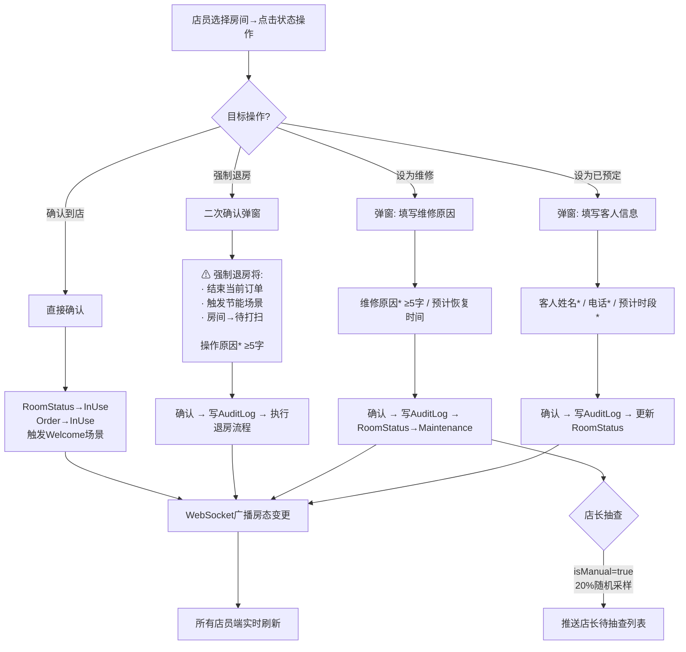
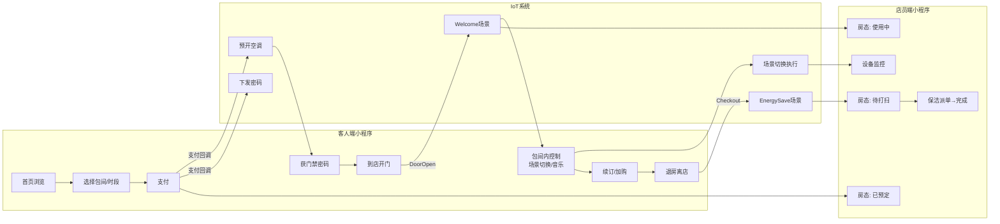
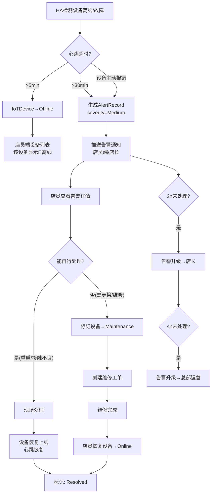

# 高岸ERP系统-智能设备场景交互原型（V1.0，2026年5月8日）

**版本**：V1.0
**日期**：2026年5月8日
**文档状态**：草稿
**文档编号**：UI-01
**编制依据**：
- 《高岸ERP系统-需求说明书（V10.8，2026年5月8日）》第2.3、3.3.1、3.3.3、3.3.4、3.8.1、3.8.2节
- 《高岸ERP系统-智能设备场景对象模型（V1.0，2026年5月8日）》（ROM-02）
- 泳道图：F01（包间预约到店消费）、F16（智能场景联动）、F18（IoT设备故障）、F22（小程序登录）、F23（房态管理）

---

## 1. 文档目的与阅读指引

### 1.1 文档目的

本文档为店内智能设备场景的**交互原型设计**，覆盖客人端小程序和店员端小程序的关键页面。使用 ASCII 线框图 + Mermaid 交互流程图，用于项目组评审讨论和前端开发的起点。

**目标读者**：前端开发（小程序）、UI/UX设计师、产品经理、于总（干系人评审）。

### 1.2 阅读指引

| 角色 | 阅读章节 | 重点关注 |
|------|---------|---------|
| 前端开发 | 第2-5章 | 页面布局、交互规则、状态处理 |
| UI/UX设计师 | 第2-4章 | 信息架构、页面流转、视觉层次 |
| 产品经理/于总 | 第2-4章 + 第6章 | 功能完整性、体验一致性、待决议题 |
| 后端开发 | 附录B | API端点映射、WebSocket主题 |

### 1.3 设计约定

- **ASCII线框图**宽度约34字符，使用Unicode边框字符（┌┐└┘├┤│─），建议在等宽字体下阅读
- **颜色编码**：🟢绿/🔵蓝/🟡黄/🟣紫/🔴红 — 对应房态和设备状态
- **交互标注**：每页面标注底层实体来源（ROM-02引用）、触发的API调用、需要处理的状态
- **Mermaid flowchart** 标注决策点和分支条件

---

## 2. 客人端小程序

> 客人端为微信小程序，底部3个Tab：「首页」「订单」「我的」。以下按用户旅程顺序排列页面。

### 2.1 首页

**页面用途**：客人进入小程序的第一屏，展示门店信息和预约入口。

```
┌──────────────────────────────────┐
│  高岸茶室              [盈隆店▾] │
│                                  │
│  ┌──────────────────────────────┐│
│  │      [门店封面图轮播]        ││
│  │   盈隆店  ★4.8  距2.3km     ││
│  │   "高空茶室，180°落地窗"     ││
│  └──────────────────────────────┘│
│                                  │
│  ┌────────────┐ ┌──────────────┐│
│  │  立即预约   │ │  会员中心    ││
│  │   (CTA)    │ │ 余额 ¥280   ││
│  └────────────┘ └──────────────┘│
│                                  │
│  ┌── 热门包间 ─────────────────┐│
│  │ ┌──────────────────────────┐ ││
│  │ │ 大茶室C    ¥120/h       │ ││
│  │ │ 6人·茶台·K歌·投影       │ ││
│  │ │          [查看详情→]    │ ││
│  │ └──────────────────────────┘ ││
│  │ ┌──────────────────────────┐ ││
│  │ │ 中茶室A    ¥80/h        │ ││
│  │ │ 4人·茶台·落地窗         │ ││
│  │ │          [查看详情→]    │ ││
│  │ └──────────────────────────┘ ││
│  │ ┌──────────────────────────┐ ││
│  │ │ 大会议室    ¥200/h      │ ││
│  │ │ 10人·投影·会议设备       │ ││
│  │ │          [查看详情→]    │ ││
│  │ └──────────────────────────┘ ││
│  └──────────────────────────────┘│
│                                  │
│  [首页]      [订单]      [我的]  │
└──────────────────────────────────┘
```

**数据来源**：
- `GET /stores?lat=&lng=` → 门店列表（按距离排序）
- `GET /stores/{id}/rooms?popular=true` → 热门包间
- `GET /member/{id}/balance` → 会员余额（如已登录）

**需处理的状态**：

| 状态 | 处理方式 |
|------|---------|
| 定位未授权 | 显示默认门店列表（按名称排序），顶部提示"开启定位可显示距离" |
| 门店无可用包间 | 包间列表为空，显示"今日已约满，可查看其他日期" |
| 未登录 | 可浏览首页，点击"立即预约"或"会员中心"时触发登录 |

### 2.2 预约详情页

**页面用途**：展示单个包间详情、选择日期和时段、确认下单。

```
┌──────────────────────────────────┐
│  ← 大茶室C                       │
│                                  │
│  ┌──────────────────────────────┐│
│  │     [包间照片轮播]           ││
│  └──────────────────────────────┘│
│                                  │
│  容纳: 6人  |  面积: 25m²       │
│  设施: 🍵茶台 🎤K歌 📺投影 🪟窗景│
│                                  │
│  ─────────────────────────────── │
│  选择日期                        │
│  [ < 5/7 ]  [5/8 今天]  [5/9 >] │
│  ─────────────────────────────── │
│                                  │
│  ┌ 上午 08:00-12:00 ───────────┐│
│  │ ○ 08:00-09:30  ¥180        ││
│  │ ○ 09:00-10:30  ¥180        ││
│  │ ● 10:00-11:30  ¥180  (选中) ││
│  │ ○ 11:00-12:30  ¥180        ││
│  └──────────────────────────────┘│
│                                  │
│  ┌ 下午 12:00-18:00 ───────────┐│
│  │ ○ 13:00-14:30  ¥180        ││
│  │ — 14:00-15:30  已占用       ││
│  │ ○ 15:00-16:30  ¥180        ││
│  │ ...                          ││
│  └──────────────────────────────┘│
│                                  │
│  ┌ 晚间 18:00-24:00 ───────────┐│
│  │ ...                          ││
│  └──────────────────────────────┘│
│                                  │
│  ─────────────────────────────── │
│  小计: ¥180  |  时长: 90分钟    │
│         [      立即支付 →      ] │
└──────────────────────────────────┘
```

**数据来源**：
- `GET /rooms/{id}` → 包间详情（设施、照片、描述）
- `GET /rooms/{id}/pricing?date=2026-05-08` → 当日定价及可用时段

**时段显示规则**：
- ○ 可选时段 — 白色背景，可点击
- ● 已选中 — 蓝色高亮背景
- — 已占用 — 灰色禁用，点击提示"该时段已被预约"
- 已过期 — 不显示

**交互流程图 2.2F — 预约决策流程**：

```mermaid
flowchart TD
    A[进入包间详情] --> B[选择日期]
    B --> C{已登录?}
    C -->|否| D[弹出微信授权登录]
    D --> E{授权成功?}
    E -->|否| B
    E -->|是| F[加载可用时段]
    C -->|是| F
    
    F --> G{有可用时段?}
    G -->|否| H[显示"今日已约满"<br/>建议查看其他日期]
    G -->|是| I[展示可选择时段]
    
    I --> J[用户选择时段]
    J --> K[确认订单信息]
    K --> L[选择支付方式<br/>微信支付/余额支付]
    L --> M{支付成功?}
    
    M -->|是| N[跳转预约成功页]
    M -->|否-超时| O{超过15分钟?}
    O -->|是| P[订单自动取消<br/>返回包间详情]
    O -->|否| L
    M -->|否-余额不足| Q[提示余额不足<br/>建议微信支付或充值]
    Q --> L
```

### 2.3 预约成功页

**页面用途**：支付成功后展示预约确认信息，最核心的是门禁密码的大字展示。

```
┌──────────────────────────────────┐
│                                  │
│           ✓ 预约成功！            │
│                                  │
│  ─────────────────────────────── │
│  包间: 大茶室C                   │
│  日期: 2026年5月8日 (周五)       │
│  时间: 10:00 - 11:30 (90分钟)    │
│  金额: ¥180 (微信支付)           │
│  ─────────────────────────────── │
│                                  │
│  ┌──────── 门禁密码 ────────────┐│
│  │                              ││
│  │         8  2  6  4           ││
│  │                              ││
│  │     (有效期至 12:30)         ││
│  │                              ││
│  │       [ 📋 复制密码 ]        ││
│  └──────────────────────────────┘│
│                                  │
│  ─────────────────────────────── │
│  地址: 盈隆广场3楼              │
│  富力盈隆大厦，地铁XX站B出口    │
│  [  🗺 查看导航  ]              │
│  ─────────────────────────────── │
│                                  │
│  温馨提示:                      │
│  · 包间将于10:00前完成预开空调   │
│  · 如需取消，开始前2小时免费取消  │
│  · 到店后输入密码即可开门        │
│                                  │
│  [ 查看我的订单 ]  [ 返回首页 ]  │
└──────────────────────────────────┘
```

**数据来源**：
- 页面参数来自 `POST /orders/{id}/pay` 的返回结果
- 门禁密码由 iot-svc 生成后返回

**需处理的状态**：

| 状态 | 处理方式 |
|------|---------|
| 密码生成失败 | 显示"密码生成中，请稍后刷新"，不阻塞支付成功页展示 |
| 门店已打烊 | 仍显示预约信息，但提示"门店当前已打烊，预约时间到店即可" |

### 2.4 包间内控制页

**页面用途**：客人到店进入包间后，通过此页面控制场景、音乐，并可续订或退房。从"我的订单→进行中订单"进入。

```
┌──────────────────────────────────┐
│  大茶室C | 使用中                │
│  剩余 45分钟  (11:30结束)       │
│                                  │
│  ┌── 当前场景: 品茶模式 🍵 ────┐│
│  │                             ││
│  │  灯光: 暖色 3000K  80%亮度  ││
│  │  空调: 开启 24°C  制冷      ││
│  │  音乐: ▶ 轻音乐播放中       ││
│  └─────────────────────────────┘│
│                                  │
│  ── 场景切换 ──────────────────  │
│                                  │
│  ┌──────┐ ┌──────┐ ┌──────┐    │
│  │ 品茶 │ │ 会议 │ │ K歌 │    │
│  │ 🍵 ✓│ │ 💡  │ │ 🎤  │    │
│  └──────┘ └──────┘ └──────┘    │
│                                  │
│  ── 音乐控制 ──────────────────  │
│                                  │
│    ⏮     ▶/⏸     ⏭            │
│   音量: [━━━━━━━○━━━] 70%     │
│                                  │
│   当前曲目: 高山流水 - 古琴      │
│   [ 连接蓝牙 ]                   │
│                                  │
│  ─────────────────────────────── │
│                                  │
│  [ 续订包间 ]     [ 加购商品 ]   │
│                                  │
│  [         🚪 退房离店         ] │
└──────────────────────────────────┘
```

**数据来源**：
- `GET /orders/{id}` → 订单当前状态
- `GET /rooms/{roomId}/devices/status` → 包间内设备实时状态（灯光色温、空调温度、音响状态）
- `POST /rooms/{roomId}/scenes/{sceneId}/trigger` → 场景切换
- `POST /devices/speaker/command` → 音乐控制
- `POST /orders/{id}/extend` → 续订
- `POST /orders/{id}/checkout` → 退房

**交互流程图 2.4F — 场景切换交互**：

```mermaid
flowchart TD
    A[客人点击场景按钮] --> B{场景已激活?}
    B -->|是（显示✓）| C[不执行，保持当前]
    B -->|否| D{需要确认?}
    
    D -->|"会议/K歌场景<br/>(可能影响其他客人)"| E[弹窗: "切换到XX场景?"<br/>确认/取消]
    D -->|品茶场景| F[直接执行]
    
    E -->|确认| F
    E -->|取消| G[保持当前场景]
    
    F --> H[发送 POST scenes/trigger]
    H --> I{全部设备响应?}
    
    I -->|全部成功| J[更新当前场景显示<br/>显示 ✓ 标记]
    I -->|部分失败| K[显示成功项+失败项<br/>失败项显示重试按钮]
    
    K --> L{客人重试?}
    L -->|是| H
    L -->|否| M[保持部分成功状态<br/>自动通知店员]
```

**需处理的状态**：

| 状态 | 处理方式 |
|------|---------|
| 场景执行中 | 按钮显示加载动画，禁止重复点击 |
| 设备离线（场景不可用） | 场景按钮灰色+⚠标记，提示"部分设备离线，场景可能无法完整执行" |
| 订单即将结束(<15分钟) | 页面顶部红色倒计时条，提示"您的包间即将到期" |
| 订单超时未退房 | 系统自动退房，页面显示"已自动退房"，返回订单详情 |
| 门禁密码失效 | 不再显示密码，仅显示房间号和时段 |

### 2.5 我的订单

**页面用途**：查看所有订单，按状态分Tab展示。

```
┌──────────────────────────────────┐
│  我的订单                        │
│                                  │
│  [进行中]  [待使用]  [已完成]    │
│  ─────────────────────────────── │
│                                  │
│  ┌ 进行中 ─────────────────────┐│
│  │ 大茶室C                     ││
│  │ 2026-05-08 10:00-11:30      ││
│  │ 🟢 使用中  剩余: 45分钟     ││
│  │                             ││
│  │ 门禁密码: 8 2 6 4          ││
│  │                             ││
│  │ [进入控制页] [续订] [退房]  ││
│  └─────────────────────────────┘│
│                                  │
│  ┌ 待使用 ─────────────────────┐│
│  │ 中茶室A                     ││
│  │ 2026-05-08 15:00-17:00      ││
│  │ 🟣 已预定                   ││
│  │                             ││
│  │ 门禁密码: 预约前30分钟显示  ││
│  │                             ││
│  │ [取消预约]  (距开始>2h免费) ││
│  └─────────────────────────────┘│
│                                  │
│  ┌ 已完成 ─────────────────────┐│
│  │ 中茶室B                     ││
│  │ 2026-05-07 14:00-16:00      ││
│  │ ✓ 已完成  ¥320             ││
│  │ [再次预约] [查看详情]       ││
│  └─────────────────────────────┘│
│                                  │
│  [首页]      [订单]      [我的]  │
└──────────────────────────────────┘
```

**取消规则显示**：
- 距开始>2小时 → 显示"免费取消"
- 距开始<2小时 → 显示"取消将收取首小时费用50%（¥90）"
- 已开始未开门 → 显示"已超过预约时间，不可取消"

---

## 3. 店员端小程序

> 店员端为微信小程序，登录后默认展示工作台。底部4个Tab：「工作台」「房态」「设备」「我的」。

### 3.1 工作台 Dashboard

**页面用途**：店员/店长登录后的首页，聚合关键数据和待办事项。

```
┌──────────────────────────────────┐
│  盈隆店       店长: 张伟  [🔔2] │
│                                  │
│  ┌──────────────────────────────┐│
│  │  今日营收                    ││
│  │  ¥ 2,840                     ││
│  │  订单: 8笔  客人数: 22人    ││
│  └──────────────────────────────┘│
│                                  │
│  ┌── 快速入口 ─────────────────┐│
│  │ [🏠 房态] [📱 设备] [🎬 场景] ││
│  └──────────────────────────────┘│
│                                  │
│  ┌── 待办事项 ─────────────────┐│
│  │ 🔴 保洁任务: 2间待处理 →    ││
│  │ 🟡 设备告警: 1台离线 →      ││
│  │ ⬜ 巡检任务: 下午13:00 →    ││
│  │ 📋 待抽查: 3条手动操作 →    ││
│  └──────────────────────────────┘│
│                                  │
│  ┌── 实时房态概览 ─────────────┐│
│  │                              ││
│  │ 大会议室 🟢 使用中 13:00-15 ││
│  │ 中茶室A  🟡 待打扫          ││
│  │ 中茶室B  🔵 空闲            ││
│  │ 大茶室C  🟢 使用中 10:00-11 ││
│  │ 展厅     🔵 空闲            ││
│  │ 工作间   🔵 空闲            ││
│  │                              ││
│  │      [查看全部房态 →]       ││
│  └──────────────────────────────┘│
│                                  │
│  [工作台] [房态] [设备] [我的]   │
└──────────────────────────────────┘
```

**数据来源**：
- `GET /stores/{storeId}/dashboard` → 聚合今日营收、订单数、客人数
- `GET /stores/{storeId}/rooms/status` → 全部房态（概览只显示前6条）
- `GET /tasks/pending?storeId=` → 待办统计
- `GET /alerts/active?storeId=` → 活跃告警数

**需处理的状态**：

| 状态 | 处理方式 |
|------|---------|
| 首次登录（新店员） | 引导提示各模块功能 |
| 无待办事项 | 显示"暂无待办，门店运行正常 ✓" |

### 3.2 房态看板

**页面用途**：核心运营页面，展示所有房间的当前状态及可执行的操作。

```
┌──────────────────────────────────┐
│  房态看板      [📋列表] [🏠平面] │
│                                  │
│  ┌ 大会议室 ───────────────────┐│
│  │ 🟢 使用中                   ││
│  │ 客人: 李明  138****1234     ││
│  │ 时段: 13:00-15:00           ││
│  │ 剩余: 1小时20分钟           ││
│  │                             ││
│  │ [开门] [场景→] [强制退房]   ││
│  └─────────────────────────────┘│
│                                  │
│  ┌ 中茶室A ────────────────────┐│
│  │ 🟡 待打扫                   ││
│  │ 上单: 王芳  10:00-10:30     ││
│  │ 保洁: 小陈 (进行中 15min)   ││
│  │                             ││
│  │ [确认打扫完成]             ││
│  └─────────────────────────────┘│
│                                  │
│  ┌ 中茶室B ────────────────────┐│
│  │ 🔵 空闲                     ││
│  │                             ││
│  │ [设为已预定] [设为维修]     ││
│  └─────────────────────────────┘│
│                                  │
│  ┌ 大茶室C ────────────────────┐│
│  │ 🟢 使用中                   ││
│  │ 客人: 张华  139****5678     ││
│  │ 时段: 10:00-11:30           ││
│  │ 剩余: 45分钟                ││
│  │                             ││
│  │ [场景→品茶/K歌] [强制退房]  ││
│  └─────────────────────────────┘│
│                                  │
│  ┌ 展厅 ───────────────────────┐│
│  │ 🔵 空闲                     ││
│  └─────────────────────────────┘│
│                                  │
│  ┌ 工作间 ─────────────────────┐│
│  │ 🔵 空闲                     ││
│  └─────────────────────────────┘│
│                                  │
│  [工作台] [房态] [设备] [我的]   │
└──────────────────────────────────┘
```

**上下文操作按钮**（根据房态显示）：

| 房态 | 可用操作 |
|------|---------|
| 🔵 空闲 | [设为已预定] [设为维修] |
| 🟣 已预定 | [确认到店] [取消预约] [设为维修] |
| 🟢 使用中 | [开门] [场景切换] [强制退房] [续订] |
| 🟡 待打扫 | [确认打扫完成] [设为维修] |
| 🔴 维修 | [恢复空闲] |

**交互流程图 3.2F — 手动房态变更**：



### 3.3 设备监控

**页面用途**：查看所有IoT设备的状态，支持按包间或按设备类型浏览。

```
┌──────────────────────────────────┐
│  设备监控    [按包间] [按类型]   │
│                                  │
│  ┌ 大会议室 (6台设备) ──────────┐│
│  │ 🟢 门锁    在线   电量85%    ││
│  │ 🟢 空调    在线   24°C       ││
│  │ 🟢 灯光A   在线   80%亮度    ││
│  │ 🟢 灯光B   在线   80%亮度    ││
│  │ 🟢 窗帘    在线   关闭       ││
│  │ 🟢 音响A   在线   ▶播放中    ││
│  └───────────────────────────────┘│
│                                  │
│  ┌ 中茶室A (5台设备) ───────────┐│
│  │ 🔴 门锁    离线   0%电量 ⚠  ││
│  │ 🟢 空调    在线   26°C       ││
│  │ 🟢 灯光A   在线   60%亮度    ││
│  │ 🟢 灯光B   在线   60%亮度    ││
│  │ 🟢 窗帘    在线   关闭       ││
│  └───────────────────────────────┘│
│                                  │
│  ┌ 中茶室B (5台设备) ───────────┐│
│  │ 🟢 全部在线                  ││
│  └───────────────────────────────┘│
│                                  │
│  ┌ 大茶室C (6台设备) ───────────┐│
│  │ 🟢 全部在线                  ││
│  └───────────────────────────────┘│
│                                  │
│  ─────────────────────────────── │
│  🔴 设备告警: 1台  [查看全部 →] │
│                                  │
│  [工作台] [房态] [设备] [我的]   │
└──────────────────────────────────┘
```

**设备行点击**：进入设备控制弹窗（见3.4节）。

**"按类型"视图切换**：改为按 Lock/AC/Light/Curtain/Speaker/Sensor 分组，每组显示在线/离线/故障计数。

### 3.4 设备控制弹窗

**页面用途**：从设备列表点击某设备后弹出的控制面板。不同设备类型展示不同的控制UI。

**门锁控制**：
```
┌──────────────────────────────────┐
│  门锁 - 大会议室                │
│                                  │
│  状态: 🟢 在线                  │
│  电量: 85%                      │
│  最近事件: 13:03 客人密码开门    │
│                                  │
│  [        🔓 远程开门        ]  │
│                                  │
│  ── 近期事件记录 ──────────────  │
│  13:03  客人开门 (密码8264)      │
│  12:55  系统下发预开指令        │
│  11:30  保洁完成                │
│                                  │
│  [关闭]                         │
└──────────────────────────────────┘
```

**空调控制**：
```
┌──────────────────────────────────┐
│  空调 - 中茶室A                 │
│                                  │
│  状态: 🟢 在线  24°C  制冷      │
│                                  │
│  ── 温度设定 ──────────────────  │
│  16  18  20  22 [24] 26  28  30 │
│  ◀───────○─────────────────▶    │
│                                  │
│  ── 模式 ──────────────────────  │
│  [制冷] [制热] [送风] [除湿]    │
│                                  │
│  ── 风速 ──────────────────────  │
│  [低] [中] [高] [自动]          │
│                                  │
│  [关闭]                         │
└──────────────────────────────────┘
```

**灯光控制**：
```
┌──────────────────────────────────┐
│  灯光 - 大茶室C                 │
│                                  │
│  状态: 🟢 在线  80%亮度  3000K  │
│                                  │
│  ── 开关 ──────────────────────  │
│  [ 🔆 开 ]  [ 🔅 关 ]          │
│                                  │
│  ── 亮度 ──────────────────────  │
│  0%  [━━━━━━━━○━━━]  80%  100% │
│                                  │
│  ── 色温 (可调光灯具) ────────  │
│  [2700K] [3000K●] [3500K] [4000K]│
│  暖黄   暖白    自然白   冷白   │
│                                  │
│  [关闭]                         │
└──────────────────────────────────┘
```

**窗帘控制**：
```
┌──────────────────────────────────┐
│  窗帘 - 大会议室                │
│                                  │
│  状态: 🟢 在线  关闭             │
│                                  │
│  [    🪟 打开    ]              │
│  [    🪟 关闭    ]              │
│  [    ⏹ 停止    ]              │
│                                  │
│  当前角度: 完全闭合             │
│  (百叶窗角度调节 - 暂不支持)    │
│                                  │
│  [关闭]                         │
└──────────────────────────────────┘
```

**音响控制**：
```
┌──────────────────────────────────┐
│  音响 - 大会议室                │
│                                  │
│  状态: 🟢 在线  播放中  音量70% │
│                                  │
│  ── 播放 ──────────────────────  │
│     ⏮       ▶/⏸       ⏭       │
│                                  │
│  ── 音量 ──────────────────────  │
│  [━━━━━━━━○━━━]  70%           │
│                                  │
│  ── 音源 ──────────────────────  │
│  [背景音乐●] [蓝牙] [TV音频]    │
│                                  │
│  ── 静音 ──────────────────────  │
│  [ 🔇 静音 ]                    │
│                                  │
│  [关闭]                         │
└──────────────────────────────────┘
```

**通用规则**：
- 所有远程控制操作需填写原因（≥5字），高风险操作（开门、强制退房）需二次确认
- 所有操作记录 AuditLog
- 设备离线时操作按钮禁用，显示灰色 + "设备离线，无法操作"

### 3.5 场景控制

**页面用途**：手动触发包间场景，管理员可自定义场景参数。

```
┌──────────────────────────────────┐
│  场景控制 - 大茶室C             │
│                                  │
│  当前场景: 品茶模式 (自动触发)   │
│                                  │
│  ── 手动触发场景 ──────────────  │
│                                  │
│  ┌─────────┐ ┌─────────┐       │
│  │ 🍵 品茶 │ │ 💡 会议 │       │
│  │ 暖光+空调│ │ 冷白光  │       │
│  │ +轻音乐 │ │ +静音   │       │
│  │   ✓     │ │         │       │
│  └─────────┘ └─────────┘       │
│                                  │
│  ┌─────────┐ ┌─────────┐       │
│  │ 🎤 K歌  │ │ ♻ 节能  │       │
│  │ 彩灯    │ │ 全部关闭 │       │
│  │ +KTV音响│ │         │       │
│  │         │ │         │       │
│  └─────────┘ └─────────┘       │
│                                  │
│  ── 场景参数 (管理员可调) ─────  │
│                                  │
│  空调温度:                       │
│  [20][21][22][23][24●][25][26]  │
│                                  │
│  灯光色温:                       │
│  [2700K][3000K●][3500K][4000K]  │
│                                  │
│  音响音量:                       │
│  [━━━━━━━━○━━━]  70%           │
│                                  │
│  [  💾 保存场景默认参数  ]       │
│  [  ↩ 恢复系统默认参数  ]       │
│                                  │
│  (仅管理员/店长可保存参数)       │
│  [关闭]                         │
└──────────────────────────────────┘
```

**交互流程图 3.5F — 场景覆盖决策**：

```mermaid
flowchart TD
    A[店员点击场景按钮] --> B{场景触发类型?}
    
    B -->|原为Auto自动触发| C[本次是手动覆盖]
    B -->|原为Manual| D[正常手动触发]
    
    C --> E[记录AuditLog:<br/>自动场景→手动覆盖]
    D --> E
    
    E --> F[iot-svc 批量下发SceneRule]
    
    F --> G{执行结果?}
    G -->|全部成功| H[显示: "XX场景已激活"]
    G -->|部分失败| I[标记失败设备]
    
    I --> J[显示: "X/Y台设备响应<br/>Z设备未响应"]
    J --> K{店员重试?}
    K -->|是| F
    K -->|否| L[保持部分成功<br/>失败设备创建AlertRecord]
    
    H --> M[场景激活<br/>抑制同房间Auto触发]
    L --> M
    
    M --> N{有退房事件?}
    N -->|是| O[EnergySave优先<br/>覆盖当前手动场景]
```

### 3.6 保洁任务与设备故障标记

**页面用途**：保洁员查看和完成任务，过程中可标记发现的设备故障。

```
┌──────────────────────────────────┐
│  保洁任务 - 中茶室A             │
│                                  │
│  状态: 🟡 进行中                │
│  生成: 10:30 (退房自动生成)     │
│  截止: 11:30 (剩余45分钟)       │
│  保洁员: 小陈                   │
│                                  │
│  ── 保洁检查清单 ──────────────  │
│                                  │
│  ☑ 清扫地面                     │
│  ☑ 清理桌面茶具                 │
│  ☑ 补充茶包/纸巾/矿泉水         │
│  ☑ 清洗茶具并归位               │
│  ☐ 检查设备是否正常             │
│                                  │
│  ── 设备状态检查 ──────────────  │
│                                  │
│  门锁: 🟢 正常                  │
│  空调: 🟢 正常                  │
│  灯光A: 🟢 正常                 │
│  灯光B: 🔴 不亮                 │
│                                  │
│  ┌─ 故障上报 ─────────────────┐ │
│  │ 故障设备: 灯光B - 中茶室A  │ │
│  │ 故障描述:                  │ │
│  │ [面板按键无响应，灯不亮    ]│ │
│  │ [          📷 拍照上传     ]│ │
│  │                            │ │
│  │ [ 上报故障 ]               │ │
│  └────────────────────────────┘ │
│                                  │
│  [         ✓ 确认保洁完成       ]│
└──────────────────────────────────┘
```

**交互规则**：
- 保洁员仅能看到自己名下的保洁任务（权限 scope=Own）
- 设备故障上报后，自动生成设备告警 AlertRecord 和维修工单
- 设备故障不影响保洁任务完成——可以先完成保洁，设备维修另行处理
- 保洁完成确认后，系统自动检查房间所有设备是否在线，离线设备生成额外告警

---

## 4. 端到端交互流

### 4.1 预约→到店→使用→退房 全链路



### 4.2 设备故障→告警→处理→闭环



---

## 5. 异常与边界状态

### 5.1 异常状态总览

| # | 异常场景 | 触发条件 | 客人端表现 | 店员端表现 | 恢复路径 |
|---|---------|---------|-----------|-----------|---------|
| 1 | **网络离线** | 小程序端网络断开 | 页面顶部显示"网络不可用"横幅；缓存上次已知状态；操作按钮禁用 | 同上 | 网络恢复后自动刷新 |
| 2 | **支付超时** | 下单后15分钟未支付 | 弹窗"订单已超时取消"→返回包间详情 | 无感知 | 重新下单 |
| 3 | **开门超时** | 预约后30分钟未开门 | 订单状态→已取消，显示"预约已自动取消" | 房态→空闲，原门禁密码失效 | 客人可重新预约 |
| 4 | **设备无响应** | 发送设备控制指令后HA超时 | 场景切换/设备控制按钮显示⚠ | 设备控制弹窗显示重试按钮 | 手动重试或联系技术支持 |
| 5 | **并发预约冲突** | 两人同时预约同一时段 | 后支付者提示"该时段已被预约"并退款 | 无感知 | 选择其他时段 |
| 6 | **会话过期** | 微信登录态过期（7天） | 点击需登录功能时弹出重新授权 | 同上 | 重新微信授权登录 |
| 7 | **权限不足** | 保洁员尝试访问设备控制 | — | 设备控制页面不显示；房态操作按钮受限 | 仅保洁任务相关功能可用 |
| 8 | **保洁超时** | 保洁任务30分钟未接单 | 无感知 | 保洁任务高亮→推送店长重新指派 | 店长手动重新指派 |
| 9 | **设备离线期间客人到店** | 门锁离线但有有效订单 | 客人密码可能无法验证（依赖门锁离线密码机制） | 推送告警，店员准备物理钥匙 | 店员物理开门+标记设备故障 |
| 10 | **场景执行部分失败** | SceneRule中部分设备不响应 | 显示"X/Y台设备已切换，部分设备异常" | 收到AlertRecord，显示异常设备列表 | 手动重试或跳过 |
| 11 | **门锁电量耗尽** | 门锁电池<5%且无预警 | 门锁可能无法响应密码输入 | 推送严重告警(severity=High) | 立即更换电池或使用物理钥匙 |
| 12 | **退房后立即重新预约** | 同一包间退房后30分钟内被重新预约 | 正常预约流程（时段不重叠即可） | 保洁任务与新预约时段可能冲突 | 系统校验：保洁完成时间 < 新预约开始时间 |

### 5.2 通用异常处理原则

- **网络异常**：所有API调用设置10秒超时；失败显示具体错误信息+重试按钮；不显示原始技术错误码
- **并发冲突**：使用乐观锁（version字段），冲突时提示用户刷新重试，不自动覆盖
- **权限错误**：不显示"无权限"的技术提示，而是隐藏不可操作的元素（符合"看不到就不会点"原则）
- **操作审计**：所有异常操作（强制退房、手动房态变更）强制写AuditLog，不可跳过

---

## 6. 设计评审讨论议题

> 以下问题提请于总和项目组在交互原型评审会上讨论确认。

### 6.1 客人端场景切换权限

**问题**：客人端小程序是否提供完整的场景切换（品茶/会议/K歌），还是仅控制音乐？

- 当前原型中客人端提供完整场景切换（图2.4）
- ROM-02评审议题建议仅限音乐控制
- **待确认**：客人端的功能边界

### 6.2 房态平面图视图

**问题**：V1.0是否需要房态平面图视图（基于盈隆店实际布局绘制的可视化房态）？

- 当前原型仅展示列表视图
- 平面图视图开发成本高（需基于实际布局绘制SVG/Canvas），但运营体验更好
- **待确认**：V1.0是否列入开发范围

### 6.3 远程开门二次确认

**问题**：店员远程开门是否需要二次确认弹窗？

- 当前原型中已包含二次确认（图3.4门锁控制弹窗）
- 如果响应速度是首要考虑（客人等开门），是否简化为长按确认？
- **待确认**：确认方式（弹窗 vs 长按 vs 滑动确认）

### 6.4 保洁员权限边界

**问题**：保洁员能否在保洁过程中查看房间的当前订单信息（客人姓名、时段）？

- 隐私角度：保洁员不需要知道客人信息
- 运营角度：保洁员需要知道退房时间来安排优先级
- **待确认**：是否对保洁员显示客人信息，或仅显示房间号+退房时间

### 6.5 WebSocket推送频率

**问题**：设备状态变更的推送频率约束。

- IoT设备心跳可配置为30秒/次，但场景联动（如门锁开门）需要近乎实时的推送
- 音量滑动等连续操作是否需要WebSocket实时同步，还是仅HTTP请求即可？
- **待确认**：实时推送的场景范围

### 6.6 客人蓝牙直连与系统背景音乐优先级

**问题**：客人通过蓝牙连接包间音响播放自己音乐时，系统场景（如Meeting场景静音指令）是否覆盖？

- 当前设计：Meeting场景的静音指令覆盖蓝牙，其他场景不中断
- 但K歌场景也涉及音源切换
- **待确认**：音源切换的优先级规则

---

## 附录A：泳道图映射

| 交互流程/页面 | 对应泳道图 | 覆盖内容 |
|-------------|-----------|---------|
| 图2.2F 预约决策流程 | F01 包间预约到店消费 | 时段选择→支付→获密码 |
| 图2.4F 场景切换流程 | F16 智能场景联动 | 场景触发→设备命令→执行反馈 |
| 图3.2F 房态变更流程 | F23 房态管理 | 手动设置→抽查审核 |
| 图3.5F 场景覆盖决策 | F16 智能场景联动 | 手动覆盖→失败处理 |
| 图4.2 设备故障处理 | F18 IoT设备故障 | 检测→诊断→维修→恢复 |
| 页面2.2 登录流程 | F22 小程序登录 | 微信授权→账号匹配→JWT |

## 附录B：数据源映射表

| 页面 | API调用 | WebSocket订阅 |
|------|--------|---------------|
| 2.1 首页 | `GET /stores`, `GET /stores/{id}/rooms?popular` | — |
| 2.2 预约详情 | `GET /rooms/{id}`, `GET /rooms/{id}/pricing` | — |
| 2.3 预约成功 | `POST /orders/{id}/pay` 返回结果 | — |
| 2.4 包间内控制 | `GET /orders/{id}`, `GET /rooms/{roomId}/devices/status` | `room:{storeId}:status`, `device:{storeId}:status` |
| 2.5 我的订单 | `GET /customers/{id}/orders` | `order:{storeId}:active` |
| 3.1 工作台 | `GET /stores/{storeId}/dashboard`, `GET /tasks/pending` | `cleaning:{storeId}:task`, `device:{storeId}:alert` |
| 3.2 房态看板 | `GET /stores/{storeId}/rooms/status` | `room:{storeId}:status` |
| 3.3 设备监控 | `GET /stores/{storeId}/devices` | `device:{storeId}:status`, `device:{storeId}:alert` |
| 3.4 设备控制 | `POST /devices/{deviceId}/command` | — |
| 3.5 场景控制 | `POST /rooms/{roomId}/scenes/{sceneId}/trigger` | — |
| 3.6 保洁任务 | `GET /cleaning-tasks/{id}`, `PUT /cleaning-tasks/{id}/complete` | `cleaning:{storeId}:task` |

## 附录C：修订历史

| 版本 | 日期 | 说明 |
|------|------|------|
| V1.0 | 2026-05-08 | 初稿，覆盖客人端5页面+店员端6页面，含4张Mermaid流程图和12个边界状态 |