# 高岸ERP系统-盈隆店IoT接线实施指南（V1.3）

**版本**：V1.4  
**日期**：2026年5月18日  
**文档状态**：施工版  
**V1.4核心变更**：
- 增补35mm DIN工业导轨安装规范：导轨从左至右排列为断路器→HDR-15-24→DAM0808D→4口集线器，线缆走下槽
- 锁死屏蔽层接地细则：干线屏蔽层仅在机柜端拧入地线端子排，房间端剪断悬空缠死
- 终端电阻规则：干线＜50米不加，＞50米在房内4口集线器INPUT端A+/B-并联120Ω
- 增加各房间Slave ID错开配置（继电器01-05，场景面板11-14，空调21-24，窗帘31-34）
- 视觉排版规范：接线图所有设备方块、文字、连线精确坐标计算，严禁重叠遮挡  
**编制依据**：
- 《高岸ERP系统-需求说明书（V10.11）》第六章 物联网
- 《高岸ERP系统-物联网设备采购与安装清单（V1.1）》
- 《高岸ERP系统-IoT技术实施与家庭测试方案（V1.0）》
- 盈隆店实际布局（扇形场地，90°圆心角，半径12m）
- 2026年5月16日音频系统与485总线系统设计评审第二版（分布式网络IP音频 + 24口交换机VLAN隔离 + 5房间×3网线星型拓扑）

---

## 1. 系统概述

本指南涵盖盈隆店三套强相关的弱电子系统：**分布式网络IP音频系统**（5 rooms × itc T-6715网络广播终端，IP网络音频分发）、**有线/无线网络覆盖系统**（24口千兆网管交换机+VLAN隔离，各房间设备网+AP星型拓扑）和 **RS485总线控制系统**（双层星型拓扑：机柜级HUB4858隔离集线器→各房间，房内4口485集线器→各设备）。三套系统均以工作间19寸标准机柜为中心，星型发散至各房间。

**V1.4系统架构特征：**
- 吊顶电箱全部35mm DIN导轨标准化安装（空开→HDR-15-24→DAM0808D→4口集线器）
- 屏蔽层单端接地规矩（机柜端拧入总地线，房间端剪断缠死）
- 终端电阻按距离条件加载（＜50米不加，≥50米在房内集线器INPUT端并联120Ω）
- Slave ID按功能域分段错开配置

### 1.1 空间对应关系

| 房间编号 | 房间名称 | 485总线 CH | 音频终端 | 吸顶音箱 | 网络接口 | 门锁 | 主要被控设备 |
|---------|---------|-----------|---------|---------|---------|------|-------------|
| RM001 | 大会议室 | CH1 | itc T-6715 | 4只（L+R各并2只） | 设备网+AP×2 | 通通锁 | 照明×2、空调、窗帘 |
| RM002 | 中茶室A | CH2 | itc T-6715 | 1只（双音圈/单声道） | 设备网+AP | 通通锁 | 照明×2、空调、窗帘、排风 |
| RM003 | 中茶室B | CH3 | itc T-6715 | 1只（双音圈/单声道） | 设备网+AP | 通通锁 | 照明×2、空调、窗帘、排风 |
| RM004 | 大茶室C | CH4 | itc T-6715 | 1只（双音圈/单声道） | 设备网+AP | 通通锁 | 照明×2、空调、窗帘、排风 |
| RM005 | 展厅 | CH5 | itc T-6715 | 1只 | 设备网+AP+摄像头 | 普通锁 | 展厅照明×2、PoE摄像头×1 |
| — | 工作间 | — | — | — | 86 AP面板（含网口） | 普通锁 | 机柜设备 |
| — | 走廊尽头 | — | — | — | 摄像头网线（PoE） | — | PoE摄像头×1 |
| — | 玄关 | — | — | — | 摄像头网线（PoE） | — | PoE摄像头×1 |

> **注1**：共8只Bose吸顶音箱——会议室×4（L+R各并2只）+ 中茶室A/B/大茶C各×1 + 展厅×1。T-6715支持100V定压输出，各房间独立驱动，每路最多并联2只。
> **注2**：3个PoE摄像头（展厅天花+走廊尽头天花+玄关天花）均走VLAN 10，通过PoE网线供电+数据传输，录像存HA主机（4TB监控硬盘，约30天循环）。
>
> **注2**：本版采用**分布式网络IP音频架构**——5台itc T-6715网络广播终端分别部署在各房间吊顶电箱内，通过标准IP网络接收HA主机的音频推流。相比旧版双模拟功放方案，彻底解决了模拟音频长距离回传的损耗和串扰问题，每房间独立解码、独立音量、独立控制。

### 1.2 系统架构总览

本系统由三套弱电子系统组成，以下为总图概览：

**系统总图（三系统总览）：**

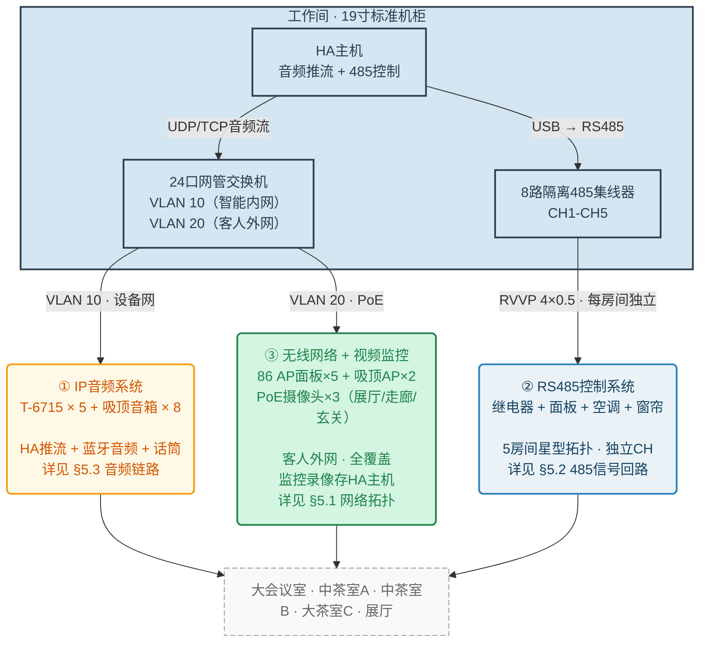

**系统分图索引（各子系统详细设计见对应章节）：**

| 分图 | 内容 | 章节 |
|------|------|------|
| 网络拓扑与VLAN | 交换机端口分配、VLAN 10/20设备清单 | §5.1 |
| 485信号回路 | HUB→各房间RVVP走线、Slave ID分配 | §5.2 |
| 通用房间音频链路 | 蓝牙音频模块（隐藏式）→T-6715→吸顶音箱的完整音频流 | §5.3.1 |
| 会议室话筒链路 | 无线话筒接收机→T-6715 MIC IN | §5.3.2 |
| HA推流示意 | 背景音乐持续推流 + 提示音插播切换 | §5.3.3 |
| 机柜布局 | 前视图：4U设备 + 侧挂导轨安装 | §5.4 |
| 吊顶电箱接线 | 每房间电箱内部布局（T-6715+继电器+端子排+24V电源） | §6.1 |

三套系统共用机柜和走线管槽，但信号回路完全独立。强电配电从总电箱经分支空开送至各房间吊顶电箱，详见§6.4节（强电侧接线）。

## 2. 设备购买清单

### 2.1 核心硬件

| 序号 | 设备名称 | 规格要求 | 数量 | 安装位置 | 备注 |
|------|---------|---------|------|---------|------|
| 1 | itc T-6715 网络广播功放终端 | 标准86底盒/吊顶安装，RJ45网络输入，LINE IN（凤凰端子 L+/R+/COM-）×1，LINE OUT（凤凰端子，与LINE IN共享COM-）×1，MIC IN×1，100V定压输出≥60W，支持IP网络音频解码（UDP/TCP），独立音量控制，可设置固定IP | 5台 | 各房间吊顶电箱内 | 核心音频终端，HA推流至各终端独立IP。每个房间独立解码，LINE IN接收蓝牙音频模块输入（同箱内3.5mm/RCA短线对插） |
| 2 | 24口千兆网管型交换机 | 24口10/100/1000Mbps，支持802.1Q VLAN、端口隔离、链路聚合，静音/低噪设计，需PoE供电（给AP×7 + 摄像头×3供电） | 1台 | 工作间机柜 | 核心网络设备。VLAN 10（智能内网）：T-6715×5 + HA×1 + 摄像头×3；VLAN 20（客人外网）：AP×7 |
| 3 | 无线话筒接收机 | **1U**机架式，U段一拖八，8天线，带MIX OUT混合总输出（6.35mm） | 1台 | 工作间机柜 | Hyundai或同级紧凑型。MIX OUT→会议室T-6715 MIC IN |
| 4 | HA主机（或同等级私有服务器） | 千兆网口，可运行虚拟机/容器（部署HA/Home Assistant），≥4盘位 | 1台 | 工作间机柜 | 核心算力与存储。运行HA主机、音频推流服务、485控制服务、存储监控录像 |
| 5 | Bose吸顶音箱 | 6.5寸定压吸顶音箱，支持100V端8W/16W切换 | 8只 | 各房间天花 | 会议室×4（L+R各并2只）、中茶A/B/大茶C各×1、展厅×1 |
| 6 | 蓝牙音频接收模块（隐藏式） | 蓝牙5.0/5.3接收，3.5mm/RCA线路输出，DC低压供电（受继电器CH5通断控制），支持自动回连，无面板/无物理按键 | 5个 | 各房间吊顶电箱内 | **安装变更（方案B）**：不再使用86墙面面板。模块隐藏在吊顶电箱内，音频输出通过3.5mm/RCA短线（≤0.5米）直接接入同箱T-6715的LINE IN。模块DC供电取自继电器模块CH5输出端，订单开始自动上电、退单自动断电。防蹭连/防串号。 |
| 7 | 86型墙面无线AP面板 | Wi-Fi 6，双频千兆，支持PoE供电或DC供电，86型面板安装 | 5个 | 大会议室/中茶A/B/大茶C/工作间墙面 | 走VLAN 20，提供客人无线网络。面板式安装不占桌面空间 |
| 8 | 吸顶式无线AP | Wi-Fi 6，双频千兆，支持PoE供电，吸顶安装 | 2个 | 展厅天花板、大会议室天花板 | 走VLAN 20，覆盖展厅和会议室加强信号 |
| 9 | PoE摄像头 | 海康威视4MP红外，ONVIF协议，PoE供电，支持人形检测、夜视功能 | 3个 | 展厅天花板、走廊尽头天花板、玄关天花板 | 走VLAN 10，PoE网线供电+数据传输，接入HA存储监控录像，ONVIF协议集成到HA |

> **音频链路变化说明**：V1.2改用分布式IP架构后，音频信号流改为"HA→IP网络→T-6715→音箱"，不再需要长距离模拟音频回传。**V1.3变更**：蓝牙音频模块改为隐藏式安装在吊顶电箱内，通过≤0.5米短线直接对插T-6715 LINE IN。

### 2.2 485总线控制设备

| 序号 | 设备名称 | 规格要求 | 数量 | 安装位置 | 备注 |
|------|---------|---------|------|---------|------|
|| 9 | ~~明纬24V开关电源（机柜用）~~ | 输入220V AC，输出24V DC，≥10A | ~~1台~~ **已取消** | ~~工作间机柜~~ | **V1.3取消**：原机柜远程送24V方案已废弃，改为各房间本地HDR-15-24就近取电 |
| 10 | USB转485转换器 | USB转RS485，支持Modbus RTU，带隔离保护 | 1台 | 工作间机柜（侧挂导轨） | HA主机USB口直连→485 HUB |
|| 11 | 聚英HUB4858 8路隔离集线器（机柜用） | 1路主输入转8路隔离输出，RS485/Modbus，带浪涌保护、光电隔离 | 1台 | 工作间机柜（侧挂或0.5U托盘） | **V1.3升级**：CH1-CH6对应6个房间，OUT口放射RVVP（仅信号）。预留2路备用。红/黑芯线在两端剪断 |
|| 12 | 8路继电器模块（Slave） | 24V DC供电，8路继电器输出，DI干接点×8（预留），RS485通讯，Modbus RTU，Slave ID可设 | 5个 | 各房间吊顶电箱 | ID依次设为01-05。24V DC本体供电来自HDR-15-24（24x7在线）。强电受控回路经CH COM端控制各设备 |\r\n|| 12b | **聚英4口485集线器（房内用）** | 1路主输入转4路隔离输出，RS485/Modbus | **5个** | 各房间吊顶电箱内 | **V1.3新增**：INPUT接机柜HUB4858长途干线，OUT1-OUT4接房内各485设备（继电器/空调/窗帘/面板），星型独立拉线 |\r\n|| 12c | **双位插排 10A 250V** | 两位五孔，10A，带线 | **5个** | 各房间吊顶电箱内 | **V1.3新增**：上口插T-6715台达24V砖头适配器（受继电器CH1控），下口插蓝牙模块适配器（受继电器CH2控） |
|| 13 | 明纬HDR-15-24超小型DIN导轨电源（吊顶电箱用） | 输入220V AC，输出24V DC，15W，DIN导轨安装 | 5台 | 各房间吊顶电箱 | **V1.3新方案**：给聚英DAM0808D继电器模块本体24x7供电（常开回路）。T-6715由双位插排取电（台达砖头适配器），受继电器CH1控制 |
| 14 | HT-8位/12位吊顶电箱 | 弱电电箱，尺寸≥300×250mm，**需放大以容纳T-6715+继电器+24V电源+端子排** | 5个 | 各房间门口吊顶内 | V1.2新增T-6715放入电箱，需选更大号电箱（≥400×300mm） |
| 15 | 25A交流接触器（可选） | 220V线圈，25A触点 | 4个 | 各房间吊顶电箱 | 电茶炉1500W负载保护，CH4驱动线圈 |

### 2.3 辅材配件

| 序号 | 设备名称 | 规格要求 | 数量 | 备注 |
|------|---------|---------|------|------|
| 15 | 三键六开485智能场景面板 | RS485通讯（Modbus RTU），DC 24V供电，86型底盒安装，3个物理按键支持短按/长按/组合，可编程6个场景 | 4个 | 仅会议室/茶室共4间配智能面板，展厅用普通开关 |
| 16 | 通通锁（TT Lock）智能门锁 | 蓝牙连接，电池供电，支持通通锁APP/API管理 | 4把 | 大会议室、中茶室A/B、大茶室C各一把（展厅和工作间用普通门锁） |
| 17 | 通通锁G2网关（TT Lock G2 Gateway） | 蓝牙转WiFi网关，USB供电（5V/1A），将门锁接入网络 | 1个 | 走廊吊顶或墙面居中安装，覆盖全部4间房门锁蓝牙信号（≤10米） |
| 18 | 120Ω终端电阻 | 1/4W，接线端子式，含可插拔端子 | **视情配2个** | 见5.5节关于终端匹配的说明 |
| 19 | 导轨式接线端子排 | 24V/485/零线/地线各色 | 若干 | 吊顶电箱内分线 |
| 20 | 六类屏蔽网线（SFTP） | 六类屏蔽双绞线，箱装305米 | 1箱 | 全店网络布线（设备网5根 + AP 7根 + 摄像头3根 = 15根 × 平均12m ≈ 180m，留余量） |
| 21 | RVVP屏蔽线（485面板分支） | RVVP 4×0.5，4芯屏蔽，从3.1节N2取用 | 按需（约30米） | 吊顶电箱→墙面86盒（485场景面板短跳线） |
| 22 | 蓝牙音频连接线 | 3.5mm/RCA短线，长度≤0.5米 | 5根 | 吊顶电箱内蓝牙音频模块→T-6715 LINE IN（同箱短接） |
| 23 | 监控硬盘 | 3.5寸 SATA，4TB，监控级（如希捷SkyHawk或西数Purple） | 1块 | HA主机内安装，存储3路摄像头录像（约30天循环） |
| 24 | 成品网络跳线 | 六类，0.5米/1米/2米若干条 | 若干 | 机柜内设备跳接至交换机 |
| 25 | **双位插排** | 10A 250V，两位五孔，带1.5米线 | 5个 | 各房间吊顶电箱内 | **V1.3新增**：上口T-6715砖头适配器，下口蓝牙模块适配器 |

---

## 3. 线材购买清单

### 3.1 网络线材（主线）

| 序号 | 线材名称 | 规格要求 | 数量 | 用途 |
|------|---------|---------|------|------|
| N1 | 六类屏蔽网线（主干） | SFTP六类，每箱305米 | 1箱 | 全店网络主干（设备网+AP），总用量约150米 |
| N2 | RVVP屏蔽线（485总线） | RVVP 4×0.5，4芯屏蔽，整卷 | 100米 | 485主干（机柜→各房间）+ 房间内面板菊花链通用，一线上到底 |
| N3 | 成品网络跳线 | 六类，0.5m/1m/2m | 若干 | 机柜内设备→交换机 |

### 3.2 音频线材

| 序号 | 线材名称 | 规格要求 | 数量 | 用途 |
|------|---------|---------|------|------|
| A1 | 吸顶音箱线 | 2×1.5平方无氧铜(OFC)阻燃双色护套音响线 | 100米/卷×1卷 | 各房间吊顶电箱T-6715→吸顶音箱，5间×3-8米/根，总长约50米 |
| A2 | 话筒MIX OUT信号线 | 6.35mm大二芯转6.35mm大二芯，**5米** | 1根 | 无线话筒接收机MIX OUT→会议室T-6715 MIC IN（工作间机柜→会议室吊顶电箱，沿管槽走线） |
| A3 | 蓝牙模块音频线 | 3.5mm/RCA对录线，长度**≤0.5米** | 5根 | 吊顶电箱内蓝牙音频模块→T-6715 LINE IN（同箱内短接） |

> **音频线材说明**：V1.2采用分布式IP架构，所有音频线均为房间内短距离布线（最长≤10米），不再有机柜到房间的长距离模拟音频线。长距离音频传输改为IP网络承载。**V1.3变更**：蓝牙音频模块改为隐藏安装在吊顶电箱内（不再走墙面86盒），音频线缩短至≤0.5米，直接同箱内对插T-6715 LINE IN。

### 3.3 485总线线材

| 序号 | 线材名称 | 规格要求 | 数量 | 用途 |
|------|---------|---------|------|------|
| B1 | BV铜芯硬线 | 2.5平方毫米，红色 | 50米 | 继电器模块COM端跳线（强电侧） |
| B2 | BV铜芯硬线 | 2.5平方毫米，蓝色 | 30米 | 零线排汇流 |
| B3 | BV铜芯硬线 | 2.5平方毫米，黄绿色 | 30米 | 地线排汇流 |
| B4 | PVC穿线管 | φ32或φ25，阻燃型 | 按需 | 天花板吊顶内预埋 |
| B5 | 弱电专用PVC穿线管 | φ20，阻燃型 | 按需 | 吊顶电箱→墙面485开关信号管 |

**485总线使用3.1节N2（RVVP 4×0.5屏蔽线）一线到底**：从机柜HUB4858→各房间吊顶电箱（主干）再到墙面485面板（分支）全程同一线型。**V1.3变更**：红/黑芯线在机柜端和房间端均剪断悬空（套绝缘热缩管），严禁传输24V电源。485信号仅走黄/白两芯。24V供电改为各房间本地明纬HDR-15-24就近取电。

### 3.4 每房间走线说明

每个房间从总机柜拉的线缆类型如下（485线为RVVP 4×0.5，非网线）：

| 房间 | 设备网（六类SFTP） | AP网（六类SFTP） | 485总线（RVVP 4×0.5） | 合计 |
|------|------------------|----------------|---------------------|------|
| 大会议室 | 1根→T-6715 | 2根（86面板+吸顶AP） | 1根 | 4根 |
| 中茶室A | 1根→T-6715 | 1根（86面板） | 1根 | 3根 |
| 中茶室B | 1根→T-6715 | 1根（86面板） | 1根 | 3根 |
| 大茶室C | 1根→T-6715 | 1根（86面板） | 1根 | 3根 |
| 展厅 | 1根→T-6715 | 1根（吸顶AP）+ 1根（摄像头） | 1根 | 4根 |
| 工作间 | — | 1根（86 AP面板，含网口供工作人员上网） | — | 1根 |
| 走廊尽头 | — | 1根（摄像头） | — | 1根 |
| 玄关 | — | 1根（摄像头） | — | 1根 |
| **总计** | **5根** | **10根** | **5根** | **21根** |

> 以上均为标准以太网接线（T568B线序），**不需要也不应**拆分线芯供电。485总线使用3.1节N2（RVVP 4×0.5），不走交换机。摄像头使用PoE供电，一根网线同时传输数据和电力。

### 3.5 485总线网线芯分配（RVVP 4×0.5）

485总线使用**1根RVVP 4×0.5屏蔽线**（3.1节N2）从总柜到各房间吊顶电箱，同时承载24V供电和485信号。接线色谱如下：

|| 线芯颜色 | 信号 | 电压 | 说明 |
||---------|------|------|------|
|| ~~红~~ | ~~24V V+（正极）~~ | ~~DC 24V~~ | **V1.3变更：剪断悬空！** 24V供电改为各房间本地HDR-15-24取电 |
|| ~~黑~~ | ~~24V V-（负极/GND）~~ | ~~DC 0V~~ | **V1.3变更：剪断悬空！** |
|| **黄** | **485A（D+）** | **信号电平** | **与白线对绞，485信号正** |
|| **白** | **485B（D-）** | **信号电平** | **与黄线对绞，485信号负** |
|| 屏蔽层 | 单端接地（总柜端） | PE | 防止吊顶强电干扰 |

> **V1.3重要变更**：红/黑芯线在机柜端和房间端各留1cm剪断，套绝缘热缩管包好，严禁与任何端子接触。不再经485线传输24V电源。

> **供电分工（V1.3新方案）**：各房间220V进吊顶电箱后分两路——①常开回路接明纬HDR-15-24（15W）24x7给继电器模块本体供电；②受控回路火线经继电器CH COM端，控制T-6715砖头适配器（插双位插排）、蓝牙模块适配器、窗帘电机等。HA根据订单状态控制继电器通断，无人时硬切断220V强电，零待机功耗。

---

## 4. 走线需求（给电工交底）

### 4.1 总体原则

1. **纯星型拓扑**：所有线缆从工作间机柜位置向外辐射至各房间，**严禁在各房间之间手拉手串联**。
2. **各房间线数**：大会议室4根（设备网+AP×2+485）、中茶室A/B/大茶室C/展厅各3根（设备网+AP+485）、工作间1根（AP含网口）。音箱线由吊顶电箱内T-6715本地出线至吸顶音箱，不经机柜。
3. **强弱电分离**：弱电线必须单独走PVC弱电管，**严禁与220V强电线共管**。
4. **网线标准568B**：所有网络网线按T568B标准压接水晶头，485网线按3.4节色谱接线。
5. **留足余量**：每根线在两端各预留30cm-50cm富余长度。
6. **标签标识**：每根线两端贴永久标签，标明"RM001-设备网"、"RM001-AP"、"RM001-有线"、"RM001-485"等。

### 4.1.1 全店预埋线缆总表（给电工一次交底）

以下为全店所有需要预埋的线缆，按路径分组。电工可据此一次性备料和施工。

**Group A：机柜→各房间（主干线，穿管预埋）**

| 线缆ID | 起点 | 终点 | 线缆规格 | 数量 | 单根长度 | 所属系统 | 管径建议 |
|--------|------|------|---------|------|---------|---------|---------|
| A01-A05 | 24口交换机VLAN 10 | 各房间吊顶电箱→T-6715 LAN IN | 六类SFTP（设备网） | 5根 | 3-15m | IP音频 | φ50总管或φ32（2-3网线合管） |
| A06-A12 | 24口交换机VLAN 20 | 各房间AP面板/吸顶AP | 六类SFTP（AP网） | 7根 | 3-15m | 客人网络 | φ50总管或φ32（2-3网线合管） |
| A13-A17 | 485隔离集线器CH1-CH5 | 各房间吊顶电箱端子排 | RVVP 4×0.5屏蔽线（24V+485A/B） | 5根 | 3-15m | 485控制 | φ32（与音箱线合管） |
| A18-A23 | 各房间吊顶电箱T-6715 | 各房间Bose吸顶音箱 | 2×1.5mm² OFC音箱线 | 6根 | 2-5m | 音频 | φ20独立或合管 |

> A01-A12共12根网线（设备网5根+AP 7根），与A13-A17的5根485线各自走一组φ32管（方案B），或合并走φ50管（方案A）。A18-A23为房间内本地布线，不经过机柜。

**Group B：吊顶电箱→墙面86盒（次级埋管，房间内）**

| 线缆ID | 起点（吊顶电箱内） | 终点（墙面86盒） | 线缆规格 | 数量 | 单根长度 | 所属系统 | 管径 |
|--------|------------------|----------------|---------|------|---------|---------|------|
| B01-B04 | 端子排（24V+485分支） | 485场景面板 | RVVP 4×0.5（取24V+485A/B） | 4根 | 1-2m | 485控制 | φ20 |
| B05-B11 | 过线（网线②延伸） | 86 AP面板/吸顶AP | 六类UTP | 7根 | 1-3m | 客人网络 | φ20 |
| B12-B16 | T-6715 LINE IN凤凰端子（L+/R+/COM-） | 86蓝牙音频面板（3.5mm输出） | 金属屏蔽音频线，一端3.5mm，另一端剥线压凤凰端子 | 5根 | 1-3m | 音频 | φ20 |
| B17-B21 | 继电器模块NO1-NO8 | 灯具/空调/窗帘/插座等 | BV 1.5或2.5mm²（220V） | 各房间按需 | 2-5m | 强电控制 | φ20 |

> B01-B16为弱电信号线（除B17-B21外），B17-B21为强电输出线。强弱电在电箱内分两侧出线。B12-B16屏蔽音频线必须使用金属屏蔽层且单端接地。

**Group C：220V强电进线**

| 线缆ID | 起点 | 终点 | 线缆规格 | 数量 | 长度 | 说明 |
|--------|------|------|---------|------|------|------|
| C01-C05 | 各房间配电箱 | 吊顶电箱 | BV 3×2.5mm²（L+N+PE） | 5根 | 3-10m | 每房间一路220V进吊顶电箱（供T-6715、24V电源、继电器模块等） |
| C06 | 走廊配电箱 | G2网关位置（走廊墙面/吊顶居中） | BV 3×2.5mm²（L+N+PE）+ 86型USB插座 | 1根 | 按走廊实际距离 | G2网关USB供电（5V/1A），预留一个86型USB插座 |

**Group D：其他公共区域**

| 线缆ID | 起点 | 终点 | 线缆规格 | 数量 | 说明 |
|--------|------|------|---------|------|------|
| D01 | 交换机VLAN 20 | 前台/公共区域AP | 六类SFTP | 1-2根 | 前台无线覆盖 |
| D02 | HA主机USB口 | USB转485转换器 | USB线 | 1根 | 机柜内 |
| D03 | 交换机VLAN 10 | HA主机（单网口） | 成品网线跳线 | 1根 | 机柜内跳线 |
| D04 | HA主机 | 交换机（VLAN 10） | 成品网线跳线 | 1根 | 机柜内跳线（主网口） |

**全店线缆汇总：**

| 类别 | 数量 | 说明 |
|------|------|------|
| 六类屏蔽网线（主干） | 12根 | 设备网5根 + AP网7根 |
| 六类非屏蔽网线（AP分支） | 7根 | AP面板/吸顶AP短跳 |
| RVVP 4×0.5屏蔽线（485总线） | 5根主干 + 4根面板分支 | 机柜→各房间 + 电箱→485场景面板 |
| 音箱线（2×1.5mm²） | 6根 | 各房间T-6715→吸顶音箱（会议室×2，其余各×1） |
| 蓝牙模块音频短线 | 5根 | 吊顶电箱内蓝牙模块→T-6715 LINE IN（同箱对插） |
| BV 1.5-2.5mm²强电线 | 各房间按需 | 照明/空调/窗帘/插座等 |
| 成品网线跳线（机柜内） | 若干 | 交换机→HA主机/USB转485/话筒接收机 |

### 4.2 各区域走线路径

各房间线缆从机柜直通（大会议室**4根**：设备网+AP×2+485；中茶室A/B/大茶室C/展厅各**3根**：设备网+AP+485；工作间**1根**），音箱线从房间吊顶电箱内T-6715本地出（不经过机柜）。管径方案建议：

| 方案 | 说明 | 适用场景 |
|------|------|---------|
| **方案A**：1根φ50大管 | 4根线同管，管内占比≈28% | 距离短、弯头少（如会议室3m） |
| **方案B**：2根φ32分管 | φ32管1：网络网线（设备网+AP）；φ32管2：1根485 | 距离较长、有弯头（如包间8-15m） |

> 建议优先采用**方案B**，分组走线降低穿管难度，且强弱电分离更彻底。

#### 4.2.1 工作间 → 会议室（相邻，跨距约2-3米）

天花板吊顶内预埋 **1根 φ50 PVC穿线管**（或2根φ32并管）：

| 管编号 | 内部线缆 |
|-------|---------|
| **方案A**（φ50单管） | 3根六类网线（设备网+AP壁+AP吸顶）+ 1根485 = **共4根** |
| **方案B**（φ32×2） | 管1：3根六类网线；管2：1根485 |

> **音箱线不经过机柜**：Bose吸顶音箱由吊顶电箱内T-6715直接驱动（2×1.5mm²音箱线自电箱至音箱，本地布线≤5米）。
>
> **会议室T-6715接法**：无线话筒接收机MIX OUT通过短跳线接入T-6715 MIC IN；蓝牙音频模块（隐藏式，吊顶电箱内）通过3.5mm/RCA短线（≤0.5米）传入T-6715 LINE IN。T-6715 IP音频走VLAN 10设备网接收HA推流。电脑/电视音频走HDMI到电视自带喇叭，不经过T-6715。

#### 4.2.2 工作间 → 中茶室A/B、大茶室C、展厅（跨距5-15米）

沿走廊吊顶预埋 **2根 φ32 PVC穿线管**至各房间（每房间独立一组管，不共用）：

| 管编号 | 内部线缆 |
|-------|---------|
| 管1（网络） | 2根六类屏蔽网线（设备网+AP） |
| 管2（485） | 1根RVVP 4×0.5（485总线） |

> 中茶室A/B、大茶C、展厅各独立一组管（2根φ32），共4组管从机柜沿走廊放射。音箱线在各房间内本地布线（T-6715→吸顶音箱），不经机柜。

#### 4.2.3 工作间 → 展厅

1组管（2根φ32），内部：2根网线（设备网+AP）+1根485 = **3根**

> 展厅吸顶AP走VLAN 20客人外网，覆盖展厅及过道区域。

### 4.3 485智能场景面板走线（RS485总线设备）

三键六开场景面板是 **RS485 Modbus 从设备**，直接挂在485总线上，**不接继电器模块DI端子**。

走线方式：

1. 从房间门口 **吊顶电箱** 预埋 φ20弱电穿线管向下至墙面86底盒（距离1-2米）
2. 管内走 **1根RVVP 4×0.5屏蔽线**（从3.1节N2取用，4芯：红=24V V+、黑=24V V-、黄=485A、白=485B）
3. 吊顶电箱内：接入接线端子排（与继电器模块同源：24V和485总线）
4. 墙面端：接至面板背后的RS485端子座

> **关键区别**：不再是干接点信号，面板是总线上的独立Modbus节点，拥有独立Slave ID。面板按键触发后通过Modbus指令控制继电器模块或HA场景。

### 4.4 音箱线布线规范

1. **5根独立音箱线**，每根从房间吊顶电箱内T-6715的SPK OUT凤凰端子直达本房间吸顶音箱：
   - 会议室：2根2×1.5mm²（L路并2只+R路并2只，每路各1根）
   - 中茶室A/B/大茶C/展厅：各1根2×1.5mm²（各1只，双音圈或MONO模式）
2. 单只音箱功率档位：**统一拨至100V端的8W或16W**
3. 音箱线正负极：**红接红（+）、黑接黑（-）**，确保同相位连接

### 4.5 走线距离参考

| 路径 | 估算距离 | 管径方案 | 管内线缆数 |
|------|---------|---------|-----------|
| 机柜→会议室 | 3m | φ50×1 或 φ32×2 | **4根**（3网线+1 485） |
| 机柜→中茶室A | 8m | φ32×2 | 管1：2根网线；管2：1 485 |
| 机柜→中茶室B | 12m | φ32×2 | 管1：2根网线；管2：1 485 |
| 机柜→大茶室C | 15m | φ32×2 | 管1：2根网线；管2：1 485 |
| 机柜→展厅 | 10m | φ32×2 | 管1：2根网线；管2：1 485 |
| 吊顶电箱→墙面485面板 | 1-2m | φ20×1 | 1根RVVP 4×0.5（485总线） |
| 吊顶电箱→墙面AP面板 | 1-2m | φ20×1 | 1根六类UTP（AP网延伸） |
| 吊顶电箱→吸顶AP | 0.5-1m | φ20或同管 | 1根六类UTP（AP网延伸） |
| 机柜→工作间AP | 2-5m | φ20或同管 | 1根六类SFTP（AP网，工作间与机柜同室） |
| 吊顶电箱内蓝牙模块→LINE IN | ≤0.5m | 不独立走管（同箱内） | 1根3.5mm/RCA对录线 |
| 吊顶电箱→吸顶音箱 | 2-5m | 同管或独立 | 1根2×1.5mm²音箱线 |
| 走廊配电箱→G2网关（居中） | 5-10m | φ20×1 | 1根BV 3×2.5mm²（220V供电）+86型USB插座 |
| 机柜→展厅摄像头 | 10m | 与展厅弱电管同管 | 1根六类SFTP（PoE供电+数据） |
| 机柜→走廊尽头摄像头 | 8m | 与走廊AP同管 | 1根六类SFTP（PoE供电+数据） |
| 机柜→玄关摄像头 | 5m | φ20×1 | 1根六类SFTP（PoE供电+数据） |

---

## 5. 总弱电柜端接线

### 5.1 网络拓扑与VLAN划分

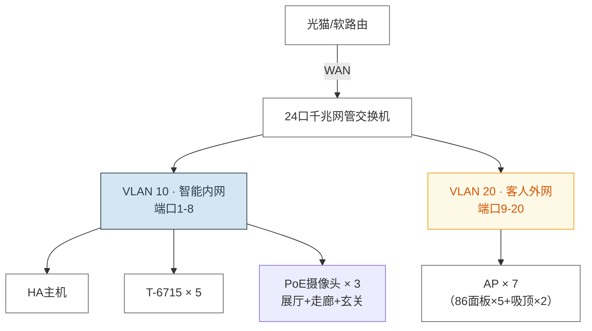

**VLAN配置表：**

| VLAN ID | 名称 | 端口分配 | 包含设备 |
|---------|------|---------|---------|
| 10 | 智能内网 | 交换机端口1-8 | HA主机、T-6715×5 |
| 20 | 客人外网 | 交换机端口9-20 | AP×7（86面板×5+吸顶AP×2）、上联软路由×1 |
| — | 管理口 | 交换机自身 | 交换机Web管理界面（分配固定IP，可设在VLAN 10内） |

### 5.2 485信号回路接线

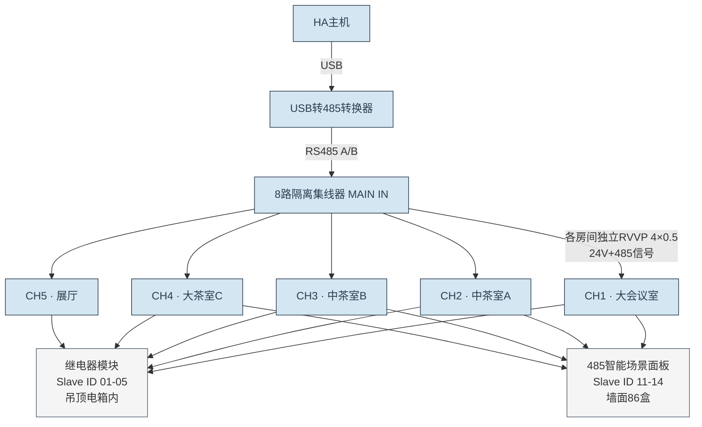

### 5.3 音频链路（分布式IP架构）

#### 5.3.1 通用房间音频链路（所有房间均适用）

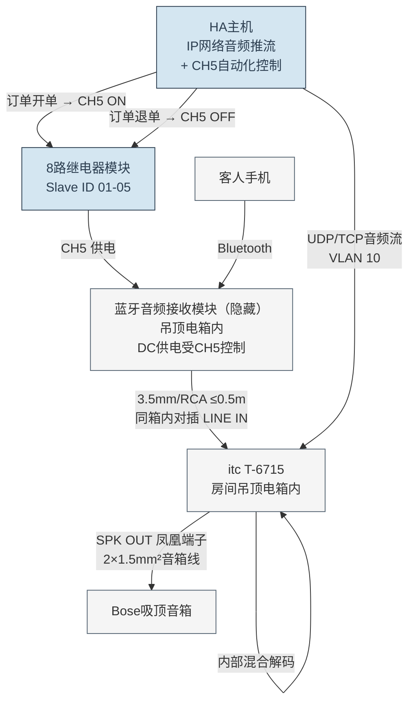

> **V1.3 架构变更**：蓝牙音频模块由86墙面面板改为**隐藏式模块（吊顶电箱内安装）**。模块DC供电受继电器CH5控制，由HA根据订单状态自动通断。订单开始时CH5 ON→模块上电→客人可搜索连接蓝牙；退单时CH5 OFF→模块物理断电→杜绝蹭连串号。详见《高岸ERP系统-Home Assistant蓝牙电源自动化配置（V1.0）》。

**立体声配置（大房间/会议室，4只音箱）：**

| T-6715输出 | 接线 | 音箱 |
|-----------|------|------|
| L+ / L-（左声道） | 1根音箱线并联 | 左声道2只Bose吸顶 |
| R+ / R-（右声道） | 1根音箱线并联 | 右声道2只Bose吸顶 |
| T-6715后台设置 | **STEREO模式** | 每路最多并2只，总功率不超额定值 |

**单音箱配置（小包间，1只音箱）：**

| 方案 | 接线 | 说明 |
|------|------|------|
| **方案A（推荐）** | L+与R+同时接音箱+，L-与R-同时接音箱- | 音箱需为**双音圈/双输入**规格，双线圈分别接收L/R信号 |
| **方案B** | 仅接L+ / L-，T-6715后台设为**MONO模式** | 普通单音圈音箱，功放内部混合为单声道输出，**严禁短接L+和R+** |

#### 5.3.2 会议室音频补充（无线话筒）

会议室T-6715额外接入无线话筒接收机：

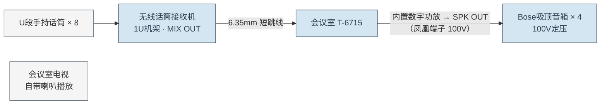

> 会议室T-6715的MIC IN接收无线话筒音频，音频信号在机内与LINE IN（蓝牙音频模块）、IP网络音频混合后，经内置数字功放从SPK OUT（100V定压）输出至吸顶音箱。MIC IN优先级高于LINE IN和IP网络音频，话筒发言时可自动闪避或混音输出（由T-6715后台设置）。LINE IN已被蓝牙音频模块占用。电脑/电视音频走HDMI到电视自带喇叭，不经过T-6715。

#### 5.3.3 HA音频推流（背景音乐 + 提示音插播）

HA主机是各房间T-6715的IP音频源，承担两种推流场景：

**场景A — 背景音乐持续播放（日常）**：HA运行音频推流服务（如Logitech Media Server、Snapcast或自建推流脚本），按房间独立推送背景音乐。各房间T-6715通过VLAN 10接收各自IP音频流，经内置数字功放从SPK OUT驱动吸顶音箱。各房间可播放不同曲目或统一播放。

**场景B — 提示音插播（倒计时/订单结束）**：当HA检测到订单倒计时结束或需通知时，HA暂停该房间的背景音乐推流，改推提示音音频流；播放完毕后恢复背景音乐。

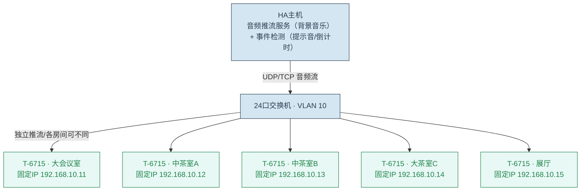

> **背景音乐流程**：① HA持续向各房间T-6715的固定IP推送背景音乐音频流（各房间独立或统一）；② T-6715自动解码，经内置数字功放从SPK OUT（100V）驱动吸顶音箱；③ 客人也可通过蓝牙连接隐藏式蓝牙音频模块，切换为手机音乐（蓝牙LINE IN优先级可配置）；④ 蓝牙模块电源由继电器CH5控制，订单结束后自动断电。

> **提示音插播流程**：① HA检测到订单倒计时结束，暂停该房间的背景音乐推流；② HA向该房间T-6715推送提示音音频流（可设置播放优先级覆盖LINE IN）；③ 提示音播放完毕，HA恢复背景音乐推流，T-6715继续播放。
>
> **IP推流优势**：精确定位到单个房间、各房间可独立播放不同曲目、提示音互不影响、无需额外音频线、不受距离限制。HA只需调用HTTP API或UDP推流命令即可切换。

### 5.4 机柜设备清单（安装顺序 上→下）

| 机柜位置 | 设备 | 高度 | 备注 |
|---------|------|------|------|
| 第1U | 24口千兆网管交换机 | **1U** | 核心网络设备，配置VLAN 10/20，可选PoE |
| 第2U | 通风盲板 | 1U | 散热隔层 |
| 第3U | HA主机（Lenovo Tiny/迷你主机） | **1U（平放于托盘）** | 运行HA主机、音频推流服务、485控制服务、存储。平放高度约35mm（<1U），放于1U托盘 |
| 第4U | 无线话筒接收机（Hyundai 1U） | **1U** | 一拖八8天线紧凑型，MIX OUT→会议室T-6715 MIC IN |
| **侧挂（不占正面U）** | 8路隔离集线器 + USB转485转换器 + 明纬24V电源 | 导轨式 | 全部侧挂安装在机柜内部侧边导轨或底板 |

> **机柜选型建议**：以上设备共占用 **4U有效空间**（正面）+ 侧挂设备。**6U机柜**（约30cm高）刚好够用，推荐 **8U机柜**（约40cm高）留有舒适理线和散热空间。标准宽600mm×深600mm，Lenovo Tiny平放深度约180mm，交换机/话筒接收机约250-300mm，600mm深足够走线。机柜可用重型支架挂墙安装，也可放置于地面。
>
> **侧挂安装说明**：隔离集线器、USB转485转换器、24V电源等采用**DIN导轨侧装**方式（导轨条固定在机柜内部侧面或后部立柱上），不占用正面面板U位。三者均为封闭式导轨模块（自带工业级防护外壳，非裸板），有机柜门保护即可，无需额外加罩。选购时认准**导轨式封装**型号，避免购买裸板/开发板版本。
>
> **设备网布线**：交换机→各房间T-6715的网线①走吊顶/管槽，每根线两端的交换机端口和T-6715侧均贴标签。

**机柜内设备排布示意图（前视图）：**

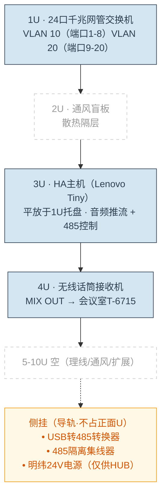


### 5.5 关于120Ω终端电阻的说明

传统RS485总线（无中继器）在长距离传输时需在首端和末端各并联1个120Ω终端电阻以消除信号反射。本例使用**8路隔离集线器**，情况如下：

- **集线器端（首端）**：多数隔离集线器每个输出端口**内置**120Ω终端电阻，可通过DIP开关或跳线启用。采购时确认型号是否自带，如已内置则无需外接。
- **末端（最远房间）**：盈隆店最长485总线仅约15米（大茶室C），信号衰减极小。隔离集线器各端口已做信号再生，末端可不接120Ω电阻也不影响通信。
- **建议**：备2个120Ω可插拔端子电阻，**仅在调试时发现通信不稳定时安装**。如各房间继电器模块和485面板均能正常轮询，可不装。

> 与普通无中继RS485不同，隔离集线器每端口独立驱动，各端口信号质量远优于手拉手拓扑。15米距离在9600 bps下即使无终端电阻也能可靠通信。

---

## 6. 房间吊顶端接线

### 6.1 吊顶电箱接线总图

每个房间门上方吊顶内安装 **HT-12位电箱（加大号，≥400×300mm）**，内部布局：

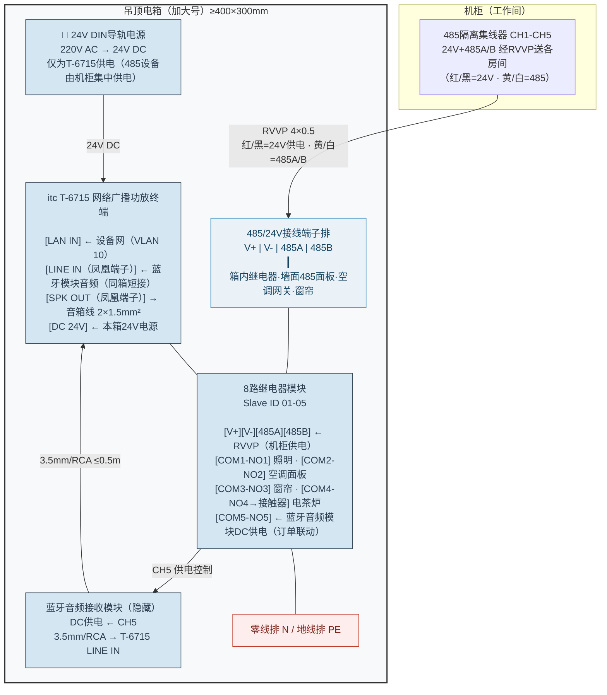

> **供电分工**：每个吊顶电箱配独立24V DIN导轨电源（如明纬HDR-30-24），但**仅为本箱T-6715供电**。485设备（继电器模块、场景面板、空调网关、窗帘电机）的24V由**机柜集中10A电源经RVVP红/黑线**提供，与485A/B信号（黄/白线）同一根线下来，在端子排上汇流分支。
>
> **蓝牙音频模块**：蓝牙模块为隐藏式安装（无墙面面板），不接485总线。模块置于吊顶电箱内，音频输出通过≤0.5m 3.5mm/RCA短线直接对插T-6715 LINE IN凤凰端子。模块DC供电由继电器CH5控制，订单开始自动上电、退单自动断电。
>
> **墙面485设备**：485场景面板、空调VRF网关、窗帘电机控制器通过墙面预埋的RVVP 4×0.5线与吊顶电箱端子排连接，从端子排取24V电源和485A/B信号。

### 6.2 吊顶电箱内接线总汇

#### 6.2.1 T-6715 网络功放接线

| T-6715接口 | 连接 | 线缆 | 说明 |
|-----------|------|------|------|
| LAN IN | 24口交换机VLAN 10端口 | 六类屏蔽网线 网线① | IP音频推流、HTTP API控制 |
| LINE IN（凤凰端子 L+/R+/COM-） | 蓝牙音频接收模块（隐藏式，吊顶电箱内）3.5mm/RCA输出 | 3.5mm/RCA对录线（≤0.5米） | 本房间蓝牙音频输入；模块DC供电受继电器CH5控制，订单开始自动上电；LINE OUT与LINE IN共享COM-，本方案未使用 |
| MIC IN | 无线话筒接收机MIX OUT（仅会议室） | 6.35mm短跳线 | 会议室话筒输入 |
| SPK OUT（凤凰端子） | Bose吸顶音箱 | 2×1.5mm²音箱线 | 100V定压输出 |
| DC 24V | 本吊顶电箱24V DIN导轨电源 | 24V供电线 | T-6715需DC 24V供电，取电自本箱独立电源 |

> T-6715的DC 24V供电由本吊顶电箱内的24V DIN导轨电源提供（与继电器模块同源），不再从总柜集中取电。

#### 6.2.2 485总线接线（485A/B信号 + 本地24V供电）

来自总柜485 HUB的RVVP 4×0.5接入吊顶电箱端子排，红/黑=24V供电、黄/白=485A/B信号，在端子排上分支供给各485设备：

| 接线端子 | 电源/信号来源 | 说明 |
|---------|-------------|------|
| 端子排 V+ → 模块 V+ | **机柜10A电源**（经RVVP红线） | DC 24V 正极（继电器模块） |
| 端子排 V+ → 面板 V+ | **机柜10A电源**（经RVVP红线） | DC 24V 正极（485场景面板） |
| 端子排 V+ → 空调网关 V+ | **机柜10A电源**（经RVVP红线） | DC 24V 正极（空调VRF网关） |
| 端子排 V+ → 窗帘 V+ | **机柜10A电源**（经RVVP红线） | DC 24V 正极（窗帘电机控制器） |
| 端子排 V- → 模块 V- | **机柜10A电源**（经RVVP黑线） | DC 24V 负极/GND |
| 端子排 V- → 面板 V- | **机柜10A电源**（经RVVP黑线） | DC 24V 负极/GND |
| 端子排 V- → 空调网关 V- | **机柜10A电源**（经RVVP黑线） | DC 24V 负极/GND |
| 端子排 V- → 窗帘 V- | **机柜10A电源**（经RVVP黑线） | DC 24V 负极/GND |
| 端子排 485A → 模块 485A | 机柜HUB（经RVVP黄线） | 485 A(D+) |
| 端子排 485A → 面板 485A | 机柜HUB（经RVVP黄线） | 485 A(D+) |
| 端子排 485A → 空调网关 485A | 机柜HUB（经RVVP黄线） | 485 A(D+) |
| 端子排 485A → 窗帘 485A | 机柜HUB（经RVVP黄线） | 485 A(D+) |
| 端子排 485B → 模块 485B | 机柜HUB（经RVVP白线） | 485 B(D-) |
| 端子排 485B → 面板 485B | 机柜HUB（经RVVP白线） | 485 B(D-) |
| 端子排 485B → 空调网关 485B | 机柜HUB（经RVVP白线） | 485 B(D-) |
| 端子排 485B → 窗帘 485B | 机柜HUB（经RVVP白线） | 485 B(D-) |

> **供电分工**：RVVP红/黑线承载24V（来自机柜10A电源），黄/白线承载485A/B信号（来自HUB），一缆四芯同时解决供电和通讯。T-6715由本箱独立24V DIN导轨电源供电，不走RVVP。
>
> **屏蔽层**：在总柜端（集线器侧）单端接地，吊顶端**悬空不接**。
>
> **模块DI端子**（DI1-DI8、GND）暂不使用。如后续需接入门磁、人体感应等干接点传感器，可使用这些预留端子。
>
> **蓝牙模块注意（V1.3变更）**：蓝牙音频模块改为**隐藏式安装（吊顶电箱内）**，不再使用86墙面面板。模块不接485总线，直接通过3.5mm/RCA短线（≤0.5米）对插T-6715 LINE IN凤凰端子。**关键变更**：模块DC供电由继电器CH5控制（不再常供电），订单开单→CH5 ON上电，退单→CH5 OFF断电。墙面不再预留蓝牙面板86盒及音频线管。

### 6.3 485智能场景面板接线（Modbus从设备）

三键六开面板是RS485总线上的Modbus RTU从设备，**非DI干接点**。接线方式：

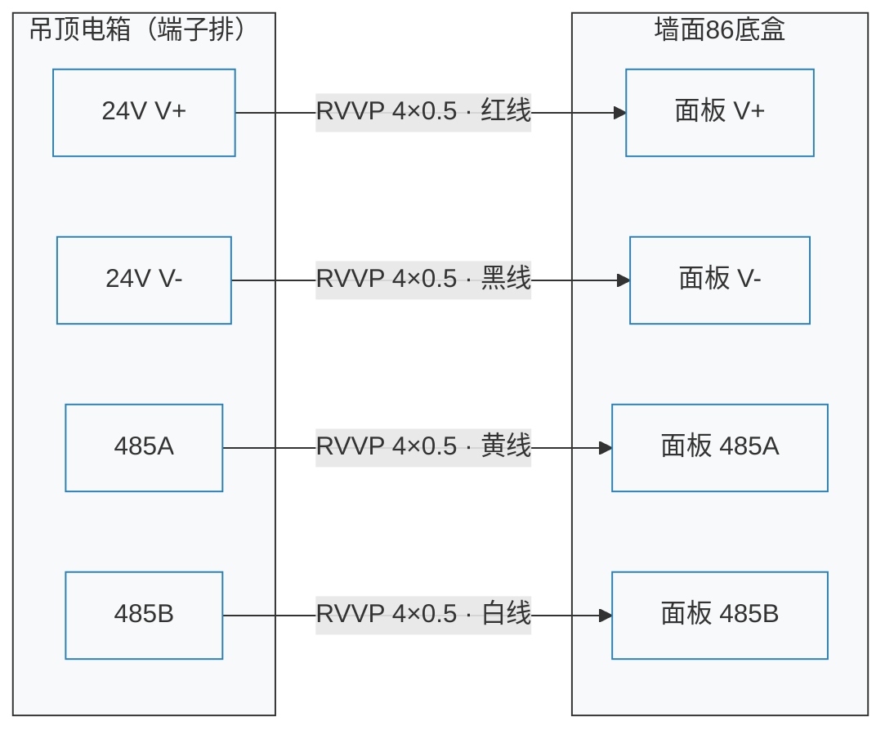

面板参数配置：

| 参数 | 值 |
|------|-----|
| 通讯协议 | Modbus RTU（与继电器模块相同） |
| 波特率 | 9600 bps（与总线一致） |
| Slave ID | 各房间独立：大会议室=11、中茶A=12、中茶B=13、大茶C=14（展厅/工作间不用） |
| 按键编程 | HA平台配置，三键分别对应：短按=场景1、双击=场景2、长按=场景3 |

> **注意**：485面板仅4间（大会议室/中茶A/B/大茶C），展厅和工作间用普通开关。485面板的A/B线必须与继电器模块的A/B线正确并联（A对A、B对B），不可交叉。
>
> 面板需在HA（ESPHome/Home Assistant）中配置实体映射，将按键事件绑定到对应继电器通道或复合场景。

### 6.4 强电侧接线（DO继电器输出分配）

#### 6.4.1 公共端COM跳线（关键）

从房间配电箱引一路220V（2.5mm²）进吊顶电箱。进线火线（L）在继电器模块各COM端之间做**硬核跳线**：

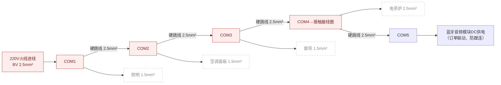

> **跳线必须使用2.5mm²铜芯硬线，端子螺丝必须完全拧死**。特别是电茶炉回路（CH4），因负载高达1500W，接触不良将导致发热烧毁。

#### 6.4.2 负载分配方案

| 通道 | 端子 | 负载 | 线径 | 备注 |
|------|------|------|------|------|
| CH1 | NO1 | 房间照明灯具 | 1.5mm² | 入墙开关物理通断 |
| CH2 | NO2 | 空调面板220V供电 | 1.5mm² | HA控制切断防止蹭空调 |
| CH3 | NO3 | 电动窗帘电机电源 | 1.5mm² | 开门自动开帘 |
| CH4 | NO4→接触器线圈 | 电茶炉1500W插座 | 2.5mm² | **推荐串联25A交流接触器**（NO4控制接触器线圈，接触器主触点供电给插座） |
| CH5 | NO5 | **蓝牙音频模块DC供电** | 根据模块规格（通常DC 5V/12V，配合降压模块） | **V1.3变更**：蓝牙模块隐藏安装在吊顶电箱内，CH5控制其电源通断。订单开单→CH5 ON上电，退单→CH5 OFF断电，从物理上杜绝蹭连串号 |
| CH6 | NO6 | 黄金备用通道 | — | 预留 |

#### 6.4.3 零线与地线

所有灯具、插座、空调面板的**零线（N）和地线（PE）不进继电器模块**，直接在吊顶电箱的零线排/地线排上汇聚：

```
220V零线进线 ──→ 零线排(N Bus) ──→ 各负载零线
220V地线进线 ──→ 地线排(PE Bus) ──→ 各负载地线
```

### 6.5 门锁系统（通通锁 + G2网关）

大会议室、中茶室A/B、大茶室C共4间入户门采用**通通锁（TT Lock）智能门锁**，通过蓝牙连接**G2网关**接入网络，实现远程下发密码、开门记录查询、与HA联动控制。展厅和工作间用普通门锁。

#### 6.5.1 设备清单

| 设备 | 数量 | 说明 |
|------|------|------|
| 通通锁智能门锁 | 4把 | 大会议室、中茶室A/B、大茶室C各一把 |
| G2网关 | 1个 | 走廊居中安装，蓝牙转WiFi，USB供电（5V/1A），单网关覆盖4间房门 |
| 普通门锁 | 2把 | 展厅、工作间 |

> G2网关蓝牙覆盖范围约10米（视墙阻隔），4间房门沿走廊排列，网关居中安装即可全部覆盖，无需多个。

#### 6.5.2 安装位置与供电

```
走廊平面示意（各房间门并排朝向走廊）：
┌──────────┐ ┌──────────┐ ┌──────────┐ ┌──────────┐
│          │ │          │ │          │ │          │
│ 大会议室  │ │ 中茶室A  │ │ 中茶室B  │ │ 大茶室C  │
│   RM001  │ │  RM002   │ │  RM003   │ │  RM004   │
└─────┬────┘ └─────┬────┘ └─────┬────┘ └─────┬────┘
      │            │            │            │
      └──────┬─────┴──────┬─────┴──────┬─────┘
             │            │            │
           [G2网关]   ← 居中安装，覆盖全部4门
           🔌USB插座
```

- G2网关安装在**走廊吊顶内**或**走廊墙面居中位置**，距最近门锁≤5米，最远≤10米
- 网关处预留一个**86型USB插座**（或五孔插座插USB充电头）
- G2网关通过WiFi连接（VLAN 20客人外网或单独IoT SSID），与通通锁云平台通讯
- HA主机通过通通锁API获取门锁状态和远程控制权限

#### 6.5.3 与HA联动场景

| 场景 | 触发 | 动作 |
|------|------|------|
| 客人到店 | 前台在通通锁APP/API下发密码 | 门锁自动生成时效密码发送至客人 |
| 首次开门 | 门锁蓝牙→G2→云平台→HA Webhook | HA触发：开灯→开空调→播放背景音乐 |
| 退房 | 前台操作 | 密码失效→HA触发：关灯→关空调→关窗帘 |
| 超时未归 | HA检测门锁状态 | 如门未锁→HA推送告警至工作人员 |

---

## 7. 安装与调试步骤

### 7.1 安装时序

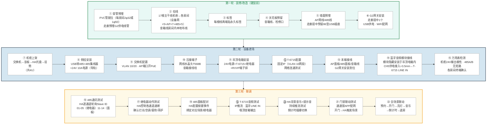

### 7.2 关键提醒（给电工师傅）

1. **强弱电严禁共管**：从总柜到各房间的屏蔽网线必须单独走PVC弱电管，**绝对不能**和220V强电线穿同一根管。
2. **24V电源正负极切勿接反**：机柜24V 10A电源经RVVP红/黑线送至各房间，开机前务必用万用表测量各房间端子排V+/V-极性正确，且与485A/B无短路。
3. **485总线同时传信号和24V**：RVVP黄/白=485A/B信号，红/黑=24V供电。各房间继电器、场景面板、空调网关、窗帘电机均从RVVP红/黑线取电（机柜集中供电）。T-6715由吊顶电箱内独立24V电源供电。
4. **485面板A/B线不可交叉**：墙面面板的485A必须对接端子排的485A，485B对接485B。接反会导致面板无法通讯。
5. **面板DI端子暂不使用**：三键六开面板通过Modbus通讯控制设备，**不接继电器模块DI端子**。继电器模块的DI端子预留供未来接门磁/人体感应。
6. **终端电阻视情安装**：隔离集线器各端口内置120Ω（通常默认启用），末端15米可不接也能正常工作。详见5.5节。
7. **电茶炉回路**：CH4的25A交流接触器**不是可选项而是强烈建议**——1500W阻性负载直接经过继电器模块端子长期运行有安全隐患。
8. **Bose音箱档位**：安装前统一拨至100V端的**8W或16W**，所有音箱保持一致。
9. **机柜散热**：交换机、HA主机和电源会产生热量，机柜门不宜密闭，建议机柜顶部或背部留通风口。
10. **T-6715固定IP配置**：每台T-6715在VLAN 10网段设置固定IP（如192.168.10.11-15），并在交换机端口绑定MAC地址，防止IP冲突。
11. **蓝牙音频模块供电（V1.3变更）**：蓝牙模块不再使用86墙面面板，改为隐藏安装在吊顶电箱内。模块DC供电由继电器CH5控制（订单开单→CH5 ON→模块上电；退单→CH5 OFF→断电）。模块与T-6715通过3.5mm/RCA短线（≤0.5米）同箱内对插。墙面不再预留蓝牙面板86盒及音频线管。
12. **G2网关安装**：安装在走廊居中位置，确保覆盖全部4间房门（最远≤10米），预留86型USB插座。WiFi连接到VLAN 20客人外网或单独IoT SSID。

---

## 8. 设备采购价格估算

以下按两种情况估算（实际以采购报价为准）。标注"已有"的设备不需购买。

### 8.1 核心硬件

| 设备 | 数量 | 全新单价 | 全新小计 | 二手单价 | 二手小计 | 备注 |
|------|------|---------|---------|---------|---------|------|
| itc T-6715 网络广播终端 | 5台 | 100 | 500 | 100 | 500 | |
| 24口千兆网管交换机 | 1台 | 800 | 800 | — | 0 | 已有，省800元 |
| 无线话筒接收机（一拖八） | 1台 | 3,000 | 3,000 | — | 0 | 已有，省3,000元 |
| HA主机（Lenovo Tiny） | 1台 | 2,000 | 2,000 | 1,000 | 1,000 | 二手约1,000 |
| Bose吸顶音箱（6.5寸定压） | 8只 | 400 | 3,200 | — | 0 | 已有，省3,200元 |
| 蓝牙音频接收模块（隐藏式） | 5个 | 50 | 250 | 40 | 200 | 蓝牙接收板+外壳，无需面板/底盒 |
| 86 AP面板（Wi-Fi 6） | 5个 | 250 | 1,250 | 150 | 750 | 建议二手 |
| 吸顶AP（Wi-Fi 6） | 2个 | 450 | 900 | — | 0 | 已有，省900元 |
| 话筒接收机延长线（5米） | 1根 | 50 | 50 | 50 | 50 | 补充 |

**小计：全新需购4,050元（若全买新约11,950元，已有设备省7,900元）/ 二手约2,500元**

### 8.2 485控制设备

| 设备 | 数量 | 全新单价 | 全新小计 | 二手单价 | 二手小计 | 备注 |
|------|------|---------|---------|---------|---------|------|
| NDR-240-24（机柜电源） | 1台 | 97 | 97 | 70 | 70 | 明纬导轨式，10A，淘宝价 |
| USB转485转换器 | 1台 | 80 | 80 | 50 | 50 | |
| 8路隔离485集线器 | 1台 | 200 | 200 | 200 | 200 | |
| 8路继电器模块 | 5个 | 200 | 1,000 | 200 | 1,000 | |
| NDR-120-24（吊顶箱用） | 5台 | 57 | 285 | 40 | 200 | 明纬导轨式，5A，淘宝价 |
| 三键六开485场景面板 | 4个 | 75 | 300 | 75 | 300 | |

**小计：全新约1,962元 / 二手约1,820元**

### 8.3 门锁系统

| 设备 | 数量 | 全新单价 | 全新小计 | 二手单价 | 二手小计 | 备注 |
|------|------|---------|---------|---------|---------|------|
| 通通锁智能门锁 | 4把 | 110 | 440 | 110 | 440 | |
| G2网关 | 1个 | 100 | 100 | 100 | 100 | |

**小计：全新约540元 / 二手约540元**

### 8.4 线材与辅材

| 项目 | 全新估价 | 二手估价 | 备注 |
|------|---------|---------|------|
| 六类屏蔽网线1箱 | 600 | 400 | |
| RVVP 4×0.5 100米 | 250 | 150 | |
| 音箱线100米 | 300 | 200 | |
| 蓝牙模块音频短线5根 | 25 | 15 | |
| 吊顶电箱（加大号）×5 | 400 | 250 | |
| 8U机柜 | 300 | 200 | |
| PVC穿线管、端子排、标签等 | 400 | 250 | |

**小计：全新约2,275元 / 二手约1,465元**

### 8.5 总预算汇总

| 类别 | 全新需购（元） | 全买新（元） | 二手（元） |
|------|--------------|------------|----------|
| 核心硬件 | 4,050 | 11,950 | 2,500 |
| 485控制设备 | 1,960 | 1,960 | 1,820 |
| 门锁系统 | 540 | 540 | 540 |
| 线材与辅材 | 2,275 | 2,275 | 1,465 |
| **总计** | **≈8,800** | **≈16,700** | **≈6,300** |

> 已有设备（交换机、话筒接收机、Bose音箱×8、吸顶AP×2）按市场价折合约**省7,900元**。
> **V1.3 蓝牙架构变更费用**：去掉86墙面蓝牙面板改用隐藏式模块（-500元全新/-200元二手），取消金属屏蔽音频线改用0.5米短对录线（-125元全新/-65元二手），合计节约约625元（全新）/265元（二手）。

> 以上为**设备材料费**估算，不含施工费。价格因品牌/渠道/批量不同会有浮动，建议向供应商询价后更新。

---

## 9. 关联文档

| 文档名称 | 文档编号 |
|---------|---------|
| 高岸ERP系统-需求说明书（V10.11） | REQ-01 |
| 高岸ERP系统-物联网设备采购与安装清单（V1.1） | IOT-01 |
| 高岸ERP系统-IoT技术实施与家庭测试方案（V1.0） | IOT-02 |
| 高岸ERP系统-系统技术架构设计（V1.0） | ARC-01 |
| 高岸ERP系统-盈隆店设备点位图（V1.0） | — |
| 高岸ERP系统-盈隆店智能音频与485总线接线示意图（V1.2） | IOT-03（Draw.io文件） |
| 高岸ERP系统-Home Assistant蓝牙电源自动化配置（V1.0） | IOT-04 |

---

## 附录

### A. RS485总线参数速查

| 参数 | 值 |
|------|-----|
| 通讯协议 | Modbus RTU（RS485） |
| 波特率 | 9600 bps（默认） |
| 数据位 | 8 |
| 停止位 | 1 |
| 校验 | 无（None） |
| 总线节点数 | 9个（5个继电器模块 + 4个485场景面板） |
| Slave ID分配 | 继电器模块：01=大会议室、02=中茶A、03=中茶B、04=大茶C、05=展厅 |
| | 485场景面板：11=大会议室、12=中茶A、13=中茶B、14=大茶C |
| 总线长度 | ≤100m（实际最长约15m，安全） |
| 终端电阻 | 隔离集线器各端口**内置**120Ω（通过DIP开关启用），末端15米可不接，详见5.5节 |

### B. 修订历史

| 版本 | 日期 | 修订人 | 修订内容 |
|------|------|-------|---------|
| V1.0 | 2026-05-16 | — | 初稿，整合音频系统与485总线系统实施指南 |
| V1.1 | 2026-05-16 | — | **重大架构变更**：废除单台6分区DSP功放方案，改为双功放架构（会议室独立功放1U + 4分区商用功放2U）；无线话筒接收机由4U改为1U紧凑型；蓝牙接收模块改为86型墙插面板+网线音频延长器回传方案；485设备改为导轨侧挂不占正面U位；新增HA提示音插播链路（EMC）；会议室音箱由2只改为4只，功放改为双通道立体声配置 |
| V1.2 | 2026-05-16 | — | **架构重构**：废除双模拟功放架构，升级为**分布式网络IP音频系统**（5 rooms × itc T-6715网络广播终端，IP网络音频分发取代模拟回传）；新增**24口千兆网管交换机**（VLAN 10智能内网/VLAN 20客人外网隔离）；每房间2根网线（设备网+AP）+ 1根485的星型拓扑；USB转485替代串口服务器；HA主机单网口；吊顶电箱加大容纳T-6715；音频线材从7类减为3类（均为房间内短距离） |
| — | 2026-05-17 | — | **补充**：大会议室音箱由2只改为4只（L+R各并2路100V），同步更新空间对应表、采购清单、线缆表、布线规范各节；修复安装时序中音箱线计数（应为房间内本地布线，非机柜拉出） |
| — | 2026-05-17 | — | **补充**：系统总览图新增强电配电（220V总电箱→分支空开→各房间）、窗帘/空调控制器、灯光/茶炉负载回路；485场景面板由6个改为4个；取消86有线网口；各房间网线改为2根（设备网+AP），展厅AP+485共2根，工作间1根；合并线材（485主干合入N1箱线，面板分支合入N2散线） |
| — | 2026-05-17 | — | **房间布局修正**：取消走廊独立房间，改为5房间布局（大会议室/中茶A/B/大茶C/展厅），各房间独立T-6715；吸顶AP合计7个（86面板×5+吸顶×2），工作间新增86AP面板；485总线降为CH1-CH5；全店线缆汇总更新；485线材统一为RVVP 4×0.5（替换SFTP/UTP）；Mermaid图同步修正；清理NAS/双网口/QNAP等残余引用 |
| — | 2026-05-17 | — | **T-6715接口修正**：LINE IN/LINE OUT从"3.5mm/RCA"改为"凤凰端子（L+/R+/COM-）"，更新全部接线描述 |
| — | 2026-05-17 | — | **电源架构重构**：废除机柜集中24V供电，改为每房间吊顶电箱独立24V DIN导轨电源（5台），485总线仅传输485A/B信号（黄/白线），红/黑线保留备用；HA主机由2U纠为1U（Lenovo Tiny平放）；机柜24V电源降为3A仅供485 HUB |
| — | 2026-05-17 | — | **新增门锁系统**：各房间配通通锁智能门锁（蓝牙），走廊部署G2网关（2-3个）接入网络，预留USB供电插座；新增HA联动场景（开门→亮灯→播放音乐） |
| — | 2026-05-17 | — | **弱电区修正**：空调VRF网关、窗帘电机控制器纳入485端子排；蓝牙面板明确为音频设备（独立走音频线不入485总线）；更新§1.2总图、§6.1接线图、§6.2.2配线表、§7.1安装时序 |
| — | 2026-05-17 | — | **新增§8设备价格估算**：核心硬件13,000-23,000元、485设备2,800-5,600元、门锁1,400-2,400元、线材3,000-5,300元，总计约20,000-36,000元（设备材料费）；原§8→§9 |
| — | 2026-05-17 | — | **§1.2总图重构**：废除单张巨型Mermaid总览图，改为"总图+分图索引"模式。总图简洁展示3大系统（IP音频/485控制/无线网络）从机柜到房间的流向；分图索引表指向§5.1/§5.2/§5.3/§5.4/§6.1等现有详细图，总图缩小约80%，可读性显著提升 |
| — | 2026-05-17 | — | **价格修正**：按实际询价下调估算，新增全新/二手双列对比。T-6715调至100元/台，交换机/话筒/Bose/吸顶AP均为已有设备（计0元），HA主机二手1,000元，蓝牙面板/AP面板建议二手，485集线器和继电器各按200元，三键六开75元/个，通通锁110元/把，G2网关100元/个，线材辅材压缩。全新总计约9,500元，二手总计约6,600元 |
| — | 2026-05-17 | — | **文档更名**：原"智能音频与485总线实施指南"更名为"IoT接线实施指南"，标题涵盖全部物联网设备（音频/485/网络/门锁/电源）；"聚英"品牌名统一去除，改为"继电器模块"
| **V1.3** | 2026-05-17 | — | **蓝牙架构变更（方案B）**：86蓝牙墙面面板 → 隐藏式蓝牙音频接收模块（吊顶电箱内安装）；模块DC供电由继电器CH5控制（订单开单→CH5 ON上电，退单→CH5 OFF断电，物理防蹭连）；音频线从3米屏蔽线缩短为0.5米同箱对录线；墙面不再预留蓝牙面板86盒及音频线管；§5.3.1音频链路图更新（增加CH5电源控制链路）；§6.4.2负载分配CH5改为蓝牙模块供电；同步更新采购清单、线材、安装时序、价格估算各节；新增关联文档《HA蓝牙电源自动化配置（V1.0）》
