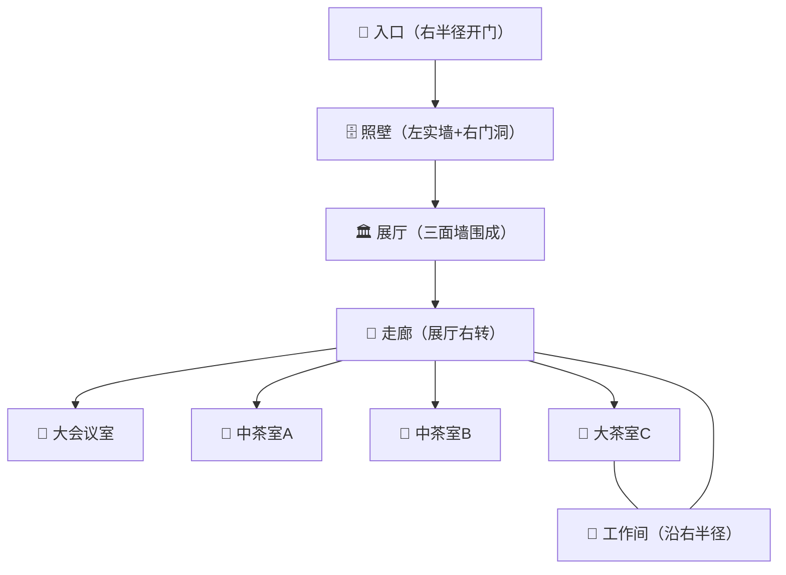

# 盈隆店IoT设备点位布局

> 基于已确认的13条布局信息，按区域列出所有设备安装位置。

---

## 一、整体流线

---

## 二、各区域设备清单

### 入口

| 设备 | 数量 | 安装位置 |
|------|------|---------|
| 智能门锁（大门） | 1把 | 大门门体（户外防水） |
| POE摄像头 | 1个 | 门上方内侧天花 |

### 展厅（三面墙：左半径墙 / 照壁背面 / 大会议室外墙）

| 设备 | 数量 | 安装位置 |
|------|------|---------|
| 吸顶AP | 1台 | 展厅天花中央（覆盖全店WiFi） |
| 吸顶音箱 | 2只 | 展厅天花对称安装 |
| 智能灯光面板 | 2个 | 展厅墙面 |
| 毫米波雷达 | 1个 | 展厅天花中央 |
| 温湿度传感器 | 1个 | 展厅墙面1.5m高（避阳光） |
| POE摄像头（前台） | 1个 | 前台收银区 |
| 聚合扫码音箱 | 1台 | 收银台 |
| 手持POS | 1台 | 收银台备用 |
| NFC标签 | 10个 | 各桌面 |

### 走廊（展厅右转进入）

| 设备 | 数量 | 安装位置 |
|------|------|---------|
| 墙面AP | 1台 | 走廊中部内墙（补充包间信号） |
| 智能灯光面板 | 3个 | 走廊分段安装 |
| POE摄像头 | 1个 | 走廊一端 |
| Zigbee网关 | 1台 | 走廊天花板中央（信号覆盖全店） |

### 大会议室（沿窗）

| 设备 | 数量 | 安装位置 |
|------|------|---------|
| 智能门锁 | 1把 | 房门 |
| RS485继电器模块 | 1个 | 检修口内（2路：灯光+排风） |
| 智能灯光面板 | 2个 | 墙面（可调光） |
| 电动窗帘电机+导轨 | 1套 | 窗位（沿弧线落地窗） |
| 吸顶音箱 | 4只 | 天花四角/四边 |
| 蓝牙接收模块 | 1个 | 检修口内 |
| 无线麦克风 | 1套 | 会议室K歌/演讲 |
| 温湿度传感器 | 1个 | 墙面（避阳光直射） |
| 毫米波雷达 | 1个 | 天花中央（无人超时告警） |
| 紧急按钮 | 1个 | 墙边易触及位置 |

### 中茶室A（沿窗）

| 设备 | 数量 | 安装位置 |
|------|------|---------|
| 智能门锁 | 1把 | 房门 |
| RS485继电器模块 | 1个 | 检修口内（灯光+排风） |
| 智能灯光面板 | 2个 | 墙面（可调光） |
| 电动窗帘电机+导轨 | 1套 | 窗位 |
| 吸顶音箱 | 1只 | 天花 |
| 蓝牙接收模块 | 1个 | 检修口内 |
| 温湿度传感器 | 1个 | 墙面 |
| 毫米波雷达 | 1个 | 天花中央 |
| 紧急按钮 | 1个 | 墙边 |

### 中茶室B（沿窗，走廊尽头偏左）

同中茶室A配置。

### 大茶室C（沿窗，走廊尽头偏右，邻工作间）

同中茶室A配置。

### 工作间（沿右半径延伸，无窗）

| 设备 | 数量 | 安装位置 |
|------|------|---------|
| HA主机（联想M720q） | 1台 | 4U机柜内 |
| 软路由（NanoPi R5S） | 1台 | 4U机柜内 |
| PoE交换机（16口千兆8口PoE） | 1台 | 4U机柜内 |
| NVR录像机（4路+4TB） | 1台 | 4U机柜内 |
| DSP矩阵（4进8出） | 1台 | 4U机柜内 |
| 定压功放（200W） | 1台 | 机柜外（散热需求） |
| 4U壁挂机柜 | 1个 | 工作间墙面 |
| UPS（山特TG1000） | 1台 | 机柜底部 |
| 12V直流电源（5A） | 1个 | 机柜内 |
| 智能灯光面板 | 1个 | 工作间墙面 |

### 全店公用（安装在其他位置）

| 设备 | 数量 | 安装位置 |
|------|------|---------|
| Zigbee网关 | 1台 | 走廊天花中央（信号覆盖） |
| VRF空调网关（中弘） | 1台 | 空调检修口（RS485直连总线） |
| RS485主控制器 | 1台 | 配电箱内（Modbus TCP） |

---

## 三、音频分区

| 分区 | 区域 | 音箱数 | 音源 |
|------|------|--------|------|
| 1区 | 展厅 | 2只 | 固定背景音乐（HA播放器） |
| 2区 | 大会议室 | 4只 | 电视音频 + 蓝牙 + 无线麦 |
| 3区 | 中茶室A | 1只 | 蓝牙（客人手机配对） |
| 4区 | 中茶室B | 1只 | 蓝牙（客人手机配对） |
| 5区 | 大茶室C | 1只 | 蓝牙（客人手机配对） |

DSP自动切换：茶室默认背景音乐→客人蓝牙配对后自动切蓝牙→断开后恢复背景音乐。

---

## 四、安装高度参考

| 设备 | 安装高度 |
|------|---------|
| 智能门锁 | 门体中心（距地约1.0-1.2m） |
| 智能灯光面板 | 墙面，距地1.3m |
| 紧急按钮 | 墙面，距地0.8m |
| 吸顶AP / 雷达 / 音箱 | 天花板 |
| 温湿度传感器 | 墙面，距地1.5m |
| POE摄像头 | 天花板或墙面高处（2.5-3m） |
| 墙面AP | 墙面，距地1.8m |
| 蓝牙接收模块 | 检修口内（天花板内） |

