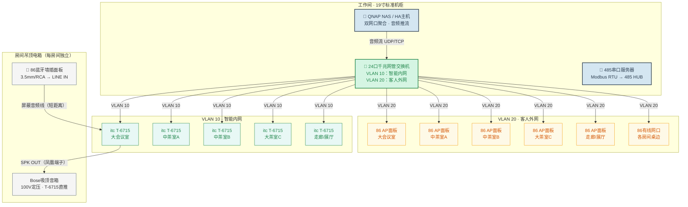

# 高岸ERP系统-盈隆店智能音频与485总线实施指南

**版本**：V1.2  
**日期**：2026年5月16日  
**文档状态**：草稿  
**编制依据**：
- 《高岸ERP系统-需求说明书（V10.11）》第六章 物联网
- 《高岸ERP系统-物联网设备采购与安装清单（V1.1）》
- 《高岸ERP系统-IoT技术实施与家庭测试方案（V1.0）》
- 盈隆店实际布局（扇形场地，90°圆心角，半径12m）
- 2026年5月16日音频系统与485总线系统设计评审第二版（分布式网络IP音频 + 24口交换机VLAN隔离 + 5房间×3网线星型拓扑）

---

## 1. 系统概述

本指南涵盖盈隆店三套强相关的弱电子系统：**分布式网络IP音频系统**（5 rooms × itc T-6715网络广播终端，IP网络音频分发）、**有线/无线网络覆盖系统**（24口千兆网管交换机+VLAN隔离，5 rooms × 3网线星型拓扑）和 **RS485总线控制系统**（6房间星型拓扑，485 HUB集线器）。三套系统均以工作间19寸标准机柜为中心，星型发散至各房间。

### 1.1 空间对应关系

| 房间编号 | 房间名称 | 485总线 CH | 音频终端 | 吸顶音箱 | 网络接口（3线/房间） | 主要被控设备 |
|---------|---------|-----------|---------|---------|-------------------|-------------|
| RM001 | 大会议室 | CH1 | itc T-6715 | 2只（立体声L/R） | 设备网+AP+有线网 | 照明×2、空调、窗帘 |
| RM002 | 中茶室A | CH2 | itc T-6715 | 1只（双音圈/单声道） | 设备网+AP+有线网 | 照明×2、空调、窗帘、排风 |
| RM003 | 中茶室B | CH3 | itc T-6715 | 1只（双音圈/单声道） | 设备网+AP+有线网 | 照明×2、空调、窗帘、排风 |
| RM004 | 大茶室C | CH4 | itc T-6715 | 1只（双音圈/单声道） | 设备网+AP+有线网 | 照明×2、空调、窗帘、排风 |
| RM005 | 走廊 | CH5 | itc T-6715 | 1只 | 设备网+AP+有线网 | 走廊照明×3 |
| RM006 | 展厅/前台 | CH6 | itc T-6715 | 1只 | 设备网+AP | 展厅照明×2 |

> **注1**：共7只Bose吸顶音箱——会议室×2（立体声L/R）+ 中茶室A/B/大茶C各×1 + 走廊×1 + 展厅×1。T-6715支持100V定压输出，各房间独立驱动。
>
> **注2**：本版采用**分布式网络IP音频架构**——5台itc T-6715网络广播终端分别部署在各房间吊顶电箱内，通过标准IP网络接收HA或QNAP NAS的音频推流。相比旧版双模拟功放方案，彻底解决了模拟音频长距离回传的损耗和串扰问题，每房间独立解码、独立音量、独立控制。

### 1.2 系统架构总览

**音频系统信号流（本指南核心）：**



> **485总线控制系统**与音频系统共用机柜和走线管槽，但信号回路完全独立。详见第5.2节（信号回路接线）和第6节（房间吊顶端接线）。
## 2. 设备购买清单

### 2.1 核心硬件

| 序号 | 设备名称 | 规格要求 | 数量 | 安装位置 | 备注 |
|------|---------|---------|------|---------|------|
| 1 | itc T-6715 网络广播功放终端 | 标准86底盒/吊顶安装，RJ45网络输入，LINE IN（3.5mm/RCA）×1，MIC IN×1，100V定压输出≥60W，支持IP网络音频解码（UDP/TCP），独立音量控制，可设置固定IP | 5台 | 各房间吊顶电箱内 | 核心音频终端，HA推流至各终端独立IP。每个房间独立解码，支持本地蓝牙面板LINE IN输入 |
| 2 | 24口千兆网管型交换机 | 24口10/100/1000Mbps，支持802.1Q VLAN、端口隔离、链路聚合，静音/低噪设计，可选PoE供电（给AP供电） | 1台 | 工作间机柜 | 核心网络设备。VLAN 10（智能内网）：T-6715×5 + NAS×1 + 485串口服务器×1；VLAN 20（客人外网）：AP×5 + 有线网口×5 |
| 3 | 无线话筒接收机 | **1U**机架式，U段一拖八，8天线，带MIX OUT混合总输出（6.35mm） | 1台 | 工作间机柜 | Hyundai或同级紧凑型。MIX OUT→会议室T-6715 MIC IN |
| 4 | QNAP NAS（或同等级私有服务器） | 双网口千兆，支持链路聚合，可运行虚拟机/容器（部署HA/Home Assistant），≥4盘位 | 1台 | 工作间机柜 | 核心算力与存储。运行HA主机、音频推流服务、485控制服务、存储监控录像 |
| 5 | Bose吸顶音箱 | 6.5寸定压吸顶音箱，支持100V端8W/16W切换 | 7只 | 各房间天花 | 会议室×2（立体声L/R）、中茶A/B/大茶C各×1、走廊×1、展厅×1 |
| 6 | 86型蓝牙音频墙插面板 | 标准86底盒安装，蓝牙5.0接收，3.5mm/RCA线路输出，DC 5V供电（可取自吊顶电箱降压模块），支持自动回连 | 5个 | 各房间墙面 | 客人手机蓝牙配对后，音频通过金属屏蔽音频线就近传入吊顶电箱T-6715的LINE IN（短距离，≤3米） |
| 7 | 86型墙面无线AP面板 | Wi-Fi 6，双频千兆，支持PoE供电或DC供电，86型面板安装 | 5个 | 各房间墙面 | 走VLAN 20，提供客人无线网络。面板式安装不占桌面空间 |
| 8 | 86型单口网络墙插面板 | 标准RJ45六类模块，86型面板 | 5个 | 各房间桌边/茶几旁 | 供客人笔记本有线接入，走VLAN 20 |

> **音频链路变化说明**：V1.2改用分布式IP架构后，音频信号流改为"HA/QNAP→IP网络→T-6715→音箱"，不再需要长距离模拟音频回传。蓝牙面板音频短距离（≤3米）屏蔽线传入本房间吊顶电箱T-6715。

### 2.2 485总线控制设备

| 序号 | 设备名称 | 规格要求 | 数量 | 安装位置 | 备注 |
|------|---------|---------|------|---------|------|
| 9 | 明纬24V开关电源 | 输入220V AC，输出24V DC，≥10A | 1台 | 工作间机柜（侧挂导轨） | 为全店485设备供电 |
| 10 | 485串口服务器（网口转485） | 1路RJ45转1路RS485，支持Modbus RTU over TCP，带隔离保护 | 1台 | 工作间机柜（侧挂导轨） | QNAP/HA通过IP网络→485串口服务器→485 HUB，替代旧版USB转485方案 |
| 11 | 8路隔离集线器（HUB） | 1路主输入转8路隔离输出，带浪涌保护 | 1台 | 工作间机柜（侧挂或0.5U托盘） | CH1-CH6对应6个房间，预留CH7-CH8备用 |
| 12 | 聚英8路联动版继电器模块（Slave） | 24V DC供电，8路继电器输出，DI干接点×8（预留），RS485通讯，Slave ID可设 | 6个 | 各房间吊顶电箱 | ID依次设为01-06 |
| 13 | HT-8位/12位吊顶电箱 | 弱电电箱，尺寸≥300×250mm，**需放大以容纳T-6715+继电器+端子排** | 6个 | 各房间门口吊顶内 | V1.2新增T-6715放入电箱，需选更大号电箱（≥400×300mm） |
| 14 | 25A交流接触器（可选） | 220V线圈，25A触点 | 4个 | 各房间吊顶电箱 | 电茶炉1500W负载保护，CH4驱动线圈 |

### 2.3 辅材配件

| 序号 | 设备名称 | 规格要求 | 数量 | 备注 |
|------|---------|---------|------|------|
| 15 | 三键六开485智能场景面板 | RS485通讯（Modbus RTU），DC 24V供电，86型底盒安装，3个物理按键支持短按/长按/组合，可编程6个场景 | 6个 | 各房间门口墙面，替代机械开关 |
| 16 | 120Ω终端电阻 | 1/4W，接线端子式，含可插拔端子 | **视情配2个** | 见5.5节关于终端匹配的说明 |
| 17 | 导轨式接线端子排 | 24V/485/零线/地线各色 | 若干 | 吊顶电箱内分线 |
| 18 | 六类屏蔽网线（SFTP） | 六类屏蔽双绞线，箱装305米 | 1箱 | 全店网络布线（5 rooms × 3根 + 公共区域 ≈ 20根 × 平均12m ≈ 240m，留余量） |
| 19 | 六类非屏蔽网线（UTP） | 六类非屏蔽，散装 | 30米 | 吊顶电箱→墙面86盒（485面板、AP面板、有线网口短跳线） |
| 20 | 金属屏蔽音频线 | 2芯+屏蔽层，3.5mm/RCA接头，长度≤3米/根 | 5根×3米 | 86蓝牙面板→T-6715 LINE IN，短距屏蔽传输 |
| 21 | 成品网络跳线 | 六类，0.5米/1米/2米若干条 | 若干 | 机柜内设备跳接至交换机 |

---

## 3. 线材购买清单

### 3.1 网络线材（主线）

| 序号 | 线材名称 | 规格要求 | 数量 | 用途 |
|------|---------|---------|------|------|
| N1 | 六类屏蔽网线（主干） | SFTP六类，每箱305米 | 1箱 | 全店网络主干：各房间设备网/AP/有线网，总用量约240米 |
| N2 | 六类非屏蔽网线（分支） | UTP六类，散装 | 30米 | 吊顶电箱→墙面86盒短跳（485面板/AP面板/有线网口），≤2米/根 |
| N3 | 成品网络跳线 | 六类，0.5m/1m/2m | 若干 | 机柜内设备→交换机，QNAP→交换机双网口聚合 |

### 3.2 音频线材

| 序号 | 线材名称 | 规格要求 | 数量 | 用途 |
|------|---------|---------|------|------|
| A1 | 吸顶音箱线 | 2×1.5平方无氧铜(OFC)阻燃双色护套音响线 | 100米/卷×1卷 | 各房间吊顶电箱T-6715→吸顶音箱，5间×3-8米/根，总长约50米 |
| A2 | 话筒MIX OUT信号线 | 6.35mm大二芯转6.35mm大二芯，0.5米 | 1根 | 无线话筒接收机MIX OUT→会议室T-6715 MIC IN（机柜内短跳） |
| A3 | 蓝牙面板音频线 | 金属屏蔽音频线，3.5mm头，**2-3米/根** | 5根 | 86蓝牙面板→本房间吊顶电箱T-6715 LINE IN（短距屏蔽传输，杜绝干扰） |

> **音频线材说明**：V1.2采用分布式IP架构，所有音频线均为房间内短距离布线（最长≤10米），不再有机柜到房间的长距离模拟音频线。长距离音频传输改为IP网络承载。

### 3.2 485总线线材

| 序号 | 线材名称 | 规格要求 | 数量 | 用途 |
|------|---------|---------|------|------|
| B1 | 超五类/六类屏蔽网线 | SFTP，每箱305米 | 1箱（305米） | 主材：总柜→各房间，电源+信号合一 |
| B2 | RVSP屏蔽双绞线（备用方案） | 2芯×0.75mm²屏蔽双绞线 | 100米 | 485信号专用（若需与电源分路） |
| B3 | BV铜芯硬线 | 2.5平方毫米，红色 | 50米 | 继电器模块COM端跳线（强电侧） |
| B4 | BV铜芯硬线 | 2.5平方毫米，蓝色 | 30米 | 零线排汇流 |
| B5 | BV铜芯硬线 | 2.5平方毫米，黄绿色 | 30米 | 地线排汇流 |
| B6 | PVC穿线管 | φ32或φ25，阻燃型 | 按需 | 天花板吊顶内预埋 |
| B7 | 弱电专用PVC穿线管 | φ20，阻燃型 | 按需 | 吊顶电箱→墙面485开关信号管 |
| B8 | 普通超五类网线（非屏蔽） | UTP，305米/箱或散装 | 30米 | 吊顶电箱→墙面485开关，取24V+485信号 |

### 3.3 每房间网线说明（3线/房间 = 15根主干）

每个房间从总机柜拉 **3根独立六类屏蔽网线**，各司其职，物理独立：

| 网线编号 | 起点 | 终点 | 网络归属 | 传输内容 | 说明 |
|---------|------|------|---------|---------|------|
| 网线①（设备网） | 总机柜24口交换机 | 房间吊顶电箱→T-6715 | VLAN 10智能内网 | 标准以太网（HA音频推流、T-6715控制） | 纯数据，不拆分线芯 |
| 网线②（无线AP） | 总机柜24口交换机 | 房间墙面86 AP面板 | VLAN 20客人外网 | 标准以太网（PoE供电+数据） | 交换机可选PoE供电 |
| 网线③（有线网） | 总机柜24口交换机 | 房间桌边86网络墙插 | VLAN 20客人外网 | 标准以太网 | 供客人笔记本有线接入 |

> **重要**：以上3根网线均为标准以太网接线（T568B线序），**不需要也不应**拆分线芯供电。485总线的24V供电和485信号走另一套屏蔽网线（见第3.4节），与网络数据物理分离。

### 3.4 485总线网线芯分配（独立于网络）

485总线使用**独立1根屏蔽网线**从总柜到各房间吊顶电箱，同时承载24V供电和485信号，接线色谱如下：

| 线芯颜色 | 信号 | 电压 | 备注 |
|---------|------|------|------|
| 橙白 | 24V V+（正极） | DC 24V | 与橙线双绞 |
| 橙 | 24V V+（正极） | DC 24V | 与橙白双绞，并联增大载流 |
| 绿白 | 24V V-（负极/GND） | DC 0V | 与绿线双绞 |
| 绿 | 24V V-（负极/GND） | DC 0V | 与绿白双绞，并联增大载流 |
| 蓝 | 485A（D+） | 信号电平 | 与蓝白双绞 |
| 蓝白 | 485B（D-） | 信号电平 | 与蓝双绞 |
| 棕 | 备用 | — | 预留 |
| 棕白 | 备用 | — | 预留 |
| 屏蔽层 | 单端接地（总柜端） | PE | 防止吊顶强电干扰 |

> **重要**：橙色对和绿色对并联使用以增大24V供电载流能力。485总线网线与网络网线物理独立，不可混淆。各房间的485网线接入485 HUB对应CH端口。

---

## 4. 走线需求（给电工交底）

### 4.1 总体原则

1. **纯星型拓扑**：所有线缆从工作间机柜位置向外辐射至各房间，**严禁在各房间之间手拉手串联**。
2. **每房间3+1根网线**：3根六类网线（设备网+AP+有线网）+ 1根485屏蔽网线（24V+485信号），加上1根音箱线，每房间至少5根独立线缆从机柜拉出。
3. **强弱电分离**：弱电线必须单独走PVC弱电管，**严禁与220V强电线共管**。
4. **网线标准568B**：所有网络网线按T568B标准压接水晶头，485网线按3.4节色谱接线。
5. **留足余量**：每根线在两端各预留30cm-50cm富余长度。
6. **标签标识**：每根线两端贴永久标签，标明"RM001-设备网"、"RM001-AP"、"RM001-有线"、"RM001-485"等。

### 4.2 各区域走线路径

每房间5根线缆从机柜直通，管径方案建议：

| 方案 | 说明 | 适用场景 |
|------|------|---------|
| **方案A**：1根φ50大管 | 5根线（3网线+1 485+1音箱线）同管，管内占比≈35% | 距离短、弯头少（如会议室3m） |
| **方案B**：2根φ32分管 | φ32管1：3根网络网线（设备网+AP+有线）；φ32管2：1根485+1根音箱线 | 距离较长、有弯头（如包间8-15m） |

> 建议优先采用**方案B**，分组走线降低穿管难度，且强弱电分离更彻底。

#### 4.2.1 工作间 → 会议室（相邻，跨距约2-3米）

天花板吊顶内预埋 **1根 φ50 PVC穿线管**（或2根φ32并管）：

| 管编号 | 内部线缆 |
|-------|---------|
| **方案A**（φ50单管） | 3根六类网线（设备网+AP+有线网）+ 1根485屏蔽网线 + 1根2×1.5mm²音箱线 |
| **方案B**（φ32×2） | 管1：3根六类网线；管2：1根485网线 + 1根音箱线 |

> **会议室T-6715接法**：无线话筒接收机MIX OUT通过短跳线接入T-6715 MIC IN；86蓝牙面板音频通过屏蔽线（≤3米）传入T-6715 LINE IN。T-6715 IP音频走VLAN 10设备网接收HA推流。电脑/电视音频可经HDMI或3.5mm接入会议室本地播放设备。

#### 4.2.2 工作间 → 中茶室A/B、大茶室C（沿走廊，跨距5-15米）

沿走廊吊顶预埋 **2根 φ32 PVC穿线管**至各房间（每房间独立一组管，不共用）：

| 管编号 | 内部线缆 |
|-------|---------|
| 管1（网络） | 3根六类屏蔽网线（设备网+AP+有线网） |
| 管2（音频+485） | 1根485屏蔽网线 + 1根2×1.5mm²音箱线 |

> 中茶室A/B、大茶C、走廊各独立一组管（2根φ32），共4组管从机柜沿走廊放射。

#### 4.2.3 工作间 → 走廊、展厅

- **走廊段**：1组管（2根φ32），内部：3网线+1 485+1音箱线 = 5根
- **展厅段**：1组管（2根φ32），内部：3网线+1 485+1音箱线 = 5根

> **展厅AP**覆盖前台区域，因靠近走廊可共用走廊AP或独立AP。

### 4.3 485智能场景面板走线（RS485总线设备）

三键六开场景面板是 **RS485 Modbus 从设备**，直接挂在485总线上，**不接继电器模块DI端子**。

走线方式：

1. 从房间门口 **吊顶电箱** 预埋 φ20弱电穿线管向下至墙面86底盒（距离1-2米）
2. 管内走 **1根普通UTP网线**（取4芯：橙/橙白=24V V+、绿/绿白=24V V-、蓝=485A、蓝白=485B）
3. 吊顶电箱内：网线接入接线端子排（与继电器模块同源：24V和485总线）
4. 墙面端：网线接至面板背后的RS485端子座

> **关键区别**：不再是干接点信号，面板是总线上的独立Modbus节点，拥有独立Slave ID。面板按键触发后通过Modbus指令控制继电器模块或HA场景。

### 4.4 音箱线布线规范

1. **5根独立音箱线**，每根从房间吊顶电箱内T-6715的SPK OUT凤凰端子直达本房间吸顶音箱：
   - 会议室：1根2×1.5mm²（2只音箱，L/R分别接入T-6715的L+和R+）
   - 中茶室A/B/大茶C/走廊/展厅：各1根2×1.5mm²（各1只音箱，若为双音圈音箱则L/R同时接入同一只）
2. 单只音箱功率档位：**统一拨至100V端的8W或16W**
3. 音箱线正负极：**红接红（+）、黑接黑（-）**，确保同相位连接

### 4.5 走线距离参考

| 路径 | 估算距离 | 管径方案 | 管内线缆数 |
|------|---------|---------|-----------|
| 机柜→会议室 | 3m | φ50×1 或 φ32×2 | 5根（3网线 + 1 485 + 1音箱线） |
| 机柜→中茶室A | 8m | φ32×2 | 管1：3根网线；管2：1 485 + 1音箱线 |
| 机柜→中茶室B | 12m | φ32×2 | 管1：3根网线；管2：1 485 + 1音箱线 |
| 机柜→大茶室C | 15m | φ32×2 | 管1：3根网线；管2：1 485 + 1音箱线 |
| 机柜→走廊 | 5m | φ32×2 | 管1：3根网线；管2：1 485 + 1音箱线 |
| 机柜→展厅 | 10m | φ32×2 | 管1：3根网线；管2：1 485 + 1音箱线 |
| 吊顶电箱→墙面85面板 | 1-2m | φ20×1 | 1根UTP网线（485面板用） |
| 吊顶电箱→墙面AP面板 | 1-2m | φ20×1 | 1根六类网线（网线②AP） |
| 吊顶电箱→桌边网口 | 2-5m | φ20×1 | 1根六类网线（网线③有线网） |
| 吊顶电箱→蓝牙面板 | 1-3m | φ20×1 | 1根金属屏蔽音频线 |
| 吊顶电箱→吸顶音箱 | 2-5m | 同管或独立 | 1根2×1.5mm²音箱线 |

---

## 5. 总弱电柜端接线

### 5.1 网络拓扑与VLAN划分

```
[光猫/软路由] ─── WAN ──→ [24口千兆网管交换机]
                                 │
                    ┌────────────┴────────────┐
                    ▼                         ▼
             VLAN 10 (智能内网)         VLAN 20 (客人外网)
                    │                         │
    ┌───────────────┼───────────────┐   ┌─────┼──────┐
    ▼               ▼               ▼   ▼     ▼      ▼
 [QNAP NAS]  [485串口服务器]  [T-6715×5]  [AP×5] [有线网口×5]
  (HA主机)        │
                  ▼
           [8路隔离集线器]
           CH1-CH6 → 各房间485总线
```

**VLAN配置表：**

| VLAN ID | 名称 | 端口分配 | 包含设备 |
|---------|------|---------|---------|
| 10 | 智能内网 | 交换机端口1-8 | QNAP NAS/HA（2口聚合）、485串口服务器×1、T-6715×5 |
| 20 | 客人外网 | 交换机端口9-20 | AP面板×5、有线网口×5、上联软路由×1、公共区域AP×1-2 |
| — | 管理口 | 交换机自身 | 交换机Web管理界面（分配固定IP，可设在VLAN 10内） |

### 5.2 485信号回路接线

```
[QNAP NAS / HA虚拟机] ─── 以太网 ──→ [24口交换机 VLAN 10]
                                              │
                                         [485串口服务器]
                                         RJ45 → RS485
                                              │
                                    A(+)/B(-) │
                                              ▼
                                     [8路隔离集线器 MAIN IN]
                                              │
                        ┌──────────────┬──────┴──────┬──────────────┐
                        ▼              ▼              ▼              ▼
                   [CH1 输出]     [CH2 输出]     [CH3-CH5]     [CH6 输出]
                        │              │              │              │
                  屏蔽网线(至各房间吊顶电箱，24V+485信号)
                        │
              ┌─────────┴──────────┐
              ▼                     ▼
       ┌──────────────┐     ┌──────────────┐
       │ 聚英继电器模块 │     │ 485智能场景面板│
       │ Slave ID 01-06│     │ Slave ID 11-16│
       │ (吊顶电箱内)   │     │ (墙面86盒)    │
       └──────────────┘     └──────────────┘
```

### 5.3 音频链路（分布式IP架构）

#### 5.3.1 通用房间音频链路（所有房间均适用）

```
[客人手机] ─── Bluetooth ──→ [86蓝牙墙插面板（墙面86盒）]
                                       │
                                 3.5mm/RCA输出
                                       │
                             金属屏蔽音频线（≤3米）
                                       │
                                       ▼
                              [itc T-6715 LINE IN]
                              （房间吊顶电箱内）
                                       │
                              ┌────────┴────────┐
                              │                  │
                          IP网络音频          本地LINE IN
                          (HA主机推流)        (蓝牙面板)
                              │                  │
                              └──────┬───────────┘
                                     ▼
                            T-6715内部混合解码
                                     │
                             SPK OUT（凤凰端子）
                                     │
                             2×1.5mm²音箱线
                                     ▼
                            Bose吸顶音箱
```

**立体声配置（大房间/会议室，2只音箱）：**

| T-6715输出 | 接线 | 音箱 |
|-----------|------|------|
| L+ / L-（左声道） | 1根音箱线 | 左1只Bose吸顶 |
| R+ / R-（右声道） | 1根音箱线 | 右1只Bose吸顶 |
| T-6715后台设置 | **STEREO模式** | 左右声道独立输出 |

**单音箱配置（小包间，1只音箱）：**

| 方案 | 接线 | 说明 |
|------|------|------|
| **方案A（推荐）** | L+与R+同时接音箱+，L-与R-同时接音箱- | 音箱需为**双音圈/双输入**规格，双线圈分别接收L/R信号 |
| **方案B** | 仅接L+ / L-，T-6715后台设为**MONO模式** | 普通单音圈音箱，功放内部混合为单声道输出，**严禁短接L+和R+** |

#### 5.3.2 会议室音频补充（无线话筒）

会议室T-6715额外接入无线话筒接收机：

```
[无线话筒接收机] ─── 6.35mm (MIX OUT) ──→ [会议室T-6715 MIC IN]
                                    ← 8支U段手持话筒

[电脑/电视音频] ─── HDMI或3.5mm ──→ [会议室本地播放设备或T-6715 LINE IN]
```

> 会议室T-6715的MIC IN优先级别高于LINE IN和IP网络音频，适合话筒广播场景。电脑/电视音频可走T-6715 LINE IN（蓝牙面板占用时通过切换）或直接走HDMI到电视自带喇叭。

#### 5.3.3 HA提示音插播（IP推流）

```
[QNAP NAS / HA主机]
         │
    UDP/TCP音频流
         │
    [24口交换机 VLAN 10]
         │
    ┌────┴────┐
    ▼         ▼
 [T-6715]  [T-6715]
 指定房间    指定房间

当HA检测到订单倒计时结束：
① HA通过UDP/TCP向目标房间T-6715的固定IP推送提示音音频流
② T-6715自动解码播放，可设置播放优先级（覆盖蓝牙LINE IN）
③ 提示音播放完毕，HA停止推流，T-6715恢复蓝牙LINE IN输入播放
```

> **IP推流优势**：相比旧版EMC模拟广播，IP推流可精确定位到单个房间、支持不同房间播放不同提示音、无需额外音频线、不受距离限制。HA只需调用HTTP API或UDP推流命令即可触发。

### 5.4 机柜设备清单（安装顺序 上→下）

| 机柜位置 | 设备 | 高度 | 备注 |
|---------|------|------|------|
| 第1U | 24口千兆网管交换机 | **1U** | 核心网络设备，配置VLAN 10/20，可选PoE |
| 第2U | 通风盲板 | 1U | 散热隔层 |
| 第3U | QNAP NAS（或同等服务器） | **2U** | 运行HA主机、音频推流服务、485控制服务、存储 |
| 第4U | 无线话筒接收机（Hyundai 1U） | **1U** | 一拖八8天线紧凑型，MIX OUT→会议室T-6715 MIC IN |
| **侧挂（不占正面U）** | 8路隔离集线器 + 485串口服务器 + 明纬24V电源 | 导轨式 | 全部侧挂安装在机柜内部侧边导轨或底板 |

> **机柜选型建议**：以上设备共占用 **5U有效空间**（正面）+ 侧挂设备。建议采购 **10U 19寸标准机柜**（约50cm高，宽600mm×深600mm），留出5U余量用于理线、散热和未来扩展。10U机柜可用重型支架挂墙安装，也可放置于地面。
>
> **侧挂安装说明**：隔离集线器、485串口服务器、24V电源等采用**DIN导轨侧装**方式（导轨条固定在机柜内部侧面或后部立柱上），不占用正面面板U位。
>
> **设备网布线**：交换机→各房间T-6715的网线①走吊顶/管槽，每根线两端的交换机端口和T-6715侧均贴标签。

**机柜内设备排布示意图（前视图）：**

```
┌──────────────────────────────┐
│  1U  [24口千兆网管交换机]     │  ← VLAN 10/20，端口1-8=智能内网，9-20=客人外网
├──────────────────────────────┤
│  2U  [通风盲板]               │  ← 散热隔层
├──────────────────────────────┤
│      ┌────────────────────┐  │
│  3-4U│ QNAP NAS (HA主机)   │  │  ← 双网口聚合，音频推流+485控制
│      │                    │  │
│      └────────────────────┘  │
├──────────────────────────────┤
│  5U  [无线话筒接收机]         │  ← MIX OUT→会议室T-6715 MIC IN（短跳线）
├──────────────────────────────┤
│  6-10U  空（理线/通风/扩展）  │  ← 预留U位，走线管理
├──────────────────────────────┤
│  侧挂: [485串口服务器]        │  ← 导轨安装，不占正面
│        [485隔离集线器]        │
│        [明纬24V电源]         │
└──────────────────────────────┘
```

### 5.5 关于120Ω终端电阻的说明

传统RS485总线（无中继器）在长距离传输时需在首端和末端各并联1个120Ω终端电阻以消除信号反射。本例使用**8路隔离集线器**，情况如下：

- **集线器端（首端）**：多数隔离集线器每个输出端口**内置**120Ω终端电阻，可通过DIP开关或跳线启用。采购时确认型号是否自带，如已内置则无需外接。
- **末端（最远房间）**：盈隆店最长485总线仅约15米（大茶室C），信号衰减极小。隔离集线器各端口已做信号再生，末端可不接120Ω电阻也不影响通信。
- **建议**：备2个120Ω可插拔端子电阻，**仅在调试时发现通信不稳定时安装**。如各房间继电器模块和485面板均能正常轮询，可不装。

> 与普通无中继RS485不同，隔离集线器每端口独立驱动，各端口信号质量远优于手拉手拓扑。15米距离在9600 bps下即使无终端电阻也能可靠通信。

---

## 6. 房间吊顶端接线

### 6.1 吊顶电箱接线总图

每个房间门上方吊顶内安装 **HT-12位电箱（加大号，≥400×300mm）**，内部布局：

```
┌──────────────────────────────────────────────────────┐
│                  吊顶电箱（加大号）                     │
│                                                        │
│  ┌──────────────────────────────────────────────────┐ │
│  │  itc T-6715 网络广播功放终端                       │ │
│  │                                                    │ │
│  │  [LAN IN] ← 网线①（设备网，来自机柜交换机VLAN 10）  │ │
│  │  [LINE IN] ← 蓝牙面板音频线（金属屏蔽线，≤3米）    │ │
│  │  [SPK OUT L+ L- R+ R-] → 音箱线                   │ │
│  │  [DC 24V] ← 明纬24V电源（或独立电源适配器）        │ │
│  └──────────────────────────────────────────────────┘ │
│                                                        │
│  ┌──────────────────────────────────────────────────┐ │
│  │  聚英8路联动版继电器模块 (Slave ID=01-06)        │ │
│  │  [V+] [V-] [485A][485B]  ← 485总线网线            │ │
│  │  [COM1→NO1] [COM2→NO2] ... [COM8→NO8]           │ │
│  │  ↓照明  ↓空调面板  ↓窗帘 ...                       │ │
│  └──────────────────────────────────────────────────┘ │
│                                                        │
│  ┌──────────────┐  ┌──────────────┐                   │
│  │ 零线排(N)    │  │ 地线排(PE)   │                   │
│  └──────────────┘  └──────────────┘                   │
│                                                        │
│  ┌──────────────────────────────────────────────────┐ │
│  │  弱电接线区（网线①②③+485线+音频线汇聚处）        │ │
│  │  ┌────┐ ┌────┐ ┌────┐ ┌────┐ ┌────┐             │ │
│  │  │V+  │ │V-  │ │485A│ │485B│ │跳线│  → 墙面设备  │ │
│  │  └────┘ └────┘ └────┘ └────┘ └────┘             │ │
│  └──────────────────────────────────────────────────┘ │
└──────────────────────────────────────────────────────┘
```

### 6.2 吊顶电箱内接线总汇

#### 6.2.1 T-6715 网络功放接线

| T-6715接口 | 连接 | 线缆 | 说明 |
|-----------|------|------|------|
| LAN IN | 24口交换机VLAN 10端口 | 六类屏蔽网线 网线① | IP音频推流、HTTP API控制 |
| LINE IN | 86蓝牙面板3.5mm/RCA输出 | 金属屏蔽音频线（≤3米） | 本房间蓝牙音频输入 |
| MIC IN | 无线话筒接收机MIX OUT（仅会议室） | 6.35mm短跳线 | 会议室话筒输入 |
| SPK OUT（凤凰端子） | Bose吸顶音箱 | 2×1.5mm²音箱线 | 100V定压输出 |
| DC 24V | 明纬24V电源或独立适配器 | 24V供电线 | T-6715需DC 24V供电 |

> T-6715的DC 24V供电可从吊顶电箱内明纬24V电源取电（与485继电器模块同源），也可单独配T-6715原装电源适配器。

#### 6.2.2 485总线接线（DC 24V + 485信号）

来自总柜的485屏蔽网线接入吊顶电箱后，24V和485信号在端子排上分支：

| 接线端子 | 网线色谱 | 说明 |
|---------|---------|------|
| 端子排 V+ → 模块 V+ | 橙+橙白（并联） | DC 24V 正极（继电器模块） |
| 端子排 V+ → 面板 V+ | 橙+橙白（并联） | DC 24V 正极（485场景面板） |
| 端子排 V- → 模块 V- | 绿+绿白（并联） | DC 24V 负极/GND |
| 端子排 V- → 面板 V- | 绿+绿白（并联） | DC 24V 负极/GND |
| 端子排 485A → 模块 485A | 蓝 | 485 A(D+) |
| 端子排 485A → 面板 485A | 蓝 | 485 A(D+) |
| 端子排 485B → 模块 485B | 蓝白 | 485 B(D-) |
| 端子排 485B → 面板 485B | 蓝白 | 485 B(D-) |

> **屏蔽层**：在总柜端（集线器侧）单端接地，吊顶端**悬空不接**。
>
> **模块DI端子**（DI1-DI8、GND）暂不使用。如后续需接入门磁、人体感应等干接点传感器，可使用这些预留端子。

### 6.3 485智能场景面板接线（Modbus从设备）

三键六开面板是RS485总线上的Modbus RTU从设备，**非DI干接点**。接线方式：

```
       吊顶电箱（端子排）                   墙面86底盒
  ┌──────────────────────┐         ┌──────────────────────┐
  │  24V V+  ────────────── UTP网线 ──────→ 面板 V+      │
  │  24V V-  ────────────── UTP网线 ──────→ 面板 V-      │
  │  485A    ────────────── UTP网线 ──────→ 面板 485A    │
  │  485B    ────────────── UTP网线 ──────→ 面板 485B    │
  └──────────────────────┘         └──────────────────────┘
```

面板参数配置：

| 参数 | 值 |
|------|-----|
| 通讯协议 | Modbus RTU（与继电器模块相同） |
| 波特率 | 9600 bps（与总线一致） |
| Slave ID | 各房间独立：会议室=11、中茶A=12、中茶B=13、大茶C=14、走廊=15、展厅=16 |
| 按键编程 | HA平台配置，三键分别对应：短按=场景1、双击=场景2、长按=场景3 |

> **注意**：485面板的A/B线必须与继电器模块的A/B线正确并联（A对A、B对B），不可交叉。
>
> 面板需在HA（ESPHome/Home Assistant）中配置实体映射，将按键事件绑定到对应继电器通道或复合场景。

### 6.4 强电侧接线（DO继电器输出分配）

#### 6.4.1 公共端COM跳线（关键）

从房间配电箱引一路220V（2.5mm²）进吊顶电箱。进线火线（L）在继电器模块各COM端之间做**硬核跳线**：

```
220V火线进线 ──→ COM1 ──硬跳线──→ COM2 ──硬跳线──→ COM3 ──硬跳线──→ COM4 ...
```

> **跳线必须使用2.5mm²铜芯硬线，端子螺丝必须完全拧死**。特别是电茶炉回路（CH4），因负载高达1500W，接触不良将导致发热烧毁。

#### 6.4.2 负载分配方案

| 通道 | 端子 | 负载 | 线径 | 备注 |
|------|------|------|------|------|
| CH1 | NO1 | 房间照明灯具 | 1.5mm² | 入墙开关物理通断 |
| CH2 | NO2 | 空调面板220V供电 | 1.5mm² | HA控制切断防止蹭空调 |
| CH3 | NO3 | 电动窗帘电机电源 | 1.5mm² | 开门自动开帘 |
| CH4 | NO4→接触器线圈 | 电茶炉1500W插座 | 2.5mm² | **推荐串联25A交流接触器**（NO4控制接触器线圈，接触器主触点供电给插座） |
| CH5 | NO5 | 吧台充电/香薰机插座 | 1.5mm² | 辅助插座控制 |
| CH6 | NO6 | 黄金备用通道 | — | 预留 |

#### 6.4.3 零线与地线

所有灯具、插座、空调面板的**零线（N）和地线（PE）不进继电器模块**，直接在吊顶电箱的零线排/地线排上汇聚：

```
220V零线进线 ──→ 零线排(N Bus) ──→ 各负载零线
220V地线进线 ──→ 地线排(PE Bus) ──→ 各负载地线
```

---

## 7. 安装与调试步骤

### 7.1 安装时序

```
第一轮（装修/改造阶段，硬装前）：
  ① 穿管预埋：所有PVC穿线管就位（每房间2根φ32或1根φ50）
  ② 拉线：5间 × 5根 = 25根主干线从机柜拉至各房间（3网线+1 485+1音箱线）
  ③ 标签：每根线两端贴永久标签，标明房间+用途
  ④ 天花板预留：音箱线、检修口预留
  ⑤ 墙面预埋：86蓝牙面板音频线、AP网线、有线网口网线、485场景面板线预埋到位

第二轮（设备进场）：
  ⑥ 机柜上架：从上到下依次为24口交换机（1U）→ 通风盲板（1U）→ QNAP NAS（2U）→ 话筒接收机（1U）
  ⑦ 侧挂安装：485串口服务器、485集线器、24V电源导轨侧挂机柜内
  ⑧ 交换机配置：创建VLAN 10和VLAN 20，分配端口
  ⑨ 压接端子：总柜端压接全部网线水晶头（T568B）、音箱线接线柱
  ⑩ 吊顶电箱安装：固定加大电箱、安装T-6715+继电器模块+端子排
  ⑪ T-6715配置：设置固定IP（VLAN 10网段），连接网线①，测试网络连通
  ⑫ 末端接线：压接各房间网线至AP面板/网口/485面板、音箱线至T-6715 SPK OUT
  ⑬ 蓝牙面板接线：屏蔽音频线→T-6715 LINE IN
  ⑭ 万用表检测：开机前测量24V极性、检查485 A/B无短路

第三轮（联调）：
  ⑮ 485通讯测试：HA主机通过串口服务器逐通道轮询Slave ID 01-06+11-16
  ⑯ 继电器动作测试：HA控制各通道开关，确认负载通断
  ⑰ 485面板配对：在HA中配置面板按键事件→绑定对应场景/继电器
  ⑱ T-6715音频测试：逐房间测试IP音频推流（HA→T-6715）、蓝牙LINE IN输入、音箱输出
  ⑲ HA提示音测试：模拟订单倒计时→HA向指定T-6715推流→确认指定房间插播
  ⑳ 全场景联动测试：模拟客人预约→开门→亮灯→播放音乐全流程
```

### 7.2 关键提醒（给电工师傅）

1. **强弱电严禁共管**：从总柜到各房间的屏蔽网线必须单独走PVC弱电管，**绝对不能**和220V强电线穿同一根管。
2. **24V电源正负极切勿接反**：开机前务必用万用表测量网线末端，确认V+/V-极性正确，且与485A/B无短路。
3. **485面板A/B线不可交叉**：墙面面板的485A必须对接端子排的485A，485B对接485B。接反会导致面板无法通讯。
4. **面板DI端子暂不使用**：三键六开面板通过Modbus通讯控制设备，**不接继电器模块DI端子**。继电器模块的DI端子预留供未来接门磁/人体感应。
5. **终端电阻视情安装**：隔离集线器各端口内置120Ω（通常默认启用），末端15米不可不接也能正常工作。详见5.5节。
6. **电茶炉回路**：CH4的25A交流接触器**不是可选项而是强烈建议**——1500W阻性负载直接经过继电器模块端子长期运行有安全隐患。
7. **Bose音箱档位**：安装前统一拨至100V端的**8W或16W**，所有音箱保持一致。
8. **机柜散热**：交换机、NAS和电源会产生热量，机柜门不宜密闭，建议机柜顶部或背部留通风口。
9. **T-6715固定IP配置**：每台T-6715在VLAN 10网段设置固定IP（如192.168.10.11-15），并在交换机端口绑定MAC地址，防止IP冲突。
10. **86蓝牙面板供电**：从吊顶电箱取24V通过降压模块转5V供面板，或使用面板自带的USB适配器。

---

## 8. 关联文档

| 文档名称 | 文档编号 |
|---------|---------|
| 高岸ERP系统-需求说明书（V10.11） | REQ-01 |
| 高岸ERP系统-物联网设备采购与安装清单（V1.1） | IOT-01 |
| 高岸ERP系统-IoT技术实施与家庭测试方案（V1.0） | IOT-02 |
| 高岸ERP系统-系统技术架构设计（V1.0） | ARC-01 |
| 高岸ERP系统-盈隆店设备点位图（V1.0） | — |
| 高岸ERP系统-盈隆店智能音频与485总线接线示意图（V1.2） | IOT-03（Draw.io文件） |

---

## 附录

### A. RS485总线参数速查

| 参数 | 值 |
|------|-----|
| 通讯协议 | Modbus RTU（RS485） |
| 波特率 | 9600 bps（默认） |
| 数据位 | 8 |
| 停止位 | 1 |
| 校验 | 无（None） |
| 总线节点数 | 12个（6个继电器模块 + 6个485场景面板） |
| Slave ID分配 | 继电器模块：01=会议室、02=中茶A、03=中茶B、04=大茶C、05=走廊、06=展厅 |
| | 485场景面板：11=会议室、12=中茶A、13=中茶B、14=大茶C、15=走廊、16=展厅 |
| 总线长度 | ≤100m（实际最长约15m，安全） |
| 终端电阻 | 隔离集线器各端口**内置**120Ω（通过DIP开关启用），末端15米可不接，详见5.5节 |

### B. 修订历史

| 版本 | 日期 | 修订人 | 修订内容 |
|------|------|-------|---------|
| V1.0 | 2026-05-16 | — | 初稿，整合音频系统与485总线系统实施指南 |
| V1.1 | 2026-05-16 | — | **重大架构变更**：废除单台6分区DSP功放方案，改为双功放架构（会议室独立功放1U + 4分区商用功放2U）；无线话筒接收机由4U改为1U紧凑型；蓝牙接收模块改为86型墙插面板+网线音频延长器回传方案；485设备改为导轨侧挂不占正面U位；新增HA提示音插播链路（EMC）；会议室音箱由2只改为4只，功放改为双通道立体声配置 |
| V1.2 | 2026-05-16 | — | **架构重构**：废除双模拟功放架构，升级为**分布式网络IP音频系统**（5 rooms × itc T-6715网络广播终端，IP网络音频分发取代模拟回传）；新增**24口千兆网管交换机**（VLAN 10智能内网/VLAN 20客人外网隔离）；每房间3根网线（设备网+AP+有线网）+ 1根485的星型拓扑；485串口服务器替代USB转485；QNAP NAS/HA主机双网口聚合；吊顶电箱加大容纳T-6715；音频线材从7类减为3类（均为房间内短距离） |
